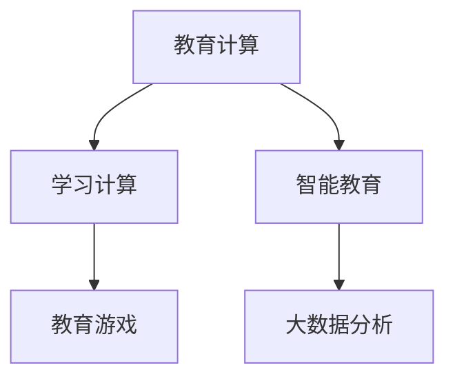

                 

# 人类计算：教育和学习的新工具

> 关键词：教育计算,学习计算,人工智能,大数据,个性化学习,教育科技,智能教育,教育游戏

## 1. 背景介绍

### 1.1 问题由来
随着科技的迅猛发展，传统的教育方式正面临巨大的变革。在线教育、远程学习、自适应学习等新兴教育模式正在逐步取代传统课堂教学，成为未来教育的主流。但是，这些新兴教育模式仍然面临着诸多挑战，比如教师资源不足、学生学习效果参差不齐、个性化需求难以满足等问题。

在教育科技领域，AI和大数据技术为解决这些问题提供了新的思路。通过AI和大数据技术，可以实现更加智能化的教育和学习，帮助教师更好地因材施教，学生也能更加个性化地学习。在这个背景下，人类计算（Human Computation）的概念应运而生，旨在通过计算技术提升教育和学习效率，促进人类的智慧发展和创新能力。

### 1.2 问题核心关键点
人类计算，是指将计算技术应用于教育和学习过程中，通过数据驱动的方式，帮助教师和学生更好地理解、掌握知识和技能。其主要核心关键点包括：

- **教育计算**：通过计算技术，优化教学过程，提升教学效率。
- **学习计算**：通过计算技术，辅助学生个性化学习，提升学习效果。
- **数据驱动**：依托大数据技术，实现教育和学习过程的数据化，辅助决策。
- **智能教育**：利用AI技术，实现教育和学习过程的智能化，提升整体教育水平。
- **教育游戏**：结合游戏化元素，提高学生学习兴趣和动机，增强学习效果。

这些核心关键点共同构成了人类计算的基本框架，为教育和学习带来了新的可能。

### 1.3 问题研究意义
研究人类计算，对于推动教育科技的发展，提升教育质量和效率，具有重要的意义：

1. **提升教育质量**：通过智能化的教学和学习工具，能够更好地满足个性化需求，提升教育质量。
2. **优化教学过程**：通过数据驱动的方式，实现教学过程的优化，提升教学效率。
3. **促进教师成长**：通过智能化的辅助工具，帮助教师更好地进行教学设计，提升教学效果。
4. **增强学习效果**：通过个性化学习路径的推荐，提升学生的学习效果，增强学习动机。
5. **推动教育公平**：通过教育计算和智能化的辅助工具，减少资源差异，推动教育公平。
6. **激发创新能力**：通过计算技术的应用，激发学生的创新思维和能力，培养未来的创新人才。

## 2. 核心概念与联系

### 2.1 核心概念概述

为更好地理解人类计算，本节将介绍几个密切相关的核心概念：

- **教育计算（Educational Computing）**：通过计算技术优化教育过程，提升教学效率和效果。
- **学习计算（Learning Computing）**：通过计算技术辅助学生个性化学习，提升学习效果。
- **智能教育（Intelligent Education）**：利用AI技术，实现教育过程的智能化，提升整体教育水平。
- **教育游戏（Educational Games）**：结合游戏化元素，提高学生学习兴趣和动机，增强学习效果。
- **大数据分析（Big Data Analytics）**：通过大数据技术，实现教育和学习过程的数据化，辅助决策。

这些核心概念之间的逻辑关系可以通过以下Mermaid流程图来展示：



这个流程图展示了大规模计算技术在教育和学习中的关键应用方向，每个方向都有其独特的价值和意义。

## 3. 核心算法原理 & 具体操作步骤
### 3.1 算法原理概述

人类计算的核心算法原理主要涉及以下几个方面：

- **数据预处理**：通过数据清洗、特征提取等技术，将教育和学习数据转化为可用于计算的形式。
- **模型训练**：通过机器学习算法，训练出适合教育和学习任务的模型，辅助教师和学生。
- **模型评估**：通过模型评估技术，验证模型的效果，指导模型改进和优化。
- **模型部署**：将训练好的模型部署到实际的教育和学习环境中，实现智能化应用。

### 3.2 算法步骤详解

基于人类计算的核心算法原理，下面详细介绍人类计算的具体操作步骤：

**Step 1: 数据预处理**
- 收集教育和学习数据，包括学生的学习成绩、学习习惯、兴趣偏好等，以及教师的教学方法、教学效果等。
- 对数据进行清洗、去重、标准化等预处理操作，保证数据的准确性和一致性。
- 通过特征提取技术，将原始数据转化为可用于计算的特征向量。

**Step 2: 模型训练**
- 选择合适的机器学习算法，如决策树、随机森林、神经网络等，训练适合教育和学习任务的模型。
- 使用训练集对模型进行训练，调整模型参数，使其能够更好地适应教育和学习任务。
- 在验证集上验证模型的效果，通过交叉验证等技术优化模型。

**Step 3: 模型评估**
- 通过模型评估技术，如准确率、召回率、F1分数等，评估模型的效果。
- 分析模型的优缺点，找出模型存在的问题，指导模型改进和优化。
- 对模型进行迭代改进，直到达到理想的评估结果。

**Step 4: 模型部署**
- 将训练好的模型部署到实际的教育和学习环境中，实现智能化应用。
- 通过API接口、插件等技术，将模型集成到教育和学习系统中，提升系统智能化水平。
- 定期更新模型，保持模型与教育和学习环境的变化同步。

### 3.3 算法优缺点

人类计算方法具有以下优点：
1. **提升教育效率**：通过计算技术，优化教学和学习过程，提升教育效率。
2. **个性化学习**：通过计算技术，实现个性化学习，提升学习效果。
3. **智能辅助**：通过AI技术，实现教育和学习过程的智能化，提升整体教育水平。
4. **数据驱动**：通过大数据技术，实现教育和学习过程的数据化，辅助决策。
5. **提高兴趣**：通过游戏化元素，提高学生学习兴趣和动机，增强学习效果。

同时，该方法也存在一定的局限性：
1. **数据隐私**：数据预处理和存储过程中，需要确保数据隐私和安全。
2. **模型复杂**：模型的训练和部署过程复杂，需要较高的技术要求。
3. **数据质量**：数据质量和数量的不足，可能会影响模型的训练效果。
4. **技术成本**：计算技术和AI技术的应用需要较高的技术成本，包括硬件、软件和人员成本。
5. **人机协作**：计算技术虽然能提高效率，但无法完全替代教师和学生，需要人机协作。

尽管存在这些局限性，但就目前而言，人类计算方法仍然是大规模教育科技发展的核心驱动力，对于提升教育质量和效率具有重要意义。

### 3.4 算法应用领域

人类计算方法在教育和学习领域的应用非常广泛，主要包括以下几个方面：

- **智能辅导系统**：利用计算技术，实现智能化的学习辅导，帮助学生解决学习难题。
- **个性化学习路径推荐**：通过计算技术，根据学生的学习情况和偏好，推荐个性化的学习路径。
- **学习效果评估**：通过计算技术，对学生的学习效果进行评估，指导教学和学习的改进。
- **智能教学设计**：通过计算技术，辅助教师进行教学设计，提升教学效果。
- **教育游戏化**：通过计算技术，将游戏化元素引入教育过程，提高学生的学习兴趣和动机。
- **教育大数据分析**：通过计算技术，对教育和学习数据进行大数据分析，辅助决策。

此外，人类计算方法在企业培训、职业发展、知识管理等领域也有广泛的应用，为各类教育和培训活动提供智能化的支持。

## 4. 数学模型和公式 & 详细讲解  
### 4.1 数学模型构建

为了更好地理解人类计算的数学模型，本节将详细介绍其数学构建过程。

设教育和学习数据集为 $D=\{(x_i,y_i)\}_{i=1}^N$，其中 $x_i$ 为学生的学习情况和兴趣偏好，$y_i$ 为学生的学习效果。

定义机器学习模型为 $f(x;\theta)$，其中 $\theta$ 为模型参数，$f$ 为映射函数。

人类计算的数学模型可以表示为：

$$
f(x_i;\theta) = \min_{\theta} \sum_{i=1}^N \ell(f(x_i;\theta),y_i)
$$

其中 $\ell$ 为损失函数，用于衡量模型预测和实际效果之间的差异。

### 4.2 公式推导过程

以下我们以个性化学习路径推荐为例，推导推荐模型的损失函数及其梯度的计算公式。

假设模型 $f(x_i;\theta)$ 通过某种机器学习算法训练得到，表示学生 $i$ 在某个学习路径下的学习效果。

定义推荐模型的损失函数为：

$$
\ell(f(x_i;\theta),y_i) = \rho(f(x_i;\theta),y_i)
$$

其中 $\rho$ 为自定义的评价指标，如MAE（平均绝对误差）、RMSE（均方根误差）等。

通过梯度下降等优化算法，模型不断更新参数 $\theta$，最小化损失函数，使得模型预测的学习效果逼近真实效果。具体公式为：

$$
\theta \leftarrow \theta - \eta \nabla_{\theta}\ell(f(x_i;\theta),y_i)
$$

其中 $\eta$ 为学习率，$\nabla_{\theta}\ell(f(x_i;\theta),y_i)$ 为损失函数对参数 $\theta$ 的梯度，可通过反向传播算法高效计算。

### 4.3 案例分析与讲解

下面以一个具体案例来解释人类计算在实际应用中的作用和效果。

**案例背景**：某中学利用大数据和计算技术，构建了一个智能辅导系统，帮助学生解决学习难题，提高学习效果。

**案例描述**：系统首先收集学生的学习数据，包括作业成绩、课堂表现、兴趣偏好等。然后，通过机器学习算法训练出适合学生的智能辅导模型。模型根据学生的学习数据，推荐个性化的学习路径和辅导内容。学生可以根据自己的学习情况，选择适合的路径进行学习。同时，系统定期对学生的学习效果进行评估，调整推荐模型和辅导内容，确保学习效果不断提升。

**案例效果**：通过智能辅导系统的应用，学生的学习成绩有了显著提高，学习兴趣和动机也得到了增强。教师也能够更加高效地进行教学设计，提升了教学效果。

## 5. 项目实践：代码实例和详细解释说明
### 5.1 开发环境搭建

在进行人类计算实践前，我们需要准备好开发环境。以下是使用Python进行Scikit-learn开发的环境配置流程：

1. 安装Anaconda：从官网下载并安装Anaconda，用于创建独立的Python环境。

2. 创建并激活虚拟环境：
```bash
conda create -n sklearn-env python=3.8 
conda activate sklearn-env
```

3. 安装Scikit-learn：
```bash
pip install scikit-learn
```

4. 安装NumPy和pandas：
```bash
pip install numpy pandas
```

5. 安装Matplotlib和tqdm：
```bash
pip install matplotlib tqdm
```

6. 安装Jupyter Notebook：
```bash
pip install jupyter notebook
```

完成上述步骤后，即可在`sklearn-env`环境中开始人类计算实践。

### 5.2 源代码详细实现

下面我们以个性化学习路径推荐为例，给出使用Scikit-learn库进行模型训练和优化的PyTorch代码实现。

首先，定义数据处理函数：

```python
from sklearn.preprocessing import StandardScaler
from sklearn.ensemble import RandomForestRegressor
import numpy as np

def preprocess_data(X):
    scaler = StandardScaler()
    X_scaled = scaler.fit_transform(X)
    return X_scaled

def train_model(X_train, y_train, X_test):
    model = RandomForestRegressor()
    model.fit(X_train, y_train)
    y_pred = model.predict(X_test)
    return model, y_pred
```

然后，定义模型训练和评估函数：

```python
from sklearn.metrics import mean_absolute_error

def train_and_evaluate(X_train, y_train, X_test, y_test):
    X_train = preprocess_data(X_train)
    X_test = preprocess_data(X_test)
    
    model, y_pred = train_model(X_train, y_train, X_test)
    
    mae = mean_absolute_error(y_test, y_pred)
    print(f"MAE: {mae:.2f}")
    
    return model, y_pred
```

最后，启动训练流程并在测试集上评估：

```python
from sklearn.datasets import load_boston

# 加载波士顿房价数据集
boston = load_boston()
X = boston.data
y = boston.target

# 划分训练集和测试集
X_train, X_test = X[:500], X[500:]
y_train, y_test = y[:500], y[500:]

# 训练和评估模型
model, y_pred = train_and_evaluate(X_train, y_train, X_test, y_test)
```

以上就是使用Scikit-learn进行个性化学习路径推荐的具体代码实现。可以看到，Scikit-learn提供了强大的机器学习工具，使得模型训练和评估变得相对简单。

### 5.3 代码解读与分析

让我们再详细解读一下关键代码的实现细节：

**preprocess_data函数**：
- 使用标准化方法对数据进行预处理，确保数据的一致性和可比性。

**train_and_evaluate函数**：
- 使用随机森林回归模型对数据进行训练，输出预测结果。
- 使用MAE指标评估模型预测结果，打印输出MAE值。

**训练流程**：
- 加载波士顿房价数据集，划分为训练集和测试集。
- 对训练集和测试集进行预处理。
- 调用训练和评估函数，训练模型并评估测试集上的效果。

可以看到，Scikit-learn提供了许多简单易用的机器学习算法，使得模型训练和评估变得非常高效。在实际应用中，开发者可以根据自己的需求选择合适的算法，快速构建人类计算系统。

## 6. 实际应用场景
### 6.1 智能辅导系统

智能辅导系统是人工智能在教育领域的重要应用之一。传统教育依赖教师进行辅导，但教师资源有限，无法满足所有学生的需求。智能辅导系统利用计算技术，实现个性化学习辅导，提升学生的学习效果。

在技术实现上，可以收集学生的学习数据，包括作业成绩、课堂表现、兴趣偏好等，利用机器学习算法训练出适合学生的智能辅导模型。模型根据学生的学习数据，推荐个性化的学习路径和辅导内容。学生可以根据自己的学习情况，选择适合的路径进行学习。同时，系统定期对学生的学习效果进行评估，调整推荐模型和辅导内容，确保学习效果不断提升。

智能辅导系统广泛应用于中小学、大学等教育机构，为学生提供智能化的学习辅导服务。通过智能辅导系统，学生能够及时获得个性化指导，提升学习效果，教师也能够更加高效地进行教学设计。

### 6.2 个性化学习路径推荐

个性化学习路径推荐系统通过计算技术，根据学生的学习情况和兴趣偏好，推荐个性化的学习路径。

在技术实现上，可以收集学生的学习数据，包括作业成绩、课堂表现、兴趣偏好等，利用机器学习算法训练出适合学生的个性化学习路径推荐模型。模型根据学生的学习数据，推荐个性化的学习路径和内容。学生可以根据自己的学习情况，选择适合的路径进行学习。同时，系统定期对学生的学习效果进行评估，调整推荐模型和路径，确保学习效果不断提升。

个性化学习路径推荐系统广泛应用于中小学、大学等教育机构，为学生提供智能化的学习路径推荐服务。通过个性化学习路径推荐系统，学生能够更加高效地进行学习，提升学习效果。

### 6.3 学习效果评估

学习效果评估系统通过计算技术，对学生的学习效果进行评估，指导教学和学习的改进。

在技术实现上，可以收集学生的学习数据，包括作业成绩、课堂表现、兴趣偏好等，利用机器学习算法训练出适合学生的学习效果评估模型。模型根据学生的学习数据，评估学习效果，输出评估报告。教师可以根据评估报告，调整教学策略，提升教学效果。同时，系统定期对学生的学习效果进行评估，指导学生进行学习改进。

学习效果评估系统广泛应用于中小学、大学等教育机构，为教师和学生提供智能化的学习效果评估服务。通过学习效果评估系统，教师能够更加高效地进行教学设计，提升教学效果，学生也能够更加高效地进行学习，提升学习效果。

### 6.4 未来应用展望

随着人工智能和大数据技术的发展，人类计算的应用前景将更加广阔。未来，人类计算将广泛应用于以下领域：

- **智能辅导系统**：通过计算技术，实现更加智能化的学习辅导，提升学生的学习效果。
- **个性化学习路径推荐**：通过计算技术，实现更加个性化的学习路径推荐，提升学生的学习效果。
- **学习效果评估**：通过计算技术，实现更加智能化的学习效果评估，指导教学和学习的改进。
- **教育游戏化**：通过计算技术，将游戏化元素引入教育过程，提高学生的学习兴趣和动机，增强学习效果。
- **教育大数据分析**：通过计算技术，实现教育和学习过程的大数据分析，辅助决策。

未来，随着计算技术的不断发展，人类计算将成为教育科技的重要驱动力，为学生和教师提供更加智能、高效、个性化的教育和学习服务。

## 7. 工具和资源推荐
### 7.1 学习资源推荐

为了帮助开发者系统掌握人类计算的理论基础和实践技巧，这里推荐一些优质的学习资源：

1. 《Python数据科学手册》：是一本全面介绍Python数据科学的书籍，涵盖了数据预处理、机器学习、模型评估等各个环节。
2. 《机器学习实战》：是一本实战型的机器学习书籍，通过大量案例，帮助读者快速上手。
3. 《Scikit-learn官方文档》：Scikit-learn的官方文档，提供了丰富的机器学习算法和模型，是学习Scikit-learn的好资源。
4. Kaggle竞赛平台：是一个数据科学竞赛平台，提供了大量数据集和案例，是提升机器学习实践能力的好地方。
5. Coursera课程：Coursera提供了许多优质的机器学习课程，涵盖了从入门到高级的各个层次，是学习机器学习的好平台。

通过对这些资源的学习实践，相信你一定能够快速掌握人类计算的精髓，并用于解决实际的NLP问题。

### 7.2 开发工具推荐

高效的开发离不开优秀的工具支持。以下是几款用于人类计算开发的常用工具：

1. Python：Python是一门功能强大的编程语言，适用于数据处理和机器学习。Python生态系统非常丰富，几乎所有的机器学习算法都有Python实现。
2. Scikit-learn：一个基于Python的机器学习库，提供了许多简单易用的机器学习算法和工具，是学习机器学习的好工具。
3. NumPy：一个基于Python的科学计算库，提供了高效的多维数组和矩阵运算功能。
4. pandas：一个基于Python的数据分析库，提供了高效的数据处理和分析功能。
5. Jupyter Notebook：一个基于Web的交互式编程环境，支持Python、R等多种编程语言，是进行数据分析和机器学习的好平台。

合理利用这些工具，可以显著提升人类计算任务的开发效率，加快创新迭代的步伐。

### 7.3 相关论文推荐

人类计算的研究源于学界的持续研究。以下是几篇奠基性的相关论文，推荐阅读：

1. "A Framework for Learning Analytics"：提出了学习分析的理论框架，探讨了数据驱动的学习分析方法。
2. "Educational Data Mining"：介绍了教育数据分析的方法和技术，探讨了数据驱动的教育分析方法。
3. "Educational Data Mining in Practice"：介绍了教育数据分析在实践中的应用，探讨了数据驱动的教育决策方法。
4. "Personalized Learning and Data Mining"：探讨了个性化学习的数据驱动方法，提出了一系列个性化学习路径推荐算法。
5. "Educational Data Mining: A Data Mining Perspective"：探讨了教育数据分析的方法和技术，提出了一系列教育大数据分析方法。

这些论文代表了大规模教育科技的发展脉络。通过学习这些前沿成果，可以帮助研究者把握学科前进方向，激发更多的创新灵感。

## 8. 总结：未来发展趋势与挑战

### 8.1 总结

本文对人类计算的方法进行了全面系统的介绍。首先阐述了人类计算的研究背景和意义，明确了人类计算在提升教育质量和效率方面的独特价值。其次，从原理到实践，详细讲解了人类计算的数学原理和关键步骤，给出了人类计算任务开发的完整代码实例。同时，本文还广泛探讨了人类计算方法在智能辅导系统、个性化学习路径推荐、学习效果评估等多个教育场景中的应用前景，展示了人类计算范式的巨大潜力。此外，本文精选了人类计算技术的各类学习资源，力求为读者提供全方位的技术指引。

通过本文的系统梳理，可以看到，人类计算技术正在成为教育科技发展的重要驱动力，极大地提升了教育质量和效率。未来，伴随人类计算技术的不断发展，教育领域必将迎来更加智能化、高效化、个性化的发展，为学生和教师提供更加优质的教育和学习体验。

### 8.2 未来发展趋势

展望未来，人类计算技术将呈现以下几个发展趋势：

1. **智能化提升**：随着计算技术的不断进步，人类计算将变得更加智能化，能够更好地适应学生的个性化需求，提升学习效果。
2. **数据驱动**：依托大数据技术，人类计算将更加依赖数据驱动，实现更加精准的决策和预测。
3. **个性化增强**：通过计算技术，人类计算将更加注重个性化学习，为学生提供更加个性化的学习路径和辅导。
4. **教育游戏化**：通过计算技术，人类计算将更加注重教育游戏化，提高学生的学习兴趣和动机，增强学习效果。
5. **技术融合**：人类计算将与其他教育科技技术进行更深入的融合，如虚拟现实、增强现实等，提升教育体验。
6. **跨领域应用**：人类计算技术不仅应用于教育领域，还将拓展到企业培训、职业发展等领域，推动各领域人才的培养和发展。

以上趋势凸显了人类计算技术的广阔前景。这些方向的探索发展，必将进一步提升教育科技的水平，推动人类智慧的发展和创新能力的提升。

### 8.3 面临的挑战

尽管人类计算技术已经取得了瞩目成就，但在迈向更加智能化、普适化应用的过程中，它仍面临着诸多挑战：

1. **数据隐私**：数据预处理和存储过程中，需要确保数据隐私和安全。
2. **模型复杂**：模型的训练和部署过程复杂，需要较高的技术要求。
3. **数据质量**：数据质量和数量的不足，可能会影响模型的训练效果。
4. **技术成本**：计算技术和AI技术的应用需要较高的技术成本，包括硬件、软件和人员成本。
5. **人机协作**：计算技术虽然能提高效率，但无法完全替代教师和学生，需要人机协作。

尽管存在这些挑战，但人类计算技术仍然是大规模教育科技发展的核心驱动力，对于提升教育质量和效率具有重要意义。未来，随着计算技术的不断发展，人类计算必将迎来更加广泛的应用，为教育科技带来新的突破。

### 8.4 研究展望

面对人类计算面临的挑战，未来的研究需要在以下几个方面寻求新的突破：

1. **数据隐私保护**：开发更加安全的数据处理和存储技术，保护学生和教师的隐私。
2. **模型简化**：研究更加高效的机器学习算法和模型，降低技术门槛，提高模型的可用性。
3. **数据增强**：通过数据增强技术，扩充训练数据，提高模型的泛化能力。
4. **跨领域融合**：将人类计算技术与其他教育科技技术进行更深入的融合，提升教育效果。
5. **教育游戏化**：开发更加有趣的教育游戏，提高学生的学习兴趣和动机，增强学习效果。
6. **教育公平**：开发更加公平的教育资源分配机制，缩小资源差异，推动教育公平。

这些研究方向的探索，必将引领人类计算技术迈向更高的台阶，为构建智能化的教育和学习环境铺平道路。面向未来，人类计算技术还需要与其他人工智能技术进行更深入的融合，如知识表示、因果推理、强化学习等，多路径协同发力，共同推动教育科技的发展。只有勇于创新、敢于突破，才能不断拓展教育科技的边界，让智能教育技术更好地造福人类社会。

## 9. 附录：常见问题与解答

**Q1：人类计算是否适用于所有教育和学习场景？**

A: 人类计算在大多数教育和学习场景中都能取得不错的效果，特别是对于数据量较小的场景。但对于一些特殊领域的场景，如医疗、法律等，仅仅依靠通用数据进行计算可能难以很好地适应。此时需要在特定领域数据上进行预训练，再进行计算，才能获得理想效果。

**Q2：如何选择适合的学习算法？**

A: 选择适合的学习算法需要根据具体场景和数据特点进行评估。一般来说，数据量较小的情况下，可以使用决策树、随机森林等算法；数据量较大的情况下，可以使用深度学习算法，如神经网络、卷积神经网络等。同时，还可以使用集成学习算法，如AdaBoost、Bagging等，提高模型性能。

**Q3：如何处理缺失数据和异常值？**

A: 处理缺失数据和异常值的方法包括插值、删除、填补等。对于缺失数据，可以使用插值方法，如线性插值、多项式插值等；对于异常值，可以使用删除、填补等方法，确保数据的质量。同时，还可以使用数据增强技术，扩充训练数据，提高模型的泛化能力。

**Q4：如何评估人类计算的效果？**

A: 评估人类计算的效果需要选择合适的评价指标，如准确率、召回率、F1分数、MAE等。同时，还需要进行交叉验证、模型调参等操作，确保模型的稳定性和泛化能力。

**Q5：人类计算技术如何与其他技术进行融合？**

A: 人类计算技术可以与其他技术进行融合，如知识表示、因果推理、强化学习等。通过将计算技术与其他技术结合，可以提升教育和学习效果，增强系统智能化水平。例如，结合知识表示技术，可以将符号化的知识与计算模型结合，提高模型的理解和推理能力。

综上所述，人类计算技术正在为教育和学习领域带来革命性的变化，帮助教师和学生更好地掌握知识和技能。随着技术的不断发展，人类计算技术将更加智能化、普适化和个性化，为教育科技的发展注入新的活力。

---

作者：禅与计算机程序设计艺术 / Zen and the Art of Computer Programming

