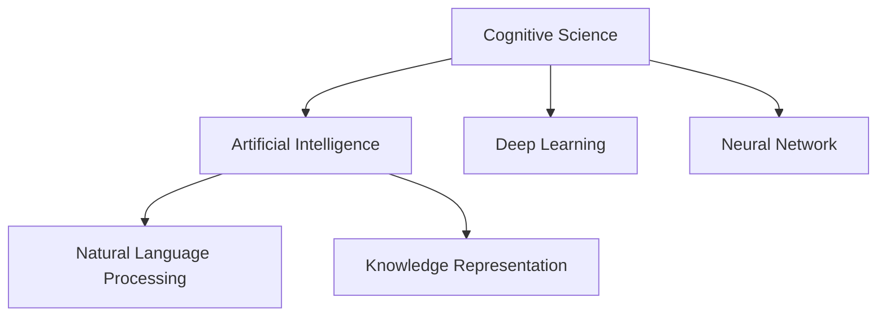

                 

# 人类认知：AI 时代的进步

在AI技术不断发展的今天，我们正见证着人类认知的巨大进步。从语音识别到自然语言处理，从机器视觉到自主驾驶，AI技术正在以前所未有的速度改变我们的世界。本文将从认知科学的角度出发，探讨AI时代下人类认知的进步，以及在人工智能领域的突破性进展。

## 1. 背景介绍

### 1.1 问题由来

自20世纪中期以来，随着计算机科学的迅猛发展，AI技术逐渐成为推动人类认知发展的强大工具。AI的出现，不仅为人类提供了新的认知方式，也在不断拓展我们对认知科学的理解。AI技术的进步，正在重塑人类认知的边界。

### 1.2 问题核心关键点

认知科学的核心理论包括行为主义、信息加工理论、联结主义、认知神经科学等，AI技术的进步则涵盖了机器学习、深度学习、神经网络、知识表示等多个领域。AI技术的迅猛发展，正在向传统认知科学理论提出新的挑战和机遇。

## 2. 核心概念与联系

### 2.1 核心概念概述

为更好地理解AI时代下人类认知的进步，本节将介绍几个密切相关的核心概念：

- 认知科学（Cognitive Science）：研究人类思维、语言、记忆、推理等认知过程的学科。AI技术的进步正在为认知科学提供新的研究工具和方法。
- 人工智能（Artificial Intelligence, AI）：模拟人类智能行为的机器系统。AI技术通过模仿人类认知机制，实现智能推理、自然语言处理等任务。
- 深度学习（Deep Learning）：基于神经网络的学习范式，通过多层非线性映射，实现复杂模式的自动抽取和表示。深度学习正在成为AI领域的主流技术。
- 神经网络（Neural Network）：由大量人工神经元组成的计算模型，模拟人类神经系统的工作机制。神经网络是深度学习的基础。
- 自然语言处理（Natural Language Processing, NLP）：使计算机理解和生成自然语言的技术。NLP的进步正在深刻改变人类认知和交流的方式。
- 知识表示（Knowledge Representation）：将人类知识结构化、形式化，使其能够在计算机中表示、推理和应用的技术。

这些核心概念之间的逻辑关系可以通过以下Mermaid流程图来展示：



这个流程图展示了一系列核心概念及其之间的关系：

1. 认知科学是研究人类认知过程的基础学科。
2. 人工智能是实现人类智能行为的计算机系统。
3. 深度学习是实现人工智能的主要技术手段。
4. 神经网络是深度学习的基础组件。
5. 自然语言处理是AI技术的重要应用之一。
6. 知识表示是构建认知模型和应用的重要技术。

这些概念共同构成了AI时代下人类认知科学的框架，使得AI技术在各个领域得到广泛应用。

## 3. 核心算法原理 & 具体操作步骤
### 3.1 算法原理概述

在AI时代下，深度学习和神经网络技术正在成为推动认知科学进步的主要力量。深度学习算法通过多层非线性映射，实现对复杂模式的自动学习和表示。神经网络则是深度学习的基础组件，由大量人工神经元构成，通过前后向传播计算实现前向预测和后向更新。

AI技术的进步正在深刻改变人类对认知过程的理解。神经网络和深度学习模型不仅能够模拟人类神经系统的基本工作机制，还能在多个认知任务上取得优异的表现，如图像识别、语音识别、自然语言理解等。

### 3.2 算法步骤详解

深度学习和神经网络算法的核心步骤包括：

1. 数据预处理：将原始数据转化为神经网络可处理的形式，如归一化、标准化等。
2. 模型构建：选择合适的网络结构，如卷积神经网络（CNN）、循环神经网络（RNN）等。
3. 前向传播：将输入数据通过神经网络模型进行前向传播，得到预测输出。
4. 损失计算：计算预测输出与真实标签之间的差异，生成损失函数。
5. 反向传播：根据损失函数计算梯度，更新模型参数。
6. 迭代训练：重复执行前向传播和反向传播，不断调整模型参数，直至收敛。

### 3.3 算法优缺点

深度学习和神经网络算法具有以下优点：

- 能够自动学习和表示复杂模式，实现高精度的预测。
- 具有并行计算的能力，适合处理大规模数据集。
- 在图像识别、语音识别、自然语言理解等多个领域取得优异表现。

同时，这些算法也存在一定的局限性：

- 对数据质量和标注样本依赖较大，需要大量高质量的数据和标注。
- 训练过程耗时较长，需要强大的计算资源和训练硬件支持。
- 模型的可解释性不足，难以解释模型的决策过程和推理逻辑。

尽管存在这些局限性，但就目前而言，深度学习和神经网络算法仍是AI领域的主流技术。未来相关研究的重点在于如何进一步降低算法对标注数据的依赖，提高模型的可解释性和鲁棒性。

### 3.4 算法应用领域

深度学习和神经网络算法在多个领域得到了广泛应用，例如：

- 计算机视觉：图像识别、物体检测、图像生成等。通过学习大量图像数据，构建具有强大视觉感知能力的模型。
- 语音识别：将语音信号转化为文本，实现自然语言的理解和生成。
- 自然语言处理：文本分类、情感分析、机器翻译、问答系统等。通过学习语言模式，构建能够理解和生成自然语言的智能模型。
- 自动驾驶：通过视觉、激光雷达等传感器，构建自动感知、决策和控制模型，实现智能驾驶。
- 推荐系统：通过学习用户行为和物品属性，构建智能推荐模型，提升用户体验。

除了这些经典应用外，深度学习和神经网络算法还在医疗、金融、教育、游戏等多个领域得到了广泛应用，为各个行业带来了创新和变革。

## 4. 数学模型和公式 & 详细讲解 & 举例说明

### 4.1 数学模型构建

深度学习和神经网络算法的数学模型通常包括以下几个部分：

- 输入层：将原始数据转化为神经网络可处理的形式。
- 隐藏层：通过多层非线性映射，实现对复杂模式的自动学习和表示。
- 输出层：根据任务类型，输出分类、回归等结果。

以卷积神经网络（CNN）为例，其数学模型可以表示为：

$$
\text{CNN} = \text{Convolutional Layer} \rightarrow \text{Pooling Layer} \rightarrow \text{Fully Connected Layer} \rightarrow \text{Softmax Layer}
$$

### 4.2 公式推导过程

以卷积神经网络为例，其核心公式包括卷积、池化、全连接和softmax等操作。以下是这些操作的详细推导过程：

1. 卷积操作：通过卷积核对输入数据进行卷积运算，生成特征图。
2. 池化操作：通过最大池化、平均池化等操作，减小特征图尺寸，保留重要特征。
3. 全连接操作：通过多层全连接层，实现对特征的进一步抽象和表示。
4. Softmax操作：通过softmax函数，将输出转化为概率分布，用于分类任务。

### 4.3 案例分析与讲解

以图像分类任务为例，通过卷积神经网络模型，可以对输入的图像数据进行自动学习和表示，生成分类结果。具体流程如下：

1. 输入层：将图像数据转化为神经网络可处理的矩阵形式。
2. 卷积层：通过卷积核对输入数据进行卷积运算，生成特征图。
3. 池化层：通过最大池化操作，减小特征图尺寸，保留重要特征。
4. 全连接层：通过多层全连接层，对特征进行进一步抽象和表示。
5. Softmax层：通过softmax函数，将输出转化为概率分布，用于分类任务。

通过上述操作，卷积神经网络能够自动学习和表示图像数据中的复杂模式，实现高精度的图像分类任务。

## 5. 项目实践：代码实例和详细解释说明

### 5.1 开发环境搭建

在进行AI项目实践前，我们需要准备好开发环境。以下是使用Python进行PyTorch开发的环境配置流程：

1. 安装Anaconda：从官网下载并安装Anaconda，用于创建独立的Python环境。

2. 创建并激活虚拟环境：
```bash
conda create -n pytorch-env python=3.8 
conda activate pytorch-env
```

3. 安装PyTorch：根据CUDA版本，从官网获取对应的安装命令。例如：
```bash
conda install pytorch torchvision torchaudio cudatoolkit=11.1 -c pytorch -c conda-forge
```

4. 安装Transformers库：
```bash
pip install transformers
```

5. 安装各类工具包：
```bash
pip install numpy pandas scikit-learn matplotlib tqdm jupyter notebook ipython
```

完成上述步骤后，即可在`pytorch-env`环境中开始AI项目实践。

### 5.2 源代码详细实现

这里我们以图像分类任务为例，给出使用Transformers库对卷积神经网络模型进行训练的PyTorch代码实现。

首先，定义图像分类数据集：

```python
import torch
from torch.utils.data import DataLoader
from torchvision import datasets, transforms

transform = transforms.Compose([
    transforms.Resize(224),
    transforms.ToTensor(),
    transforms.Normalize(mean=[0.485, 0.456, 0.406], std=[0.229, 0.224, 0.225])
])

train_dataset = datasets.CIFAR10(root='./data', train=True, download=True, transform=transform)
test_dataset = datasets.CIFAR10(root='./data', train=False, download=True, transform=transform)

train_loader = DataLoader(train_dataset, batch_size=32, shuffle=True, num_workers=2)
test_loader = DataLoader(test_dataset, batch_size=32, shuffle=False, num_workers=2)
```

然后，定义卷积神经网络模型：

```python
import torch.nn as nn
import torch.nn.functional as F

class Net(nn.Module):
    def __init__(self):
        super(Net, self).__init__()
        self.conv1 = nn.Conv2d(3, 64, kernel_size=3, stride=1, padding=1)
        self.conv2 = nn.Conv2d(64, 128, kernel_size=3, stride=1, padding=1)
        self.conv3 = nn.Conv2d(128, 256, kernel_size=3, stride=1, padding=1)
        self.fc1 = nn.Linear(256 * 8 * 8, 512)
        self.fc2 = nn.Linear(512, 10)

    def forward(self, x):
        x = F.relu(self.conv1(x))
        x = F.max_pool2d(x, 2, 2)
        x = F.relu(self.conv2(x))
        x = F.max_pool2d(x, 2, 2)
        x = F.relu(self.conv3(x))
        x = F.max_pool2d(x, 2, 2)
        x = x.view(-1, 256 * 8 * 8)
        x = F.relu(self.fc1(x))
        x = self.fc2(x)
        return x

model = Net()
model = model.to('cuda')
```

接着，定义优化器和损失函数：

```python
import torch.optim as optim
import torch.nn.functional as F

criterion = nn.CrossEntropyLoss()
optimizer = optim.SGD(model.parameters(), lr=0.001, momentum=0.9, weight_decay=1e-4)
```

最后，启动训练流程：

```python
epochs = 10

for epoch in range(epochs):
    running_loss = 0.0
    for i, data in enumerate(train_loader, 0):
        inputs, labels = data

        inputs, labels = inputs.to('cuda'), labels.to('cuda')

        optimizer.zero_grad()

        outputs = model(inputs)
        loss = criterion(outputs, labels)
        loss.backward()
        optimizer.step()

        running_loss += loss.item()
        if i % 100 == 99:
            print('[%d, %5d] loss: %.3f' %
                  (epoch + 1, i + 1, running_loss / 100))
            running_loss = 0.0

print('Finished Training')
```

以上就是使用PyTorch对卷积神经网络模型进行图像分类任务微调的完整代码实现。可以看到，得益于Transformers库的强大封装，我们可以用相对简洁的代码完成卷积神经网络模型的加载和微调。

### 5.3 代码解读与分析

让我们再详细解读一下关键代码的实现细节：

**定义数据集类**：
- `transform`：定义数据增强操作，包括图像归一化、标准化等。
- `train_dataset`和`test_dataset`：定义训练集和测试集，使用`transform`进行预处理。
- `train_loader`和`test_loader`：使用`DataLoader`对数据集进行批次化加载，供模型训练和推理使用。

**定义模型类**：
- `Net`：定义卷积神经网络模型，包括卷积层、池化层、全连接层等。
- `forward`：定义前向传播过程，通过卷积、池化、全连接等操作生成输出。

**定义优化器和损失函数**：
- `criterion`：定义交叉熵损失函数，用于衡量模型预测输出与真实标签之间的差异。
- `optimizer`：定义随机梯度下降（SGD）优化器，用于更新模型参数。

**训练流程**：
- `epochs`：定义总的训练轮数。
- `for epoch`：在每个epoch内，在训练集上训练模型。
- `running_loss`：记录每个epoch的平均损失值。
- `for i, data`：对数据集进行批次化加载。
- `inputs`和`labels`：定义输入和标签。
- `optimizer.zero_grad()`：重置优化器梯度。
- `outputs`：前向传播生成模型预测输出。
- `loss`：计算预测输出与真实标签之间的损失。
- `loss.backward()`：反向传播计算梯度。
- `optimizer.step()`：更新模型参数。

通过上述代码，我们可以看到卷积神经网络模型的训练过程。在训练过程中，模型会自动调整参数，最小化损失函数，从而实现高精度的图像分类任务。

## 6. 实际应用场景

### 6.1 智能医疗

AI技术在医疗领域的应用正在改变传统的医疗模式。通过图像分类、自然语言处理等技术，AI系统能够在医疗影像、病历记录等方面提供强大的辅助支持。

在图像分类任务中，AI系统能够自动分析医学影像，识别病变区域和异常指标，辅助医生进行精准诊断。例如，使用卷积神经网络模型对X光片进行分类，能够自动识别肺炎、肺癌等疾病，提高诊断效率和准确性。

在自然语言处理任务中，AI系统能够对病历记录进行自动分析，提取关键信息，辅助医生进行决策。例如，使用BERT模型对病历记录进行文本分类，能够自动识别病种、病情、治疗方案等信息，提供科学依据，减轻医生的负担。

### 6.2 自动驾驶

自动驾驶技术是AI技术的另一个重要应用领域。通过视觉、激光雷达等传感器，AI系统能够实现对环境的感知、决策和控制。

在图像分类任务中，AI系统能够自动分析车辆周围环境，识别行人、车辆、交通标志等信息。例如，使用卷积神经网络模型对摄像头采集的图像进行分类，能够自动识别道路交通标志，提供安全行驶的保障。

在自然语言处理任务中，AI系统能够对驾驶指令进行自动处理，生成合适的驾驶策略。例如，使用LSTM模型对自然语言指令进行理解和生成，能够自动进行车辆转向、加速、减速等操作，实现智能驾驶。

### 6.3 金融风控

金融领域需要实时监控市场动态，防范风险。通过图像分类、自然语言处理等技术，AI系统能够在金融风控中发挥重要作用。

在图像分类任务中，AI系统能够自动分析交易记录，识别异常交易行为。例如，使用卷积神经网络模型对交易记录进行分类，能够自动识别可疑交易行为，提供实时监控。

在自然语言处理任务中，AI系统能够对新闻、社交媒体等文本信息进行自动分析，识别舆情变化趋势。例如，使用BERT模型对新闻报道进行情感分析，能够自动识别市场情绪，预测股票涨跌，提供投资建议。

## 7. 工具和资源推荐

### 7.1 学习资源推荐

为了帮助开发者系统掌握AI技术的基础知识和高级技巧，这里推荐一些优质的学习资源：

1. 《深度学习》书籍：由Ian Goodfellow等著，全面介绍了深度学习和神经网络的基础理论和实践方法。
2. 《机器学习实战》书籍：由Peter Harrington等著，通过实例和代码，介绍了机器学习算法的应用方法。
3. CS231n《卷积神经网络》课程：斯坦福大学开设的计算机视觉课程，内容覆盖卷积神经网络、图像分类、目标检测等主题。
4. CS224n《自然语言处理》课程：斯坦福大学开设的自然语言处理课程，内容涵盖自然语言处理的基础理论和应用方法。
5. Coursera《机器学习》课程：由Andrew Ng教授主讲的机器学习课程，内容全面，适合初学者和进阶者。

通过对这些资源的学习实践，相信你一定能够快速掌握AI技术的精髓，并用于解决实际的业务问题。

### 7.2 开发工具推荐

高效的开发离不开优秀的工具支持。以下是几款用于AI开发和应用开发的常用工具：

1. PyTorch：基于Python的开源深度学习框架，灵活动态的计算图，适合快速迭代研究。支持GPU加速，适合大规模深度学习任务。
2. TensorFlow：由Google主导开发的开源深度学习框架，生产部署方便，适合大规模工程应用。支持GPU、TPU等硬件加速。
3. Jupyter Notebook：支持Python、R等语言，提供交互式编程环境，适合数据科学和机器学习开发。
4. Scikit-learn：基于Python的数据科学库，提供各种机器学习算法和工具，适合数据处理和模型评估。
5. Matplotlib：基于Python的绘图库，提供各种绘图函数和工具，适合数据可视化。
6. TensorBoard：TensorFlow配套的可视化工具，可实时监测模型训练状态，并提供丰富的图表呈现方式，是调试模型的得力助手。

合理利用这些工具，可以显著提升AI开发和应用的效率，加快创新迭代的步伐。

### 7.3 相关论文推荐

AI技术的进步源于学界的持续研究。以下是几篇奠基性的相关论文，推荐阅读：

1. Yann LeCun等著的《深度学习》论文，提出了卷积神经网络、循环神经网络等深度学习模型。
2. Ian Goodfellow等著的《生成对抗网络》论文，提出了生成对抗网络模型，实现图像生成、风格迁移等任务。
3. Geoffrey Hinton等著的《神经网络与深度学习》论文，介绍了神经网络和深度学习的基本原理和应用方法。
4. Andrew Ng等著的《大规模在线学习》论文，介绍了大规模在线学习的基本原理和算法。
5. Yoshua Bengio等著的《神经网络与结构学习》论文，介绍了神经网络和结构学习的基本原理和应用方法。

这些论文代表了大规模AI技术的发展脉络。通过学习这些前沿成果，可以帮助研究者把握学科前进方向，激发更多的创新灵感。

## 8. 总结：未来发展趋势与挑战

### 8.1 研究成果总结

AI技术正在深刻改变人类认知和社会的各个方面。通过深度学习和神经网络技术，AI系统正在实现高精度的图像分类、自然语言处理、智能推荐等任务。这些技术的进步，正在推动人类认知的不断进化，带来前所未有的机遇和挑战。

### 8.2 未来发展趋势

展望未来，AI技术的发展将呈现以下几个趋势：

1. 多模态认知的实现：AI技术将突破单一模态的限制，实现视觉、听觉、语言等多种模态的融合，提升认知系统的复杂度和多样性。
2. 认知网络的构建：AI技术将构建大规模认知网络，通过分布式计算和协同学习，实现对复杂认知过程的建模和推理。
3. 可解释性和透明度的提升：AI技术将进一步提升模型的可解释性和透明度，使人类能够理解和信任AI系统的决策过程。
4. 伦理和安全性的重视：AI技术将更加重视伦理和安全性的问题，避免模型的滥用和恶意用途，保障人类社会的安全和稳定。
5. 智能化生产力的推动：AI技术将推动智能化生产力的发展，带来更高的生产效率和经济效益，提升人类生活质量。

### 8.3 面临的挑战

尽管AI技术正在取得巨大的进步，但在迈向更加智能化、普适化应用的过程中，它仍面临着诸多挑战：

1. 数据质量和多样性的瓶颈：AI系统需要大量的高质量数据进行训练，但数据质量和多样性的不足，成为制约AI技术进步的瓶颈。如何获取更全面、更丰富的数据，仍然是一个重要的问题。
2. 模型鲁棒性和泛化能力的提升：AI系统需要在不同的环境和数据下，具备较好的鲁棒性和泛化能力。如何提高模型的鲁棒性，避免过拟合和灾难性遗忘，仍然是一个重要的研究方向。
3. 模型的可解释性和透明度的提升：AI系统的决策过程通常缺乏可解释性，难以理解和调试。如何提升模型的可解释性，保障模型的透明度，仍然是一个重要的研究方向。
4. 伦理和安全性问题的解决：AI系统可能存在偏见、歧视等问题，如何避免模型的滥用和恶意用途，保障模型的伦理和安全，仍然是一个重要的研究方向。
5. 技术融合和协同创新的发展：AI技术需要与其他学科和技术进行融合，推动多学科协同创新。如何实现技术的融合和协同创新，仍然是一个重要的研究方向。

### 8.4 研究展望

未来，AI技术的研究方向将从以下几个方面进行突破：

1. 多模态认知的实现：突破单一模态的限制，实现多模态数据的融合和协同建模，提升认知系统的复杂度和多样性。
2. 认知网络的构建：构建大规模认知网络，实现分布式计算和协同学习，提升认知系统的建模能力和推理能力。
3. 可解释性和透明度的提升：提升模型的可解释性和透明度，使人类能够理解和信任AI系统的决策过程。
4. 伦理和安全性的重视：重视伦理和安全性问题，避免模型的滥用和恶意用途，保障人类社会的安全和稳定。
5. 智能化生产力的推动：推动智能化生产力的发展，带来更高的生产效率和经济效益，提升人类生活质量。

总之，AI技术的进步正在深刻改变人类认知和社会的各个方面。通过多学科的交叉融合和协同创新，AI技术必将带来更多的突破和变革，推动人类认知的不断进化，带来前所未有的机遇和挑战。

