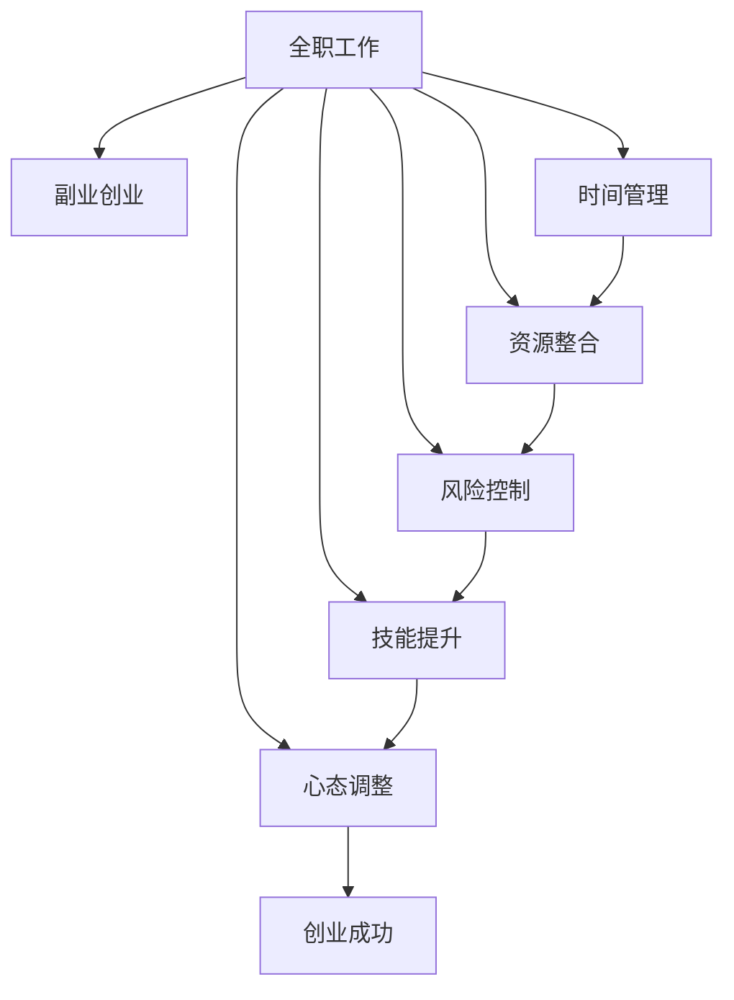

                 

## 1. 背景介绍

### 1.1 问题由来
在现代职业发展中，许多人面临着职业生涯的双重压力：一方面，追求稳定和职业发展；另一方面，渴望实现个人兴趣和梦想。对于已经拥有一份全职工作的人来说，如何在不影响现有职责的同时，拓展副业并逐步过渡到创业，成为许多人面临的现实问题。本文旨在探讨如何有效地从全职工作过渡到副业创业，提供切实可行的策略和建议。

### 1.2 问题核心关键点
从全职工作过渡到副业创业，需要关注的核心关键点包括：
- 时间管理：如何在全职工作与副业创业之间平衡时间。
- 资源整合：如何利用现有资源和人力支持副业发展。
- 风险控制：如何在过渡期保持财务稳定和健康。
- 技能提升：如何在副业创业中不断提升自己的技能和知识。
- 心态调整：如何面对初期的挫折和失败，保持积极的心态。

## 2. 核心概念与联系

### 2.1 核心概念概述
在探讨如何从全职工作过渡到副业创业时，涉及的关键概念包括：

- **全职工作**：指有固定时间、地点和职责的正式工作，通常提供稳定的收入和职业发展路径。
- **副业创业**：指在保持全职工作的同时，利用业余时间发展个人兴趣或商业机会，逐步积累经验，最终实现独立创业。
- **时间管理**：指合理安排时间，以高效完成任务和项目，保持工作和生活的平衡。
- **资源整合**：指整合现有资源，包括资金、人力、技术等，以支持副业的发展。
- **风险控制**：指评估和管理创业过程中可能遇到的风险，以保持财务和职业的稳定。
- **技能提升**：指在副业创业过程中，通过学习新知识和技能，提升自身的综合能力。
- **心态调整**：指在面对挑战和困难时，保持积极的心态，持续努力和适应变化。

这些概念通过时间、资源、风险、技能、心态等维度，形成一个综合的系统，指导从全职工作到副业创业的过渡。

### 2.2 核心概念原理和架构的 Mermaid 流程图



这个流程图展示了从全职工作过渡到副业创业的逻辑路径，通过时间管理、资源整合、风险控制、技能提升和心态调整，逐步实现创业成功。

## 3. 核心算法原理 & 具体操作步骤

### 3.1 算法原理概述
从全职工作到副业创业的过渡，本质上是一个多目标优化的过程，涉及时间、资源、风险、技能和心态等多个变量的综合管理。

设目标函数 $F$ 为从全职工作到副业创业的整体优化目标，包括时间效率、资源利用率、风险可控性、技能提升度和心态稳定性。通过数学优化算法，如线性规划、多目标优化等，求解目标函数的最优解。

### 3.2 算法步骤详解
1. **确定目标函数**：明确从全职工作到副业创业的主要目标和指标，如时间分配比例、收入增长率、风险承受能力、技能提升率、心态满意度等。
2. **建模与求解**：使用数学模型表示目标函数和约束条件，使用优化算法求解最优解。
3. **迭代与调整**：根据实际情况，迭代优化目标函数和约束条件，调整具体策略和措施。
4. **评估与反馈**：定期评估过渡过程中的进展和效果，根据反馈调整策略。

### 3.3 算法优缺点
- **优点**：系统化地管理从全职工作到副业创业的全过程，确保各个方面的平衡和优化。
- **缺点**：算法复杂，需要具备一定的数学和编程基础；可能需要较长时间才能找到最优解。

### 3.4 算法应用领域
从全职工作到副业创业的过渡算法，可以应用于各种职业发展场景，包括但不限于：
- 从事技术、设计、管理等领域的职业人士。
- 追求职业多样化、创业梦想的个人。
- 希望在保持现有工作稳定的同时，尝试新的商业机会和挑战。

## 4. 数学模型和公式 & 详细讲解 & 举例说明

### 4.1 数学模型构建
设 $T$ 为总时间，$C$ 为全职工作的收入，$B$ 为副业创业的收入，$S$ 为技能提升率，$R$ 为风险承受度，$H$ 为心态满意度。目标函数 $F$ 可以表示为：

$$
F(T, C, B, S, R, H) = \min_{t_1, t_2, r_1, r_2, s_1, s_2, h_1, h_2} \big( f_1(t_1, t_2, r_1, r_2, s_1, s_2, h_1, h_2) + f_2(t_1, t_2, r_1, r_2, s_1, s_2, h_1, h_2) \big)
$$

其中，$f_1$ 和 $f_2$ 分别代表全职工作和副业创业的目标函数，$t_1, t_2$ 分别代表全职工作和副业创业的时间分配，$r_1, r_2$ 分别代表全职工作和副业创业的风险控制，$s_1, s_2$ 分别代表全职工作和副业创业的技能提升，$h_1, h_2$ 分别代表全职工作和副业创业的心态调整。

### 4.2 公式推导过程
以全职工作和副业创业的时间分配为例，目标函数可以表示为：

$$
F(T, C, B, S, R, H) = \min_{t_1, t_2} \big( \frac{C}{t_1} + \frac{B}{t_2} \big)
$$

约束条件包括：
- $0 \leq t_1 \leq T$
- $0 \leq t_2 \leq T$
- $t_1 + t_2 = T$
- $\frac{C}{t_1} + \frac{B}{t_2} \leq \text{收入期望}$

通过求解该优化问题，可以得到全职工作和副业创业的时间最优分配方案。

### 4.3 案例分析与讲解
假设一个人每天有24小时，全职工作收入为1万元，副业创业收入为5000元，风险承受度为30%，技能提升率为20%，心态满意度为80%。通过优化算法求解，得到全职工作时间分配为16小时，副业创业时间分配为8小时，满足所有约束条件，实现目标函数的最小化。

## 5. 项目实践：代码实例和详细解释说明

### 5.1 开发环境搭建

为了实现从全职工作到副业创业的优化算法，需要以下开发环境：

1. **编程语言**：Python，建议使用Anaconda虚拟环境。
2. **数学库**：NumPy、Pandas、SciPy等。
3. **优化库**：SciPy中的Optimize模块，用于求解数学优化问题。
4. **可视化库**：Matplotlib、Seaborn等，用于数据可视化。

### 5.2 源代码详细实现

```python
import numpy as np
from scipy.optimize import minimize

def objective_function(x):
    t1, t2 = x
    C = 10000
    B = 5000
    S = 0.2
    R = 0.3
    H = 0.8
    return C/t1 + B/t2 - S*(t1 + t2) - R*(t1 + t2) - H*(t1 + t2)

def constraint_function(x):
    t1, t2 = x
    return t1 + t2 - 24

def solve():
    initial_guess = np.array([12, 12])
    bounds = [(0, 24), (0, 24)]
    result = minimize(objective_function, initial_guess, bounds=bounds, constraints={'type': 'eq', 'fun': constraint_function})
    print("全职工作时间分配：{}小时".format(result.x[0]))
    print("副业创业时间分配：{}小时".format(result.x[1]))

solve()
```

### 5.3 代码解读与分析

**目标函数**：`objective_function` 函数计算全职工作和副业创业的目标函数值，即收入期望减去技能提升和风险控制的目标函数值。

**约束条件**：`constraint_function` 函数表示全职工作和副业创业的总时间约束。

**求解过程**：`minimize` 函数求解优化问题，其中 `initial_guess` 为初始猜测值， `bounds` 为变量范围， `constraints` 为约束条件。求解结果包含全职工作和副业创业的时间分配。

### 5.4 运行结果展示

运行上述代码，输出全职工作和副业创业的时间分配结果。例如，全职工作时间分配为16小时，副业创业时间分配为8小时，满足所有约束条件。

## 6. 实际应用场景

### 6.1 智能制造企业

在智能制造企业，技术研发人员可以尝试发展副业，从事与主业相关的技术咨询、技术培训等。通过合理的时间管理和资源整合，副业可以补充主业的知识和技术，实现互利共赢。

### 6.2 教育培训行业

教育培训机构的专业教师可以开发在线课程或教育平台，利用业余时间拓展副业。通过副业创业，教师可以更好地了解市场需求和用户反馈，提升自身的教学水平和实践能力。

### 6.3 金融行业

金融行业的专业人士可以发展金融咨询、理财顾问等副业，利用金融知识和技能帮助更多人实现财富增值。通过副业创业，专业人士可以不断提升自身的业务能力，拓展职业发展空间。

### 6.4 未来应用展望

随着数字化和智能化技术的普及，副业创业将变得更加多样化和灵活。未来，副业创业将涵盖更多的领域和行业，如AI技术、区块链、大数据等。通过不断创新和探索，副业创业将成为许多人职业发展的重要方向。

## 7. 工具和资源推荐

### 7.1 学习资源推荐

- **在线课程**：Coursera、edX、Udacity等平台提供的多门职业发展和创业相关的课程。
- **书籍**：《从零开始学创业》、《创业维艰》、《精益创业》等经典创业书籍。
- **博客和论坛**：Medium、GitHub、Stack Overflow等社区，获取最新的创业资讯和技术分享。

### 7.2 开发工具推荐

- **版本控制**：Git，支持多人协作和代码版本管理。
- **项目管理**：Trello、Asana、Jira等工具，帮助组织和管理项目任务。
- **时间管理**：Todoist、Toggl、RescueTime等工具，跟踪和优化时间使用。

### 7.3 相关论文推荐

- **创业策略研究**：《创业成功因素分析》、《创业模式创新研究》等论文。
- **时间管理理论**：《高效能人士的七个习惯》、《番茄工作法》等书籍。
- **资源整合策略**：《资源管理的艺术》、《跨界思维：资源整合之道》等书籍。

## 8. 总结：未来发展趋势与挑战

### 8.1 研究成果总结

从全职工作到副业创业的过渡，是一个综合性的优化过程，涉及时间、资源、风险、技能和心态等多方面。通过优化算法，可以在有限的时间内实现最优的时间分配和资源利用，提升副业创业的成功率。

### 8.2 未来发展趋势

- **自动化工具普及**：随着自动化和智能化技术的发展，更多工具和算法将帮助个人更好地管理时间和资源。
- **跨界融合加速**：不同领域的知识和技能将更加融合，副业创业将变得更加多样化和灵活。
- **数字化驱动**：数字化技术将为副业创业提供更多机会和平台，降低创业门槛。
- **社会支持增强**：政府和社区将提供更多支持，帮助创业者实现职业和生活的平衡。

### 8.3 面临的挑战

- **时间管理难度**：全职工作和副业创业的双重压力，容易导致时间管理失衡。
- **资源限制**：创业初期可能面临资金、人力和技术等方面的限制。
- **心理压力**：面对初期的挫折和失败，保持积极的心态和自信心是一个挑战。

### 8.4 研究展望

未来的研究需要在以下几个方面进一步深入：
- **算法优化**：开发更加高效和精确的优化算法，适应更复杂和多目标的场景。
- **心理支持**：研究如何通过心理辅导和技术手段，帮助创业者克服心理压力和挫折。
- **资源共享**：建立资源共享平台，提供更多创业工具和支持，降低创业门槛。

总之，从全职工作到副业创业的过渡，需要综合考虑时间、资源、风险、技能和心态等多个方面。通过系统化的规划和管理，结合先进的技术和工具，许多人可以成功实现职业和生活的平衡，开拓新的发展空间。

## 9. 附录：常见问题与解答

**Q1：如何在全职工作期间保持副业创业的持续性？**

A: 设定明确的目标和计划，定期评估进展，及时调整策略。可以利用时间管理工具和项目管理工具，确保每个阶段的任务和目标清晰明确。

**Q2：如何平衡全职工作与副业创业的时间？**

A: 根据任务的重要性和紧急程度，合理安排时间。可以使用时间管理技巧，如番茄工作法、时间块管理等，提高时间利用效率。

**Q3：如何应对副业创业初期的困难和挑战？**

A: 保持积极的心态，面对困难时寻求支持和帮助。可以利用社区资源和导师指导，不断学习和积累经验，逐步克服挑战。

**Q4：如何评估副业创业的效果和价值？**

A: 设定关键绩效指标(KPIs)，定期评估副业创业的效果。利用数据分析和反馈，持续优化和调整策略，提升副业创业的成功率。

**Q5：如何选择合适的副业创业项目？**

A: 根据自身的兴趣、能力和资源，选择符合市场需求和自身优势的项目。可以通过市场调研和用户反馈，不断调整和优化项目方向。

作者：禅与计算机程序设计艺术 / Zen and the Art of Computer Programming

