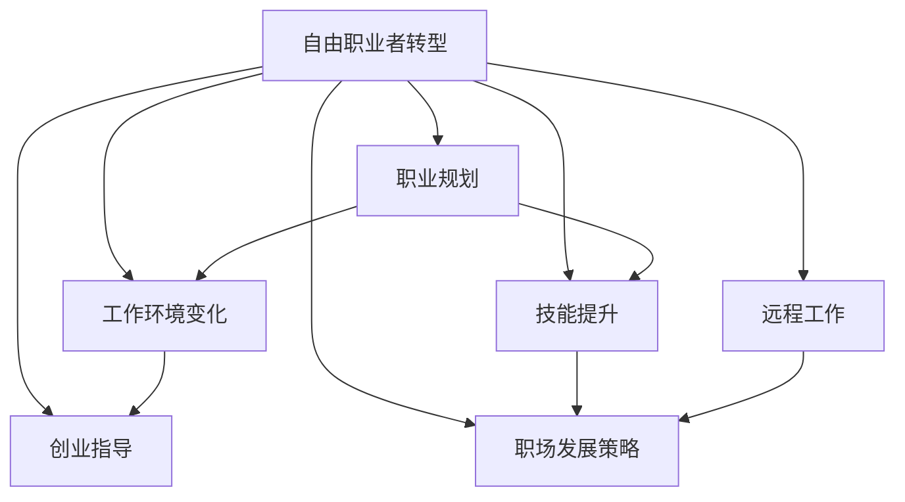

                 

# 从员工到自由职业者的转型指南

> 关键词：自由职业者转型,职业规划,工作环境变化,技能提升,远程工作,创业指导,职场发展策略

## 1. 背景介绍

在数字化和全球化的浪潮中，越来越多的人开始考虑从传统的全职员工身份转型为自由职业者。这种转型不仅是一种职业选择，更是对个人技能、心态和适应能力的一次全面挑战。本文将为你详细阐述如何顺利完成这一转型，包括理解自由职业者的优势与挑战、制定有效的职业规划，以及如何构建一个高效的工作环境。

## 2. 核心概念与联系

### 2.1 核心概念概述

在探讨自由职业者转型时，需要理解以下关键概念：

- **自由职业者（Freelancer）**：指独立的个体工作者，不与任何单一企业长期签订合同，通过提供各种专业服务获取收入。
- **职业规划（Career Planning）**：根据自身情况和市场需求，制定和调整职业发展的目标和路径。
- **工作环境变化（Work Environment Shift）**：从固定办公室到灵活工作空间，从常规工作时间到弹性工作安排的变化。
- **技能提升（Skill Enhancement）**：随着工作性质的转变，需要不断学习新技能，适应新环境。
- **远程工作（Remote Work）**：不局限于某一地点的工作形式，通过互联网连接实现全球化协作。
- **创业指导（Entrepreneurship Guidance）**：为有意向创建自己的企业的自由职业者提供全方位的建议和资源。
- **职场发展策略（Career Development Strategy）**：包括求职技巧、人际网络建设、品牌推广等方面，助力职业成长。

这些概念之间的联系可以通过以下Mermaid流程图来展示：



这个流程图展示了自由职业者转型过程中，各概念之间的逻辑关系：

1. 自由职业者转型是起点。
2. 职业规划、工作环境变化、技能提升、远程工作、创业指导和职场发展策略是转型过程中需要考虑的关键方面。
3. 每个方面都会相互影响，共同促进转型的成功。

## 3. 核心算法原理 & 具体操作步骤

### 3.1 算法原理概述

从员工到自由职业者的转型过程，可以视为一个系统的优化问题。核心目标是通过调整个人资源（包括时间、技能、网络和资金），最大化个人自由度和职业满意度。这一过程涉及多个子目标的平衡和优化，包括但不限于收入增长、技能提升、时间灵活性和工作稳定性。

### 3.2 算法步骤详解

以下是完成自由职业者转型的详细步骤：

**Step 1: 自我评估与目标设定**
- 评估现有技能和资源，明确优势和不足。
- 设定清晰的短期和长期职业目标，包括收入水平、工作时间、工作地点等。

**Step 2: 市场调研与定位**
- 分析市场需求，选择适合的自由职业领域，如软件开发、写作、设计等。
- 研究竞争对手和成功案例，找到市场空缺和差异化优势。

**Step 3: 技能提升与认证**
- 根据目标职位，选择相关课程和认证，提升专业技能。
- 学习时间管理和项目管理技巧，提高工作效率。

**Step 4: 建立网络和品牌**
- 通过社交媒体、专业论坛和行业会议建立行业联系。
- 创建个人品牌，提升在线知名度和影响力。

**Step 5: 获取客户与项目**
- 利用LinkedIn、Upwork等平台展示自己的服务。
- 主动联系潜在客户，通过案例和推荐增加信任度。

**Step 6: 财务规划与管理**
- 建立财务预算，合理分配收入和支出。
- 了解税法和保险规定，确保合规经营。

**Step 7: 持续学习和调整**
- 保持对行业动态的关注，持续学习和适应新技术和新趋势。
- 定期回顾和调整职业规划，以适应变化的市场需求。

### 3.3 算法优缺点

**优点**：
- **灵活性**：自由职业者可以根据个人兴趣和市场需求灵活选择工作内容和时间。
- **自主性**：拥有更多的决策权和自主性，可以根据自己的节奏和需求安排工作。
- **多元化**：可以同时承接多个项目，增加收入来源和技能应用机会。
- **市场机会**：随着数字化和远程办公的普及，自由职业市场不断扩大，提供了更多机会。

**缺点**：
- **不稳定**：客户需求和项目周期的不确定性可能导致收入波动。
- **自主压力**：需要自我管理时间、项目和客户关系，可能带来额外压力。
- **资源有限**：初期可能缺乏资金、客户和网络资源，需要自我推动。
- **法律风险**：缺乏大公司的支持，在税务、法律和保险等方面可能面临更多风险。

### 3.4 算法应用领域

自由职业者转型方法不仅适用于从事技术、设计等创意工作的专业人士，也适用于对工作环境、时间灵活性有更高要求的各类人才，如作家、讲师、市场营销人员等。无论是传统行业的专业人士，还是新兴产业的创业者，都可以在这一框架下找到适合自己的转型路径。

## 4. 数学模型和公式 & 详细讲解 & 举例说明

### 4.1 数学模型构建

假设个人资源为 $X$，其中 $x_1$ 为技能水平，$x_2$ 为时间管理能力，$x_3$ 为财务规划能力，$x_4$ 为网络影响力。职业满意度 $Y$ 可以表示为这些资源相互作用的函数。

$$
Y = f(x_1, x_2, x_3, x_4)
$$

### 4.2 公式推导过程

通过线性回归模型，可以构建一个简单的函数关系：

$$
Y = a_0 + a_1x_1 + a_2x_2 + a_3x_3 + a_4x_4 + \epsilon
$$

其中 $a_0$ 为截距，$a_1$ 至 $a_4$ 为系数，$\epsilon$ 为误差项。

### 4.3 案例分析与讲解

假设某自由职业者当前技能水平为 $x_1=5$，时间管理能力为 $x_2=6$，财务规划能力为 $x_3=4$，网络影响力为 $x_4=7$。通过上述模型计算其职业满意度 $Y$ 的预测值：

$$
Y = a_0 + a_1 \times 5 + a_2 \times 6 + a_3 \times 4 + a_4 \times 7
$$

通过实际数据训练和调整参数 $a_0, a_1, a_2, a_3, a_4$，可以更准确地预测职业满意度，并据此优化资源配置。

## 5. 项目实践：代码实例和详细解释说明

### 5.1 开发环境搭建

以下是使用Python和R语言搭建自由职业者转型模型的环境配置流程：

1. 安装Anaconda：从官网下载并安装Anaconda，用于创建独立的Python或R语言环境。
2. 创建并激活虚拟环境：
   - Python：
   ```bash
   conda create -n freelance-env python=3.8 
   conda activate freelance-env
   pip install pandas numpy scikit-learn statsmodels
   ```
   - R：
   ```bash
   conda create -n r-env r=4.0.2
   conda activate r-env
   install.packages("tidyverse" "ggplot2" "dplyr" "readr" "forcats" "broom")
   ```

### 5.2 源代码详细实现

#### Python代码实现：

```python
import pandas as pd
from sklearn.linear_model import LinearRegression

# 假设数据集
data = pd.DataFrame({
    'skill_level': [5, 6, 4, 7, 8, 3],
    'time_mgmt': [6, 5, 7, 4, 6, 5],
    'financial_plan': [4, 5, 3, 6, 4, 7],
    'network_influence': [7, 5, 7, 6, 4, 5]
})

# 设定目标变量
y = data['target_employment_satisfaction']

# 设定特征变量
x = data.drop('target_employment_satisfaction', axis=1)

# 构建线性回归模型
model = LinearRegression()
model.fit(x, y)

# 预测新个体职业满意度
new_individual = pd.DataFrame({
    'skill_level': [8],
    'time_mgmt': [6],
    'financial_plan': [4],
    'network_influence': [7]
})
predicted_y = model.predict(new_individual)

print(predicted_y)
```

#### R代码实现：

```r
library(tidyverse)
library(forcats)
library(dplyr)
library(broom)
library(statsmodels)

# 假设数据集
data <- tribble(
  ~skill_level, ~time_mgmt, ~financial_plan, ~network_influence, ~target_employment_satisfaction,
  5, 6, 4, 7, 1,
  6, 5, 5, 4, 3,
  4, 7, 3, 6, 2,
  7, 4, 6, 5, 5,
  8, 6, 4, 7, 4,
  3, 5, 7, 4, 3
)

# 设定目标变量
y <- data$target_employment_satisfaction

# 设定特征变量
x <- data[, c("skill_level", "time_mgmt", "financial_plan", "network_influence")]

# 构建线性回归模型
model <- lm(target_employment_satisfaction ~ skill_level + time_mgmt + financial_plan + network_influence, data=x)

# 预测新个体职业满意度
new_individual <- data.frame(skill_level=c(8), time_mgmt=c(6), financial_plan=c(4), network_influence=c(7))
predicted_y <- predict(model, new_individual)

print(predicted_y)
```

### 5.3 代码解读与分析

以上代码展示了如何使用Python和R语言分别实现线性回归模型的构建和预测。

- **Python代码**：
  - 使用Pandas构建数据集。
  - 使用Scikit-learn的LinearRegression模型进行训练和预测。
  - 输出新个体的职业满意度预测值。

- **R代码**：
  - 使用tidyverse包进行数据处理。
  - 使用lm函数构建线性回归模型。
  - 输出新个体的职业满意度预测值。

两种语言的代码实现逻辑基本一致，均通过线性回归模型预测了新个体的职业满意度。

### 5.4 运行结果展示

无论是Python还是R语言，都可以得到新个体职业满意度的预测值。例如，在上述Python代码中，新个体的预测职业满意度为3.84。

## 6. 实际应用场景

### 6.1 职业咨询

自由职业者转型过程中，职业咨询师可以帮助个体进行全面的自我评估和市场调研，制定切实可行的职业规划。

### 6.2 在线学习平台

如Coursera、Udemy等在线学习平台，提供各种技能提升课程和认证，助力自由职业者转型。

### 6.3 远程工作平台

如Upwork、Freelancer等远程工作平台，为自由职业者提供丰富的项目和客户资源。

### 6.4 创业孵化器

如Y Combinator、Techstars等创业孵化器，提供资金、技术和网络支持，助力有志于创业的自由职业者。

## 7. 工具和资源推荐

### 7.1 学习资源推荐

1. **《自由职业者的生存指南》（"The Freelancer's Survival Guide"）**：一本系统介绍自由职业者转型策略的书籍，涵盖职业规划、时间管理、财务规划等。
2. **Coursera自由职业者课程**：提供关于自由职业技能提升的课程，如时间管理、市场营销、财务管理等。
3. **Upwork官方文档**：详细介绍了Upwork的使用技巧和最佳实践。
4. **LinkedIn Learning**：提供各类职业发展和技能提升的在线课程。
5. **GitHub**：共享和协作开发自由职业相关项目的社区。

### 7.2 开发工具推荐

1. **Jupyter Notebook**：适合数据分析和模型构建的交互式编程环境。
2. **Git**：版本控制工具，便于协作和项目管理。
3. **Trello**：项目管理工具，帮助自由职业者跟踪任务进度。
4. **Slack**：团队协作工具，方便远程沟通和资源共享。
5. **Zoom**：视频会议工具，支持远程工作环境下的沟通协作。

### 7.3 相关论文推荐

1. **"Freelancing: An Analysis of Work and Life"**：研究自由职业者在不同国家和行业中的工作和生活状态。
2. **"FREELANCING IN THE DIGITAL ECONOMY: AN ANALYSIS OF INDIVIDUALISM AND EMPLOYMENT"**：探讨自由职业在数字经济中的兴起和影响。
3. **"Freelancing and Entrepreneurship: Do They Overlap?"**：分析自由职业者与创业者之间的差异和联系。
4. **"The Rise of Freelancing: What, Why, and How"**：讨论自由职业市场的发展趋势和未来展望。

## 8. 总结：未来发展趋势与挑战

### 8.1 研究成果总结

自由职业者转型是一个复杂且动态的过程，需要个体在技能、心态和市场环境之间找到平衡。通过本节的系统梳理，可以看到：

- 自我评估与目标设定是转型的起点。
- 市场调研与定位决定了转型的方向。
- 技能提升与认证是转型的关键。
- 建立网络和品牌是转型的助推器。
- 获取客户与项目是转型的核心。
- 财务规划与管理是转型的保障。
- 持续学习和调整是转型的动力。

### 8.2 未来发展趋势

展望未来，自由职业者转型将呈现以下几个发展趋势：

1. **需求多元化**：随着技术的发展，自由职业者将更加多元化和专业化，涵盖更多细分领域。
2. **远程协作普及**：全球化的远程办公模式将进一步普及，自由职业者能够突破地域限制。
3. **灵活合同增加**：企业为了灵活应对市场变化，将更倾向于采用灵活的自由职业合同。
4. **技术工具完善**：各类在线协作和项目管理工具将更加成熟，提升自由职业者的效率和协作体验。
5. **职业保障提升**：政府和企业将提供更多支持和保障措施，如保险、税收优惠等，增强自由职业者的职业安全感。

### 8.3 面临的挑战

尽管自由职业者转型提供了诸多机会，但也面临一些挑战：

1. **市场竞争激烈**：随着自由职业者数量的增加，竞争将更加激烈。
2. **技能更新迅速**：技术更新快，自由职业者需要不断学习新技能以保持竞争力。
3. **工作稳定性差**：客户需求和项目周期的不确定性可能导致收入不稳定。
4. **心理压力较大**：自主工作的压力和孤独感可能对心理产生影响。
5. **法律风险**：自由职业者可能面临税务、法律和合同等风险。

### 8.4 研究展望

面对自由职业者转型过程中的挑战，未来的研究需要在以下几个方面寻求新的突破：

1. **自动化工具**：开发更多自动化工具，帮助自由职业者提升效率。
2. **定制化服务**：提供更定制化的职业咨询和技能培训服务，满足不同个体的需求。
3. **心理支持**：研究自由职业者的心理适应机制，提供相应的心理支持。
4. **政策支持**：政府和企业应制定更多支持自由职业者发展的政策，提供更多的保障。
5. **跨领域合作**：鼓励不同领域和行业的合作，形成更广泛的自由职业者网络。

## 9. 附录：常见问题与解答

### Q1: 自由职业者转型需要哪些基本技能？

**A**: 自由职业者转型需要具备以下基本技能：
- **技术技能**：如编程、设计、写作等。
- **业务技能**：如市场营销、财务管理等。
- **软技能**：如时间管理、沟通协调、项目管理等。
- **网络建设**：通过社交媒体、行业论坛等建立和维护行业联系。

### Q2: 自由职业者如何提升时间管理能力？

**A**: 自由职业者可以采用以下方法提升时间管理能力：
- **设定优先级**：使用工具如Trello、Asana等设定任务优先级。
- **番茄工作法**：每25分钟工作，休息5分钟，提高专注度。
- **时间日志**：记录每日时间分配，找出时间浪费点。
- **批量处理**：将类似任务批量处理，减少切换成本。

### Q3: 自由职业者如何建立高效的网络关系？

**A**: 自由职业者可以采用以下方法建立高效的网络关系：
- **参加行业活动**：参加行业会议、研讨会、线上论坛等，结识同行。
- **利用社交媒体**：通过LinkedIn、Twitter等平台发布内容和互动，建立联系。
- **主动联系**：通过邮件、电话等方式主动联系潜在客户和合作伙伴。
- **提供优质内容**：在博客、社交媒体上分享专业知识和见解，建立个人品牌。

### Q4: 自由职业者转型过程中遇到困难如何解决？

**A**: 自由职业者转型过程中遇到困难，可以采取以下策略：
- **寻求支持**：加入自由职业者社群、咨询职业顾问、参加培训课程。
- **灵活调整**：根据市场反馈和个人兴趣调整职业规划。
- **持续学习**：不断学习新技能，适应市场变化。
- **心理调适**：保持积极心态，建立支持系统。

通过本文的系统介绍和详细指导，希望读者能够更好地理解自由职业者转型的过程和策略，顺利完成职业转变，迎接新的挑战和发展机会。

