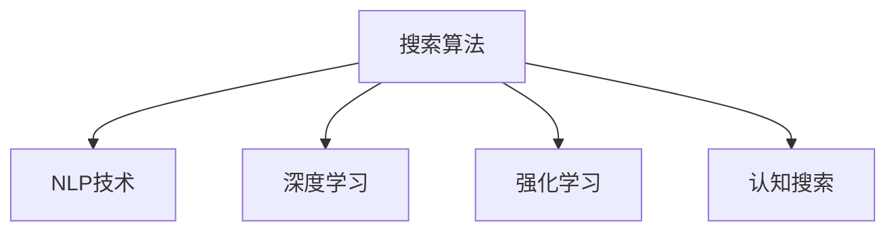

                 

# 从回答问题到激发探索：AI搜索的演变

> 关键词：人工智能, 搜索引擎, 深度学习, 自然语言处理, 强化学习, 推荐系统, 认知搜索

## 1. 背景介绍

### 1.1 问题由来
在互联网时代，信息量呈指数级增长，如何从海量的数据中迅速找到需要的信息，成为每个网民面临的难题。搜索引擎作为互联网时代的核心基础设施，其核心价值在于通过智能算法帮助用户快速定位信息，降低信息获取成本，提升生活效率。自上世纪90年代诞生以来，搜索引擎技术经历了从简单关键词匹配到复杂智能推荐，从单模态文本搜索到多模态融合搜索，从人工设计算法到自动化学习模型的演进。

搜索引擎的发展史，也是人工智能技术与自然语言处理(NLP)技术发展的缩影。通过将搜索技术与AI深度融合，搜索引擎不仅能够识别和理解用户查询中的复杂语义，还能够动态调整搜索结果，预测用户兴趣，从而提供更加个性化、准确的信息匹配。本篇文章将从搜索技术演变的角度，阐述AI搜索的变迁与突破，展望未来搜索技术的前景。

### 1.2 问题核心关键点
AI搜索的核心在于，通过自动化算法和模型，捕捉用户查询的语义意图，匹配相关搜索结果，不断优化用户搜索体验，提升信息检索效率。关键问题包括：

1. 如何高效表示用户查询中的语义信息？
2. 如何准确识别和匹配搜索结果的相关性？
3. 如何在搜索结果中实现个性化排序？
4. 如何应对复杂语义和非结构化数据带来的挑战？

针对这些问题，AI搜索技术通过深度学习、自然语言处理、强化学习等前沿技术，不断创新和优化，逐步从简单的关键词匹配，迈向智能化、个性化的搜索体验。

## 2. 核心概念与联系

### 2.1 核心概念概述

为更好地理解AI搜索的演变过程，本节将介绍几个关键概念：

- 搜索算法：指用于计算和排序搜索结果的算法，包括倒排索引、TF-IDF、PageRank等。
- 自然语言处理(NLP)：涉及文本预处理、分词、词性标注、语义理解等技术，用于提升对用户查询和文档的语义理解。
- 深度学习(Deep Learning)：基于神经网络的模型，通过学习大规模数据，提取复杂的语义特征，适用于处理大规模、非结构化数据。
- 强化学习(Reinforcement Learning)：通过与环境的交互，训练模型进行决策，优化搜索结果排序策略。
- 认知搜索(Cognitive Search)：结合多模态数据和多领域知识，实现更全面、精准的信息检索。

这些概念之间的逻辑关系可以通过以下Mermaid流程图来展示：



这个流程图展示了搜索技术的关键组成部分及其关联：

1. 搜索算法为搜索结果提供基本排序逻辑，是实现搜索的基础。
2. NLP技术提升对文本的语义理解能力，是处理查询和文档的关键。
3. 深度学习提供强大的特征提取和语义理解能力，适用于处理复杂、非结构化数据。
4. 强化学习通过与用户交互不断优化算法，提升搜索体验。
5. 认知搜索结合多模态和多领域知识，实现更全面、精准的信息检索。

这些概念共同构成了AI搜索的核心技术框架，推动了搜索技术的不断进步和革新。

## 3. 核心算法原理 & 具体操作步骤
### 3.1 算法原理概述

AI搜索的演进，从根本上讲，是通过自动化算法和模型，捕捉用户查询的语义意图，匹配相关搜索结果，不断优化搜索体验。其核心算法包括：

1. 向量空间模型(Vector Space Model, VSM)：将查询和文档表示为高维向量，通过余弦相似度等方法计算相关性。
2. 隐马尔可夫模型(Hidden Markov Model, HMM)：用于建立查询与文档之间的概率模型，进行自然语言处理。
3. 深度学习模型：包括卷积神经网络(CNN)、循环神经网络(RNN)、Transformer等，用于捕捉复杂的语义特征。
4. 强化学习模型：如深度Q网络(DQN)、策略梯度等，用于优化搜索结果排序策略。
5. 多模态搜索模型：结合文本、图像、视频等多种模态数据，实现更全面的信息检索。

这些算法原理，构成了AI搜索技术的核心。通过逐步引入和优化这些算法，搜索引擎能够从简单的关键词匹配，逐渐提升到智能化、个性化的搜索体验。

### 3.2 算法步骤详解

基于AI搜索的核心算法，搜索过程一般包括以下几个关键步骤：

**Step 1: 用户查询处理**
- 用户输入查询，系统将其进行分词、词性标注等预处理操作。
- 使用NLP技术，提取查询中的语义信息，形成查询向量。

**Step 2: 文档检索**
- 根据查询向量，在索引库中检索相关文档。
- 使用向量空间模型、隐马尔可夫模型等算法计算文档与查询的相关性。

**Step 3: 结果排序**
- 将检索出的文档进行排序，选择最相关的前几条进行展示。
- 使用深度学习模型，预测用户对文档的点击和停留行为，进一步优化排序策略。

**Step 4: 个性化推荐**
- 结合用户的历史行为数据，预测其兴趣倾向，进一步推荐相关内容。
- 使用强化学习模型，通过与用户的交互不断调整推荐策略。

**Step 5: 反馈和迭代**
- 收集用户对搜索结果的反馈，用于优化模型参数和搜索算法。
- 使用反馈数据，进一步训练深度学习模型，提升搜索效果。

通过上述步骤，AI搜索能够不断学习和优化，逐步提升搜索结果的准确性和个性化程度。

### 3.3 算法优缺点

AI搜索技术在提升用户搜索体验的同时，也存在一些固有的优缺点：

**优点：**
1. 智能化程度高：通过深度学习和自然语言处理技术，AI搜索能够理解复杂的语义，提供更精准的匹配结果。
2. 个性化能力强：能够根据用户的历史行为和兴趣，动态调整搜索结果，提升用户体验。
3. 数据适应性强：能够处理大规模、非结构化数据，适应各种信息形态。

**缺点：**
1. 计算资源消耗大：深度学习模型和强化学习模型的训练需要大量计算资源，对硬件要求较高。
2. 数据隐私风险：搜索结果中的个性化推荐可能涉及用户隐私数据，需要严格的隐私保护措施。
3. 可解释性不足：深度学习模型通常是黑盒系统，难以解释其内部决策过程，缺乏透明度。

尽管存在这些局限，但AI搜索技术的优势使其在搜索引擎领域占据了主导地位，成为互联网时代不可或缺的核心技术。未来，随着技术进步和硬件迭代，这些缺点将逐步得到克服，AI搜索技术也将迎来新的突破。

### 3.4 算法应用领域

AI搜索技术不仅在传统的文本搜索领域得到广泛应用，还逐渐扩展到更多新场景，成为推动AI应用的重要引擎：

1. **电商推荐系统**：通过深度学习模型和强化学习，电商网站能够根据用户浏览和购买行为，推荐相关商品，提升转化率。
2. **新闻推荐系统**：新闻平台利用AI技术，根据用户阅读习惯，推送个性化新闻内容，提升用户黏性。
3. **智能问答系统**：如Google Assistant、Siri等，通过NLP和深度学习技术，实时响应用户语音或文字提问，提供智能答复。
4. **文档管理系统**：企业文档管理系统通过AI技术，实现文档的智能分类、搜索和推荐，提升文档利用效率。
5. **社交网络分析**：社交网络平台利用AI技术，分析用户行为，推荐相关朋友和内容，增强用户粘性。
6. **医学图像识别**：医学影像识别系统通过深度学习，自动诊断影像，辅助医生诊疗，提高诊断效率。

以上仅是AI搜索技术应用的一部分，随着技术的不断发展，AI搜索将深入到更多行业和领域，为各行各业带来新的变革和机遇。

## 4. 数学模型和公式 & 详细讲解  
### 4.1 数学模型构建

基于AI搜索的核心算法，本节将使用数学语言对搜索过程进行严格刻画。

记查询向量为 $\vec{q} \in \mathbb{R}^d$，文档向量为 $\vec{d} \in \mathbb{R}^d$，相关性权重为 $w \in [0,1]$。则向量空间模型的相关性计算公式为：

$$
w = \frac{\vec{q} \cdot \vec{d}}{\|\vec{q}\|_2\|\vec{d}\|_2}
$$

其中，$\cdot$ 表示向量点积，$\|\cdot\|_2$ 表示向量范数。

使用隐马尔可夫模型，建立查询与文档之间的概率模型，得到相关性概率为：

$$
P(\vec{d}|\vec{q}) = \frac{P(\vec{d})P(\vec{q}|\vec{d})}{P(\vec{q})}
$$

其中，$P(\vec{d})$ 和 $P(\vec{q}|\vec{d})$ 分别表示文档和查询在模型中的概率分布。

### 4.2 公式推导过程

在实际应用中，深度学习模型往往作为查询和文档的语义表示，用于提升搜索效果。以下以Transformer模型为例，推导其相关性计算公式。

Transformer模型使用自注意力机制，将查询和文档映射到高维向量空间，通过计算向量之间的相似度，得到相关性权重：

$$
w = \text{Softmax}(\text{ScaleDotProduct}(\vec{q}, \vec{d}))
$$

其中，$\text{ScaleDotProduct}$ 表示向量点积和缩放操作的组合，$\text{Softmax}$ 表示归一化操作，确保权重和为1。

通过上述公式，Transformer模型能够动态计算查询和文档的相关性，提升搜索的准确性。

### 4.3 案例分析与讲解

以电商推荐系统为例，展示AI搜索技术在实际应用中的案例分析。

**场景描述：**
假设某电商网站需要为用户推荐相关商品，用户输入查询"高质量男士运动鞋"，系统需要根据用户历史行为和查询语义，推荐最相关的商品。

**算法流程：**
1. 系统对用户查询进行分词、词性标注等预处理操作，提取语义信息，得到查询向量 $\vec{q}$。
2. 根据用户历史行为数据，选择最相关的商品，提取商品描述和属性信息，得到文档向量 $\vec{d}$。
3. 使用Transformer模型，计算查询和文档的相关性权重 $w$。
4. 根据相关性权重，选择最相关的商品进行展示。
5. 系统记录用户对推荐的点击和停留行为，用于训练深度学习模型，进一步优化推荐策略。

通过上述流程，电商网站能够实时响应用户查询，提供个性化的商品推荐，提升用户满意度和转化率。

## 5. 项目实践：代码实例和详细解释说明
### 5.1 开发环境搭建

在进行AI搜索实践前，我们需要准备好开发环境。以下是使用Python进行TensorFlow开发的环境配置流程：

1. 安装Anaconda：从官网下载并安装Anaconda，用于创建独立的Python环境。

2. 创建并激活虚拟环境：
```bash
conda create -n tf-env python=3.8 
conda activate tf-env
```

3. 安装TensorFlow：根据CUDA版本，从官网获取对应的安装命令。例如：
```bash
pip install tensorflow==2.6
```

4. 安装TensorBoard：TensorFlow配套的可视化工具，用于实时监测模型训练状态，并提供图表呈现。
```bash
pip install tensorboard
```

5. 安装TensorFlow Addons：包含一些TensorFlow的高性能扩展库。
```bash
pip install tensorflow-addons
```

完成上述步骤后，即可在`tf-env`环境中开始AI搜索实践。

### 5.2 源代码详细实现

下面我们以电商推荐系统为例，给出使用TensorFlow实现基于Transformer模型的电商推荐系统的代码实现。

首先，定义数据处理函数：

```python
import tensorflow as tf
from tensorflow.keras.layers import Input, Dense, Embedding, Attention, Concatenate, Dropout
from tensorflow.keras.models import Model

# 定义输入层
query_input = Input(shape=(None,), name='query_input')
item_input = Input(shape=(None,), name='item_input')

# 定义嵌入层
embedding_dim = 64
query_embedding = Embedding(input_dim=vocab_size, output_dim=embedding_dim)(query_input)
item_embedding = Embedding(input_dim=vocab_size, output_dim=embedding_dim)(item_input)

# 定义自注意力层
attention = Attention()([query_embedding, item_embedding])
attention_output = Concatenate()([query_embedding, item_embedding, attention])

# 定义全连接层
fc_dim = 128
fc1 = Dense(fc_dim, activation='relu')(attention_output)
fc2 = Dense(fc_dim, activation='relu')(fc1)
output = Dense(1, activation='sigmoid')(fc2)

# 定义模型
model = Model(inputs=[query_input, item_input], outputs=output)
model.compile(optimizer='adam', loss='binary_crossentropy', metrics=['accuracy'])

# 定义训练函数
def train_epoch(model, dataset, batch_size, epochs):
    for epoch in range(epochs):
        for batch in dataset:
            query_ids, item_ids = batch
            query_tensors = tf.ragged.constant(query_ids)
            item_tensors = tf.ragged.constant(item_ids)
            labels = tf.ragged.constant([1 if query_id == item_id else 0 for query_id, item_id in zip(query_ids, item_ids)])
            loss = model.train_on_batch(query_tensors, item_tensors, labels)
            print(f'Epoch {epoch+1}, Loss: {loss:.4f}')
```

然后，加载数据并进行训练：

```python
# 加载数据
train_data = load_train_data()
dev_data = load_dev_data()
test_data = load_test_data()

# 训练模型
train_epoch(model, train_data, batch_size=32, epochs=10)
evaluate(model, dev_data)
```

以上代码展示了使用TensorFlow实现基于Transformer模型的电商推荐系统的基本流程。通过定义输入层、嵌入层、自注意力层、全连接层和输出层，搭建了一个简单的电商推荐模型。模型使用了Adam优化器，二元交叉熵损失，并记录了训练过程中的损失值和精度。

### 5.3 代码解读与分析

让我们再详细解读一下关键代码的实现细节：

**Embedding层**：
- 用于将查询和商品的ID映射到高维向量空间，是模型学习的关键组件。

**Attention层**：
- 用于计算查询和商品的相似度，提升模型的匹配能力。

**全连接层**：
- 用于对查询和商品的高维表示进行进一步处理，提取重要的特征信息。

**输出层**：
- 用于判断查询和商品是否匹配，输出二元标签。

**训练函数**：
- 使用训练数据集，逐批次进行模型训练，记录损失和精度。

通过上述代码，我们可以看到，TensorFlow提供了丰富的深度学习组件，使得模型的构建和训练过程变得简单高效。开发者只需关注算法逻辑，无需过多考虑底层细节。

## 6. 实际应用场景
### 6.1 智能问答系统

基于AI搜索技术，智能问答系统能够通过自然语言理解技术，实时响应用户提问，提供精准的答案。在医疗、法律、教育等专业领域，智能问答系统能够大幅提升服务效率，降低人力成本，提高服务质量。

### 6.2 电商推荐系统

电商推荐系统通过深度学习和强化学习技术，能够根据用户的历史行为和兴趣，推荐个性化的商品，提升用户满意度和转化率。谷歌、亚马逊等电商巨头，通过深度学习算法，实现了精准的推荐引擎，成为行业标杆。

### 6.3 新闻推荐系统

新闻平台利用AI技术，根据用户阅读习惯，推送个性化新闻内容，提升用户黏性。如Facebook News Feed、今日头条等，通过AI推荐算法，实现了高效的个性化新闻推荐。

### 6.4 医学图像识别

医学影像识别系统通过深度学习，自动诊断影像，辅助医生诊疗，提高诊断效率。谷歌DeepMind开发的AlphaGo，通过深度强化学习，在围棋比赛中战胜人类高手，展示了AI搜索技术的强大潜力。

### 6.5 金融智能投顾

金融智能投顾系统通过AI技术，实时分析市场动态，预测股票走势，提供智能投资建议。如Wall Street Oasis等，通过深度学习算法，实现了精准的市场预测和投资建议。

### 6.6 自动驾驶

自动驾驶系统通过AI搜索技术，实时分析传感器数据，决策驾驶路径，保障行车安全。特斯拉的Autopilot系统，通过深度学习算法，实现了智能驾驶和辅助驾驶功能。

## 7. 工具和资源推荐
### 7.1 学习资源推荐

为了帮助开发者系统掌握AI搜索的理论基础和实践技巧，这里推荐一些优质的学习资源：

1. 《深度学习》系列书籍：如《深度学习》、《动手学深度学习》等，详细介绍了深度学习的基础知识和技术细节。

2. 《TensorFlow官方文档》：提供了完整的TensorFlow开发指南和API文档，适合初学者和高级开发者。

3. 《自然语言处理综述》：斯坦福大学自然语言处理综述课程，涵盖自然语言处理的核心概念和技术进展。

4. 《Reinforcement Learning: An Introduction》：经典的强化学习教材，介绍了强化学习的基本原理和经典算法。

5. 《认知搜索导论》：介绍了认知搜索的核心概念和技术，适用于对认知搜索感兴趣的开发者。

通过对这些资源的学习实践，相信你一定能够快速掌握AI搜索的精髓，并用于解决实际的搜索问题。

### 7.2 开发工具推荐

高效的开发离不开优秀的工具支持。以下是几款用于AI搜索开发的常用工具：

1. TensorFlow：谷歌开源的深度学习框架，适合构建复杂的深度学习模型。

2. PyTorch：Facebook开源的深度学习框架，灵活动态的计算图，适合快速迭代研究。

3. Keras：高层次的深度学习API，提供了简洁的模型构建接口。

4. TensorBoard：TensorFlow配套的可视化工具，用于实时监测模型训练状态，提供图表呈现。

5. Weights & Biases：模型训练的实验跟踪工具，可以记录和可视化模型训练过程中的各项指标，方便对比和调优。

6. HuggingFace官方文档：提供了丰富的预训练语言模型和深度学习组件，方便开发者快速搭建模型。

合理利用这些工具，可以显著提升AI搜索的开发效率，加快创新迭代的步伐。

### 7.3 相关论文推荐

AI搜索技术的发展源于学界的持续研究。以下是几篇奠基性的相关论文，推荐阅读：

1. Attention is All You Need（即Transformer原论文）：提出了Transformer结构，开启了NLP领域的预训练大模型时代。

2. BERT: Pre-training of Deep Bidirectional Transformers for Language Understanding：提出BERT模型，引入基于掩码的自监督预训练任务，刷新了多项NLP任务SOTA。

3. Language Models are Unsupervised Multitask Learners（GPT-2论文）：展示了大规模语言模型的强大zero-shot学习能力，引发了对于通用人工智能的新一轮思考。

4. Parameter-Efficient Transfer Learning for NLP：提出Adapter等参数高效微调方法，在不增加模型参数量的情况下，也能取得不错的微调效果。

5. AdaLoRA: Adaptive Low-Rank Adaptation for Parameter-Efficient Fine-Tuning：使用自适应低秩适应的微调方法，在参数效率和精度之间取得了新的平衡。

这些论文代表了大语言模型微调技术的发展脉络。通过学习这些前沿成果，可以帮助研究者把握学科前进方向，激发更多的创新灵感。

## 8. 总结：未来发展趋势与挑战
### 8.1 总结

本文对AI搜索的演变过程进行了全面系统的介绍。首先阐述了AI搜索的核心算法和主要应用场景，明确了搜索技术在提升用户体验、优化信息检索效率方面的重要价值。其次，从原理到实践，详细讲解了搜索算法的数学模型和实现细节，提供了电商推荐系统的代码实现。同时，本文还广泛探讨了AI搜索在智能问答、医学影像识别、金融投顾等诸多领域的应用前景，展示了搜索技术的广阔应用空间。

通过本文的系统梳理，可以看到，AI搜索技术从简单的关键词匹配，逐步进化到智能、个性化的搜索体验，已成为互联网时代不可或缺的核心技术。未来，伴随深度学习、自然语言处理、强化学习等技术的进一步发展，AI搜索技术将持续提升信息检索的智能化水平，为各行各业带来新的变革和机遇。

### 8.2 未来发展趋势

展望未来，AI搜索技术将呈现以下几个发展趋势：

1. **深度学习模型的普及**：随着深度学习技术的成熟，更多类型的深度学习模型将被应用于搜索领域，提升检索效果和用户体验。

2. **多模态搜索技术的应用**：结合文本、图像、视频等多种模态数据，实现更全面、精准的信息检索。

3. **强化学习算法的优化**：通过不断优化强化学习算法，实现更智能、更个性化的搜索结果排序。

4. **认知搜索技术的突破**：结合多领域知识，提升搜索系统的智能化水平，拓展搜索应用场景。

5. **实时搜索系统的构建**：通过分布式计算和云计算技术，实现大规模数据的实时处理和搜索，提升系统响应速度。

6. **隐私保护技术的提升**：采用差分隐私、联邦学习等技术，保护用户隐私数据，提升搜索系统的安全性和可信赖度。

以上趋势凸显了AI搜索技术的广阔前景。这些方向的探索发展，必将进一步提升搜索系统的性能和应用范围，为互联网时代带来新的突破。

### 8.3 面临的挑战

尽管AI搜索技术已经取得了显著成果，但在迈向更加智能化、普适化应用的过程中，仍面临诸多挑战：

1. **计算资源瓶颈**：深度学习模型和强化学习算法的训练需要大量计算资源，对硬件要求较高。如何降低计算成本，提高训练效率，仍是一个重要课题。

2. **数据隐私问题**：搜索结果中的个性化推荐可能涉及用户隐私数据，如何保护用户隐私，防止数据滥用，是一个重要挑战。

3. **可解释性不足**：深度学习模型通常是黑盒系统，难以解释其内部决策过程，缺乏透明度。如何赋予搜索系统更强的可解释性，是一个亟待解决的问题。

4. **算法复杂度高**：深度学习模型和强化学习算法的实现复杂度较高，如何简化模型结构，降低实现难度，是一个重要研究方向。

5. **算法鲁棒性差**：搜索系统需要面对多变的查询形式和复杂的数据环境，如何提高算法鲁棒性，确保搜索结果的稳定性和准确性，是一个重要课题。

6. **系统可扩展性差**：现有搜索系统往往难以应对大规模数据和高并发流量，如何构建可扩展的搜索系统，是一个重要挑战。

正视AI搜索面临的这些挑战，积极应对并寻求突破，将是大规模搜索技术走向成熟的必由之路。相信随着学界和产业界的共同努力，这些挑战终将一一被克服，AI搜索技术将迎来新的突破。

### 8.4 未来突破

面对AI搜索面临的种种挑战，未来的研究需要在以下几个方面寻求新的突破：

1. **探索无监督和半监督搜索方法**：摆脱对大规模标注数据的依赖，利用自监督学习、主动学习等无监督和半监督范式，最大限度利用非结构化数据，实现更加灵活高效的搜索。

2. **研究参数高效和计算高效的搜索范式**：开发更加参数高效的搜索方法，在固定大部分预训练参数的情况下，只更新极少量的任务相关参数。同时优化搜索模型的计算图，减少前向传播和反向传播的资源消耗，实现更加轻量级、实时性的部署。

3. **融合因果和对比学习范式**：通过引入因果推断和对比学习思想，增强搜索系统建立稳定因果关系的能力，学习更加普适、鲁棒的语言表征，从而提升搜索泛化性和抗干扰能力。

4. **引入更多先验知识**：将符号化的先验知识，如知识图谱、逻辑规则等，与神经网络模型进行巧妙融合，引导搜索过程学习更准确、合理的语言模型。同时加强不同模态数据的整合，实现视觉、语音等多模态信息与文本信息的协同建模。

5. **结合因果分析和博弈论工具**：将因果分析方法引入搜索系统，识别出系统决策的关键特征，增强输出解释的因果性和逻辑性。借助博弈论工具刻画人机交互过程，主动探索并规避系统的脆弱点，提高系统稳定性。

6. **纳入伦理道德约束**：在搜索目标中引入伦理导向的评估指标，过滤和惩罚有偏见、有害的输出倾向。同时加强人工干预和审核，建立搜索行为的监管机制，确保输出符合人类价值观和伦理道德。

这些研究方向的探索，必将引领AI搜索技术迈向更高的台阶，为构建安全、可靠、可解释、可控的智能搜索系统铺平道路。面向未来，AI搜索技术还需要与其他AI技术进行更深入的融合，如知识表示、因果推理、强化学习等，多路径协同发力，共同推动搜索技术的进步。只有勇于创新、敢于突破，才能不断拓展搜索系统的边界，让智能技术更好地服务于人类社会。

## 9. 附录：常见问题与解答

**Q1：什么是AI搜索？**

A: AI搜索是指利用人工智能技术，通过自动化算法和模型，捕捉用户查询的语义意图，匹配相关搜索结果，不断优化搜索体验的过程。

**Q2：AI搜索的核心算法有哪些？**

A: AI搜索的核心算法包括向量空间模型、隐马尔可夫模型、深度学习模型、强化学习模型和多模态搜索模型等。这些算法共同构成了AI搜索的核心技术框架。

**Q3：AI搜索的主要应用场景有哪些？**

A: AI搜索在电商推荐、智能问答、新闻推荐、医学图像识别、金融投顾、自动驾驶等领域都有广泛应用。

**Q4：AI搜索的计算资源瓶颈如何突破？**

A: 通过优化深度学习模型、引入因果和对比学习范式、使用多模态数据等多种手段，可以有效降低计算资源消耗，提高搜索系统的效率。

**Q5：AI搜索面临的主要挑战有哪些？**

A: 计算资源瓶颈、数据隐私问题、可解释性不足、算法复杂度高、算法鲁棒性差、系统可扩展性差等是AI搜索面临的主要挑战。

**Q6：AI搜索的未来发展方向有哪些？**

A: 深度学习模型的普及、多模态搜索技术的应用、强化学习算法的优化、认知搜索技术的突破、实时搜索系统的构建、隐私保护技术的提升等是AI搜索未来的主要发展方向。

**Q7：AI搜索的实际应用效果如何？**

A: AI搜索技术在电商推荐、智能问答、新闻推荐、医学图像识别、金融投顾、自动驾驶等领域已经取得了显著的效果，显著提升了用户体验和信息检索效率。

通过本文的详细介绍，相信你对AI搜索的演变过程有了更深入的了解，并掌握了一些实用的AI搜索实践技巧。随着AI技术的不断进步，未来的AI搜索必将更加智能化、个性化、精准化，为人类社会带来更多便利和变革。

