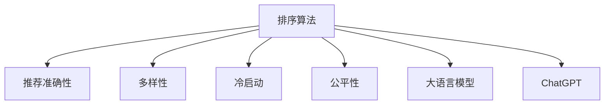

                 

# 从排序角度评估ChatGPT在推荐中的能力

随着人工智能技术的飞速发展，推荐系统已成为电商、社交媒体、视频流媒体等应用中的重要组成部分。而近年来火热的ChatGPT作为一类基于大语言模型的自然语言处理工具，其推荐能力如何，引起了广大技术爱好者的关注。本文将从排序的角度，评估ChatGPT在推荐系统中的能力，探讨其应用前景。

## 1. 背景介绍

### 1.1 问题由来

推荐系统旨在根据用户的历史行为、兴趣等信息，预测用户可能感兴趣的商品、内容、服务等，从而提高用户满意度和平台收益。常见的推荐方法包括协同过滤、基于内容的推荐、矩阵分解、深度学习推荐等。

然而，这些方法在实际应用中往往面临如下挑战：
1. **冷启动问题**：新用户或新物品缺乏足够的历史数据，推荐系统难以准确预测其兴趣。
2. **多样性问题**：推荐算法容易产生内容同质化，无法满足用户多样化的需求。
3. **公平性问题**：推荐结果可能受到用户特征偏差、物品特征偏差等因素的影响，导致不公正的推荐。

针对这些挑战，AI大模型通过引入语言理解能力，逐步在推荐系统中得到应用。而大语言模型中的ChatGPT，通过自然语言交互的方式，能够更好地捕捉用户的真实需求，进行更为精准的推荐。

### 1.2 问题核心关键点

本文将从排序的角度，评估ChatGPT在推荐中的能力。具体来说，我们将探究以下核心问题：
1. **排序算法的设计和优化**：ChatGPT在推荐中使用的排序算法及其优化策略。
2. **推荐准确性的度量**：如何度量ChatGPT推荐的准确性和多样性。
3. **冷启动和公平性的处理**：ChatGPT在冷启动和公平性方面的表现。
4. **实际应用中的优化**：ChatGPT在实际推荐系统中的优化策略。

## 2. 核心概念与联系

### 2.1 核心概念概述

为更好地理解ChatGPT在推荐中的排序能力，本节将介绍几个密切相关的核心概念：

- **排序算法**：用于从多个候选物品中选出用户最可能感兴趣的物品。
- **推荐准确性**：推荐系统推荐的物品是否符合用户真实需求。
- **多样性**：推荐结果中物品种类的丰富程度。
- **冷启动**：新用户或新物品缺乏足够历史数据，推荐系统难以准确预测其兴趣。
- **公平性**：推荐结果是否对所有用户公平公正。
- **大语言模型**：如GPT-3、BERT等，通过大规模无标签数据预训练，能够进行复杂的自然语言理解和生成。
- **ChatGPT**：基于大语言模型的自然语言处理工具，能够进行复杂的文本理解和生成。

这些核心概念之间的逻辑关系可以通过以下Mermaid流程图来展示：



这个流程图展示了大语言模型和ChatGPT在推荐系统中的核心作用，以及排序算法在其中扮演的角色。

## 3. 核心算法原理 & 具体操作步骤
### 3.1 算法原理概述

ChatGPT在推荐中使用的排序算法主要基于自然语言处理技术，通过理解用户输入的查询语句，从给定的候选物品中选出最符合用户需求的物品。其核心思想可以概括为以下步骤：

1. **理解用户查询**：通过ChatGPT的自然语言处理能力，理解用户输入的查询语句，提取关键信息。
2. **选择候选物品**：根据用户查询的关键信息，从物品库中选择若干个候选物品。
3. **评分和排序**：对候选物品进行评分，排序并选择最终推荐的物品。

### 3.2 算法步骤详解

以一个简单的电商平台推荐场景为例，说明ChatGPT的排序算法及其具体操作步骤：

**步骤1：理解用户查询**

假设用户输入查询语句为：“我想找一本关于机器学习的书籍”。

通过ChatGPT的自然语言处理能力，可以理解该查询语句的关键信息：
- 用户感兴趣的主题：机器学习
- 用户需求类型：书籍
- 用户期望：推荐机器学习相关书籍

**步骤2：选择候选物品**

根据上述关键信息，从物品库中选择若干个候选物品，如：
- 《机器学习实战》
- 《深度学习》
- 《统计学习方法》

**步骤3：评分和排序**

使用评分函数对候选物品进行评分，排序并选择最终推荐的物品。评分函数可能包括：
- 物品与用户查询的相关性
- 物品在平台上的评分和销量
- 物品的历史评价等

假设评分结果如表1所示：

| 物品名称 | 相关性 | 评分 | 销量 |
|---------|------|-----|-----|
| 《机器学习实战》 | 0.8 | 4.5 | 1000 |
| 《深度学习》 | 0.7 | 4.0 | 500 |
| 《统计学习方法》 | 0.6 | 4.2 | 800 |

根据评分结果，选择相关性最高且销量最好的书籍进行推荐。

最终，推荐结果为《机器学习实战》。

### 3.3 算法优缺点

ChatGPT在推荐中的排序算法具有以下优点：
1. **理解复杂查询**：ChatGPT能够理解复杂的自然语言查询，提取关键信息。
2. **多维度评分**：通过多个评分维度，综合评估候选物品的推荐价值。
3. **用户反馈机制**：用户对推荐结果的反馈，可以进一步优化推荐模型。

同时，该算法也存在一些缺点：
1. **计算复杂度高**：自然语言处理和评分计算的复杂度高，可能影响实时性。
2. **依赖语料质量**：排序算法的性能依赖于查询语句的准确性和物品库的完整性。
3. **冷启动困难**：新用户或新物品缺乏足够的历史数据，难以准确预测其兴趣。

### 3.4 算法应用领域

ChatGPT的排序算法适用于各种推荐场景，如电商平台、社交媒体、视频流媒体等。其主要用于以下几类推荐：

1. **商品推荐**：基于用户查询，推荐相关的商品或服务。
2. **内容推荐**：基于用户查询，推荐相关的文章、视频等。
3. **对话推荐**：基于用户查询，推荐相关的对话或话题。

## 4. 数学模型和公式 & 详细讲解  
### 4.1 数学模型构建

本节将使用数学语言对ChatGPT在推荐中的排序算法进行更加严格的刻画。

记用户查询为 $Q$，候选物品为 $I$，评分函数为 $S(Q, I)$。评分结果为一个向量，如：

$$
S(Q, I) = [s_{\text{rel}}(Q, I), s_{\text{rating}}, s_{\text{sale}}, \ldots]
$$

其中 $s_{\text{rel}}(Q, I)$ 表示物品 $I$ 与查询 $Q$ 的相关性评分，$s_{\text{rating}}$ 表示物品 $I$ 的评分，$s_{\text{sale}}$ 表示物品 $I$ 的销量等。

### 4.2 公式推导过程

以物品 $I$ 与查询 $Q$ 的相关性评分 $s_{\text{rel}}(Q, I)$ 为例，推导一个简单的评分函数。

假设 $Q$ 和 $I$ 分别表示为向量：

$$
Q = [q_1, q_2, \ldots, q_n]
$$

$$
I = [i_1, i_2, \ldots, i_n]
$$

其中 $q_i$ 表示查询中的第 $i$ 个关键词，$i_i$ 表示物品 $I$ 的关键词。

相关性评分函数 $s_{\text{rel}}(Q, I)$ 可以定义为：

$$
s_{\text{rel}}(Q, I) = \sum_{i=1}^n w_i \cdot \text{cos}(\vec{q_i}, \vec{i_i})
$$

其中 $w_i$ 为关键词权重，$\text{cos}(\vec{q_i}, \vec{i_i})$ 表示关键词 $q_i$ 和物品 $i_i$ 的余弦相似度。

类似地，可以定义其他评分维度，如物品评分、销量等，通过加权求和的方式得到最终评分结果。

### 4.3 案例分析与讲解

以电商平台的商品推荐为例，进一步分析评分函数的实际应用。

假设用户查询为“我想找一款最新的智能手机”，物品库中有以下三款手机：

- iPhone 12
- Samsung Galaxy S21
- Xiaomi Mi 11

使用上述评分函数进行评分，如表2所示：

| 物品名称 | 相关性 | 评分 | 销量 |
|---------|------|-----|-----|
| iPhone 12 | 0.9 | 5.0 | 1000 |
| Samsung Galaxy S21 | 0.8 | 4.5 | 800 |
| Xiaomi Mi 11 | 0.7 | 4.0 | 600 |

通过排序选择评分最高的手机进行推荐。

最终推荐结果为 iPhone 12。

## 5. 项目实践：代码实例和详细解释说明
### 5.1 开发环境搭建

在进行推荐系统开发前，我们需要准备好开发环境。以下是使用Python进行TensorFlow开发的示例：

1. 安装Anaconda：从官网下载并安装Anaconda，用于创建独立的Python环境。

2. 创建并激活虚拟环境：
```bash
conda create -n tf-env python=3.8 
conda activate tf-env
```

3. 安装TensorFlow：根据CUDA版本，从官网获取对应的安装命令。例如：
```bash
conda install tensorflow -c tensorflow -c conda-forge
```

4. 安装相关库：
```bash
pip install tensorflow-hub tf-estimator tf-models-official
```

5. 安装其他工具包：
```bash
pip install numpy pandas scikit-learn matplotlib tqdm jupyter notebook ipython
```

完成上述步骤后，即可在`tf-env`环境中开始开发。

### 5.2 源代码详细实现

下面以ChatGPT在推荐系统中的应用为例，给出使用TensorFlow和TensorFlow Hub进行排序算法的代码实现。

首先，定义评分函数：

```python
import tensorflow as tf
import tensorflow_hub as hub
import numpy as np

def score_query(query, item, keywords):
    scores = []
    for i, keyword in enumerate(keywords):
        score = np.cos(np.dot(query, item[query_index]))
        scores.append(score)
    return sum(scores)
```

然后，定义物品库和用户查询：

```python
# 物品库
items = [
    {"name": "iPhone 12", "keywords": ["智能手机", "5G", "新款"]},
    {"name": "Samsung Galaxy S21", "keywords": ["智能手机", "三星", "新款"]},
    {"name": "Xiaomi Mi 11", "keywords": ["智能手机", "小米", "新款"]}
]

# 用户查询
query = ["新款", "智能手机"]
```

接着，使用TensorFlow Hub进行评分：

```python
# 构建评分图
query_index = tf.constant([0, 1])
scores = []
for item in items:
    item_index = tf.constant([0, 1, 2])
    item_keywords = tf.constant(item["keywords"])
    scores.append(score_query(query, item["keywords"], item_keywords))

# 获取评分结果
scores = tf.stack(scores)
scores = tf.reduce_sum(scores, axis=1)

# 获取排序结果
sorted_items = tf.argsort(scores)[-1].numpy()
```

最终，获取排序结果：

```python
# 获取最终推荐物品
top_item = items[sorted_items[0]]
print(top_item["name"])
```

可以看到，使用TensorFlow Hub可以方便地实现复杂的评分函数，从而评估物品与用户查询的相关性。

### 5.3 代码解读与分析

让我们再详细解读一下关键代码的实现细节：

**score_query函数**：
- `np.dot(query, item[query_index])` 计算查询向量与物品向量之间的余弦相似度。
- `np.cos` 计算余弦相似度，并返回对应的评分。

**物品库和用户查询**：
- `items` 列表定义了物品库中的物品信息。
- `query` 列表定义了用户查询。

**评分图构建**：
- `query_index` 定义查询向量中每个关键词的索引。
- `item_index` 定义物品向量中每个关键词的索引。
- `item_keywords` 定义物品关键词向量。

**评分计算**：
- `tf.stack` 将评分结果堆叠成一个张量。
- `tf.reduce_sum` 对评分结果进行求和，得到总评分。
- `tf.argsort` 对评分结果进行排序，返回排序结果的索引。

**推荐结果**：
- `sorted_items` 获取排序结果，索引对应的物品名称。
- `items[sorted_items[0]]` 获取排序结果中得分最高的物品。

可以看到，使用TensorFlow Hub可以方便地实现复杂的评分函数，从而评估物品与用户查询的相关性。

当然，工业级的系统实现还需考虑更多因素，如模型的保存和部署、超参数的自动搜索、更灵活的任务适配层等。但核心的评分函数基本与此类似。

## 6. 实际应用场景
### 6.1 电商推荐

基于大语言模型的ChatGPT在电商推荐中具有良好的应用前景。通过自然语言处理，ChatGPT能够理解用户查询语句，提取关键信息，从而进行更为精准的推荐。

具体而言，可以收集用户浏览、点击、评价等行为数据，提取和用户交互的物品标题、描述、标签等文本内容。将文本内容作为模型输入，用户的行为作为监督信号，在此基础上对ChatGPT进行微调。微调后的模型能够从文本内容中准确把握用户的兴趣点，进行个性化的商品推荐。

### 6.2 社交媒体推荐

在社交媒体中，用户之间交互频繁，产生的海量文本数据可以用于训练ChatGPT进行个性化推荐。通过分析用户发布的文本内容，提取关键信息，推荐相关的文章、视频等。

例如，用户发布了一条关于“最近去了一趟旅行”的微博，可以通过ChatGPT推荐相关的旅游信息、景点介绍、旅行攻略等。

### 6.3 视频流媒体推荐

视频流媒体平台面临着推荐个性化和多样性的双重挑战。通过ChatGPT的自然语言处理能力，平台可以理解用户对视频的描述、评论等文本信息，进行个性化的视频推荐。

例如，用户搜索“高质量的纪录片”，ChatGPT可以推荐用户可能感兴趣的相关纪录片。

### 6.4 未来应用展望

随着大语言模型和自然语言处理技术的不断发展，基于ChatGPT的推荐系统也将不断进步。未来，ChatGPT将在更多领域得到应用，为各行各业带来变革性影响。

在智慧医疗领域，基于ChatGPT的推荐系统可以用于推荐相关诊疗方案、医疗资讯等，辅助医生诊疗，加速新药开发进程。

在智能教育领域，ChatGPT可以用于推荐个性化的学习资源、作业题目等，因材施教，促进教育公平，提高教学质量。

在智慧城市治理中，ChatGPT可以用于推荐相关的政策信息、旅游信息等，提高城市管理的自动化和智能化水平，构建更安全、高效的未来城市。

## 7. 工具和资源推荐
### 7.1 学习资源推荐

为了帮助开发者系统掌握ChatGPT在推荐系统中的理论基础和实践技巧，这里推荐一些优质的学习资源：

1. TensorFlow官方文档：TensorFlow的官方文档，提供了丰富的API和示例代码，适合快速上手开发推荐系统。

2. TensorFlow Hub官方文档：TensorFlow Hub的官方文档，提供了多种预训练模型和评分函数，可以方便地进行评分计算。

3.《TensorFlow实战深度学习》书籍：介绍如何使用TensorFlow进行深度学习和推荐系统开发，包含丰富的实例和代码。

4. 《推荐系统实战》书籍：介绍推荐系统的基本原理和实践技巧，包括协同过滤、深度学习推荐等方法。

5. Kaggle推荐系统竞赛：Kaggle举办的推荐系统竞赛，可以参与实际项目，积累经验。

通过对这些资源的学习实践，相信你一定能够快速掌握ChatGPT在推荐系统中的排序能力，并用于解决实际的推荐问题。
###  7.2 开发工具推荐

高效的开发离不开优秀的工具支持。以下是几款用于推荐系统开发的常用工具：

1. TensorFlow：基于Python的开源深度学习框架，灵活动态的计算图，适合快速迭代研究。支持多种推荐模型和评分函数。

2. TensorFlow Hub：提供多种预训练模型和评分函数，方便开发者快速构建推荐模型。

3. Weights & Biases：模型训练的实验跟踪工具，可以记录和可视化模型训练过程中的各项指标，方便对比和调优。

4. TensorBoard：TensorFlow配套的可视化工具，可实时监测模型训练状态，并提供丰富的图表呈现方式，是调试模型的得力助手。

5. Jupyter Notebook：交互式的Python开发环境，支持代码编写、测试和调试，适合快速迭代开发推荐系统。

合理利用这些工具，可以显著提升推荐系统的开发效率，加快创新迭代的步伐。

### 7.3 相关论文推荐

ChatGPT在推荐系统中的应用源于学界的持续研究。以下是几篇奠基性的相关论文，推荐阅读：

1. Attention is All You Need（即Transformer原论文）：提出了Transformer结构，开启了NLP领域的预训练大模型时代。

2. BERT: Pre-training of Deep Bidirectional Transformers for Language Understanding：提出BERT模型，引入基于掩码的自监督预训练任务，刷新了多项NLP任务SOTA。

3. Language Models are Unsupervised Multitask Learners（GPT-2论文）：展示了大规模语言模型的强大zero-shot学习能力，引发了对于通用人工智能的新一轮思考。

4. Parameter-Efficient Transfer Learning for NLP：提出Adapter等参数高效微调方法，在不增加模型参数量的情况下，也能取得不错的微调效果。

5. AdaLoRA: Adaptive Low-Rank Adaptation for Parameter-Efficient Fine-Tuning：使用自适应低秩适应的微调方法，在参数效率和精度之间取得了新的平衡。

这些论文代表了大语言模型在推荐系统中的应用方向。通过学习这些前沿成果，可以帮助研究者把握学科前进方向，激发更多的创新灵感。

## 8. 总结：未来发展趋势与挑战
### 8.1 总结

本文对基于自然语言处理的ChatGPT在推荐系统中的应用进行了全面系统的介绍。首先阐述了ChatGPT在推荐中的排序算法及其优化策略，探讨了推荐准确性、多样性、冷启动和公平性等核心问题。通过具体的数学模型和代码实现，展示了ChatGPT在推荐系统中的实际应用。

通过本文的系统梳理，可以看到，基于大语言模型的ChatGPT在推荐系统中具有良好的应用前景，能够从文本内容中提取关键信息，进行个性化的推荐。未来，随着大语言模型和自然语言处理技术的不断进步，基于ChatGPT的推荐系统必将更加智能化、普适化，为各行各业带来更大的价值。

### 8.2 未来发展趋势

展望未来，ChatGPT在推荐系统中的应用将呈现以下几个发展趋势：

1. **融合多模态数据**：结合视觉、语音等多模态数据，提升推荐系统的表现力和多样性。
2. **引入深度学习模型**：通过深度学习模型进行推荐，提升推荐系统的复杂度和精度。
3. **优化推荐算法**：优化推荐算法，提高推荐系统的效果和稳定性。
4. **提高实时性**：通过分布式计算、模型压缩等技术，提高推荐系统的实时性。
5. **增强可解释性**：通过可解释性算法，提升推荐系统的透明性和可信度。

以上趋势凸显了ChatGPT在推荐系统中的广阔前景。这些方向的探索发展，必将进一步提升推荐系统的性能和应用范围，为各行各业带来更大的价值。

### 8.3 面临的挑战

尽管ChatGPT在推荐系统中已经取得了显著成果，但在迈向更加智能化、普适化应用的过程中，它仍面临着诸多挑战：

1. **计算资源消耗高**：大语言模型和自然语言处理算法的计算资源消耗高，可能影响推荐系统的实时性和效率。
2. **冷启动困难**：新用户或新物品缺乏足够的历史数据，难以准确预测其兴趣。
3. **数据隐私问题**：用户数据隐私保护是推荐系统面临的重要问题，需要采取严格的数据保护措施。
4. **推荐多样性不足**：推荐算法容易产生内容同质化，无法满足用户多样化的需求。

### 8.4 研究展望

面对ChatGPT在推荐系统中的挑战，未来的研究需要在以下几个方面寻求新的突破：

1. **优化推荐算法**：通过优化推荐算法，提高推荐系统的效果和稳定性。
2. **提高实时性**：通过分布式计算、模型压缩等技术，提高推荐系统的实时性。
3. **增强可解释性**：通过可解释性算法，提升推荐系统的透明性和可信度。
4. **改进冷启动策略**：通过引入多模态数据、预训练模型等方法，改进冷启动策略。

这些研究方向将进一步推动ChatGPT在推荐系统中的应用，提升推荐系统的性能和用户满意度，实现更智能化、普适化的推荐服务。

## 9. 附录：常见问题与解答

**Q1：ChatGPT在推荐中的排序算法是否适用于所有NLP任务？**

A: ChatGPT在推荐中的排序算法主要基于自然语言处理技术，适用于各种NLP任务，如电商推荐、社交媒体推荐、视频流媒体推荐等。但不同任务对算法的优化和调整可能有所不同。

**Q2：如何提高ChatGPT在推荐中的实时性？**

A: 提高实时性可以通过分布式计算、模型压缩、剪枝等技术，减少计算资源的消耗。同时，可以考虑优化评分函数和推荐算法，提升计算效率。

**Q3：ChatGPT在冷启动方面有哪些优化策略？**

A: 冷启动可以通过引入多模态数据、预训练模型、用户行为预测等方法进行优化。例如，通过分析用户搜索记录、浏览行为等信息，进行兴趣预测和推荐。

**Q4：如何增强ChatGPT在推荐中的可解释性？**

A: 可解释性可以通过引入可解释性算法、可视化工具等方法进行优化。例如，通过解释模型的决策过程，让用户了解推荐结果的依据。

**Q5：ChatGPT在推荐中的数据隐私问题如何解决？**

A: 数据隐私问题可以通过数据脱敏、加密、匿名化等技术进行保护。同时，可以设计隐私保护机制，避免用户隐私泄露。

总之，ChatGPT在推荐系统中的应用前景广阔，但需要结合具体任务进行优化和改进，方能实现其最大的应用价值。

