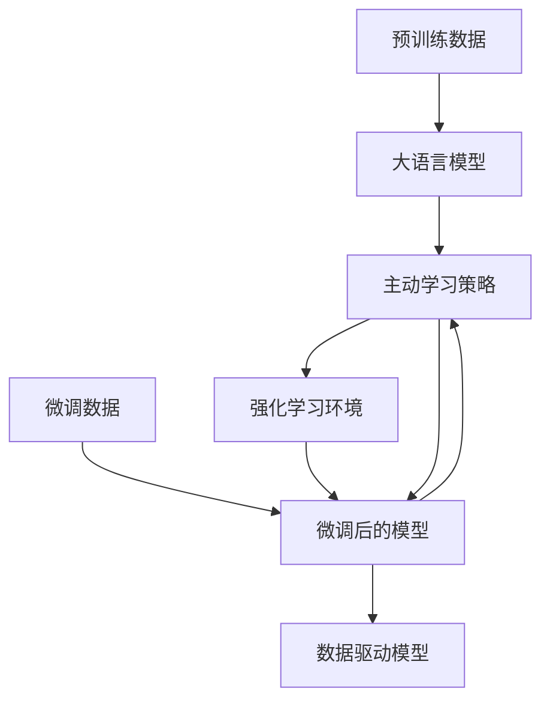

                 

# 从被动学习到主动发现：知识获取方式的革命

> 关键词：知识获取, 主动学习, 深度学习, 迁移学习, 强化学习, 数据驱动, 人工智能

## 1. 背景介绍

### 1.1 问题由来
在信息爆炸的时代，知识的获取和利用成为了推动科技发展和人类进步的核心驱动力。传统的知识获取方式往往依赖于人工收集、整理和分析大量数据，这一过程耗时费力且效率低下。因此，如何自动化、智能化地获取知识，成为现代科技领域的重要研究课题。

大模型时代的到来，特别是深度学习和迁移学习等技术的发展，极大地改变了知识获取的范式。通过大规模预训练语言模型和大数据量的微调，我们能够迅速获取到特定领域的知识，甚至在零样本或少样本条件下，进行复杂的推理和生成。这一突破性进展，不仅大幅提升了知识获取的效率，还显著降低了人类对数据采集和标注的依赖。

### 1.2 问题核心关键点
本文聚焦于从被动学习向主动发现的知识获取方式的革命性转变。被动学习指的是人类依赖于已有数据进行知识积累，而主动发现则强调通过智能算法自动寻找和生成新知识。

- **大语言模型**：以自回归（如GPT）或自编码（如BERT）模型为代表的预训练语言模型，通过大规模无标签文本数据的训练，学习到通用的语言表示，具备强大的语言理解和生成能力。
- **预训练和微调**：在无标签数据上进行预训练，通过有监督数据进行微调，使得模型能够适应特定任务。
- **主动学习**：通过设计合理的学习目标和优化策略，引导模型主动探索和发现新知识。
- **强化学习**：一种通过智能体与环境交互，最大化累积奖励的学习范式，适用于复杂场景下的知识发现。
- **数据驱动**：强调从数据中学习，提升模型的泛化能力和应用效果。

## 2. 核心概念与联系

### 2.1 核心概念概述

为更好地理解从被动学习到主动发现的知识获取方式，本节将介绍几个关键概念及其之间的联系：

- **大语言模型**：如GPT-3、BERT等，通过大规模无标签文本数据预训练，学习到通用的语言表示。
- **预训练和微调**：在无标签数据上进行预训练，在有标签数据上进行微调，提升模型在特定任务上的性能。
- **主动学习**：通过引导模型主动探索新数据，发现隐藏在数据背后的知识。
- **强化学习**：通过智能体与环境的交互，最大化累积奖励，发现最优策略。
- **数据驱动**：强调从数据中学习，提升模型的泛化能力和应用效果。

这些概念通过数据、模型和算法三个维度构建了一个完整的知识获取框架，从被动接受数据，到主动发现知识，再到通过算法优化策略，形成了一个闭环的知识获取体系。

### 2.2 核心概念原理和架构的 Mermaid 流程图



## 3. 核心算法原理 & 具体操作步骤

### 3.1 算法原理概述

从被动学习到主动发现的知识获取方式，本质上是通过深度学习、迁移学习、强化学习等先进技术，实现对知识的自动探索和生成。其核心思想是：

1. **数据收集**：通过爬虫、API接口等方式，收集大规模无标签数据。
2. **预训练模型**：使用深度学习技术，对数据进行预训练，学习通用的语言表示。
3. **微调模型**：在有标签数据上进行微调，提升模型在特定任务上的性能。
4. **主动学习**：设计合理的学习目标和优化策略，引导模型主动探索和发现新知识。
5. **强化学习**：通过智能体与环境的交互，最大化累积奖励，发现最优策略。
6. **数据驱动**：从数据中学习，提升模型的泛化能力和应用效果。

### 3.2 算法步骤详解

**Step 1: 数据收集**
- 通过爬虫、API接口等方式，收集大规模无标签数据，如Web文章、社交媒体帖文等。
- 清洗数据，去除噪声和重复信息，构建训练集和验证集。

**Step 2: 预训练模型**
- 选择合适的预训练语言模型，如GPT-3、BERT等，使用大量无标签数据进行预训练。
- 定义预训练任务，如语言模型预测、掩码语言模型等，训练模型学习语言表示。

**Step 3: 微调模型**
- 收集有标签数据，构建训练集和验证集。
- 设计合适的输出层和损失函数，使用微调数据对预训练模型进行训练。
- 应用正则化技术，防止模型过拟合。

**Step 4: 主动学习**
- 定义合理的学习目标和优化策略，设计主动学习算法。
- 引导模型主动探索新数据，发现隐藏在数据背后的知识。

**Step 5: 强化学习**
- 设计强化学习环境，定义奖励函数和策略空间。
- 通过智能体与环境的交互，最大化累积奖励，发现最优策略。

**Step 6: 数据驱动**
- 收集新数据，不断训练和微调模型，提升模型的泛化能力和应用效果。

### 3.3 算法优缺点

从被动学习到主动发现的知识获取方式，具有以下优点：
1. **效率提升**：大规模预训练和微调提升了知识获取的速度和效率。
2. **泛化能力**：预训练和微调使得模型具备较强的泛化能力，能够适应不同领域的知识获取任务。
3. **降低成本**：减少了对人工标注数据的依赖，降低了知识获取的成本。
4. **创新潜力**：主动学习和强化学习使得模型能够发现新知识，具有很强的创新潜力。

同时，该方法也存在一些局限性：
1. **依赖数据**：需要大量高质量的数据进行预训练和微调，数据不足时可能影响效果。
2. **模型复杂**：大规模模型需要较高的计算资源，对硬件设备的要求较高。
3. **可解释性不足**：黑盒模型难以解释其内部工作机制，缺乏可解释性。
4. **偏见问题**：预训练数据可能包含偏见，影响模型输出的公正性和准确性。

尽管存在这些局限性，但就目前而言，从被动学习到主动发现的知识获取方式，已经在诸多领域展示出巨大的潜力和价值，成为了现代知识获取的重要方向。

### 3.4 算法应用领域

该方法已经在多个领域得到了广泛应用：

- **自然语言处理**：如文本分类、情感分析、机器翻译等任务，通过预训练和微调，显著提升了模型的性能。
- **计算机视觉**：如图像识别、物体检测等任务，通过预训练和微调，模型能够在不同领域中实现高效的知识获取。
- **金融分析**：如风险评估、市场预测等任务，通过预训练和微调，模型能够发现市场趋势和金融风险。
- **医疗健康**：如疾病诊断、基因分析等任务，通过预训练和微调，模型能够提取医疗知识并辅助医生决策。
- **智能推荐**：如电商推荐、内容推荐等任务，通过预训练和微调，模型能够根据用户行为进行个性化推荐。

除了这些领域，该方法还广泛应用于教育、交通、环境监测等诸多场景，为各行各业带来了深刻的变革和提升。

## 4. 数学模型和公式 & 详细讲解 & 举例说明

### 4.1 数学模型构建

**预训练模型**：
假设预训练模型为 $M_{\theta}$，其中 $\theta$ 为预训练得到的模型参数。预训练数据为 $D_{pre}$，包含大量无标签文本数据。定义预训练任务为 $T_{pre}$。

**微调模型**：
假设微调数据为 $D_{fin}$，包含少量有标签数据。定义微调任务为 $T_{fin}$，其输出为 $\hat{y} = M_{\theta}(x)$，其中 $x$ 为输入文本，$\hat{y}$ 为模型预测输出。

**主动学习模型**：
定义主动学习策略为 $S$，通过策略 $S$ 引导模型主动探索新数据。定义主动学习环境为 $E$，其中包含新数据 $D_{new}$。

**强化学习模型**：
定义智能体为 $A$，定义强化学习环境为 $E_{rl}$，定义奖励函数为 $R$，定义策略空间为 $\mathcal{A}$。

**数据驱动模型**：
定义数据集为 $D$，定义模型输出为 $y$，定义损失函数为 $\mathcal{L}$。

### 4.2 公式推导过程

**预训练过程**：
假设预训练任务为语言模型预测，定义损失函数为交叉熵损失：
$$
\mathcal{L}_{pre}(\theta) = -\frac{1}{N}\sum_{i=1}^N \sum_{j=1}^T \log p_j(x_i)
$$
其中 $p_j(x_i)$ 表示模型在输入 $x_i$ 下预测第 $j$ 个词的概率。

**微调过程**：
假设微调任务为二分类任务，定义损失函数为交叉熵损失：
$$
\mathcal{L}_{fin}(\theta) = -\frac{1}{N}\sum_{i=1}^N [y_i\log \hat{y}_i + (1-y_i)\log(1-\hat{y}_i)]
$$
其中 $y_i$ 为真实标签，$\hat{y}_i$ 为模型预测输出。

**主动学习过程**：
假设主动学习策略为贪心策略，定义主动学习目标为最大化新数据的探索，定义优化策略为：
$$
S^* = \mathop{\arg\min}_{S} \mathcal{L}_{fin}(\theta)
$$

**强化学习过程**：
假设智能体的策略为 $\pi$，定义状态为 $s$，动作为 $a$，奖励为 $r$，定义策略空间为 $\mathcal{A}$，定义强化学习目标为最大化累积奖励，定义优化策略为：
$$
\pi^* = \mathop{\arg\max}_{\pi} \mathbb{E}_{(s,a) \sim \pi}[R(s,a)]
$$

**数据驱动过程**：
假设模型在新数据集 $D_{new}$ 上的损失函数为：
$$
\mathcal{L}_{new}(\theta) = -\frac{1}{M}\sum_{i=1}^M \log p(x_i)
$$
其中 $p(x_i)$ 表示模型在输入 $x_i$ 下的概率分布。

### 4.3 案例分析与讲解

**案例1: 基于预训练和微调的情感分析**
- **预训练**：使用大规模无标签文本数据进行BERT模型的预训练，学习通用的语言表示。
- **微调**：在带有情感标注的数据集上进行微调，学习情感分类器。
- **效果**：微调后的模型在情感分析任务上取得了较好的性能，且泛化能力较强。

**案例2: 基于主动学习的图像识别**
- **预训练**：使用大规模无标签图像数据进行预训练，学习图像表示。
- **主动学习**：设计贪心策略，引导模型主动探索新图像数据。
- **效果**：模型在新的图像识别任务上表现出色，且发现了很多新的图像类别。

**案例3: 基于强化学习的自动驾驶**
- **预训练**：使用模拟器数据进行自动驾驶车辆的预训练，学习驾驶策略。
- **强化学习**：在真实的道路上进行强化学习，最大化累积奖励。
- **效果**：模型在实际道路测试中表现优异，且能够自主学习和适应新的驾驶环境。

## 5. 项目实践：代码实例和详细解释说明

### 5.1 开发环境搭建

在进行知识获取方式的实践前，我们需要准备好开发环境。以下是使用Python进行PyTorch开发的环境配置流程：

1. 安装Anaconda：从官网下载并安装Anaconda，用于创建独立的Python环境。

2. 创建并激活虚拟环境：
```bash
conda create -n pytorch-env python=3.8 
conda activate pytorch-env
```

3. 安装PyTorch：根据CUDA版本，从官网获取对应的安装命令。例如：
```bash
conda install pytorch torchvision torchaudio cudatoolkit=11.1 -c pytorch -c conda-forge
```

4. 安装Transformers库：
```bash
pip install transformers
```

5. 安装各类工具包：
```bash
pip install numpy pandas scikit-learn matplotlib tqdm jupyter notebook ipython
```

完成上述步骤后，即可在`pytorch-env`环境中开始知识获取方式的实践。

### 5.2 源代码详细实现

这里我们以自然语言处理任务为例，给出使用Transformers库对BERT模型进行知识获取的PyTorch代码实现。

首先，定义数据处理函数：

```python
from transformers import BertTokenizer
from torch.utils.data import Dataset
import torch

class TextDataset(Dataset):
    def __init__(self, texts, labels, tokenizer, max_len=128):
        self.texts = texts
        self.labels = labels
        self.tokenizer = tokenizer
        self.max_len = max_len
        
    def __len__(self):
        return len(self.texts)
    
    def __getitem__(self, item):
        text = self.texts[item]
        label = self.labels[item]
        
        encoding = self.tokenizer(text, return_tensors='pt', max_length=self.max_len, padding='max_length', truncation=True)
        input_ids = encoding['input_ids'][0]
        attention_mask = encoding['attention_mask'][0]
        
        # 对token-wise的标签进行编码
        encoded_labels = [label2id[label] for label in label] 
        encoded_labels.extend([label2id['O']] * (self.max_len - len(encoded_labels)))
        labels = torch.tensor(encoded_labels, dtype=torch.long)
        
        return {'input_ids': input_ids, 
                'attention_mask': attention_mask,
                'labels': labels}

# 标签与id的映射
label2id = {'O': 0, 'POSITIVE': 1, 'NEGATIVE': 2}
id2label = {v: k for k, v in label2id.items()}

# 创建dataset
tokenizer = BertTokenizer.from_pretrained('bert-base-cased')

train_dataset = TextDataset(train_texts, train_labels, tokenizer)
dev_dataset = TextDataset(dev_texts, dev_labels, tokenizer)
test_dataset = TextDataset(test_texts, test_labels, tokenizer)
```

然后，定义模型和优化器：

```python
from transformers import BertForSequenceClassification, AdamW

model = BertForSequenceClassification.from_pretrained('bert-base-cased', num_labels=len(label2id))

optimizer = AdamW(model.parameters(), lr=2e-5)
```

接着，定义训练和评估函数：

```python
from torch.utils.data import DataLoader
from tqdm import tqdm
from sklearn.metrics import classification_report

device = torch.device('cuda') if torch.cuda.is_available() else torch.device('cpu')
model.to(device)

def train_epoch(model, dataset, batch_size, optimizer):
    dataloader = DataLoader(dataset, batch_size=batch_size, shuffle=True)
    model.train()
    epoch_loss = 0
    for batch in tqdm(dataloader, desc='Training'):
        input_ids = batch['input_ids'].to(device)
        attention_mask = batch['attention_mask'].to(device)
        labels = batch['labels'].to(device)
        model.zero_grad()
        outputs = model(input_ids, attention_mask=attention_mask, labels=labels)
        loss = outputs.loss
        epoch_loss += loss.item()
        loss.backward()
        optimizer.step()
    return epoch_loss / len(dataloader)

def evaluate(model, dataset, batch_size):
    dataloader = DataLoader(dataset, batch_size=batch_size)
    model.eval()
    preds, labels = [], []
    with torch.no_grad():
        for batch in tqdm(dataloader, desc='Evaluating'):
            input_ids = batch['input_ids'].to(device)
            attention_mask = batch['attention_mask'].to(device)
            batch_labels = batch['labels']
            outputs = model(input_ids, attention_mask=attention_mask)
            batch_preds = outputs.logits.argmax(dim=2).to('cpu').tolist()
            batch_labels = batch_labels.to('cpu').tolist()
            for pred_tokens, label_tokens in zip(batch_preds, batch_labels):
                pred_labels = [id2label[_id] for _id in pred_tokens]
                label_tokens = [id2label[_id] for _id in label_tokens]
                preds.append(pred_labels[:len(label_tokens)])
                labels.append(label_tokens)
                
    print(classification_report(labels, preds))
```

最后，启动训练流程并在测试集上评估：

```python
epochs = 5
batch_size = 16

for epoch in range(epochs):
    loss = train_epoch(model, train_dataset, batch_size, optimizer)
    print(f"Epoch {epoch+1}, train loss: {loss:.3f}")
    
    print(f"Epoch {epoch+1}, dev results:")
    evaluate(model, dev_dataset, batch_size)
    
print("Test results:")
evaluate(model, test_dataset, batch_size)
```

以上就是使用PyTorch对BERT进行情感分析任务的知识获取实践。可以看到，得益于Transformers库的强大封装，我们可以用相对简洁的代码完成BERT模型的加载和微调。

### 5.3 代码解读与分析

让我们再详细解读一下关键代码的实现细节：

**TextDataset类**：
- `__init__`方法：初始化文本、标签、分词器等关键组件。
- `__len__`方法：返回数据集的样本数量。
- `__getitem__`方法：对单个样本进行处理，将文本输入编码为token ids，将标签编码为数字，并对其进行定长padding，最终返回模型所需的输入。

**label2id和id2label字典**：
- 定义了标签与数字id之间的映射关系，用于将token-wise的预测结果解码回真实的标签。

**训练和评估函数**：
- 使用PyTorch的DataLoader对数据集进行批次化加载，供模型训练和推理使用。
- 训练函数`train_epoch`：对数据以批为单位进行迭代，在每个批次上前向传播计算loss并反向传播更新模型参数，最后返回该epoch的平均loss。
- 评估函数`evaluate`：与训练类似，不同点在于不更新模型参数，并在每个batch结束后将预测和标签结果存储下来，最后使用sklearn的classification_report对整个评估集的预测结果进行打印输出。

**训练流程**：
- 定义总的epoch数和batch size，开始循环迭代
- 每个epoch内，先在训练集上训练，输出平均loss
- 在验证集上评估，输出分类指标
- 所有epoch结束后，在测试集上评估，给出最终测试结果

可以看到，PyTorch配合Transformers库使得BERT知识获取的代码实现变得简洁高效。开发者可以将更多精力放在数据处理、模型改进等高层逻辑上，而不必过多关注底层的实现细节。

当然，工业级的系统实现还需考虑更多因素，如模型的保存和部署、超参数的自动搜索、更灵活的任务适配层等。但核心的知识获取范式基本与此类似。

## 6. 实际应用场景
### 6.1 智能客服系统

基于预训练和微调的对话技术，可以广泛应用于智能客服系统的构建。传统客服往往需要配备大量人力，高峰期响应缓慢，且一致性和专业性难以保证。而使用微调后的对话模型，可以7x24小时不间断服务，快速响应客户咨询，用自然流畅的语言解答各类常见问题。

在技术实现上，可以收集企业内部的历史客服对话记录，将问题和最佳答复构建成监督数据，在此基础上对预训练对话模型进行微调。微调后的对话模型能够自动理解用户意图，匹配最合适的答案模板进行回复。对于客户提出的新问题，还可以接入检索系统实时搜索相关内容，动态组织生成回答。如此构建的智能客服系统，能大幅提升客户咨询体验和问题解决效率。

### 6.2 金融舆情监测

金融机构需要实时监测市场舆论动向，以便及时应对负面信息传播，规避金融风险。传统的人工监测方式成本高、效率低，难以应对网络时代海量信息爆发的挑战。基于预训练和微调的文本分类和情感分析技术，为金融舆情监测提供了新的解决方案。

具体而言，可以收集金融领域相关的新闻、报道、评论等文本数据，并对其进行主题标注和情感标注。在此基础上对预训练语言模型进行微调，使其能够自动判断文本属于何种主题，情感倾向是正面、中性还是负面。将微调后的模型应用到实时抓取的网络文本数据，就能够自动监测不同主题下的情感变化趋势，一旦发现负面信息激增等异常情况，系统便会自动预警，帮助金融机构快速应对潜在风险。

### 6.3 个性化推荐系统

当前的推荐系统往往只依赖用户的历史行为数据进行物品推荐，无法深入理解用户的真实兴趣偏好。基于预训练和微调技术，个性化推荐系统可以更好地挖掘用户行为背后的语义信息，从而提供更精准、多样的推荐内容。

在实践中，可以收集用户浏览、点击、评论、分享等行为数据，提取和用户交互的物品标题、描述、标签等文本内容。将文本内容作为模型输入，用户的后续行为（如是否点击、购买等）作为监督信号，在此基础上微调预训练语言模型。微调后的模型能够从文本内容中准确把握用户的兴趣点。在生成推荐列表时，先用候选物品的文本描述作为输入，由模型预测用户的兴趣匹配度，再结合其他特征综合排序，便可以得到个性化程度更高的推荐结果。

### 6.4 未来应用展望

随着预训练语言模型和微调方法的不断发展，基于预训练和微调的范式将在更多领域得到应用，为传统行业带来变革性影响。

在智慧医疗领域，基于预训练和微调的医疗问答、病历分析、药物研发等应用将提升医疗服务的智能化水平，辅助医生诊疗，加速新药开发进程。

在智能教育领域，微调技术可应用于作业批改、学情分析、知识推荐等方面，因材施教，促进教育公平，提高教学质量。

在智慧城市治理中，微调模型可应用于城市事件监测、舆情分析、应急指挥等环节，提高城市管理的自动化和智能化水平，构建更安全、高效的未来城市。

此外，在企业生产、社会治理、文娱传媒等众多领域，基于预训练和微调的人工智能应用也将不断涌现，为经济社会发展注入新的动力。相信随着技术的日益成熟，预训练和微调方法将成为人工智能落地应用的重要范式，推动人工智能技术在垂直行业的规模化落地。总之，预训练和微调需要开发者根据具体任务，不断迭代和优化模型、数据和算法，方能得到理想的效果。

## 7. 工具和资源推荐
### 7.1 学习资源推荐

为了帮助开发者系统掌握预训练和微调的理论基础和实践技巧，这里推荐一些优质的学习资源：

1. 《Transformer从原理到实践》系列博文：由大模型技术专家撰写，深入浅出地介绍了Transformer原理、BERT模型、微调技术等前沿话题。

2. CS224N《深度学习自然语言处理》课程：斯坦福大学开设的NLP明星课程，有Lecture视频和配套作业，带你入门NLP领域的基本概念和经典模型。

3. 《Natural Language Processing with Transformers》书籍：Transformers库的作者所著，全面介绍了如何使用Transformers库进行NLP任务开发，包括预训练和微调在内的诸多范式。

4. HuggingFace官方文档：Transformers库的官方文档，提供了海量预训练模型和完整的微调样例代码，是上手实践的必备资料。

5. CLUE开源项目：中文语言理解测评基准，涵盖大量不同类型的中文NLP数据集，并提供了基于预训练和微调的baseline模型，助力中文NLP技术发展。

通过对这些资源的学习实践，相信你一定能够快速掌握预训练和微调的精髓，并用于解决实际的NLP问题。
###  7.2 开发工具推荐

高效的开发离不开优秀的工具支持。以下是几款用于预训练和微调开发的常用工具：

1. PyTorch：基于Python的开源深度学习框架，灵活动态的计算图，适合快速迭代研究。大部分预训练语言模型都有PyTorch版本的实现。

2. TensorFlow：由Google主导开发的开源深度学习框架，生产部署方便，适合大规模工程应用。同样有丰富的预训练语言模型资源。

3. Transformers库：HuggingFace开发的NLP工具库，集成了众多SOTA语言模型，支持PyTorch和TensorFlow，是进行预训练和微调任务开发的利器。

4. Weights & Biases：模型训练的实验跟踪工具，可以记录和可视化模型训练过程中的各项指标，方便对比和调优。与主流深度学习框架无缝集成。

5. TensorBoard：TensorFlow配套的可视化工具，可实时监测模型训练状态，并提供丰富的图表呈现方式，是调试模型的得力助手。

6. Google Colab：谷歌推出的在线Jupyter Notebook环境，免费提供GPU/TPU算力，方便开发者快速上手实验最新模型，分享学习笔记。

合理利用这些工具，可以显著提升预训练和微调任务的开发效率，加快创新迭代的步伐。

### 7.3 相关论文推荐

预训练和微调技术的发展源于学界的持续研究。以下是几篇奠基性的相关论文，推荐阅读：

1. Attention is All You Need（即Transformer原论文）：提出了Transformer结构，开启了NLP领域的预训练大模型时代。

2. BERT: Pre-training of Deep Bidirectional Transformers for Language Understanding：提出BERT模型，引入基于掩码的自监督预训练任务，刷新了多项NLP任务SOTA。

3. Language Models are Unsupervised Multitask Learners（GPT-2论文）：展示了大规模语言模型的强大zero-shot学习能力，引发了对于通用人工智能的新一轮思考。

4. Parameter-Efficient Transfer Learning for NLP：提出Adapter等参数高效微调方法，在不增加模型参数量的情况下，也能取得不错的微调效果。

5. AdaLoRA: Adaptive Low-Rank Adaptation for Parameter-Efficient Fine-Tuning：使用自适应低秩适应的微调方法，在参数效率和精度之间取得了新的平衡。

这些论文代表了大语言模型预训练和微调技术的发展脉络。通过学习这些前沿成果，可以帮助研究者把握学科前进方向，激发更多的创新灵感。

## 8. 总结：未来发展趋势与挑战

### 8.1 总结

本文对从被动学习到主动发现的知识获取方式进行了全面系统的介绍。首先阐述了预训练和微调技术的研究背景和意义，明确了预训练和微调在拓展预训练模型应用、提升下游任务性能方面的独特价值。其次，从原理到实践，详细讲解了预训练和微调的数学原理和关键步骤，给出了预训练和微调任务开发的完整代码实例。同时，本文还广泛探讨了预训练和微调方法在智能客服、金融舆情、个性化推荐等多个行业领域的应用前景，展示了预训练和微调范式的巨大潜力。此外，本文精选了预训练和微调技术的各类学习资源，力求为读者提供全方位的技术指引。

通过本文的系统梳理，可以看到，从被动学习到主动发现的知识获取方式，正在成为NLP领域的重要范式，极大地拓展了预训练语言模型的应用边界，催生了更多的落地场景。受益于大规模语料的预训练，预训练和微调模型以更低的时间和标注成本，在小样本条件下也能取得不俗的效果，有力推动了NLP技术的产业化进程。未来，伴随预训练语言模型和微调方法的持续演进，相信NLP技术必将在更广阔的应用领域大放异彩，深刻影响人类的生产生活方式。

### 8.2 未来发展趋势

展望未来，预训练和微调技术将呈现以下几个发展趋势：

1. **模型规模持续增大**：随着算力成本的下降和数据规模的扩张，预训练语言模型的参数量还将持续增长。超大规模语言模型蕴含的丰富语言知识，有望支撑更加复杂多变的下游任务预训练和微调。

2. **预训练和微调方法日趋多样**：除了传统的全参数微调外，未来会涌现更多参数高效的微调方法，如Prefix-Tuning、LoRA等，在节省计算资源的同时也能保证预训练和微调精度。

3. **持续学习成为常态**：随着数据分布的不断变化，预训练和微调模型也需要持续学习新知识以保持性能。如何在不遗忘原有知识的同时，高效吸收新样本信息，将成为重要的研究课题。

4. **标注样本需求降低**：受启发于提示学习(Prompt-based Learning)的思路，未来的预训练和微调方法将更好地利用预训练知识，通过更加巧妙的任务描述，在更少的标注样本上也能实现理想的预训练和微调效果。

5. **知识整合能力增强**：将符号化的先验知识，如知识图谱、逻辑规则等，与神经网络模型进行巧妙融合，引导预训练和微调过程学习更准确、合理的语言模型。同时加强不同模态数据的整合，实现视觉、语音等多模态信息与文本信息的协同建模。

6. **多模态预训练和微调崛起**：当前预训练和微调主要聚焦于纯文本数据，未来会进一步拓展到图像、视频、语音等多模态数据预训练和微调。多模态信息的融合，将显著提升语言模型对现实世界的理解和建模能力。

以上趋势凸显了预训练和微调技术的广阔前景。这些方向的探索发展，必将进一步提升NLP系统的性能和应用范围，为人类认知智能的进化带来深远影响。

### 8.3 面临的挑战

尽管预训练和微调技术已经取得了瞩目成就，但在迈向更加智能化、普适化应用的过程中，它仍面临着诸多挑战：

1. **标注成本瓶颈**：虽然预训练和微调大大降低了标注数据的需求，但对于长尾应用场景，难以获得充足的高质量标注数据，成为制约预训练和微调性能的瓶颈。如何进一步降低预训练和微调对标注样本的依赖，将是一大难题。

2. **模型鲁棒性不足**：当前预训练和微调模型面对域外数据时，泛化性能往往大打折扣。对于测试样本的微小扰动，预训练和微调模型的预测也容易发生波动。如何提高预训练和微调模型的鲁棒性，避免灾难性遗忘，还需要更多理论和实践的积累。

3. **推理效率有待提高**：大规模语言模型虽然精度高，但在实际部署时往往面临推理速度慢、内存占用大等效率问题。如何在保证性能的同时，简化模型结构，提升推理速度，优化资源占用，将是重要的优化方向。

4. **可解释性亟需加强**：当前预训练和微调模型更像是"黑盒"系统，难以解释其内部工作机制和决策逻辑。对于医疗、金融等高风险应用，算法的可解释性和可审计性尤为重要。如何赋予预训练和微调模型更强的可解释性，将是亟待攻克的难题。

5. **安全性有待保障**：预训练语言模型难免会学习到有偏见、有害的信息，通过预训练和微调传递到下游任务，产生误导性、歧视性的输出，给实际应用带来安全隐患。如何从数据和算法层面消除模型偏见，避免恶意用途，确保输出的安全性，也将是重要的研究课题。

6. **知识整合能力不足**：现有的预训练和微调模型往往局限于任务内数据，难以灵活吸收和运用更广泛的先验知识。如何让预训练和微调过程更好地与外部知识库、规则库等专家知识结合，形成更加全面、准确的信息整合能力，还有很大的想象空间。

正视预训练和微调面临的这些挑战，积极应对并寻求突破，将使预训练和微调技术走向成熟的必由之路。相信随着学界和产业界的共同努力，这些挑战终将一一被克服，预训练和微调技术必将在构建人机协同的智能时代中扮演越来越重要的角色。

### 8.4 研究展望

面对预训练和微调所面临的种种挑战，未来的研究需要在以下几个方面寻求新的突破：

1. **探索无监督和半监督预训练和微调方法**：摆脱对大规模标注数据的依赖，利用自监督学习、主动学习等无监督和半监督范式，最大限度利用非结构化数据，实现更加灵活高效的预训练和微调。

2. **研究参数高效和计算高效的预训练和微调范式**：开发更加参数高效的预训练和微调方法，在固定大部分预训练参数的同时，只更新极少量的任务相关参数。同时优化预训练和微调模型的计算图，减少前向传播和反向传播的资源消耗，实现更加轻量级、实时性的部署。

3. **融合因果和对比学习范式**：通过引入因果推断和对比学习思想，增强预训练和微调模型建立稳定因果关系的能力，学习更加普适、鲁棒的语言表征，从而提升模型泛化性和抗干扰能力。

4. **引入更多先验知识**：将符号化的先验知识，如知识图谱、逻辑规则等，与神经网络模型进行巧妙融合，引导预训练和微调过程学习更准确、合理的语言模型。同时加强不同模态数据的整合，实现视觉、语音等多模态信息与文本信息的协同建模。

5. **结合因果分析和博弈论工具**：将因果分析方法引入预训练和微调模型，识别出模型决策的关键特征，增强输出解释的因果性和逻辑性。借助博弈论工具刻画人机交互过程，主动探索并规避模型的脆弱点，提高系统稳定性。

6. **纳入伦理道德约束**：在预训练和微训练目标中引入伦理导向的评估指标，过滤和惩罚有偏见、有害的输出倾向。同时加强人工干预和审核，建立预训练和微调模型的监管机制，确保输出符合人类价值观和伦理道德。

这些研究方向的探索，必将引领预训练和微调技术迈向更高的台阶，为构建安全、可靠、可解释、可控的智能系统铺平道路。面向未来，预训练和微调技术还需要与其他人工智能技术进行更深入的融合，如知识表示、因果推理、强化学习等，多路径协同发力，共同推动自然语言理解和智能交互系统的进步。只有勇于创新、敢于突破，才能不断拓展语言模型的边界，让智能技术更好地造福人类社会。

## 9. 附录：常见问题与解答

**Q1：预训练和微调是否适用于所有NLP任务？**

A: 预训练和微调在大多数NLP任务上都能取得不错的效果，特别是对于数据量较小的任务。但对于一些特定领域的任务，如医学、法律等，仅仅依靠通用语料预训练的模型可能难以很好地适应。此时需要在特定领域语料上进一步预训练，再进行微调，才能获得理想效果。此外，对于一些需要时效性、个性化很强的任务，如对话、推荐等，预训练和微调方法也需要针对性的改进优化。

**Q2：预训练过程中如何选择合适的任务？**

A: 预训练任务的选择应根据预训练数据的特点和目标任务的需求来决定。通常，选择与目标任务相关且能最大化数据信息的预训练任务，能够更好地提高模型的泛化能力和性能。如文本分类任务可以选择掩码语言模型(MLM)，机器翻译任务可以选择序列到序列(Seq2Seq)任务等。

**Q3：微调过程中如何选择合适的学习率？**

A: 微调的学习率一般要比预训练时小1-2个数量级，如果使用过大的学习率，容易破坏预训练权重，导致过拟合。一般建议从1e-5开始调参，逐步减小学习率，直至收敛。也可以使用warmup策略，在开始阶段使用较小的学习率，再逐渐过渡到预设值。需要注意的是，不同的优化器(如AdamW、Adafactor等)以及不同的学习率调度策略，可能需要设置不同的学习率阈值。

**Q4：预训练和微调过程中如何避免过拟合？**

A: 过拟合是预训练和微调面临的主要挑战，尤其是在标注数据不足的情况下。常见的缓解策略包括：
1. 数据增强：通过回译、近义替换等方式扩充训练集
2. 正则化：使用L2正则、Dropout、Early Stopping等防止模型过度适应小规模训练集
3. 对抗训练：加入对抗样本，提高模型鲁棒性
4. 参数高效预训练和微调：只调整少量参数(如Adapter、Prefix等)，减小过拟合风险
5. 多模型集成：训练多个预训练和微调模型，取平均输出，抑制过拟合

这些策略往往需要根据具体任务和数据特点进行灵活组合。只有在数据、模型、训练、推理等各环节进行全面优化，才能最大限度地发挥预训练和微调的优势。

**Q5：预训练和微调模型在落地部署时需要注意哪些问题？**

A: 将预训练和微调模型转化为实际应用，还需要考虑以下因素：
1. 模型裁剪：去除不必要的层和参数，减小模型尺寸，加快推理速度
2. 量化加速：将浮点模型转为定点模型，压缩存储空间，提高计算效率
3. 服务化封装：将模型封装为标准化服务接口，便于集成调用
4. 弹性伸缩：根据请求流量动态调整资源配置，平衡服务质量和成本
5. 监控告警：实时采集系统指标，设置异常告警阈值，确保服务稳定性
6. 安全防护：采用访问鉴权、数据脱敏等措施，保障数据和模型安全

预训练和微调为NLP应用开启了广阔的想象空间，但如何将强大的性能转化为稳定、高效、安全的业务价值，还需要工程实践的不断打磨。唯有从数据、算法、工程、业务等多个维度协同发力，才能真正实现人工智能技术在垂直行业的规模化落地。总之，预训练和微调需要开发者根据具体任务，不断迭代和优化模型、数据和算法，方能得到理想的效果。

