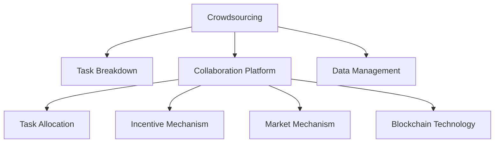

                 

# 众包：汇聚点滴智慧，解决重大难题

> 关键词：众包,智慧汇聚,问题解决,分布式协作,协作算法,市场机制,数字治理,区块链技术

## 1. 背景介绍

### 1.1 问题由来
随着科技的飞速发展，社会面临的复杂性和挑战越来越大。从气候变化、环境保护，到公共卫生、经济发展，再到社会公平、文化传承，每一个问题都涉及多方面的因素和利益关系。这些问题不仅单靠政府或企业的力量难以解决，也需要全社会共同参与和协作。

在这样的背景下，众包（Crowdsourcing）应运而生。众包是一种新的生产方式，通过广泛动员社会资源，汇聚不同背景、专业、地域人员的智慧和力量，实现问题的有效解决。众包模式通过将任务分解成小的、可管理的子任务，分配给有能力的个人或团队完成，从而高效利用社会资源，实现集体智慧的汇聚和转化。

### 1.2 问题核心关键点
众包的核心在于将复杂的任务分解成小任务，通过市场机制激励个人或团队参与，实现问题的快速解决。其关键点包括：
1. **任务分解**：将大问题拆解成易于管理的小任务。
2. **市场机制**：通过奖励机制吸引个人或团队参与。
3. **协作平台**：提供一个高效的任务分配、管理和协作平台。
4. **数据管理**：确保数据的准确性和隐私安全。
5. **激励机制**：设计合理的激励机制，保证任务的高质量完成。
6. **反馈与优化**：通过不断反馈和优化提升任务解决效率和质量。

## 2. 核心概念与联系

### 2.1 核心概念概述

为更好地理解众包系统的工作原理和优化方向，本节将介绍几个密切相关的核心概念：

- **众包（Crowdsourcing）**：通过互联网平台，将任务分解为小的子任务，分配给自由职业者或社区成员完成，通过市场机制激励参与。
- **协作平台（Collaboration Platform）**：提供任务发布、分配、管理和协作的在线平台，如Amazon Mechanical Turk、CrowdFlower等。
- **任务拆分（Task Breakdown）**：将复杂任务分解为简单的子任务，易于管理和执行。
- **激励机制（Incentive Mechanism）**：通过奖励机制（如支付费用、积分奖励等）激励个人或团队完成任务。
- **市场机制（Market Mechanism）**：利用市场原理优化资源配置，如拍卖、竞价等。
- **区块链技术（Blockchain Technology）**：通过分布式账本技术，确保数据透明和可信，实现去中心化的信任机制。

这些核心概念之间的逻辑关系可以通过以下Mermaid流程图来展示：



这个流程图展示众包系统的核心概念及其之间的关系：

1. 众包通过平台发布任务。
2. 平台将任务分解成小的子任务，并进行分配。
3. 通过市场机制激励参与者完成任务。
4. 利用区块链技术确保数据透明和可信。
5. 系统需要高效管理和协作，以提高任务解决效率和质量。

## 3. 核心算法原理 & 具体操作步骤
### 3.1 算法原理概述

众包系统的主要算法原理包括任务分解、分配、执行和反馈四个关键步骤。这些步骤通过市场机制、激励机制、协作平台和区块链技术实现，形成了一个动态的、高效的众包系统。

1. **任务分解（Task Breakdown）**：将复杂任务分解为多个小的、可执行的子任务，并明确每个子任务的具体要求和标准。
2. **任务分配（Task Allocation）**：根据参与者的能力、信誉、响应速度等指标，通过市场机制（如拍卖、竞价）将任务分配给合适的参与者。
3. **任务执行（Task Execution）**：参与者根据分配的任务执行相应的工作，并上传结果。
4. **反馈与优化（Feedback and Optimization）**：通过对参与者提交的结果进行评估，给出反馈，并通过激励机制（如奖励、惩罚）激励参与者提高任务质量。

### 3.2 算法步骤详解

下面详细介绍众包系统的算法步骤：

**Step 1: 任务定义与分解**

- 明确任务目标和要求，确定任务的分解策略。
- 将任务分解为若干子任务，每个子任务定义具体的输入和输出。

**Step 2: 任务发布与分配**

- 在协作平台上发布任务，包括任务描述、要求、奖励机制等。
- 根据任务特点和参与者的背景，通过市场机制（如拍卖、竞价）将任务分配给合适的参与者。

**Step 3: 任务执行与反馈**

- 参与者根据分配的任务执行相应的工作，并上传结果。
- 平台对参与者提交的结果进行评估，给出反馈。
- 根据反馈结果，调整激励机制，优化任务执行。

**Step 4: 结果整合与交付**

- 对参与者提交的结果进行整合，形成最终任务结果。
- 根据任务完成情况，支付相应报酬给参与者。
- 平台对任务完成情况进行总结，发布任务报告。

### 3.3 算法优缺点

众包系统具有以下优点：
1. **快速响应**：任务分解后，能够快速动员大量资源，高效解决问题。
2. **成本效益高**：利用社会资源，降低解决问题的人力成本。
3. **创新多样**：不同背景、专业的人员参与，带来多样化的解决方案。
4. **灵活性高**：任务可以根据实际情况灵活调整，适应复杂多变的环境。

同时，众包系统也存在一些缺点：
1. **质量参差不齐**：参与者水平不一，任务质量难以保证。
2. **道德风险**：部分参与者可能存在欺骗行为。
3. **隐私和安全问题**：数据安全和隐私保护需进一步加强。
4. **激励机制设计复杂**：需要合理设计激励机制，避免过度激励或激励不足。

尽管存在这些局限性，但众包系统仍然被广泛应用于各行各业，如数据分析、产品测试、市场调研等。未来，随着技术的不断进步，众包系统将更加智能和高效。

### 3.4 算法应用领域

众包系统的应用领域非常广泛，涵盖了从科学研究、产品开发到社会治理等多个方面。具体应用包括：

1. **科学研究**：如数据标注、文献筛选、模型验证等，充分利用科学界的智慧和资源。
2. **产品测试**：如用户测试、功能测试、反馈收集等，收集用户需求，改进产品设计。
3. **市场调研**：如消费者行为调研、竞争对手分析等，获取市场信息和趋势。
4. **社会治理**：如城市规划、公共服务、社区建设等，促进社会公平和参与。
5. **文化传承**：如古籍修复、文化遗产记录等，保护和传承人类文化遗产。
6. **环境保护**：如生物多样性调查、环境监测等，促进可持续发展。

## 4. 数学模型和公式 & 详细讲解 & 举例说明

### 4.1 数学模型构建

本节将使用数学语言对众包系统的核心算法进行更加严格的刻画。

假设众包任务为 $T$，参与者集合为 $P$，任务被分解为 $N$ 个子任务，每个子任务的完成时间分别为 $t_1, t_2, \cdots, t_N$，每个参与者的能力分别为 $p_1, p_2, \cdots, p_M$。定义每个子任务 $i$ 的收益为 $R_i$，参与者 $j$ 完成子任务 $i$ 的奖励为 $R_{ij}$。

设 $\mathcal{T}$ 为所有子任务的集合，$\mathcal{P}$ 为所有参与者的集合，则任务分配问题可以表示为以下整数线性规划模型：

$$
\begin{aligned}
& \min \sum_{i \in \mathcal{T}} \sum_{j \in \mathcal{P}} c_{ij} x_{ij} \\
& \text{s.t.} \sum_{j \in \mathcal{P}} x_{ij} = 1 \quad \forall i \in \mathcal{T} \\
& x_{ij} \in \{0, 1\} \quad \forall i \in \mathcal{T}, j \in \mathcal{P}
\end{aligned}
$$

其中 $c_{ij} = R_i / p_j$ 为参与者 $j$ 完成子任务 $i$ 的成本。

### 4.2 公式推导过程

以下我们以数据标注任务为例，推导任务分配模型的构建和求解过程。

假设众包平台接收到一项数据标注任务，任务需要将 $N$ 条数据进行标注，每条数据标注时间为 $t_i$。参与者 $j$ 的标注速度为 $p_j$。平台希望在总成本最小的前提下，完成所有数据标注。

**Step 1: 任务定义**

- 定义任务为 $T$，参与者集合为 $P$，任务被分解为 $N$ 个子任务 $i$。
- 每个子任务的完成时间分别为 $t_i$，参与者的能力分别为 $p_j$。

**Step 2: 任务分配模型构建**

- 定义 $x_{ij}$ 为参与者 $j$ 是否完成子任务 $i$ 的变量，0表示未完成，1表示完成。
- 定义每个子任务 $i$ 的收益为 $R_i$，参与者 $j$ 完成子任务 $i$ 的奖励为 $R_{ij}$。
- 根据任务特点和参与者的背景，设计激励机制和市场机制。

**Step 3: 求解任务分配模型**

- 使用整数线性规划求解器（如GLPK、CPLEX等）求解上述模型。
- 通过求解器得到最优的任务分配方案。

### 4.3 案例分析与讲解

**案例分析：电商平台的商品描述优化**

电商平台的商品描述对用户体验和销售效果影响重大。平台可以采用众包方式，利用用户的创意和经验，优化商品描述。

- **任务定义**：将商品描述优化任务拆分为多个子任务，如标题优化、描述内容优化等。
- **任务分配**：根据用户的活跃度、评分等指标，通过市场机制将任务分配给合适的用户。
- **任务执行与反馈**：用户根据分配的任务提交优化建议，平台给出反馈和激励。
- **结果整合与交付**：对用户提交的建议进行整合，形成最终的优化方案，发布到商品页面。

通过众包方式，电商平台可以快速获取用户的创意和反馈，优化商品描述，提升用户体验和销售效果。

## 5. 项目实践：代码实例和详细解释说明
### 5.1 开发环境搭建

在进行众包项目开发前，我们需要准备好开发环境。以下是使用Python进行Flask开发的环境配置流程：

1. 安装Anaconda：从官网下载并安装Anaconda，用于创建独立的Python环境。

2. 创建并激活虚拟环境：
```bash
conda create -n crowdsource-env python=3.8 
conda activate crowdsource-env
```

3. 安装Flask：
```bash
pip install flask
```

4. 安装相关的依赖包：
```bash
pip install flask-cors flask-restful marshmallow
```

5. 安装数据库：
```bash
pip install flask-sqlalchemy
```

完成上述步骤后，即可在`crowdsource-env`环境中开始众包项目开发。

### 5.2 源代码详细实现

下面以一个简单的众包任务管理系统为例，给出使用Flask框架进行众包任务开发的Python代码实现。

首先，定义众包任务的基本类：

```python
class Task:
    def __init__(self, title, description, rewards, participants):
        self.title = title
        self.description = description
        self.rewards = rewards
        self.participants = participants
        self.status = "pending"
```

然后，定义参与者的基本类：

```python
class Participant:
    def __init__(self, name, skills):
        self.name = name
        self.skills = skills
        self.history = []
```

接着，定义任务管理和分配的函数：

```python
from flask import Flask, request, jsonify

app = Flask(__name__)

# 任务列表
tasks = []

# 参与者列表
participants = []

# 任务分配函数
def allocate_task(task, participants):
    # 根据任务需求和参与者能力，通过市场机制（如拍卖、竞价）分配任务
    # 这里以简单随机分配为例
    participants.sort(key=lambda x: x.skills)
    task.assigned_to = participants[0]
    task.status = "assigned"

# 任务执行函数
def execute_task(task):
    # 参与者根据分配的任务执行相应的工作，并上传结果
    task.status = "completed"

# 任务反馈函数
def feedback_task(task, result):
    # 平台对参与者提交的结果进行评估，给出反馈
    task.status = "feedback"

# 任务完成函数
def complete_task(task):
    # 对参与者提交的结果进行整合，形成最终任务结果
    task.status = "completed"
```

最后，启动Flask应用：

```python
@app.route('/tasks', methods=['POST'])
def create_task():
    data = request.get_json()
    task = Task(title=data['title'], description=data['description'], rewards=data['rewards'], participants=participants)
    allocate_task(task, participants)
    execute_task(task)
    feedback_task(task, task.assigned_to.submit_result())
    complete_task(task)
    return jsonify({'status': 'success'})

if __name__ == '__main__':
    app.run(debug=True)
```

以上就是一个使用Flask框架进行众包任务管理的简单示例。可以看到，利用Python的Web框架，可以快速搭建起一个基于HTTP的众包平台，提供任务发布、分配、执行和反馈等功能。

### 5.3 代码解读与分析

让我们再详细解读一下关键代码的实现细节：

**Task类**：
- 定义了众包任务的基本属性，如标题、描述、奖励、状态等。
- 通过`__init__`方法初始化任务对象。

**Participant类**：
- 定义了参与者的基本属性，如姓名、技能、历史记录等。
- 通过`__init__`方法初始化参与者对象。

**allocate_task函数**：
- 将任务分配给合适的参与者，这里以简单的随机分配为例。
- 根据任务需求和参与者能力，通过市场机制（如拍卖、竞价）分配任务。

**execute_task函数**：
- 参与者根据分配的任务执行相应的工作，并上传结果。
- 调用`submit_result`方法上传结果。

**feedback_task函数**：
- 平台对参与者提交的结果进行评估，给出反馈。
- 调用`submit_result`方法上传结果。

**complete_task函数**：
- 对参与者提交的结果进行整合，形成最终任务结果。
- 调用`submit_result`方法上传结果。

可以看到，通过这些简单的Python代码，我们构建了一个基本的众包任务管理系统，实现了任务发布、分配、执行和反馈等功能。这只是一个简单的示例，实际上，一个完整的众包系统还需要更多复杂的功能和优化，如任务优先级、任务追踪、激励机制等。

## 6. 实际应用场景
### 6.1 智能城市治理

智能城市治理是众包技术的重要应用场景之一。在城市管理中，涉及众多的基础设施、公共服务、应急响应等问题，需要广泛动员社会资源，汇聚智慧和力量。

具体而言，可以通过众包平台发布各类城市管理任务，如垃圾分类、绿化维护、交通管理等。平台可以根据任务的特点和参与者的背景，合理分配任务，并通过激励机制激励参与者积极完成任务。通过对参与者提交的结果进行评估，平台可以及时反馈和优化，提高城市管理的效率和质量。

### 6.2 公共卫生监测

在公共卫生领域，面对突发的疫情和公共健康问题，快速响应和有效应对至关重要。众包技术可以通过大规模动员社会资源，快速获取准确的信息和数据，支持公共卫生决策和应对。

具体应用包括：
- 疫情数据的收集和标注：通过众包平台发布任务，收集和标注疫情相关的数据，如症状描述、接触史等。
- 疫苗接种的协调和调度：平台可以发布疫苗接种任务的分配和执行，确保疫苗接种的公平和高效。
- 健康咨询和信息提供：平台可以发布健康咨询和信息提供任务，汇聚专家的智慧和经验。

### 6.3 文化遗产保护

文化遗产保护是众包技术的重要应用领域之一。文化遗产的保护和传承需要广泛的社会参与和协作，众包技术可以提供平台和机制，动员全社会的力量。

具体应用包括：
- 文化遗产的数字化记录：通过众包平台发布任务，记录和标注文化遗产的信息，形成数字档案。
- 文化遗产的修复和保护：平台可以发布文化遗产修复任务的分配和执行，动员社会资源参与保护。
- 文化遗产的教育和传播：平台可以发布文化遗产教育的众包任务，提升公众的文化素养和保护意识。

### 6.4 未来应用展望

随着技术的不断进步，众包系统将更加智能和高效。未来，众包技术有望在更多领域得到应用，为社会带来更大的价值。

在科学研究领域，众包技术可以用于数据分析、模型验证等任务，充分利用科学界的智慧和资源。在工业制造领域，众包技术可以用于产品设计、质量检测等任务，提升产品设计和制造的效率和质量。在文化娱乐领域，众包技术可以用于内容创作、用户反馈等任务，丰富用户体验和文化生态。

总之，众包技术作为一种新的生产方式，正在深刻改变社会各领域的运作模式，为社会的可持续发展注入新的动力。相信随着技术的不断演进，众包技术将变得更加成熟和高效，为社会带来更多的价值和福利。

## 7. 工具和资源推荐
### 7.1 学习资源推荐

为了帮助开发者系统掌握众包技术的基本原理和实践技巧，这里推荐一些优质的学习资源：

1. 《众包革命：如何构建一个成功的众包平台》（Crowdsourcing Revolution: How to Build an Effective Crowdsourcing Platform）：该书系统介绍了众包技术的基本原理和实际应用，是入门众包开发的好书。
2. Coursera《Crowdsourcing in Social Problem Solving》课程：由斯坦福大学开设的课程，介绍了众包技术在社会问题解决中的应用，涵盖任务分配、市场机制、激励机制等多个方面。
3. EdX《Crowdsourcing and Data Science》课程：由麻省理工学院开设的课程，介绍了数据科学中的众包技术，涵盖任务分解、数据分析、结果整合等多个环节。
4. 《众包：新社会资本主义》（Crowdsourcing: A New Social Science）：该书探讨了众包技术的社会、经济和伦理影响，是理解众包技术的重要参考资料。

通过对这些资源的学习实践，相信你一定能够快速掌握众包技术的基本原理和应用技巧，并用于解决实际的问题。

### 7.2 开发工具推荐

高效的开发离不开优秀的工具支持。以下是几款用于众包开发常用的工具：

1. Flask：基于Python的开源Web框架，简单易用，适合快速开发众包平台。
2. Django：功能强大的Python Web框架，适用于复杂的应用开发，如数据管理、任务跟踪等。
3. GitLab：开源的代码托管平台，支持代码版本控制、持续集成和持续部署等功能。
4. Kubernetes：开源的容器编排平台，支持分布式应用的部署和管理。
5. Elasticsearch：开源的搜索和分析引擎，支持大规模数据的处理和分析。

合理利用这些工具，可以显著提升众包项目的开发效率，加快创新迭代的步伐。

### 7.3 相关论文推荐

众包技术的发展源于学界的持续研究。以下是几篇奠基性的相关论文，推荐阅读：

1. "Crowdsourcing Human Intelligence to Evaluate Software: A Field Study"（众包评估软件的用户研究）：Integrating Experience and Cognition：这篇论文系统介绍了众包评估软件的用户研究和设计，是研究众包平台的重要参考文献。
2. "Crowdsourcing in a Statistical Setting"（统计学背景下的众包）：This paper explores the performance of crowdsourcing systems in statistical settings, which is a foundational work in the field of crowdsourcing.
3. "The Design of Crowdsourcing Platforms: A Multidisciplinary Framework"（众包平台的系统设计框架）：提出了一种多学科框架，用于设计和评估众包平台的性能和效果。
4. "Market Mechanism Design in Crowdsourcing"（众包系统中的市场机制设计）：探讨了如何设计有效的市场机制，激励参与者高质量完成任务。
5. "Decentralized Collaboration through Smartphones"（通过智能手机实现去中心化协作）：研究了如何利用智能手机等移动设备，实现分布式协作和众包任务执行。

这些论文代表了大众包技术的发展脉络。通过学习这些前沿成果，可以帮助研究者把握学科前进方向，激发更多的创新灵感。

## 8. 总结：未来发展趋势与挑战

### 8.1 总结

本文对众包技术的原理和应用进行了全面系统的介绍。首先阐述了众包技术的背景和意义，明确了众包在解决问题、汇聚智慧方面的独特价值。其次，从原理到实践，详细讲解了众包的核心算法和操作步骤，给出了众包任务开发的完整代码实例。同时，本文还广泛探讨了众包技术在智能城市治理、公共卫生监测、文化遗产保护等多个领域的应用前景，展示了众包技术的广阔前景。

通过本文的系统梳理，可以看到，众包技术作为一种新的生产方式，正在深刻改变社会各领域的运作模式，为社会的可持续发展注入新的动力。未来，随着技术的不断演进，众包技术将变得更加成熟和高效，为社会带来更多的价值和福利。

### 8.2 未来发展趋势

展望未来，众包技术将呈现以下几个发展趋势：

1. **自动化程度提升**：利用人工智能技术，实现众包任务的自动化分配和执行，提高效率和质量。
2. **去中心化增强**：通过区块链技术，实现任务和数据的去中心化管理和信任机制，增强系统的安全性和透明性。
3. **跨领域融合**：将众包技术与物联网、大数据、人工智能等技术融合，实现多模态数据的协同建模和应用。
4. **智慧汇聚与优化**：通过大数据分析和机器学习技术，优化众包任务的设计和分配，提升任务解决的效果。
5. **伦理与法律框架完善**：建立完善的伦理和法律框架，确保众包任务的公平性、透明性和安全性。

以上趋势凸显了众包技术的发展方向和前景。这些方向的探索发展，将进一步提升众包系统的性能和应用范围，为社会带来更大的价值和福利。

### 8.3 面临的挑战

尽管众包技术已经取得了瞩目成就，但在迈向更加智能化、普适化应用的过程中，它仍面临着诸多挑战：

1. **数据质量与安全**：众包任务的数据质量直接关系到任务解决的效果，数据的真实性和安全性需进一步保障。
2. **激励机制设计**：设计合理的激励机制，确保参与者的积极性和任务的高质量完成。
3. **任务设计与分配**：如何高效设计和管理众包任务，避免任务重叠和浪费，提升任务解决效率。
4. **平台运维与优化**：平台的运维与优化需要持续投入，确保平台的稳定性和高效性。
5. **跨文化与跨语言支持**：如何支持跨文化、跨语言的众包任务，提升平台的包容性和普适性。

尽管存在这些挑战，但随着技术的不断进步，众包技术将逐渐克服这些难题，为社会的可持续发展注入新的动力。相信随着学界和产业界的共同努力，众包技术将更加成熟和完善，成为社会各领域的重要工具。

### 8.4 研究展望

面对众包技术面临的种种挑战，未来的研究需要在以下几个方面寻求新的突破：

1. **自动化与智能化**：利用人工智能技术，实现众包任务的自动化分配和执行，提高效率和质量。
2. **去中心化与分布式协作**：通过区块链技术，实现任务和数据的去中心化管理和信任机制，增强系统的安全性和透明性。
3. **多模态数据融合**：将众包技术与物联网、大数据、人工智能等技术融合，实现多模态数据的协同建模和应用。
4. **跨领域应用**：将众包技术应用于更多领域，如科学研究、工业制造、文化娱乐等，拓展应用场景和价值。
5. **伦理与法律保障**：建立完善的伦理和法律框架，确保众包任务的公平性、透明性和安全性。

这些研究方向的探索，将引领众包技术迈向更高的台阶，为构建安全、可靠、可解释、可控的智能系统铺平道路。面向未来，众包技术还需要与其他人工智能技术进行更深入的融合，如知识表示、因果推理、强化学习等，多路径协同发力，共同推动自然语言理解和智能交互系统的进步。只有勇于创新、敢于突破，才能不断拓展众包技术的边界，让智能技术更好地造福人类社会。

## 9. 附录：常见问题与解答

**Q1：众包技术在科学研究中的应用前景如何？**

A: 众包技术在科学研究中的应用前景广阔。通过众包平台，可以动员全球科学界的智慧和资源，高效完成各种科研任务，如数据标注、文献筛选、模型验证等。众包技术能够充分利用科学家的经验和知识，提升科研效率和质量。

**Q2：如何设计合理的激励机制，确保众包任务的高质量完成？**

A: 设计合理的激励机制是众包任务高质量完成的关键。以下是几种常见的激励机制：
1. 固定奖励：根据任务难度和任务完成时间，设置固定的奖励金额。
2. 任务竞争：通过任务竞标和排名，激励参与者高质量完成任务。
3. 迭代奖励：根据任务完成的质量，逐步增加奖励，激励参与者不断改进。
4. 积分系统：通过积分和排名，激励参与者长期参与和贡献。

**Q3：众包平台如何处理跨文化、跨语言的任务？**

A: 众包平台可以通过以下方式处理跨文化、跨语言的任务：
1. 多语言支持：平台提供多语言界面和文档，支持不同语言的输入和输出。
2. 文化背景适配：根据不同文化背景的任务需求，适配相应的语言和文化背景。
3. 专家参与：邀请跨文化、跨语言的专家参与任务，提升任务解决的效果。

**Q4：如何保证众包数据的真实性和安全性？**

A: 确保众包数据的真实性和安全性是众包平台的重要任务。以下是几种常见的方法：
1. 数据验证：通过人工审核或自动化验证，确保数据的真实性和准确性。
2. 数据加密：对众包数据进行加密存储和传输，防止数据泄露和篡改。
3. 匿名化处理：对参与者的身份信息进行匿名化处理，保护参与者的隐私和安全。
4. 权限控制：通过权限控制和访问审计，确保数据的安全和隐私。

**Q5：众包平台如何处理任务重叠和浪费？**

A: 任务重叠和浪费是众包平台需要解决的问题。以下是几种常见的方法：
1. 任务优化：通过优化任务设计和分配，避免任务重叠和浪费。
2. 任务优先级：根据任务的紧急程度和重要性，设置任务的优先级，优化资源配置。
3. 任务合并：将相似的任务合并为一个大任务，提高任务解决的效率和质量。
4. 任务跟踪：实时跟踪任务的执行情况，及时调整任务分配和执行策略。

这些方法能够帮助众包平台有效处理任务重叠和浪费，提升任务的执行效率和质量。

---

作者：禅与计算机程序设计艺术 / Zen and the Art of Computer Programming

