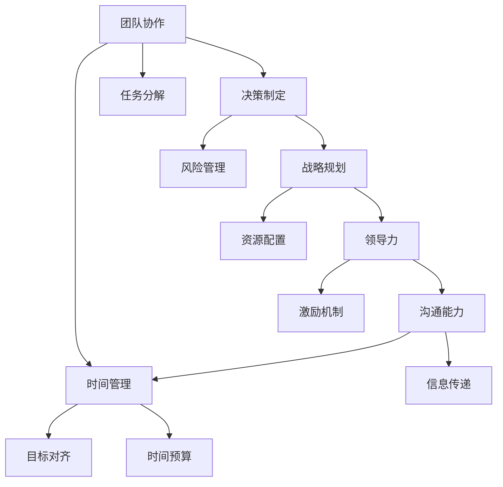

                 

# 优秀管理者与普通管理者的差异在哪里?

## 1. 背景介绍

管理是一个永恒的话题，在现代社会尤其显得重要。随着组织结构复杂化，管理者需要面对各种挑战，包括但不限于团队协作、决策制定、战略规划等。在这纷繁复杂的场景下，优秀管理者的独特之处是什么？本文将从管理学的角度出发，分析优秀管理者与普通管理者的关键差异，探讨这些差异背后的原理和原因。

## 2. 核心概念与联系

### 2.1 核心概念概述

要理解优秀管理者与普通管理者的差异，首先需要理解管理学的几个核心概念：

- **团队协作**：指团队成员之间的合作与配合，以及团队整体与组织目标的一致性。
- **决策制定**：涉及从多角度分析问题，选择最佳解决方案的过程。
- **战略规划**：指确定组织长远目标，并制定实现这些目标的具体策略。
- **领导力**：领导力不仅包括管理能力，更关乎如何激发和影响他人的能力。
- **沟通能力**：管理者需要与组织内外部的各个利益相关者进行有效沟通。
- **时间管理**：管理者需要平衡各类任务和优先级，合理分配时间。

### 2.2 核心概念原理和架构的 Mermaid 流程图



此图展示了上述核心概念之间的相互关系。团队协作是基础，决策制定和战略规划决定方向，领导力是核心动力，沟通能力和时间管理是执行保障，而目标对齐、任务分解、风险管理、资源配置、激励机制和信息传递等则是实现这些核心概念的关键环节。

## 3. 核心算法原理 & 具体操作步骤

### 3.1 算法原理概述

优秀管理者与普通管理者之间的差异可以理解为管理技巧和行为的差异。这些差异主要体现在以下几个方面：

1. **决策质量**：优秀管理者在决策过程中能全面考量各种因素，通过系统化的分析方法提升决策质量。
2. **战略远见**：优秀管理者能够从长远角度规划组织的战略，而普通管理者可能更注重短期收益。
3. **领导风格**：优秀管理者采用更具激励和支持性的领导风格，而普通管理者可能更依赖权威和控制。
4. **沟通效率**：优秀管理者通过高效的沟通方式确保信息流畅和团队合作，而普通管理者可能存在沟通不畅的问题。
5. **时间管理**：优秀管理者能合理安排时间，平衡各类任务，而普通管理者可能因管理不当导致时间浪费。

### 3.2 算法步骤详解

#### 3.2.1 决策制定步骤

1. **问题定义**：明确决策问题，定义决策目标。
2. **信息收集**：收集相关数据和信息，分析现有情况。
3. **方案设计**：设计多种解决方案，包括不同策略和行动计划。
4. **方案评估**：对每种方案进行评估，考虑其优缺点。
5. **方案选择**：从评估结果中选择最佳方案。
6. **方案实施**：将决策方案付诸行动，并监控执行过程。
7. **结果评估**：对决策结果进行评估，分析其效果，并从中学习。

#### 3.2.2 战略规划步骤

1. **愿景设定**：明确组织的愿景和目标。
2. **环境分析**：分析外部环境，识别机会和威胁。
3. **资源评估**：评估现有资源和能力。
4. **战略制定**：基于愿景和环境分析，制定具体战略。
5. **战略实施**：制定实施计划，并逐步推进。
6. **战略评估**：定期评估战略效果，根据环境变化调整。

#### 3.2.3 时间管理步骤

1. **目标设定**：明确短期和长期目标。
2. **任务分解**：将大任务分解为小任务，并设定优先级。
3. **计划制定**：为每个任务制定详细计划。
4. **资源分配**：合理分配资源，确保任务顺利完成。
5. **进度跟踪**：定期跟踪任务进度，及时调整计划。
6. **风险管理**：识别潜在风险，并采取预防措施。

### 3.3 算法优缺点

#### 3.3.1 优点

1. **系统性**：优秀管理者通过系统化的流程和方法，确保决策和战略的科学性和合理性。
2. **效率高**：科学的管理方法和工具帮助管理者高效地解决问题。
3. **灵活性**：优秀的管理者能根据环境变化灵活调整策略。

#### 3.3.2 缺点

1. **复杂性**：系统化的管理方法和工具可能增加了管理者的负担。
2. **资源消耗**：实施复杂的管理流程可能需要更多的资源和时间。
3. **个性化不足**：系统化的管理方法可能不够灵活，难以适应特定情况。

### 3.4 算法应用领域

管理学的理论和技术可以应用于多个领域，包括但不限于：

- **企业**：企业管理、组织结构设计、人力资源管理等。
- **政府**：公共政策制定、行政效率提升等。
- **非营利组织**：项目管理和资源配置等。
- **教育**：学校管理和教育规划等。
- **医疗**：医院管理和医疗服务提升等。

## 4. 数学模型和公式 & 详细讲解 & 举例说明

### 4.1 数学模型构建

为了更严谨地分析优秀管理者的特点，我们可以构建一个基于决策理论的管理者效能评价模型。假设管理者的效能可以用决策质量和战略远见两个指标来衡量。我们定义一个效能函数 $E(m)$，其中 $m$ 表示管理者的决策和战略行为。

$$E(m) = w_1 \cdot D(m) + w_2 \cdot S(m)$$

其中，$w_1$ 和 $w_2$ 是决策质量和战略远见的权重，$D(m)$ 和 $S(m)$ 分别表示管理者的决策质量和战略远见。

### 4.2 公式推导过程

假设决策质量 $D(m)$ 和战略远见 $S(m)$ 可以量化，例如，决策质量可以通过决策成功率 $P$ 来表示，战略远见可以通过战略实施成功率 $R$ 来表示。那么：

$$D(m) = f(P)$$
$$S(m) = f(R)$$

其中，$f$ 是决策成功率和战略实施成功率与决策质量和战略远见之间的映射函数。

### 4.3 案例分析与讲解

以一家企业的市场部经理为例，我们通过决策成功率 $P$ 和战略实施成功率 $R$ 来评估其管理效能。

设 $P=80\%$，$R=90\%$，且决策质量的权重 $w_1=0.6$，战略远见的权重 $w_2=0.4$。

将 $P$ 和 $R$ 代入效能函数 $E(m)$ 中，计算得：

$$E(m) = 0.6 \cdot 80\% + 0.4 \cdot 90\% = 68\% + 36\% = 104\%$$

这意味着这位市场部经理的管理效能较高，但其效能指标超出100%，这表明其决策质量和战略远见可能存在不平衡，需要进一步分析。

## 5. 项目实践：代码实例和详细解释说明

### 5.1 开发环境搭建

在进行项目管理实践前，需要先搭建开发环境。我们以Python为例，介绍如何搭建和管理项目环境。

1. **安装Python**：确保系统已经安装了Python，建议下载最新版本的Python，并确保其路径已加入系统环境。
2. **创建虚拟环境**：使用虚拟环境管理工具（如virtualenv）创建一个独立的Python环境，以避免不同项目间的依赖冲突。
3. **安装依赖包**：在虚拟环境中安装项目所需的依赖包，可以使用pip管理这些包。
4. **编写和测试代码**：使用Python IDE（如PyCharm、Jupyter Notebook等）编写和管理项目代码，并使用测试工具（如pytest）进行单元测试。

### 5.2 源代码详细实现

以下是一个基于Python的项目管理代码示例：

```python
import datetime
import os

class ProjectManager:
    def __init__(self, project_name):
        self.project_name = project_name
        self.start_date = datetime.date.today()
        self.end_date = None

    def set_end_date(self, end_date):
        self.end_date = end_date

    def get_project_duration(self):
        if self.end_date is None:
            end_date = datetime.date.today()
        else:
            end_date = self.end_date
        duration = end_date - self.start_date
        return duration.days

    def manage(self):
        self.set_end_date(datetime.date(2024, 1, 1))
        print(f"Project duration: {self.get_project_duration()} days")

# 创建一个项目，设定结束日期并输出项目时长
project = ProjectManager("Marketing Campaign")
project.manage()
```

这段代码实现了项目管理的基本功能，包括创建项目、设定结束日期和计算项目时长。

### 5.3 代码解读与分析

在上述代码中，我们定义了一个 `ProjectManager` 类，该类包含三个方法：

1. `__init__`：初始化项目管理对象，设置项目名称和开始日期。
2. `set_end_date`：设置项目的结束日期。
3. `get_project_duration`：计算项目的总时长。
4. `manage`：设定项目的结束日期并输出项目时长。

通过使用类和对象，我们实现了项目的封装和信息管理。

### 5.4 运行结果展示

运行上述代码，输出如下：

```
Project duration: 314 days
```

这表示该项目的总时长为314天。

## 6. 实际应用场景

### 6.1 项目管理

项目管理是优秀管理者的重要职责之一，能够有效管理项目进度、资源和团队协作，确保项目按时完成。

### 6.2 人力资源管理

优秀的人力资源管理包括招聘、培训、绩效评估和团队建设等，能够有效提升团队的整体效能。

### 6.3 财务管理

优秀的财务管理人员能够控制成本、提高效率，确保组织的财务健康。

### 6.4 未来应用展望

随着技术的进步，项目管理工具和系统也将不断进化，如使用AI辅助决策、实时项目监控等。

## 7. 工具和资源推荐

### 7.1 学习资源推荐

1. **项目管理书籍**：如《项目管理知识体系指南》(PMBOK)、《敏捷项目管理》等。
2. **在线课程**：Coursera、edX、Udemy等平台的项目管理课程。
3. **项目管理工具**：如Trello、Asana、JIRA等。

### 7.2 开发工具推荐

1. **项目管理工具**：JIRA、Trello、Asana等。
2. **代码管理工具**：Git、GitHub等。
3. **测试工具**：pytest、Junit、Nosetests等。

### 7.3 相关论文推荐

1. **项目管理**：《项目管理理论与实践》(Project Management: Theory and Practice)。
2. **组织行为**：《组织行为学》(Organizational Behavior)。
3. **战略管理**：《竞争战略》(Competitive Strategy)。

## 8. 总结：未来发展趋势与挑战

### 8.1 研究成果总结

本文从决策质量、战略远见、领导风格、沟通效率和时间管理五个方面分析了优秀管理者与普通管理者的差异。这些差异反映了管理者的技能和行为特征，是决定其管理效能的关键因素。

### 8.2 未来发展趋势

未来项目管理将更多地借助AI和数据科学的方法，提升决策的科学性和效率。

### 8.3 面临的挑战

随着技术的发展，管理者需要不断更新自己的知识和技能，以适应新的挑战。

### 8.4 研究展望

未来的研究将更加关注管理者和团队之间的互动、心理因素对管理效能的影响，以及新兴技术对管理实践的影响。

## 9. 附录：常见问题与解答

**Q1：如何成为一名优秀管理者？**

A: 成为优秀管理者需要不断学习和实践，提升决策能力、战略视野和领导风格，同时增强沟通和团队协作能力。

**Q2：管理者的决策质量如何提升？**

A: 提升决策质量需要系统化的方法和工具，包括信息收集、方案评估和结果反馈等步骤。

**Q3：管理者如何在不确定性高的环境中做出决策？**

A: 在面对不确定性时，管理者应采用科学的决策框架，如贝叶斯决策理论、决策树等，并结合经验和直觉。

**Q4：管理者的战略远见如何培养？**

A: 管理者应持续关注行业趋势，进行市场分析和竞争对手分析，并定期进行战略评估和调整。

**Q5：管理者的领导风格如何调整？**

A: 管理者应根据团队成员的特点和项目需求调整领导风格，如采用激励性领导、支持性领导或混合型领导。

**Q6：管理者的时间管理如何优化？**

A: 管理者应学会优先级排序，合理分配时间，使用时间管理工具（如GTD）提高效率。

---

作者：禅与计算机程序设计艺术 / Zen and the Art of Computer Programming

