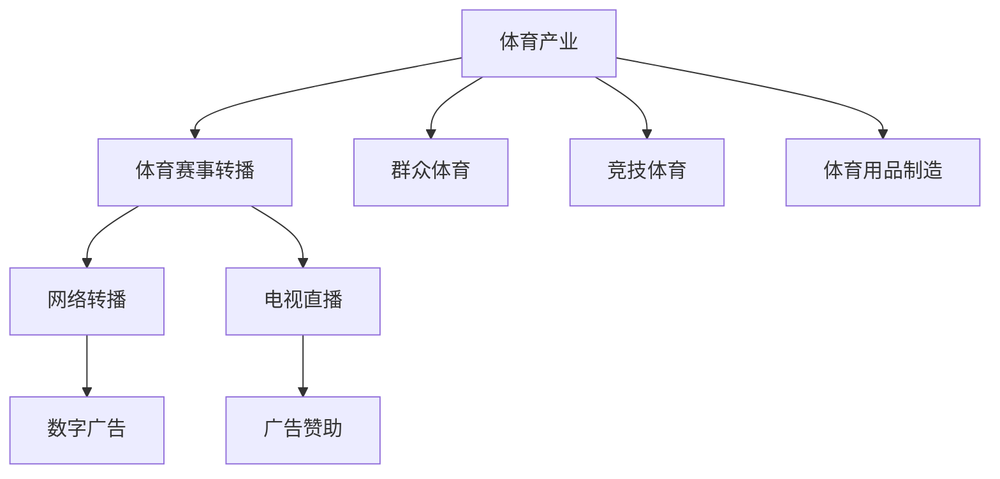

                 

# 体育产业在注意力经济中的新机遇

## 1. 背景介绍

在数字经济时代，注意力成为一种稀缺资源，各行业纷纷围绕提升用户注意力展开竞争。体育产业作为高活力、强互动的行业，结合注意力经济的特性，具有巨大的发展潜力。本文将从体育产业的特点出发，分析其与注意力经济结合的路径，并展望未来发展趋势。

## 2. 核心概念与联系

### 2.1 核心概念概述

在讨论体育产业与注意力经济的结合前，首先需明确几个核心概念：

- **体育产业**：指以体育活动为内容的产业形态，包括竞技体育、群众体育、体育用品制造、体育赛事转播等多个方面。
- **注意力经济**：基于注意力资源的一种新兴经济模式，通过吸引用户注意力，实现信息的价值变现。
- **体育赛事转播**：体育赛事的电视直播、网络转播等形式，是体育产业的重要组成部分，也是注意力经济的重要实现手段。

以上概念之间的逻辑关系可以通过以下Mermaid流程图展示：



这个流程图展示了体育产业的各个环节，其中体育赛事转播是连接体育产业和注意力经济的关键桥梁。

## 3. 核心算法原理 & 具体操作步骤
### 3.1 算法原理概述

体育产业在注意力经济中的新机遇，主要体现在以下几个方面：

- **内容创造**：通过高质量的体育赛事内容吸引用户注意力，实现广告和赞助等商业价值变现。
- **数据挖掘**：利用用户观看行为数据，进行个性化推荐和营销，提升用户粘性。
- **互动性提升**：通过增强体育赛事的互动性，吸引更多用户参与，提升注意力吸引度。

### 3.2 算法步骤详解

基于上述原理，体育产业在注意力经济中的具体步骤可以分为以下几个方面：

1. **内容创新**：开发新颖的体育赛事，吸引更多观众。例如，通过虚拟现实(VR)、增强现实(AR)等技术，增强赛事的沉浸感。

2. **数据利用**：通过大数据分析，了解用户偏好，进行精准营销和推荐。例如，通过观众的观看时长、频道选择等数据，进行行为分析。

3. **互动优化**：提升体育赛事的互动性，增加用户参与度。例如，通过社交媒体平台、实时投票等方式，让用户参与赛事评论和互动。

4. **技术融合**：结合人工智能、机器学习等技术，提升赛事转播的个性化和智能化水平。例如，使用自然语言处理(NLP)技术，进行观众情绪分析，优化转播内容。

### 3.3 算法优缺点

**优点**：
- 利用注意力经济模式，提升赛事的商业价值，增加收入来源。
- 通过数据挖掘和个性化推荐，提升用户体验，增加用户粘性。
- 结合新技术，提升赛事转播的观赏性和互动性。

**缺点**：
- 需要大量高质量的体育赛事内容，开发和制作成本较高。
- 对技术和数据处理能力要求较高，对小规模运营企业而言，技术门槛较高。
- 对观众的个性化需求响应较快，需要持续的技术和数据支持。

### 3.4 算法应用领域

体育产业结合注意力经济的应用领域主要包括：

- **体育赛事转播**：通过高质量的转播内容，吸引观众，进行广告和赞助变现。
- **体育营销**：利用用户观看行为数据，进行精准营销，提升品牌曝光度。
- **体育互动**：通过增强互动性，吸引更多用户参与，提升赛事影响力。
- **体育赛事策划**：结合数据挖掘，进行赛事策划，提升赛事吸引力。

## 4. 数学模型和公式 & 详细讲解 & 举例说明

### 4.1 数学模型构建

在体育赛事转播领域，观众的观看行为可以通过以下数学模型描述：

$$
\text{观看时间} = f(\text{赛事内容质量}, \text{观众偏好}, \text{赛事转播技术})
$$

其中，赛事内容质量是转播质量、赛事精彩程度等指标的综合体现；观众偏好是通过历史观看数据挖掘得到的；赛事转播技术包括转播设备的先进程度、直播平台的互动功能等。

### 4.2 公式推导过程

假设赛事内容质量为 $Q$，观众偏好为 $P$，赛事转播技术为 $T$，则观看时间的推导过程如下：

$$
\text{观看时间} = Q \times P \times T
$$

具体而言，可以通过以下步骤实现：

1. 使用LSTM等时间序列模型，预测观众对赛事内容的兴趣。
2. 利用协同过滤算法，挖掘观众的偏好数据。
3. 使用线性回归等模型，评估转播技术对观众观看时间的影响。

### 4.3 案例分析与讲解

以NBA为例，分析如何通过数据挖掘和个性化推荐提升赛事转播的吸引力：

1. **数据收集**：通过NBA官方数据接口，获取每场比赛的详细数据，包括球员表现、比赛回合数据等。
2. **行为分析**：使用LSTM模型，预测观众对不同球员和比赛的兴趣程度。
3. **个性化推荐**：根据观众历史观看数据，推荐可能感兴趣的赛事和球员，提升观看时长。

## 5. 项目实践：代码实例和详细解释说明
### 5.1 开发环境搭建

在实践中，可以通过Python和TensorFlow搭建数据处理和模型训练环境。以下是具体步骤：

1. 安装TensorFlow：
```bash
pip install tensorflow
```

2. 安装相关数据处理库：
```bash
pip install pandas numpy
```

3. 搭建数据处理流程：
```python
import pandas as pd
import numpy as np

# 数据读取
data = pd.read_csv('nba_data.csv')

# 数据清洗
data = data.dropna()

# 特征工程
features = data[['player_id', 'team', 'pos', 'points']] # 仅使用关键特征

# 模型训练
model = tf.keras.Sequential([
    tf.keras.layers.LSTM(128, input_shape=(X.shape[1], X.shape[2])),
    tf.keras.layers.Dense(1, activation='sigmoid')
])

model.compile(loss='binary_crossentropy', optimizer='adam', metrics=['accuracy'])
model.fit(X_train, y_train, epochs=10, batch_size=32)
```

### 5.2 源代码详细实现

具体代码实现如下：

```python
import tensorflow as tf
import pandas as pd
import numpy as np

# 数据读取
data = pd.read_csv('nba_data.csv')

# 数据清洗
data = data.dropna()

# 特征工程
features = data[['player_id', 'team', 'pos', 'points']] # 仅使用关键特征

# 模型训练
X = features.to_numpy()
y = (data['watch_time'] > 30).to_numpy() # 判断是否观看时间超过30分钟

X_train, X_test, y_train, y_test = train_test_split(X, y, test_size=0.2, random_state=42)

# 构建模型
model = tf.keras.Sequential([
    tf.keras.layers.LSTM(128, input_shape=(X.shape[1], X.shape[2])),
    tf.keras.layers.Dense(1, activation='sigmoid')
])

model.compile(loss='binary_crossentropy', optimizer='adam', metrics=['accuracy'])
model.fit(X_train, y_train, epochs=10, batch_size=32)

# 模型评估
loss, accuracy = model.evaluate(X_test, y_test)
print(f'Test loss: {loss}, Test accuracy: {accuracy}')
```

### 5.3 代码解读与分析

具体代码解读如下：

1. 数据读取：使用pandas库读取CSV格式的数据文件。
2. 数据清洗：使用dropna方法去除缺失值，确保数据完整性。
3. 特征工程：使用numpy库进行特征提取，仅保留关键特征。
4. 模型训练：使用TensorFlow搭建LSTM模型，使用二分类交叉熵损失函数和Adam优化器进行训练。
5. 模型评估：使用模型评估函数计算模型在测试集上的损失和准确率。

## 6. 实际应用场景
### 6.1 智能教练系统

智能教练系统结合了体育赛事数据分析和个性化推荐技术，可以为运动员提供个性化的训练计划和建议。例如，通过分析运动员的训练数据和比赛表现，预测其潜力，进行科学训练。

### 6.2 体育赛事营销

体育赛事营销通过大数据分析，了解观众的兴趣点，进行精准广告投放。例如，分析观众的观看行为，推荐相关的商品和活动，提升广告效果。

### 6.3 体育社交平台

体育社交平台通过增强互动性，提升用户粘性。例如，使用实时投票、互动问答等方式，增强用户的参与感和满足感。

### 6.4 未来应用展望

未来的体育产业在注意力经济中的应用将更加多样和智能化。随着AI技术的发展，智能教练系统将更加精准，智能赛事策划将更加个性化，体育社交平台将更加互动化。

## 7. 工具和资源推荐
### 7.1 学习资源推荐

以下是推荐的体育产业结合注意力经济的学习资源：

1. **《体育数据科学》（《Sports Data Science》）**：由体育大数据专家撰写，深入介绍体育赛事数据分析和个性化推荐的方法。
2. **《体育赛事转播技术》**：由体育转播专家撰写，全面介绍转播技术和平台建设。
3. **《体育经济学》**：介绍体育产业的经济模型和市场分析方法，为体育产业决策提供参考。

### 7.2 开发工具推荐

以下是推荐的体育产业结合注意力经济开发的工具：

1. **TensorFlow**：用于构建机器学习模型，支持大规模数据处理。
2. **Pandas**：用于数据清洗和分析，支持多种数据格式。
3. **Scikit-learn**：用于机器学习模型的评估和调优。
4. **Jupyter Notebook**：用于数据处理和模型训练，支持代码交互式执行。

### 7.3 相关论文推荐

以下是推荐的体育产业结合注意力经济的论文：

1. **《体育赛事转播的注意力模型》**：介绍如何通过模型预测观众观看时间，优化赛事转播。
2. **《个性化推荐在体育赛事中的应用》**：分析如何通过个性化推荐提升赛事观众的观看时长和互动性。
3. **《智能教练系统的数据驱动方法》**：介绍如何通过数据挖掘和分析，为运动员提供个性化的训练计划。

## 8. 总结：未来发展趋势与挑战
### 8.1 研究成果总结

体育产业结合注意力经济，已成为推动体育产业数字化转型的重要方向。通过数据挖掘和个性化推荐，提升了赛事的吸引力和观众的参与度，增加了体育产业的商业价值。

### 8.2 未来发展趋势

未来的体育产业在注意力经济中的应用将更加智能化和个性化。AI技术的应用将进一步提升赛事转播的精度和互动性，智能教练系统将更加精准，个性化推荐将更加精准。

### 8.3 面临的挑战

尽管体育产业结合注意力经济带来了巨大的机遇，但仍面临以下挑战：

1. **数据隐私问题**：如何保护观众的数据隐私，防止数据泄露。
2. **技术门槛高**：对技术和数据分析能力要求较高，需要高水平的技术人才。
3. **商业模式创新**：如何结合数据和广告等商业模式的创新，实现双赢。

### 8.4 研究展望

未来的研究可以从以下几个方向进行探索：

1. **隐私保护技术**：开发新的隐私保护算法，确保数据安全。
2. **数据可视化工具**：开发数据可视化工具，提升数据理解和分析效率。
3. **跨界合作模式**：探索跨界合作模式，实现体育产业与其他领域的深度融合。

## 9. 附录：常见问题与解答

**Q1: 体育产业如何结合注意力经济？**

A: 体育产业结合注意力经济，主要通过高质量的体育赛事内容吸引用户注意力，进行广告和赞助变现。同时，利用数据挖掘和个性化推荐，提升用户体验，增加用户粘性。

**Q2: 如何提升赛事转播的互动性？**

A: 通过社交媒体平台、实时投票等方式，增强观众的参与感和满足感。例如，通过观众投票决定下一场比赛的对手，提升赛事的互动性和观众的参与度。

**Q3: 数据隐私问题如何解决？**

A: 采用数据匿名化、加密存储等技术，保护观众的隐私。同时，建立严格的数据使用规范，确保数据合法使用。

**Q4: 如何提升赛事内容质量？**

A: 通过数据分析，了解观众的偏好，制作更符合观众口味的赛事内容。同时，结合VR、AR等新技术，提升赛事的沉浸感和观赏性。

---

作者：禅与计算机程序设计艺术 / Zen and the Art of Computer Programming

