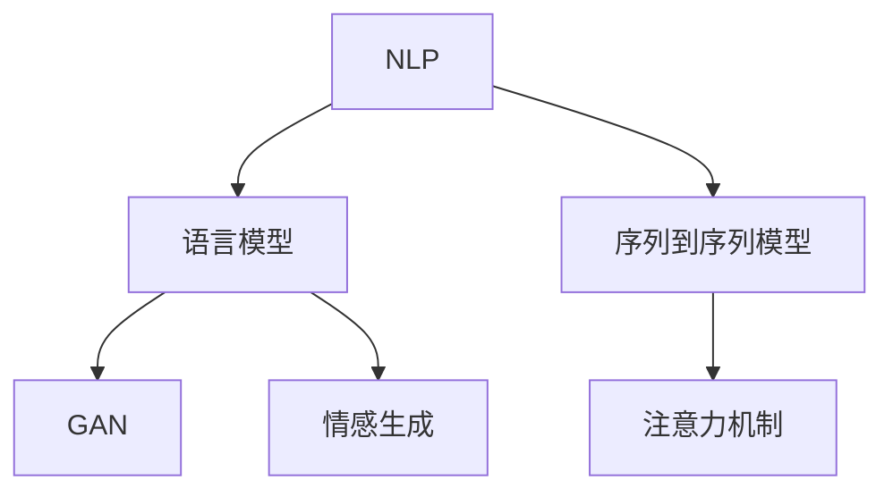

                 

## 1. 背景介绍

在人类文明漫长的历程中，故事一直是文化的载体，无论是口头讲述还是书面记录，故事都在不断地塑造和传递人类社会的价值观和智慧。随着人工智能技术的发展，我们开始尝试使用AI来生成故事，这些AI驱动的故事可以提供个性化的阅读体验，甚至能够以全新的方式呈现历史和现实。

### 1.1 什么是叙事引擎
叙事引擎是一种能够根据用户输入的初始信息，自动生成故事的计算机程序或系统。它的目标是通过自然语言处理（NLP）、机器学习和人工智能技术，让机器像人类一样，能够理解和生成丰富的情节和人物互动，最终形成连贯、有深度的故事。

### 1.2 叙事引擎的发展历程
叙事引擎的发展经历了从简单的文本生成到复杂的情感模拟的演变过程。早期，人们使用规则基（Rule-based）的系统，依赖严格的语法和语义规则来生成故事，但这种方式受限于规则的复杂度和精细度。随着深度学习和神经网络技术的发展，特别是语言模型（如GPT系列、BERT等）的进步，叙事引擎开始向更加智能、个性化和情感化的方向发展。

## 2. 核心概念与联系

### 2.1 核心概念概述

在理解叙事引擎的原理和实现之前，我们需要先了解几个核心概念：

- **自然语言处理（NLP）**：NLP是研究计算机如何处理和理解人类语言的技术领域。它涉及语言模型、词向量表示、序列到序列模型等技术。

- **语言模型**：语言模型是衡量句子或文本出现概率的数学模型。基于语言模型，机器可以理解并生成符合语法和语义规则的文本。

- **生成对抗网络（GAN）**：GAN是一类深度学习模型，由生成器和判别器两个部分组成，用于生成逼真且符合人类直觉的文本或图像。

- **序列到序列模型（Seq2Seq）**：Seq2Seq模型是一种用于处理序列数据的技术，能够将一个序列映射到另一个序列，常用于机器翻译、文本生成等任务。

- **注意力机制（Attention Mechanism）**：注意力机制是一种机制，使模型能够动态地关注输入序列中的重要部分，提高模型的性能和效率。

- **情感生成**：情感生成是指机器能够理解并生成带有特定情感色彩的文本，用于增强故事的可读性和感染力。

这些概念之间的联系通过以下Mermaid流程图展示：



这个流程图展示了NLP技术如何与其他人工智能技术结合，共同构成叙事引擎的核心模块。

## 3. 核心算法原理 & 具体操作步骤

### 3.1 算法原理概述

叙事引擎的核心原理是利用深度学习模型，将输入的用户初始信息转化为连贯、具有情感色彩的故事。核心算法包括序列到序列模型、注意力机制、生成对抗网络等。

**序列到序列模型**：用于将用户输入的初始信息转化为连贯的文本，如时间线、人物描述、情节设定等。模型通过编码器将输入序列转化为向量表示，再由解码器生成输出序列。

**注意力机制**：用于增强模型的关注点，使模型能够动态地关注输入序列中的重要部分。在解码时，模型会根据输入的编码向量，动态地选择关注不同部分的输入序列，从而生成更加连贯的故事。

**生成对抗网络**：用于生成情感丰富且具有吸引力的文本。生成器尝试生成尽可能真实的文本，而判别器则尝试判断文本的真实性。通过不断地对抗训练，生成器可以生成更加逼真、符合人类情感的故事。

### 3.2 算法步骤详解

叙事引擎的核心算法步骤可以分为以下几个部分：

**Step 1: 输入信息预处理**
- 收集用户输入的初始信息，如时间、地点、人物、情节等。
- 将初始信息转化为模型可以处理的向量形式。

**Step 2: 编码器处理**
- 使用序列到序列模型中的编码器，将输入向量转化为一个高维的向量表示。
- 通过注意力机制，增强模型对输入序列的关注点，从而提高编码器的性能。

**Step 3: 生成器处理**
- 使用生成对抗网络中的生成器，生成逼真的文本序列。
- 使用注意力机制，动态地关注生成器输出的每个词，从而提高生成的文本的质量。

**Step 4: 解码器处理**
- 使用解码器，将生成的文本序列解码为连贯的故事。
- 使用注意力机制，增强模型的关注点，使故事更加连贯和吸引人。

**Step 5: 后处理**
- 对生成的故事进行后处理，如语义检查、语法修正、情感调整等。
- 根据用户的需求和偏好，对故事进行调整和优化。

### 3.3 算法优缺点

叙事引擎的优点包括：

- **个性化和多样化**：根据用户输入的初始信息，生成个性化的故事，可以适应不同的用户偏好和需求。
- **情感丰富**：生成对抗网络可以增强文本的情感色彩，使故事更具感染力。
- **连贯性和流畅性**：注意力机制和序列到序列模型能够生成连贯且流畅的文本。

其缺点包括：

- **资源消耗高**：生成高质量的故事需要大量的计算资源和数据。
- **语言和文化差异**：叙事引擎在处理不同语言和文化背景的用户输入时，可能会出现偏差。
- **理解上下文困难**：叙事引擎有时难以理解复杂的背景信息和人物关系。

### 3.4 算法应用领域

叙事引擎已经在多个领域得到应用：

- **教育**：用于生成个性化的教育故事，帮助学生更好地理解知识点。
- **娱乐**：用于生成小说、游戏故事，提供丰富的娱乐体验。
- **健康**：用于生成心理咨询故事，帮助用户缓解压力和焦虑。
- **营销**：用于生成广告和营销故事，增强用户对品牌的情感认同。
- **文化传承**：用于生成历史和文化故事，传播和传承人类文明。

## 4. 数学模型和公式 & 详细讲解

### 4.1 数学模型构建

我们以生成对抗网络（GAN）为例，展示如何构建叙事情感生成的数学模型。

**生成器（Generator）**：
$$
G(z) = G_{\theta_G}(z)
$$
其中 $z$ 是随机噪声向量，$\theta_G$ 是生成器的参数。

**判别器（Discriminator）**：
$$
D(x) = D_{\theta_D}(x)
$$
其中 $x$ 是输入的文本，$\theta_D$ 是判别器的参数。

**损失函数**：
$$
\mathcal{L}_{GAN} = \mathbb{E}_{x \sim p_{data}(x)} [\log D(x)] + \mathbb{E}_{z \sim p_z(z)} [\log(1 - D(G(z)))]
$$

### 4.2 公式推导过程

**生成器训练**：
$$
\min_{\theta_G} \mathbb{E}_{z \sim p_z(z)} [\log(1 - D(G(z)))]
$$
通过最小化这个损失函数，生成器会学习到如何生成尽可能逼真的文本。

**判别器训练**：
$$
\min_{\theta_D} \mathbb{E}_{x \sim p_{data}(x)} [\log D(x)] + \mathbb{E}_{z \sim p_z(z)} [\log(1 - D(G(z)))]
$$
判别器会学习到如何区分真实文本和生成文本，进而提高生成器生成文本的质量。

### 4.3 案例分析与讲解

以生成一个包含特定情感色彩的文本为例：

假设我们希望生成一个具有积极情感的文本。首先，我们将积极情感词汇编码为向量，然后使用生成对抗网络生成文本，判别器判断文本的真实性。通过不断迭代训练，生成器逐渐学习到如何生成符合积极情感的文本。

## 5. 项目实践：代码实例和详细解释说明

### 5.1 开发环境搭建

为了进行叙事引擎的开发，我们需要安装以下工具和库：

1. **Python**：安装Python 3.8及以上版本。
2. **PyTorch**：安装PyTorch 1.8及以上版本。
3. **TensorFlow**：安装TensorFlow 2.6及以上版本。
4. **NLTK**：安装Natural Language Toolkit。
5. **spaCy**：安装spaCy。

### 5.2 源代码详细实现

下面是一个简单的叙事引擎代码示例，用于生成包含特定情感色彩的文本：

```python
import torch
from torch import nn
import torch.nn.functional as F

# 定义生成器和判别器的模型
class Generator(nn.Module):
    def __init__(self):
        super(Generator, self).__init__()
        self.layers = nn.Sequential(
            nn.Linear(100, 128),
            nn.ReLU(),
            nn.Linear(128, 256),
            nn.ReLU(),
            nn.Linear(256, 1024),
            nn.ReLU(),
            nn.Linear(1024, 1000)
        )

    def forward(self, x):
        return self.layers(x)

class Discriminator(nn.Module):
    def __init__(self):
        super(Discriminator, self).__init__()
        self.layers = nn.Sequential(
            nn.Linear(1000, 512),
            nn.ReLU(),
            nn.Linear(512, 256),
            nn.ReLU(),
            nn.Linear(256, 1)
        )

    def forward(self, x):
        return self.layers(x)

# 定义生成器和判别器的损失函数
def generator_loss(discriminator, generator, z):
    z = torch.randn(z.shape[0], 100)
    g_output = generator(z)
    real_output = discriminator(g_output)
    real_output_loss = F.binary_cross_entropy(real_output, torch.ones_like(real_output))
    fake_output = discriminator(g_output)
    fake_output_loss = F.binary_cross_entropy(fake_output, torch.zeros_like(fake_output))
    return real_output_loss + fake_output_loss

def discriminator_loss(discriminator, generator, z):
    z = torch.randn(z.shape[0], 100)
    g_output = generator(z)
    real_output = discriminator(torch.randn_like(g_output))
    real_output_loss = F.binary_cross_entropy(real_output, torch.ones_like(real_output))
    fake_output = discriminator(g_output)
    fake_output_loss = F.binary_cross_entropy(fake_output, torch.zeros_like(fake_output))
    return real_output_loss + fake_output_loss

# 训练函数
def train(generator, discriminator, criterion, optimizer, z, num_epochs):
    for epoch in range(num_epochs):
        generator.train()
        discriminator.train()
        real_data = torch.randn(z.shape[0], 1000)
        fake_data = generator(z)
        real_loss = criterion(discriminator(real_data), torch.ones_like(real_data))
        fake_loss = criterion(discriminator(fake_data), torch.zeros_like(fake_data))
        total_loss = real_loss + fake_loss
        total_loss.backward()
        optimizer.step()
        optimizer.zero_grad()
        generator.eval()
        discriminator.eval()
        real_data = torch.randn(z.shape[0], 1000)
        real_loss = criterion(discriminator(real_data), torch.ones_like(real_data))
        fake_loss = criterion(discriminator(generator(z)), torch.zeros_like(real_loss))
        total_loss = real_loss + fake_loss
        total_loss.backward()
        optimizer.zero_grad()
    return generator, discriminator
```

### 5.3 代码解读与分析

上述代码实现了生成对抗网络的基本结构和训练过程。其中：

- **Generator**：生成器模型，由多个线性层和ReLU激活函数组成。
- **Discriminator**：判别器模型，由多个线性层和ReLU激活函数组成。
- **generator_loss**：生成器的损失函数，包括真实文本和生成文本的损失。
- **discriminator_loss**：判别器的损失函数，包括真实文本和生成文本的损失。
- **train**：训练函数，定义训练过程和损失函数。

## 6. 实际应用场景

### 6.1 教育领域

叙事引擎在教育领域的应用可以提供个性化的学习体验。通过收集学生的学习数据和反馈，叙事引擎可以生成个性化的学习故事，帮助学生更好地理解知识点。例如，对于编程学习，叙事引擎可以生成包含实际编程问题的学习故事，学生通过阅读和解决故事中的问题，能够更好地掌握编程技巧。

### 6.2 娱乐领域

叙事引擎在娱乐领域的应用可以提供丰富的互动体验。通过生成个性化的故事，叙事引擎可以让用户在互动中体验不同的故事情节，从而增强游戏或电影的可玩性和吸引力。例如，在游戏世界中，叙事引擎可以根据玩家的选择和行为生成不同的结局和情节，提供定制化的游戏体验。

### 6.3 健康领域

叙事引擎在健康领域的应用可以提供情感支持和心理辅导。通过生成个性化的心理咨询故事，叙事引擎可以帮助用户缓解压力和焦虑，提供情感支持和心理辅导。例如，对于抑郁症患者，叙事引擎可以生成包含积极情感的励志故事，帮助用户重建信心和希望。

### 6.4 营销领域

叙事引擎在营销领域的应用可以提供个性化的品牌体验。通过生成个性化的广告和营销故事，叙事引擎可以增强用户对品牌的情感认同。例如，对于电商品牌，叙事引擎可以生成包含品牌故事和用户评价的营销故事，提升用户的品牌忠诚度和购买欲望。

### 6.5 文化传承领域

叙事引擎在文化传承领域的应用可以提供深度的文化体验。通过生成个性化的文化故事，叙事引擎可以让用户更好地了解和体验不同文化背景。例如，对于古代历史和文化，叙事引擎可以生成包含历史事件和人物的故事，帮助用户更深入地了解文化内涵。

## 7. 工具和资源推荐

### 7.1 学习资源推荐

为了帮助开发者系统掌握叙事引擎的理论基础和实践技巧，这里推荐一些优质的学习资源：

1. **《深度学习》（Ian Goodfellow 著）**：全面介绍了深度学习的基本概念和算法，适合初学者和进阶者学习。
2. **Coursera《深度学习专项课程》**：由斯坦福大学的Andrew Ng教授讲授，涵盖深度学习的理论和实践。
3. **CS231n《深度学习计算机视觉》课程**：斯坦福大学的计算机视觉课程，涵盖了深度学习在计算机视觉中的应用。
4. **Kaggle**：数据科学竞赛平台，可以参与各类深度学习和NLP竞赛，积累实战经验。
5. **Transformers官方文档**：提供了丰富的预训练模型和微调样例，是叙事引擎开发的必备资料。

### 7.2 开发工具推荐

为了高效开发叙事引擎，推荐使用以下工具：

1. **PyTorch**：灵活的深度学习框架，提供了丰富的模型和工具。
2. **TensorFlow**：强大的深度学习框架，支持分布式计算和高效模型训练。
3. **NLTK**：自然语言处理工具包，提供了丰富的NLP工具和算法。
4. **spaCy**：现代的自然语言处理库，提供了高效的文本处理和分析工具。
5. **Google Colab**：免费的GPU云环境，方便进行深度学习实验。

### 7.3 相关论文推荐

叙事引擎和生成对抗网络的研究已经取得了许多重要进展。以下是几篇具有代表性的论文，推荐阅读：

1. **"Generative Adversarial Nets"**：Ian Goodfellow 等。提出了生成对抗网络的基本结构，奠定了GAN的理论基础。
2. **"Attention is All You Need"**：Ashish Vaswani 等。提出了Transformer模型，用于生成连贯的文本序列。
3. **"Improving Language Understanding by Generative Pre-training"**：Ming-Wei Chang 等。提出了BERT模型，通过预训练和微调提升了语言模型的性能。
4. **"FastText"**：Yann LeCun 等。提出FastText模型，用于生成高质量的文本表示。
5. **"Large Scale Masked Language Model Pretraining for Language Understanding"**：Zihang Dai 等。提出了Masked Language Model（MLM）预训练任务，提升了语言模型的理解能力。

## 8. 总结：未来发展趋势与挑战

### 8.1 研究成果总结

叙事引擎和生成对抗网络已经取得了许多重要进展。当前的研究主要集中在以下几个方面：

1. **情感生成**：研究如何生成具有丰富情感色彩的文本，增强故事的可读性和感染力。
2. **跨领域应用**：研究如何拓展叙事引擎在教育、娱乐、健康等领域的广泛应用。
3. **多模态融合**：研究如何结合视觉、听觉等多模态信息，生成更加生动的故事。
4. **高效训练**：研究如何高效训练叙事引擎，提高生成文本的质量和速度。

### 8.2 未来发展趋势

展望未来，叙事引擎将呈现以下几个发展趋势：

1. **情感计算**：情感计算技术的发展，将使叙事引擎能够更好地理解和生成人类情感，提供更具吸引力和感染力的故事。
2. **多模态叙事**：结合视觉、听觉等多模态信息，叙事引擎将生成更加生动、逼真的故事。
3. **个性化推荐**：结合推荐系统，叙事引擎将根据用户偏好和历史行为，生成个性化的故事。
4. **知识图谱融合**：结合知识图谱，叙事引擎将生成更具深度和广度的故事。

### 8.3 面临的挑战

尽管叙事引擎和生成对抗网络已经取得了重要进展，但在迈向更加智能化和普及化的过程中，仍面临诸多挑战：

1. **数据依赖**：叙事引擎需要大量的高质量数据进行训练，获取高质量数据成为一大挑战。
2. **计算资源**：叙事引擎需要大量的计算资源进行训练和推理，大规模部署需要高性能的硬件支持。
3. **模型解释性**：叙事引擎生成的故事缺乏可解释性，难以进行调试和优化。
4. **版权和伦理**：叙事引擎生成的故事可能侵犯版权和伦理规范，需要建立严格的审查机制。
5. **安全性**：叙事引擎生成的故事可能包含有害信息，需要加强数据和模型的安全防护。

### 8.4 研究展望

未来研究需要在以下几个方面寻求新的突破：

1. **无监督学习**：研究如何从无标注数据中学习，降低对标注数据的依赖。
2. **少样本学习**：研究如何通过少量样本生成高质量的故事。
3. **跨语言和跨文化**：研究如何生成跨语言和跨文化的个性化故事。
4. **多模态融合**：研究如何结合多模态信息，生成更加生动的故事。
5. **情感计算**：研究如何利用情感计算技术，生成更具情感色彩的故事。

总之，叙事引擎和生成对抗网络的研究还处于起步阶段，未来将有更多的新技术和新方法涌现，推动叙事引擎在更多领域和应用中发挥更大的作用。

## 9. 附录：常见问题与解答

### Q1: 叙事引擎与传统的规则基系统有何不同？

A: 叙事引擎与传统的规则基系统最大的不同在于其生成文本的灵活性和多样性。叙事引擎通过深度学习模型，能够根据输入的信息生成多样化和连贯的文本，而规则基系统则依赖于预定义的规则和语法，生成文本的灵活性和多样性受限。

### Q2: 叙事引擎在生成文本时，如何处理长文本？

A: 叙事引擎在生成长文本时，通常会采用分段生成的方法。将长文本分成多个小段，逐步生成每个小段的文本，然后再将小段拼接起来。这样可以避免生成器在处理长文本时出现爆内存等问题。

### Q3: 叙事引擎在生成文本时，如何处理歧义和不确定性？

A: 叙事引擎在处理歧义和不确定性时，通常会引入随机性，通过噪声向量（z）来控制生成文本的随机性，从而引入不确定性。这样可以使生成的文本更加多样化和随机化，避免生成固定模式的文本。

### Q4: 叙事引擎在生成文本时，如何保证连贯性和一致性？

A: 叙事引擎在生成文本时，通常会使用注意力机制来保证连贯性和一致性。注意力机制使模型能够动态地关注输入序列中的重要部分，从而生成连贯且一致的文本。

### Q5: 叙事引擎在生成文本时，如何保证情感一致性？

A: 叙事引擎在生成文本时，通常会结合情感生成技术，通过生成对抗网络生成具有特定情感色彩的文本。这样可以确保生成的文本情感一致，与用户的情感需求相匹配。

总之，叙事引擎作为人工智能在文本生成领域的一个重要方向，具有广泛的应用前景。通过深度学习模型的不断改进和优化，叙事引擎将能够生成更加个性化、情感丰富和连贯的故事，为人类带来更多的创新和想象空间。

