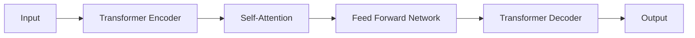

                 

# 体验的authenticity：AI时代的真实性追求

## 1. 背景介绍

在数字化时代，人工智能(AI)正在深刻地改变着我们的生活方式和工作方式。从智能音箱、智能推荐，到虚拟助手、自动驾驶，AI技术在各个领域中发挥着越来越重要的作用。然而，随着AI技术的广泛应用，一个令人深思的问题也随之浮现：在AI驱动的数字世界中，如何保证体验的真实性？本文将深入探讨这一问题，阐述AI技术在追求真实体验中的作用与挑战，以及如何通过技术手段实现更真实的用户交互和沉浸式体验。

## 2. 核心概念与联系

### 2.1 核心概念概述

在探讨真实性的追求时，首先需要明确几个关键概念：

- **人工智能(AI)**：利用计算机技术模拟人类智能行为，包括感知、理解、学习、推理等能力的系统或应用。
- **体验的真实性**：用户在使用AI技术时所感受到的真实感和与物理世界的相似度。
- **用户交互**：用户在AI系统中的操作和反馈，包括输入、输出、情感反馈等。
- **沉浸式体验**：通过技术手段，使用户在虚拟环境中获得接近真实世界的感受。

这些概念相互关联，共同构成了AI时代追求真实体验的基础。AI技术的发展，特别是自然语言处理(NLP)、计算机视觉(CV)、语音识别(SR)等领域的进步，为实现更加真实、自然的用户交互提供了可能。

### 2.2 核心概念原理和架构的 Mermaid 流程图

```mermaid
graph LR
    A[人工智能(AI)] --> B[自然语言处理(NLP)]
    A --> C[计算机视觉(CV)]
    A --> D[语音识别(SR)]
    B --> E[用户交互]
    C --> F[沉浸式体验]
    D --> G[沉浸式体验]
    E --> H[体验的真实性]
```

这个流程图展示了AI技术在实现沉浸式体验和追求真实性中的关键作用。自然语言处理、计算机视觉和语音识别等技术提供了丰富、多样化的输入方式，使得用户能够以更自然、直观的方式与AI系统互动。而沉浸式体验技术则通过多感官、多模态的呈现方式，进一步增强了用户的沉浸感和真实感。

## 3. 核心算法原理 & 具体操作步骤

### 3.1 算法原理概述

AI技术在追求体验的真实性中扮演着核心角色。其基本原理是通过对大量数据的学习和理解，构建起能够模拟人类行为和思维的模型。以自然语言处理为例，模型通过学习大量的文本数据，理解语言的语法、语义和语境，从而能够生成自然、流畅的文本。

### 3.2 算法步骤详解

实现体验的真实性，通常包括以下几个关键步骤：

1. **数据收集与预处理**：收集用户交互数据，包括文本、图像、语音等多种类型的数据，并进行清洗、标注等预处理操作。
2. **模型训练**：使用收集到的数据训练AI模型，如语言模型、视觉模型、语音模型等，以提升模型的泛化能力和准确性。
3. **交互设计**：设计用户界面和交互流程，确保用户能够自然、流畅地与AI系统互动。
4. **真实性评估**：通过用户反馈、A/B测试等手段，评估AI系统的真实性和用户体验，持续优化改进。

### 3.3 算法优缺点

AI技术在追求体验的真实性方面具有显著的优势，但也存在一些局限性：

- **优势**：
  - **自动化与高效**：AI模型能够处理大量数据，提供高效、自动化的解决方案。
  - **灵活性与适应性**：模型可以根据用户反馈进行动态调整，适应不同的使用场景和需求。
  - **多感官整合**：结合多模态数据，提供更为丰富、自然的用户交互体验。

- **局限性**：
  - **数据依赖性**：模型的性能依赖于高质量、大规模的数据集，数据收集和标注成本较高。
  - **解释性不足**：许多AI模型（如深度学习模型）是"黑盒"系统，难以解释其内部工作机制和决策过程。
  - **鲁棒性问题**：模型在面对复杂、多样化的输入时，可能出现误判、偏置等问题。

### 3.4 算法应用领域

AI技术在追求体验的真实性方面的应用广泛，涵盖了以下多个领域：

- **智能客服**：通过自然语言处理和语音识别技术，提供24小时不间断的智能客服服务。
- **虚拟现实(VR)**：结合计算机视觉和沉浸式体验技术，创建逼真的虚拟环境，提升用户体验。
- **增强现实(AR)**：利用图像识别和增强现实技术，将虚拟信息与现实世界无缝融合。
- **个性化推荐**：通过数据分析和机器学习技术，提供个性化的内容推荐，提升用户满意度。
- **医疗健康**：使用AI技术辅助诊断、治疗，提升医疗服务的精准性和效率。

## 4. 数学模型和公式 & 详细讲解 & 举例说明

### 4.1 数学模型构建

在AI模型中，常见的数学模型包括线性回归、逻辑回归、卷积神经网络(CNN)、循环神经网络(RNN)、Transformer等。以Transformer为例，其基本模型结构如图：



Transformer模型通过自注意力机制和多层感知器网络，能够有效处理长序列数据，并生成高质量的文本输出。

### 4.2 公式推导过程

以Transformer模型中的自注意力机制为例，其公式推导如下：

设输入序列为 $X = (x_1, x_2, ..., x_n)$，注意力权重矩阵为 $W_Q, W_K, W_V$，输出序列为 $Y$，则自注意力机制的计算过程如下：

1. 将输入序列 $X$ 投影到查询向量 $Q$、键向量 $K$ 和值向量 $V$ 空间中：
   $$
   Q = X W_Q, K = X W_K, V = X W_V
   $$

2. 计算注意力权重 $A$：
   $$
   A = \frac{e^{QK^T / \sqrt{d_k}}}{\sqrt{d_k}} \in \mathbb{R}^{n \times n}
   $$

3. 通过注意力权重 $A$ 对值向量 $V$ 进行加权求和，得到输出向量 $Y$：
   $$
   Y = \sum_{i=1}^n A_i V_i
   $$

其中 $d_k$ 为键向量的维度。

### 4.3 案例分析与讲解

以Google的BERT模型为例，其通过掩码语言模型和下一句预测任务进行预训练，显著提升了语言模型的性能。以下是一个简单的BERT微调示例：

1. 数据准备：将自然语言数据进行预处理，分词、转换为向量表示等。
2. 模型初始化：使用预训练的BERT模型，初始化微调模型的权重。
3. 定义任务：根据具体任务（如情感分类、文本生成等）定义输出层和损失函数。
4. 模型微调：在微调数据上训练模型，调整权重以匹配任务需求。
5. 模型评估：在测试数据上评估模型性能，输出结果。

## 5. 项目实践：代码实例和详细解释说明

### 5.1 开发环境搭建

为了进行有效的AI项目实践，我们需要搭建一个完整的开发环境，包括以下几个步骤：

1. 安装Python：在Linux系统下，使用命令 `sudo apt-get update && sudo apt-get install python3` 安装Python 3。
2. 安装TensorFlow：使用命令 `pip install tensorflow` 安装TensorFlow。
3. 安装Keras：使用命令 `pip install keras` 安装Keras。
4. 安装Numpy：使用命令 `pip install numpy` 安装Numpy。
5. 安装Scikit-learn：使用命令 `pip install scikit-learn` 安装Scikit-learn。

### 5.2 源代码详细实现

以下是一个简单的情感分类示例，使用Keras框架实现：

```python
from keras.models import Sequential
from keras.layers import Embedding, LSTM, Dense

# 定义模型
model = Sequential()
model.add(Embedding(input_dim=vocab_size, output_dim=embedding_dim, input_length=max_length))
model.add(LSTM(units=64, return_sequences=True))
model.add(LSTM(units=32))
model.add(Dense(units=num_classes, activation='softmax'))

# 编译模型
model.compile(loss='categorical_crossentropy', optimizer='adam', metrics=['accuracy'])

# 训练模型
model.fit(X_train, y_train, epochs=num_epochs, batch_size=batch_size, validation_data=(X_test, y_test))
```

### 5.3 代码解读与分析

以上代码实现了基于LSTM和softmax的情感分类模型。首先定义了模型结构，包括嵌入层、LSTM层和全连接层。然后编译模型，使用交叉熵损失函数和Adam优化器。最后进行模型训练，使用训练集和验证集进行交叉验证。

## 6. 实际应用场景

### 6.1 智能客服系统

智能客服系统通过自然语言处理和机器学习技术，实现24小时不间断的客户服务。用户可以通过文字、语音等方式与AI系统进行互动，系统能够理解用户意图，并根据用户需求提供相应的服务。这种基于AI的智能客服系统能够显著提升客户满意度，降低企业运营成本。

### 6.2 虚拟现实(VR)应用

VR技术结合计算机视觉和沉浸式体验技术，创建逼真的虚拟环境。用户可以在虚拟世界中自由探索，进行虚拟旅游、虚拟会议、虚拟训练等多种活动。这种沉浸式的体验感，能够有效提升用户参与度和体验感。

### 6.3 医疗健康

AI技术在医疗健康领域具有广泛的应用，如辅助诊断、治疗方案推荐、患者监护等。通过深度学习和大数据分析，AI模型能够从海量的医疗数据中提取有价值的信息，辅助医生进行精准诊断和治疗。这种智能化的医疗服务，能够显著提高医疗服务的质量和效率。

## 7. 工具和资源推荐

### 7.1 学习资源推荐

1. **TensorFlow官方文档**：提供了丰富的教程和示例，帮助用户快速上手TensorFlow。
2. **Keras官方文档**：提供了简单易用的API接口，适合初学者快速实现模型。
3. **PyTorch官方文档**：提供了灵活的动态图机制，适合复杂模型的构建和优化。
4. **Google AI博客**：提供了最新的AI研究进展和技术分享，适合跟踪前沿技术。

### 7.2 开发工具推荐

1. **Jupyter Notebook**：提供了交互式的开发环境，支持多种编程语言和库的集成。
2. **Google Colab**：提供了免费的GPU和TPU资源，方便进行大规模模型训练。
3. **TensorBoard**：提供了可视化的训练过程监控，帮助用户优化模型。
4. **Weights & Biases**：提供了实验跟踪和模型评估功能，帮助用户记录和比较模型性能。

### 7.3 相关论文推荐

1. **《自然语言处理综述》**：由斯坦福大学开设的课程，涵盖了自然语言处理的基本概念和常用技术。
2. **《深度学习》**：由Ian Goodfellow等人编写的深度学习教材，系统介绍了深度学习的基本原理和应用。
3. **《生成对抗网络(GANs)》**：由Ian Goodfellow等人编写的论文，介绍了生成对抗网络的基本原理和最新进展。
4. **《强化学习：一种机器学习方法》**：由Sutton等人编写的强化学习教材，系统介绍了强化学习的基本原理和应用。

## 8. 总结：未来发展趋势与挑战

### 8.1 研究成果总结

AI技术在追求体验的真实性方面已经取得了显著的进展，但仍有诸多挑战需要解决。当前的研究成果主要集中在以下几个方面：

1. **数据集的多样性和规模**：数据集的多样性和规模直接决定了模型的泛化能力和性能。目前，许多领域的数据集仍不足够丰富和多样化，需要进一步扩展和构建。
2. **模型的解释性和透明性**：许多AI模型（如深度学习模型）是"黑盒"系统，难以解释其内部工作机制和决策过程。提高模型的解释性和透明性，是未来研究的重要方向。
3. **鲁棒性和泛化能力**：模型在面对复杂、多样化的输入时，可能出现误判、偏置等问题。提高模型的鲁棒性和泛化能力，是提升用户体验的关键。

### 8.2 未来发展趋势

未来，AI技术在追求体验的真实性方面将呈现以下几个发展趋势：

1. **多模态融合**：结合多种模态（如文本、图像、语音）的数据，提供更为丰富、自然的用户交互体验。
2. **交互式学习**：通过用户反馈，不断调整和优化模型，提升用户体验。
3. **个性化推荐**：基于用户行为和偏好，提供个性化的内容推荐，提升用户满意度。
4. **边缘计算**：将计算任务推向边缘设备，降低延迟和带宽消耗，提升用户体验。
5. **联邦学习**：通过分布式训练，保护用户隐私，提升模型的安全性和鲁棒性。

### 8.3 面临的挑战

尽管AI技术在追求体验的真实性方面取得了一定的进展，但仍面临诸多挑战：

1. **数据隐私和安全**：用户数据隐私和安全问题一直是AI技术面临的重要挑战。如何在保护用户隐私的前提下，获取高质量的数据，是未来研究的重要方向。
2. **模型鲁棒性和泛化能力**：模型在面对复杂、多样化的输入时，可能出现误判、偏置等问题。提高模型的鲁棒性和泛化能力，是提升用户体验的关键。
3. **模型解释性和透明性**：许多AI模型（如深度学习模型）是"黑盒"系统，难以解释其内部工作机制和决策过程。提高模型的解释性和透明性，是未来研究的重要方向。
4. **计算资源和算法效率**：随着模型规模的增大，计算资源和算法效率成为制约因素。如何在保持性能的同时，优化资源消耗，是未来研究的重要课题。

### 8.4 研究展望

未来，AI技术在追求体验的真实性方面的研究将聚焦以下几个方向：

1. **无监督学习和半监督学习**：摆脱对大规模标注数据的依赖，利用自监督学习、主动学习等无监督和半监督范式，最大限度利用非结构化数据，实现更加灵活高效的体验追求。
2. **多模态融合与交互式学习**：结合多种模态（如文本、图像、语音）的数据，通过用户反馈不断调整和优化模型，提升用户体验。
3. **联邦学习和分布式训练**：通过分布式训练，保护用户隐私，提升模型的安全性和鲁棒性。
4. **模型压缩与优化**：优化模型的计算图，减少前向传播和反向传播的资源消耗，实现更加轻量级、实时性的体验追求。
5. **模型解释性与透明性**：提高模型的解释性和透明性，增强用户体验的可解释性和可控性。

## 9. 附录：常见问题与解答

**Q1：如何提高AI模型的泛化能力？**

A: 提高AI模型的泛化能力可以从以下几个方面入手：
1. 增加数据多样性和规模：丰富和多样化数据集，提升模型的泛化能力。
2. 正则化技术：使用L2正则、Dropout等正则化技术，防止过拟合。
3. 迁移学习：将预训练模型进行微调，利用其在其他任务上学习到的知识。
4. 对抗训练：引入对抗样本，提高模型的鲁棒性和泛化能力。

**Q2：如何提高AI模型的解释性？**

A: 提高AI模型的解释性可以从以下几个方面入手：
1. 特征可视化：使用t-SNE、PCA等工具可视化模型的特征空间。
2. 可解释模型：使用线性模型、决策树等可解释性较强的模型。
3. 特征重要性：使用SHAP、LIME等工具分析模型的特征重要性。
4. 模型调试：通过A/B测试、用户反馈等方式，逐步优化模型。

**Q3：如何优化AI模型的计算效率？**

A: 优化AI模型的计算效率可以从以下几个方面入手：
1. 模型压缩与优化：使用剪枝、量化等技术，优化模型的计算图。
2. 分布式训练：利用多机多核的计算资源，加速模型训练。
3. 算法优化：优化算法，减少计算量和内存消耗。
4. 硬件加速：使用GPU、TPU等硬件加速器，提高计算速度。

**Q4：如何在保护用户隐私的前提下获取高质量数据？**

A: 在保护用户隐私的前提下获取高质量数据可以从以下几个方面入手：
1. 匿名化技术：使用数据匿名化技术，保护用户隐私。
2. 数据收集授权：通过用户授权协议，合法获取用户数据。
3. 联邦学习：利用分布式训练技术，保护用户隐私。
4. 隐私保护算法：使用差分隐私等隐私保护算法，保护用户数据隐私。

作者：禅与计算机程序设计艺术 / Zen and the Art of Computer Programming

