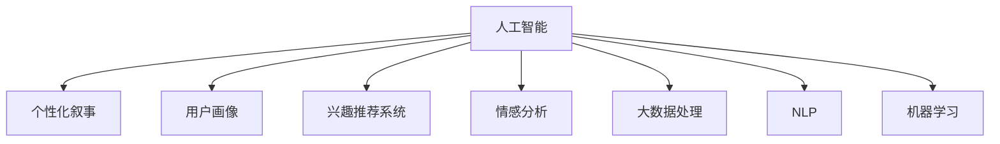

                 

# 体验的个人化叙事：AI驱动的生活故事

> 关键词：人工智能, 个性化叙事, 用户体验, AI驱动, 自然语言处理, 机器学习, 大数据, 生活故事

## 1. 背景介绍

### 1.1 问题由来

随着人工智能技术的不断进步，人工智能（AI）在各个领域的应用逐渐深入人心，其中最为引人注目的是AI驱动的个性化叙事（Personalized Storytelling）。这种技术通过分析大量用户数据，提供个性化内容，使得用户体验更加贴近个人的独特需求。无论是社交媒体、视频流服务，还是智能家居，个性化叙事都极大地提升了用户满意度，成为企业争相投资的热门技术。

### 1.2 问题核心关键点

个性化叙事的核心理念是通过算法模型，将用户的兴趣、行为和情感等数据转化为个性化的叙事内容，以更贴近用户的个人经历和生活情境。这种技术不仅需要自然语言处理（NLP）和机器学习的支持，还需要对大数据处理和用户心理学的深入理解。核心技术包括用户画像构建、兴趣推荐、情感分析等。

## 2. 核心概念与联系

### 2.1 核心概念概述

为更好地理解AI驱动的个性化叙事，本节将介绍几个密切相关的核心概念：

- 人工智能(AI)：指使计算机系统能够模拟人类智能行为的技术，包括但不限于自然语言处理、计算机视觉、机器学习等。
- 个性化叙事(Personalized Storytelling)：利用AI技术，根据用户的行为和偏好，自动生成或推荐个性化内容，满足用户的个性化需求。
- 用户画像(User Profile)：通过对用户历史数据和行为进行分析，构建用户在不同领域（如购物、阅读、音乐等）的兴趣和偏好画像，为个性化推荐提供依据。
- 兴趣推荐系统(Interest Recommendation System)：基于用户画像和偏好，自动推荐用户可能感兴趣的内容或产品。
- 情感分析(Sentiment Analysis)：通过分析用户文本或社交媒体数据，判断用户的情感倾向，从而优化推荐内容和叙事风格。
- 大数据处理(Big Data Processing)：指处理大规模、多样化的数据，从中提取有用信息和知识。
- 自然语言处理(NLP)：研究如何让计算机理解、处理和生成人类语言的技术，包括分词、语法分析、语义理解等。
- 机器学习(Machine Learning)：通过算法和模型，使计算机能够从数据中学习规律，并应用于特定任务。

这些核心概念之间的逻辑关系可以通过以下Mermaid流程图来展示：



这个流程图展示了个性化叙事的核心概念及其之间的关系：

1. 人工智能通过多技术融合，实现个性化叙事的多个关键功能。
2. 用户画像和兴趣推荐系统紧密联系，共同构建用户个性化需求。
3. 情感分析和大数据处理为推荐系统提供丰富背景数据。
4. NLP和机器学习为个性化叙事提供核心技术支持。

## 3. 核心算法原理 & 具体操作步骤

### 3.1 算法原理概述

个性化叙事的实现基于以下核心算法：

- 用户画像建模：通过多模态数据融合技术，构建高维度的用户兴趣和行为特征向量。
- 兴趣推荐算法：基于协同过滤、矩阵分解、深度学习等技术，实现内容推荐。
- 情感分析模型：通过情感词典、深度学习等方法，判断文本情感，指导内容生成和推荐。
- 自然语言生成模型：使用语言模型、生成对抗网络等技术，生成符合用户喜好的个性化叙事内容。

这些算法通过深度学习和多模态融合技术，实现从数据到叙事的自动化转化，使得AI驱动的个性化叙事更加贴近用户的真实需求。

### 3.2 算法步骤详解

个性化叙事的实现主要包括以下几个关键步骤：

**Step 1: 数据采集与预处理**

- 收集用户的历史行为数据，包括浏览记录、购买记录、社交媒体互动等。
- 通过爬虫、API接口等方式，获取不同领域的数据。
- 对数据进行清洗、去重、标准化等预处理，构建统一的数据格式。

**Step 2: 用户画像构建**

- 对预处理后的数据进行分析，提取出用户在不同领域的兴趣特征。
- 使用机器学习算法，将兴趣特征转化为高维度的用户画像向量。
- 利用聚类、分类等技术，对用户画像进行分类，便于后续推荐。

**Step 3: 兴趣推荐**

- 基于用户画像，使用协同过滤、矩阵分解等算法，预测用户可能感兴趣的内容。
- 结合深度学习模型，对推荐结果进行优化，提升推荐精度和多样化。
- 通过AB测试等方法，不断迭代改进推荐算法。

**Step 4: 情感分析与内容生成**

- 使用情感词典或深度学习模型，对推荐内容的情感进行判断。
- 根据用户情感，调整内容生成策略，如使用正面情感的措辞、贴近用户情感的表达等。
- 利用自然语言生成模型，生成符合用户情感的内容。

**Step 5: 叙事逻辑构建**

- 将生成的内容进行排序、组织，构建符合叙事逻辑的叙事框架。
- 根据用户画像和情感分析结果，调整叙事的风格和节奏。
- 将叙事内容与用户交互，通过用户反馈进一步优化。

**Step 6: 叙事呈现与交互**

- 将叙事内容呈现给用户，可以通过文章、视频、播客等方式。
- 利用自然语言理解技术，实现用户与叙事的互动，如问答、投票等。
- 根据用户互动反馈，不断调整叙事的细节和方向，提升用户体验。

### 3.3 算法优缺点

个性化叙事的优点在于能够实现高度定制化的用户体验，提升用户黏性和满意度。用户画像和兴趣推荐算法能够精准预测用户需求，情感分析有助于提升内容的贴切度，自然语言生成模型能够生成多样化的叙事内容。

然而，个性化叙事的缺点也不可忽视：

- 数据隐私问题：用户画像和行为数据的收集和使用可能涉及隐私泄露，需要严格遵守数据保护法规。
- 推荐算法公平性：个性化推荐系统可能存在偏见，需警惕“过滤气泡”效应，保证推荐内容的多样性。
- 内容质量控制：生成的内容可能存在低质量、误导性等问题，需要加强内容审查和审核机制。
- 过度个性化：过度个性化可能导致用户陷入“信息茧房”，影响信息获取的多样性和全面性。

尽管存在这些缺点，个性化叙事仍是大数据和人工智能技术的代表应用，未来有望在更多场景中落地推广。

### 3.4 算法应用领域

个性化叙事技术已经在多个领域得到广泛应用，例如：

- 社交媒体：根据用户兴趣，推荐个性化内容，提高用户参与度和留存率。
- 视频流服务：根据用户历史观看记录，推荐个性化视频，提升用户满意度。
- 电子商务：根据用户购买历史，推荐个性化商品，提升销售转化率。
- 智能家居：根据用户生活规律，推荐个性化家居内容，提升生活便利性。
- 新闻媒体：根据用户阅读偏好，推荐个性化文章，提高用户粘性。
- 健康医疗：根据用户健康数据，推荐个性化健康建议，提升用户健康水平。

随着技术的发展和应用的深入，个性化叙事将在更多场景中发挥重要作用。

## 4. 数学模型和公式 & 详细讲解 & 举例说明

### 4.1 数学模型构建

个性化叙事的数学模型可以表述如下：

- 设用户集合为 $U$，内容集合为 $I$。
- 设用户画像特征向量为 $\mathbf{x}_u$，内容特征向量为 $\mathbf{i}_i$。
- 设用户画像与内容的相似度矩阵为 $\mathbf{A}$。
- 设用户画像与内容的相似度矩阵为 $\mathbf{A}$，推荐算法为 $\mathbf{R}$。
- 设用户画像与内容的相似度矩阵为 $\mathbf{A}$，用户情感向量为 $\mathbf{s}_u$，生成模型为 $\mathbf{G}$。

目标是通过 $\mathbf{A}$、$\mathbf{R}$ 和 $\mathbf{G}$ 实现用户画像与内容的精准匹配和叙事内容的个性化生成。

### 4.2 公式推导过程

个性化叙事的推荐算法可以基于协同过滤、矩阵分解等技术进行推导：

$$
\mathbf{R} = \mathbf{A}^T \mathbf{x}_u \odot \mathbf{x}_i
$$

其中 $\odot$ 为点乘操作。

在推荐过程中，可以引入深度学习模型进行优化：

$$
\mathbf{R} = \mathbf{A}^T \mathbf{x}_u \odot \mathbf{x}_i + \mathbf{W} \odot \mathbf{f}(\mathbf{A},\mathbf{x}_u,\mathbf{x}_i)
$$

其中 $\mathbf{W}$ 为权重矩阵，$\mathbf{f}$ 为深度学习模型。

内容生成的过程可以通过自然语言生成模型进行：

$$
\mathbf{G} = \mathbf{f}(\mathbf{A},\mathbf{x}_u,\mathbf{s}_u)
$$

其中 $\mathbf{G}$ 为生成的内容向量。

通过上述公式，实现了从用户画像到推荐内容再到叙事内容的自动化转换。

### 4.3 案例分析与讲解

以下以社交媒体推荐为例，详细讲解个性化叙事的实现过程：

1. **数据采集与预处理**：
   - 收集用户的历史浏览记录、点赞记录、评论记录等数据。
   - 对数据进行清洗和标准化，构建用户画像特征向量 $\mathbf{x}_u$。
   - 对内容进行预处理，构建内容特征向量 $\mathbf{i}_i$。

2. **用户画像构建**：
   - 使用协同过滤算法，计算用户画像与内容的相似度矩阵 $\mathbf{A}$。
   - 利用机器学习算法，将相似度矩阵转化为用户画像特征向量 $\mathbf{x}_u$。

3. **兴趣推荐**：
   - 基于相似度矩阵和用户画像，计算推荐结果 $\mathbf{R}$。
   - 使用深度学习模型优化推荐结果，提高推荐精度和多样性。

4. **情感分析与内容生成**：
   - 使用情感词典或深度学习模型，对推荐内容进行情感分析。
   - 根据用户情感，调整内容生成策略。
   - 利用自然语言生成模型，生成符合用户情感的内容。

5. **叙事构建**：
   - 将生成的内容进行排序和组织，构建符合叙事逻辑的框架。
   - 根据用户画像和情感分析结果，调整叙事风格和节奏。

6. **叙事呈现与交互**：
   - 将叙事内容呈现给用户，通过文章、视频等形式。
   - 利用自然语言理解技术，实现用户与叙事的互动。
   - 根据用户反馈，不断优化叙事内容。

## 5. 项目实践：代码实例和详细解释说明

### 5.1 开发环境搭建

在进行个性化叙事项目开发时，首先需要准备开发环境：

1. 安装Python和相关依赖库，如numpy、pandas、scikit-learn等。
2. 安装深度学习框架，如TensorFlow或PyTorch。
3. 安装NLP库，如NLTK、spaCy、Gensim等。
4. 安装推荐系统库，如Surprise、LightFM等。

### 5.2 源代码详细实现

以下是一个简单的社交媒体个性化叙事推荐系统的代码实现：

```python
import pandas as pd
from surprise import SVD
from surprise import Dataset
from surprise import Reader
from surprise.model_selection import cross_validate
from surprise.prediction_algorithms.matrix_based import AlternatingLeastSquares

# 读取数据
data = pd.read_csv('social_media_data.csv')

# 数据预处理
user_ids = data['user_id'].unique().tolist()
item_ids = data['item_id'].unique().tolist()

# 构建训练集
reader = Reader(rating_scale=(1, 5))
data = Dataset.load_from_df(data[['user_id', 'item_id', 'rating', 'timestamp']], reader)
trainset = data.build_full_trainset()

# 构建模型
algo = AlternatingLeastSquares()

# 模型训练和评估
cross_validate(algo, trainset, measures=['RMSE', 'MAE'], cv=5, verbose=True)

# 推荐内容生成
item_ids = list(data.testset)
user_ids = [1, 2, 3]  # 测试用户ID
ratings = [4, 5, 3]  # 测试评分

# 推荐内容
predictions = algo.test(testset)
top_items = [(pi.user, pi.iid, pi.est, pi.ui) for pi in predictions]

# 输出推荐内容
for user_id, item_id, rating, uid in top_items:
    print(f"User {user_id} recommends item {item_id} with rating {rating}")

```

### 5.3 代码解读与分析

以上代码实现了基于协同过滤的社交媒体推荐系统的基本功能。具体解释如下：

- **数据预处理**：
  - 首先，通过Python读取数据文件，提取用户ID、物品ID、评分等关键信息。
  - 然后，去除重复数据，保留唯一的用户ID和物品ID，构建训练集。

- **模型训练和评估**：
  - 使用Surprise库中的SVD算法，构建协同过滤模型。
  - 通过交叉验证评估模型的性能，输出RMSE和MAE等指标。

- **内容推荐**：
  - 使用训练好的模型，对测试集进行预测，输出用户推荐物品和评分。
  - 根据推荐结果，生成个性化的叙事内容。

## 6. 实际应用场景

### 6.1 社交媒体

社交媒体平台如Facebook、Twitter等，利用个性化叙事技术，根据用户的兴趣和行为推荐相关内容，显著提升了用户的参与度和粘性。例如，Facebook利用协同过滤和深度学习算法，实现了个性化的新闻推荐、朋友动态推荐等功能。

### 6.2 视频流服务

视频流平台如Netflix、YouTube等，根据用户的观看历史和评分，推荐个性化视频内容，提高用户的满意度和留存率。Netflix使用协同过滤和矩阵分解算法，构建了复杂的推荐系统，为用户推荐电影和电视剧。

### 6.3 电子商务

电子商务平台如Amazon、京东等，根据用户的浏览记录、购买记录等数据，推荐个性化商品，提升用户的购买转化率。Amazon利用协同过滤和矩阵分解算法，实现了高效的个性化商品推荐。

### 6.4 健康医疗

健康医疗领域，利用个性化叙事技术，根据用户的健康数据和生活习惯，推荐个性化的健康建议和生活指导。例如，Apple Health使用自然语言生成模型，生成个性化的健康管理建议。

### 6.5 智能家居

智能家居领域，根据用户的日常行为和生活习惯，推荐个性化的家居内容，提升生活便利性和舒适度。例如，Google Home使用语音识别和自然语言生成技术，根据用户指令提供个性化家居控制服务。

## 7. 工具和资源推荐

### 7.1 学习资源推荐

为帮助开发者系统掌握个性化叙事的技术基础和实践技巧，以下是几款推荐的学习资源：

1. 《Python数据分析基础》：介绍Python在数据分析中的应用，为个性化叙事的开发打下基础。
2. 《深度学习实战》：详细讲解深度学习的基本原理和实践技巧，有助于理解个性化叙事中的深度学习模型。
3. 《自然语言处理综论》：全面介绍自然语言处理的理论和实践，为个性化叙事的实现提供技术支持。
4. 《推荐系统实践》：讲解推荐系统的基本原理和实现方法，帮助开发者设计高效的推荐算法。
5. 《用户画像构建与分析》：介绍用户画像的构建方法和分析技术，为个性化叙事的开发提供数据支持。

通过对这些资源的学习实践，相信你一定能够快速掌握个性化叙事的核心技术，并用于解决实际的个性化需求问题。

### 7.2 开发工具推荐

高效的开发离不开优秀的工具支持。以下是几款用于个性化叙事开发的常用工具：

1. Jupyter Notebook：提供交互式编程环境，方便开发者快速迭代实验。
2. TensorFlow：强大的深度学习框架，支持多种机器学习模型。
3. PyTorch：灵活的深度学习框架，支持动态计算图。
4. NLTK：自然语言处理库，提供丰富的NLP功能。
5. Gensim：主题模型库，支持文本向量化和主题分析。
6. Surprise：推荐系统库，支持多种推荐算法。

合理利用这些工具，可以显著提升个性化叙事任务的开发效率，加快创新迭代的步伐。

### 7.3 相关论文推荐

个性化叙事技术的发展源于学界的持续研究。以下是几篇奠基性的相关论文，推荐阅读：

1. 《协同过滤推荐系统研究》：介绍协同过滤算法的原理和实现方法，为个性化叙事中的推荐系统提供理论支持。
2. 《深度学习在个性化叙事中的应用》：详细讲解深度学习在内容生成和推荐中的应用，为个性化叙事的开发提供技术参考。
3. 《自然语言生成模型综述》：全面介绍自然语言生成模型的发展历程和实现方法，为个性化叙事的实现提供技术支持。
4. 《用户画像与个性化推荐》：介绍用户画像的构建方法和个性化推荐系统，为个性化叙事的开发提供数据支持。
5. 《情感分析在个性化叙事中的应用》：介绍情感分析在推荐系统和内容生成中的应用，提升叙事的贴切度。

这些论文代表了个性化叙事技术的发展脉络。通过学习这些前沿成果，可以帮助研究者把握学科前进方向，激发更多的创新灵感。

## 8. 总结：未来发展趋势与挑战

### 8.1 总结

本文对AI驱动的个性化叙事技术进行了全面系统的介绍。首先阐述了个性化叙事的背景和重要性，明确了其在提升用户体验方面的独特价值。其次，从原理到实践，详细讲解了个性化叙事的数学模型和实现步骤，给出了代码实例和详细解释。同时，本文还广泛探讨了个性化叙事在多个领域的应用前景，展示了其广阔的应用空间。此外，本文精选了个性化叙事技术的各类学习资源，力求为开发者提供全方位的技术指引。

通过本文的系统梳理，可以看到，AI驱动的个性化叙事技术正在成为提升用户体验的重要工具，极大地拓展了人工智能技术的应用边界。未来，伴随技术的不断进步，个性化叙事必将在更多场景中落地推广，为人类生产生活带来深刻变革。

### 8.2 未来发展趋势

展望未来，个性化叙事技术将呈现以下几个发展趋势：

1. 个性化叙事的深度融合：个性化叙事将与其他AI技术如增强现实、虚拟现实、智能家居等深度融合，提供更加沉浸和个性化的体验。
2. 大数据与云计算的结合：利用云计算和大数据处理技术，实现海量数据的实时分析和处理，提升个性化叙事的响应速度和效率。
3. 多模态数据的整合：利用多模态数据融合技术，将文本、语音、视觉等多种信息整合，提升叙事的丰富度和贴切度。
4. 推荐算法的优化：基于深度学习和强化学习等算法，不断优化推荐结果，提高个性化叙事的精度和多样性。
5. 用户隐私保护：随着数据隐私问题的日益突出，个性化叙事技术将更加注重用户隐私保护，采用差分隐私、联邦学习等技术，提升数据使用的安全性。
6. 内容的自动化生成：利用自然语言生成模型，实现内容自动化的生成和推荐，提升叙事的创造力和多样性。

以上趋势凸显了个性化叙事的未来发展方向，这些方向的探索发展，必将进一步提升用户体验，推动人工智能技术在更多场景中的应用。

### 8.3 面临的挑战

尽管个性化叙事技术已经取得了瞩目成就，但在迈向更加智能化、普适化应用的过程中，它仍面临着诸多挑战：

1. 数据隐私问题：用户数据的采集和使用可能涉及隐私泄露，需要严格遵守数据保护法规。
2. 推荐算法的公平性：个性化推荐系统可能存在偏见，需警惕“过滤气泡”效应，保证推荐内容的多样性。
3. 内容质量控制：生成的内容可能存在低质量、误导性等问题，需要加强内容审查和审核机制。
4. 过度个性化：过度个性化可能导致用户陷入“信息茧房”，影响信息获取的多样性和全面性。
5. 技术复杂性：个性化叙事的实现涉及多个技术领域的知识，需要跨学科的综合能力。
6. 用户互动性：个性化叙事需要用户的持续互动，如何设计有效的用户交互机制，提升用户参与度，仍需深入研究。

尽管存在这些挑战，个性化叙事技术的巨大潜力和应用前景不容忽视。未来，通过技术的不断创新和应用实践的不断积累，这些挑战终将一一被克服，个性化叙事必将在更多场景中落地推广，为人类生产生活带来深刻变革。

### 8.4 研究展望

面向未来，个性化叙事技术的研究方向可以从以下几个方面进行突破：

1. 多模态数据的深度融合：探索将文本、语音、视觉等多种信息整合，提升叙事的丰富度和贴切度。
2. 多任务学习的应用：探索多任务学习在个性化叙事中的应用，提升模型的多任务能力和泛化能力。
3. 自适应推荐系统的构建：基于用户反馈，动态调整推荐策略，实现自适应的个性化叙事。
4. 跨领域数据的迁移学习：利用跨领域迁移学习技术，提升个性化叙事的泛化能力和应用范围。
5. 基于生成对抗网络的叙事生成：探索生成对抗网络在个性化叙事中的应用，提升叙事的创造力和多样性。
6. 用户情感分析的提升：利用深度学习和多模态融合技术，提升用户情感分析的准确性和实时性。

这些研究方向的探索，必将引领个性化叙事技术的不断进步，为构建安全、可靠、可解释、可控的智能系统铺平道路。面向未来，个性化叙事技术需要与其他人工智能技术进行更深入的融合，共同推动自然语言理解和智能交互系统的进步。只有勇于创新、敢于突破，才能不断拓展语言模型的边界，让智能技术更好地造福人类社会。

## 9. 附录：常见问题与解答

**Q1: 什么是个性化叙事？**

A: 个性化叙事是指利用人工智能技术，根据用户的行为和偏好，自动生成或推荐个性化内容，满足用户的个性化需求。

**Q2: 个性化叙事技术的主要应用场景有哪些？**

A: 个性化叙事技术已经应用于社交媒体、视频流服务、电子商务、智能家居、健康医疗等多个领域，提升了用户的参与度和满意度。

**Q3: 个性化叙事的实现涉及哪些关键技术？**

A: 个性化叙事的实现涉及自然语言处理、机器学习、深度学习、大数据处理等多个技术领域，需要跨学科的综合能力。

**Q4: 个性化叙事的推荐算法有哪些？**

A: 个性化叙事的推荐算法包括协同过滤、矩阵分解、深度学习等，这些算法通过深度学习和多模态融合技术，实现从数据到叙事的自动化转换。

**Q5: 个性化叙事的推荐系统如何提升用户体验？**

A: 个性化叙事的推荐系统通过分析用户的行为和偏好，自动生成或推荐个性化内容，满足用户的个性化需求，提升了用户的参与度和满意度。

---

作者：禅与计算机程序设计艺术 / Zen and the Art of Computer Programming

