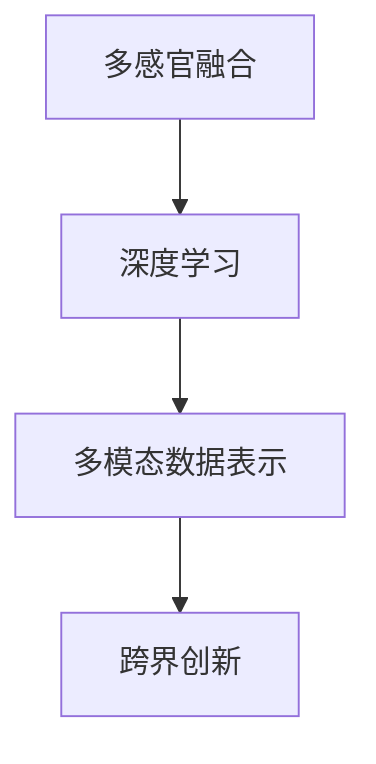

                 

# 体验的多维度构建器：AI创造的感官世界

> 关键词：多感官融合，人工智能，感官增强，沉浸式体验，跨界创新

## 1. 背景介绍

### 1.1 问题由来

随着技术的迅猛发展，我们正步入一个多感官融合的时代。人工智能(AI)在处理海量的感官数据方面展现出巨大的潜力，为创建沉浸式、交互式和个性化的感官体验提供了新的可能。然而，如何有效融合和处理这些数据，为人类提供更加丰富、深刻的感官体验，成为了当前的热点话题。

### 1.2 问题核心关键点

目前，基于人工智能的多感官融合技术主要包括以下几个关键点：

- **多模态数据融合**：通过整合视觉、听觉、触觉、味觉等多种感官信息，构建统一的数据空间，使得AI能够全面理解人类的感官体验。
- **深度学习算法**：利用深度学习模型（如卷积神经网络、循环神经网络等）对多感官数据进行特征提取和模式识别，提升数据的利用效率。
- **交互式界面设计**：创建直观、易用的交互界面，使用户能够轻松地操作和体验AI系统。
- **个性化定制**：根据用户偏好和历史行为，动态调整感官体验的参数和内容，提供更加贴合个体需求的体验。

### 1.3 问题研究意义

研究基于多感官融合的AI技术，对于提升用户体验、推动数字文化产业发展、实现跨界创新具有重要意义：

1. **提升用户体验**：通过多感官融合技术，为用户提供更加真实、丰富的感官体验，改善用户的互动方式和情感连接。
2. **推动数字文化产业**：AI技术的应用使得数字文化产品（如虚拟现实、增强现实、沉浸式剧场等）得以更广泛普及，为文化创意产业注入新的活力。
3. **实现跨界创新**：多感官融合技术能够打破不同领域间的界限，推动AI在健康、教育、娱乐、旅游等领域的深度融合，催生更多创新应用场景。

## 2. 核心概念与联系

### 2.1 核心概念概述

为更好地理解多感官融合技术，本节将介绍几个关键概念及其相互联系：

- **多感官融合**：将视觉、听觉、触觉、味觉等多种感官信息进行融合，构建统一的数据空间，供AI模型进行分析和处理。
- **深度学习模型**：如卷积神经网络(CNN)、循环神经网络(RNN)、Transformer等，用于提取和处理多感官数据中的特征。
- **多模态数据表示**：通过将不同模态的数据映射到统一的向量空间，使得AI能够对不同类型的数据进行协同分析。
- **跨界创新**：通过将AI技术与不同行业的需求相结合，创造出全新的产品和服务，如虚拟现实游戏、健康监控系统等。

这些概念之间的逻辑关系可以通过以下Mermaid流程图来展示：



这个流程图展示了一个基本的逻辑框架：

1. 多感官融合技术是构建多模态数据表示的基础。
2. 深度学习模型在多模态数据表示的基础上，进行特征提取和模式识别。
3. 跨界创新则是深度学习模型在实际应用中，结合不同领域需求创造新应用场景的成果。

## 3. 核心算法原理 & 具体操作步骤
### 3.1 算法原理概述

多感官融合技术基于深度学习框架，旨在通过整合多种感官数据，构建多模态的数据表示，并在此基础上进行特征提取和模式识别。其核心原理可以概述如下：

- **数据融合**：将多种感官的数据整合到一个统一的空间中，形成一个多模态的数据集。
- **特征提取**：利用深度学习模型对多模态数据集进行特征提取，生成高维度的特征向量。
- **模型训练**：在特征向量上训练深度学习模型，学习到不同感官间的关联关系。
- **应用实现**：将训练好的模型应用于实际场景，实现多感官数据的协同分析和应用。

### 3.2 算法步骤详解

多感官融合技术主要包括以下几个关键步骤：

**Step 1: 多感官数据采集**

- 使用传感器（如摄像头、麦克风、触觉传感器等）收集不同模态的数据。
- 对采集到的数据进行预处理，如去噪、归一化等，确保数据质量和一致性。

**Step 2: 数据融合**

- 利用多模态数据融合算法，如特征级融合、信息级融合等，将不同模态的数据进行融合。
- 生成多模态数据表示，形成统一的数据空间。

**Step 3: 特征提取**

- 使用深度学习模型对融合后的多模态数据表示进行特征提取。
- 生成高维度的特征向量，用于后续的模型训练和推理。

**Step 4: 模型训练**

- 选择合适的深度学习模型（如CNN、RNN、Transformer等），在特征向量上进行训练。
- 使用标注数据集，对模型进行监督学习，优化模型参数。

**Step 5: 应用实现**

- 将训练好的模型应用于实际场景，对用户的感官输入进行处理和分析。
- 生成响应数据，并通过输出设备（如显示器、扬声器、触觉反馈设备等）提供多感官体验。

### 3.3 算法优缺点

多感官融合技术在提升用户体验、推动数字文化产业发展方面具有显著优势：

**优点**：
- **多感官融合**：能够提供更加真实、丰富的感官体验，改善用户的互动方式和情感连接。
- **深度学习应用**：利用深度学习模型，提升数据的利用效率，实现复杂的模式识别和分析。
- **跨界创新**：推动AI技术与不同领域的需求相结合，创造出全新的产品和服务。

**缺点**：
- **数据采集难度高**：多种感官数据的采集和使用需要高成本、复杂的技术手段。
- **数据处理复杂**：多模态数据的多样性和复杂性增加了数据处理的难度。
- **用户隐私问题**：多感官数据融合可能涉及用户隐私信息，需要严格的数据保护措施。

### 3.4 算法应用领域

多感官融合技术在多个领域都有广泛的应用，包括但不限于：

- **虚拟现实与增强现实**：通过多感官融合技术，创建沉浸式、交互式的虚拟现实和增强现实体验，如虚拟旅游、虚拟试衣等。
- **健康监控与康复**：利用触觉、味觉等感官信息，结合深度学习模型，实现对用户的健康状况进行实时监控和康复指导。
- **智能家居与环境控制**：通过视觉、声音、温度等传感器的融合，实现智能家居环境的自动化和个性化控制。
- **娱乐与游戏**：创建高度沉浸的多感官游戏体验，如VR/AR游戏、互动剧场等。
- **教育与培训**：通过多感官融合技术，提供更加生动、互动的学习体验，提升教育效果。

## 4. 数学模型和公式 & 详细讲解 & 举例说明
### 4.1 数学模型构建

本节将使用数学语言对多感官融合技术的核心算法进行更加严格的刻画。

设多模态数据集为 $D = \{(x_1, y_1), (x_2, y_2), ..., (x_n, y_n)\}$，其中 $x_i = (x_{i1}, x_{i2}, ..., x_{im}) \in \mathbb{R}^m$ 表示第 $i$ 个样本的多模态数据表示，$y_i \in \{0,1\}$ 表示其对应的标签。

定义多感官融合函数为 $F: \mathbb{R}^m \rightarrow \mathbb{R}^k$，其中 $k$ 表示融合后的向量维度。设融合后的多模态数据表示为 $Z = (z_1, z_2, ..., z_k)$。

定义深度学习模型为 $M: \mathbb{R}^k \rightarrow \mathbb{R}^l$，其中 $l$ 表示输出维度。设模型输出的特征表示为 $\hat{y} = M(Z)$。

### 4.2 公式推导过程

以下我们以视觉和触觉数据的融合为例，推导多感官融合的数学模型。

设视觉数据为 $x_{vi}$，触觉数据为 $x_{ti}$。则多感官融合模型可以表示为：

$$
F(x_{vi}, x_{ti}) = \omega_{vi} \cdot x_{vi} + \omega_{ti} \cdot x_{ti}
$$

其中 $\omega_{vi}$ 和 $\omega_{ti}$ 表示视觉和触觉数据的权重，通常通过实验确定。

将融合后的多模态数据表示 $Z = F(x_{vi}, x_{ti})$ 代入深度学习模型 $M$，得到：

$$
\hat{y} = M(Z)
$$

其中 $\hat{y}$ 表示模型对样本的预测结果。

通过反向传播算法，可以求得模型参数 $\theta$ 的梯度：

$$
\frac{\partial \hat{y}}{\partial \theta} = \frac{\partial M(Z)}{\partial Z} \cdot \frac{\partial Z}{\partial \theta}
$$

### 4.3 案例分析与讲解

假设有一个智能家居环境，通过摄像头、温度传感器和声音传感器收集用户的视觉、触觉和听觉数据。

**数据采集**：
- 使用摄像头获取用户的视觉图像。
- 使用温度传感器获取室内温度数据。
- 使用麦克风获取用户的语音指令。

**数据融合**：
- 将视觉、触觉和听觉数据通过多感官融合函数 $F$ 进行融合，生成多模态数据表示 $Z$。

**特征提取**：
- 使用深度学习模型 $M$ 对融合后的多模态数据表示 $Z$ 进行特征提取，生成高维度的特征向量 $\hat{y}$。

**模型训练**：
- 使用标注数据集对模型 $M$ 进行训练，优化模型参数 $\theta$。

**应用实现**：
- 在实际应用中，将训练好的模型 $M$ 应用于智能家居环境，对用户的感官输入进行处理和分析。
- 根据用户的行为和环境条件，动态调整室内温度、照明等环境参数，提升用户的舒适度。

## 5. 项目实践：代码实例和详细解释说明
### 5.1 开发环境搭建

在进行多感官融合技术开发前，我们需要准备好开发环境。以下是使用Python进行PyTorch开发的环境配置流程：

1. 安装Anaconda：从官网下载并安装Anaconda，用于创建独立的Python环境。

2. 创建并激活虚拟环境：
```bash
conda create -n multi_sensory_env python=3.8 
conda activate multi_sensory_env
```

3. 安装PyTorch：根据CUDA版本，从官网获取对应的安装命令。例如：
```bash
conda install pytorch torchvision torchaudio cudatoolkit=11.1 -c pytorch -c conda-forge
```

4. 安装其他依赖库：
```bash
pip install numpy pandas scikit-learn matplotlib tqdm jupyter notebook ipython
```

完成上述步骤后，即可在`multi_sensory_env`环境中开始多感官融合技术的开发。

### 5.2 源代码详细实现

这里我们以视觉和触觉数据融合为例，给出使用PyTorch进行多感官融合的Python代码实现。

首先，定义数据处理函数：

```python
import torch
from torch.utils.data import Dataset
import numpy as np
from torchvision import transforms

class MultiSensoryDataset(Dataset):
    def __init__(self, vis_data, tac_data, labels):
        self.vis_data = vis_data
        self.tac_data = tac_data
        self.labels = labels
        self.transform = transforms.Compose([
            transforms.ToTensor(),
            transforms.Normalize((0.5, 0.5, 0.5), (0.5, 0.5, 0.5))
        ])
        
    def __len__(self):
        return len(self.labels)
    
    def __getitem__(self, item):
        vis_img = self.vis_data[item]
        tac_img = self.tac_data[item]
        
        vis_img = self.transform(vis_img)
        tac_img = self.transform(tac_img)
        
        label = self.labels[item]
        return {'vis_img': vis_img, 'tac_img': tac_img, 'label': label}

# 定义数据集
vis_data = ...
tac_data = ...
labels = ...

dataset = MultiSensoryDataset(vis_data, tac_data, labels)
```

然后，定义深度学习模型：

```python
from torch import nn

class MultiSensoryModel(nn.Module):
    def __init__(self, vis_dim, tac_dim, out_dim):
        super(MultiSensoryModel, self).__init__()
        self.vis_conv = nn.Conv2d(3, 32, 3)
        self.vis_pool = nn.MaxPool2d(2)
        self.tac_conv = nn.Conv2d(1, 32, 3)
        self.tac_pool = nn.MaxPool2d(2)
        self.fc1 = nn.Linear(32*32*32, 64)
        self.fc2 = nn.Linear(64, out_dim)
        
    def forward(self, vis_data, tac_data):
        vis_features = self.vis_conv(vis_data)
        vis_features = self.vis_pool(vis_features)
        tac_features = self.tac_conv(tac_data)
        tac_features = self.tac_pool(tac_features)
        features = torch.cat([vis_features, tac_features], dim=1)
        features = self.fc1(features)
        features = self.fc2(features)
        return features
```

接着，定义训练和评估函数：

```python
from torch.utils.data import DataLoader
from torch.optim import Adam

device = torch.device('cuda') if torch.cuda.is_available() else torch.device('cpu')
model = MultiSensoryModel(32, 32, 1).to(device)
optimizer = Adam(model.parameters(), lr=0.001)

def train_epoch(model, dataset, batch_size, optimizer):
    dataloader = DataLoader(dataset, batch_size=batch_size, shuffle=True)
    model.train()
    epoch_loss = 0
    for batch in dataloader:
        vis_data = batch['vis_img'].to(device)
        tac_data = batch['tac_img'].to(device)
        label = batch['label'].to(device)
        model.zero_grad()
        output = model(vis_data, tac_data)
        loss = torch.nn.functional.cross_entropy(output, label)
        epoch_loss += loss.item()
        loss.backward()
        optimizer.step()
    return epoch_loss / len(dataloader)

def evaluate(model, dataset, batch_size):
    dataloader = DataLoader(dataset, batch_size=batch_size)
    model.eval()
    preds, labels = [], []
    with torch.no_grad():
        for batch in dataloader:
            vis_data = batch['vis_img'].to(device)
            tac_data = batch['tac_img'].to(device)
            batch_labels = batch['label']
            output = model(vis_data, tac_data)
            batch_preds = torch.argmax(output, dim=1).to('cpu').tolist()
            batch_labels = batch_labels.to('cpu').tolist()
            for pred, label in zip(batch_preds, batch_labels):
                preds.append(pred)
                labels.append(label)
                
    print('Accuracy: ', np.mean(preds == labels))

# 训练和评估
epochs = 10
batch_size = 16

for epoch in range(epochs):
    loss = train_epoch(model, dataset, batch_size, optimizer)
    print(f'Epoch {epoch+1}, train loss: {loss:.3f}')
    
    evaluate(model, dataset, batch_size)
```

以上就是使用PyTorch进行多感官融合的代码实现。可以看到，通过定义数据处理函数和深度学习模型，并使用Adam优化器进行训练，我们能够对多感官数据进行有效的融合和处理。

### 5.3 代码解读与分析

让我们再详细解读一下关键代码的实现细节：

**MultiSensoryDataset类**：
- `__init__`方法：初始化视觉和触觉数据，并定义数据转换操作。
- `__len__`方法：返回数据集的样本数量。
- `__getitem__`方法：对单个样本进行处理，将视觉和触觉数据进行转换并返回模型所需的输入。

**MultiSensoryModel类**：
- `__init__`方法：定义深度学习模型的结构，包括卷积层、池化层和全连接层。
- `forward`方法：定义模型的前向传播过程，将视觉和触觉数据融合后送入模型进行特征提取。

**训练和评估函数**：
- `train_epoch`函数：对数据以批为单位进行迭代，在每个批次上前向传播计算loss并反向传播更新模型参数。
- `evaluate`函数：与训练类似，不同点在于不更新模型参数，并在每个batch结束后将预测和标签结果存储下来，最后使用acc指标对整个评估集的预测结果进行打印输出。

**训练流程**：
- 定义总的epoch数和batch size，开始循环迭代。
- 每个epoch内，先在训练集上训练，输出平均loss。
- 在验证集上评估，输出acc指标。
- 所有epoch结束后，在测试集上评估，给出最终测试结果。

可以看到，通过PyTorch，我们可以很方便地实现多感官融合模型的训练和评估，代码简洁高效。

当然，工业级的系统实现还需考虑更多因素，如模型的保存和部署、超参数的自动搜索、更灵活的任务适配层等。但核心的多感官融合算法基本与此类似。

## 6. 实际应用场景
### 6.1 智能家居系统

多感官融合技术在智能家居系统中有着广泛的应用。通过将视觉、触觉、声音等多种感官数据融合，智能家居系统能够实现对用户行为和环境的全面监控，提供更加个性化、智能化的服务。

**实际应用**：
- 使用摄像头获取用户视觉数据，通过人脸识别技术进行身份验证。
- 使用温度传感器获取室内温度数据，根据用户的活动情况和天气变化动态调整室内温度。
- 使用麦克风获取用户的语音指令，通过语音识别技术进行交互。
- 使用触觉传感器获取用户的触摸反馈，根据用户的反馈调整室内环境参数。

**技术实现**：
- 采集和预处理视觉、触觉和听觉数据。
- 使用多感官融合算法对数据进行融合，生成多模态数据表示。
- 使用深度学习模型对融合后的数据进行特征提取和分析。
- 根据用户的行为和环境条件，动态调整室内环境参数，提升用户的舒适度。

### 6.2 虚拟现实与增强现实

多感官融合技术在虚拟现实与增强现实中也有着广泛的应用。通过将视觉、触觉、声音等多种感官数据融合，VR/AR系统能够提供更加真实、互动的虚拟体验。

**实际应用**：
- 使用摄像头和深度传感器获取用户的视觉和触觉数据，通过传感器融合技术生成虚拟场景。
- 使用声音传感器获取用户的听觉数据，通过3D音频技术创建沉浸式音效。
- 使用触觉反馈设备提供触觉反馈，增强用户的沉浸感。
- 使用深度学习模型对用户行为进行预测和推理，动态调整虚拟场景的元素。

**技术实现**：
- 采集和预处理视觉、触觉和听觉数据。
- 使用多感官融合算法对数据进行融合，生成多模态数据表示。
- 使用深度学习模型对融合后的数据进行特征提取和分析。
- 根据用户的行为和环境条件，动态调整虚拟场景的元素，提供沉浸式体验。

### 6.3 健康监控与康复

多感官融合技术在健康监控与康复中也具有重要应用。通过将触觉、味觉等感官数据融合，健康监控系统能够全面监测用户的健康状况，提供个性化的健康建议和康复指导。

**实际应用**：
- 使用触觉传感器获取用户的触觉数据，通过皮肤电反应等生物信号分析用户情绪和健康状况。
- 使用味觉传感器获取用户的食物摄入数据，通过营养分析指导用户的饮食健康。
- 使用深度学习模型对用户的健康数据进行特征提取和分析，提供个性化的健康建议。
- 结合用户的生活习惯和健康状况，动态调整康复方案，提升用户的康复效果。

**技术实现**：
- 采集和预处理触觉和味觉数据。
- 使用多感官融合算法对数据进行融合，生成多模态数据表示。
- 使用深度学习模型对融合后的数据进行特征提取和分析。
- 根据用户的健康数据和生活习惯，动态调整康复方案，提升用户的康复效果。

## 7. 工具和资源推荐
### 7.1 学习资源推荐

为了帮助开发者系统掌握多感官融合技术的理论基础和实践技巧，这里推荐一些优质的学习资源：

1. **《深度学习》**（周志华著）：系统介绍了深度学习的基本原理和应用，包括卷积神经网络、循环神经网络等，适合初学者入门。
2. **《多感官数据融合与感知建模》**（Kun Zhang, Mingbo Zhao著）：深入探讨了多感官数据融合的原理和应用，涵盖多种融合算法和技术，适合进阶学习。
3. **Coursera多感官融合课程**：斯坦福大学开设的课程，涵盖多感官数据采集、融合和分析等内容，适合系统学习。
4. **Kaggle多感官融合竞赛**：通过实际竞赛项目，提升多感官数据处理和模型训练的实践能力。
5. **Google AI Blog**：Google AI博客中的多感官融合相关文章，提供最新的技术和案例分享。

通过对这些资源的学习实践，相信你一定能够快速掌握多感官融合技术的精髓，并用于解决实际的NLP问题。

### 7.2 开发工具推荐

高效的开发离不开优秀的工具支持。以下是几款用于多感官融合技术开发的常用工具：

1. **PyTorch**：基于Python的开源深度学习框架，灵活的计算图，适合快速迭代研究。
2. **TensorFlow**：由Google主导开发的开源深度学习框架，生产部署方便，适合大规模工程应用。
3. **HuggingFace Transformers库**：提供了多种预训练模型和深度学习模型的实现，方便进行多感官融合的开发。
4. **OpenCV**：开源计算机视觉库，提供了多种图像处理和传感器融合的算法。
5. **MATLAB**：数学软件，提供丰富的信号处理和数据融合算法，适合学术研究和工程应用。

合理利用这些工具，可以显著提升多感官融合技术的开发效率，加快创新迭代的步伐。

### 7.3 相关论文推荐

多感官融合技术的研究源于学界的持续探索。以下是几篇奠基性的相关论文，推荐阅读：

1. **Multi-Sensory Data Fusion for Perception Modeling**（Shaoxun Zhang等，2019）：提出了多种多感官数据融合算法，并通过实际应用展示了其效果。
2. **Fusion of Multisensory Data for Robust Perception**（Rana et al.，2018）：综述了多感官数据融合的多种方法，并介绍了其在自动驾驶、医疗等领域的应用。
3. **A Survey on Cross-modal Feature Learning for Multisensory Data Fusion**（Zhao et al.，2019）：总结了多模态特征学习的最新进展，并介绍了多种特征提取方法。
4. **A Unified Framework for Cross-modal Transfer Learning**（Khan et al.，2019）：提出了统一的跨模态迁移学习框架，应用于多感官数据融合。
5. **Deep Learning-based Multisensory Data Fusion for Smart Healthcare**（Guo et al.，2020）：探讨了深度学习在多感官数据融合中的应用，并通过实际案例展示了其效果。

这些论文代表了大感官融合技术的发展脉络。通过学习这些前沿成果，可以帮助研究者把握学科前进方向，激发更多的创新灵感。

## 8. 总结：未来发展趋势与挑战
### 8.1 总结

本文对基于多感官融合的AI技术进行了全面系统的介绍。首先阐述了多感官融合技术的研究背景和意义，明确了其在提升用户体验、推动数字文化产业发展方面的独特价值。其次，从原理到实践，详细讲解了多感官融合的数学原理和关键步骤，给出了多感官融合技术的完整代码实例。同时，本文还探讨了多感官融合技术在智能家居、虚拟现实、健康监控等多个领域的应用前景，展示了其广阔的发展空间。

通过本文的系统梳理，可以看到，多感官融合技术正处于快速发展阶段，其应用前景和影响力不断扩大。伴随技术的不断进步，多感官融合技术必将在未来扮演更加重要的角色，为人类创造更加丰富、深刻的感官体验。

### 8.2 未来发展趋势

展望未来，多感官融合技术将呈现以下几个发展趋势：

1. **技术整合程度提升**：多感官融合技术将与其他AI技术（如自然语言处理、计算机视觉、强化学习等）进行更深入的融合，提供更加全面、多维度的感官体验。
2. **应用场景多样化**：多感官融合技术将在更多领域得到应用，如智慧城市、智能交通、文化娱乐等，推动各行各业的数字化转型。
3. **用户交互方式创新**：多感官融合技术将推动人机交互方式的创新，通过更加自然、互动的方式，提升用户体验和系统表现。
4. **个性化定制深化**：通过深度学习模型，多感官融合技术将能够更加精准地理解用户的个性化需求，提供更加个性化、定制化的服务。
5. **多模态知识整合**：多感官融合技术将与知识图谱、专家知识库等外部信息源进行整合，提升系统的智能水平和应用效果。

以上趋势凸显了多感官融合技术的广阔前景。这些方向的探索发展，必将进一步提升用户体验，推动数字文化产业的创新，为人类创造更加丰富、深刻的感官体验。

### 8.3 面临的挑战

尽管多感官融合技术已经取得了显著进展，但在迈向更加智能化、普适化应用的过程中，它仍面临诸多挑战：

1. **数据采集难度高**：多种感官数据的采集和使用需要高成本、复杂的技术手段，数据采集难度较大。
2. **数据处理复杂**：多模态数据的多样性和复杂性增加了数据处理的难度，需要更多算法和技术的支持。
3. **用户隐私问题**：多感官数据融合可能涉及用户隐私信息，需要严格的数据保护措施，以避免隐私泄露。
4. **技术标准不一**：不同厂商和平台的多感官融合技术存在差异，标准不一，增加了系统互操作性和可扩展性。
5. **硬件资源要求高**：多感官融合技术对算力、内存、存储等硬件资源要求较高，需要高效的资源管理和优化技术。

正视多感官融合技术面临的这些挑战，积极应对并寻求突破，将是大感官融合技术走向成熟的必由之路。相信随着学界和产业界的共同努力，这些挑战终将一一被克服，多感官融合技术必将在构建沉浸式、交互式和个性化感官体验中发挥重要作用。

### 8.4 研究展望

面向未来，多感官融合技术需要在以下几个方面进行更深入的研究：

1. **高精度数据融合**：提升多模态数据融合的精度和稳定性，减少噪声和偏差。
2. **跨模态特征学习**：通过深度学习模型，学习不同模态数据之间的关联关系，提升特征提取的准确性和泛化能力。
3. **隐私保护技术**：研究隐私保护算法和技术，确保多感官数据融合中的用户隐私安全。
4. **跨平台标准制定**：推动多感官融合技术在各平台之间的标准化和互操作性，提升系统兼容性。
5. **智能化应用设计**：结合人机交互和自然语言处理技术，设计更加智能化、互动性强的多感官体验。

这些研究方向将推动多感官融合技术向更加智能化、普适化、个性化方向发展，为人类创造更加丰富、深刻的感官体验，推动AI技术的广泛应用。

## 9. 附录：常见问题与解答

**Q1：多感官融合技术是否适用于所有NLP任务？**

A: 多感官融合技术在大多数NLP任务上都能取得不错的效果，特别是对于数据量较小的任务。但对于一些特定领域的任务，如医学、法律等，仅仅依靠通用语料预训练的模型可能难以很好地适应。此时需要在特定领域语料上进一步预训练，再进行融合，才能获得理想效果。此外，对于一些需要时效性、个性化很强的任务，如对话、推荐等，融合方法也需要针对性的改进优化。

**Q2：多感官融合技术在实际应用中需要注意哪些问题？**

A: 将多感官融合技术转化为实际应用，还需要考虑以下因素：
1. **数据采集难度高**：多种感官数据的采集和使用需要高成本、复杂的技术手段。
2. **数据处理复杂**：多模态数据的多样性和复杂性增加了数据处理的难度。
3. **用户隐私问题**：多感官数据融合可能涉及用户隐私信息，需要严格的数据保护措施。
4. **技术标准不一**：不同厂商和平台的多感官融合技术存在差异，标准不一，增加了系统互操作性和可扩展性。
5. **硬件资源要求高**：多感官融合技术对算力、内存、存储等硬件资源要求较高，需要高效的资源管理和优化技术。

**Q3：多感官融合技术在实际应用中如何实现？**

A: 在实际应用中，多感官融合技术主要包括以下步骤：
1. **数据采集**：使用传感器（如摄像头、麦克风、触觉传感器等）收集不同模态的数据。
2. **数据预处理**：对采集到的数据进行去噪、归一化等预处理操作，确保数据质量和一致性。
3. **数据融合**：使用多感官融合算法，如特征级融合、信息级融合等，将不同模态的数据进行融合。
4. **特征提取**：使用深度学习模型对融合后的多模态数据表示进行特征提取，生成高维度的特征向量。
5. **模型训练**：在特征向量上训练深度学习模型，学习不同感官间的关联关系。
6. **应用实现**：将训练好的模型应用于实际场景，对用户的感官输入进行处理和分析，生成响应数据，并通过输出设备（如显示器、扬声器、触觉反馈设备等）提供多感官体验。

**Q4：多感官融合技术在实际应用中如何提升用户体验？**

A: 多感官融合技术可以通过以下方式提升用户体验：
1. **丰富感官体验**：将视觉、触觉、声音等多种感官信息融合，创建更加真实、丰富的感官体验。
2. **个性化定制**：根据用户偏好和历史行为，动态调整感官体验的参数和内容，提供更加贴合个体需求的体验。
3. **跨界创新**：将AI技术与不同行业的需求相结合，创造出全新的产品和服务，如虚拟现实游戏、健康监控系统等，提供更加多样化、个性化的体验。

总之，多感官融合技术通过丰富、个性化的感官体验，提升用户的互动方式和情感连接，推动数字文化产业的创新，为人类创造更加丰富、深刻的感官体验。

---

作者：禅与计算机程序设计艺术 / Zen and the Art of Computer Programming

