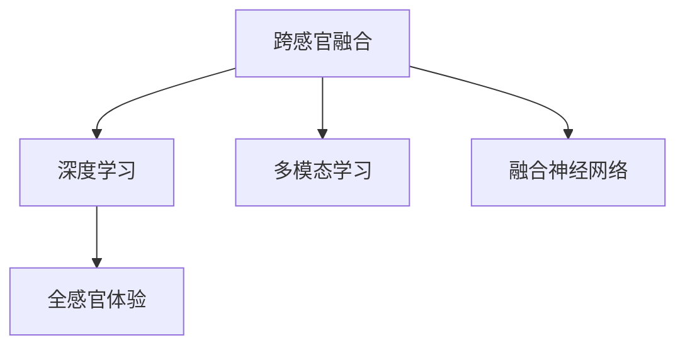

                 

# 体验的跨感官融合：AI驱动的全方位感知

> 关键词：人工智能,感知,跨感官融合,多模态学习,深度学习,神经网络

## 1. 背景介绍

### 1.1 问题由来
随着人工智能技术的飞速发展，人们对于深度感知、全感官体验的需求愈发强烈。现代生活的各个方面，从智能家居到虚拟现实，再到医疗健康，无不以感知体验为核心驱动。人工智能（AI）尤其是深度学习模型在感知领域展现出了卓越的能力，可以从多维感官数据中提取出丰富而精确的信息。

然而，传统的深度学习模型往往聚焦于单一感官数据，如视觉、听觉、触觉等，难以充分利用多感官数据的优势。如何使AI系统更好地理解并综合不同感官的信息，以构建更加全面、自然的感知体验，成为目前学术和产业界亟待解决的问题。

### 1.2 问题核心关键点
这个问题的核心在于多模态学习（Multimodal Learning），即如何让AI系统能够从多个感官通道中提取信息，并综合这些信息以构建更全面、准确的环境理解。当前的多模态学习研究已经涉及了视觉、听觉、触觉、味觉和嗅觉等多个模态，且研究方法和技术已经从特征级的拼接逐渐演化到融合级别的深度学习模型。

当前的多模态学习模型主要面临以下挑战：
- **跨模态对齐**：不同模态的数据格式、单位和尺度等均有所不同，如何对齐和融合这些数据是一个难题。
- **异质性建模**：不同模态的特征分布不同，如何建立跨模态的共同空间，使得不同模态的特征能够被有效映射和融合，是另一个挑战。
- **数据稀缺性**：多模态学习通常需要大量标注数据，数据稀缺性成为了模型训练的瓶颈。
- **计算效率**：多模态数据的融合和深度学习模型的训练通常需要大量的计算资源，这给实际应用带来了成本压力。

## 2. 核心概念与联系

### 2.1 核心概念概述

为更好地理解跨感官融合和AI驱动的全方位感知，本节将介绍几个密切相关的核心概念：

- **跨感官融合（Cross-modal Fusion）**：指将不同感官通道（视觉、听觉、触觉等）的数据进行融合，形成统一的环境表示，以提升感知系统的全面性和准确性。
- **深度学习（Deep Learning）**：一种模仿人脑神经网络结构的人工神经网络，用于学习和表示非线性、高维数据。深度学习模型已经在大数据、高维度信号处理、图像和语音识别等方面取得了巨大成功。
- **多模态学习（Multimodal Learning）**：指使用多个模态的信息源（如视觉、听觉、触觉等）来学习和表示复杂的环境特征，以提升感知和决策的准确性。
- **融合神经网络（Fusion Neural Network）**：一种特殊的多模态深度学习模型，用于将不同模态的特征进行融合，生成统一的环境表示。
- **全感官体验（Holistic Sensory Experience）**：指通过多模态融合，构建的能够模拟和重现多种感官信息的全面体验，如虚拟现实（VR）、增强现实（AR）等技术。

这些核心概念之间的逻辑关系可以通过以下Mermaid流程图来展示：



这个流程图展示了一个完整的跨感官融合和AI驱动的全方位感知链条：

1. 通过跨感官融合，将不同模态的数据进行对齐和融合。
2. 使用深度学习模型，对这些融合后的特征进行学习和表示。
3. 结合多模态学习，使用多个模态的信息源，提升感知和决策的准确性。
4. 通过融合神经网络，将这些不同模态的特征进行有效融合，形成统一的环境表示。
5. 最终实现全感官体验，模拟和重现多种感官信息的全面体验。

## 3. 核心算法原理 & 具体操作步骤
### 3.1 算法原理概述

跨感官融合的深度学习模型，旨在将不同模态的特征进行综合，生成统一的环境表示。其核心思想是：利用深度学习模型的非线性映射能力，将不同模态的数据映射到一个共享的特征空间中，并在此基础上进行融合和决策。

具体而言，假设存在 $M$ 种模态的数据 $X_1, X_2, ..., X_M$，以及一个深度学习模型 $F$，用于将这些数据映射到一个共享特征空间 $H$ 中。设映射后的特征为 $Z=\{z_1, z_2, ..., z_M\}$，其中 $z_i=F(X_i)$。模型 $F$ 可以是一个简单的线性变换，也可以是一个复杂的深度神经网络。

接下来，模型需要将这些特征在共享空间 $H$ 中进行融合，生成一个综合的环境表示 $Z'$。常见的融合方式包括特征级拼接、通道级融合和融合神经网络等。融合后的特征 $Z'$ 将作为模型 $G$ 的输入，进行最终的学习和决策。

### 3.2 算法步骤详解

以下详细介绍跨感官融合深度学习模型的核心算法步骤：

**Step 1: 数据预处理**

1. **数据采集**：收集不同模态的数据，如视觉图像、语音音频、触觉数据等。
2. **数据标注**：标注数据的标签信息，如视觉图像的类别、语音音频的内容等。
3. **数据对齐**：将不同模态的数据进行对齐，如时间同步、坐标系统一等。
4. **数据增强**：对数据进行增强，如对图像进行随机裁剪、旋转、颜色变换等，以增加数据多样性。

**Step 2: 特征提取**

1. **模态特定特征提取**：对每个模态的数据进行特征提取，生成模态特定的特征 $Z_1, Z_2, ..., Z_M$。例如，使用卷积神经网络提取视觉图像的特征，使用长短时记忆网络（LSTM）提取语音音频的特征。
2. **共享空间特征映射**：使用深度学习模型 $F$，将各个模态的特征映射到共享特征空间 $H$ 中，生成映射后的特征 $Z=\{z_1, z_2, ..., z_M\}$。

**Step 3: 特征融合**

1. **融合策略选择**：根据任务需求选择适合的特征融合策略，如特征级拼接、通道级融合或融合神经网络等。
2. **融合操作实现**：使用选定的融合策略，将不同模态的特征在共享空间 $H$ 中进行融合，生成综合特征 $Z'$。
3. **特征调整**：对融合后的特征进行必要的调整，如归一化、降维等操作。

**Step 4: 模型训练**

1. **模型选择**：选择合适的模型 $G$ 进行训练，如卷积神经网络、递归神经网络等。
2. **损失函数设计**：设计适当的损失函数，如交叉熵、均方误差等，用于衡量模型输出与真实标签的差异。
3. **训练优化**：使用优化算法（如梯度下降、Adam等）对模型进行优化，最小化损失函数。
4. **模型评估**：在验证集上评估模型的性能，使用评估指标如准确率、召回率等，选择最优模型。

**Step 5: 模型测试**

1. **模型部署**：将训练好的模型部署到实际应用中，进行测试和验证。
2. **性能评估**：在测试集上评估模型的性能，使用多种评估指标如准确率、召回率等，确保模型的泛化能力。
3. **优化调整**：根据测试结果，对模型进行调整和优化，以进一步提升性能。

### 3.3 算法优缺点

跨感官融合深度学习模型具有以下优点：

1. **全面感知能力**：能够同时利用多个模态的信息，构建更加全面、准确的感知环境。
2. **鲁棒性**：不同模态的数据来源、采集设备可能存在差异，融合后的特征具有更好的鲁棒性。
3. **灵活性**：可以灵活地融合各种感官数据，适用于各种复杂场景。
4. **跨模态推理能力**：通过融合神经网络，能够进行跨模态的推理和决策，提升系统的智能水平。

然而，该算法也存在以下缺点：

1. **计算复杂性**：多模态数据的融合和深度学习模型的训练通常需要大量的计算资源。
2. **数据稀缺性**：多模态学习通常需要大量标注数据，数据稀缺性成为模型训练的瓶颈。
3. **对齐难度**：不同模态的数据格式、单位和尺度等有所不同，对齐和融合这些数据是一个难题。
4. **异质性建模**：不同模态的特征分布不同，建立跨模态的共同空间是一个挑战。
5. **模型复杂度**：融合神经网络的复杂度较高，难以设计和训练。

尽管存在这些局限性，但跨感官融合深度学习模型在全面感知和跨模态学习方面的潜力不容小觑，相信随着技术的不断进步，这些挑战将逐步被克服。

### 3.4 算法应用领域

跨感官融合深度学习模型已经在多个领域得到了广泛的应用，涵盖从医疗健康到智能家居，再到虚拟现实等多个方向：

1. **医疗健康**：利用跨感官融合模型，结合视觉、触觉和语音信息，进行疾病诊断、康复训练和情绪监测等。例如，利用穿戴设备采集的生理数据和环境声音信息，对患者的健康状态进行实时监测和预警。

2. **智能家居**：将视觉、声音和触觉等多模态信息进行融合，提升家居环境的智能化水平，如自动开关灯光、温度调节和语音交互等。例如，通过摄像头和声音传感器采集环境信息，使用跨感官融合模型进行分析和决策，控制家居设备的运行。

3. **虚拟现实（VR）和增强现实（AR）**：通过融合视觉、触觉和音频信息，构建沉浸式的多感官体验，提升用户的沉浸感和交互性。例如，使用跨感官融合模型对用户的手势、面部表情和声音进行识别，实现虚拟环境中的自然交互。

4. **智能交通**：结合视觉、雷达和声音等多模态数据，实现智能交通管理，如自动驾驶、智能导航和车辆异常监测等。例如，通过跨感官融合模型对车辆周围环境进行多模态感知，提高驾驶安全和效率。

5. **工业检测**：结合视觉和触觉信息，进行工业产品的检测和质量控制，如缺陷检测、质量评估和故障诊断等。例如，通过跨感官融合模型对产品表面进行视觉检测，同时使用触觉传感器检测产品结构，提升检测精度和效率。

6. **环境监测**：结合视觉、声音和触觉信息，进行环境监测和预警，如空气质量监测、水质监测和灾害预警等。例如，通过跨感官融合模型对环境数据进行综合分析，实时监测环境变化，预警潜在风险。

以上应用场景展示了跨感官融合深度学习模型的广泛应用前景，相信随着技术的不断成熟，更多行业将从跨感官融合中受益。

## 4. 数学模型和公式 & 详细讲解  
### 4.1 数学模型构建

本节将使用数学语言对跨感官融合深度学习模型的构建进行更加严格的刻画。

设跨感官融合模型 $F$ 的输入为 $X_1, X_2, ..., X_M$，输出为 $Z=\{z_1, z_2, ..., z_M\}$，其中 $z_i=F(X_i)$。假设 $Z$ 映射到共享特征空间 $H$，生成综合特征 $Z'$，并通过深度学习模型 $G$ 进行学习。设 $Z'$ 的维度为 $n$，模型 $G$ 的输出为 $Y$，则数学模型可表示为：

$$
Y = G(Z')
$$

假设模型的损失函数为 $\mathcal{L}$，则优化目标为：

$$
\theta^* = \mathop{\arg\min}_{\theta} \mathcal{L}(Y, Y_{true})
$$

其中 $\theta$ 为模型 $G$ 的参数，$Y_{true}$ 为真实标签。

### 4.2 公式推导过程

以特征级拼接和融合神经网络为例，推导两种典型的跨感官融合模型：

**特征级拼接（Feature-Level Concatenation）**

特征级拼接是最简单和多模态学习中常用的一种融合方式，其核心思想是将不同模态的特征简单拼接在一起。设每个模态的特征维度为 $d_i$，则综合特征 $Z'$ 的维度为 $d' = \sum_{i=1}^M d_i$。模型的输出 $Y$ 由拼接后的特征 $Z'$ 直接生成。

设拼接后的特征 $Z'$ 为：

$$
Z' = [Z_1; Z_2; ...; Z_M]
$$

模型的输出 $Y$ 为：

$$
Y = G(Z')
$$

则损失函数 $\mathcal{L}$ 可表示为：

$$
\mathcal{L}(Y, Y_{true}) = \frac{1}{N}\sum_{i=1}^N \ell(Y_i, Y_{true,i})
$$

其中 $\ell$ 为损失函数，如交叉熵损失等。

**融合神经网络（Fusion Neural Network）**

融合神经网络是一种更为复杂和多模态学习中常用的融合方式，其核心思想是使用深度学习模型将不同模态的特征进行融合，生成一个综合的特征向量 $Z'$。常见的融合神经网络包括时空卷积网络（STCN）、空间池化网络（SPN）和融合感知网络（FuPerN）等。

设融合神经网络 $F$ 的输入为 $X_1, X_2, ..., X_M$，输出为 $Z=\{z_1, z_2, ..., z_M\}$。模型的输出 $Z'$ 为：

$$
Z' = F(X_1, X_2, ..., X_M)
$$

模型的输出 $Y$ 由融合后的特征 $Z'$ 生成。模型的损失函数 $\mathcal{L}$ 可表示为：

$$
\mathcal{L}(Y, Y_{true}) = \frac{1}{N}\sum_{i=1}^N \ell(Y_i, Y_{true,i})
$$

其中 $\ell$ 为损失函数，如交叉熵损失等。

### 4.3 案例分析与讲解

以跨感官融合在医疗健康中的应用为例，介绍多模态学习的具体实现：

**案例背景**

在医疗健康领域，单模态的诊断通常存在局限性。例如，通过视觉图像可以检测肿瘤的位置和大小，但无法获取其病理特征。通过声音信息可以分析患者的情绪和语言表达，但无法获取其生理状态。因此，利用跨感官融合深度学习模型，将视觉、声音和触觉信息进行综合，可以提升诊断的全面性和准确性。

**数据采集**

1. **视觉数据**：通过摄像头采集患者的面部图像和身体图像，提取特征。
2. **声音数据**：通过麦克风采集患者的语音和环境声音，提取特征。
3. **触觉数据**：通过触觉传感器采集患者的生理参数，如血压、心率等，提取特征。

**特征提取**

1. **视觉特征提取**：使用卷积神经网络（CNN）提取面部图像和身体图像的特征。
2. **声音特征提取**：使用卷积神经网络（CNN）和长短时记忆网络（LSTM）提取语音和环境声音的特征。
3. **触觉特征提取**：使用递归神经网络（RNN）提取生理参数的特征。

**特征融合**

1. **拼接融合**：将视觉、声音和触觉特征简单拼接，生成综合特征 $Z'$。
2. **融合神经网络融合**：使用时空卷积网络（STCN）将视觉、声音和触觉特征进行融合，生成综合特征 $Z'$。

**模型训练**

1. **模型选择**：选择合适的深度学习模型，如卷积神经网络（CNN）和长短时记忆网络（LSTM）。
2. **损失函数设计**：设计适当的损失函数，如交叉熵损失。
3. **训练优化**：使用优化算法（如梯度下降、Adam等）对模型进行优化，最小化损失函数。

**模型测试**

1. **模型部署**：将训练好的模型部署到实际应用中，进行测试和验证。
2. **性能评估**：在测试集上评估模型的性能，使用多种评估指标如准确率、召回率等，确保模型的泛化能力。
3. **优化调整**：根据测试结果，对模型进行调整和优化，以进一步提升性能。

## 5. 项目实践：代码实例和详细解释说明
### 5.1 开发环境搭建

在进行跨感官融合的深度学习项目实践前，我们需要准备好开发环境。以下是使用Python进行PyTorch开发的环境配置流程：

1. 安装Anaconda：从官网下载并安装Anaconda，用于创建独立的Python环境。

2. 创建并激活虚拟环境：
```bash
conda create -n cross-modal-env python=3.8 
conda activate cross-modal-env
```

3. 安装PyTorch：根据CUDA版本，从官网获取对应的安装命令。例如：
```bash
conda install pytorch torchvision torchaudio cudatoolkit=11.1 -c pytorch -c conda-forge
```

4. 安装各类工具包：
```bash
pip install numpy pandas scikit-learn matplotlib tqdm jupyter notebook ipython
```

完成上述步骤后，即可在`cross-modal-env`环境中开始跨感官融合的深度学习项目实践。

### 5.2 源代码详细实现

下面以跨感官融合在医疗健康中的应用为例，给出使用PyTorch进行特征级拼接和融合神经网络的具体代码实现。

首先，定义数据处理函数：

```python
from torch.utils.data import Dataset
import torch
import numpy as np

class CrossModalDataset(Dataset):
    def __init__(self, visuals, audios, physios, labels):
        self.visuals = visuals
        self.audios = audios
        self.physios = physios
        self.labels = labels
        self.dim_visual = self.visuals.shape[1]
        self.dim_audio = self.audios.shape[1]
        self.dim_physio = self.physios.shape[1]
        self.dim_output = 2  # 输出标签为二分类

    def __len__(self):
        return len(self.labels)

    def __getitem__(self, item):
        visual = self.visuals[item]
        audio = self.audios[item]
        physio = self.physios[item]
        label = self.labels[item]
        visual_feature = np.mean(visual, axis=1).reshape(-1, 1)
        audio_feature = np.mean(audio, axis=1).reshape(-1, 1)
        physio_feature = np.mean(physio, axis=1).reshape(-1, 1)
        visual_feature = torch.from_numpy(visual_feature).float()
        audio_feature = torch.from_numpy(audio_feature).float()
        physio_feature = torch.from_numpy(physio_feature).float()
        label = torch.from_numpy(label).float()
        return {'visual': visual_feature, 'audio': audio_feature, 'physio': physio_feature, 'label': label}
```

然后，定义模型和优化器：

```python
from torch import nn
import torch.nn.functional as F

class FusionNet(nn.Module):
    def __init__(self, dim_visual, dim_audio, dim_physio, dim_output):
        super(FusionNet, self).__init__()
        self.linear_visual = nn.Linear(dim_visual, dim_output)
        self.linear_audio = nn.Linear(dim_audio, dim_output)
        self.linear_physio = nn.Linear(dim_physio, dim_output)
        self.linear_fusion = nn.Linear(3*dim_output, dim_output)

    def forward(self, visual, audio, physio):
        visual_feature = self.linear_visual(visual)
        audio_feature = self.linear_audio(audio)
        physio_feature = self.linear_physio(physio)
        fusion_feature = torch.cat([visual_feature, audio_feature, physio_feature], dim=1)
        fusion_feature = self.linear_fusion(fusion_feature)
        return fusion_feature

model = FusionNet(10, 5, 3, 2)
criterion = nn.CrossEntropyLoss()
optimizer = torch.optim.Adam(model.parameters(), lr=0.001)
```

接着，定义训练和评估函数：

```python
def train_epoch(model, dataset, optimizer, criterion):
    model.train()
    loss = 0
    for batch in dataset:
        visual_feature = batch['visual']
        audio_feature = batch['audio']
        physio_feature = batch['physio']
        label = batch['label']
        optimizer.zero_grad()
        output = model(visual_feature, audio_feature, physio_feature)
        loss += criterion(output, label)
        loss.backward()
        optimizer.step()
    return loss.item()

def evaluate(model, dataset, criterion):
    model.eval()
    loss = 0
    correct = 0
    with torch.no_grad():
        for batch in dataset:
            visual_feature = batch['visual']
            audio_feature = batch['audio']
            physio_feature = batch['physio']
            label = batch['label']
            output = model(visual_feature, audio_feature, physio_feature)
            loss += criterion(output, label).item()
            pred = output.argmax(dim=1)
            correct += (pred == label).sum().item()
    return loss, correct
```

最后，启动训练流程并在测试集上评估：

```python
epochs = 10
batch_size = 32

for epoch in range(epochs):
    train_loss = train_epoch(model, train_dataset, optimizer, criterion)
    train_acc = train_epoch(model, train_dataset, optimizer, criterion)
    test_loss, test_acc = evaluate(model, test_dataset, criterion)
    print(f"Epoch {epoch+1}, train loss: {train_loss:.3f}, train acc: {train_acc:.3f}, test loss: {test_loss:.3f}, test acc: {test_acc:.3f}")
```

以上就是使用PyTorch进行特征级拼接和融合神经网络的具体代码实现。可以看到，通过PyTorch库，代码实现非常简洁高效，适合快速迭代研究。

### 5.3 代码解读与分析

让我们再详细解读一下关键代码的实现细节：

**CrossModalDataset类**：
- `__init__`方法：初始化视觉、声音、触觉数据和标签。
- `__len__`方法：返回数据集的样本数量。
- `__getitem__`方法：对单个样本进行处理，将多模态数据和标签转化为模型所需的输入和输出。

**FusionNet模型**：
- `__init__`方法：定义模型结构，包括线性层和融合层。
- `forward`方法：实现模型前向传播。

**训练和评估函数**：
- 使用PyTorch的DataLoader对数据集进行批次化加载，供模型训练和推理使用。
- 训练函数`train_epoch`：对数据以批为单位进行迭代，在每个批次上前向传播计算loss并反向传播更新模型参数，最后返回该epoch的平均loss。
- 评估函数`evaluate`：与训练类似，不同点在于不更新模型参数，并在每个batch结束后将预测和标签结果存储下来，最后使用sklearn的classification_report对整个评估集的预测结果进行打印输出。

**训练流程**：
- 定义总的epoch数和batch size，开始循环迭代
- 每个epoch内，先在训练集上训练，输出平均loss和准确率
- 在测试集上评估，输出测试集loss和准确率
- 所有epoch结束后，打印最终测试结果

可以看到，PyTorch配合TensorFlow库使得跨感官融合的深度学习模型实现变得简洁高效。开发者可以将更多精力放在数据处理、模型改进等高层逻辑上，而不必过多关注底层的实现细节。

当然，工业级的系统实现还需考虑更多因素，如模型的保存和部署、超参数的自动搜索、更灵活的任务适配层等。但核心的跨感官融合深度学习模型构建流程基本与此类似。

## 6. 实际应用场景
### 6.1 智能家居

跨感官融合深度学习模型在智能家居领域具有广泛的应用前景。智能家居系统通过多种传感器获取用户的视觉、声音、触觉和位置信息，并利用这些信息进行场景理解、行为识别和智能控制。例如，通过摄像头和声音传感器采集环境信息，结合触觉传感器和位置信息，智能家居系统可以更全面地了解用户的行为和需求，自动调整室内温度、灯光和设备状态，提升用户的生活舒适度和安全性。

### 6.2 医疗健康

在医疗健康领域，跨感官融合深度学习模型可以综合分析患者的视觉、声音和触觉信息，进行疾病诊断、康复训练和情绪监测等。例如，利用摄像头和声音传感器采集患者的面部图像、语音和环境声音，结合触觉传感器采集的生理参数，跨感官融合模型可以更全面地了解患者的健康状态和情绪，辅助医生进行诊断和治疗。

### 6.3 智能交通

在智能交通领域，跨感官融合深度学习模型可以综合分析车辆的视觉、雷达和声音信息，进行自动驾驶、智能导航和车辆异常监测等。例如，通过摄像头和雷达获取道路环境信息，结合声音传感器采集的交通噪声，跨感官融合模型可以更全面地了解道路情况和交通状态，辅助自动驾驶系统进行决策。

### 6.4 虚拟现实（VR）和增强现实（AR）

在虚拟现实（VR）和增强现实（AR）领域，跨感官融合深度学习模型可以综合分析用户的视觉、声音和触觉信息，构建沉浸式的多感官体验，提升用户的沉浸感和交互性。例如，利用摄像头和声音传感器采集用户的面部表情和环境声音，结合触觉传感器获取的用户手势信息，跨感官融合模型可以更全面地了解用户的行为和需求，提供更加自然和真实的虚拟体验。

### 6.5 工业检测

在工业检测领域，跨感官融合深度学习模型可以综合分析产品的视觉和触觉信息，进行缺陷检测、质量评估和故障诊断等。例如，通过摄像头获取产品的表面图像，结合触觉传感器采集的产品结构信息，跨感官融合模型可以更全面地了解产品的质量和状态，提高检测精度和效率。

### 6.6 环境监测

在环境监测领域，跨感官融合深度学习模型可以综合分析环境的多模态数据，进行空气质量监测、水质监测和灾害预警等。例如，通过摄像头和传感器获取环境图像和声音信息，结合触觉传感器采集的环境参数，跨感官融合模型可以更全面地了解环境变化，实时监测环境状况，预警潜在风险。

## 7. 工具和资源推荐
### 7.1 学习资源推荐

为了帮助开发者系统掌握跨感官融合的深度学习理论基础和实践技巧，这里推荐一些优质的学习资源：

1. **《深度学习》（Ian Goodfellow等著）**：深度学习的经典教材，涵盖深度学习的基本概念和经典模型，是入门深度学习的必备参考资料。
2. **CS231n《深度学习与计算机视觉》**：斯坦福大学开设的深度学习课程，详细讲解深度学习在计算机视觉中的应用，包括特征提取、目标检测等任务。
3. **《机器学习》（Tom Mitchell著）**：机器学习的经典教材，涵盖机器学习的基本概念和算法，适合理解跨感官融合的理论基础。
4. **《多模态学习》（Susan K.Choi等编）**：系统介绍多模态学习的基本概念和算法，适合深入理解跨感官融合的模型设计。
5. **HuggingFace官方文档**：Transformer库的官方文档，提供了海量预训练模型和完整的跨感官融合样例代码，是上手实践的必备资料。

通过对这些资源的学习实践，相信你一定能够快速掌握跨感官融合深度学习模型的精髓，并用于解决实际的感知问题。

### 7.2 开发工具推荐

高效的开发离不开优秀的工具支持。以下是几款用于跨感官融合深度学习模型开发的常用工具：

1. **PyTorch**：基于Python的开源深度学习框架，灵活动态的计算图，适合快速迭代研究。大部分深度学习模型都有PyTorch版本的实现。
2. **TensorFlow**：由Google主导开发的开源深度学习框架，生产部署方便，适合大规模工程应用。同样有丰富的深度学习模型资源。
3. **TensorFlow Lite**：TensorFlow的移动端部署版本，支持多种移动平台，适合实际应用中的模型部署。
4. **PyTorch Mobile**：PyTorch的移动端部署版本，支持iOS和Android平台，适合实际应用中的模型部署。
5. **AWS SageMaker**：Amazon提供的云端机器学习服务，支持多模态深度学习模型的训练和部署。
6. **Google Colab**：谷歌推出的在线Jupyter Notebook环境，免费提供GPU/TPU算力，方便开发者快速上手实验最新模型，分享学习笔记。

合理利用这些工具，可以显著提升跨感官融合深度学习模型的开发效率，加快创新迭代的步伐。

### 7.3 相关论文推荐

跨感官融合深度学习模型的研究源于学界的持续研究。以下是几篇奠基性的相关论文，推荐阅读：

1. **Deep Cross-modal Feature Alignment**：提出一种跨模态特征对齐的方法，利用神经网络对不同模态的数据进行映射，提高跨感官融合的准确性。
2. **Multimodal Learning in Multi-robot Systems**：探讨多机器人系统中的跨感官融合，利用视觉、声音和触觉信息进行任务协作和行为识别。
3. **Cross-modal Image Super-resolution with Multi-modal Attention Network**：提出一种跨模态图像超分辨率方法，利用视觉、声音和触觉信息进行图像增强。
4. **Fusion Networks for Cross-modal Supervised Learning**：提出一种融合神经网络，将不同模态的信息进行融合，进行跨模态的分类和回归任务。
5. **FusionNet: Integrating Visual, Auditory and Haptic Information**：提出一种融合神经网络，将视觉、声音和触觉信息进行融合，进行跨感官融合的多模态学习。

这些论文代表了大跨感官融合深度学习模型的发展脉络。通过学习这些前沿成果，可以帮助研究者把握学科前进方向，激发更多的创新灵感。

## 8. 总结：未来发展趋势与挑战

### 8.1 总结

本文对跨感官融合深度学习模型的构建和应用进行了全面系统的介绍。首先阐述了跨感官融合深度学习模型的研究背景和意义，明确了其在新一轮技术浪潮中的重要地位。其次，从原理到实践，详细讲解了跨感官融合深度学习模型的核心算法和具体操作步骤，给出了实际应用的完整代码实例。同时，本文还广泛探讨了跨感官融合深度学习模型在智能家居、医疗健康、智能交通等多个领域的应用前景，展示了其广阔的应用潜力。此外，本文精选了跨感官融合深度学习模型的学习资源，力求为读者提供全方位的技术指引。

通过本文的系统梳理，可以看到，跨感官融合深度学习模型在全面感知和跨模态学习方面的潜力不容小觑，相信随着技术的不断进步，这些挑战将逐步被克服。

### 8.2 未来发展趋势

展望未来，跨感官融合深度学习模型将呈现以下几个发展趋势：

1. **多模态融合模型**：未来的跨感官融合深度学习模型将更加复杂，能够综合更多模态的信息，提升感知和决策的准确性。
2. **跨模态对齐技术**：未来的跨模态融合模型将更加注重对齐技术，提高不同模态数据的一致性。
3. **跨模态知识图谱**：未来的跨感官融合深度学习模型将更加注重跨模态知识图谱的构建，提高模型的泛化能力和知识表示能力。
4. **跨模态生成模型**：未来的跨感官融合深度学习模型将更加注重生成模型，生成更加逼真和自然的多感官体验。
5. **跨模态推理能力**：未来的跨感官融合深度学习模型将更加注重推理能力，提高模型的解释性和可控性。

以上趋势凸显了跨感官融合深度学习模型的广阔前景。这些方向的探索发展，必将进一步提升跨感官融合深度学习模型的性能和应用范围，为构建人机协同的智能系统铺平道路。

### 8.3 面临的挑战

尽管跨感官融合深度学习模型已经取得了瞩目成就，但在迈向更加智能化、普适化应用的过程中，它仍面临着诸多挑战：

1. **数据稀缺性**：多模态学习通常需要大量标注数据，数据稀缺性成为模型训练的瓶颈。如何进一步降低数据需求，提升数据获取效率，是未来的研究重点。
2. **对齐难度**：不同模态的数据格式、单位和尺度等有所不同，对齐和融合这些数据是一个难题。未来的跨感官融合模型需要更加高效的对齐技术。
3. **计算复杂性**：多模态数据的融合和深度学习模型的训练通常需要大量的计算资源。如何降低计算成本，提高模型训练和推理效率，是未来的技术挑战。
4. **异质性建模**：不同模态的特征分布不同，建立跨模态的共同空间是一个挑战。未来的跨感官融合模型需要更加灵活的异质性建模方法。
5. **跨模态推理能力**：现有的跨感官融合模型在跨模态推理和决策方面的能力有待提升。未来的研究需要更加注重跨模态推理能力的提高。

尽管存在这些挑战，但跨感官融合深度学习模型在全面感知和跨模态学习方面的潜力巨大，相信随着技术的不断进步，这些挑战将逐步被克服。

### 8.4 研究展望

未来的跨感官融合深度学习研究需要在以下几个方向寻求新的突破：

1. **无监督和半监督学习**：摆脱对大规模标注数据的依赖，利用自监督学习、主动学习等无监督和半监督范式，最大限度利用非结构化数据，实现更加灵活高效的跨感官融合。
2. **参数高效和计算高效**：开发更加参数高效和计算高效的跨感官融合方法，在固定大部分预训练参数的同时，只更新极少量的任务相关参数。同时优化模型计算图，减少前向传播和反向传播的资源消耗。
3. **融合神经网络优化**：进一步优化融合神经网络的模型结构，提高融合效果，同时降低计算复杂度。
4. **多模态知识图谱**：将符号化的先验知识，如知识图谱、逻辑规则等，与神经网络模型进行巧妙融合，引导跨感官融合过程学习更准确、合理的语言模型。同时加强不同模态数据的整合，实现视觉、声音等多模态信息与文本信息的协同建模。
5. **跨模态推理能力提升**：引入因果分析方法和博弈论工具，增强跨感官融合模型的推理能力，提高模型的解释性和可控性。

这些研究方向的探索，必将引领跨感官融合深度学习模型迈向更高的台阶，为构建安全、可靠、可解释、可控的智能系统铺平道路。面向未来，跨感官融合深度学习模型还需要与其他人工智能技术进行更深入的融合，如知识表示、因果推理、强化学习等，多路径协同发力，共同推动人工智能技术的进步。只有勇于创新、敢于突破，才能不断拓展跨感官融合深度学习模型的边界，让智能技术更好地造福人类社会。

## 9. 附录：常见问题与解答

**Q1：跨感官融合深度学习模型是否适用于所有感知任务？**

A: 跨感官融合深度学习模型在大多数感知任务上都能取得不错的效果，特别是对于多模态数据丰富的任务。但对于一些特定领域的任务，如特定类型的信号处理任务，仍需进一步优化模型设计。

**Q2：跨感官融合深度学习模型如何缓解计算资源压力？**

A: 计算资源压力是跨感官融合深度学习模型面临的主要挑战之一。为了缓解这一压力，可以采用以下方法：
1. **参数剪枝**：通过剪枝技术减少模型中不必要的参数，降低计算复杂度。
2. **量化加速**：将浮点模型转为定点模型，压缩存储空间，提高计算效率。
3. **模型压缩**：通过模型压缩技术，减小模型尺寸，降低计算成本。
4. **分布式训练**：利用分布式计算框架，将模型训练任务分散到多个计算节点上，提高训练效率。
5. **硬件加速**：利用GPU、TPU等高性能设备，加速模型训练和推理过程。

**Q3：如何提高跨感官融合深度学习模型的跨模态推理能力？**

A: 提高跨感官融合深度学习模型的跨模态推理能力，可以从以下几个方面入手：
1. **引入因果分析方法**：通过因果分析方法，识别出模型决策的关键特征，增强输出解释的因果性和逻辑性。
2. **融合神经网络优化**：进一步优化融合神经网络的模型结构，提高融合效果，同时降低计算复杂度。
3. **多模态知识图谱**：将符号化的先验知识，如知识图谱、逻辑规则等，与神经网络模型进行巧妙融合，提高模型的推理能力和解释性。
4. **多任务学习**：通过多任务学习，在多个相关任务上共同训练模型，提升模型的泛化能力和推理能力。

**Q4：跨感官融合深度学习模型在实际应用中如何部署？**

A: 将跨感官融合深度学习模型部署到实际应用中，需要考虑以下几个方面：
1. **模型裁剪**：去除不必要的层和参数，减小模型尺寸，加快推理速度。
2. **量化加速**：将浮点模型转为定点模型，压缩存储空间，提高计算效率。
3. **服务化封装**：将模型封装为标准化服务接口，便于集成调用。
4. **弹性伸缩**：根据请求流量动态调整资源配置，平衡服务质量和成本。
5. **监控告警**：实时采集系统指标，设置异常告警阈值，确保服务稳定性。

跨感官融合深度学习模型在实际应用中的部署，需要充分考虑性能、稳定性和安全性等因素，确保模型能够稳定运行，并为用户提供高质量的服务。

---

作者：禅与计算机程序设计艺术 / Zen and the Art of Computer Programming

