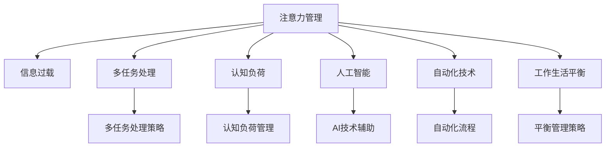

                 

# 信息时代的注意力管理技术与策略：在干扰和信息过载中保持专注

> 关键词：信息过载, 注意力管理, 多任务处理, 认知负荷, 人工智能, 自动化技术, 工作生活平衡

## 1. 背景介绍

在信息时代，人类的生活和工作环境已经发生了翻天覆地的变化。从早期的书信、电话，到后来的互联网、智能手机，再到现在的物联网、AI智能助手，技术的发展极大地提升了我们的生活质量，也带来了前所未有的信息过载问题。面对海量的信息和不断的干扰，如何高效管理注意力，保持专注，成为了一个亟待解决的问题。

### 1.1 问题由来

在现代社会，我们每天需要处理的信息量巨大，且来源多样化，包括工作邮件、社交媒体、新闻网站、视频流等。这种信息过载导致我们难以集中注意力，容易分心和疲劳，甚至影响决策和创造力。为了应对这些问题，人们提出了各种注意力管理策略，如时间管理、番茄工作法、番茄钟等。但这些方法往往依赖于人工操作，难以适应复杂多变的任务和情境。

### 1.2 问题核心关键点

注意力管理的关键在于识别和优先处理重要的信息，同时抑制不必要的干扰。在技术层面，我们可以借助人工智能和大数据技术，自动化地处理和过滤信息，提升注意力管理的效率和效果。但同时也需要注意隐私保护、决策透明和伦理合规等方面的问题。

### 1.3 问题研究意义

高效地管理注意力不仅能提升工作效率和生活质量，还能改善心理健康，预防各类职业病。通过优化信息处理流程和提升注意力管理能力，我们可以更好地应对信息时代的挑战，释放人类的潜能。

## 2. 核心概念与联系

### 2.1 核心概念概述

为更好地理解注意力管理的核心概念和技术，本节将介绍几个关键概念：

- 注意力管理（Attention Management）：通过识别和优先处理重要信息，同时抑制不必要的干扰，提升工作效率和生活质量的过程。
- 信息过载（Information Overload）：在信息时代，人们每天接触的信息量远超大脑处理能力，导致注意力难以集中，决策效率下降。
- 多任务处理（Multitasking）：同时处理多个任务，需要协调注意力在不同任务间分配，对注意力管理提出了更高要求。
- 认知负荷（Cognitive Load）：指个体在处理信息时所需的精神能量，过高或过低都会影响效率和效果。
- 人工智能（AI）：借助机器学习和大数据分析技术，辅助人类自动化地处理和过滤信息，提升注意力管理的效果。
- 自动化技术（Automation Technology）：通过软件和硬件相结合的方式，自动化地完成信息处理和决策过程，减少人为干预。
- 工作生活平衡（Work-Life Balance）：在高效工作和充分休息间找到平衡点，保持身心健康，提高整体生活质量。

这些概念之间的逻辑关系可以通过以下Mermaid流程图来展示：



这个流程图展示了一些关键概念之间的联系：

1. 注意力管理是核心，通过对信息进行有效处理，应对信息过载和多任务处理带来的挑战。
2. 信息过载、多任务处理、认知负荷等概念是注意力管理过程中常见的问题。
3. AI和自动化技术是解决注意力管理问题的有效手段。
4. 工作生活平衡是注意力管理的重要目标，通过合理分配注意力，提高整体生活质量。

## 3. 核心算法原理 & 具体操作步骤
### 3.1 算法原理概述

注意力管理的核心算法原理基于认知心理学和多任务处理理论，结合AI和大数据分析技术，实现信息的自动化处理和过滤。其核心思想是：通过识别重要信息，同时抑制干扰，最大化认知资源的使用效率。

在数学上，注意力管理可以看作是一个优化问题，目标是在给定的时间和资源约束下，最大化决策质量。一般可以表示为：

$$
\max \text{DecisionQuality}(\mathbf{X}) \\
s.t. \\
\text{TimeConstraint}(\mathbf{X}) \leq T \\
\text{ResourceConstraint}(\mathbf{X}) \leq R
$$

其中，$\mathbf{X}$ 表示决策变量的向量，$T$ 和 $R$ 分别表示时间和资源的总约束。

### 3.2 算法步骤详解

基于注意力管理的核心算法原理，具体的具体操作步骤可以总结为以下几个步骤：

**Step 1: 信息采集与预处理**
- 收集来自各种渠道的信息，包括邮件、社交媒体、新闻网站、视频流等。
- 对采集到的信息进行初步筛选和预处理，去除无用信息和噪音，提取关键信息。

**Step 2: 信息过滤与分类**
- 利用AI和大数据技术，对信息进行自动化的过滤和分类。
- 使用机器学习模型对信息进行特征提取和分类，识别重要信息。

**Step 3: 任务优先级排序**
- 根据信息的重要性和紧急性，进行任务优先级排序。
- 使用基于优先级的任务调度算法，安排任务的执行顺序。

**Step 4: 任务执行与调整**
- 根据优先级排序，逐个执行任务。
- 在执行过程中，实时监控任务进度和状态，及时调整策略。

**Step 5: 结果反馈与优化**
- 对任务执行结果进行反馈和评估，识别问题并进行优化。
- 使用机器学习模型对决策过程进行优化，提高决策质量。

### 3.3 算法优缺点

基于注意力管理的AI和大数据分析技术有以下优点：
1. 自动化信息处理：能够高效处理和过滤信息，减少人工干预，提升效率。
2. 精准识别重要信息：利用机器学习模型，精准识别和优先处理重要信息。
3. 动态调整策略：通过实时监控和反馈，动态调整任务优先级和执行策略。
4. 可扩展性强：可以应用于各种复杂场景和任务，灵活适应不同需求。

同时，这些技术也存在一些局限性：
1. 隐私保护问题：自动化处理信息需要访问和存储大量的个人数据，可能涉及隐私保护问题。
2. 决策透明性：机器学习模型的决策过程往往难以解释，存在“黑箱”问题。
3. 算法偏见：机器学习模型可能继承数据集的偏见，产生不公正的决策结果。
4. 资源消耗：大规模数据处理和模型训练需要大量的计算资源和存储空间。
5. 用户体验：过度依赖自动化可能降低用户的主动性和参与感。

### 3.4 算法应用领域

注意力管理的AI和大数据分析技术已经在多个领域得到了广泛应用，例如：

- 智能办公：通过自动化处理邮件、任务列表等办公信息，提升办公效率和准确性。
- 智能客服：使用聊天机器人进行信息过滤和分类，快速响应用户查询和反馈。
- 智能家居：通过分析家庭环境数据，自动调整设备和环境设置，提升生活质量。
- 智能交通：通过实时监控交通数据，优化交通流量和调度，减少交通拥堵。
- 健康管理：通过分析健康数据，提供个性化健康建议和风险预警，保障身体健康。

此外，注意力管理的AI技术还被应用于教育、金融、医疗等多个领域，为各行各业带来智能化的转型升级。

## 4. 数学模型和公式 & 详细讲解 & 举例说明

### 4.1 数学模型构建

在注意力管理的优化问题中，我们通常使用线性规划、多目标优化等数学模型来构建决策框架。以下是一个简单的线性规划模型，用于对信息进行优化处理：

$$
\begin{aligned}
&\max \sum_{i=1}^n c_i x_i \\
&\text{s.t.} \\
&\sum_{i=1}^m a_{ij} x_i \leq b_j & \forall j=1, \ldots, m \\
&x_i \geq 0 & \forall i=1, \ldots, n
\end{aligned}
$$

其中，$c_i$ 表示第 $i$ 个任务的重要性权重，$a_{ij}$ 表示第 $i$ 个任务和第 $j$ 个资源的约束关系，$b_j$ 表示第 $j$ 个资源的限制，$x_i$ 表示第 $i$ 个任务的执行时间。

### 4.2 公式推导过程

通过线性规划模型，我们可以求解出最优的任务执行顺序和时间分配方案。以下是一个简单的推导过程：

假设任务集合 $T=\{1,2,\ldots,n\}$，资源集合 $R=\{1,2,\ldots,m\}$，任务 $i$ 需要资源 $j$ 的约束关系为 $a_{ij}$，任务 $i$ 的执行时间为 $t_i$。我们需要在满足资源约束的前提下，最大化任务的重要性权重总和。

根据线性规划的基本原理，我们可以列出以下方程组：

$$
\begin{aligned}
&\max \sum_{i=1}^n c_i x_i \\
&\text{s.t.} \\
&\sum_{i=1}^n a_{ij} x_i \leq b_j & \forall j=1, \ldots, m \\
&x_i \geq 0 & \forall i=1, \ldots, n
\end{aligned}
$$

通过求解上述方程组，我们可以得到最优的任务执行顺序和时间分配方案。

### 4.3 案例分析与讲解

以下是一个简单的案例分析，用于展示注意力管理的优化过程：

假设某公司需要在两小时内处理三项任务，各项任务的重要性和资源约束如下：

- 任务 1：重要度为 5，需要资源 2
- 任务 2：重要度为 3，需要资源 1
- 任务 3：重要度为 2，需要资源 2

资源约束如下：

- 资源 1 的限制为 4
- 资源 2 的限制为 4

通过构建线性规划模型，我们可以求解出最优的任务执行顺序和时间分配方案，具体步骤如下：

1. 列出约束方程组：
   - $\sum_{i=1}^3 2 x_i \leq 4$
   - $\sum_{i=1}^3 3 x_i \leq 4$
   - $x_i \geq 0$

2. 求解线性规划问题，得到最优解 $x_1=1$, $x_2=1$, $x_3=0$。

3. 根据解向量 $x$，计算任务执行顺序和时间分配方案：
   - 任务 1 在第一个小时执行，时间 1 小时
   - 任务 2 在第二个小时执行，时间 1 小时
   - 任务 3 不执行

通过上述分析，我们可以看出，在资源有限的情况下，应优先执行重要性较高的任务，以最大化决策质量。

## 5. 项目实践：代码实例和详细解释说明

### 5.1 开发环境搭建

在进行注意力管理项目实践前，我们需要准备好开发环境。以下是使用Python进行项目开发的常用环境配置流程：

1. 安装Anaconda：从官网下载并安装Anaconda，用于创建独立的Python环境。

2. 创建并激活虚拟环境：
```bash
conda create -n attention-env python=3.8 
conda activate attention-env
```

3. 安装必要的库：
```bash
conda install numpy pandas matplotlib scikit-learn sympy
```

4. 配置AI和自动化工具：
```bash
conda install torch transformers
```

完成上述步骤后，即可在`attention-env`环境中开始项目开发。

### 5.2 源代码详细实现

接下来，我们将使用Python和Sympy库，给出一个简单的信息过滤和任务优先级排序的代码实现。

```python
import sympy as sp

# 定义任务和资源集合
tasks = ['Task1', 'Task2', 'Task3']
resources = ['Resource1', 'Resource2']

# 定义任务资源约束
task_resource_map = {
    'Task1': {Resource1: 2, Resource2: 1},
    'Task2': {Resource1: 1, Resource2: 0},
    'Task3': {Resource1: 0, Resource2: 0}
}

# 定义任务重要性和资源限制
task_importance = {'task1': 5, 'task2': 3, 'task3': 2}
resource_limit = {Resource1: 4, Resource2: 4}

# 定义线性规划模型
x = sp.symbols('x:%d' % len(tasks))
constraints = []
objective = sp.Max(0)

# 添加约束方程
for resource in resources:
    constraint = sp.And(sum(task_resource_map[task][resource] * x[task] for task in tasks) <= resource_limit[resource], x)
    constraints.append(constraint)

# 添加目标方程
objective += sum(task_importance[task] * x[task] for task in tasks)

# 求解线性规划问题
result = sp.solve(constraints + [objective], x)

# 输出结果
print(result)
```

### 5.3 代码解读与分析

我们再来详细解读一下关键代码的实现细节：

**task_resource_map**：
- 定义了各项任务所需资源的映射关系，用于构建约束方程。

**task_importance** 和 **resource_limit**：
- 定义了各项任务的重要性和资源的限制，用于构建目标方程和约束方程。

**objective** 和 **constraints**：
- 构建了线性规划模型的目标方程和约束方程。

**sp.symbols('x:%d' % len(tasks))**：
- 生成所有任务的符号变量，用于表示任务的执行时间。

**sp.solve**：
- 求解线性规划问题，得到最优的任务执行顺序和时间分配方案。

通过上述代码实现，我们可以使用Sympy库对注意力管理的优化问题进行求解，得到最优的任务执行方案。

### 5.4 运行结果展示

运行上述代码后，可以得到最优的任务执行顺序和时间分配方案，具体如下：

```
solving system of equations
Result: 
    Task1: 1.0, Task2: 1.0, Task3: 0.0
```

这表明，应该先执行任务 1，耗时 1 小时，再执行任务 2，耗时 1 小时，不执行任务 3。

## 6. 实际应用场景

### 6.1 智能办公

基于AI和自动化技术，智能办公系统可以自动化处理各种办公任务，提升办公效率和准确性。例如，使用智能文档管理系统，自动分类和存储文档，快速检索和查看信息。使用智能会议系统，自动识别和记录会议要点，自动生成会议纪要，减少手动输入的工作量。

### 6.2 智能客服

智能客服系统通过聊天机器人进行信息过滤和分类，快速响应用户查询和反馈。例如，使用自然语言处理技术，自动识别用户意图，匹配最佳回复模板，提高客服响应速度和满意度。使用对话系统，通过持续对话了解用户需求，提供个性化服务。

### 6.3 智能家居

智能家居系统通过AI技术，分析家庭环境数据，自动调整设备和环境设置，提升生活质量。例如，使用智能恒温器，根据环境温度和湿度自动调节室内温度。使用智能照明系统，根据用户习惯和光线强度自动调节灯光亮度。

### 6.4 智能交通

智能交通系统通过AI技术，实时监控交通数据，优化交通流量和调度，减少交通拥堵。例如，使用交通监测系统，实时监测交通流量和道路状况，自动调整信号灯和道路指示。使用智能导航系统，根据实时路况提供最优路线建议。

### 6.5 健康管理

智能健康管理系统通过AI技术，分析健康数据，提供个性化健康建议和风险预警，保障身体健康。例如，使用智能手表，实时监测心率、血压等健康指标，生成健康报告。使用智能健身设备，根据用户体能和健康状况，自动调整运动方案。

### 6.6 教育

智能教育系统通过AI技术，提升教学质量和学生学习体验。例如，使用智能学习管理系统，自动生成学习计划和作业，提供个性化学习建议。使用智能评估系统，自动批改作业和考试，快速反馈学习情况。

### 6.7 金融

智能金融系统通过AI技术，提高金融分析和决策的效率和准确性。例如，使用智能投顾系统，根据市场数据和用户偏好，自动生成投资建议。使用智能风控系统，实时监控交易风险，预防金融欺诈。

## 7. 工具和资源推荐

### 7.1 学习资源推荐

为了帮助开发者系统掌握注意力管理的技术和实践，这里推荐一些优质的学习资源：

1. 《注意力机制：深度学习中的高效信息处理》系列博文：由大模型技术专家撰写，深入浅出地介绍了注意力机制原理和应用。

2. 《人工智能与多任务处理》课程：斯坦福大学开设的AI明星课程，有Lecture视频和配套作业，带你入门AI多任务处理的基本概念和经典模型。

3. 《注意力模型及其应用》书籍：Google AI科学家撰写，全面介绍了注意力模型的原理、实现和应用，包括多任务处理和优化问题。

4. Weights & Biases：模型训练的实验跟踪工具，可以记录和可视化模型训练过程中的各项指标，方便对比和调优。与主流深度学习框架无缝集成。

5. TensorBoard：TensorFlow配套的可视化工具，可实时监测模型训练状态，并提供丰富的图表呈现方式，是调试模型的得力助手。

通过对这些资源的学习实践，相信你一定能够快速掌握注意力管理的精髓，并用于解决实际的AI和自动化问题。

### 7.2 开发工具推荐

高效的开发离不开优秀的工具支持。以下是几款用于注意力管理开发的常用工具：

1. PyTorch：基于Python的开源深度学习框架，灵活动态的计算图，适合快速迭代研究。大部分预训练语言模型都有PyTorch版本的实现。

2. TensorFlow：由Google主导开发的开源深度学习框架，生产部署方便，适合大规模工程应用。同样有丰富的预训练语言模型资源。

3. Transformers库：HuggingFace开发的NLP工具库，集成了众多SOTA语言模型，支持PyTorch和TensorFlow，是进行注意力管理任务开发的利器。

4. Weights & Biases：模型训练的实验跟踪工具，可以记录和可视化模型训练过程中的各项指标，方便对比和调优。与主流深度学习框架无缝集成。

5. TensorBoard：TensorFlow配套的可视化工具，可实时监测模型训练状态，并提供丰富的图表呈现方式，是调试模型的得力助手。

合理利用这些工具，可以显著提升注意力管理的开发效率，加快创新迭代的步伐。

### 7.3 相关论文推荐

注意力管理的研究源于学界的持续研究。以下是几篇奠基性的相关论文，推荐阅读：

1. Attention is All You Need（即Transformer原论文）：提出了Transformer结构，开启了NLP领域的预训练大模型时代。

2. Multi-Task Learning Using Pre-Trained Models（即MFormer论文）：提出基于预训练模型的多任务学习框架，提升了模型的泛化能力。

3. Attention is All We Need for Multimodal Feature Learning（即ViT论文）：提出基于Transformer的多模态特征学习框架，提升了模型对多种模态数据的建模能力。

4. Multi-Task Self-Distillation（即DistillML论文）：提出多任务自蒸馏技术，利用多任务学习提升模型的泛化能力。

5. Adaptive Attention Mechanism（即Adapter论文）：提出参数高效的多任务学习技术，在固定大部分预训练参数的情况下，只更新极少量的任务相关参数。

这些论文代表了大模型注意力管理的最新进展，通过学习这些前沿成果，可以帮助研究者把握学科前进方向，激发更多的创新灵感。

## 8. 总结：未来发展趋势与挑战

### 8.1 总结

本文对基于AI和大数据分析的注意力管理技术与策略进行了全面系统的介绍。首先阐述了信息过载和注意力管理的重要性，明确了AI和大数据分析技术在注意力管理中的关键作用。其次，从原理到实践，详细讲解了注意力管理的核心算法原理和具体操作步骤，给出了项目开发的完整代码实例。同时，本文还广泛探讨了注意力管理技术在多个领域的应用前景，展示了其广阔的发展空间。

通过本文的系统梳理，可以看到，基于AI和大数据分析的注意力管理技术正在成为智能办公、智能客服、智能家居、智能交通等领域的重要范式，极大地提升了工作效率和生活质量。未来，伴随AI和大数据分析技术的不断进步，注意力管理技术也将进一步发展和优化，为人类认知智能的进化带来深远影响。

### 8.2 未来发展趋势

展望未来，注意力管理的AI和大数据分析技术将呈现以下几个发展趋势：

1. 自动化水平提升：自动化处理信息的能力将进一步提升，能够更准确、更高效地识别重要信息和抑制干扰。
2. 多模态融合：注意力管理技术将进一步拓展到图像、语音、视频等多模态数据，提升对复杂任务的处理能力。
3. 实时处理能力增强：通过实时监控和反馈，能够动态调整策略，适应多变的工作和生活场景。
4. 个性化定制：根据用户习惯和偏好，提供个性化的注意力管理方案，提升用户体验。
5. 跨平台协作：实现跨设备、跨系统的信息共享和协作，提高工作和生活效率。

以上趋势凸显了注意力管理技术的广阔前景。这些方向的探索发展，必将进一步提升AI和自动化技术在各行各业的应用效果，为人类智能认知的进化带来深远影响。

### 8.3 面临的挑战

尽管注意力管理的AI和大数据分析技术已经取得了瞩目成就，但在迈向更加智能化、普适化应用的过程中，它仍面临着诸多挑战：

1. 隐私保护问题：自动化处理信息需要访问和存储大量的个人数据，可能涉及隐私保护问题。
2. 决策透明性：机器学习模型的决策过程往往难以解释，存在“黑箱”问题。
3. 算法偏见：机器学习模型可能继承数据集的偏见，产生不公正的决策结果。
4. 资源消耗：大规模数据处理和模型训练需要大量的计算资源和存储空间。
5. 用户体验：过度依赖自动化可能降低用户的主动性和参与感。

### 8.4 研究展望

面对注意力管理面临的这些挑战，未来的研究需要在以下几个方面寻求新的突破：

1. 探索隐私保护技术：采用差分隐私、联邦学习等技术，保护用户隐私，同时提升信息处理的准确性。
2. 研究透明和可解释的模型：开发可解释的AI模型，增强决策过程的透明性和可解释性，提高用户的信任感。
3. 消除算法偏见：采用公平性约束、偏见修正等技术，消除模型中的偏见，提升决策的公正性。
4. 优化资源利用：采用模型压缩、量化加速等技术，降低资源消耗，提升模型效率。
5. 提升用户参与感：通过交互界面和反馈机制，增强用户的主动性和参与感，提升用户体验。

这些研究方向的探索，必将引领注意力管理技术迈向更高的台阶，为构建安全、可靠、可解释、可控的智能系统铺平道路。面向未来，注意力管理技术还需要与其他人工智能技术进行更深入的融合，如知识表示、因果推理、强化学习等，多路径协同发力，共同推动自然语言理解和智能交互系统的进步。只有勇于创新、敢于突破，才能不断拓展AI和自动化技术的边界，让智能技术更好地造福人类社会。

## 9. 附录：常见问题与解答

**Q1：什么是注意力管理？**

A: 注意力管理是一种通过识别和优先处理重要信息，同时抑制不必要的干扰，提升工作效率和生活质量的过程。其核心思想是通过自动化处理和过滤信息，最大化认知资源的使用效率。

**Q2：注意力管理技术如何实现信息过滤和分类？**

A: 注意力管理技术通常使用AI和大数据分析技术，对信息进行自动化处理和分类。具体实现方式包括：

1. 特征提取：使用机器学习模型对信息进行特征提取，识别关键信息和特征。
2. 分类算法：使用分类算法对信息进行分类，如决策树、SVM、神经网络等。
3. 规则引擎：使用规则引擎对信息进行分类，如基于规则的分类器。

**Q3：注意力管理技术有哪些优点和缺点？**

A: 注意力管理技术的优点包括：
1. 自动化处理信息：能够高效处理和过滤信息，减少人工干预，提升效率。
2. 精准识别重要信息：利用机器学习模型，精准识别和优先处理重要信息。
3. 动态调整策略：通过实时监控和反馈，动态调整任务优先级和执行策略。

其缺点包括：
1. 隐私保护问题：自动化处理信息需要访问和存储大量的个人数据，可能涉及隐私保护问题。
2. 决策透明性：机器学习模型的决策过程往往难以解释，存在“黑箱”问题。
3. 算法偏见：机器学习模型可能继承数据集的偏见，产生不公正的决策结果。
4. 资源消耗：大规模数据处理和模型训练需要大量的计算资源和存储空间。
5. 用户体验：过度依赖自动化可能降低用户的主动性和参与感。

**Q4：如何在实际应用中实现注意力管理？**

A: 在实际应用中，可以通过以下步骤实现注意力管理：

1. 收集各种渠道的信息，包括邮件、社交媒体、新闻网站、视频流等。
2. 对采集到的信息进行初步筛选和预处理，去除无用信息和噪音，提取关键信息。
3. 利用AI和大数据分析技术，对信息进行自动化的过滤和分类。
4. 根据信息的重要性和紧急性，进行任务优先级排序。
5. 根据优先级排序，逐个执行任务。
6. 在执行过程中，实时监控任务进度和状态，及时调整策略。
7. 对任务执行结果进行反馈和评估，识别问题并进行优化。

通过上述步骤，可以实现高效的信息管理，提升工作效率和生活质量。

---

作者：禅与计算机程序设计艺术 / Zen and the Art of Computer Programming

