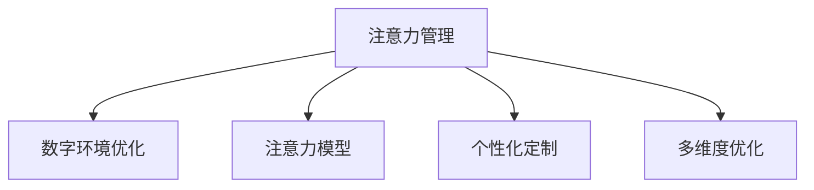

                 

# 信息时代的注意力管理技术与策略：在干扰和信息过载中保持专注

## 1. 背景介绍

### 1.1 问题由来

在信息时代，人们的生活被海量信息所包围。数字设备、社交媒体、新闻应用等无处不在，不断打断我们的注意力，导致信息过载和注意力分散。这种“数字疲劳”现象不仅影响日常工作生活，还可能对心理健康产生不利影响。

要有效管理注意力，需要找到一种平衡点：一方面，利用数字技术提升生产力和效率；另一方面，尽量减少干扰，保护注意力资源。特别是对于信息工作者、学生、知识工作者等依赖大量信息输入和处理的人群，注意力管理的重要性尤为突出。

### 1.2 问题核心关键点

注意力管理技术，旨在通过技术手段，帮助用户更好地分配和管理注意力资源，避免被干扰分散注意力，从而提升信息处理效率和生产力。其核心关键点包括：

- **数字技术应用**：通过算法和工具，对用户的数字环境进行优化，减少干扰。
- **注意力模型建立**：分析用户注意力特点，建立模型，用于指导注意力管理策略。
- **个性化定制**：根据用户特定需求，定制个性化管理方案。
- **多维度优化**：结合时间管理、行为习惯、环境调整等多维度策略，综合提升注意力管理效果。

## 2. 核心概念与联系

### 2.1 核心概念概述

为更好地理解注意力管理技术的原理和策略，本节将介绍几个核心概念：

- **注意力管理**：指通过技术手段，帮助用户更有效地分配和管理注意力资源，提升信息处理效率。
- **数字环境优化**：利用算法和工具，优化用户的数字环境，减少干扰因素，如广告弹窗、社交媒体通知等。
- **注意力模型**：建立用户注意力特点的数学模型，用于指导注意力管理策略。
- **个性化定制**：根据用户需求、习惯、偏好等，提供定制化的注意力管理方案。
- **多维度优化**：结合时间管理、行为习惯调整、物理环境优化等多方面策略，综合提升注意力管理效果。

这些核心概念之间的关系可以通过以下Mermaid流程图来展示：



这个流程图展示了几大核心概念之间的关系：

1. 注意力管理是整个系统的核心目标。
2. 数字环境优化通过减少干扰，帮助用户更好地集中注意力。
3. 注意力模型提供用户注意力特点的分析工具，用于策略制定。
4. 个性化定制根据用户特定需求，定制注意力管理方案。
5. 多维度优化结合多方面策略，综合提升注意力管理效果。

## 3. 核心算法原理 & 具体操作步骤
### 3.1 算法原理概述

注意力管理技术，本质上是通过算法和工具对用户数字环境进行优化，减少干扰，提升注意力集中度和信息处理效率。其核心算法可以概括为以下几个步骤：

1. **用户行为数据分析**：收集用户数字设备使用数据，如屏幕时间、应用程序使用情况、点击行为等。
2. **干扰因素识别**：分析用户行为数据，识别出对注意力产生干扰的因素，如应用弹窗、社交媒体通知等。
3. **优化策略制定**：根据干扰因素，制定相应的优化策略，如屏蔽特定应用、限制屏幕时间等。
4. **策略实施和评估**：在用户数字环境中实施优化策略，定期评估效果，根据反馈调整优化方案。

### 3.2 算法步骤详解

基于上述原理，注意力管理技术通常包括以下几个关键步骤：

**Step 1: 数据收集与分析**
- 使用分析工具，收集用户数字设备的使用数据，包括应用使用频率、屏幕时间、点击行为等。
- 通过机器学习算法，对用户行为数据进行分析，识别出对注意力产生显著干扰的因素。

**Step 2: 干扰因素识别**
- 基于行为分析结果，筛选出显著影响用户注意力的因素，如社交媒体通知、应用弹窗、广告等。
- 评估每个干扰因素的频率和强度，评估其对注意力的影响。

**Step 3: 优化策略制定**
- 根据干扰因素识别结果，制定相应的优化策略。如限制特定应用使用时间、屏蔽社交媒体通知等。
- 考虑用户个性化需求，定制化优化策略，如基于用户工作习惯设置特定时间段的应用使用限制。

**Step 4: 策略实施与评估**
- 将优化策略应用于用户数字环境，实施屏蔽通知、限制使用时间等操作。
- 定期评估策略效果，收集用户反馈，根据评估结果调整优化策略。

**Step 5: 持续优化与迭代**
- 在实际应用中，不断收集用户数据，迭代优化策略，提升注意力管理效果。
- 结合最新研究进展和技术发展，不断引入新的优化手段，如AI辅助决策等。

### 3.3 算法优缺点

注意力管理技术的优点包括：
1. 提升注意力集中度：通过减少干扰，帮助用户更好地集中注意力。
2. 提高信息处理效率：优化数字环境，减少信息过载，提升信息处理速度和质量。
3. 个性化定制：根据用户需求和习惯，提供定制化管理方案，提升用户满意度。
4. 多维度优化：结合时间管理、行为习惯调整、物理环境优化等多方面策略，综合提升效果。

同时，该技术也存在一定的局限性：
1. 依赖数字设备：注意力管理技术主要依赖数字设备的使用数据，对设备依赖程度较高。
2. 用户数据隐私：收集和使用用户数据可能涉及隐私问题，需严格遵守数据保护法规。
3. 用户适应性：不同的用户对注意力管理策略的适应性可能不同，效果存在个体差异。
4. 行为干预风险：过度干预用户行为可能导致用户反感，需平衡策略效果和用户体验。

尽管存在这些局限性，但就目前而言，注意力管理技术已成为提升信息处理效率的重要手段。未来相关研究的重点在于如何进一步降低数据收集和隐私保护的风险，提高个性化定制和用户体验，以及结合最新技术手段，提升注意力管理的智能化水平。

### 3.4 算法应用领域

注意力管理技术在多个领域已得到广泛应用，例如：

- **办公室工作效率提升**：通过限制应用使用时间、屏蔽通知等方式，提升办公环境中的注意力集中度。
- **学习教育**：帮助学生减少社交媒体干扰，提升学习专注度和效率。
- **心理健康支持**：通过减少数字设备使用，降低数字疲劳，缓解焦虑和压力。
- **远程办公**：通过优化远程工作环境，提升远程工作的注意力集中度和效率。
- **医疗健康**：通过减少数字设备干扰，提升病人的康复和治疗效果。

除了上述这些经典应用外，注意力管理技术还被创新性地应用到更多场景中，如数字健康、数字艺术创作等，为数字生活提供了更多可能性。

## 4. 数学模型和公式 & 详细讲解 & 举例说明
### 4.1 数学模型构建

本节将使用数学语言对注意力管理技术的核心算法进行更加严格的刻画。

假设用户数字环境中有 $N$ 个干扰因素，每个因素对注意力的影响强度为 $w_i$，其中 $w_i > 0$。设用户当前注意力的基准水平为 $C_0$，受 $N$ 个干扰因素的影响后，注意力水平变为 $C_1$。

定义用户行为数据为 $D$，通过机器学习算法 $f(D)$ 计算得到用户对每个干扰因素的敏感度 $s_i$，其中 $s_i \geq 0$。则用户受干扰后的注意力水平 $C_1$ 可表示为：

$$
C_1 = C_0 - \sum_{i=1}^N w_i s_i
$$

其中 $w_i$ 和 $s_i$ 的计算方法可以通过用户行为数据和历史干预效果进行训练，用于指导优化策略的制定。

### 4.2 公式推导过程

在实际应用中，注意力管理技术通常会进一步细化优化策略的制定和评估过程。以下以时间管理策略为例，推导优化公式及其梯度计算过程。

设用户每天的有效工作时间为 $T_{\text{work}}$，有效工作时间被干扰因素耗用的时间占比为 $\eta$，则用户实际有效工作时间 $T_{\text{actual}}$ 可表示为：

$$
T_{\text{actual}} = T_{\text{work}}(1-\eta)
$$

设用户希望提升的有效工作时间占比为 $\delta$，则优化目标为：

$$
\eta^* = \mathop{\arg\min}_{\eta} \eta - \delta
$$

根据上述公式，优化目标函数为：

$$
\mathcal{L}(\eta) = \eta - \delta
$$

在实际应用中，优化目标函数 $\mathcal{L}(\eta)$ 需要通过梯度下降等优化算法进行求解。具体地，对 $\mathcal{L}(\eta)$ 关于 $\eta$ 求导，得到：

$$
\frac{\partial \mathcal{L}(\eta)}{\partial \eta} = 1
$$

则优化算法更新策略的公式为：

$$
\eta_{t+1} = \eta_t - \eta \frac{\partial \mathcal{L}(\eta)}{\partial \eta}
$$

其中 $\eta$ 为学习率，通常需要根据实际情况进行调整。

### 4.3 案例分析与讲解

以一个简单的应用场景为例，假设用户每天有8小时的有效工作时间，希望提升2小时的实际工作时间。设用户每天打开邮件应用的时间占比为0.1，优化目标是减少邮件应用的干扰，提升实际工作时间。

根据上述模型，优化目标函数为：

$$
\mathcal{L}(\eta) = 0.1\eta - 0.2
$$

使用梯度下降优化算法，设置学习率为0.01，更新规则为：

$$
\eta_{t+1} = \eta_t - 0.01 \times 1
$$

在实际应用中，可以通过A/B测试等方式，不断调整优化策略，直至达到理想效果。

## 5. 项目实践：代码实例和详细解释说明
### 5.1 开发环境搭建

在进行注意力管理技术的开发和实践时，需要一个较为完善的开发环境。以下是使用Python进行注意力管理应用开发的环境配置流程：

1. 安装Anaconda：从官网下载并安装Anaconda，用于创建独立的Python环境。

2. 创建并激活虚拟环境：
```bash
conda create -n attention-env python=3.8 
conda activate attention-env
```

3. 安装PyTorch：基于Python的开源深度学习框架，灵活动态的计算图，适合快速迭代研究。

```bash
pip install torch torchvision torchaudio
```

4. 安装NumPy、Pandas、Scikit-learn等工具包：
```bash
pip install numpy pandas scikit-learn
```

5. 安装行为分析工具：如RescueTime、Focus@Will等，用于收集和分析用户数字行为数据。

6. 安装注意力管理工具：如Forest、Cold Turkey等，用于实施和管理注意力管理策略。

完成上述步骤后，即可在`attention-env`环境中开始注意力管理应用的开发实践。

### 5.2 源代码详细实现

下面以一个简单的注意力管理应用为例，给出使用Python进行注意力管理的代码实现。

首先，定义用户行为数据的收集和分析函数：

```python
import pandas as pd
from sklearn.linear_model import LinearRegression

def collect_user_data(days):
    # 从行为分析工具中收集用户数字行为数据
    data = pd.read_csv('user_data.csv')
    # 选择最近days天的数据
    data = data.tail(days)
    return data

def analyze_user_data(data):
    # 计算每个干扰因素对注意力的影响强度
    sensitivities = pd.DataFrame(data['sensitivity'].tolist(), columns=['interference'])
    sensitivities.index = data['factor'].tolist()
    # 使用线性回归模型计算每个干扰因素的权重
    model = LinearRegression()
    model.fit(sensitivities.values, data['attention'].tolist())
    weights = model.coef_.tolist()
    return weights
```

然后，定义优化策略的制定和评估函数：

```python
from sympy import symbols, Eq, solve

def optimize_strategy(weights, user_work_time, desired_work_time):
    # 定义变量
    eta = symbols('eta')
    # 计算优化目标函数
    loss = eta - user_work_time * (1 - sum(weights) * (1 - eta))
    # 使用梯度下降法求解最优策略
    learning_rate = 0.01
    eta_opt = solve(Eq(loss, desired_work_time), eta)
    return eta_opt[0]

def evaluate_strategy(strategy, user_work_time, user_interruptions):
    # 计算实际工作时间
    actual_work_time = user_work_time * (1 - strategy)
    # 计算优化效果
    improvement = actual_work_time - user_work_time
    return improvement
```

最后，启动优化流程并输出优化效果：

```python
user_work_time = 8  # 用户每天有效工作时间
desired_work_time = 2  # 用户希望提升的有效工作时间
user_interruptions = 0.1  # 用户每天打开邮件应用的时间占比

# 收集用户行为数据
days = 7
user_data = collect_user_data(days)

# 分析用户行为数据
weights = analyze_user_data(user_data)

# 制定优化策略
strategy = optimize_strategy(weights, user_work_time, desired_work_time)

# 评估优化效果
improvement = evaluate_strategy(strategy, user_work_time, user_interruptions)

print(f"优化后的有效工作时间占比: {strategy:.2f}")
print(f"优化效果提升: {improvement:.2f}小时")
```

以上就是使用Python进行注意力管理的完整代码实现。可以看到，通过Python工具和行为分析工具，可以对用户数字行为数据进行分析，并制定相应的优化策略。

### 5.3 代码解读与分析

让我们再详细解读一下关键代码的实现细节：

**collect_user_data函数**：
- 从行为分析工具中收集用户数字行为数据，选择最近7天的数据进行分析和优化。

**analyze_user_data函数**：
- 计算每个干扰因素对注意力的影响强度。
- 使用线性回归模型，计算每个干扰因素的权重。

**optimize_strategy函数**：
- 定义优化目标函数。
- 使用梯度下降法求解最优策略。

**evaluate_strategy函数**：
- 计算实际工作时间。
- 评估优化效果。

**优化流程**：
- 收集用户行为数据，分析并计算每个干扰因素的权重。
- 根据用户期望提升的工作时间，制定优化策略。
- 评估优化效果，输出优化后的有效工作时间占比和效果提升。

可以看到，注意力管理技术的开发需要结合行为分析工具和算法模型，通过代码实现对用户数字环境进行优化，提升注意力集中度和信息处理效率。

## 6. 实际应用场景
### 6.1 智能办公系统

在智能办公系统中，注意力管理技术可以帮助员工提升工作效率和专注度。具体应用场景包括：

- **集中工作时间**：根据工作任务的重要程度，设定固定的工作时间，减少频繁的会议和邮件打扰。
- **应用屏蔽**：屏蔽社交媒体、即时通讯等应用，减少不必要的干扰。
- **工作时间优化**：根据用户的实际工作习惯，调整工作时间的分布，提升工作效果。

### 6.2 在线教育平台

在线教育平台中，学生面对大量的学习资源和任务，注意力容易分散。注意力管理技术可以通过以下方式提升学习效率：

- **学习计划制定**：根据学生的学习进度和习惯，制定个性化的学习计划，确保高效完成学习任务。
- **学习时间管理**：限制社交媒体和游戏应用的使用时间，减少干扰，提升学习专注度。
- **学习内容推送**：根据学生的学习兴趣和进度，推送相关学习内容，减少信息过载。

### 6.3 数字健康应用

数字健康应用通过结合注意力管理技术，帮助用户改善数字生活方式，提升身心健康。具体应用场景包括：

- **数字减负**：减少数字设备的使用时间，缓解数字疲劳。
- **睡眠质量管理**：限制晚间使用数字设备的时间，提升睡眠质量。
- **健康习惯养成**：通过时间管理和行为调整，帮助用户养成健康的生活习惯。

### 6.4 未来应用展望

随着技术的不断发展，注意力管理技术将在更多领域得到应用，为人们的生活带来更多便利和提升。

在智慧城市治理中，通过优化市民的数字环境，提升公共服务的效率和效果，构建更安全、高效的未来城市。

在数字艺术创作中，通过减少干扰，提升创作者的专注度和创作效率，激发更多创意和创新。

在企业生产管理中，通过优化员工的工作时间管理，提升生产力和协作效率，推动企业的数字化转型。

未来，注意力管理技术将进一步与AI、大数据、物联网等技术融合，为人们的生活和工作提供更多智能化的辅助和支持。

## 7. 工具和资源推荐
### 7.1 学习资源推荐

为了帮助开发者系统掌握注意力管理技术的理论基础和实践技巧，这里推荐一些优质的学习资源：

1. 《Attention Is All You Need》论文：Transformer模型的奠基之作，深入解释了注意力机制的原理和应用。
2. 《Deep Learning for Self-Driving Cars》书籍：介绍深度学习在自动驾驶中的应用，包括注意力机制的实际应用。
3. 《Human-Centered Artificial Intelligence》课程：斯坦福大学开设的AI伦理课程，探讨AI技术对人类社会的影响。
4. 《Deep Learning Specialization》系列课程：由Andrew Ng教授主讲的深度学习课程，涵盖注意力机制等前沿话题。
5. 《Attention Mechanism in Natural Language Processing》论文：介绍注意力机制在自然语言处理中的应用，涵盖注意力模型的建立和优化。

通过对这些资源的学习实践，相信你一定能够快速掌握注意力管理技术的精髓，并用于解决实际的注意力管理问题。

### 7.2 开发工具推荐

高效的开发离不开优秀的工具支持。以下是几款用于注意力管理技术开发的常用工具：

1. PyTorch：基于Python的开源深度学习框架，灵活动态的计算图，适合快速迭代研究。

2. TensorFlow：由Google主导开发的开源深度学习框架，生产部署方便，适合大规模工程应用。

3. TensorBoard：TensorFlow配套的可视化工具，可实时监测模型训练状态，提供丰富的图表呈现方式。

4. RescueTime：行为分析工具，用于收集和分析用户数字行为数据，提供详细的行为报告和优化建议。

5. Forest：注意力管理工具，通过种树的方式激励用户减少数字设备的使用时间。

6. Cold Turkey：注意力管理工具，通过屏蔽特定应用、限制屏幕时间等方式，帮助用户提升专注度。

合理利用这些工具，可以显著提升注意力管理技术的开发效率，加快创新迭代的步伐。

### 7.3 相关论文推荐

注意力管理技术的研究源于学界的持续研究。以下是几篇奠基性的相关论文，推荐阅读：

1. Attention Is All You Need：提出Transformer结构，开启了NLP领域的预训练大模型时代。

2. Human-Centered Attention Analysis in Mobile Health：探讨注意力管理在数字健康中的应用，帮助用户改善数字生活方式。

3. Focus++: Cognitive Monitoring and Personalized Conditional Attention: 提出基于认知监控的个性化注意力管理方法，提升学习效率和工作效果。

4. Multi-Task Learning with Task-Adaptive Attention Mechanism: 提出多任务学习中的自适应注意力机制，提升模型性能和泛化能力。

5. Adaptive Attention for Language Modeling: 提出自适应注意力机制，提升语言模型的生成效果和可解释性。

这些论文代表了大语言模型微调技术的发展脉络。通过学习这些前沿成果，可以帮助研究者把握学科前进方向，激发更多的创新灵感。

## 8. 总结：未来发展趋势与挑战

### 8.1 研究成果总结

本文对注意力管理技术的原理和策略进行了全面系统的介绍。首先阐述了注意力管理技术的研究背景和意义，明确了在信息过载时代，注意力管理的重要性。其次，从原理到实践，详细讲解了注意力管理技术的数学模型和算法步骤，给出了注意力管理技术开发的完整代码实例。同时，本文还广泛探讨了注意力管理技术在智能办公、在线教育、数字健康等多个行业领域的应用前景，展示了注意力管理技术的巨大潜力。此外，本文精选了注意力管理技术的各类学习资源，力求为读者提供全方位的技术指引。

通过本文的系统梳理，可以看到，注意力管理技术正在成为提升信息处理效率的重要手段。这些技术的不断演进，必将进一步提升人们的生产力，为社会的数字化转型提供新的动力。

### 8.2 未来发展趋势

展望未来，注意力管理技术将呈现以下几个发展趋势：

1. **智能决策**：结合机器学习和大数据分析，实现更加智能化的注意力管理决策，适应用户多变的行为模式。
2. **跨平台协同**：将不同平台和设备的数据进行整合，实现跨平台一致性的注意力管理策略。
3. **个性化定制**：通过用户行为数据和反馈，不断优化个性化注意力管理方案，提升用户体验。
4. **多感官融合**：结合视觉、听觉等多感官数据，提升对用户注意力的全面监测和理解。
5. **混合式管理**：结合数字和物理手段，实现更加全面的注意力管理。

以上趋势凸显了注意力管理技术的广阔前景。这些方向的探索发展，必将进一步提升信息处理效率和生产力，为数字化生活带来更多便利和提升。

### 8.3 面临的挑战

尽管注意力管理技术已经取得了瞩目成就，但在迈向更加智能化、普适化应用的过程中，它仍面临诸多挑战：

1. **用户数据隐私**：收集和使用用户数据可能涉及隐私问题，需严格遵守数据保护法规。
2. **用户适应性**：不同的用户对注意力管理策略的适应性可能不同，效果存在个体差异。
3. **技术成熟度**：现有的注意力管理技术仍需进一步优化和完善，提升其实用性和智能化水平。
4. **跨平台兼容性**：实现跨平台一致性的注意力管理策略，仍需解决诸多技术难题。

尽管存在这些挑战，但随着技术的不断发展和优化，注意力管理技术必将在更多领域得到应用，为人们的生活和工作提供更多智能化的辅助和支持。相信随着学界和产业界的共同努力，这些挑战终将一一被克服，注意力管理技术必将在构建安全、可靠、可解释、可控的智能系统铺平道路。

### 8.4 研究展望

面对注意力管理技术面临的挑战，未来的研究需要在以下几个方面寻求新的突破：

1. **隐私保护机制**：开发更加安全的用户数据收集和处理机制，保护用户隐私。
2. **个性化优化算法**：结合用户行为数据和反馈，实现更加智能化的个性化优化算法。
3. **跨平台数据整合**：开发跨平台数据整合和共享的技术，提升注意力管理的全面性和一致性。
4. **多感官融合技术**：结合视觉、听觉等多感官数据，提升对用户注意力的全面监测和理解。
5. **混合式管理方法**：结合数字和物理手段，实现更加全面的注意力管理。

这些研究方向的探索，必将引领注意力管理技术迈向更高的台阶，为构建智能、高效、安全的生活和工作环境提供新的技术手段。

## 9. 附录：常见问题与解答

**Q1：注意力管理技术是否适用于所有用户？**

A: 注意力管理技术通常适用于有数字设备使用习惯的用户，但并不适用于所有人群。例如，对于一些不习惯数字设备的使用或对技术较为抵触的用户，使用注意力管理技术可能会带来不适感，甚至产生反感。因此，在推广注意力管理技术时，需要结合用户特点和习惯，合理选择用户群体。

**Q2：注意力管理技术会对用户的注意力产生影响吗？**

A: 在实际应用中，注意力管理技术会通过屏蔽干扰和限制使用时间等方式，帮助用户减少注意力分散。但同时，过度使用注意力管理工具也可能导致用户对数字设备产生依赖，进一步加剧注意力分散。因此，用户需要结合自身需求和习惯，合理使用注意力管理技术。

**Q3：注意力管理技术如何实现跨平台一致性？**

A: 实现跨平台一致性的注意力管理，需要开发统一的数据格式和接口标准，确保不同平台和设备之间数据的兼容性和互操作性。此外，结合云服务技术，可以实现跨平台数据同步和策略统一，提升注意力管理的全面性和一致性。

**Q4：注意力管理技术如何结合多感官数据？**

A: 结合多感官数据，可以通过传感器和设备采集用户的视觉、听觉、生理信号等数据，结合深度学习模型进行分析和理解。例如，通过摄像头捕捉用户的面部表情和姿势，结合语音识别技术，提升对用户注意力的全面监测和理解。

**Q5：注意力管理技术如何结合数字和物理手段？**

A: 结合数字和物理手段，可以通过智能家居设备、智能穿戴设备等，实现对用户注意力的全面监测和理解。例如，通过智能手表监测用户的生理信号，结合数字设备的使用数据，提升对用户注意力的全面管理。

这些问题的解答，展示了注意力管理技术在实际应用中的注意事项和挑战，希望能为读者提供有价值的参考。

---

作者：禅与计算机程序设计艺术 / Zen and the Art of Computer Programming

