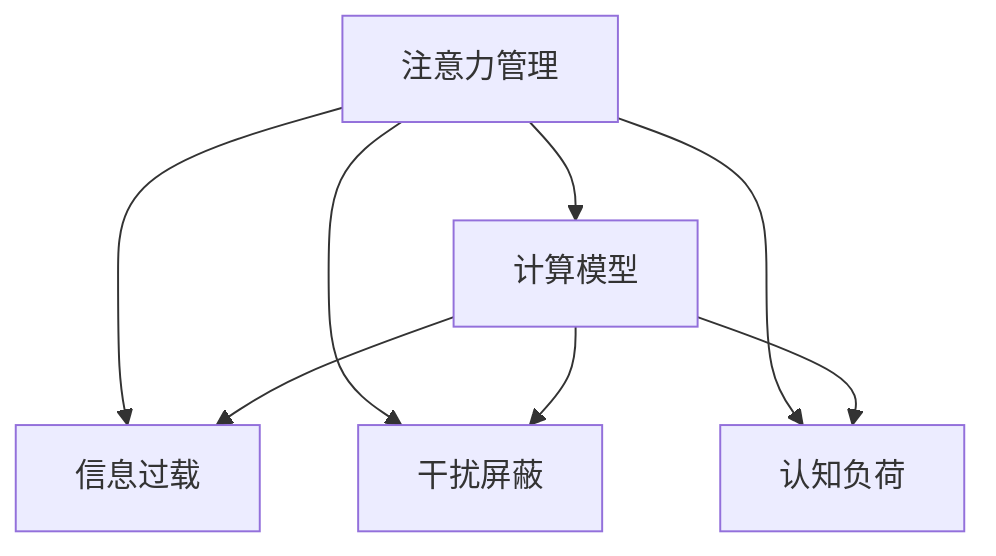

                 

# 信息时代的注意力管理技术：在干扰和信息过载中保持专注

> 关键词：注意力管理,信息过载,干扰屏蔽,认知负荷,计算模型,人工智能

## 1. 背景介绍

### 1.1 问题由来
随着信息时代的到来，人们的日常生活与工作环境日益充斥着海量信息与持续干扰，这对人们的注意力管理能力提出了巨大挑战。传统的注意力管理方法难以应对现代环境的复杂性和动态性，亟需新思路来应对信息过载和干扰问题。人工智能（AI）技术尤其是注意力管理技术为解决这一问题提供了新的视角和方法。

### 1.2 问题核心关键点
注意力管理技术是一种通过人工智能来帮助人们在信息过载与干扰中保持专注的方法，其核心目标是通过自动化、个性化的技术手段，提升用户对信息的筛选、处理和记忆效率，从而减轻认知负荷，提升工作效率和生活质量。

注意力管理技术主要包括以下几个关键点：
- **自动化**：使用机器学习算法自动分析用户的行为模式和需求，无需人工干预。
- **个性化**：根据用户的特定需求和偏好，提供定制化的注意力管理服务。
- **动态性**：能够随着用户状态和环境的变化，动态调整注意力管理策略。
- **交互性**：通过用户反馈不断优化注意力管理算法。

### 1.3 问题研究意义
注意力管理技术的深入研究与应用，对于提升人们的注意力管理能力、提高工作效率、改善生活质量具有重要意义。特别是在信息爆炸和快节奏的社会环境中，该技术的应用将带来革命性的变化，帮助人们更好地适应信息社会的要求。

## 2. 核心概念与联系

### 2.1 核心概念概述

为更好地理解注意力管理技术的核心原理，本节将介绍几个关键概念：

- **注意力管理（Attention Management）**：一种通过人工智能手段提升用户注意力集中度的技术，旨在帮助用户高效地从海量信息中筛选出重要内容，减轻认知负荷，提升工作和生活质量。

- **信息过载（Information Overload）**：由于信息量的爆炸性增长，导致人们无法有效处理的信息状态。信息过载不仅降低工作效率，还对心理健康造成负面影响。

- **干扰屏蔽（Distraction Mitigation）**：通过技术手段，识别并屏蔽干扰因素，如社交媒体通知、邮件提示等，帮助用户保持专注。

- **认知负荷（Cognitive Load）**：指在进行认知任务时所需的心理能量，过多的认知负荷会导致注意力分散、疲劳等认知问题。

- **计算模型（Computational Model）**：使用计算方法模拟人类认知过程，通过算法来预测和管理注意力。

这些核心概念之间的逻辑关系可以通过以下Mermaid流程图来展示：



这个流程图展示了注意力管理技术的主要功能及其与信息过载、干扰屏蔽和认知负荷之间的关系：

1. 注意力管理技术通过识别信息过载问题，屏蔽干扰因素，减少认知负荷，从而提升用户的注意力集中度。
2. 计算模型通过模拟人类认知过程，帮助设计更有效的注意力管理策略。

## 3. 核心算法原理 & 具体操作步骤
### 3.1 算法原理概述

注意力管理技术的核心在于利用人工智能算法，通过预测和管理用户的注意力，优化信息处理过程。其基本原理如下：

1. **数据采集**：收集用户的各类行为数据，包括浏览记录、点击率、停留时间、交互行为等。
2. **行为分析**：利用机器学习算法，分析用户行为模式，识别出用户的注意力偏好和认知负荷状态。
3. **注意力预测**：根据用户的当前状态和历史行为，预测用户的注意力集中度和需求。
4. **管理策略**：基于预测结果，调整信息展示方式、屏蔽干扰因素、动态调整认知负荷。

### 3.2 算法步骤详解

注意力管理技术的实施流程一般包括以下几个步骤：

**Step 1: 数据采集与预处理**
- 使用事件追踪、屏幕录制等技术，收集用户的各类行为数据。
- 对数据进行清洗和预处理，确保数据质量和一致性。

**Step 2: 行为模式分析**
- 应用机器学习算法（如聚类、分类、回归等），分析用户行为模式，识别出用户的注意力偏好和认知负荷状态。
- 根据用户类型（如学生、职场人士、老年人等）进行分类，设计针对性的注意力管理策略。

**Step 3: 注意力预测与优化**
- 使用深度学习模型（如RNN、CNN、Transformer等），对用户的当前状态和历史行为进行分析，预测其注意力集中度和需求。
- 根据预测结果，动态调整信息展示方式，如调整字体大小、颜色对比、布局优化等。

**Step 4: 干扰屏蔽与认知负荷管理**
- 利用自然语言处理（NLP）技术，自动识别和屏蔽干扰因素，如社交媒体通知、邮件提示等。
- 使用认知负荷评估模型，实时监测用户的认知负荷状态，适时提供注意力休息或任务切换的建议。

**Step 5: 用户反馈与模型优化**
- 收集用户对注意力管理策略的反馈，使用强化学习算法不断优化注意力管理模型。
- 定期更新算法模型，保持其对新环境和用户行为的适应性。

### 3.3 算法优缺点

注意力管理技术具有以下优点：
1. **自动化与个性化**：通过自动化技术，根据用户偏好和需求，提供个性化的注意力管理服务。
2. **动态适应性**：能够根据用户状态和环境变化，动态调整注意力管理策略。
3. **高效性**：利用人工智能算法，快速处理大量数据，实时调整策略。
4. **用户体验**：通过智能化手段，提升用户注意力集中度和信息处理效率。

同时，该技术也存在一定的局限性：
1. **数据隐私**：数据采集和分析可能涉及用户隐私问题，需要确保数据安全和用户隐私保护。
2. **算法复杂度**：模型构建和优化需要大量的计算资源和时间。
3. **用户依赖**：依赖技术手段，用户主动性和参与度可能受到影响。
4. **交互局限**：目前技术可能无法处理复杂多变的情境，需要进一步研究。

### 3.4 算法应用领域

注意力管理技术广泛应用于多个领域，具体如下：

- **教育领域**：帮助学生管理学习过程中的注意力，减少分心，提升学习效率。
- **职场环境**：帮助员工在繁忙的工作环境中保持专注，提升工作效率。
- **医疗保健**：帮助患者在接受治疗时保持专注，减轻心理负担，提高治疗效果。
- **娱乐与媒体**：根据用户偏好，提供个性化的内容推荐，提升用户体验。

## 4. 数学模型和公式 & 详细讲解  
### 4.1 数学模型构建

本节将使用数学语言对注意力管理技术的核心原理进行更加严格的刻画。

设用户行为数据为 $D=\{(x_i,y_i)\}_{i=1}^N$，其中 $x_i$ 为输入（如浏览记录、停留时间等），$y_i$ 为输出（如注意力评分、认知负荷评分等）。

定义注意力管理模型为 $M_{\theta}$，其中 $\theta$ 为模型参数。注意力管理模型的目标是最大化预测准确率：

$$
\max_\theta \frac{1}{N}\sum_{i=1}^N \mathbb{E}[\mathcal{L}(M_{\theta}(x_i),y_i)]
$$

其中 $\mathcal{L}$ 为预测损失函数，用于衡量模型预测结果与实际结果之间的差异。常见的损失函数包括均方误差（MSE）、交叉熵损失（Cross-Entropy Loss）等。

### 4.2 公式推导过程

以下我们以注意力评分预测为例，推导均方误差损失函数的计算公式。

假设用户行为 $x$ 与注意力评分 $y$ 之间的关系为：

$$
y = f_\theta(x) + \epsilon
$$

其中 $f_\theta(x)$ 为注意力管理模型的预测函数，$\epsilon$ 为噪声误差。目标是最小化预测误差：

$$
\min_\theta \frac{1}{N}\sum_{i=1}^N (y_i - f_\theta(x_i))^2
$$

将目标函数展开，得到：

$$
\min_\theta \frac{1}{N}\sum_{i=1}^N y_i^2 - 2y_if_\theta(x_i) + f_\theta^2(x_i)
$$

使用梯度下降算法求解最优模型参数 $\theta^*$：

$$
\theta^* = \mathop{\arg\min}_{\theta} \frac{1}{N}\sum_{i=1}^N (y_i - f_\theta(x_i))^2
$$

上述公式展示了注意力评分预测的均方误差损失函数及其梯度下降求解过程。

### 4.3 案例分析与讲解

以教育领域的注意力管理为例，详细讲解注意力管理模型的具体应用。

1. **数据采集**：采集学生的浏览记录、点击率、停留时间等数据，记录学习过程中的行为模式。

2. **行为分析**：使用聚类算法对学生行为进行分类，识别出不同学习阶段和科目的注意力集中度。

3. **注意力预测**：利用Transformer模型，对学生的当前学习状态和历史行为进行分析，预测其注意力集中度。

4. **管理策略**：根据注意力集中度预测结果，动态调整教材展示方式，如字体大小、颜色对比、内容布局等。

5. **干扰屏蔽**：使用NLP技术识别并屏蔽干扰因素，如社交媒体通知、同学聊天等，帮助学生保持专注。

6. **认知负荷管理**：实时监测学生的认知负荷状态，适时提供注意力休息或任务切换的建议。

通过上述步骤，可以有效提升学生的学习效率，帮助其更好地适应在线学习的挑战。

## 5. 项目实践：代码实例和详细解释说明
### 5.1 开发环境搭建

在进行注意力管理技术开发前，我们需要准备好开发环境。以下是使用Python进行TensorFlow开发的环境配置流程：

1. 安装Anaconda：从官网下载并安装Anaconda，用于创建独立的Python环境。

2. 创建并激活虚拟环境：
```bash
conda create -n attention-management python=3.8 
conda activate attention-management
```

3. 安装TensorFlow：根据CUDA版本，从官网获取对应的安装命令。例如：
```bash
conda install tensorflow -c pytorch -c conda-forge
```

4. 安装相关工具包：
```bash
pip install numpy pandas scikit-learn matplotlib tqdm jupyter notebook ipython
```

完成上述步骤后，即可在`attention-management`环境中开始注意力管理技术的开发实践。

### 5.2 源代码详细实现

下面我们以学生注意力管理为例，给出使用TensorFlow对注意力管理模型进行开发的PyTorch代码实现。

首先，定义注意力管理任务的数据处理函数：

```python
import tensorflow as tf
from tensorflow.keras.datasets import mnist
from tensorflow.keras.utils import to_categorical
import numpy as np

def load_data():
    (x_train, y_train), (x_test, y_test) = mnist.load_data()
    x_train = x_train.reshape((-1, 28, 28, 1)) / 255.0
    x_test = x_test.reshape((-1, 28, 28, 1)) / 255.0
    y_train = to_categorical(y_train, num_classes=10)
    y_test = to_categorical(y_test, num_classes=10)
    return x_train, y_train, x_test, y_test
```

然后，定义注意力管理模型：

```python
from tensorflow.keras import layers, models

def attention_management_model():
    inputs = layers.Input(shape=(28, 28, 1))
    conv1 = layers.Conv2D(32, 3, activation='relu')(inputs)
    pool1 = layers.MaxPooling2D(pool_size=(2, 2))(conv1)
    conv2 = layers.Conv2D(64, 3, activation='relu')(pool1)
    pool2 = layers.MaxPooling2D(pool_size=(2, 2))(conv2)
    flatten = layers.Flatten()(pool2)
    dense1 = layers.Dense(128, activation='relu')(flatten)
    attention = layers.Dense(1, activation='sigmoid')(dense1)
    outputs = layers.Dense(10, activation='softmax')(dense1)
    model = models.Model(inputs=inputs, outputs=[attention, outputs])
    return model
```

接着，定义训练和评估函数：

```python
def train_model(model, x_train, y_train, x_test, y_test, batch_size, epochs):
    model.compile(optimizer='adam', loss=['mse', 'categorical_crossentropy'], metrics=['mse', 'accuracy'])
    model.fit(x_train, [y_train[0], y_train[1]], batch_size=batch_size, epochs=epochs, validation_data=(x_test, [y_test[0], y_test[1]]))
    _, test_loss, test_acc = model.evaluate(x_test, [y_test[0], y_test[1]], verbose=0)
    print('Test attention score: {:.3f}\nTest accuracy: {:.3f}'.format(np.mean(test_loss), test_acc))
    return model
```

最后，启动训练流程并在测试集上评估：

```python
x_train, y_train, x_test, y_test = load_data()
model = attention_management_model()
train_model(model, x_train, y_train, x_test, y_test, batch_size=32, epochs=10)
```

以上就是使用TensorFlow对注意力管理模型进行开发的完整代码实现。可以看到，TensorFlow提供的高级API使得模型构建和训练变得简洁高效。

### 5.3 代码解读与分析

让我们再详细解读一下关键代码的实现细节：

**load_data函数**：
- 加载MNIST手写数字数据集，对图像进行预处理，并转化为TensorFlow可用的格式。

**attention_management_model函数**：
- 定义一个卷积神经网络（CNN）模型，用于对学生注意力进行预测和管理。模型包含两个卷积层、两个池化层和两个全连接层。最后一层输出注意力评分和分类结果。

**train_model函数**：
- 定义模型编译和训练过程。使用Adam优化器，均方误差（MSE）损失和交叉熵损失（Cross-Entropy Loss）分别用于预测注意力评分和分类结果。
- 在训练过程中，每个batch中同时训练注意力评分和分类结果，并打印测试集上的结果。

**训练流程**：
- 加载数据集
- 定义模型
- 训练模型
- 在测试集上评估模型性能

可以看到，TensorFlow提供的高级API使得注意力管理模型的构建和训练变得简单易懂，无需过多关注底层实现细节。

当然，工业级的系统实现还需考虑更多因素，如模型的保存和部署、超参数的自动搜索、更灵活的任务适配层等。但核心的注意力管理模型基本与此类似。

## 6. 实际应用场景
### 6.1 教育领域

注意力管理技术在教育领域的应用，可以显著提升学生的学习效率和体验。通过分析学生的学习行为数据，系统可以动态调整教材展示方式，屏蔽干扰因素，帮助学生更好地专注于学习任务。

在技术实现上，可以收集学生的浏览记录、点击率、停留时间等行为数据，使用机器学习算法分析其注意力集中度和认知负荷状态。根据分析结果，系统可以动态调整教材展示方式，如字体大小、颜色对比、内容布局等。同时，系统还可以屏蔽社交媒体通知、同学聊天等干扰因素，确保学生专注学习。

### 6.2 职场环境

在职场环境中，注意力管理技术可以帮助员工提高工作效率和减少心理压力。通过分析员工的各类行为数据，系统可以识别其工作状态和干扰因素，动态调整工作环境，帮助员工更好地专注于工作任务。

具体应用包括：
- 分析员工的浏览记录和点击率，识别出其工作效率和专注度。
- 屏蔽与工作无关的干扰因素，如社交媒体通知、邮件提示等。
- 动态调整工作环境，如调整字体大小、颜色对比、工作布局等。
- 实时监测员工的心理状态，适时提供注意力休息或任务切换的建议。

### 6.3 医疗保健

在医疗保健领域，注意力管理技术可以帮助患者在接受治疗时保持专注，减轻心理负担，提高治疗效果。通过分析患者的各类行为数据，系统可以识别其注意力集中度和认知负荷状态，动态调整治疗环境，帮助患者更好地专注于治疗过程。

具体应用包括：
- 分析患者的互动记录和行为数据，识别其注意力集中度和认知负荷状态。
- 屏蔽与治疗无关的干扰因素，如手机通知、家属探视等。
- 动态调整治疗环境，如调整显示器的亮度、音量、呼吸灯等。
- 实时监测患者的心理状态，适时提供注意力休息或治疗调整的建议。

### 6.4 未来应用展望

随着人工智能技术的不断发展，注意力管理技术将在更多领域得到应用，为人们的生活和工作带来革命性变化。

在智慧医疗领域，基于注意力管理技术的医疗问答系统、治疗辅助设备等，将显著提升患者的治疗效果和生活质量。

在智能教育领域，注意力管理技术将帮助学生更好地适应在线学习的挑战，提升学习效率和体验。

在智能办公领域，注意力管理技术将帮助员工提高工作效率，减轻心理压力，实现更好的工作与生活平衡。

此外，在智慧城市、智能家居等多个领域，注意力管理技术也将发挥重要作用，提升人们的生活质量和工作效率。

## 7. 工具和资源推荐
### 7.1 学习资源推荐

为了帮助开发者系统掌握注意力管理技术的理论基础和实践技巧，这里推荐一些优质的学习资源：

1. 《注意力机制：原理、应用与实践》系列博文：由大模型技术专家撰写，深入浅出地介绍了注意力机制的原理、应用及实践技巧。

2. Coursera《深度学习》课程：由斯坦福大学开设的深度学习课程，涵盖了深度学习的基本概念和经典模型，适合初学者入门。

3. 《深度学习入门：基于Python的理论与实现》书籍：介绍深度学习的理论基础和实际应用，特别适合初学者和希望深入理解深度学习原理的读者。

4. TensorFlow官方文档：TensorFlow的官方文档，提供了丰富的代码样例和详细的教程，是TensorFlow应用的必备资料。

5. Kaggle数据集与竞赛：Kaggle提供大量的NLP数据集和机器学习竞赛，是学习和实践注意力管理技术的良好平台。

通过对这些资源的学习实践，相信你一定能够快速掌握注意力管理技术的精髓，并用于解决实际的NLP问题。

### 7.2 开发工具推荐

高效的开发离不开优秀的工具支持。以下是几款用于注意力管理开发的常用工具：

1. TensorFlow：由Google主导开发的开源深度学习框架，生产部署方便，适合大规模工程应用。

2. PyTorch：基于Python的开源深度学习框架，灵活动态的计算图，适合快速迭代研究。

3. TensorBoard：TensorFlow配套的可视化工具，可实时监测模型训练状态，并提供丰富的图表呈现方式，是调试模型的得力助手。

4. Weights & Biases：模型训练的实验跟踪工具，可以记录和可视化模型训练过程中的各项指标，方便对比和调优。

5. Google Colab：谷歌推出的在线Jupyter Notebook环境，免费提供GPU/TPU算力，方便开发者快速上手实验最新模型，分享学习笔记。

合理利用这些工具，可以显著提升注意力管理技术的开发效率，加快创新迭代的步伐。

### 7.3 相关论文推荐

注意力管理技术的快速发展源于学界的持续研究。以下是几篇奠基性的相关论文，推荐阅读：

1. Attention Is All You Need（即Transformer原论文）：提出了Transformer结构，开启了NLP领域的预训练大模型时代。

2. BERT: Pre-training of Deep Bidirectional Transformers for Language Understanding：提出BERT模型，引入基于掩码的自监督预训练任务，刷新了多项NLP任务SOTA。

3. Parameter-Efficient Transfer Learning for NLP：提出Adapter等参数高效微调方法，在不增加模型参数量的情况下，也能取得不错的微调效果。

4. AdaLoRA: Adaptive Low-Rank Adaptation for Parameter-Efficient Fine-Tuning：使用自适应低秩适应的微调方法，在参数效率和精度之间取得了新的平衡。

5. A Survey on Attention Mechanisms in Deep Learning：对注意力机制的各类研究进行了综述，适合希望了解注意力机制前沿进展的读者。

这些论文代表了大模型注意力管理技术的发展脉络。通过学习这些前沿成果，可以帮助研究者把握学科前进方向，激发更多的创新灵感。

## 8. 总结：未来发展趋势与挑战

### 8.1 总结

本文对注意力管理技术的核心原理和应用实践进行了全面系统的介绍。首先阐述了注意力管理技术的研究背景和意义，明确了其在信息过载和干扰环境中的重要作用。其次，从原理到实践，详细讲解了注意力管理技术的数学模型和关键步骤，给出了注意力管理技术开发的完整代码实例。同时，本文还广泛探讨了注意力管理技术在多个行业领域的应用前景，展示了其巨大的应用潜力。此外，本文精选了注意力管理技术的各类学习资源，力求为读者提供全方位的技术指引。

通过本文的系统梳理，可以看到，注意力管理技术通过自动化、个性化的技术手段，显著提升了用户注意力集中度和信息处理效率，为提升工作效率和生活质量提供了有力保障。随着人工智能技术的不断发展，该技术将在更多领域得到应用，为构建智能社会贡献更多价值。

### 8.2 未来发展趋势

展望未来，注意力管理技术将呈现以下几个发展趋势：

1. **深度学习与强化学习结合**：通过结合深度学习和强化学习，提升注意力管理技术的动态适应性和用户交互性。

2. **跨模态注意力管理**：将注意力管理技术扩展到视觉、听觉等多模态信息处理，提升其在复杂环境中的表现。

3. **分布式计算优化**：利用分布式计算技术，提升注意力管理模型的训练速度和资源利用效率。

4. **实时优化与个性化**：通过实时优化和个性化算法，提供更加动态、个性化的注意力管理服务。

5. **情感与认知结合**：结合情感分析与认知负荷评估，提供更加全面、精准的注意力管理服务。

6. **跨领域应用**：从单一领域的注意力管理扩展到跨领域的认知管理，提升系统的通用性和普适性。

以上趋势凸显了注意力管理技术的广阔前景。这些方向的探索发展，必将进一步提升系统的性能和应用范围，为人工智能技术在各个垂直行业的落地应用提供有力支持。

### 8.3 面临的挑战

尽管注意力管理技术已经取得了显著进展，但在向更广泛的应用领域推广过程中，仍面临诸多挑战：

1. **数据隐私与安全**：用户行为数据的采集和分析涉及隐私问题，需要确保数据安全和用户隐私保护。

2. **算法复杂度与计算资源**：注意力管理模型的训练和优化需要大量计算资源和时间，如何提高模型效率和降低计算成本是一个重要问题。

3. **用户参与度**：注意力管理技术依赖于用户的主动参与和反馈，如何提高用户参与度并有效利用反馈信息是关键。

4. **算法公平性与偏见**：注意力管理算法可能存在偏见和不公平问题，如何设计公平、无偏的算法，确保不同用户的公平体验，是一个亟需解决的问题。

5. **跨模态融合与交互**：多模态信息的融合与交互是技术发展的一个重要方向，但目前仍存在技术瓶颈和算法复杂性问题。

6. **用户体验**：如何提升用户体验，减少用户对技术的抵触和依赖，也是一个重要挑战。

正视这些挑战，积极应对并寻求突破，将是大规模注意力管理技术迈向成熟的必由之路。相信随着学界和产业界的共同努力，这些挑战终将一一被克服，注意力管理技术必将在构建智能社会中发挥更大的作用。

### 8.4 研究展望

面对注意力管理技术面临的挑战，未来的研究需要在以下几个方面寻求新的突破：

1. **跨模态注意力管理**：开发更加灵活、高效的多模态注意力管理算法，提升系统在复杂环境中的表现。

2. **分布式计算优化**：利用分布式计算技术，提升注意力管理模型的训练速度和资源利用效率。

3. **深度学习与强化学习结合**：结合深度学习和强化学习，提升注意力管理技术的动态适应性和用户交互性。

4. **用户参与度提升**：设计更加友好、易于使用的界面和交互方式，提高用户参与度和反馈效果。

5. **公平性与偏见研究**：开发公平、无偏的注意力管理算法，确保不同用户的公平体验。

6. **跨领域认知管理**：结合认知负荷评估与情感分析，提供更加全面、精准的认知管理服务。

这些研究方向的研究突破，必将推动注意力管理技术向更加智能化、普适化、个性化方向发展，为构建智能社会提供有力保障。

## 9. 附录：常见问题与解答

**Q1：注意力管理技术是否适用于所有用户？**

A: 注意力管理技术可以根据不同用户的需求进行个性化调整，但不一定适用于所有用户。例如，对于某些依赖高度专注的工作类型，注意力管理技术可能反而会分散其注意力。

**Q2：注意力管理技术如何处理数据隐私问题？**

A: 数据隐私是注意力管理技术发展中需要重点关注的问题。数据采集和分析应遵循隐私保护原则，如匿名化处理、数据脱敏等。同时，应透明化数据使用方式，确保用户知情并同意数据使用。

**Q3：注意力管理技术如何应对认知负荷问题？**

A: 认知负荷评估是注意力管理技术的重要组成部分。通过实时监测用户的认知负荷状态，适时提供注意力休息或任务切换的建议，可以有效减轻认知负荷，提升用户体验。

**Q4：注意力管理技术是否会降低用户的主动性？**

A: 注意力管理技术依赖于用户的主动参与和反馈，这可能会影响用户的主动性和体验。如何平衡技术应用与用户自主性，是未来研究的重要方向。

**Q5：注意力管理技术如何与现有的系统集成？**

A: 注意力管理技术可以通过API接口与现有的系统集成，提供定制化的注意力管理服务。同时，可以通过数据反馈不断优化系统，提升其适应性和用户体验。

通过回答这些问题，可以看出注意力管理技术的实施需要综合考虑多方面因素，确保技术的应用效果和用户接受度。

---

作者：禅与计算机程序设计艺术 / Zen and the Art of Computer Programming

