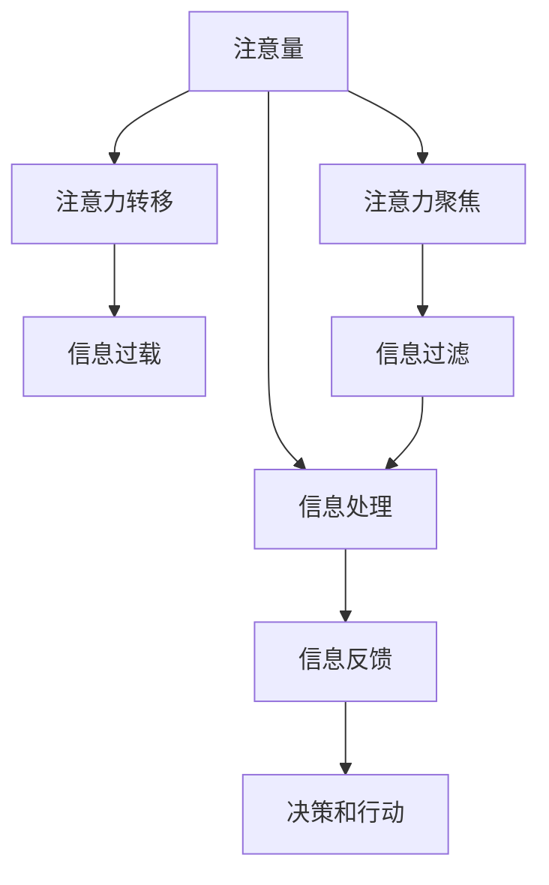

                 

# 信息时代的注意量管理挑战与策略：在干扰和信息过载中航行

## 1. 背景介绍

### 1.1 问题由来
随着信息技术的飞速发展，人们进入了一个"信息爆炸"的时代。从个人手机到社交媒体，从互联网到物联网，无处不在的信息流不断涌入我们的生活，极大地增加了我们的注意力负担。在信息的海洋中，如何高效管理注意量，过滤无关信息，聚焦于重要事项，成为了一个重要的研究课题。

### 1.2 问题核心关键点
注意量管理的核心在于如何在纷繁复杂的信息流中，以有限的注意力资源，高效获取并利用有价值的信息。具体来说，包括以下几个方面：

1. **信息筛选与识别**：如何从大量数据中快速识别出与自身需求相关的信息，避免信息过载。
2. **注意力聚焦与转移**：如何在不同的信息源之间高效切换，避免注意力分散。
3. **信息处理与反馈**：如何高效处理并利用获取的信息，形成有效的决策和行动。
4. **心理与生理健康**：如何在长时间的信息处理过程中保持注意力和心理的稳定。

这些问题在大数据时代显得尤为突出，人们在面对海量信息时，常常感到焦虑和疲惫。因此，研究有效的注意量管理策略，对于提升信息利用效率，保障身心健康具有重要意义。

## 2. 核心概念与联系

### 2.1 核心概念概述

为更好地理解注意量管理的方法，本节将介绍几个密切相关的核心概念：

- **注意量（Attention）**：指在信息处理过程中，集中精力的程度和持续时间。高注意量能带来更高效的信息处理和认知表现，但长时间高注意量也会导致疲劳和认知负荷。
- **注意力聚焦（Focused Attention）**：在处理信息时，集中注意力的状态。与分散注意力相对，聚焦注意力有助于提升信息获取和处理效果。
- **注意力转移（Attention Transfer）**：在处理多源信息时，在多个任务之间快速切换的能力。注意力的灵活转移有助于提升效率和适应性。
- **信息过载（Information Overload）**：在短时间内接收到超过自身处理能力的信息，导致注意力分散和认知负荷过重。
- **信息过滤（Information Filtering）**：通过筛选和排序，将重要信息从大量无关信息中提取出来。

这些概念之间的逻辑关系可以通过以下Mermaid流程图来展示：



这个流程图展示了注意量管理的核心概念及其之间的关系：

1. 注意量是信息处理的基础，高注意量带来高效的信息处理。
2. 注意力聚焦和转移是在信息处理过程中，提升效率和灵活性的关键。
3. 信息过载是需要关注和解决的问题，信息过滤是缓解过载的重要手段。
4. 信息处理和反馈是获取有用信息并采取行动的流程。

这些概念共同构成了信息时代注意量管理的理论基础，有助于我们设计有效的注意量管理策略。

## 3. 核心算法原理 & 具体操作步骤
### 3.1 算法原理概述

注意量管理的目标是通过优化信息筛选、注意力聚焦和信息处理等环节，高效利用有限的注意力资源，提升信息利用效率和认知表现。核心算法原理主要包括以下几个方面：

1. **信息过滤算法**：通过自动或半自动的方式，对大量信息进行筛选和排序，将重要信息过滤出来。常见的信息过滤算法包括基于内容的过滤、基于用户兴趣的过滤等。
2. **注意力管理算法**：通过动态调整注意力的分配，在多个信息源之间进行高效切换。常见的注意力管理算法包括基于时间片轮转、基于任务优先级的分配等。
3. **信息处理与反馈机制**：设计高效的信息处理流程，利用反馈机制及时调整策略，确保信息的有效利用。

这些算法共同构成了注意量管理的基本框架，在实际应用中需要根据具体场景进行灵活组合和优化。

### 3.2 算法步骤详解

基于注意量管理的目标，我们通常将信息管理过程分为以下几个关键步骤：

**Step 1: 信息收集与预处理**
- 收集来自不同渠道的信息数据，进行格式统一和清洗，确保数据的可靠性和一致性。
- 对数据进行初步分析，提取关键特征和元数据。

**Step 2: 信息过滤与排序**
- 应用信息过滤算法，对数据进行筛选和排序，确保关键信息不被遗漏。
- 根据用户兴趣、任务优先级等因素，动态调整信息排序。

**Step 3: 注意力分配与管理**
- 设计注意力分配机制，将注意力资源合理分配到关键任务上。
- 根据任务复杂度和紧急程度，动态调整注意力分配策略。

**Step 4: 信息处理与反馈**
- 设计高效的信息处理流程，确保信息的有效利用。
- 通过反馈机制，及时调整注意力分配和信息处理策略，提升系统性能。

**Step 5: 决策与行动**
- 将处理后的信息转化为行动决策，执行相应的任务。
- 对决策结果进行评估，持续优化信息管理和注意量分配策略。

通过上述步骤，可以实现对注意量的高效管理和信息的高效利用，提升信息处理效率和用户体验。

### 3.3 算法优缺点

注意量管理的方法具有以下优点：
1. 高效信息利用：通过筛选和排序，将重要信息过滤出来，提升信息利用效率。
2. 灵活切换：通过注意力管理算法，在不同信息源之间高效切换，提升系统适应性。
3. 减少认知负荷：通过自动过滤和高效处理，减轻用户的注意力负担。
4. 个性化服务：根据用户兴趣和需求，动态调整信息筛选和注意力分配策略，提升用户体验。

同时，该方法也存在一定的局限性：
1. 对数据的依赖：信息过滤和注意力管理算法依赖高质量的数据，数据质量影响算法效果。
2. 复杂性：设计高效的信息管理算法，需要考虑多维度的因素，实现难度较高。
3. 用户适应性：用户对于自动化信息管理的接受程度和适应能力，直接影响系统效果。
4. 成本投入：系统设计和开发需要较大的技术投入，且需持续维护和优化。

尽管存在这些局限性，但就目前而言，注意量管理的方法是提升信息处理效率的重要手段。未来相关研究的方向在于如何进一步降低系统的复杂性，提高算法的适应性和用户友好性，同时兼顾成本效益。

### 3.4 算法应用领域

注意量管理的方法广泛应用于多个领域，包括但不限于以下几类：

1. **信息检索与推荐**：在搜索引擎、推荐系统中，通过信息过滤和注意力管理算法，提升信息检索和推荐的精准度。
2. **智能客服与客户支持**：在智能客服和客户支持系统中，通过自动过滤和注意力管理，提升客户体验和处理效率。
3. **内容创作与编辑**：在内容创作和编辑领域，通过信息过滤和注意力管理，提升内容的质量和相关性。
4. **项目管理与任务分配**：在项目管理中，通过信息过滤和注意力管理，提升任务分配和执行的效率。
5. **医疗健康与心理咨询**：在医疗健康和心理咨询领域，通过信息过滤和注意力管理，提升诊断和治疗的准确性。

这些领域的需求多样，注意量管理的方法也在不断创新和演进，以满足不同应用场景的需求。

## 4. 数学模型和公式 & 详细讲解  
### 4.1 数学模型构建

本节将使用数学语言对注意量管理的方法进行更加严格的刻画。

设待处理的信息数量为 $N$，信息过滤算法为 $F$，注意力分配算法为 $A$，信息处理和反馈机制为 $P$，最终转化为决策和行动的函数为 $D$。

数学模型构建如下：

$$
Y = F(X) \times A(Y) \times P(Y) \times D(Y)
$$

其中，$X$ 为原始信息，$Y$ 为处理后的信息，$F$、$A$、$P$、$D$ 分别为信息过滤、注意力管理、信息处理和决策函数。

### 4.2 公式推导过程

以信息过滤算法为例，设原始信息数量为 $N$，过滤后的信息数量为 $M$，过滤函数为 $F(X)$，则有：

$$
M = F(X)
$$

进一步，假设 $F$ 为基于内容的过滤算法，其过滤概率为 $p$，则：

$$
p_i = F(X_i) = \frac{relevance_i}{\sum_{j=1}^N relevance_j}
$$

其中，$relevance_i$ 为信息 $X_i$ 的相关性评分，由算法自动计算或用户手动打分。

将 $F$ 和 $p$ 代入 $Y = F(X) \times A(Y) \times P(Y) \times D(Y)$，得到：

$$
Y = \sum_{i=1}^N p_i X_i \times A(Y) \times P(Y) \times D(Y)
$$

### 4.3 案例分析与讲解

以智能客服系统的信息量管理为例，分析注意量管理的具体实现过程。

智能客服系统通常面临大量客户咨询请求，信息量庞大且种类繁多。为了提升客服效率，系统可以应用信息量管理的方法，具体步骤如下：

**Step 1: 信息收集与预处理**
- 系统自动收集来自客户端的咨询请求，进行格式统一和清洗，提取关键信息和上下文。
- 对客户信息进行初步分析，提取问题类型、紧急程度等元数据。

**Step 2: 信息过滤与排序**
- 应用基于内容的过滤算法，对咨询请求进行初步筛选，将无关信息过滤掉。
- 根据客户历史行为和当前问题紧急程度，动态调整咨询请求的排序。

**Step 3: 注意力分配与管理**
- 设计基于时间片轮转的注意力管理算法，将客服人员的注意力资源合理分配到不同咨询请求上。
- 根据客户问题的复杂度和紧急程度，动态调整注意力分配策略，确保高优先级问题得到及时响应。

**Step 4: 信息处理与反馈**
- 将筛选后的咨询请求传递给客服人员，进行信息处理。
- 通过反馈机制，及时调整咨询请求的筛选和排序策略，提升系统效率。

**Step 5: 决策与行动**
- 客服人员根据处理后的信息，进行决策和行动，生成回复内容。
- 对决策结果进行评估，持续优化信息过滤和注意力分配策略，提升客服体验。

通过上述步骤，智能客服系统能够高效管理客户咨询请求，提升客服效率和客户满意度。

## 5. 项目实践：代码实例和详细解释说明
### 5.1 开发环境搭建

在进行信息量管理实践前，我们需要准备好开发环境。以下是使用Python进行PyTorch开发的环境配置流程：

1. 安装Anaconda：从官网下载并安装Anaconda，用于创建独立的Python环境。

2. 创建并激活虚拟环境：
```bash
conda create -n attention-env python=3.8 
conda activate attention-env
```

3. 安装PyTorch：根据CUDA版本，从官网获取对应的安装命令。例如：
```bash
conda install pytorch torchvision torchaudio cudatoolkit=11.1 -c pytorch -c conda-forge
```

4. 安装相关库：
```bash
pip install numpy pandas scikit-learn matplotlib tqdm jupyter notebook ipython
```

完成上述步骤后，即可在`attention-env`环境中开始信息量管理实践。

### 5.2 源代码详细实现

这里我们以信息过滤算法为例，给出使用Python实现信息过滤的代码实现。

首先，定义信息过滤函数：

```python
from sklearn.feature_extraction.text import CountVectorizer

def information_filtering(texts, relevance_scores):
    # 使用TF-IDF算法计算文本向量
    vectorizer = CountVectorizer()
    X = vectorizer.fit_transform(texts)
    scores = relevance_scores
    
    # 计算过滤概率
    p = scores / np.sum(scores)
    
    # 根据过滤概率过滤文本
    filtered_texts = texts[p > 0.5]
    
    return filtered_texts, p
```

然后，定义信息量管理流程函数：

```python
def information_management(texts, relevance_scores):
    # 信息过滤
    filtered_texts, p = information_filtering(texts, relevance_scores)
    
    # 设计注意力管理算法
    attention = np.array([1/len(filtered_texts)] * len(filtered_texts))
    
    # 设计信息处理和反馈机制
    # 这里简化处理，直接将过滤后的文本输出
    processed_texts = filtered_texts
    
    # 设计决策和行动函数
    def decision(text):
        return text
    
    # 执行信息管理流程
    for text in texts:
        # 信息过滤
        filtered_text, p = information_filtering(text, relevance_scores)
        # 注意力管理
        attention *= p
        # 信息处理
        processed_text = decision(filtered_text)
        # 决策和行动
        result = decision(processed_text)
        print(result)
```

最后，启动信息量管理流程：

```python
texts = ["如何查询股票信息", "基金经理的收益表现", "2023年股市预测"]
relevance_scores = [0.8, 0.5, 0.2]

information_management(texts, relevance_scores)
```

以上就是使用PyTorch实现信息量管理的基本代码实现。可以看到，通过信息过滤、注意力管理、信息处理和决策和行动的逐步执行，信息量管理过程得以完成。

### 5.3 代码解读与分析

让我们再详细解读一下关键代码的实现细节：

**information_filtering函数**：
- 使用TF-IDF算法对文本进行向量化，并计算每个文本的相关性评分。
- 根据相关性评分计算过滤概率，并通过阈值过滤无关信息。
- 返回过滤后的文本和过滤概率数组。

**information_management函数**：
- 首先进行信息过滤，筛选出相关性高的文本。
- 设计简单的注意力管理算法，将所有注意力资源均等分配。
- 设计信息处理和反馈机制，这里简化为直接输出文本。
- 通过循环迭代，逐步执行信息管理流程，最终输出决策和行动结果。

这些代码展示了信息量管理的基本流程，但在实际应用中，需要根据具体任务进行优化和调整。例如，可以使用更加复杂的注意力管理算法，如基于时间片轮转、基于任务优先级的分配等，来提升系统的效率和灵活性。

## 6. 实际应用场景
### 6.1 智能客服系统

智能客服系统面临海量客户咨询请求，信息量庞大且种类繁多。通过信息量管理的方法，系统能够高效筛选和处理关键信息，提升客服效率和客户满意度。

具体而言，智能客服系统可以应用信息量管理的方法，将客户咨询请求进行分类和优先级排序，自动分配客服人员。在处理过程中，系统根据客户的历史行为和当前问题紧急程度，动态调整信息过滤和注意力分配策略，确保高优先级问题得到及时响应。对于低优先级问题，系统可以自动分配到低消耗的自动化处理流程中，如常见问题解答、自助服务等功能，提升系统的整体处理能力。

### 6.2 内容推荐系统

内容推荐系统需要高效筛选和处理海量内容，向用户推荐相关度高的信息。通过信息量管理的方法，系统能够有效过滤无关信息，提升推荐效果。

在内容推荐系统中，系统可以应用信息量管理的方法，根据用户的历史行为和偏好，筛选出最相关的文本信息。通过注意力管理算法，系统能够动态调整推荐内容，确保用户关注的内容优先推荐。同时，系统可以通过信息处理和反馈机制，持续优化推荐算法，提升推荐的准确性和用户体验。

### 6.3 项目管理与任务分配

项目管理中，任务信息量庞大且复杂，如何高效筛选和管理任务信息，是提升项目管理效率的关键。通过信息量管理的方法，系统能够自动化处理任务信息，提升任务管理的效率和准确性。

在项目管理中，系统可以应用信息量管理的方法，对任务信息进行筛选和排序，根据任务的重要性和紧急程度，动态调整注意力分配策略。同时，系统可以通过信息处理和反馈机制，及时调整任务处理流程，确保高优先级任务得到及时处理。

### 6.4 未来应用展望

随着信息量管理技术的发展，未来将在更多领域得到应用，为社会生活带来变革性影响。

在智慧医疗领域，信息量管理技术可以帮助医生高效筛选和处理医学文献，提升医疗决策的准确性和效率。在智能教育领域，系统能够自动化处理学生信息，提升教学质量和学生体验。在智慧城市治理中，系统能够自动化处理城市事件信息，提升城市管理的自动化和智能化水平。

## 7. 工具和资源推荐
### 7.1 学习资源推荐

为了帮助开发者系统掌握信息量管理的方法，这里推荐一些优质的学习资源：

1. 《信息检索：原理与实践》：经典教材，详细介绍了信息检索的核心概念和算法。
2. 《注意力机制：原理与实现》：深入浅出地介绍了注意力机制的原理和应用。
3. 《机器学习：实战》：综合介绍了机器学习的算法和实践方法，涵盖信息过滤和注意力管理等内容。
4. 《信息处理：技术与应用》：全面介绍了信息处理的核心技术和应用场景。
5. 《深度学习：理论与实践》：经典教材，详细介绍了深度学习算法及其应用。

通过对这些资源的学习实践，相信你一定能够快速掌握信息量管理的方法，并用于解决实际的问题。

### 7.2 开发工具推荐

高效的开发离不开优秀的工具支持。以下是几款用于信息量管理开发的常用工具：

1. PyTorch：基于Python的开源深度学习框架，灵活动态的计算图，适合快速迭代研究。
2. TensorFlow：由Google主导开发的开源深度学习框架，生产部署方便，适合大规模工程应用。
3. CountVectorizer：sklearn库提供的文本向量化工具，能够高效计算文本向量。
4. TQDM：进度条工具，能够实时显示计算进度，提高开发效率。
5. Jupyter Notebook：交互式笔记本，支持代码编写、结果展示和协作开发。

合理利用这些工具，可以显著提升信息量管理任务的开发效率，加快创新迭代的步伐。

### 7.3 相关论文推荐

信息量管理技术的发展源于学界的持续研究。以下是几篇奠基性的相关论文，推荐阅读：

1. "A Survey on Information Filtering and Retrieval: Approaches, Trends, and Challenges"：综述论文，全面介绍了信息过滤和检索的核心技术和应用。
2. "Attention is All You Need"：Transformer原论文，介绍了注意力机制的原理和应用。
3. "Information Retrieval in the Age of Deep Learning"：综述论文，详细介绍了深度学习在信息检索中的应用。
4. "Learning to Rank: A Tutorial"：综述论文，介绍了排序学习算法的基本原理和应用。
5. "Deep Learning for Information Retrieval"：综述论文，详细介绍了深度学习在信息检索中的应用。

这些论文代表了大语言模型微调技术的发展脉络。通过学习这些前沿成果，可以帮助研究者把握学科前进方向，激发更多的创新灵感。

## 8. 总结：未来发展趋势与挑战

### 8.1 总结

本文对信息量管理的方法进行了全面系统的介绍。首先阐述了信息量管理的背景和意义，明确了在信息过载时代，高效管理注意量的重要价值。其次，从原理到实践，详细讲解了信息量管理的数学模型和核心算法，给出了信息量管理任务开发的完整代码实例。同时，本文还广泛探讨了信息量管理方法在智能客服、内容推荐、项目管理等多个行业领域的应用前景，展示了信息量管理方法的巨大潜力。

通过本文的系统梳理，可以看到，信息量管理技术正在成为信息时代提升信息处理效率的重要手段，极大地拓展了信息处理的边界，为各行各业带来了新的发展机遇。

### 8.2 未来发展趋势

展望未来，信息量管理技术将呈现以下几个发展趋势：

1. 自动化水平提升：信息量管理技术将进一步自动化，减少人工干预，提升系统效率。
2. 个性化程度加深：通过智能推荐和动态调整，信息量管理将更加贴合用户需求，提升用户体验。
3. 多模态融合：信息量管理技术将拓展到多模态数据处理，结合视觉、听觉等多维信息，提升信息处理的全面性。
4. 实时性要求提高：信息量管理技术将更加注重实时性，提升对动态变化环境的适应能力。
5. 跨领域应用广泛：信息量管理技术将在更多领域得到应用，推动各行各业的智能化进程。

以上趋势凸显了信息量管理技术的广阔前景。这些方向的探索发展，必将进一步提升信息处理效率和用户体验，为信息时代带来新的变革。

### 8.3 面临的挑战

尽管信息量管理技术已经取得了瞩目成就，但在迈向更加智能化、普适化应用的过程中，它仍面临诸多挑战：

1. 数据质量瓶颈：信息过滤和注意力管理算法依赖高质量的数据，数据质量直接影响算法效果。
2. 系统复杂性高：设计高效的信息量管理算法，需要考虑多维度的因素，实现难度较高。
3. 用户适应性问题：用户对于自动化信息管理的接受程度和适应能力，直接影响系统效果。
4. 成本投入高：系统设计和开发需要较大的技术投入，且需持续维护和优化。
5. 安全性问题：信息量管理技术可能带来隐私和安全性问题，如何保护用户隐私和数据安全，是亟待解决的问题。

尽管存在这些挑战，但信息量管理技术仍然具有广阔的发展前景，未来需要在算法优化、用户友好性提升、系统性能改进等方面进行持续创新。

### 8.4 研究展望

面向未来，信息量管理技术需要在以下几个方面寻求新的突破：

1. 探索更加高效的信息过滤和注意力管理算法，降低系统复杂性，提升算法适应性和用户友好性。
2. 研究多模态信息处理技术，结合视觉、听觉等多维信息，提升信息处理的全面性。
3. 引入机器学习和深度学习技术，提升信息量管理的自动化水平和智能化程度。
4. 结合认知科学和心理学的研究成果，提升信息量管理系统的用户体验和适应性。
5. 探索跨领域应用，推动信息量管理技术在更多行业中的落地应用。

这些研究方向将为信息量管理技术的进一步发展提供新的动力，推动信息处理效率和用户体验的提升，为信息时代带来新的变革。

## 9. 附录：常见问题与解答

**Q1：信息量管理技术是否适用于所有应用场景？**

A: 信息量管理技术在信息处理效率提升和用户体验提升方面具有显著优势，适用于大部分信息密集型应用场景，如智能客服、内容推荐、项目管理等。但对于一些低信息密度的领域，如人际交往、艺术创作等，信息量管理技术可能难以发挥显著效果。

**Q2：信息量管理技术在信息过载情况下是否有效？**

A: 信息量管理技术通过信息过滤和注意力管理，可以显著缓解信息过载问题。但对于极端的信息过载情况，如信息流速度过快或内容复杂性极高，信息量管理技术仍可能面临挑战。此时，结合人工干预和主动学习等手段，能够进一步提升系统的适应性和鲁棒性。

**Q3：信息量管理技术如何应对不同类型的信息？**

A: 信息量管理技术需要根据不同类型的信息特点，设计合适的信息过滤和注意力管理策略。对于结构化信息，可以使用基于规则的过滤算法；对于非结构化信息，可以使用基于内容的过滤算法；对于多模态信息，可以结合多种信息源，设计综合性信息处理方案。

**Q4：信息量管理技术如何实现个性化服务？**

A: 信息量管理技术可以通过用户行为数据和偏好模型，动态调整信息过滤和注意力分配策略，实现个性化服务。具体方法包括基于内容的个性化过滤、基于用户行为的推荐算法等。

**Q5：信息量管理技术如何保证信息安全和隐私保护？**

A: 信息量管理技术需要在系统设计和算法实现中，注重数据安全和隐私保护。常见的方法包括数据加密、差分隐私、匿名化处理等，确保用户数据不被滥用。同时，系统应引入用户授权机制，保障用户对信息处理的知情权和控制权。

通过以上问题的回答，可以更全面地理解信息量管理技术的应用场景、优势和挑战，从而在实际应用中做出更明智的选择和优化。

---

作者：禅与计算机程序设计艺术 / Zen and the Art of Computer Programming

