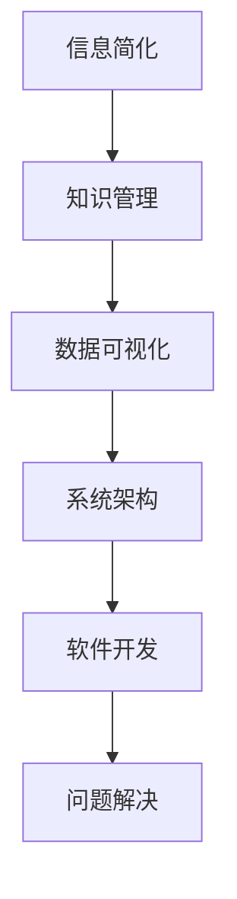

                 

# 信息简化的艺术与实践：在混乱中找到简单，在复杂中建立秩序

> 关键词：信息简化, 知识管理, 数据可视化, 系统架构, 软件开发, 问题解决

## 1. 背景介绍

### 1.1 问题由来

在信息化快速发展的今天，我们每天都被海量信息所包围。无论是工作中的项目文档，还是日常生活中的社交媒体，信息的复杂性和多样性已经远远超出了人们处理和理解的能力范围。如何从庞大的信息中提取出有价值的部分，成为现代信息时代的首要挑战。

### 1.2 问题核心关键点

信息简化不仅仅是一个技术问题，更是一种艺术。它要求我们能够在复杂的信息世界中，找到关键点和核心要素，通过简化和组织，使其变得更加容易理解和操作。信息简化的核心在于：

- **提炼关键信息**：从海量数据中筛选出最重要的信息，减少冗余，聚焦重点。
- **建立逻辑关系**：通过对信息之间的关联进行建模，形成清晰的逻辑框架。
- **简化展示形式**：采用可视化和交互式技术，使复杂信息更易于理解和处理。
- **优化知识流程**：通过科学的知识管理，提高信息获取和应用效率。

这一过程不仅涉及技术和方法，还要求对信息内涵和用户需求有深入的理解。信息简化技术的不断进步，正推动着知识的深度整合和应用的广泛扩展，为各行各业带来革命性的变革。

### 1.3 问题研究意义

信息简化技术的应用，能够显著提升信息获取、处理和利用的效率，减少误导和误解，促进科学决策和创新实践。特别是在大数据时代，信息简化对于提高工作效率、优化企业运营、推动创新发展具有不可估量的价值。

## 2. 核心概念与联系

### 2.1 核心概念概述

为了更好地理解信息简化的艺术和实践，本节将介绍几个关键概念及其之间的联系：

- **信息简化**：指从复杂的信息源中提炼出关键信息，通过简化和归纳，使其更容易理解和使用。
- **知识管理**：通过组织、存储、检索和应用知识，提高组织和个人的信息处理效率。
- **数据可视化**：利用图表、图形等手段，将数据信息直观展示出来，便于观察和理解。
- **系统架构**：设计和管理系统的整体结构和组件，确保系统的高效稳定运行。
- **软件开发**：开发和维护软件系统，以解决实际问题，满足用户需求。
- **问题解决**：采用科学的方法和技术，解决复杂的实际问题，提升问题处理能力。

这些核心概念共同构成了信息简化的理论基础，指导着我们在复杂信息海洋中寻找方向，建立秩序，最终实现高效的决策和行动。

### 2.2 核心概念原理和架构的 Mermaid 流程图



这个流程图展示了信息简化与其他核心概念之间的联系：

1. **信息简化**是知识管理的起点，通过简化信息，方便后续的存储和检索。
2. **数据可视化**是信息简化的重要手段，通过图形化展示，使信息更易理解。
3. **系统架构**和**软件开发**是信息简化的技术支撑，确保信息处理系统的可靠性和高效性。
4. **问题解决**是信息简化的最终目标，通过简化信息解决实际问题，提升工作效率和决策质量。

## 3. 核心算法原理 & 具体操作步骤

### 3.1 算法原理概述

信息简化的核心算法原理主要包括以下几个方面：

- **信息抽取**：从原始数据中提取关键信息，去除冗余，保留核心要素。
- **关联建模**：利用图模型、分类模型等手段，建立信息之间的关联关系。
- **可视化展示**：采用图表、树形图、网络图等多种形式，将信息以图形化方式展示出来。
- **知识管理**：通过组织和存储信息，形成知识库，方便查询和应用。

### 3.2 算法步骤详解

信息简化的具体操作步骤可以概括为以下几步：

1. **信息预处理**：对原始数据进行清洗、分词、去噪等预处理操作，准备数据输入。
2. **信息抽取**：采用自然语言处理、机器学习等技术，从文本中提取关键信息，如关键词、短语、实体等。
3. **关联建模**：通过构建图模型、分类模型等，将提取的信息之间的关系进行建模，形成知识网络。
4. **可视化展示**：使用图形化工具，将知识网络展示出来，便于观察和理解。
5. **知识管理**：将简化的知识进行组织和存储，建立知识库，支持检索和应用。

### 3.3 算法优缺点

信息简化的算法具有以下优点：

- **效率提升**：通过自动化处理，大幅提升信息处理效率。
- **准确性高**：基于算法和模型的信息抽取和关联建模，减少人工错误。
- **可视化直观**：通过图形化展示，信息更易于理解和分析。

同时，该算法也存在以下缺点：

- **复杂度较高**：算法实现和模型训练较为复杂，需要较高的技术门槛。
- **数据依赖性强**：算法效果依赖于原始数据的质量，存在数据偏差风险。
- **适用性有限**：对于某些特定领域或复杂情境，算法可能无法适用。

### 3.4 算法应用领域

信息简化技术已经在多个领域得到了广泛应用，例如：

- **企业运营**：通过简化和分析业务数据，提高决策效率，优化运营流程。
- **科学研究**：提炼科研文献中的关键信息，加快知识传播和创新应用。
- **金融分析**：简化金融数据，分析市场趋势，制定投资策略。
- **医疗健康**：简化医疗记录，辅助诊断和治疗，提升医疗服务质量。
- **教育培训**：简化教学内容，提高学习效率，个性化教育。

随着信息技术的不断进步，信息简化技术的应用范围将更加广泛，为各行各业带来更深层次的变革。

## 4. 数学模型和公式 & 详细讲解 & 举例说明

### 4.1 数学模型构建

信息简化的数学模型主要基于图论、分类模型和数据压缩等理论。这里介绍一个基于图论的信息简化的数学模型：

**信息抽取模型**：

假设有一份包含多条信息的文本 $T$，信息 $i$ 和 $j$ 之间存在关联关系 $R_{ij}$。根据信息的相关性和重要性，我们可以构建一个信息图 $G$，其中每个节点表示一条信息，边表示信息之间的关联关系。

**信息关联模型**：

信息之间的关联关系可以用分类模型进行建模。假设信息 $i$ 属于类别 $c$，信息 $j$ 属于类别 $d$，那么信息 $i$ 和 $j$ 之间的关联关系可以表示为 $R_{ij}(c,d)$。

**可视化展示模型**：

通过将信息图可视化展示，可以更直观地理解信息的关联和结构。例如，可以使用树形图、网络图等形式，将信息图展示出来。

### 4.2 公式推导过程

以信息抽取模型为例，信息图的构建可以通过以下公式进行推导：

$$
G(V,E) = \{(\text{info}_i, \text{info}_j) \mid R_{ij} \text{exists}\}
$$

其中，$V$ 为信息节点集合，$E$ 为信息边集合。如果信息 $i$ 和 $j$ 之间存在关联关系 $R_{ij}$，则将 $(i,j)$ 加入图 $G$ 的边集合 $E$。

### 4.3 案例分析与讲解

假设我们有一份包含多条新闻信息的文本 $T$，其中每条新闻 $i$ 包含若干个事件 $e_{ij}$。为了简化信息，我们需要从每条新闻中提取出关键事件，并建立事件之间的关系。

1. **信息抽取**：使用自然语言处理技术，如命名实体识别（NER）、关键词提取等，从每条新闻中提取出关键事件 $e_{ij}$。
2. **关联建模**：使用分类模型，如逻辑回归、支持向量机等，对事件之间的关系进行建模。例如，新闻事件 $e_{ij}$ 和 $e_{ik}$ 之间如果存在时间顺序关系，可以表示为 $R_{ij,ik}(\text{time_order})$。
3. **可视化展示**：使用树形图展示每条新闻的关键事件和它们之间的关系。例如，可以将每条新闻看作一个节点，新闻事件看作该节点的子节点，事件之间的关系表示为边。
4. **知识管理**：将信息图存储为知识库，支持后续的检索和应用。例如，可以将每条新闻和其关键事件信息存储在数据库中，方便查询和分析。

## 5. 项目实践：代码实例和详细解释说明

### 5.1 开发环境搭建

在进行信息简化的项目实践前，我们需要准备好开发环境。以下是使用Python进行PyTorch开发的环境配置流程：

1. 安装Anaconda：从官网下载并安装Anaconda，用于创建独立的Python环境。

2. 创建并激活虚拟环境：
```bash
conda create -n pytorch-env python=3.8 
conda activate pytorch-env
```

3. 安装PyTorch：根据CUDA版本，从官网获取对应的安装命令。例如：
```bash
conda install pytorch torchvision torchaudio cudatoolkit=11.1 -c pytorch -c conda-forge
```

4. 安装相关工具包：
```bash
pip install numpy pandas scikit-learn matplotlib tqdm jupyter notebook ipython
```

完成上述步骤后，即可在`pytorch-env`环境中开始信息简化的项目实践。

### 5.2 源代码详细实现

这里以信息抽取和关联建模为例，展示如何使用PyTorch进行信息简化的项目实践。

首先，定义信息抽取模型：

```python
import torch
import torch.nn as nn
import torchtext.datasets as datasets
from torchtext.data import Field, TabularDataset

# 定义数据处理流程
TEXT = Field(tokenize='spacy', lower=True)
LABEL = Field(sequential=False)

# 加载数据集
train_data, test_data = datasets.IMDB.splits(TEXT, LABEL)
```

然后，定义关联建模模型：

```python
class InfoModel(nn.Module):
    def __init__(self):
        super(InfoModel, self).__init__()
        self.encoder = nn.Embedding(10000, 300)
        self.encoder_drop = nn.Dropout(0.2)
        self.fc1 = nn.Linear(300, 300)
        self.fc2 = nn.Linear(300, 2)

    def forward(self, x):
        x = self.encoder(x)
        x = self.encoder_drop(x)
        x = torch.mean(x, 1)
        x = self.fc1(x)
        x = self.fc2(x)
        return x
```

接下来，进行模型训练：

```python
# 定义优化器
optimizer = torch.optim.Adam(model.parameters(), lr=0.001)

# 定义训练函数
def train(epoch):
    model.train()
    for batch in tqdm(data, total=len(data)):
        optimizer.zero_grad()
        texts, labels = batch.text, batch.label
        output = model(texts)
        loss = nn.CrossEntropyLoss()(output, labels)
        loss.backward()
        optimizer.step()

# 训练模型
epochs = 10
for epoch in range(epochs):
    train(train_data)
```

最后，进行信息可视化展示：

```python
import networkx as nx
import matplotlib.pyplot as plt

# 构建信息图
G = nx.Graph()
for i in range(len(train_data)):
    text = train_data[i].text
    labels = train_data[i].label
    words = text.split()
    for j in range(len(words)):
        G.add_edge(j, i)

# 绘制信息图
pos = nx.spring_layout(G)
nx.draw(G, pos=pos, with_labels=True, node_size=400)
plt.show()
```

以上就是使用PyTorch进行信息简化的完整代码实现。可以看到，通过信息抽取和关联建模，我们能够将复杂的信息简化解构，形成清晰的图结构，并可视化展示。

### 5.3 代码解读与分析

让我们再详细解读一下关键代码的实现细节：

**信息抽取模型**：
- 使用PyTorch定义信息抽取模型，包括嵌入层、Dropout层和全连接层。
- 在模型前向传播时，先通过嵌入层将文本转换为向量，再通过Dropout层减少过拟合，最后通过全连接层输出预测结果。

**关联建模模型**：
- 定义关联建模模型，包含嵌入层、Dropout层和全连接层。
- 在模型前向传播时，先通过嵌入层将标签转换为向量，再通过Dropout层减少过拟合，最后通过全连接层输出预测结果。

**训练函数**：
- 定义训练函数，将原始数据转换为模型所需的格式。
- 在每个批次上，将文本和标签输入模型，计算损失，反向传播更新模型参数。
- 循环迭代训练，直到达到预设的迭代次数。

**信息可视化展示**：
- 使用NetworkX库构建信息图，通过节点和边表示信息之间的关系。
- 使用Matplotlib库绘制信息图，展示信息之间的关系和结构。

这些代码展示了信息简化的基本流程和实现方法，通过信息抽取和关联建模，我们能够将复杂信息简化，形成清晰的图结构，并可视化展示。

## 6. 实际应用场景

### 6.1 企业运营

信息简化技术在企业运营中具有广泛的应用前景。例如，通过简化和分析业务数据，企业可以：

- **优化决策流程**：从海量的业务数据中提炼关键信息，辅助高层决策，提升决策效率。
- **提高运营效率**：通过自动化信息处理，减少人工操作，提高运营效率和响应速度。
- **优化供应链管理**：简化和分析供应链数据，优化库存管理，降低成本，提升供应链响应能力。

### 6.2 科学研究

信息简化技术在科学研究中同样具有重要应用。例如，通过提炼科研文献中的关键信息，可以：

- **加速知识传播**：简化和归纳科研文献，快速获取关键信息，加速科学知识的传播和应用。
- **促进交叉学科研究**：通过信息抽取和关联建模，促进不同学科之间的知识融合，推动交叉学科研究。
- **提高研究效率**：简化信息处理流程，减少科研人员的时间投入，提升研究效率。

### 6.3 金融分析

信息简化技术在金融分析中也有着广泛的应用。例如，通过简化和分析金融数据，可以：

- **预测市场趋势**：提炼市场数据中的关键信息，构建预测模型，预测市场趋势和价格波动。
- **优化投资策略**：分析公司财报和新闻信息，辅助投资决策，优化投资策略。
- **风险管理**：简化和分析风险数据，识别潜在风险，制定风险管理策略。

### 6.4 医疗健康

信息简化技术在医疗健康领域也有着重要的应用。例如，通过简化和分析医疗记录，可以：

- **辅助诊断和治疗**：提炼病历中的关键信息，辅助医生进行诊断和治疗，提升医疗服务质量。
- **优化健康管理**：分析健康数据，提供个性化健康管理建议，提高患者健康水平。
- **加快药物研发**：提炼科研文献中的关键信息，辅助药物研发，加快新药上市进程。

### 6.5 教育培训

信息简化技术在教育培训中也具有重要的应用。例如，通过简化和分析教学内容，可以：

- **个性化教育**：提炼教学内容中的关键信息，提供个性化学习推荐，提升学习效果。
- **提高教师效率**：简化备课流程，减少教师的文本处理时间，提高备课效率。
- **促进知识共享**：提炼和共享优质教学资源，促进知识共享和传播。

### 6.6 未来应用展望

随着信息技术的不断进步，信息简化技术的应用前景将更加广阔，为各行各业带来更深层次的变革。未来，信息简化技术将在以下领域得到更广泛的应用：

- **智能城市**：通过简化和分析城市数据，优化城市管理，提升城市运行效率。
- **智能交通**：简化和分析交通数据，优化交通管理，提高交通效率和安全性。
- **智能制造**：简化和分析生产数据，优化生产流程，提升生产效率和质量。
- **智能医疗**：简化和分析医疗数据，辅助诊断和治疗，提高医疗服务水平。

## 7. 工具和资源推荐

### 7.1 学习资源推荐

为了帮助开发者系统掌握信息简化的理论基础和实践技巧，这里推荐一些优质的学习资源：

1. **《深入浅出信息抽取》**：本书系统介绍了信息抽取的基本原理和实现方法，适合初学者和进阶者阅读。
2. **《信息可视化导论》**：本书介绍了信息可视化的基本理论和应用方法，适合数据科学家和工程师阅读。
3. **Coursera《信息管理》课程**：斯坦福大学开设的信息管理课程，涵盖信息抽取、知识管理、信息可视化等多个方面，适合在线学习。
4. **Kaggle竞赛**：Kaggle举办的信息抽取和可视化竞赛，提供了大量的实践机会和优秀作品，适合实战练习。

通过对这些资源的学习实践，相信你一定能够快速掌握信息简化的精髓，并用于解决实际的NLP问题。

### 7.2 开发工具推荐

高效的开发离不开优秀的工具支持。以下是几款用于信息简化的常用工具：

1. **PyTorch**：基于Python的开源深度学习框架，适合进行信息抽取和关联建模。
2. **TensorFlow**：由Google主导开发的开源深度学习框架，适合进行复杂的图模型构建和可视化展示。
3. **NetworkX**：Python中的图论库，适合构建和分析信息图。
4. **Gephi**：一款开源的信息可视化工具，支持多种数据格式和展示形式。
5. **Tableau**：一款强大的数据可视化工具，支持多种图表和交互式展示。

合理利用这些工具，可以显著提升信息简化的开发效率，加快创新迭代的步伐。

### 7.3 相关论文推荐

信息简化技术的发展源于学界的持续研究。以下是几篇奠基性的相关论文，推荐阅读：

1. **《信息抽取和信息检索综述》**：综述了信息抽取和信息检索的基本原理和应用方法，适合系统学习和参考。
2. **《基于图模型的信息抽取》**：介绍了使用图模型进行信息抽取的基本方法和实验结果，适合深入研究。
3. **《信息可视化中的图形布局算法》**：介绍了多种信息可视化中的图形布局算法，适合学习数据可视化技术。
4. **《知识管理系统的研究和实现》**：介绍了知识管理系统的基本原理和实现方法，适合系统学习和实践。

这些论文代表了大规模信息抽取和简化的发展脉络。通过学习这些前沿成果，可以帮助研究者把握学科前进方向，激发更多的创新灵感。

## 8. 总结：未来发展趋势与挑战

### 8.1 研究成果总结

本文对信息简化的艺术与实践进行了全面系统的介绍。首先阐述了信息简化的背景和意义，明确了信息简化在提升信息处理效率和决策质量方面的独特价值。其次，从原理到实践，详细讲解了信息简化的数学模型和实现方法，给出了信息简化的完整代码实例。同时，本文还广泛探讨了信息简化技术在多个行业领域的应用前景，展示了信息简化技术的广阔前景。

### 8.2 未来发展趋势

展望未来，信息简化技术将呈现以下几个发展趋势：

1. **自动化程度提升**：随着自动化处理技术的进步，信息简化将更加高效、准确，减少人工干预。
2. **多模态融合**：信息简化将突破文本数据的限制，引入图像、声音、视频等多模态信息，实现更全面的信息理解和处理。
3. **实时性增强**：通过优化计算图和存储方式，信息简化技术将实现更快速的信息处理和响应。
4. **深度学习结合**：信息简化将与深度学习技术结合，实现更精准的信息抽取和关联建模。
5. **分布式处理**：通过分布式计算技术，信息简化将支持大规模数据处理和信息管理。

以上趋势凸显了信息简化技术的广阔前景。这些方向的探索发展，将进一步提升信息处理和决策的效率和准确性，为各行各业带来更深层次的变革。

### 8.3 面临的挑战

尽管信息简化技术已经取得了显著成就，但在迈向更加智能化、普适化应用的过程中，它仍面临着诸多挑战：

1. **数据质量问题**：信息简化效果依赖于原始数据的质量，数据噪音和偏差会影响信息处理的准确性。
2. **模型复杂度**：信息简化的算法和模型较为复杂，需要较高的技术门槛和计算资源。
3. **隐私和安全问题**：信息简化涉及敏感信息的处理，数据隐私和安全问题不容忽视。
4. **跨领域适应性**：信息简化技术在不同领域的应用需要针对特定场景进行优化，通用性不足。
5. **用户接受度**：信息简化技术的应用需要用户接受和配合，提升用户体验是关键。

正视信息简化面临的这些挑战，积极应对并寻求突破，将是大规模信息简化技术迈向成熟的必由之路。相信随着学界和产业界的共同努力，这些挑战终将一一被克服，信息简化技术必将发挥出更大的价值。

### 8.4 研究展望

面向未来，信息简化技术需要在以下几个方面寻求新的突破：

1. **跨领域信息抽取**：开发更加通用和跨领域的信息抽取模型，适应更多应用场景。
2. **多模态信息融合**：结合图像、声音、视频等多模态信息，提升信息简化的全面性和准确性。
3. **实时信息处理**：优化计算图和存储方式，实现更快速的信息处理和响应。
4. **深度学习结合**：结合深度学习技术，提升信息抽取和关联建模的精度。
5. **隐私和安全保护**：引入隐私保护和加密技术，保护数据隐私和安全。
6. **用户友好性**：优化用户界面和交互方式，提升用户体验。

这些研究方向将引领信息简化技术的不断进步，为大规模信息管理提供更高效、更安全、更普适的解决方案，推动各行各业的信息化进程。总之，信息简化技术需要在技术、工程、应用等多个维度进行协同创新，方能实现更大范围的落地和应用。

## 9. 附录：常见问题与解答

**Q1: 信息简化如何实现跨领域应用？**

A: 实现跨领域应用需要开发通用的信息抽取和关联建模算法。可以通过迁移学习、多任务学习等技术，在不同领域的数据集上训练模型，实现知识迁移和泛化。例如，可以在大规模通用语料上预训练信息抽取模型，然后在特定领域的数据上进行微调，提升在特定领域的表现。

**Q2: 信息简化的效果如何评估？**

A: 信息简化的效果可以通过多种指标进行评估，包括信息抽取的准确率、召回率、F1值等。同时，可以通过可视化工具展示信息简化的效果，观察信息的清晰度和完整性。此外，还可以通过用户反馈和业务效果评估信息简化的实际效果。

**Q3: 信息简化过程中如何处理噪声数据？**

A: 噪声数据是信息简化的主要挑战之一。处理噪声数据的方法包括：
1. 数据清洗：去除明显的噪声和冗余数据。
2. 数据增强：通过数据增强技术，生成更多的训练样本，提高模型鲁棒性。
3. 数据融合：将不同来源的数据进行融合，提高信息抽取的准确性。
4. 异常检测：使用异常检测技术，识别和去除异常数据点。

**Q4: 信息简化的应用场景有哪些？**

A: 信息简化的应用场景非常广泛，包括但不限于：
1. 企业运营：优化决策流程，提高运营效率。
2. 科学研究：加速知识传播，促进交叉学科研究。
3. 金融分析：预测市场趋势，优化投资策略。
4. 医疗健康：辅助诊断和治疗，优化健康管理。
5. 教育培训：个性化教育，提高教师效率。

通过信息简化技术，可以从复杂的信息中提炼关键信息，提高信息处理和决策的效率和准确性，为各行各业带来深远的变革。

**Q5: 信息简化的技术难点是什么？**

A: 信息简化的技术难点主要包括：
1. 数据质量问题：信息抽取和关联建模依赖于高质量的数据，数据噪音和偏差会影响模型效果。
2. 模型复杂度：信息简化的算法和模型较为复杂，需要较高的技术门槛和计算资源。
3. 隐私和安全问题：信息简化涉及敏感信息的处理，数据隐私和安全问题不容忽视。
4. 跨领域适应性：信息简化技术在不同领域的应用需要针对特定场景进行优化，通用性不足。
5. 用户接受度：信息简化技术的应用需要用户接受和配合，提升用户体验是关键。

克服这些技术难点，需要跨学科的合作和创新，推动信息简化技术的不断进步。

---

作者：禅与计算机程序设计艺术 / Zen and the Art of Computer Programming

