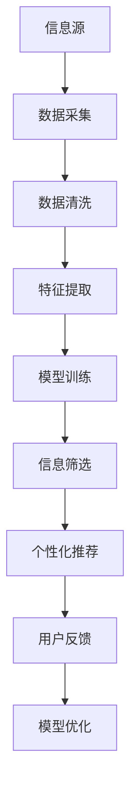

                 

# 信息过载与信息筛选策略与指南：在信息洪流中找到有价值的信息

> 关键词：信息过载, 信息筛选, 过滤算法, 个性化推荐, 深度学习, 自然语言处理, 大数据分析, 人工智能

## 1. 背景介绍

### 1.1 问题由来
在当今信息爆炸的时代，信息洪流正迅速淹没了我们。从新闻网站、社交媒体、电子邮件到在线论坛，各种信息源不断涌出，其中不乏有价值的内容，但也充满了噪音和垃圾信息。对于个人用户和企业组织来说，如何在这一信息海洋中找到有价值的信息，成为一项艰巨的挑战。

### 1.2 问题核心关键点
信息过载问题的核心在于如何有效筛选和过滤信息，确保我们只接收到对我们真正有用的内容。这一问题涉及以下几个关键点：
1. **数据量巨大**：互联网时代，信息总量呈指数级增长，单靠人工筛选几乎不可能。
2. **信息多样性**：信息来源多样化，格式各异，需要适应不同的数据类型和格式。
3. **实时性要求**：信息更新迅速，需要快速筛选并更新，保持信息的时效性。
4. **个性化需求**：不同用户和组织的需求各异，需要定制化筛选策略。
5. **技术挑战**：现有技术在处理大规模数据和多样性信息方面存在瓶颈。

### 1.3 问题研究意义
解决信息过载问题，有助于提高信息获取效率，减少信息噪音对决策的干扰，提升个人和企业的生产力。这一问题不仅是技术挑战，也涉及信息伦理、用户隐私保护等多方面，具有重要研究价值。

## 2. 核心概念与联系

### 2.1 核心概念概述

为更好地理解信息筛选技术，本节将介绍几个核心概念及其之间的联系：

- **信息过载（Information Overload）**：指个体或组织面临的信息量超出其处理能力，导致无法有效筛选和利用信息的现象。

- **信息筛选（Information Filtering）**：指从大量信息源中识别、提取和呈现相关信息的自动化过程，旨在提升信息获取的效率和质量。

- **过滤算法（Filtering Algorithms）**：用于识别和排除无用信息的算法，通常基于机器学习、自然语言处理等技术。

- **个性化推荐（Personalized Recommendation）**：通过分析用户行为和兴趣，为个体用户推荐可能感兴趣的信息，提升用户体验。

- **深度学习（Deep Learning）**：一种强大的机器学习技术，通过多层次的神经网络模型，从数据中学习复杂特征，适用于信息筛选和个性化推荐任务。

- **自然语言处理（Natural Language Processing, NLP）**：涉及计算机处理人类语言的技术，包括文本分类、情感分析、命名实体识别等，是信息筛选的重要组成部分。

- **大数据分析（Big Data Analytics）**：涉及大规模数据集的处理和分析，有助于发现信息中的模式和趋势，是信息筛选的强大支撑。

这些核心概念通过信息流向、处理过程等联系在一起，共同构成了信息筛选技术的理论基础。

### 2.2 核心概念原理和架构的 Mermaid 流程图



这个流程图展示了从信息源到个性化推荐的信息流向：

1. **信息源**：各种信息源，如新闻网站、社交媒体等。
2. **数据采集**：通过爬虫、API等技术手段，采集信息源中的数据。
3. **数据清洗**：去除噪声、冗余和错误数据，确保数据质量。
4. **特征提取**：从清洗后的数据中提取有意义的特征，为模型训练做准备。
5. **模型训练**：使用机器学习、深度学习等技术，训练信息筛选和个性化推荐模型。
6. **信息筛选**：对新信息进行实时筛选，排除无用信息，保留有用内容。
7. **个性化推荐**：根据用户历史行为和兴趣，推荐个性化信息。
8. **用户反馈**：收集用户对推荐结果的反馈，用于模型优化。
9. **模型优化**：根据用户反馈不断调整和优化模型，提升筛选和推荐效果。

这些步骤构成了一个循环，持续提升信息筛选和个性化推荐的效果。

## 3. 核心算法原理 & 具体操作步骤

### 3.1 算法原理概述

信息筛选和个性化推荐的核心算法原理主要基于以下几个方面：

- **机器学习与深度学习**：通过构建模型，学习数据的特征和模式，实现信息的自动筛选和推荐。
- **自然语言处理（NLP）**：通过文本分类、情感分析、实体识别等技术，提取和理解文本信息，提高信息筛选的准确性。
- **信息过滤算法**：包括内容过滤、协同过滤、混合过滤等技术，根据不同信息源的特点，选择适合的信息筛选方法。
- **个性化推荐算法**：基于协同过滤、基于内容的推荐、矩阵分解等技术，根据用户的历史行为和兴趣，推荐相关内容。

### 3.2 算法步骤详解

信息筛选和个性化推荐的算法步骤通常包括以下几个关键环节：

**Step 1: 数据采集与预处理**
- 从各种信息源（如新闻网站、社交媒体）爬取数据。
- 清洗和预处理数据，去除噪声、冗余和错误信息。

**Step 2: 特征提取与选择**
- 对预处理后的数据进行特征提取，如文本特征、用户特征、时间特征等。
- 选择合适的特征子集，使用特征选择算法提高筛选效果。

**Step 3: 模型训练与优化**
- 选择适合的算法（如TF-IDF、协同过滤、深度学习等），训练信息筛选模型。
- 使用交叉验证等技术评估模型性能，优化模型参数。

**Step 4: 信息筛选与个性化推荐**
- 对新信息进行实时筛选，使用训练好的模型识别有用信息。
- 根据用户的历史行为和兴趣，推荐个性化内容。

**Step 5: 用户反馈与模型迭代**
- 收集用户对推荐结果的反馈，评估推荐效果。
- 根据用户反馈不断调整和优化模型，提升筛选和推荐精度。

### 3.3 算法优缺点

信息筛选和个性化推荐算法具有以下优点：
1. 自动化：自动化筛选和推荐过程，节省大量人力成本。
2. 高效性：实时筛选和推荐，提升信息获取效率。
3. 个性化：根据用户兴趣和行为，提供定制化推荐。

但这些算法也存在一定的局限性：
1. 数据依赖：算法的性能高度依赖于数据的质量和量级。
2. 冷启动问题：新用户或新信息源的数据量不足，难以提供有效的筛选和推荐。
3. 动态变化：用户兴趣和信息内容的变化，需要模型及时更新。
4. 算法复杂性：一些算法（如深度学习）需要大量的计算资源和时间。
5. 公平性问题：推荐算法可能存在偏见，影响推荐结果的公平性。

尽管存在这些局限性，信息筛选和个性化推荐算法仍是大数据时代解决信息过载问题的有效手段。

### 3.4 算法应用领域

信息筛选和个性化推荐技术广泛应用于各个领域，包括但不限于：

- **电子商务**：推荐商品、广告投放、个性化搜索。
- **社交媒体**：推荐内容、好友推荐、社群发现。
- **新闻阅读**：推荐新闻、话题聚类、个性化订阅。
- **在线教育**：推荐课程、学习路径、个性化辅导。
- **金融服务**：推荐投资机会、个性化理财、风险评估。
- **医疗健康**：推荐医疗信息、健康咨询、个性化治疗。
- **企业服务**：推荐商业情报、市场分析、员工培训。

这些应用场景展示了信息筛选和个性化推荐技术的广泛影响力和实用价值。

## 4. 数学模型和公式 & 详细讲解

### 4.1 数学模型构建

信息筛选和个性化推荐的核心数学模型通常基于以下几个假设：

1. **用户-物品矩阵**：将用户和信息项视为矩阵中的元素，用户对信息项的评分作为矩阵值。
2. **稀疏矩阵**：用户和信息项的交互频率较低，矩阵中大部分元素为0。
3. **协同过滤**：通过分析用户和信息项的共同评分，推测用户对未评分项的评分。
4. **推荐系统目标**：最大化用户对推荐内容的满意度。

基于上述假设，我们构建以下数学模型：

**协同过滤算法**：

$$
\hat{y}_{ui} = \sum_{v \in V} \alpha_{uv} y_{vi}
$$

其中，$y_{ui}$ 为预测的用户对信息项的评分，$\alpha_{uv}$ 为隐向量$u$和$v$的相似度系数，$V$为用户集合。

**基于内容的推荐算法**：

$$
\hat{y}_{ui} = \sum_{j \in J} \alpha_{uj} x_{ij}
$$

其中，$x_{ij}$ 为信息项$j$的特征向量，$u$和$i$分别为用户和信息项的特征向量，$J$为特征集合。

### 4.2 公式推导过程

**协同过滤算法推导**：

1. **用户-物品矩阵**：构建用户-物品评分矩阵$Y$，其中$Y_{ui}$为用户$i$对信息项$u$的评分。
2. **相似度矩阵**：计算用户-用户和物品-物品的相似度，构建相似度矩阵$A$和$B$。
3. **隐向量分解**：对$A$和$B$进行奇异值分解，得到用户和信息项的隐向量表示。
4. **预测评分**：使用隐向量表示计算用户对信息项的预测评分$\hat{y}_{ui}$。

**基于内容的推荐算法推导**：

1. **特征矩阵**：构建信息项的特征矩阵$X$，其中$X_{ij}$为信息项$j$的特征。
2. **特征表示**：对用户和信息项的特征向量进行归一化，得到归一化特征向量$u$和$i$。
3. **预测评分**：计算用户对信息项的预测评分$\hat{y}_{ui}$，其中$\alpha_{uj}$为特征$u$和$j$的权重。

### 4.3 案例分析与讲解

以协同过滤算法为例，我们通过一个简单的案例来解释其工作原理：

假设我们有一个用户集合$U$和物品集合$V$，用户对物品的评分矩阵为$Y$，我们可以计算出用户-用户相似度矩阵$A$和物品-物品相似度矩阵$B$，然后对$A$和$B$进行奇异值分解，得到用户和物品的隐向量表示。最后，使用这些隐向量计算用户对新物品的预测评分$\hat{y}_{ui}$。

例如，假设用户$u$对物品$v$的评分未知，但已知用户$u_1$和物品$v_1$的评分和相似度。通过计算用户$u$和物品$v$的隐向量表示，可以推测用户$u$对物品$v$的评分$\hat{y}_{ui}$。

## 5. 项目实践：代码实例和详细解释说明

### 5.1 开发环境搭建

为了进行信息筛选和个性化推荐系统的开发，我们需要搭建一个支持深度学习和大数据处理的环境。以下是具体的搭建步骤：

1. 安装Python和相关依赖：

```bash
sudo apt-get install python3 python3-pip
pip3 install numpy pandas scikit-learn torch torchvision transformers
```

2. 安装GPU加速工具：

```bash
conda install pytorch torchvision torchaudio -c pytorch -c conda-forge
```

3. 安装数据处理和分析工具：

```bash
pip3 install beautifulsoup4 requests
```

4. 安装深度学习框架和库：

```bash
pip3 install tensorflow keras
```

5. 安装TensorBoard和Weights & Biases：

```bash
pip3 install tensorboard weights-bit
```

完成上述步骤后，即可搭建一个初步的开发环境，进行信息筛选和个性化推荐系统的开发。

### 5.2 源代码详细实现

下面以协同过滤算法为例，给出使用TensorFlow进行信息筛选的代码实现。

```python
import tensorflow as tf
import numpy as np
from sklearn.metrics import precision_recall_curve, roc_auc_score

# 数据加载和预处理
def load_data():
    # 从网站爬取数据，预处理成稀疏矩阵形式
    pass

# 特征提取和选择
def feature_extraction(data):
    # 提取文本特征，选择相关特征
    pass

# 协同过滤模型
def collaborative_filtering(data):
    # 构建用户-物品评分矩阵
    Y = np.array(data)
    # 构建用户-物品相似度矩阵
    A = np.dot(Y, Y.T)
    # 构建物品-物品相似度矩阵
    B = np.dot(Y.T, Y)
    # 对A和B进行奇异值分解
    U, S, V = np.linalg.svd(A.dot(B))
    # 计算用户和物品的隐向量表示
    u = np.dot(U, np.diag(S))
    v = np.dot(V, np.diag(S))
    # 计算用户对新物品的预测评分
    return u, v

# 模型训练与评估
def train_and_evaluate(u, v, data, test_data):
    # 训练协同过滤模型
    # 使用测试数据集评估模型性能
    pass

# 主函数
def main():
    # 加载数据
    data = load_data()
    # 特征提取和选择
    features = feature_extraction(data)
    # 训练和评估模型
    u, v = collaborative_filtering(features)
    train_and_evaluate(u, v, data, test_data)

if __name__ == "__main__":
    main()
```

### 5.3 代码解读与分析

上述代码实现了协同过滤算法的基本流程，具体步骤如下：

1. **数据加载与预处理**：从网站爬取数据，预处理成稀疏矩阵形式。
2. **特征提取与选择**：提取文本特征，选择相关特征。
3. **协同过滤模型**：构建用户-物品评分矩阵，计算用户和物品的隐向量表示，并计算用户对新物品的预测评分。
4. **模型训练与评估**：使用训练数据集训练模型，并使用测试数据集评估模型性能。

## 6. 实际应用场景

### 6.1 电子商务

电子商务平台面临海量商品信息，用户如何从中找到自己需要的商品成为难题。通过信息筛选和个性化推荐，用户可以更快地找到所需商品，提升购物体验。例如，亚马逊的推荐系统能够根据用户的浏览和购买历史，推荐相关商品。

### 6.2 新闻阅读

新闻网站面临海量新闻信息，用户如何从中获取感兴趣的内容成为难题。通过信息筛选和个性化推荐，用户可以更快地找到感兴趣的新闻，提升阅读体验。例如，谷歌新闻根据用户的历史阅读记录，推荐相关新闻。

### 6.3 在线教育

在线教育平台面临大量课程和教材信息，用户如何找到适合自己的课程成为难题。通过信息筛选和个性化推荐，用户可以更快地找到合适的课程，提升学习体验。例如，Coursera根据用户的课程学习历史，推荐相关课程。

### 6.4 金融服务

金融服务行业面临大量金融信息和市场数据，用户如何从中获取有价值的信息成为难题。通过信息筛选和个性化推荐，用户可以更快地获取有用的金融信息，提升决策效率。例如，金融信息服务网站根据用户的历史阅读记录，推荐相关财经新闻和分析报告。

### 6.5 医疗健康

医疗健康行业面临大量医学信息和病例数据，医生如何从中获取有用的信息成为难题。通过信息筛选和个性化推荐，医生可以更快地获取有用的医学信息，提升诊疗效率。例如，临床决策支持系统根据医生的历史诊疗记录，推荐相关医学文献和案例。

### 6.6 企业服务

企业服务行业面临大量商业信息和市场数据，企业如何从中获取有用的信息成为难题。通过信息筛选和个性化推荐，企业可以更快地获取有用的商业信息，提升决策效率。例如，B2B市场分析平台根据企业的历史交易记录，推荐相关市场分析和市场机会。

## 7. 工具和资源推荐

### 7.1 学习资源推荐

为了帮助开发者系统掌握信息筛选和个性化推荐技术的理论基础和实践技巧，这里推荐一些优质的学习资源：

1. **《推荐系统》书籍**：由Oren E. Reingold等作者所著，全面介绍了推荐系统的理论和实践，包括协同过滤、深度学习等推荐算法。
2. **Coursera推荐系统课程**：由斯坦福大学李飞飞教授等主讲，涵盖推荐系统的基本概念和前沿技术。
3. **Kaggle推荐系统竞赛**：通过参与推荐系统竞赛，实践推荐算法并获取反馈，提升算法能力。
4. **TensorFlow官方文档**：详细介绍了TensorFlow框架及其在推荐系统中的应用，是深度学习开发的必备资源。
5. **Weights & Biases官方文档**：提供了模型训练和实验跟踪工具的详细使用指南，帮助开发者记录和分析模型表现。

通过这些资源的学习和实践，相信你一定能够快速掌握信息筛选和个性化推荐技术的精髓，并用于解决实际的推荐问题。

### 7.2 开发工具推荐

信息筛选和个性化推荐系统的开发需要多种工具的支持。以下是几款常用的开发工具：

1. **Python**：作为数据科学和机器学习的主要编程语言，Python提供了丰富的库和框架，支持深度学习和大数据分析。
2. **TensorFlow**：由Google开发的开源深度学习框架，支持分布式训练和模型部署。
3. **PyTorch**：由Facebook开发的开源深度学习框架，支持动态图和动态计算图。
4. **Scikit-learn**：Python的数据挖掘和机器学习库，提供了许多经典的机器学习算法和工具。
5. **BeautifulSoup**：Python的HTML解析库，用于从网站爬取和处理数据。
6. **TensorBoard**：Google开发的可视化工具，用于实时监测模型训练状态和评估性能。
7. **Weights & Biases**：开源的模型训练和实验跟踪工具，帮助开发者记录和分析模型表现。

合理利用这些工具，可以显著提升信息筛选和个性化推荐系统的开发效率，加快创新迭代的步伐。

### 7.3 相关论文推荐

信息筛选和个性化推荐技术的发展源于学界的持续研究。以下是几篇奠基性的相关论文，推荐阅读：

1. **《协同过滤推荐系统》论文**：由S?ren Lind?g?和Catriel Hirst等作者所著，介绍了协同过滤推荐系统的基本原理和应用。
2. **《基于内容的推荐系统》论文**：由Riccardo Patu?和Yves Laperas等作者所著，介绍了基于内容的推荐系统的基本原理和应用。
3. **《深度学习推荐系统》论文**：由Jian Zhang和Christos Arıstidis等作者所著，介绍了深度学习在推荐系统中的应用和效果。
4. **《稀疏矩阵的协同过滤算法》论文**：由P. Radivojevi?和B. Nikoli?等作者所著，介绍了稀疏矩阵在协同过滤算法中的应用。
5. **《自然语言处理与推荐系统》论文**：由A. MikosAGer等作者所著，介绍了自然语言处理在推荐系统中的应用。

这些论文代表了大数据时代推荐系统的研究脉络，通过学习这些前沿成果，可以帮助研究者把握学科前进方向，激发更多的创新灵感。

## 8. 总结：未来发展趋势与挑战

### 8.1 总结

本文对信息筛选和个性化推荐技术进行了全面系统的介绍。首先阐述了信息过载问题的背景和意义，明确了筛选和推荐技术在提升信息获取效率、减少信息噪音方面的重要性。其次，从原理到实践，详细讲解了信息筛选和个性化推荐算法的核心步骤，给出了具体的代码实现和案例分析。同时，本文还广泛探讨了这些技术在多个领域的应用前景，展示了其广泛的实用价值。最后，本文精选了相关的学习资源和开发工具，力求为读者提供全方位的技术指引。

通过本文的系统梳理，可以看到，信息筛选和个性化推荐技术是大数据时代解决信息过载问题的有效手段，其应用前景广泛，涉及电子商务、新闻阅读、在线教育、金融服务、医疗健康、企业服务等众多领域。未来，伴随技术不断进步和算法不断创新，信息筛选和个性化推荐技术必将在更广泛的场景中发挥重要作用，进一步提升信息获取的效率和质量。

### 8.2 未来发展趋势

展望未来，信息筛选和个性化推荐技术将呈现以下几个发展趋势：

1. **深度学习的发展**：深度学习算法的不断优化，使得信息筛选和推荐模型更加精准高效。
2. **跨领域融合**：信息筛选和个性化推荐技术与自然语言处理、计算机视觉、语音识别等技术进行更深入的融合，提升整体系统性能。
3. **实时性和动态性**：信息筛选和推荐系统更加注重实时性和动态性，能够快速响应用户需求和数据变化。
4. **个性化推荐的多样化**：推荐算法更加注重个性化，能够根据不同用户的兴趣和行为，提供更加多样化的推荐内容。
5. **隐私保护和公平性**：信息筛选和推荐系统更加注重隐私保护和公平性，减少算法偏见和歧视。
6. **自动化和智能化**：信息筛选和推荐系统更加注重自动化和智能化，减少人工干预，提升系统决策效率。

这些趋势凸显了信息筛选和个性化推荐技术的广阔前景，这些方向的探索发展，必将进一步提升信息获取的效率和质量，为个人和企业的生产生活带来更大便利。

### 8.3 面临的挑战

尽管信息筛选和个性化推荐技术已经取得了显著成效，但在走向更智能化、普适化应用的过程中，仍面临以下挑战：

1. **数据隐私和安全**：信息筛选和推荐系统需要处理大量个人数据，如何保护用户隐私和安全成为一大难题。
2. **算法偏见和歧视**：推荐算法可能存在偏见，影响推荐结果的公平性，需要引入更多公平性指标。
3. **模型解释性和可解释性**：信息筛选和推荐系统通常是"黑盒"模型，缺乏解释性，需要进一步提高模型的可解释性。
4. **冷启动问题**：新用户或新信息源的数据量不足，难以提供有效的筛选和推荐。
5. **资源消耗**：信息筛选和推荐系统需要大量的计算资源和时间，如何优化模型结构、提高计算效率成为关键问题。
6. **动态变化**：用户兴趣和信息内容的变化，需要模型及时更新，如何处理动态数据成为难题。

正视这些挑战，积极应对并寻求突破，将使信息筛选和个性化推荐技术不断成熟和完善，为个人和企业的生产生活带来更大便利。

### 8.4 研究展望

面对信息筛选和个性化推荐技术所面临的挑战，未来的研究需要在以下几个方面寻求新的突破：

1. **隐私保护技术**：研究新的隐私保护技术，如差分隐私、联邦学习等，确保用户数据的安全性和隐私性。
2. **公平性算法**：引入公平性指标，如多样性、公平性、反歧视等，提升推荐算法的公平性。
3. **解释性增强**：开发新的模型解释技术，如因果推断、公平性分析等，提高推荐系统的解释性和可解释性。
4. **动态数据处理**：研究动态数据处理技术，如增量学习、在线学习等，确保推荐系统能够及时适应数据变化。
5. **自动化推荐**：研究自动化推荐技术，如基于知识图谱的推荐、因果推理等，提高推荐系统的自动化和智能化水平。

这些研究方向将推动信息筛选和个性化推荐技术向更智能、更公平、更安全的方向发展，为个人和企业的生产生活带来更大便利。面向未来，信息筛选和个性化推荐技术还需要与其他人工智能技术进行更深入的融合，如知识表示、因果推理、强化学习等，共同推动信息获取技术的进步。

## 9. 附录：常见问题与解答

**Q1：信息筛选和个性化推荐是否适用于所有领域？**

A: 信息筛选和个性化推荐技术在大多数领域都可以应用，但效果因领域特性而异。例如，医疗领域需要更注重隐私保护和医疗数据的质量，电子商务领域需要更注重实时性和个性化推荐效果。

**Q2：如何评估信息筛选和推荐模型的性能？**

A: 信息筛选和推荐模型的性能评估通常包括以下指标：准确率、召回率、F1分数、AUC值等。这些指标可以综合评估模型的推荐效果，并进行改进和优化。

**Q3：如何处理数据稀疏性问题？**

A: 数据稀疏性是信息筛选和推荐系统面临的常见问题。可以通过矩阵分解、协同过滤、基于内容的推荐等方法进行处理。例如，协同过滤算法可以通过用户和物品的相似度，推测新物品的评分。

**Q4：信息筛选和推荐系统的开发难点有哪些？**

A: 信息筛选和推荐系统的开发难点包括：数据采集、数据预处理、模型训练、模型部署等。其中，数据预处理和模型训练需要大量的计算资源和时间，如何优化模型结构和算法成为关键问题。

**Q5：信息筛选和推荐系统未来的发展方向是什么？**

A: 信息筛选和推荐系统的未来发展方向包括：深度学习的应用、跨领域融合、实时性和动态性、个性化推荐的多样化、隐私保护和公平性、自动化和智能化等。这些方向将推动技术不断进步，提升信息获取的效率和质量。

通过这些问题的解答，相信你对信息筛选和个性化推荐技术有了更全面的理解。面向未来，信息筛选和个性化推荐技术将不断创新和进步，为个人和企业的生产生活带来更大便利。

---

作者：禅与计算机程序设计艺术 / Zen and the Art of Computer Programming

