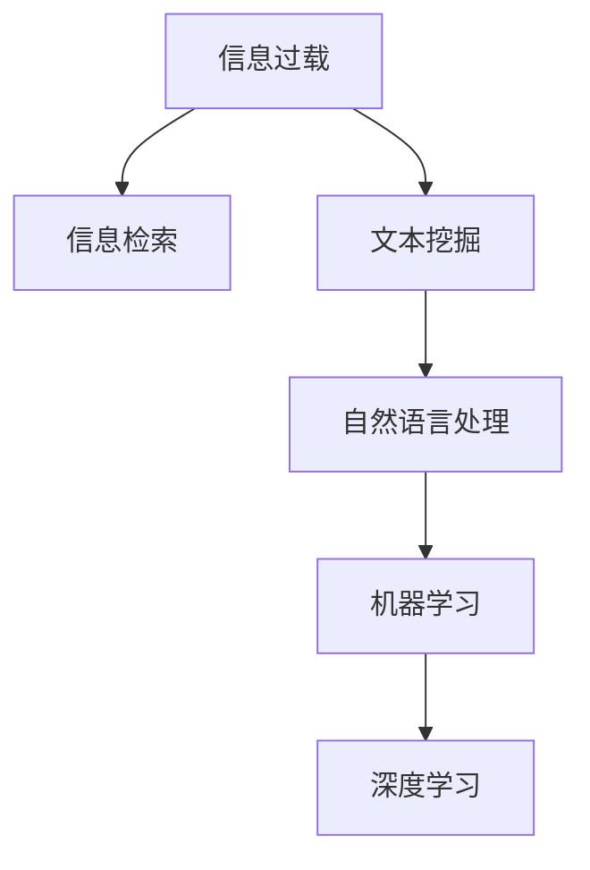

                 

# 信息过载与信息筛选：如何在信息洪流中找到有价值的信息

## 1. 背景介绍

### 1.1 问题由来
随着信息时代的到来，我们被海量信息包围。无论是社交媒体、新闻网站还是专业论坛，信息量的爆炸性增长给我们的生活和工作带来了巨大的挑战。如何从这些信息洪流中提取有价值的内容，成为了一个亟待解决的问题。

### 1.2 问题核心关键点
信息过载的核心在于如何从庞大的数据集中快速准确地找到并利用有用的信息。要解决这个问题，我们需要借助信息检索、文本挖掘、机器学习等技术手段，构建高效的信息筛选和过滤系统。

### 1.3 问题研究意义
解决信息过载问题对于提升个人和组织的信息获取效率、决策能力和竞争力具有重要意义。特别是在快节奏的商业环境和社会活动中，及时准确的信息获取可以显著提升工作质量和创新能力。同时，高效的信息筛选系统还能降低信息检索成本，节省时间和资源。

## 2. 核心概念与联系

### 2.1 核心概念概述

为更好地理解如何在信息洪流中找到有价值的信息，本节将介绍几个密切相关的核心概念：

- 信息过载(Information Overload)：指在信息时代，人们接受的信息量远远超过其处理能力，导致难以高效筛选有用信息的现象。
- 信息检索(Information Retrieval)：通过检索系统快速找到相关信息的工程和科学。主要分为基于关键词和基于语义的检索。
- 文本挖掘(Text Mining)：从大量文本数据中自动提取知识，包括主题分析、情感分析、实体识别等。
- 自然语言处理(Natural Language Processing, NLP)：处理和理解人类语言的技术，通过语言模型、语义分析等手段提升信息检索和文本挖掘的效果。
- 机器学习(Machine Learning)：让计算机从数据中自动学习模式，用于信息筛选、分类、聚类等任务。
- 深度学习(Deep Learning)：使用多层次的神经网络模型进行复杂任务，包括图像识别、语音处理、自然语言处理等。

这些核心概念之间的逻辑关系可以通过以下Mermaid流程图来展示：



这个流程图展示的信息检索和相关技术的关联：

1. 信息过载需要通过信息检索技术快速获取相关信息。
2. 信息检索依赖于文本挖掘技术，以抽取文本中的有用信息。
3. 文本挖掘离不开自然语言处理技术，以理解文本的语义。
4. 自然语言处理又依赖于机器学习和深度学习技术，以提取和处理语言中的模式和特征。

## 3. 核心算法原理 & 具体操作步骤
### 3.1 算法原理概述

信息检索与信息筛选的核心在于高效地从海量数据中提取出与用户查询相关的信息。这通常涉及到以下两个主要步骤：

1. 构建索引：将文本数据映射到高维向量空间，生成用于检索的索引结构。
2. 匹配检索：在索引空间中高效地检索与查询最相关的文本。

形式化地，假设查询为 $q$，索引为 $\mathcal{I}$，检索结果为 $R$。信息检索的目标是最大化查询 $q$ 与检索结果 $R$ 的相关性：

$$
R = \mathop{\arg\min}_{r \in \mathcal{I}} \text{dist}(q, r)
$$

其中 $\text{dist}(\cdot, \cdot)$ 为距离函数，用来衡量查询和文本之间的相似度。

### 3.2 算法步骤详解

信息检索和信息筛选的算法步骤通常包括：

**Step 1: 数据预处理**
- 收集需要检索的文本数据集 $D$，进行分词、去除停用词、词干提取等预处理。
- 对预处理后的文本进行索引，如倒排索引、向量索引等。

**Step 2: 构建查询向量**
- 根据用户输入的查询 $q$，进行分词和向量化处理，生成查询向量 $q_{vec}$。
- 可选地，使用自然语言处理技术，将查询向量转化为语义表示。

**Step 3: 相似度计算**
- 在预处理好的索引库 $\mathcal{I}$ 中，计算查询向量 $q_{vec}$ 与每个文本向量 $d_{vec}$ 的相似度。
- 可以使用余弦相似度、Jaccard相似度等方法进行相似度计算。

**Step 4: 排序和筛选**
- 对所有文本向量按照相似度排序，选择与查询最相关的文本。
- 根据排序结果，选择前 $k$ 个文本作为检索结果。

**Step 5: 后处理**
- 对检索结果进行过滤和展示，如去除重复文本、提供摘要等。

### 3.3 算法优缺点

信息检索和筛选算法具有以下优点：

1. 效率高：通过构建索引和向量索引，可以快速检索到相关文本，大大缩短了查询时间。
2. 准确性高：通过计算相似度并排序，能够精确地找到与查询最相关的文本。
3. 可扩展性强：对于大规模数据集，可以采用分布式计算和并行处理，提高处理能力。

同时，该算法也存在一定的局限性：

1. 依赖索引：索引的构建需要大量计算资源，且需要定期更新。
2. 结果依赖查询：检索结果的质量依赖于查询的准确性和完整性。
3. 处理动态信息困难：对于快速变化的信息，索引更新和维护困难。
4. 数据多样性挑战：不同类型的数据需要不同的处理方式，统一处理难度大。

尽管存在这些局限性，但就目前而言，信息检索和筛选算法仍是大规模信息管理的重要手段。未来相关研究的重点在于如何进一步提高检索效率和准确性，处理动态信息，扩展应用领域等。

### 3.4 算法应用领域

信息检索和筛选技术在众多领域得到了广泛应用，例如：

- 搜索引擎：如Google、Bing等，能够快速检索相关网页。
- 文档管理系统：如SharePoint、Confluence等，支持高效的文档检索和分类。
- 内容推荐系统：如Netflix、Amazon等，根据用户行为推荐个性化内容。
- 新闻聚合：如RSS、Feedly等，自动收集并展示相关新闻。
- 法律研究：如LexisNexis等，检索和分析法律文献。
- 科研管理：如ResearchGate等，快速查找相关科研论文。

除了上述这些经典应用外，信息检索和筛选技术还被创新性地应用到更多场景中，如电商平台、社交网络、学术交流等，为信息管理带来了全新的突破。

## 4. 数学模型和公式 & 详细讲解 & 举例说明
### 4.1 数学模型构建

本节将使用数学语言对信息检索和筛选的算法过程进行更加严格的刻画。

假设查询向量为 $q_{vec} \in \mathbb{R}^d$，文本向量为 $d_{vec} \in \mathbb{R}^d$，则文本 $d$ 与查询 $q$ 的余弦相似度定义为：

$$
\text{sim}(q, d) = \frac{q_{vec} \cdot d_{vec}}{\|q_{vec}\|\|d_{vec}\|}
$$

余弦相似度越高，表示查询和文本的相关性越强。在实际应用中，我们通常使用余弦相似度来衡量文本向量之间的相似度。

### 4.2 公式推导过程

以余弦相似度为例，推导其计算公式：

假设查询向量为 $q_{vec} = [q_1, q_2, ..., q_d]$，文本向量为 $d_{vec} = [d_1, d_2, ..., d_d]$，则查询和文本之间的余弦相似度为：

$$
\text{sim}(q, d) = \frac{q_{vec} \cdot d_{vec}}{\|q_{vec}\|\|d_{vec}\|} = \frac{\sum_{i=1}^d q_i d_i}{\sqrt{\sum_{i=1}^d q_i^2} \sqrt{\sum_{i=1}^d d_i^2}}
$$

上述公式中，分母是查询向量和文本向量的模长，保证相似度的范围在 $[-1, 1]$ 之间。

在实际应用中，计算余弦相似度时可以使用向量点乘、向量模长等快速计算，从而提高检索效率。

### 4.3 案例分析与讲解

考虑一个新闻网站的文本索引系统，用户在搜索框中输入关键词，如“人工智能”，系统需要快速检索相关新闻。假设索引中保存了新闻的关键词向量 $d_{vec}$，查询关键词“人工智能”被向量化为 $q_{vec}$。

1. **构建索引**：首先对所有新闻进行分词和向量化处理，生成新闻的关键词向量 $d_{vec}$，并保存在索引中。
2. **查询向量构建**：将查询关键词“人工智能”转化为向量 $q_{vec}$。
3. **相似度计算**：在索引中计算查询向量 $q_{vec}$ 与每个新闻向量 $d_{vec}$ 的余弦相似度。
4. **排序和筛选**：将新闻按照相似度排序，选择前 $k$ 条新闻作为检索结果。
5. **展示结果**：将排序后的新闻展示给用户。

这个过程展示了信息检索的基本原理和步骤，具体实现细节可以根据具体应用场景进行调整。

## 5. 项目实践：代码实例和详细解释说明
### 5.1 开发环境搭建

在进行信息检索和筛选实践前，我们需要准备好开发环境。以下是使用Python进行ElasticSearch开发的开发环境配置流程：

1. 安装Anaconda：从官网下载并安装Anaconda，用于创建独立的Python环境。
2. 创建并激活虚拟环境：
```bash
conda create -n search-env python=3.8
conda activate search-env
```
3. 安装ElasticSearch：根据系统平台，从官网下载并安装ElasticSearch，并在Linux系统上启动服务。
4. 安装Flask和Flask-SQLAlchemy：
```bash
pip install flask flask_sqlalchemy
```
5. 安装Flask-Pyodide：
```bash
pip install flask-pyodide
```

完成上述步骤后，即可在`search-env`环境中开始信息检索和筛选的开发。

### 5.2 源代码详细实现

这里我们以新闻文章检索为例，使用ElasticSearch构建新闻索引系统，并进行搜索操作。

首先，定义新闻数据模型和ElasticSearch索引：

```python
from flask_sqlalchemy import SQLAlchemy
from pyodide import pyodide

# 初始化Flask和SQLAlchemy
app = Flask(__name__)
app.config['SQLALCHEMY_DATABASE_URI'] = 'sqlite:///./news.db'
db = SQLAlchemy(app)

# 定义新闻数据模型
class News(db.Model):
    id = db.Column(db.Integer, primary_key=True)
    title = db.Column(db.String(255))
    content = db.Column(db.Text)
    date = db.Column(db.DateTime)

# 初始化ElasticSearch
es = pyodide.connection.ElasticSearch('localhost')
es.indices.create(index='news', body=ELASTIC_INDEX_CONFIG)
```

然后，将新闻数据保存到数据库中：

```python
# 从数据库中获取新闻数据
news_data = News.query.all()
news_docs = [doc.title + ' ' + doc.content for doc in news_data]

# 构建索引文档
bulk = []
for doc in news_docs:
    bulk.append({'index': {'_index': 'news', '_id': doc}})
    bulk.append({'title': doc, 'content': doc})

# 批量索引文档
es.bulk(bulk)
```

最后，实现新闻搜索功能：

```python
@app.route('/search')
def search():
    query = request.args.get('q')
    query = query.lower()
    result = es.search(index='news', body={
        "query": {
            "match": {"content": query}
        },
        "size": 10
    })
    articles = []
    for hit in result['hits']['hits']:
        articles.append(hit['_source'])
    return render_template('search.html', articles=articles)
```

以上就是使用Python和ElasticSearch进行新闻文章检索的完整代码实现。可以看到，ElasticSearch提供了强大的索引和搜索功能，使得信息检索过程变得高效便捷。

### 5.3 代码解读与分析

让我们再详细解读一下关键代码的实现细节：

**SQLAlchemy类和ElasticSearch连接**：
- `db.Model` 类定义了新闻数据模型，包含标题、内容和时间戳。
- `pyodide.connection.ElasticSearch` 类用于连接ElasticSearch，创建索引。

**数据导入和索引**：
- `bulk` 列表用于批量构建索引文档。
- `es.bulk(bulk)` 方法用于批量索引文档。

**查询处理**：
- 在 `/search` 路由中，获取查询字符串并转化为小写。
- `es.search` 方法用于构建查询，并返回搜索结果。
- `result['hits']['hits']` 包含搜索结果的详细数据。
- `hit['_source']` 提取搜索结果中的文章内容。

**展示结果**：
- 将搜索结果渲染为HTML页面，展示给用户。

可以看到，使用ElasticSearch进行新闻文章检索的代码实现相对简洁，主要利用了其强大的索引和搜索功能。在实际应用中，可以根据具体需求对代码进行扩展和优化，如增加分页、高亮、过滤等高级功能。

## 6. 实际应用场景
### 6.1 智能推荐系统

智能推荐系统通过分析用户行为和偏好，为用户推荐感兴趣的内容。信息检索和筛选技术在此过程中起到了关键作用。

例如，电商平台可以收集用户浏览、点击、购买等行为数据，将用户行为向量与商品特征向量进行相似度计算，从而推荐最相关的商品。这种推荐方式不仅可以提升用户体验，还能增加电商平台的销售额。

### 6.2 搜索引擎

搜索引擎通过用户输入的查询，快速检索相关网页。信息检索和筛选技术是其核心组件。

例如，谷歌搜索引擎通过构建倒排索引，快速检索与查询最相关的网页，并展示给用户。谷歌的PageRank算法也使用了相似度的概念，进一步优化了搜索结果的质量。

### 6.3 内容管理系统

内容管理系统（CMS）用于管理网站的内容，包括文章、图片、视频等。信息检索和筛选技术在此过程中提供了强大的搜索和分类功能。

例如，WordPress平台通过ElasticSearch等技术，实现了高效的搜索和分类功能，帮助用户快速找到所需的内容。

### 6.4 未来应用展望

未来，随着信息检索和筛选技术的不断发展，其在更多领域的应用前景将更加广阔：

1. 个性化医疗：通过分析患者的病历和症状，检索相关医疗文献，提供个性化的治疗方案。
2. 智能交通：通过分析交通数据，检索最优路线，提升交通管理效率。
3. 金融风控：通过分析交易数据，检索潜在风险，提前预警金融风险。
4. 社交网络：通过分析用户互动数据，检索相关内容，提升用户体验。
5. 安全监控：通过分析监控视频，检索异常行为，提高安全监控效果。

这些领域的深入应用，将使得信息检索和筛选技术成为现代社会不可或缺的基础设施。

## 7. 工具和资源推荐
### 7.1 学习资源推荐

为了帮助开发者系统掌握信息检索和筛选的理论基础和实践技巧，这里推荐一些优质的学习资源：

1. 《Information Retrieval》书籍：由Christopher Manning、Prabhakar Raghavan、Jeffrey K. L. Smith所著，系统介绍了信息检索的基本原理和算法。
2. 《Text Mining and Statistical Learning》书籍：由David P. hand、Ashley M. Eleven和Sulaiman Abdullah将文本挖掘与统计学习结合，提供全面的知识体系。
3. 《Natural Language Processing with Python》书籍：由Steven Bird、Ewan Klein和Edward Loper所著，介绍了使用Python进行NLP的详细实践。
4. CSR600《信息检索》课程：斯坦福大学开设的课程，介绍了信息检索的核心概念和经典算法。
5. Coursera《Introduction to Data Science in Python》课程：由Google开发者提供，涵盖数据处理、文本挖掘等基础技能。

通过对这些资源的学习实践，相信你一定能够快速掌握信息检索和筛选的精髓，并用于解决实际的NLP问题。

### 7.2 开发工具推荐

高效的开发离不开优秀的工具支持。以下是几款用于信息检索和筛选开发的常用工具：

1. Python：作为一种灵活的脚本语言，Python在信息检索和文本挖掘中得到了广泛应用。
2. ElasticSearch：基于Apache Lucene的分布式搜索引擎，提供了高效的索引和搜索功能。
3. Elasticsearch-Py：Python客户端库，用于连接ElasticSearch，支持复杂的搜索和聚合操作。
4. Flask：轻量级Web框架，用于构建基于Web的信息检索和筛选系统。
5. Pyodide：将Python解释器编译为WebAssembly，实现跨平台的高性能Web应用。

合理利用这些工具，可以显著提升信息检索和筛选任务的开发效率，加快创新迭代的步伐。

### 7.3 相关论文推荐

信息检索和筛选技术的发展源于学界的持续研究。以下是几篇奠基性的相关论文，推荐阅读：

1. Salton、McGill、Wing的《Information Retrieval》：这本书是信息检索领域的经典之作，介绍了许多基础概念和算法。
2. Marianne JPEG的《Text Mining: Concepts and Techniques》：介绍了文本挖掘的基本方法和技术，涵盖主题建模、情感分析、实体识别等。
3. Roberto Navigli、Stefano Wanner的《Learning from Data: A Pattern-Based Introduction》：介绍了通过数据学习模式的方法，包括文本挖掘和机器学习。
4. Vishal Chellappa、Michael Yang的《Model-Based Approaches to Information Retrieval》：介绍了基于模型的信息检索方法，包括机器学习、深度学习等。
5. Fei-Fei Li、Christian Burges的《Deep Learning for Computer Vision: A Review》：介绍了深度学习在图像处理中的应用，包括图像检索和分类。

这些论文代表了大语言模型微调技术的发展脉络。通过学习这些前沿成果，可以帮助研究者把握学科前进方向，激发更多的创新灵感。

## 8. 总结：未来发展趋势与挑战
### 8.1 总结

本文对信息检索和筛选技术进行了全面系统的介绍。首先阐述了信息过载问题的由来和重要性，明确了信息检索和筛选技术在解决信息过载问题中的独特价值。其次，从原理到实践，详细讲解了信息检索和筛选的数学模型和关键步骤，给出了信息检索任务开发的完整代码实例。同时，本文还广泛探讨了信息检索技术在多个领域的应用前景，展示了信息检索技术的巨大潜力。此外，本文精选了信息检索技术的各类学习资源，力求为读者提供全方位的技术指引。

通过本文的系统梳理，可以看到，信息检索和筛选技术正在成为信息管理的重要范式，极大地拓展了信息检索系统应用边界，催生了更多的落地场景。受益于大规模语料的预训练和深度学习的进步，信息检索系统能够在更高效、更准确地检索出相关信息，为信息管理带来了新的突破。未来，伴随深度学习、自然语言处理、分布式计算等技术的发展，信息检索技术还将不断进步，在更多领域发挥更大的作用。

### 8.2 未来发展趋势

展望未来，信息检索和筛选技术将呈现以下几个发展趋势：

1. 深度学习的应用：随着深度学习技术的发展，信息检索将越来越多地使用神经网络模型，提升检索精度和泛化能力。
2. 个性化和场景化：信息检索将根据用户行为和上下文环境，进行个性化和场景化推荐，提高用户体验。
3. 跨模态信息检索：结合图像、视频、语音等多种模态信息，提升检索系统的综合能力和覆盖范围。
4. 实时性和响应性：信息检索将越来越多地采用流式处理和实时计算，满足用户对信息即时性的需求。
5. 分布式和大数据：随着数据量的增长，信息检索将采用分布式计算和大数据技术，提升处理能力和效率。
6. 多语言和跨文化：信息检索将支持多语言和跨文化检索，拓展全球范围内的应用场景。

这些趋势凸显了信息检索和筛选技术的广阔前景。这些方向的探索发展，必将进一步提升信息检索系统的性能和应用范围，为信息管理带来新的突破。

### 8.3 面临的挑战

尽管信息检索和筛选技术已经取得了瞩目成就，但在迈向更加智能化、普适化应用的过程中，它仍面临着诸多挑战：

1. 标注成本瓶颈：对于非结构化数据，仍需依赖大量人工标注，成本较高。如何降低标注成本，提高标注效率，仍是重要课题。
2. 数据多样性和异构性：不同类型的数据需要不同的处理方式，统一处理难度大。如何处理多源异构数据，提高数据的融合和利用效率，还需要更多研究。
3. 实时性和计算效率：对于实时性要求较高的场景，如何优化算法和模型结构，提高处理效率，还需进一步优化。
4. 跨语言和文化适应性：跨语言和跨文化检索仍是挑战，如何构建全球化的信息检索系统，支持多语言文化，还需更多研究和实践。
5. 数据隐私和安全：信息检索系统涉及大量敏感数据，如何保护数据隐私和安全，防止数据泄露和滥用，还需加强数据保护措施。

这些挑战亟需解决，才能让信息检索技术在更多领域发挥其价值。相信随着学界和产业界的共同努力，这些挑战终将一一被克服，信息检索技术必将在构建智能信息管理系统中发挥更大作用。

### 8.4 研究展望

面对信息检索和筛选技术所面临的挑战，未来的研究需要在以下几个方面寻求新的突破：

1. 探索无监督和半监督信息检索方法：摆脱对大规模标注数据的依赖，利用自监督学习、主动学习等无监督和半监督范式，最大限度利用非结构化数据，实现更加灵活高效的信息检索。
2. 研究参数高效和计算高效的检索方法：开发更加参数高效的检索方法，在固定大部分检索参数的同时，只更新极少量的模型参数。同时优化检索模型的计算图，减少前向传播和反向传播的资源消耗，实现更加轻量级、实时性的部署。
3. 引入更多先验知识：将符号化的先验知识，如知识图谱、逻辑规则等，与检索模型进行巧妙融合，引导检索过程学习更准确、合理的语义模型。同时加强不同模态数据的整合，实现视觉、语音等多模态信息与文本信息的协同检索。
4. 结合因果分析和博弈论工具：将因果分析方法引入检索模型，识别出检索结果的关键特征，增强输出解释的因果性和逻辑性。借助博弈论工具刻画人机交互过程，主动探索并规避检索模型的脆弱点，提高系统稳定性。
5. 纳入伦理道德约束：在检索模型训练目标中引入伦理导向的评估指标，过滤和惩罚有害的输出倾向。同时加强人工干预和审核，建立模型行为的监管机制，确保输出符合人类价值观和伦理道德。

这些研究方向的探索，必将引领信息检索和筛选技术迈向更高的台阶，为构建智能信息管理系统和智能信息服务提供新的突破。面向未来，信息检索和筛选技术还需要与其他人工智能技术进行更深入的融合，如知识表示、因果推理、强化学习等，多路径协同发力，共同推动信息检索系统的进步。只有勇于创新、敢于突破，才能不断拓展信息检索和筛选的边界，让智能信息管理更好地服务于人类社会。

## 9. 附录：常见问题与解答

**Q1：信息检索和筛选的核心技术是什么？**

A: 信息检索和筛选的核心技术包括文本预处理、索引构建、查询匹配、结果排序和展示等。其中，文本预处理是将原始文本转换为计算机可处理的形式；索引构建是将文本转换为高维向量，生成用于检索的索引结构；查询匹配是通过计算相似度，找到与查询最相关的文本；结果排序是根据相似度排序，选择最相关的文本；展示结果是将排序后的文本展示给用户。

**Q2：如何提高信息检索系统的准确性？**

A: 提高信息检索系统的准确性可以从以下几个方面入手：
1. 提高文本预处理的质量，如分词、去除停用词、词干提取等。
2. 使用更好的索引算法和数据结构，如倒排索引、向量索引等。
3. 选择更合适的相似度计算方法，如余弦相似度、Jaccard相似度等。
4. 使用更好的排序算法，如Top-k排序、加权排序等。
5. 引入机器学习技术，如学习相似度函数、改进排序算法等。

**Q3：信息检索和筛选算法如何处理多源异构数据？**

A: 处理多源异构数据，需要设计统一的索引和检索框架，将不同类型的数据映射到统一的高维向量空间。可以使用跨媒体信息检索技术，结合图像、视频、语音等多种模态信息，提升检索系统的综合能力和覆盖范围。同时，可以使用多源数据融合技术，将不同来源的数据进行集成和分析，提高数据的利用效率。

**Q4：信息检索系统如何支持多语言文化检索？**

A: 支持多语言文化检索，需要设计多语言索引和查询模型，将不同语言的文本映射到统一的高维向量空间。可以使用语言模型、词嵌入等技术，将不同语言的文本转换为语义表示。同时，可以使用跨语言语料库和机器翻译技术，提高检索系统的跨语言能力。

**Q5：信息检索系统如何提高实时性？**

A: 提高信息检索系统的实时性，需要采用流式处理和实时计算技术，如实时索引、实时查询、实时排序等。可以使用分布式计算和大数据技术，提高处理能力和效率。同时，可以使用缓存技术，减少数据读取时间，提高检索速度。

通过本文的系统梳理，可以看到，信息检索和筛选技术正在成为信息管理的重要范式，极大地拓展了信息检索系统应用边界，催生了更多的落地场景。受益于大规模语料的预训练和深度学习的进步，信息检索系统能够在更高效、更准确地检索出相关信息，为信息管理带来了新的突破。未来，伴随深度学习、自然语言处理、分布式计算等技术的发展，信息检索技术还将不断进步，在更多领域发挥更大的作用。

---

作者：禅与计算机程序设计艺术 / Zen and the Art of Computer Programming

