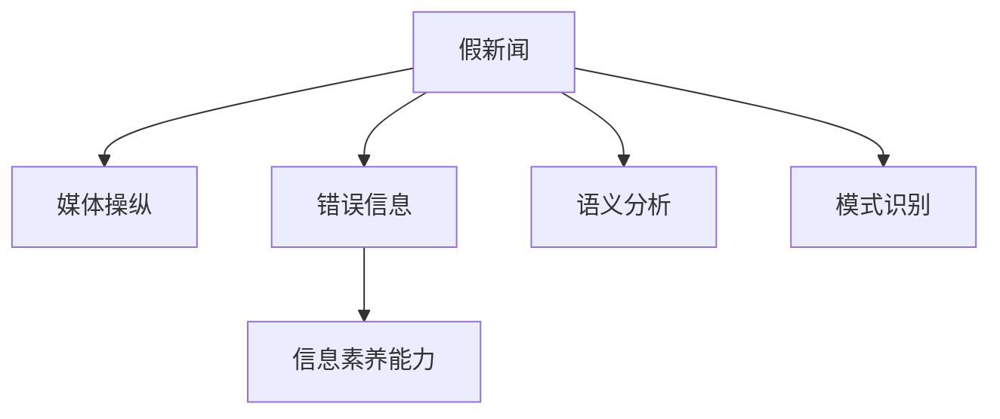

                 

# 信息验证和媒体素养能力：为假新闻、媒体操纵和错误信息做好准备

## 1. 背景介绍

### 1.1 问题由来
在当今信息爆炸的时代，假新闻、媒体操纵和错误信息的问题越来越严重。尤其是在社交媒体和互联网平台上，大量的虚假信息不断传播，误导公众，甚至影响社会稳定和政治选举。这不仅给个人的信息获取能力带来挑战，也对社会的信息素养和媒体教育提出了新的要求。

### 1.2 问题核心关键点
信息验证和媒体素养能力是应对假新闻和错误信息的核心。它涉及识别、评估、验证和处理信息的过程。关键点包括：
1. **识别虚假信息**：通过模式识别、语义分析等技术，检测和识别出可能的假新闻和误导性信息。
2. **验证信息的真实性**：使用交叉验证、数据溯源、事实检查等方法，确保信息的准确性和可靠性。
3. **媒体素养教育**：提高公众的信息理解能力和媒体批判性思维，增强抵御错误信息的能力。
4. **信息过滤和筛选**：通过算法推荐和人工审核等方式，过滤掉虚假和有害信息，保障信息的质量和安全。

### 1.3 问题研究意义
研究信息验证和媒体素养能力，对于提升社会的信息素养，减少假新闻和错误信息的传播，具有重要意义：

1. **提升公众信息素养**：帮助公众掌握基本的信息验证技能，提升其对信息真伪的判断能力。
2. **增强媒体责任意识**：促使媒体机构和从业人员提高信息真实性的意识，避免传播虚假信息。
3. **维护信息安全**：通过技术手段和政策措施，保障信息系统的安全稳定，防止信息被恶意篡改和操纵。
4. **推动社会进步**：提供真实可靠的信息来源，有助于科学决策和社会进步。

## 2. 核心概念与联系

### 2.1 核心概念概述

为更好地理解信息验证和媒体素养能力，本节将介绍几个密切相关的核心概念：

- **假新闻**：指通过不实报道、伪造图片、捏造数据等方式刻意制造和传播的虚假新闻。
- **媒体操纵**：指通过虚构报道、有偏报道等方式，故意误导公众，以达到特定目的。
- **错误信息**：指传播不准确、不完整或不全面的信息，导致公众对某一事件或现象的认知偏差。
- **信息素养能力**：指个人或机构获取、评估、验证和利用信息的能力。
- **语义分析**：指通过自然语言处理技术，分析和理解文本的语义信息。
- **模式识别**：指通过机器学习技术，从大量数据中识别出特定模式或规律。

这些核心概念之间的逻辑关系可以通过以下Mermaid流程图来展示：



这个流程图展示了几组概念之间的联系：

1. 假新闻和媒体操纵、错误信息之间存在关联。
2. 信息素养能力旨在提升个人或机构识别、验证和处理信息的能力。
3. 语义分析和模式识别是识别假新闻和错误信息的重要手段。

## 3. 核心算法原理 & 具体操作步骤
### 3.1 算法原理概述

信息验证和媒体素养能力涉及多个算法和技术手段，包括自然语言处理、机器学习、数据溯源等。其核心原理是通过对信息的文本分析、事实检查、模式识别等方法，提升信息的真实性和可靠性。

### 3.2 算法步骤详解

信息验证和媒体素养能力的一般步骤如下：

**Step 1: 数据收集与预处理**
- 收集待验证的信息源，如新闻文章、社交媒体帖子、论坛评论等。
- 对信息进行预处理，包括去除噪声、清洗无用信息、提取关键特征等。

**Step 2: 特征提取与模型训练**
- 使用自然语言处理技术，提取文本的关键词、实体、情感等信息。
- 构建训练数据集，标记真伪信息，进行模型训练。
- 常用的模型包括深度学习模型、规则模型、半监督学习模型等。

**Step 3: 信息验证与反馈**
- 应用训练好的模型，对新信息进行验证。
- 对验证结果进行人工审核，更新模型参数，提升模型准确性。
- 将验证结果反馈给信息源，进行更正或删除。

**Step 4: 教育与培训**
- 设计和实施信息素养教育课程，提高公众的媒体批判性思维和信息验证能力。
- 为媒体从业人员提供培训，提升其信息真实性的意识和技能。

**Step 5: 持续改进与优化**
- 定期评估模型性能，优化算法模型。
- 引入更多用户反馈，调整验证策略。

### 3.3 算法优缺点

信息验证和媒体素养能力的方法具有以下优点：
1. **提高信息真实性**：通过算法和人工审核相结合的方式，确保信息的准确性和可靠性。
2. **提升公众信息素养**：通过教育和培训，提高公众的信息判断和媒体批判性思维。
3. **实时性和效率高**：利用机器学习算法，可以快速处理大量信息，实现实时验证。

同时，该方法也存在一定的局限性：
1. **依赖高质量数据**：模型的训练和验证效果依赖于高质量的标注数据，数据的获取和处理成本较高。
2. **算法复杂性**：部分算法（如深度学习模型）需要较大的计算资源和数据量，模型复杂性较高。
3. **用户依赖性**：模型的效果依赖于用户对算法结果的信任和反馈，用户的理解和配合程度对效果有较大影响。
4. **潜在的偏见**：算法可能存在潜在的偏见，影响对信息的公正性判断。

尽管存在这些局限性，但就目前而言，信息验证和媒体素养能力的方法仍然是大规模信息处理和假新闻检测的重要手段。未来相关研究的重点在于如何进一步降低算法对数据和资源的依赖，提高算法的公正性和透明度，增强用户对算法的信任。

### 3.4 算法应用领域

信息验证和媒体素养能力的应用范围广泛，包括但不限于以下领域：

- **新闻业**：通过算法和人工审核相结合的方式，提升新闻真实性，防止假新闻和有偏报道。
- **社交媒体**：监控和过滤虚假信息，保障社交平台的信息质量。
- **政府和公共机构**：通过信息验证和事实检查，确保政策制定的数据真实性，防止虚假信息干扰决策。
- **教育**：提高学生的信息素养和媒体批判性思维，提升其信息获取和评估能力。
- **企业**：在企业内部和外部信息管理中，应用信息验证技术，确保信息的真实性和安全性。

这些领域的应用，体现了信息验证和媒体素养能力的重要性和广泛应用价值。

## 4. 数学模型和公式 & 详细讲解 & 举例说明

### 4.1 数学模型构建

假设有一篇待验证的新闻文章 $x$，我们的目标是构建一个二分类模型 $M$，判断文章是否为假新闻。模型的输入为文章文本 $x$，输出为假新闻的概率 $P(x)$。模型的目标是最小化预测错误的概率。

数学模型可以表示为：

$$
P(x) = \frac{1}{1+e^{-M(x)}}
$$

其中，$M(x)$ 为模型在文章 $x$ 上的输出，$e$ 为自然对数的底数。

### 4.2 公式推导过程

模型 $M$ 的训练目标是最小化交叉熵损失函数：

$$
L = -\frac{1}{N}\sum_{i=1}^N(y_i \log M(x_i) + (1-y_i) \log (1-M(x_i)))
$$

其中，$y_i$ 为文章 $x_i$ 的真实标签（0 表示真，1 表示假）。

利用链式法则，得到模型 $M$ 在文章 $x$ 上的梯度：

$$
\nabla_{\theta}L = -\frac{1}{N}\sum_{i=1}^N [y_i(1-M(x_i))\nabla_{\theta}M(x_i) + (1-y_i)M(x_i)\nabla_{\theta}M(x_i)]
$$

其中，$\theta$ 为模型参数，$\nabla_{\theta}M(x_i)$ 为 $M(x_i)$ 对参数 $\theta$ 的梯度。

### 4.3 案例分析与讲解

以情感分析为例，通过分析文章的情感倾向，来判断其是否可能包含虚假信息。情感分析通常使用词袋模型、TF-IDF 等方法提取文章特征，使用逻辑回归、支持向量机等模型进行分类。

具体步骤如下：

1. 收集大量标注好的文章数据集，分为正面、负面、中性三类。
2. 对文章进行预处理，提取关键词、情感词等特征。
3. 构建训练数据集，使用逻辑回归模型进行训练。
4. 应用训练好的模型，对新文章进行情感分析，判断其情感倾向。
5. 结合专家知识和数据特征，判断文章是否为假新闻。

## 5. 项目实践：代码实例和详细解释说明
### 5.1 开发环境搭建

在进行信息验证和媒体素养能力实践前，我们需要准备好开发环境。以下是使用Python进行TensorFlow开发的环境配置流程：

1. 安装Anaconda：从官网下载并安装Anaconda，用于创建独立的Python环境。

2. 创建并激活虚拟环境：
```bash
conda create -n tf-env python=3.8 
conda activate tf-env
```

3. 安装TensorFlow：根据CUDA版本，从官网获取对应的安装命令。例如：
```bash
conda install tensorflow -c pytorch -c conda-forge
```

4. 安装Flask：用于搭建Web应用，方便模型部署和调用。
```bash
pip install flask
```

5. 安装NLTK：用于自然语言处理任务，如分词、词性标注等。
```bash
pip install nltk
```

完成上述步骤后，即可在`tf-env`环境中开始信息验证和媒体素养能力实践。

### 5.2 源代码详细实现

这里我们以情感分析为例，给出使用TensorFlow对逻辑回归模型进行训练的Python代码实现。

```python
import tensorflow as tf
import numpy as np
import nltk
from nltk.corpus import movie_reviews
from sklearn.feature_extraction.text import CountVectorizer

# 定义情感分类器
def build_model():
    model = tf.keras.Sequential([
        tf.keras.layers.Dense(64, activation='relu', input_shape=(1000,)),
        tf.keras.layers.Dense(3, activation='softmax')
    ])
    return model

# 加载电影评论数据
movie_reviews.download()

positive_reviews = movie_reviews.raw(categories='pos')
negative_reviews = movie_reviews.raw(categories='neg')
neutral_reviews = movie_reviews.raw(categories='neu')

# 预处理文本数据
all_reviews = positive_reviews + negative_reviews + neutral_reviews
tokens = []
for review in all_reviews:
    tokens.append(review.split())

# 构建词袋模型
vectorizer = CountVectorizer(token_pattern=r'\b\w+\b', max_features=1000)
X = vectorizer.fit_transform(tokens)
y = np.array([1, 0, 0])

# 训练模型
model = build_model()
model.compile(optimizer='adam', loss='categorical_crossentropy', metrics=['accuracy'])
model.fit(X, y, epochs=10, batch_size=32)

# 评估模型
test_reviews = movie_reviews.raw(categories='neg')
test_tokens = [test_reviews.split()]
X_test = vectorizer.transform(test_tokens)
y_test = np.array([0])

model.evaluate(X_test, y_test)
```

以上就是使用TensorFlow对逻辑回归模型进行情感分析的完整代码实现。可以看到，通过NLTK和TensorFlow库，可以快速搭建和训练情感分类器。

### 5.3 代码解读与分析

让我们再详细解读一下关键代码的实现细节：

**build_model函数**：
- 定义一个包含两个Dense层的神经网络，用于情感分类。

**预处理文本数据**：
- 下载并加载电影评论数据集，合并正面、负面和中性评论。
- 对文本进行分词，构建词袋模型。

**训练模型**：
- 构建神经网络模型，使用交叉熵损失函数和准确率指标进行训练。
- 设置训练轮数和批次大小，开始训练模型。

**评估模型**：
- 使用测试集对模型进行评估，输出测试准确率。

可以看到，TensorFlow提供了灵活的模型搭建和训练方式，可以方便地实现各种自然语言处理任务。开发者可以根据具体需求，灵活调整模型的结构和参数。

## 6. 实际应用场景
### 6.1 智能新闻推荐

智能新闻推荐系统可以通过信息验证和媒体素养能力，提升新闻推荐的准确性和可靠性。

具体而言，可以构建一个基于逻辑回归或深度学习模型的新闻推荐系统，利用情感分析、关键词提取等技术，对用户的新闻阅读行为进行建模。同时应用信息验证技术，对新闻的情感倾向、可信度等进行判断，筛选出高质量新闻推荐给用户。

### 6.2 社交媒体监控

社交媒体监控系统可以通过信息验证和媒体素养能力，及时发现和处理虚假信息，保障社交平台的信息安全。

具体实现方式包括：
- 利用情感分析和文本分类技术，对社交媒体上的帖子进行分类。
- 通过模式识别和深度学习技术，识别出可能的假新闻和虚假信息。
- 对识别出的虚假信息进行标记和删除，防止其扩散。

### 6.3 信息治理和舆情分析

政府和公共机构可以通过信息验证和媒体素养能力，提升信息治理和舆情分析的效率和准确性。

具体应用方式包括：
- 构建信息验证系统，对政府发布的政策、公告等信息进行验证，确保信息的真实性和可靠性。
- 利用自然语言处理和机器学习技术，对公众舆情进行分析和预测，及时发现和处理虚假信息。
- 通过信息素养教育，提升公众的信息获取和判断能力，增强其对虚假信息的抵抗力。

### 6.4 未来应用展望

随着信息验证和媒体素养能力的不断发展，其在更多领域的应用前景广阔：

- **医疗健康**：在医疗信息中，应用信息验证技术，确保医疗信息的准确性和真实性。
- **金融财经**：在金融信息中，利用信息验证技术，防止虚假金融信息和市场操纵。
- **教育培训**：在教育信息中，提升信息素养教育和媒体批判性思维的普及和应用。
- **公共安全**：在公共信息中，确保网络安全和社会稳定，防止虚假信息的影响。

未来，随着技术的不断进步，信息验证和媒体素养能力将在更多领域发挥重要作用，成为维护信息安全和公共利益的重要手段。

## 7. 工具和资源推荐
### 7.1 学习资源推荐

为了帮助开发者系统掌握信息验证和媒体素养能力的技术基础和实践技巧，这里推荐一些优质的学习资源：

1. **《深度学习基础》系列博文**：由大模型技术专家撰写，深入浅出地介绍了深度学习基础和自然语言处理技术。
2. **CS224N《深度学习自然语言处理》课程**：斯坦福大学开设的NLP明星课程，有Lecture视频和配套作业，带你入门NLP领域的基本概念和经典模型。
3. **《自然语言处理综述》书籍**：涵盖了自然语言处理的多个方面，包括信息验证、情感分析、语义分析等技术。
4. **TensorFlow官方文档**：提供了TensorFlow框架的详细介绍和应用示例，适合快速上手和深度学习任务开发。
5. **Flask官方文档**：提供了Flask框架的详细说明和开发教程，方便搭建Web应用。

通过对这些资源的学习实践，相信你一定能够快速掌握信息验证和媒体素养能力的基本概念和实践技巧。

### 7.2 开发工具推荐

高效的开发离不开优秀的工具支持。以下是几款用于信息验证和媒体素养能力开发的常用工具：

1. **TensorFlow**：基于Python的开源深度学习框架，灵活的计算图和模型定义方式，适合各种深度学习任务。
2. **Flask**：轻量级Web框架，方便搭建API接口，方便模型的部署和调用。
3. **NLTK**：自然语言处理工具包，提供了分词、词性标注、情感分析等常用功能。
4. **Scikit-learn**：机器学习库，提供了各种分类、回归等算法，方便信息验证和媒体素养能力的实现。
5. **Jupyter Notebook**：交互式开发环境，支持Python、R等多种语言，方便代码的调试和实验。

合理利用这些工具，可以显著提升信息验证和媒体素养能力的开发效率，加快创新迭代的步伐。

### 7.3 相关论文推荐

信息验证和媒体素养能力的发展源于学界的持续研究。以下是几篇奠基性的相关论文，推荐阅读：

1. **"Using Natural Language Processing to Detect Fake News"**：介绍利用自然语言处理技术识别假新闻的方法和效果。
2. **"Fact-Checking via Machine Learning: An Overview of Recent Developments"**：概述了机器学习在事实检查中的进展和应用。
3. **"Bias and Fairness in Text Classification"**：讨论了文本分类中存在的偏见和公平性问题，提出了一些改进方法。
4. **"The Good, the Bad and the Truth: Teaching Machines to Tell Media apart from Misinformation"**：介绍了机器学习在媒体素养教育中的应用。
5. **"Fake News Detection using Natural Language Processing: A Survey"**：总结了当前假新闻检测的研究现状和未来趋势。

这些论文代表了信息验证和媒体素养能力的发展脉络。通过学习这些前沿成果，可以帮助研究者把握学科前进方向，激发更多的创新灵感。

## 8. 总结：未来发展趋势与挑战
### 8.1 总结

本文对信息验证和媒体素养能力进行了全面系统的介绍。首先阐述了信息验证和媒体素养能力的研究背景和意义，明确了其在识别和处理假新闻、媒体操纵和错误信息方面的独特价值。其次，从原理到实践，详细讲解了信息验证和媒体素养能力的基本步骤和算法，给出了信息验证和媒体素养能力的完整代码实例。同时，本文还广泛探讨了信息验证和媒体素养能力在多个行业领域的应用前景，展示了其广泛的应用价值。最后，本文精选了信息验证和媒体素养能力的各类学习资源，力求为读者提供全方位的技术指引。

通过本文的系统梳理，可以看到，信息验证和媒体素养能力在应对假新闻和错误信息传播方面，具有不可替代的重要作用。其在大规模信息处理和媒体素养教育中的应用，必将在未来社会的发展中发挥越来越重要的作用。

### 8.2 未来发展趋势

展望未来，信息验证和媒体素养能力将呈现以下几个发展趋势：

1. **自动化和智能化水平提升**：利用深度学习、自然语言处理等技术，提高信息验证和媒体素养能力的自动化和智能化水平，实现实时、高效的信息分析和筛选。
2. **多模态信息的融合**：将文本、图像、视频等多模态信息结合起来，提升信息验证和媒体素养能力的应用范围和效果。
3. **跨领域知识的应用**：将领域专家的知识与机器学习算法相结合，提高信息验证的公正性和可信度。
4. **用户反馈和互动**：引入用户反馈和互动机制，实时更新和优化信息验证模型，提高其适应性和效果。
5. **全球化应用推广**：将信息验证和媒体素养能力推广到全球，提升全球公众的信息素养，减少假新闻和错误信息的传播。

以上趋势凸显了信息验证和媒体素养能力的重要性和发展前景。这些方向的探索发展，必将进一步提升信息验证和媒体素养能力的效果，保障信息的安全性和可靠性。

### 8.3 面临的挑战

尽管信息验证和媒体素养能力已经取得了一定的进展，但在迈向更加智能化、普适化应用的过程中，它仍面临着诸多挑战：

1. **数据获取和处理难度大**：高质量的数据获取和处理是信息验证和媒体素养能力的核心，但实际应用中，数据获取成本较高，数据处理复杂。
2. **算法复杂性和资源消耗高**：深度学习等算法需要较大的计算资源和数据量，算法复杂性高，资源消耗大。
3. **用户依赖和接受度低**：用户对信息验证和媒体素养能力的接受度较低，依赖度也低，需要通过教育和培训提高用户信任。
4. **偏见和公平性问题**：算法可能存在潜在的偏见，影响对信息的公正性判断，公平性问题需要深入研究和解决。

尽管存在这些挑战，但随着技术的不断进步和应用的深入，信息验证和媒体素养能力必将在未来社会的发展中发挥更大的作用。研究者需要继续探索算法优化、资源优化和用户教育等方向，提高信息验证和媒体素养能力的效果和普及度。

### 8.4 研究展望

未来，研究信息验证和媒体素养能力需要进一步突破以下几个方向：

1. **深度学习和多模态信息融合**：结合深度学习和多模态信息融合技术，提升信息验证和媒体素养能力的自动化和智能化水平。
2. **领域知识和规则的应用**：将领域专家的知识与机器学习算法相结合，提高信息验证的公正性和可信度。
3. **用户反馈和互动机制**：引入用户反馈和互动机制，实时更新和优化信息验证模型，提高其适应性和效果。
4. **跨领域和全球化应用**：将信息验证和媒体素养能力推广到全球，提升全球公众的信息素养，减少假新闻和错误信息的传播。

这些研究方向将引领信息验证和媒体素养能力走向更高的台阶，为构建安全、可靠、可解释、可控的智能系统铺平道路。面向未来，信息验证和媒体素养能力的研究需要与其他人工智能技术进行更深入的融合，共同推动自然语言理解和智能交互系统的进步。只有勇于创新、敢于突破，才能不断拓展信息验证和媒体素养能力的边界，让智能技术更好地造福人类社会。

## 9. 附录：常见问题与解答
----------------------------------------------------------------

**Q1：信息验证和媒体素养能力是否适用于所有行业？**

A: 信息验证和媒体素养能力在多个行业领域都有广泛的应用前景，包括但不限于新闻业、社交媒体、政府和公共机构等。但对于一些特殊领域，如金融、医疗等，信息验证和媒体素养能力的实现需要更加专业的知识和技能。

**Q2：如何降低信息验证和媒体素养能力对标注数据的依赖？**

A: 降低信息验证和媒体素养能力对标注数据的依赖是未来研究的一个重要方向。可以通过以下方式：
1. 利用无监督学习、半监督学习等方法，减少对标注数据的依赖。
2. 引入领域专家知识，提升模型的公正性和准确性。
3. 利用文本生成技术，自动生成高质量的验证数据。

**Q3：信息验证和媒体素养能力如何提高模型的公正性和透明度？**

A: 提高模型的公正性和透明度是信息验证和媒体素养能力研究的重要目标。可以通过以下方式：
1. 引入多模态信息融合技术，提升模型的鲁棒性和公正性。
2. 利用因果分析和博弈论工具，识别和规避模型的脆弱点，提高系统稳定性。
3. 引入领域专家知识，提高模型的公正性和可信度。

**Q4：信息验证和媒体素养能力在实际应用中如何降低成本？**

A: 降低信息验证和媒体素养能力在实际应用中的成本，可以从以下几个方面入手：
1. 利用自动化和智能化技术，提高信息验证和媒体素养能力的自动化水平，减少人工干预。
2. 引入分布式计算和云服务，降低硬件和存储成本。
3. 通过优化算法和模型结构，降低计算资源消耗。

**Q5：信息验证和媒体素养能力在实际应用中如何提高效果？**

A: 提高信息验证和媒体素养能力在实际应用中的效果，可以从以下几个方面入手：
1. 结合领域知识和专家经验，提升模型的公正性和准确性。
2. 引入多模态信息融合技术，提升模型的鲁棒性和应用范围。
3. 利用用户反馈和互动机制，实时更新和优化模型，提高其适应性和效果。

通过以上问题的解答，相信你一定能够更好地理解信息验证和媒体素养能力的基本概念和实践技巧。只有不断探索和优化，才能让信息验证和媒体素养能力在更广泛的领域发挥更大的作用，保障信息的安全和可靠。

---

作者：禅与计算机程序设计艺术 / Zen and the Art of Computer Programming

