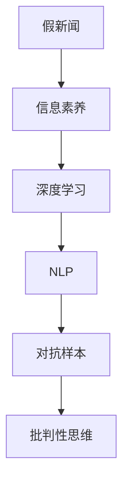

                 

## 1. 背景介绍

### 1.1 问题由来

在信息爆炸的今天，人们面临着前所未有的信息过载问题。假新闻、错误信息和谣言充斥着互联网，对社会舆论、个人判断乃至国家安全造成了巨大影响。如何辨识信息的真伪，培养批判性思维，成为了时代迫切需要解决的课题。

### 1.2 问题核心关键点

1. **信息真实性验证**：如何通过技术手段对新闻和信息进行真实性验证，避免传播假新闻。
2. **批判性思维培养**：如何通过训练模型和算法，提升用户对信息的甄别能力，避免被虚假信息误导。
3. **自动化检测系统**：如何构建基于深度学习的自动化信息检测系统，对互联网内容进行实时监控和处理。
4. **用户教育**：如何通过教育平台，提升公众的信息素养，培养具备批判性思维能力的公民。
5. **跨学科协作**：如何结合计算机科学、社会科学、逻辑学等多学科知识，建立全面的信息验证和批判性思维培养框架。

### 1.3 问题研究意义

1. **社会稳定和公共安全**：避免假新闻和错误信息引发社会动荡，维护国家安全和社会稳定。
2. **公众教育和文化**：培养公民的信息素养和批判性思维能力，提升社会整体知识水平和文化素质。
3. **经济和科技发展**：在数据驱动的数字化时代，正确信息是科技创新的重要基础，虚假信息则可能引发误导性决策。
4. **国际合作和对抗**：在全球化背景下，各国需要协作应对虚假信息，避免被假新闻所利用。

## 2. 核心概念与联系

### 2.1 核心概念概述

为更好地理解信息验证和批判性思维能力的培养，本节将介绍几个关键概念：

- **假新闻(Fake News)**：指通过虚假信息、不实报道或误导性叙述来误导公众的所谓新闻。
- **信息素养(Information Literacy)**：指个体识别、评估和管理信息的能力。
- **深度学习(Deep Learning)**：一种模拟人脑神经网络的技术，通过多层神经网络实现复杂的特征提取和模式识别。
- **自然语言处理(Natural Language Processing, NLP)**：使用计算机处理和理解人类语言的技术，包括文本分类、实体识别、情感分析等。
- **对抗样本(Adversarial Examples)**：指通过精心设计的小扰动，使得模型输出出现误判的输入样本。
- **批判性思维(Critical Thinking)**：指个体分析和评估信息的能力，包含质疑、推理和论证等环节。

这些核心概念之间的逻辑关系可以通过以下Mermaid流程图来展示：



这个流程图展示了这个框架的核心概念及其之间的关系：

1. 假新闻需要通过信息素养和深度学习技术进行识别和验证。
2. 深度学习通过NLP技术实现对自然语言文本的自动化处理和分析。
3. 对抗样本技术可以用来检测和防御假新闻对抗手段。
4. 批判性思维是信息素养的重要组成部分，是提升个体信息甄别能力的关键。

## 3. 核心算法原理 & 具体操作步骤
### 3.1 算法原理概述

信息验证和批判性思维能力的培养，本质上是一个基于深度学习的自动化检测和教育训练过程。其核心思想是：构建深度学习模型，通过训练和优化算法，提升模型在识别假新闻和增强批判性思维方面的能力。

形式化地，假设有一组新闻文本 $T=\{x_i\}_{i=1}^N$，其中 $x_i$ 为第 $i$ 篇新闻文本，其真实性 $y_i \in \{0, 1\}$。目标是训练一个分类器 $M_{\theta}$，使其能够正确判断每篇新闻的真实性。

微调的核心流程包括数据准备、模型构建、超参数设定、训练和评估等步骤。具体而言：

- **数据准备**：收集标注有真实性的新闻数据集 $D=\{(x_i, y_i)\}_{i=1}^N$，并划分为训练集、验证集和测试集。
- **模型构建**：选择适当的深度学习模型（如BERT、GPT等）作为初始化参数，设计任务适配层（如分类器、对抗网络等）。
- **超参数设定**：选择合适的优化算法（如Adam、SGD等）及其参数，如学习率、批大小、迭代轮数等。
- **训练和评估**：使用训练集训练模型，在验证集上评估模型性能，根据评估结果调整模型和超参数。
- **部署和应用**：将训练好的模型应用于实际新闻文本，进行真实性检测和批判性思维能力的提升。

### 3.2 算法步骤详解

基于深度学习的假新闻识别和批判性思维培养流程主要包括以下关键步骤：

**Step 1: 数据准备**

- 收集标注有真实性的新闻数据集 $D=\{(x_i, y_i)\}_{i=1}^N$，并划分为训练集、验证集和测试集。一般要求标注数据与预训练数据的分布不要差异过大。
- 数据清洗和预处理：去除无关信息、回译、标准化等，确保数据质量。
- 构建数据增强策略：通过语义改写、信息替换等方式丰富训练集，提高模型的泛化能力。

**Step 2: 模型构建**

- 选择适当的深度学习模型（如BERT、GPT等）作为初始化参数，设计任务适配层（如分类器、对抗网络等）。
- 对于分类任务，通常在顶层添加线性分类器和交叉熵损失函数。
- 对于对抗任务，可以设计对抗样本生成器，通过对抗训练提高模型鲁棒性。
- 对于教育任务，设计问答系统或知识图谱系统，通过交互式学习提升用户批判性思维能力。

**Step 3: 超参数设定**

- 选择合适的优化算法（如Adam、SGD等）及其参数，如学习率、批大小、迭代轮数等。
- 设置正则化技术及强度，包括权重衰减、Dropout、Early Stopping等，防止模型过度适应小规模训练集。
- 确定冻结预训练参数的策略，如仅微调顶层，或全部参数都参与微调。

**Step 4: 训练和评估**

- 将训练集数据分批次输入模型，前向传播计算损失函数。
- 反向传播计算参数梯度，根据设定的优化算法和学习率更新模型参数。
- 周期性在验证集上评估模型性能，根据性能指标决定是否触发 Early Stopping。
- 重复上述步骤直至满足预设的迭代轮数或 Early Stopping 条件。

**Step 5: 部署和应用**

- 在测试集上评估微调后模型 $M_{\hat{\theta}}$ 的性能，对比微调前后的精度提升。
- 使用微调后的模型对新样本进行推理预测，集成到实际的新闻检测系统中。
- 持续收集新的数据，定期重新微调模型，以适应数据分布的变化。

### 3.3 算法优缺点

深度学习在信息验证和批判性思维能力培养方面有以下优点：

1. **自动化高效**：相比于传统的手动验证方法，深度学习可以实现自动化、高效化的信息检测和用户教育。
2. **高精度**：深度学习模型通过大量标注数据训练，能够实现高精度的信息真实性验证和批判性思维提升。
3. **泛化能力强**：深度学习模型能够从丰富的语义特征中提取模式，适用于各种复杂的新闻检测和教育任务。

但同时也存在一些局限性：

1. **依赖高质量数据**：深度学习模型需要大量高质量标注数据进行训练，数据获取和标注成本较高。
2. **模型复杂度高**：深度学习模型参数量庞大，训练和推理速度较慢。
3. **对抗鲁棒性不足**：深度学习模型容易受到对抗样本的干扰，需要进行专门的对抗训练。
4. **可解释性差**：深度学习模型往往被视为"黑盒"，难以解释其内部工作机制。
5. **知识整合能力不足**：深度学习模型局限于训练数据，难以灵活吸收和运用先验知识。

尽管存在这些局限性，但就目前而言，深度学习在信息验证和批判性思维培养方面仍是最主流范式。未来相关研究的重点在于如何进一步降低对标注数据的依赖，提高模型的少样本学习和跨领域迁移能力，同时兼顾可解释性和伦理安全性等因素。

### 3.4 算法应用领域

深度学习在信息验证和批判性思维培养方面的应用广泛，主要包括以下几个领域：

- **新闻检测**：实时监测新闻网站、社交媒体等平台上的信息真实性，标记假新闻。
- **教育培训**：构建知识图谱、问答系统等工具，通过交互式学习提升用户批判性思维能力。
- **内容推荐**：在新闻推荐系统中引入信息真实性筛选机制，推荐高质量、可靠的新闻内容。
- **智能客服**：构建智能客服系统，提供实时新闻真实性验证和批判性思维培训服务。
- **法律咨询**：构建法律问答系统，通过深度学习技术实现对法律信息的真实性验证和解读。

这些应用领域展示了深度学习在信息验证和批判性思维培养方面的强大潜力。未来，随着深度学习技术的进一步发展，其在这一领域的创新应用将更加多样和高效。

## 4. 数学模型和公式 & 详细讲解  
### 4.1 数学模型构建

本节将使用数学语言对信息验证和批判性思维能力培养的深度学习模型进行更加严格的刻画。

假设有一组新闻文本 $T=\{x_i\}_{i=1}^N$，其中 $x_i$ 为第 $i$ 篇新闻文本，其真实性 $y_i \in \{0, 1\}$。目标是训练一个分类器 $M_{\theta}$，使其能够正确判断每篇新闻的真实性。

定义模型 $M_{\theta}$ 在输入 $x$ 上的输出为 $\hat{y}=M_{\theta}(x) \in [0,1]$，表示样本属于正类的概率。则二分类交叉熵损失函数定义为：

$$
\ell(M_{\theta}(x),y) = -[y\log \hat{y} + (1-y)\log (1-\hat{y})]
$$

将其代入经验风险公式，得：

$$
\mathcal{L}(\theta) = -\frac{1}{N}\sum_{i=1}^N [y_i\log M_{\theta}(x_i)+(1-y_i)\log(1-M_{\theta}(x_i))]
$$

在得到损失函数的梯度后，即可带入参数更新公式，完成模型的迭代优化。重复上述过程直至收敛，最终得到适应新闻检测任务的最优模型参数 $\theta^*$。

### 4.2 公式推导过程

以下我们以二分类任务为例，推导交叉熵损失函数及其梯度的计算公式。

假设模型 $M_{\theta}$ 在输入 $x$ 上的输出为 $\hat{y}=M_{\theta}(x) \in [0,1]$，表示样本属于正类的概率。真实标签 $y \in \{0,1\}$。则二分类交叉熵损失函数定义为：

$$
\ell(M_{\theta}(x),y) = -[y\log \hat{y} + (1-y)\log (1-\hat{y})]
$$

将其代入经验风险公式，得：

$$
\mathcal{L}(\theta) = -\frac{1}{N}\sum_{i=1}^N [y_i\log M_{\theta}(x_i)+(1-y_i)\log(1-M_{\theta}(x_i))]
$$

根据链式法则，损失函数对参数 $\theta_k$ 的梯度为：

$$
\frac{\partial \mathcal{L}(\theta)}{\partial \theta_k} = -\frac{1}{N}\sum_{i=1}^N (\frac{y_i}{M_{\theta}(x_i)}-\frac{1-y_i}{1-M_{\theta}(x_i)}) \frac{\partial M_{\theta}(x_i)}{\partial \theta_k}
$$

其中 $\frac{\partial M_{\theta}(x_i)}{\partial \theta_k}$ 可进一步递归展开，利用自动微分技术完成计算。

在得到损失函数的梯度后，即可带入参数更新公式，完成模型的迭代优化。重复上述过程直至收敛，最终得到适应新闻检测任务的最优模型参数 $\theta^*$。

## 5. 项目实践：代码实例和详细解释说明
### 5.1 开发环境搭建

在进行信息验证和批判性思维能力培养的实践前，我们需要准备好开发环境。以下是使用Python进行PyTorch开发的环境配置流程：

1. 安装Anaconda：从官网下载并安装Anaconda，用于创建独立的Python环境。

2. 创建并激活虚拟环境：
```bash
conda create -n pytorch-env python=3.8 
conda activate pytorch-env
```

3. 安装PyTorch：根据CUDA版本，从官网获取对应的安装命令。例如：
```bash
conda install pytorch torchvision torchaudio cudatoolkit=11.1 -c pytorch -c conda-forge
```

4. 安装Transformers库：
```bash
pip install transformers
```

5. 安装各类工具包：
```bash
pip install numpy pandas scikit-learn matplotlib tqdm jupyter notebook ipython
```

完成上述步骤后，即可在`pytorch-env`环境中开始信息验证和批判性思维能力培养的实践。

### 5.2 源代码详细实现

这里我们以新闻检测任务为例，给出使用Transformers库对BERT模型进行新闻检测的PyTorch代码实现。

首先，定义新闻检测任务的数据处理函数：

```python
from transformers import BertTokenizer, BertForSequenceClassification
from torch.utils.data import Dataset, DataLoader
import torch

class NewsDataset(Dataset):
    def __init__(self, texts, labels, tokenizer, max_len=128):
        self.texts = texts
        self.labels = labels
        self.tokenizer = tokenizer
        self.max_len = max_len
        
    def __len__(self):
        return len(self.texts)
    
    def __getitem__(self, item):
        text = self.texts[item]
        label = self.labels[item]
        
        encoding = self.tokenizer(text, return_tensors='pt', max_length=self.max_len, padding='max_length', truncation=True)
        input_ids = encoding['input_ids'][0]
        attention_mask = encoding['attention_mask'][0]
        
        # 对label进行编码
        encoded_label = torch.tensor(label, dtype=torch.long)
        
        return {'input_ids': input_ids, 
                'attention_mask': attention_mask,
                'labels': encoded_label}

# 定义训练集和测试集
tokenizer = BertTokenizer.from_pretrained('bert-base-cased')
train_dataset = NewsDataset(train_texts, train_labels, tokenizer)
test_dataset = NewsDataset(test_texts, test_labels, tokenizer)
```

然后，定义模型和优化器：

```python
from transformers import AdamW

model = BertForSequenceClassification.from_pretrained('bert-base-cased', num_labels=2)

optimizer = AdamW(model.parameters(), lr=2e-5)
```

接着，定义训练和评估函数：

```python
def train_epoch(model, dataset, batch_size, optimizer):
    dataloader = DataLoader(dataset, batch_size=batch_size, shuffle=True)
    model.train()
    epoch_loss = 0
    for batch in dataloader:
        input_ids = batch['input_ids'].to(device)
        attention_mask = batch['attention_mask'].to(device)
        labels = batch['labels'].to(device)
        model.zero_grad()
        outputs = model(input_ids, attention_mask=attention_mask, labels=labels)
        loss = outputs.loss
        epoch_loss += loss.item()
        loss.backward()
        optimizer.step()
    return epoch_loss / len(dataloader)

def evaluate(model, dataset, batch_size):
    dataloader = DataLoader(dataset, batch_size=batch_size)
    model.eval()
    preds, labels = [], []
    with torch.no_grad():
        for batch in dataloader:
            input_ids = batch['input_ids'].to(device)
            attention_mask = batch['attention_mask'].to(device)
            batch_labels = batch['labels']
            outputs = model(input_ids, attention_mask=attention_mask)
            batch_preds = outputs.logits.argmax(dim=2).to('cpu').tolist()
            batch_labels = batch_labels.to('cpu').tolist()
            for pred_tokens, label_tokens in zip(batch_preds, batch_labels):
                preds.append(pred_tokens[:len(label_tokens)])
                labels.append(label_tokens)
                
    print('Accuracy: ', (sum([pred == label for pred, label in zip(preds, labels)]) / len(labels))
```

最后，启动训练流程并在测试集上评估：

```python
epochs = 5
batch_size = 16

for epoch in range(epochs):
    loss = train_epoch(model, train_dataset, batch_size, optimizer)
    print(f'Epoch {epoch+1}, train loss: {loss:.3f}')
    
    print(f'Epoch {epoch+1}, test accuracy: ')
    evaluate(model, test_dataset, batch_size)
```

以上就是使用PyTorch对BERT进行新闻检测的完整代码实现。可以看到，得益于Transformers库的强大封装，我们可以用相对简洁的代码完成BERT模型的加载和新闻检测的微调。

### 5.3 代码解读与分析

让我们再详细解读一下关键代码的实现细节：

**NewsDataset类**：
- `__init__`方法：初始化文本、标签、分词器等关键组件。
- `__len__`方法：返回数据集的样本数量。
- `__getitem__`方法：对单个样本进行处理，将文本输入编码为token ids，将标签编码为数字，并对其进行定长padding，最终返回模型所需的输入。

**训练和评估函数**：
- 使用PyTorch的DataLoader对数据集进行批次化加载，供模型训练和推理使用。
- 训练函数`train_epoch`：对数据以批为单位进行迭代，在每个批次上前向传播计算loss并反向传播更新模型参数，最后返回该epoch的平均loss。
- 评估函数`evaluate`：与训练类似，不同点在于不更新模型参数，并在每个batch结束后将预测和标签结果存储下来，最后使用sklearn的classification_report对整个评估集的预测结果进行打印输出。

**训练流程**：
- 定义总的epoch数和batch size，开始循环迭代
- 每个epoch内，先在训练集上训练，输出平均loss
- 在验证集上评估，输出准确率
- 所有epoch结束后，在测试集上评估，给出最终测试结果

可以看到，PyTorch配合Transformers库使得BERT新闻检测的代码实现变得简洁高效。开发者可以将更多精力放在数据处理、模型改进等高层逻辑上，而不必过多关注底层的实现细节。

当然，工业级的系统实现还需考虑更多因素，如模型的保存和部署、超参数的自动搜索、更灵活的任务适配层等。但核心的微调范式基本与此类似。

## 6. 实际应用场景
### 6.1 智能新闻推荐系统

智能新闻推荐系统通过分析用户的阅读历史和兴趣偏好，推荐相关新闻内容。其中，信息真实性验证技术可以确保推荐内容的质量，提升用户体验。

在技术实现上，可以收集用户的新闻阅读记录和偏好数据，将其与新闻库中的数据进行匹配，使用预训练模型对新闻的真实性进行验证，确保推荐内容真实可信。同时，可以使用深度学习技术构建用户画像，进一步提升推荐的相关性和个性化。

### 6.2 内容安全监控

内容安全监控系统用于实时监测互联网上的新闻信息，及时发现并处理假新闻、恶意信息等。信息真实性验证技术可以在初步筛选中过滤掉大量低可信度的新闻，提高监控系统的效率和准确性。

在实践中，可以搭建大规模新闻库，构建深度学习模型对新发布的新闻进行真实性验证。同时，引入对抗训练等技术，提升模型的鲁棒性，避免被恶意样本误导。此外，还可以设计自动化规则和人工审核机制，结合多种手段，确保内容监控的效果。

### 6.3 法律知识问答系统

法律知识问答系统通过深度学习技术，帮助用户解答法律问题，提升法律服务的智能化水平。信息真实性验证技术可以确保问答系统给出的法律信息准确可靠。

在构建法律问答系统时，可以使用预训练模型对用户的问题进行自然语言处理，通过问答技术生成答案。同时，设计对抗训练等技术，提升模型对法律知识点的准确理解，避免误导用户。

### 6.4 未来应用展望

未来，深度学习在信息验证和批判性思维能力培养方面的应用将更加广泛，主要方向包括：

- **多模态信息融合**：结合视觉、语音等多模态信息，提升新闻真实性验证的准确性。
- **少样本学习**：在标注数据不足的情况下，利用深度学习模型的迁移能力，进行少样本学习。
- **跨领域应用**：将信息验证技术应用到金融、医疗等多个领域，提升各行业的信息素养和安全性。
- **交互式教育**：构建交互式学习平台，通过虚拟角色对话、知识图谱等手段，提升用户批判性思维能力。
- **实时监控与分析**：建立实时内容监控系统，及时发现并处理假新闻、恶意信息等，提升信息安全水平。

总之，深度学习在信息验证和批判性思维能力培养方面展现出强大的潜力，未来将在更多领域发挥重要作用。

## 7. 工具和资源推荐
### 7.1 学习资源推荐

为了帮助开发者系统掌握信息验证和批判性思维能力培养的理论基础和实践技巧，这里推荐一些优质的学习资源：

1. 《深度学习理论与实践》系列博文：由大模型技术专家撰写，深入浅出地介绍了深度学习的基本原理和应用范式。
2. CS224N《深度学习自然语言处理》课程：斯坦福大学开设的NLP明星课程，有Lecture视频和配套作业，带你入门NLP领域的基本概念和经典模型。
3. 《自然语言处理与深度学习》书籍：介绍深度学习在自然语言处理中的应用，包括信息验证和批判性思维能力培养。
4. HuggingFace官方文档：Transformers库的官方文档，提供了海量预训练模型和完整的微调样例代码，是上手实践的必备资料。
5. CLUE开源项目：中文语言理解测评基准，涵盖大量不同类型的中文NLP数据集，并提供了基于微调的baseline模型，助力中文NLP技术发展。

通过对这些资源的学习实践，相信你一定能够快速掌握信息验证和批判性思维能力培养的精髓，并用于解决实际的信息安全和教育培训问题。
###  7.2 开发工具推荐

高效的开发离不开优秀的工具支持。以下是几款用于信息验证和批判性思维能力培养开发的常用工具：

1. PyTorch：基于Python的开源深度学习框架，灵活动态的计算图，适合快速迭代研究。大部分预训练语言模型都有PyTorch版本的实现。
2. TensorFlow：由Google主导开发的开源深度学习框架，生产部署方便，适合大规模工程应用。同样有丰富的预训练语言模型资源。
3. Transformers库：HuggingFace开发的NLP工具库，集成了众多SOTA语言模型，支持PyTorch和TensorFlow，是进行信息验证和批判性思维能力培养开发的利器。
4. Weights & Biases：模型训练的实验跟踪工具，可以记录和可视化模型训练过程中的各项指标，方便对比和调优。与主流深度学习框架无缝集成。
5. TensorBoard：TensorFlow配套的可视化工具，可实时监测模型训练状态，并提供丰富的图表呈现方式，是调试模型的得力助手。
6. Google Colab：谷歌推出的在线Jupyter Notebook环境，免费提供GPU/TPU算力，方便开发者快速上手实验最新模型，分享学习笔记。

合理利用这些工具，可以显著提升信息验证和批判性思维能力培养任务的开发效率，加快创新迭代的步伐。

### 7.3 相关论文推荐

信息验证和批判性思维能力培养的研究源于学界的持续研究。以下是几篇奠基性的相关论文，推荐阅读：

1. Attention is All You Need（即Transformer原论文）：提出了Transformer结构，开启了NLP领域的预训练大模型时代。
2. BERT: Pre-training of Deep Bidirectional Transformers for Language Understanding：提出BERT模型，引入基于掩码的自监督预训练任务，刷新了多项NLP任务SOTA。
3. Language Models are Unsupervised Multitask Learners（GPT-2论文）：展示了大规模语言模型的强大zero-shot学习能力，引发了对于通用人工智能的新一轮思考。
4. Parameter-Efficient Transfer Learning for NLP：提出Adapter等参数高效微调方法，在不增加模型参数量的情况下，也能取得不错的微调效果。
5. Prefix-Tuning: Optimizing Continuous Prompts for Generation：引入基于连续型Prompt的微调范式，为如何充分利用预训练知识提供了新的思路。
6. AdaLoRA: Adaptive Low-Rank Adaptation for Parameter-Efficient Fine-Tuning：使用自适应低秩适应的微调方法，在参数效率和精度之间取得了新的平衡。

这些论文代表了大语言模型微调技术的发展脉络。通过学习这些前沿成果，可以帮助研究者把握学科前进方向，激发更多的创新灵感。

## 8. 总结：未来发展趋势与挑战
### 8.1 总结

本文对基于深度学习的信息验证和批判性思维能力培养进行了全面系统的介绍。首先阐述了信息验证和批判性思维能力培养的研究背景和意义，明确了深度学习在信息安全教育和用户教育中的独特价值。其次，从原理到实践，详细讲解了深度学习模型的数学模型和训练过程，给出了新闻检测任务的完整代码实例。同时，本文还广泛探讨了深度学习在新闻检测、内容监控、法律问答等诸多实际应用场景中的应用前景，展示了深度学习在信息验证和批判性思维能力培养方面的强大潜力。

通过本文的系统梳理，可以看到，深度学习在信息验证和批判性思维能力培养方面正在成为信息安全和教育培训的重要范式，极大地拓展了深度学习的应用边界，推动了NLP技术的产业化进程。未来，伴随深度学习技术的进一步发展，其在这一领域的创新应用将更加多样和高效。

### 8.2 未来发展趋势

展望未来，深度学习在信息验证和批判性思维能力培养方面将呈现以下几个发展趋势：

1. **技术演进**：深度学习模型将不断优化，提高模型的泛化能力和鲁棒性。同时，结合更多先验知识，提升模型的可信度和安全性。
2. **多模态融合**：深度学习模型将更多地结合视觉、语音等多模态信息，提升信息验证的准确性和全面性。
3. **跨领域应用**：深度学习技术将拓展到更多领域，如金融、医疗、法律等，提升各行业的信息素养和安全性。
4. **少样本学习**：深度学习模型将在数据不足的情况下，通过迁移学习和少样本学习，提升信息验证的效果。
5. **实时监控与分析**：深度学习系统将实时监测和分析互联网内容，及时发现和处理假新闻、恶意信息等。
6. **用户交互**：深度学习系统将更加注重用户交互，通过交互式学习提升用户的批判性思维能力。

这些趋势展示了深度学习在信息验证和批判性思维能力培养方面的广阔前景。这些方向的探索发展，必将进一步提升深度学习模型在信息验证和批判性思维能力培养中的效果，为构建安全、可靠、可解释、可控的智能系统铺平道路。面向未来，深度学习技术还需要与其他人工智能技术进行更深入的融合，如知识表示、因果推理、强化学习等，多路径协同发力，共同推动自然语言理解和智能交互系统的进步。只有勇于创新、敢于突破，才能不断拓展深度学习模型在信息安全和教育培训中的应用边界。

### 8.3 面临的挑战

尽管深度学习在信息验证和批判性思维能力培养方面已经取得了瞩目成就，但在迈向更加智能化、普适化应用的过程中，它仍面临着诸多挑战：

1. **标注成本瓶颈**：深度学习模型需要大量高质量标注数据进行训练，数据获取和标注成本较高。
2. **对抗鲁棒性不足**：深度学习模型容易受到对抗样本的干扰，需要进行专门的对抗训练。
3. **可解释性差**：深度学习模型往往被视为"黑盒"，难以解释其内部工作机制。
4. **知识整合能力不足**：深度学习模型局限于训练数据，难以灵活吸收和运用先验知识。
5. **系统安全性有待提升**：深度学习系统面临被恶意样本误导的风险，需要加强安全性设计。

尽管存在这些挑战，但就目前而言，深度学习在信息验证和批判性思维能力培养方面仍是最主流范式。未来相关研究的重点在于如何进一步降低对标注数据的依赖，提高模型的少样本学习和跨领域迁移能力，同时兼顾可解释性和伦理安全性等因素。

### 8.4 研究展望

面对深度学习在信息验证和批判性思维能力培养方面所面临的挑战，未来的研究需要在以下几个方面寻求新的突破：

1. **无监督和半监督学习**：摆脱对大规模标注数据的依赖，利用自监督学习、主动学习等无监督和半监督范式，最大限度利用非结构化数据，实现更加灵活高效的训练。
2. **参数高效和计算高效**：开发更加参数高效的微调方法，在固定大部分预训练参数的同时，只更新极少量的任务相关参数。同时优化模型计算图，减少前向传播和反向传播的资源消耗，实现更加轻量级、实时性的部署。
3. **因果分析和博弈论**：将因果分析方法引入深度学习模型，识别出模型决策的关键特征，增强输出解释的因果性和逻辑性。借助博弈论工具刻画人机交互过程，主动探索并规避模型的脆弱点，提高系统稳定性。
4. **跨学科协作**：结合计算机科学、社会科学、逻辑学等多学科知识，建立全面的信息验证和批判性思维培养框架。
5. **知识整合和应用**：将符号化的先验知识，如知识图谱、逻辑规则等，与神经网络模型进行巧妙融合，引导深度学习模型学习更准确、合理的语言模型。

这些研究方向的探索，必将引领深度学习技术迈向更高的台阶，为构建安全、可靠、可解释、可控的智能系统铺平道路。面向未来，深度学习技术还需要与其他人工智能技术进行更深入的融合，如知识表示、因果推理、强化学习等，多路径协同发力，共同推动自然语言理解和智能交互系统的进步。只有勇于创新、敢于突破，才能不断拓展深度学习模型在信息安全和教育培训中的应用边界。

## 9. 附录：常见问题与解答

**Q1：信息验证和批判性思维能力培养技术能否应用于医疗领域？**

A: 信息验证和批判性思维能力培养技术可以应用于医疗领域，帮助医生和患者进行医学信息的真实性验证，提升医学知识普及和健康教育的效果。在实践中，可以收集医学文献、专家知识库等资源，作为深度学习模型的训练数据。同时，可以构建医学问答系统，通过深度学习技术实现对医学信息的真实性验证和解读。

**Q2：如何应对深度学习模型的过拟合问题？**

A: 应对深度学习模型的过拟合问题，可以采取以下策略：
1. 数据增强：通过回译、近义替换等方式扩充训练集，提高模型的泛化能力。
2. 正则化技术：使用L2正则、Dropout、Early Stopping等，防止模型过度适应小规模训练集。
3. 对抗训练：引入对抗样本，提高模型鲁棒性，避免过拟合。
4. 参数高效微调：只调整少量参数(如Adapter、Prefix等)，减小过拟合风险。
5. 多模型集成：训练多个模型，取平均输出，抑制过拟合。

这些策略往往需要根据具体任务和数据特点进行灵活组合。只有在数据、模型、训练、推理等各环节进行全面优化，才能最大限度地发挥深度学习模型的潜力。

**Q3：信息验证和批判性思维能力培养技术在落地部署时需要注意哪些问题？**

A: 将深度学习模型转化为实际应用，还需要考虑以下问题：
1. 模型裁剪：去除不必要的层和参数，减小模型尺寸，加快推理速度。
2. 量化加速：将浮点模型转为定点模型，压缩存储空间，提高计算效率。
3. 服务化封装：将模型封装为标准化服务接口，便于集成调用。
4. 弹性伸缩：根据请求流量动态调整资源配置，平衡服务质量和成本。
5. 监控告警：实时采集系统指标，设置异常告警阈值，确保服务稳定性。
6. 安全防护：采用访问鉴权、数据脱敏等措施，保障数据和模型安全。

深度学习模型在实际应用中面临诸多挑战，合理解决这些问题，才能真正实现信息验证和批判性思维能力培养技术的落地部署和广泛应用。

---

作者：禅与计算机程序设计艺术 / Zen and the Art of Computer Programming

