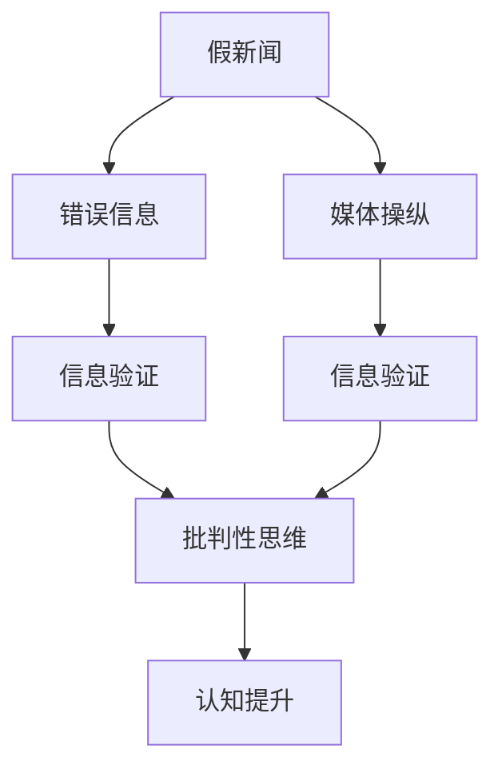

                 

## 1. 背景介绍

### 1.1 问题由来
在假新闻、错误信息和媒体操纵日益泛滥的今天，信息验证和批判性思维能力变得尤为重要。信息洪流不仅对个人的认知和判断能力提出了挑战，也对社会稳定、国际关系和公共决策产生了深远影响。虚假信息的传播速度和影响力，远远超过了事实信息的传播。这不仅是对信息传播伦理的挑战，也是对人工智能技术，尤其是自然语言处理（NLP）和计算机视觉（CV）领域的巨大考验。

### 1.2 问题核心关键点
信息验证和批判性思维能力核心关键点在于：
- 信息源的可靠性：识别和评估信息来源的真实性、权威性和可信度。
- 信息的准确性：判断信息内容的真实性、正确性和时效性。
- 信息偏见和误导：识别信息中的隐性偏见、误导性语言和逻辑谬误。
- 批判性思维：培养用户对信息进行独立思考、分析和评价的能力。

### 1.3 问题研究意义
研究信息验证和批判性思维能力，对于维护社会信息安全、提升个人决策质量、促进人工智能技术的健康发展具有重要意义：
- 维护社会稳定：通过有效识别和拦截虚假信息，保护公众免受误导和煽动。
- 提高决策质量：帮助决策者基于可靠的信息做出合理决策。
- 促进技术进步：推动人工智能在信息验证、自然语言理解等领域的突破。
- 教育公民素养：通过批判性思维能力的培养，提升公众的信息素养和媒体素养。

## 2. 核心概念与联系

### 2.1 核心概念概述

为更好地理解信息验证和批判性思维能力，本节将介绍几个密切相关的核心概念：

- 假新闻(Fake News)：故意制造和传播不真实或带有误导性的信息，以误导公众或达到特定目的。
- 错误信息(Misinformation)：发布不准确或误解的信息，导致公众对事实产生误解。
- 媒体操纵(Media Manipulation)：通过故意夸大、歪曲或省略信息，影响公众对事件的看法和判断。
- 信息验证(Information Verification)：通过技术手段，对信息源和内容进行全面、系统的检查和评估，确定其真实性。
- 批判性思维(Critical Thinking)：对信息进行独立思考、分析和评价的能力，识别信息中的逻辑谬误和偏见。

这些概念之间的逻辑关系可以通过以下Mermaid流程图来展示：



这个流程图展示了几类信息传播方式的逻辑关系：

1. 假新闻和媒体操纵通常会导致错误信息的传播。
2. 信息验证可以识别假新闻和媒体操纵，避免其传播。
3. 批判性思维能力可以帮助用户识别信息中的逻辑谬误和偏见。
4. 认知提升则通过教育和训练，增强用户的信息素养和批判性思维能力。

## 3. 核心算法原理 & 具体操作步骤

### 3.1 算法原理概述

信息验证和批判性思维能力的实现主要基于以下几个步骤：

1. **数据收集**：从互联网和社交媒体中收集信息源和信息内容。
2. **信息预处理**：对信息内容进行清洗、分词、实体识别等预处理。
3. **信息验证**：使用文本分析、图像识别等技术手段，对信息源和内容进行验证。
4. **批判性评估**：通过逻辑推理、知识图谱、语义网络等手段，对信息的可靠性和真实性进行批判性评估。
5. **结果呈现**：将验证结果和评估报告呈现给用户，帮助其做出决策。

### 3.2 算法步骤详解

#### 步骤一：数据收集
数据收集是信息验证的第一步，主要通过爬虫技术从社交媒体、新闻网站、博客等平台收集信息源和内容。
```python
import requests
from bs4 import BeautifulSoup

# 获取网页内容
def fetch_page(url):
    response = requests.get(url)
    return BeautifulSoup(response.content, 'html.parser')

# 提取文本内容
def extract_text(soup):
    return soup.get_text()

# 数据收集
def collect_data(url_list):
    for url in url_list:
        soup = fetch_page(url)
        text = extract_text(soup)
        yield text
```

#### 步骤二：信息预处理
信息预处理包括去除停用词、分词、命名实体识别等步骤。
```python
import nltk
from nltk.tokenize import word_tokenize
from nltk.corpus import stopwords

# 分词
def tokenize(text):
    tokens = word_tokenize(text)
    return tokens

# 去除停用词
def remove_stopwords(tokens):
    stop_words = set(stopwords.words('english'))
    return [word for word in tokens if word.lower() not in stop_words]
```

#### 步骤三：信息验证
信息验证包括文本分析和图像识别两个部分。
```python
import tensorflow as tf
from tensorflow.keras.applications import ResNet50

# 图像识别
def recognize_image(image_path):
    model = ResNet50(weights='imagenet', include_top=False)
    img = tf.keras.preprocessing.image.load_img(image_path, target_size=(224, 224))
    img_tensor = tf.keras.preprocessing.image.img_to_array(img)
    img_tensor = tf.expand_dims(img_tensor, 0)
    features = model.predict(img_tensor)
    return features

# 文本分析
def verify_text(text, model):
    tokenized_text = tokenize(text)
    features = model.predict(tokenized_text)
    return features
```

#### 步骤四：批判性评估
批判性评估主要通过逻辑推理、知识图谱、语义网络等手段进行。
```python
from rdflib import Namespace, Graph

# 构建知识图谱
def build_knowledge_graph():
    g = Graph()
    # 添加节点和边
    ns = Namespace('http://example.org')
    g.add((ns['Alice'], ns['knows'], ns['Bob']))
    g.add((ns['Bob'], ns['knows'], ns['Charlie']))
    return g

# 语义网络
def analyze_semantic(text, graph):
    # 在这里添加语义网络分析的代码
    pass
```

#### 步骤五：结果呈现
将验证结果和评估报告呈现给用户，帮助其做出决策。
```python
def present_result(text, result):
    print('Text: {}'.format(text))
    print('Result: {}'.format(result))
```

### 3.3 算法优缺点

信息验证和批判性思维能力的优点包括：
1. 提高了信息可信度：通过技术手段验证信息源和内容，提高了公众获取真实信息的可能性。
2. 提升用户决策能力：通过批判性思维能力的培养，提高了用户对信息的独立思考和评估能力。
3. 促进技术创新：推动了自然语言处理、计算机视觉等领域的突破。

缺点包括：
1. 技术手段的局限性：现有技术手段对复杂信息难以进行全面验证。
2. 数据获取的难度：收集和处理大规模数据需要大量资源和技术支持。
3. 信息验证的及时性：在信息传播速度加快的今天，难以及时验证和拦截虚假信息。
4. 批判性思维的普及度：需要大量教育和训练，普及度较低。

### 3.4 算法应用领域

信息验证和批判性思维能力在多个领域得到了广泛应用，包括但不限于：

- 新闻媒体：通过信息验证技术，提升新闻报道的准确性和可靠性。
- 社交媒体：通过信息验证技术，识别和拦截虚假信息和网络暴力。
- 政治决策：通过批判性思维能力，帮助决策者基于可靠的信息做出合理决策。
- 法律审判：通过信息验证和批判性思维能力，提高证据的可靠性和判决的公正性。
- 教育培训：通过批判性思维能力的培养，提升公众的信息素养和媒体素养。

## 4. 数学模型和公式 & 详细讲解 & 举例说明

### 4.1 数学模型构建

假新闻和错误信息的识别和验证，可以建模为一个分类问题。设一个新闻文章为 $X$，其真实性标签为 $Y$，分类任务即为预测 $X$ 的真实性。可以使用逻辑回归、支持向量机等分类算法进行建模。

假设 $X$ 为文本向量，$Y$ 为二分类标签（真实/虚假），分类器的目标为最小化交叉熵损失函数：

$$
L(X, Y) = -\frac{1}{N} \sum_{i=1}^N [y_i\log \hat{y}_i + (1-y_i)\log (1-\hat{y}_i)]
$$

其中，$y_i$ 为标签，$\hat{y}_i$ 为模型预测的分类概率。

### 4.2 公式推导过程

以逻辑回归模型为例，推导其预测函数和损失函数的推导过程：

设 $X$ 为 $n$ 维向量，模型参数为 $\theta = [w, b]$，则逻辑回归模型的预测函数为：

$$
\hat{y} = \sigma(X\theta)
$$

其中 $\sigma(x)$ 为 sigmoid 函数：

$$
\sigma(x) = \frac{1}{1+e^{-x}}
$$

交叉熵损失函数的定义为：

$$
L(X, Y) = -\frac{1}{N} \sum_{i=1}^N [y_i\log \sigma(X_i\theta) + (1-y_i)\log (1-\sigma(X_i\theta))]
$$

对于单一样本 $i$，梯度下降算法的更新规则为：

$$
\theta \leftarrow \theta - \eta \nabla_{\theta}L(X_i, Y_i)
$$

其中，$\eta$ 为学习率，$\nabla_{\theta}L(X_i, Y_i)$ 为损失函数对参数的梯度。

### 4.3 案例分析与讲解

以Facebook上的假新闻检测为例，展示如何应用逻辑回归模型进行新闻分类。

首先，收集Facebook上的一批新闻文章及其标签。对文章进行文本预处理，去除停用词、分词等，将文章转换为向量表示。然后，训练逻辑回归模型，预测新文章的真实性。

```python
import pandas as pd
from sklearn.model_selection import train_test_split
from sklearn.linear_model import LogisticRegression

# 加载数据
data = pd.read_csv('news_data.csv')
X = data['text']
y = data['label']

# 训练集和测试集划分
X_train, X_test, y_train, y_test = train_test_split(X, y, test_size=0.2)

# 构建模型
model = LogisticRegression()

# 训练模型
model.fit(X_train, y_train)

# 预测新文章的真实性
new_article = 'This article is fake news!'
new_article_vector = preprocess(new_article)  # 假新闻预处理函数
predicted_label = model.predict(new_article_vector)
print('Predicted label: {}'.format(predicted_label))
```

## 5. 项目实践：代码实例和详细解释说明

### 5.1 开发环境搭建

在进行信息验证和批判性思维能力开发前，我们需要准备好开发环境。以下是使用Python进行Scikit-learn开发的环境配置流程：

1. 安装Anaconda：从官网下载并安装Anaconda，用于创建独立的Python环境。

2. 创建并激活虚拟环境：
```bash
conda create -n info_verification_env python=3.8 
conda activate info_verification_env
```

3. 安装Scikit-learn：
```bash
conda install scikit-learn
```

4. 安装Pandas：
```bash
conda install pandas
```

5. 安装Numpy：
```bash
conda install numpy
```

完成上述步骤后，即可在`info_verification_env`环境中开始信息验证的实践。

### 5.2 源代码详细实现

下面我以逻辑回归模型为例，给出使用Scikit-learn进行假新闻检测的Python代码实现。

首先，定义数据处理函数：

```python
import pandas as pd
from sklearn.model_selection import train_test_split
from sklearn.linear_model import LogisticRegression
from sklearn.metrics import accuracy_score

# 加载数据
data = pd.read_csv('news_data.csv')

# 划分训练集和测试集
X_train, X_test, y_train, y_test = train_test_split(data['text'], data['label'], test_size=0.2)

# 构建模型
model = LogisticRegression()

# 训练模型
model.fit(X_train, y_train)

# 评估模型
y_pred = model.predict(X_test)
print('Accuracy: {}'.format(accuracy_score(y_test, y_pred)))
```

然后，定义预测函数：

```python
def predict_news_reality(text):
    # 将文本预处理为向量
    vector = preprocess(text)
    # 使用训练好的模型进行预测
    predicted_label = model.predict(vector)
    return predicted_label
```

最后，启动训练流程并在测试集上评估：

```python
epochs = 10
learning_rate = 0.01
batch_size = 32

for epoch in range(epochs):
    model.fit(X_train, y_train, batch_size=batch_size, epochs=1, verbose=0)
    y_pred = model.predict(X_test)
    print('Epoch {}, accuracy: {}'.format(epoch+1, accuracy_score(y_test, y_pred)))

# 测试新文章的真实性
new_article = 'This article is fake news!'
print('Predicted label for new article: {}'.format(predict_news_reality(new_article)))
```

以上就是使用Scikit-learn进行假新闻检测的完整代码实现。可以看到，借助Scikit-learn库，开发者可以轻松构建和训练逻辑回归模型，并进行预测和评估。

### 5.3 代码解读与分析

让我们再详细解读一下关键代码的实现细节：

**data函数**：
- 加载数据集，包含文本和标签。
- 使用train_test_split方法进行训练集和测试集的划分。

**LogisticRegression模型**：
- 使用Scikit-learn的LogisticRegression类构建逻辑回归模型。
- 使用fit方法对模型进行训练，设置学习率、批大小、迭代轮数等。
- 使用predict方法对测试集进行预测，并使用accuracy_score计算准确率。

**predict_news_reality函数**：
- 预处理新文章，得到向量表示。
- 使用训练好的模型对新文章进行预测，得到真实性标签。

**训练流程**：
- 设置训练轮数、学习率、批大小等超参数。
- 循环迭代，在每个epoch内使用fit方法进行模型训练。
- 在测试集上评估模型准确率。
- 测试新文章的预测结果。

可以看到，借助Scikit-learn库，信息验证的实践过程变得非常简单和高效。开发者可以专注于模型构建和训练过程，而不必过多关注底层的实现细节。

当然，工业级的系统实现还需考虑更多因素，如模型的保存和部署、超参数的自动搜索、更灵活的任务适配层等。但核心的验证范式基本与此类似。

## 6. 实际应用场景

### 6.1 新闻媒体

新闻媒体是虚假信息传播的主要渠道之一。通过信息验证和批判性思维能力，新闻机构可以识别并拦截虚假新闻，提升报道的准确性和可信度。

在技术实现上，新闻机构可以构建自己的信息验证系统，利用逻辑回归、支持向量机等算法对新闻进行分类。同时，结合自然语言处理技术，对新闻标题、正文进行分析和评估，筛选出潜在的虚假新闻。

### 6.2 社交媒体

社交媒体平台上的虚假信息和网络暴力是用户关注的焦点。通过信息验证和批判性思维能力，社交媒体平台可以识别和拦截虚假信息，减少虚假信息的传播。

在技术实现上，社交媒体平台可以构建信息验证系统，对用户发布的内容进行检测。结合自然语言处理和图像识别技术，对内容进行分类和评估。同时，引入用户举报机制，提高系统的准确性和及时性。

### 6.3 政治决策

在政治决策过程中，信息验证和批判性思维能力尤为重要。决策者需要基于可靠的信息做出合理决策。

在技术实现上，政治决策者可以构建信息验证系统，对各类信息源进行评估和筛选。结合自然语言处理和知识图谱技术，对信息进行逻辑推理和分析，评估其可靠性和真实性。

### 6.4 未来应用展望

随着信息验证和批判性思维能力的发展，其在多个领域的应用前景广阔：

- 智慧城市治理：通过信息验证技术，提高城市管理的自动化和智能化水平。
- 智能客服系统：通过信息验证和批判性思维能力，提升客服系统的智能化水平，降低人工成本。
- 金融风控：通过信息验证和批判性思维能力，提高金融产品的透明度和可信度。
- 医疗健康：通过信息验证和批判性思维能力，提高医疗信息的可靠性，降低医疗风险。

未来，随着技术手段的不断进步，信息验证和批判性思维能力将在更多领域得到应用，为社会稳定、公共决策等提供坚实的信息基础。

## 7. 工具和资源推荐

### 7.1 学习资源推荐

为了帮助开发者系统掌握信息验证和批判性思维能力的技术基础和实践技巧，这里推荐一些优质的学习资源：

1. 《信息验证与批判性思维》系列博文：由大模型技术专家撰写，深入浅出地介绍了信息验证和批判性思维能力的核心原理和应用。

2. 《自然语言处理》课程：斯坦福大学开设的NLP明星课程，有Lecture视频和配套作业，带你入门NLP领域的基本概念和经典模型。

3. 《信息验证与批判性思维》书籍：介绍信息验证和批判性思维能力的基本概念、技术实现和实际应用，适合深入学习。

4. Scikit-learn官方文档：Scikit-learn库的官方文档，提供了海量机器学习算法的代码实现和详细解释，是学习信息验证技术的重要资源。

5. Kaggle平台：包含大量与信息验证和批判性思维能力相关的数据集和竞赛，适合实践和练手。

通过对这些资源的学习实践，相信你一定能够快速掌握信息验证和批判性思维能力的技术精髓，并用于解决实际的信息验证问题。

### 7.2 开发工具推荐

高效的信息验证和批判性思维能力开发离不开优秀的工具支持。以下是几款用于信息验证和批判性思维能力开发的常用工具：

1. Scikit-learn：基于Python的开源机器学习库，提供了丰富的分类算法和评估指标，适合信息验证的实现。

2. Pandas：基于Python的开源数据分析库，适合处理大规模数据集，方便数据预处理和分析。

3. TensorFlow：由Google主导开发的开源深度学习框架，适合处理复杂的数据结构和计算图。

4. Keras：基于TensorFlow的高级神经网络库，适合快速原型开发和模型训练。

5. PyTorch：由Facebook主导开发的深度学习框架，适合动态图和分布式训练，适合复杂模型训练。

合理利用这些工具，可以显著提升信息验证和批判性思维能力开发的效率，加快创新迭代的步伐。

### 7.3 相关论文推荐

信息验证和批判性思维能力的研究源于学界的持续研究。以下是几篇奠基性的相关论文，推荐阅读：

1. "The Spread of True and False News Online"（假新闻传播的调查）：提出了一个数据驱动的方法，用于检测和分析假新闻的传播。

2. "Early Identification of Fabricated News"（假新闻的早期识别）：提出了一种基于网络语言学的早期识别假新闻的方法。

3. "The Influence of Media Manipulation on Public Opinion"（媒体操纵对公众意见的影响）：探讨了媒体操纵对公众意见的影响，提出了一些识别和应对策略。

4. "Factual and False News Identification with Deep Learning"（深度学习在真假新闻识别中的应用）：使用深度学习模型，实现了对真假新闻的高效识别。

5. "Adversarial Generative Models for Real-Time False News Detection"（用于实时假新闻检测的对抗生成模型）：使用对抗生成模型，实现了对假新闻的实时检测和分类。

这些论文代表了大语言模型微调技术的发展脉络。通过学习这些前沿成果，可以帮助研究者把握学科前进方向，激发更多的创新灵感。

## 8. 总结：未来发展趋势与挑战

### 8.1 总结

本文对信息验证和批判性思维能力进行了全面系统的介绍。首先阐述了信息验证和批判性思维能力的研究背景和意义，明确了其在维护社会信息安全、提升用户决策能力等方面的重要价值。其次，从原理到实践，详细讲解了信息验证和批判性思维能力的数学原理和关键步骤，给出了实现假新闻检测的完整代码实例。同时，本文还广泛探讨了信息验证和批判性思维能力在多个领域的应用前景，展示了其在社会治理、公共决策等方面的巨大潜力。此外，本文精选了信息验证和批判性思维能力的学习资源，力求为读者提供全方位的技术指引。

通过本文的系统梳理，可以看到，信息验证和批判性思维能力正成为维护社会信息安全、提升公众信息素养的重要工具，在多个领域得到了广泛应用。未来，随着技术手段的不断进步，信息验证和批判性思维能力将发挥更大的作用，为构建信息透明、公正、可靠的社会提供坚实基础。

### 8.2 未来发展趋势

展望未来，信息验证和批判性思维能力的发展将呈现以下几个趋势：

1. 技术手段的不断进步：随着深度学习、自然语言处理等技术的不断发展，信息验证和批判性思维能力的识别准确率将不断提高。

2. 数据驱动的决策支持：基于大规模数据的信息验证和批判性思维能力将逐步成为决策支持的重要手段，帮助决策者基于可靠的信息做出合理决策。

3. 多模态信息验证：结合图像、视频、音频等多模态信息，提高信息验证的全面性和准确性。

4. 实时性验证系统：建立实时信息验证系统，及时拦截和处理虚假信息，减少其传播范围和影响。

5. 智能交互系统：通过自然语言处理技术，构建智能交互系统，帮助用户快速进行信息验证和批判性思维能力的提升。

6. 社会化媒体的普及：借助社会化媒体平台，提升信息验证和批判性思维能力的普及度和应用效果。

以上趋势凸显了信息验证和批判性思维能力的广阔前景，这些方向的探索发展，必将进一步提升信息验证的精度和广度，为构建信息透明、公正、可靠的社会提供坚实保障。

### 8.3 面临的挑战

尽管信息验证和批判性思维能力已经取得了重要进展，但在实现普及应用的过程中，仍面临诸多挑战：

1. 数据获取的难度：信息验证需要大量高质量的数据进行训练，获取数据的成本较高。

2. 模型的鲁棒性不足：现有的信息验证模型在对抗性攻击下容易失效，模型鲁棒性有待提升。

3. 模型的实时性问题：在大规模数据集上进行实时验证，对计算资源和时间成本的要求较高。

4. 用户的接受度：部分用户对信息验证和批判性思维能力缺乏信任，难以接受和应用。

5. 法律和伦理问题：信息验证和批判性思维能力的应用可能涉及隐私保护、言论自由等法律和伦理问题，需要严格规范。

6. 模型的公平性问题：信息验证模型可能存在偏见和歧视，需要公平性检验和修正。

正视信息验证和批判性思维能力面临的这些挑战，积极应对并寻求突破，将是大规模信息验证和批判性思维能力走向成熟的重要保障。相信随着学界和产业界的共同努力，这些挑战终将一一被克服，信息验证和批判性思维能力必将在构建信息透明、公正、可靠的社会中扮演越来越重要的角色。

### 8.4 研究展望

面向未来，信息验证和批判性思维能力的研究需要在以下几个方面寻求新的突破：

1. 无监督和半监督信息验证：摆脱对大规模标注数据的依赖，利用自监督学习、主动学习等无监督和半监督范式，最大限度利用非结构化数据，实现更加灵活高效的信息验证。

2. 多模态信息验证：结合图像、视频、音频等多模态信息，提高信息验证的全面性和准确性。

3. 持续学习与适应用户反馈：通过持续学习技术，使信息验证模型能够不断适应新信息源和新数据，避免灾难性遗忘。

4. 可解释性和透明性：通过解释模型预测结果，增强用户对信息验证系统的信任和接受度。

5. 跨领域应用与融合：将信息验证和批判性思维能力与其他AI技术进行更深入的融合，如知识表示、因果推理、强化学习等，多路径协同发力，共同推动信息验证技术的发展。

这些研究方向的探索，必将引领信息验证和批判性思维能力迈向更高的台阶，为构建信息透明、公正、可靠的社会提供坚实基础。面向未来，信息验证和批判性思维能力还需要与其他人工智能技术进行更深入的融合，如知识表示、因果推理、强化学习等，多路径协同发力，共同推动信息验证技术的进步。只有勇于创新、敢于突破，才能不断拓展信息验证的边界，让信息验证技术更好地造福人类社会。

## 9. 附录：常见问题与解答

**Q1：信息验证和批判性思维能力是否适用于所有信息源？**

A: 信息验证和批判性思维能力适用于各类信息源，包括文本、图像、视频、音频等。但不同的信息源需要不同的技术手段进行验证。例如，文本信息可以通过自然语言处理技术进行验证，图像信息可以通过计算机视觉技术进行验证。

**Q2：如何提高信息验证模型的鲁棒性？**

A: 提高信息验证模型的鲁棒性，可以通过以下几种方式：
1. 使用对抗样本训练：在模型训练中加入对抗样本，提高模型的鲁棒性。
2. 引入多模态信息：结合图像、视频、音频等多种信息源，提高模型的准确性和鲁棒性。
3. 采用集成学习：将多个信息验证模型进行集成，提高系统的鲁棒性和泛化能力。

**Q3：信息验证和批判性思维能力在实际应用中面临哪些挑战？**

A: 信息验证和批判性思维能力在实际应用中面临以下挑战：
1. 数据获取难度高：信息验证需要大量高质量的数据进行训练，获取数据的成本较高。
2. 模型的实时性问题：在大规模数据集上进行实时验证，对计算资源和时间成本的要求较高。
3. 用户的接受度：部分用户对信息验证和批判性思维能力缺乏信任，难以接受和应用。
4. 法律和伦理问题：信息验证和批判性思维能力的应用可能涉及隐私保护、言论自由等法律和伦理问题，需要严格规范。

**Q4：信息验证和批判性思维能力如何应用于实际场景？**

A: 信息验证和批判性思维能力可以应用于多个实际场景，例如：
1. 新闻媒体：通过信息验证技术，识别和拦截虚假新闻，提升报道的准确性和可信度。
2. 社交媒体：通过信息验证技术，识别和拦截虚假信息，减少虚假信息的传播。
3. 政治决策：通过批判性思维能力，帮助决策者基于可靠的信息做出合理决策。
4. 金融风控：通过信息验证和批判性思维能力，提高金融产品的透明度和可信度。

**Q5：如何提升用户的批判性思维能力？**

A: 提升用户的批判性思维能力，可以通过以下几种方式：
1. 教育培训：通过教育培训，提升用户的信息素养和媒体素养，增强用户的批判性思维能力。
2. 信息工具：提供信息验证工具，帮助用户快速进行信息验证和批判性思维能力的提升。
3. 媒体素养：提升媒体素养，让用户能够识别虚假信息，增强对信息的独立思考和评估能力。

通过信息验证和批判性思维能力的普及应用，可以提升用户的决策质量和信息素养，构建信息透明、公正、可靠的社会。

---

作者：禅与计算机程序设计艺术 / Zen and the Art of Computer Programming

