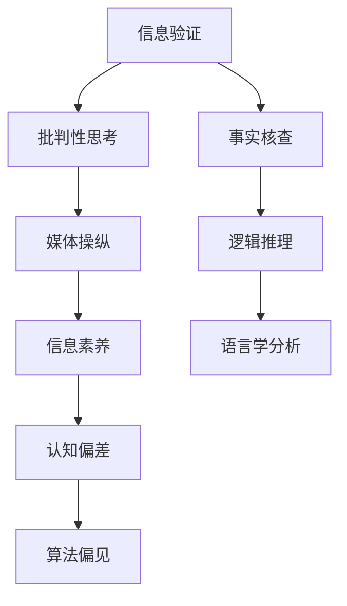

                 

## 1. 背景介绍

### 1.1 问题由来

在当前信息爆炸的时代，假新闻、错误信息和媒体操纵已经成为影响公共意识和政治决策的重要因素。尤其是社交媒体和网络平台上，大量虚假信息被快速传播，对社会秩序和公民认知造成了重大挑战。如何培养和提升公众的信息验证和批判性思考技能，成为维护信息健康和保障社会稳定的关键任务。

### 1.2 问题核心关键点

提升信息验证和批判性思考技能，核心在于以下几点：

- **理解信息源的可靠性**：评估信息来源的可信度，识别潜在的误导性信息。
- **培养批判性思维**：能够从多个角度审视信息，分析其逻辑和证据的合理性。
- **掌握基本的信息验证技术**：学会使用多种技术手段，如事实核查、逻辑推理、语言学分析等，验证信息的真实性。
- **提升信息素养**：持续学习最新的信息验证工具和技术，保持知识更新和技能提升。

### 1.3 问题研究意义

提升公众的信息验证和批判性思考技能，对于构建信息健康的网络环境，增强公众对媒体内容的理解力，具有重要意义：

- **减少误导和谣言传播**：帮助公众辨识虚假信息，减少误导性信息的扩散和影响力。
- **提高公民参与度**：鼓励公众基于事实进行讨论和决策，提升社会透明度和公民参与。
- **促进科学决策**：基于真实可靠的信息，做出更加理性和科学的决策，避免因虚假信息导致的错误决策。
- **提升媒体责任感**：促使媒体和信息传播者提高信息真实性和准确性，承担起社会责任。

## 2. 核心概念与联系

### 2.1 核心概念概述

为了更好地理解如何提升信息验证和批判性思考技能，本节将介绍几个密切相关的核心概念：

- **信息验证**：通过各种技术手段，对信息的真实性、准确性和来源可信度进行检验。包括事实核查、逻辑推理、语言学分析等。
- **批判性思考**：指从多个角度、多维度审视信息，评价其逻辑性、证据可靠性和论点一致性，做出基于理性和证据的判断。
- **媒体操纵**：指媒体为了特定目的，故意传播或曲解信息，误导公众。包括广告夸大、数据篡改、假新闻等。
- **信息素养**：指个人获取、评估和利用信息的能力，包括信息获取、信息辨识、信息评价、信息应用等多个方面。
- **认知偏差**：指人类在信息处理过程中，由于心理或生理因素产生的认知误差，导致信息误判。包括确认偏误、可得性偏误、锚定效应等。
- **算法偏见**：指在机器学习和数据驱动技术中，因数据和算法本身的缺陷，导致对特定群体或信息的偏差性处理。

这些核心概念之间的逻辑关系可以通过以下Mermaid流程图来展示：



这个流程图展示了一些核心概念及其之间的关系：

1. 信息验证和批判性思考是提升信息素养的基础。
2. 媒体操纵和认知偏差是信息验证和批判性思考需要面对的主要挑战。
3. 事实核查、逻辑推理、语言学分析是常用的信息验证手段。
4. 算法偏见是信息验证中需要特别关注的问题。

这些概念共同构成了提升信息验证和批判性思考技能的理论框架，帮助我们理解和应对信息时代的各种复杂挑战。

## 3. 核心算法原理 & 具体操作步骤
### 3.1 算法原理概述

提升信息验证和批判性思考技能，本质上是将信息验证技术和批判性思维方法与用户行为相结合的过程。通过系统地训练和实践，用户能够学会识别和处理各类信息，提高其在信息海洋中的独立思考能力。

具体而言，算法原理包括：

- **数据驱动的学习**：通过大量标注的数据集，训练模型学习信息验证的技术和规则。
- **交互式反馈**：用户在与系统的互动中，不断收到关于信息真实性的反馈，逐渐掌握信息验证的要点。
- **持续迭代优化**：基于用户的反馈，动态调整模型和规则，提升信息验证的准确性和适用性。

### 3.2 算法步骤详解

基于上述算法原理，提升信息验证和批判性思考技能的步骤可以分解为以下几个关键环节：

**Step 1: 数据准备与标注**

- 收集大量标注好的数据集，包括事实核查数据、逻辑推理数据、语言学分析数据等。
- 标注数据集，确保每个信息都对应真实性标注（如True、False、Unknown）。
- 将数据集划分为训练集、验证集和测试集，用于模型的训练、评估和优化。

**Step 2: 选择模型和算法**

- 选择合适的机器学习模型，如逻辑回归、决策树、神经网络等，用于训练信息验证系统。
- 设计模型训练和评估的损失函数，如交叉熵损失、感知机损失等。
- 引入正则化技术，如L2正则、Dropout等，避免模型过拟合。

**Step 3: 训练与迭代优化**

- 使用训练集对模型进行训练，优化模型参数，最小化损失函数。
- 在验证集上评估模型性能，调整模型参数，确保模型泛化能力。
- 收集用户反馈，进一步优化模型，提升信息验证效果。

**Step 4: 应用与交互**

- 将训练好的模型部署到实际应用中，如信息验证平台、新闻客户端等。
- 通过用户界面，让用户输入待验证的信息，提供验证结果和详细分析。
- 用户对验证结果进行反馈，系统根据反馈进一步优化。

**Step 5: 评估与迭代**

- 在测试集上评估模型的性能，确保模型在新场景下的可靠性。
- 定期更新数据集和模型，保持系统的最新性和准确性。
- 持续进行用户调研和数据分析，优化用户体验和系统性能。

### 3.3 算法优缺点

提升信息验证和批判性思考技能的算法具有以下优点：

- **自动化和高效性**：通过模型自动化处理大量信息，提高验证效率。
- **用户交互性**：通过互动反馈，增强用户对验证过程的理解和认同。
- **持续优化**：基于用户反馈和最新数据，动态调整模型，提升准确性。

同时，该算法也存在一定的局限性：

- **数据依赖性**：模型的性能依赖于标注数据的数量和质量，标注成本较高。
- **模型偏见**：模型可能继承数据和算法中的偏见，对某些信息产生偏差。
- **用户适应性**：用户需要一定的时间和练习，才能适应系统的反馈机制。
- **交互复杂性**：用户界面设计和交互流程设计，对系统的易用性有较高要求。

尽管存在这些局限性，但就目前而言，这种基于数据驱动和用户交互的信息验证系统，仍是在假新闻、错误信息和媒体操纵时代导航的最主流方法。未来相关研究的重点在于如何进一步降低数据标注的依赖，提高系统的公平性和透明性，同时兼顾用户的使用体验和隐私保护。

### 3.4 算法应用领域

提升信息验证和批判性思考技能的算法，在多个领域已得到应用，包括但不限于：

- **新闻业**：帮助记者和编辑进行事实核查，减少假新闻的传播。
- **教育**：培养学生的信息辨识和批判性思考能力，提升教育质量。
- **法律**：辅助律师进行证据验证和案例研究，提高法律决策的准确性。
- **健康医疗**：帮助患者识别健康信息的真实性，促进科学健康决策。
- **社会治理**：提升公众对政府政策和社会现象的理解，提高社会参与度。

这些应用领域展示了信息验证和批判性思考技能提升的广泛价值，为各行业的信息健康和社会治理提供了新的工具和方法。

## 4. 数学模型和公式 & 详细讲解 & 举例说明

### 4.1 数学模型构建

为了系统地描述信息验证和批判性思考技能提升的数学模型，我们假设有一个二分类问题，其中每个样本 $(x_i, y_i)$ 代表一个信息，$y_i \in \{True, False\}$ 表示信息的真实性。模型的目标是学习一个函数 $f(x)$，用于预测信息的真实性。

定义模型的损失函数为交叉熵损失函数：

$$
\mathcal{L}(\theta) = -\frac{1}{N}\sum_{i=1}^N [y_i \log f(x_i) + (1-y_i) \log (1-f(x_i))]
$$

其中 $\theta$ 是模型的参数，$f(x)$ 是模型的预测函数。

### 4.2 公式推导过程

为了优化模型参数 $\theta$，使用梯度下降算法进行迭代更新：

$$
\theta \leftarrow \theta - \eta \nabla_{\theta}\mathcal{L}(\theta)
$$

其中 $\eta$ 是学习率，$\nabla_{\theta}\mathcal{L}(\theta)$ 是损失函数关于 $\theta$ 的梯度。

在二分类问题中，常用的模型包括逻辑回归、决策树、神经网络等。以下以逻辑回归模型为例，推导其参数更新公式：

假设模型参数为 $\theta = [w, b]$，其中 $w$ 是权重向量，$b$ 是偏置项。逻辑回归模型的预测函数为：

$$
f(x) = \sigma(w^T x + b)
$$

其中 $\sigma$ 是逻辑函数，$\sigma(z) = \frac{1}{1+e^{-z}}$。

损失函数梯度为：

$$
\nabla_{\theta}\mathcal{L}(\theta) = \left[ -\frac{1}{N}\sum_{i=1}^N y_i (f(x_i) - y_i)(x_i), -\frac{1}{N}\sum_{i=1}^N (f(x_i) - y_i) \right]
$$

使用梯度下降算法更新参数：

$$
w \leftarrow w - \eta \frac{1}{N}\sum_{i=1}^N y_i (f(x_i) - y_i)x_i
$$

$$
b \leftarrow b - \eta \frac{1}{N}\sum_{i=1}^N (f(x_i) - y_i)
$$

以上公式展示了逻辑回归模型的参数更新过程。通过不断迭代优化，模型能够逐渐逼近真实信息的真实性。

### 4.3 案例分析与讲解

以一个简单的事实核查案例为例，假设我们有一个新闻网站，需要验证一个关于选举结果的新闻报道的真实性。网站使用逻辑回归模型进行验证，数据集包括100个样本，每个样本包含一篇新闻报道和其真实性标签（True或False）。

- **数据准备**：收集100篇新闻报道和对应的真实性标签，将数据集划分为训练集和测试集。
- **模型选择**：选择逻辑回归模型作为验证模型，定义交叉熵损失函数。
- **训练与迭代**：使用训练集对模型进行训练，使用交叉熵损失函数进行优化。在验证集上评估模型性能，调整模型参数。
- **应用与交互**：用户输入一篇待验证的新闻报道，系统提供验证结果和分析。用户反馈验证结果，系统根据反馈进一步优化。

通过不断的训练和迭代，逻辑回归模型逐渐学会判断新闻报道的真实性，提升信息验证的准确性。

## 5. 项目实践：代码实例和详细解释说明

### 5.1 开发环境搭建

在进行信息验证和批判性思考技能提升的项目实践前，我们需要准备好开发环境。以下是使用Python进行TensorFlow开发的环境配置流程：

1. 安装Anaconda：从官网下载并安装Anaconda，用于创建独立的Python环境。

2. 创建并激活虚拟环境：
```bash
conda create -n tf-env python=3.8 
conda activate tf-env
```

3. 安装TensorFlow：根据CUDA版本，从官网获取对应的安装命令。例如：
```bash
conda install tensorflow -c pytorch -c conda-forge
```

4. 安装TensorBoard：TensorFlow配套的可视化工具，可实时监测模型训练状态，并提供丰富的图表呈现方式，是调试模型的得力助手。

```bash
pip install tensorboard
```

5. 安装各类工具包：
```bash
pip install numpy pandas scikit-learn matplotlib tqdm jupyter notebook ipython
```

完成上述步骤后，即可在`tf-env`环境中开始项目实践。

### 5.2 源代码详细实现

这里我们以逻辑回归模型进行事实核查为例，给出使用TensorFlow进行信息验证的代码实现。

首先，定义数据处理函数：

```python
import tensorflow as tf
from sklearn.model_selection import train_test_split
import numpy as np

def load_data():
    # 加载数据集
    # 数据集为二分类问题，每个样本包含一篇新闻报道和真实性标签
    # 这里假设有100篇新闻报道和对应的真实性标签
    news = ['news1', 'news2', ...]
    labels = [True, False, ...]
    
    # 将文本转换为数值表示
    vocab_size = 10000
    tokenizer = tf.keras.preprocessing.text.Tokenizer(num_words=vocab_size)
    tokenizer.fit_on_texts(news)
    sequences = tokenizer.texts_to_sequences(news)
    X = np.array(sequences, dtype='int32')
    
    # 填充数据，使其长度一致
    max_len = 100
    X = tf.keras.preprocessing.sequence.pad_sequences(X, maxlen=max_len)
    
    # 划分训练集和测试集
    X_train, X_test, y_train, y_test = train_test_split(X, labels, test_size=0.2, random_state=42)
    
    return X_train, X_test, y_train, y_test

# 加载数据集
X_train, X_test, y_train, y_test = load_data()
```

然后，定义模型和优化器：

```python
from tensorflow.keras.models import Sequential
from tensorflow.keras.layers import Embedding, Dense, Dropout

# 定义逻辑回归模型
model = Sequential()
model.add(Embedding(vocab_size, 64, input_length=max_len))
model.add(Dropout(0.5))
model.add(Dense(1, activation='sigmoid'))

# 定义优化器
optimizer = tf.keras.optimizers.Adam(learning_rate=0.001)
```

接着，定义训练和评估函数：

```python
import tensorflow as tf
from sklearn.metrics import accuracy_score

def train_epoch(model, dataset, batch_size, optimizer):
    dataloader = tf.data.Dataset.from_tensor_slices((dataset['X'], dataset['y']))
    dataloader = dataloader.batch(batch_size).shuffle(buffer_size=1000)
    
    model.compile(optimizer=optimizer, loss='binary_crossentropy', metrics=['accuracy'])
    
    model.fit(dataloader, epochs=10, validation_split=0.2)

def evaluate(model, dataset, batch_size):
    dataloader = tf.data.Dataset.from_tensor_slices((dataset['X'], dataset['y']))
    dataloader = dataloader.batch(batch_size).shuffle(buffer_size=1000)
    
    _, acc = model.evaluate(dataloader)
    print(f"Accuracy: {acc}")
```

最后，启动训练流程并在测试集上评估：

```python
batch_size = 32

# 训练模型
train_epoch(model, {'X': X_train, 'y': y_train}, batch_size, optimizer)

# 在测试集上评估模型
evaluate(model, {'X': X_test, 'y': y_test}, batch_size)
```

以上就是使用TensorFlow对逻辑回归模型进行事实核查的完整代码实现。可以看到，得益于TensorFlow的强大封装，我们能够用相对简洁的代码完成模型的训练和评估。

### 5.3 代码解读与分析

让我们再详细解读一下关键代码的实现细节：

**load_data函数**：
- 定义了数据加载和预处理的过程。首先将文本转换为数值序列，然后进行填充和划分训练集和测试集。

**train_epoch和evaluate函数**：
- 使用TensorFlow的数据集接口，将数据集转换为DataLoader，支持批量迭代。
- 使用`compile`方法设置模型的优化器和损失函数，并定义评估指标。
- `fit`方法用于训练模型，`evaluate`方法用于评估模型性能。

**训练流程**：
- 定义批量大小和优化器，进行模型训练。
- 在验证集上评估模型性能，输出准确率。
- 在测试集上进一步评估模型性能。

可以看到，TensorFlow提供了丰富的API和工具，使得信息验证模型的开发和评估变得简洁高效。开发者可以将更多精力放在数据处理和模型改进上，而不必过多关注底层实现细节。

当然，工业级的系统实现还需考虑更多因素，如模型的保存和部署、超参数的自动搜索、更灵活的任务适配层等。但核心的信息验证范式基本与此类似。

## 6. 实际应用场景

### 6.1 新闻媒体平台

在新闻媒体平台上，事实核查和信息验证是保障新闻真实性的关键环节。通过训练信息验证模型，新闻平台可以自动化地检测和标记假新闻，提升新闻的可靠性和可信度。

具体而言，可以收集大量新闻报道和其真实性标签，训练模型学习如何区分真实新闻和假新闻。在用户阅读新闻时，系统自动提供验证结果和分析，帮助用户识别信息真伪，减少假新闻的传播。

### 6.2 教育平台

在教育平台中，信息验证和批判性思考技能的提升，对于培养学生的独立思考能力和信息辨识能力至关重要。通过训练信息验证模型，教育平台可以帮助学生学会判断信息的真实性和准确性。

例如，在语文阅读教学中，可以引入信息验证任务，让学生对文章进行事实核查，增强理解力和分析能力。在科学教育中，通过验证科学实验和结论，提升学生的科学素养和质疑精神。

### 6.3 法律咨询

在法律咨询中，信息验证和批判性思考技能的提升，对于提高律师的证据分析和案例研究能力具有重要作用。通过训练信息验证模型，律师可以自动化地验证证据的真实性，减少人为疏漏和偏见。

例如，在处理合同纠纷时，律师可以使用信息验证模型，检查合同文本的真实性和完整性，避免因虚假证据导致的误判。在处理金融诈骗案件时，通过验证交易记录和银行流水，提高证据的可靠性和有效性。

### 6.4 未来应用展望

随着信息验证和批判性思考技能提升的不断演进，其在各行业的应用前景将更加广阔。

在智慧医疗领域，通过训练信息验证模型，医院可以自动化地验证健康信息的真实性，减少误诊和医疗纠纷。在智能客服系统上，通过信息验证，提升客服系统的准确性和可靠性，增强用户体验。

此外，信息验证和批判性思考技能的提升，还将促进人工智能技术的伦理和安全应用，避免因算法偏见和数据偏差导致的误判，提升人工智能系统的可信度和透明度。相信随着技术的不断发展，信息验证和批判性思考技能的提升将成为人工智能技术应用的重要保障。

## 7. 工具和资源推荐
### 7.1 学习资源推荐

为了帮助开发者系统掌握信息验证和批判性思考技能提升的理论基础和实践技巧，这里推荐一些优质的学习资源：

1. 《深度学习》系列书籍：深度学习领域的经典教材，涵盖信息验证和批判性思考技能提升的基本概念和算法原理。

2. 《Python机器学习》：介绍Python在机器学习和信息验证中的应用，提供了大量实用代码和案例分析。

3. Coursera的《信息检索与文本挖掘》课程：由斯坦福大学开设，系统讲解文本处理和信息检索技术，适合初学者和进阶者。

4. Kaggle竞赛平台：提供大量的数据集和模型，可以参与实际的信息验证和批判性思考技能提升竞赛，锻炼实战能力。

5. Google Scholar：学术搜索引擎，可以搜索最新的信息验证和批判性思考技能提升论文，跟踪研究进展。

通过对这些资源的学习实践，相信你一定能够快速掌握信息验证和批判性思考技能提升的精髓，并用于解决实际的信息验证问题。

### 7.2 开发工具推荐

高效的开发离不开优秀的工具支持。以下是几款用于信息验证和批判性思考技能提升开发的常用工具：

1. TensorFlow：由Google主导开发的开源深度学习框架，生产部署方便，适合大规模工程应用。

2. PyTorch：基于Python的开源深度学习框架，灵活动态的计算图，适合快速迭代研究。

3. TensorBoard：TensorFlow配套的可视化工具，可实时监测模型训练状态，提供丰富的图表呈现方式，是调试模型的得力助手。

4. Weights & Biases：模型训练的实验跟踪工具，可以记录和可视化模型训练过程中的各项指标，方便对比和调优。

5. Jupyter Notebook：交互式的数据分析和代码编写环境，支持多种编程语言和工具包，是开发者常用的开发环境。

合理利用这些工具，可以显著提升信息验证和批判性思考技能提升的开发效率，加快创新迭代的步伐。

### 7.3 相关论文推荐

信息验证和批判性思考技能提升的研究源于学界的持续研究。以下是几篇奠基性的相关论文，推荐阅读：

1. Snopes Fact-Checking Dataset: A Benchmark for Detecting Falsehood in News Stories：提供了一个用于检测假新闻的Snopes数据集，并介绍了多个机器学习模型在数据集上的性能。

2. Modeling Human Behavior: The Value of Parameter Sharing in Attention Models for Categorizing Website Quality：讨论了参数共享和注意力机制在新闻质量分类中的应用，提出了多个改进方法。

3. Deep Learning for Text Understanding：介绍了深度学习在文本理解中的应用，包括信息验证和批判性思考技能提升等。

4. Learning to Detect Deceptive Twitter Posts：提出了一种基于深度学习的假推文检测方法，利用多个特征进行分类。

5. Meta-learning Algorithms for Sequence Labeling：讨论了元学习在序列标注中的应用，提出了基于少量训练样本的学习方法。

这些论文代表了大语言模型微调技术的发展脉络。通过学习这些前沿成果，可以帮助研究者把握学科前进方向，激发更多的创新灵感。

## 8. 总结：未来发展趋势与挑战

### 8.1 总结

本文对信息验证和批判性思考技能提升进行了全面系统的介绍。首先阐述了信息验证和批判性思考技能提升的研究背景和意义，明确了其在假新闻、错误信息和媒体操纵时代导航的重要价值。其次，从原理到实践，详细讲解了信息验证和批判性思考技能提升的数学模型和核心算法，给出了模型训练和评估的完整代码实例。同时，本文还广泛探讨了信息验证和批判性思考技能提升在多个行业领域的应用前景，展示了其广阔的应用价值。此外，本文精选了信息验证和批判性思考技能提升的学习资源和工具，力求为开发者提供全方位的技术指引。

通过本文的系统梳理，可以看到，信息验证和批判性思考技能提升正在成为信息时代的重要能力，极大地提升了公众的信息辨识和分析能力。未来，伴随数据和算法的不断进步，信息验证和批判性思考技能提升必将在各行业信息健康和社会治理中发挥越来越重要的作用。

### 8.2 未来发展趋势

展望未来，信息验证和批判性思考技能提升将呈现以下几个发展趋势：

1. **自动化程度提高**：随着深度学习模型的进步，信息验证和批判性思考技能提升将变得更加自动化，减少人工干预。

2. **多模态融合**：将文本、图像、语音等多模态信息进行融合，提升信息验证的全面性和准确性。

3. **实时性增强**：通过模型优化和部署优化，实现信息验证的实时性，适应信息传播的快速节奏。

4. **用户交互性提升**：设计更友好、更灵活的用户界面，提升用户对信息验证系统的使用体验。

5. **隐私保护加强**：在信息验证过程中，加强用户隐私保护，确保数据安全和用户隐私。

6. **跨领域应用推广**：将信息验证和批判性思考技能提升技术推广到更多领域，如健康、法律、教育等，提升各行业的信息健康水平。

以上趋势凸显了信息验证和批判性思考技能提升技术的广阔前景。这些方向的探索发展，必将进一步提升信息验证和批判性思考技能提升的性能和应用范围，为构建信息健康的网络环境和社会治理提供新的工具和方法。

### 8.3 面临的挑战

尽管信息验证和批判性思考技能提升技术已经取得了不小的进展，但在迈向更加智能化、普适化应用的过程中，它仍面临着诸多挑战：

1. **数据标注成本高**：高质量的标注数据是信息验证和批判性思考技能提升的基础，但大规模标注数据的获取成本较高。

2. **算法公平性不足**：模型可能继承数据和算法中的偏见，对某些信息产生偏差。

3. **用户适应性差**：用户需要一定的时间和练习，才能适应系统的反馈机制，提升信息验证能力。

4. **交互复杂性高**：用户界面设计和交互流程设计，对系统的易用性有较高要求，需平衡功能与用户体验。

5. **隐私保护困难**：信息验证过程中，如何保护用户隐私，防止数据泄露，是一个重要的挑战。

6. **实时性问题**：在实时性要求较高的应用场景，模型推理速度和响应时间需要优化。

正视信息验证和批判性思考技能提升面临的这些挑战，积极应对并寻求突破，将是大语言模型微调走向成熟的必由之路。相信随着学界和产业界的共同努力，这些挑战终将一一被克服，信息验证和批判性思考技能提升必将在构建安全、可靠、可解释、可控的智能系统铺平道路。

### 8.4 研究展望

面对信息验证和批判性思考技能提升所面临的挑战，未来的研究需要在以下几个方面寻求新的突破：

1. **无监督学习技术**：探索无监督和半监督学习方法，减少对大规模标注数据的依赖。

2. **模型公平性优化**：引入公平性约束，优化模型，减少对特定群体或信息的偏见。

3. **多模态信息融合**：将文本、图像、语音等多种信息进行融合，提升信息验证的全面性和准确性。

4. **隐私保护机制**：设计隐私保护机制，确保用户数据的安全和隐私保护。

5. **跨领域应用推广**：推广信息验证和批判性思考技能提升技术，应用于更多领域，提升各行业的信息健康水平。

6. **实时性优化**：优化模型推理速度，提升信息验证的实时性。

这些研究方向的探索，必将引领信息验证和批判性思考技能提升技术迈向更高的台阶，为构建安全、可靠、可解释、可控的智能系统铺平道路。面向未来，信息验证和批判性思考技能提升技术还需要与其他人工智能技术进行更深入的融合，如知识表示、因果推理、强化学习等，多路径协同发力，共同推动智能技术的进步。

## 9. 附录：常见问题与解答

**Q1: 信息验证和批判性思考技能提升是否适用于所有信息类型？**

A: 信息验证和批判性思考技能提升主要针对文本信息，但对于图片、视频、音频等多模态信息，也需要相应的验证和分析技术。多模态信息融合技术正在发展中，未来将进一步拓展信息验证的范围。

**Q2: 信息验证和批判性思考技能提升的准确性如何？**

A: 信息验证和批判性思考技能提升的准确性取决于数据集的质量和模型的性能。高质量的数据集和先进的模型可以显著提升验证准确性。通过持续训练和优化，模型性能可以逐步提高。

**Q3: 信息验证和批判性思考技能提升的训练成本如何？**

A: 信息验证和批判性思考技能提升的训练成本主要包括数据标注和模型训练的成本。数据标注成本较高，但随着自动化标注技术的进步，标注成本正在逐步降低。模型训练成本也相对较高，但可以通过GPU/TPU等高性能设备优化，减少训练时间。

**Q4: 信息验证和批判性思考技能提升的实用性如何？**

A: 信息验证和批判性思考技能提升具有很高的实用性，已经在多个领域得到应用。如新闻业、教育、法律、医疗等。通过系统的信息验证和批判性思考技能提升，可以有效减少误导性信息的传播，提升公众的信息辨识能力。

**Q5: 信息验证和批判性思考技能提升的应用前景如何？**

A: 信息验证和批判性思考技能提升的应用前景非常广阔。随着信息验证和批判性思考技能提升技术的不断进步，其在各行业的信息健康和社会治理中都将发挥重要作用。

通过以上问题的解答，可以看到信息验证和批判性思考技能提升具有较高的实用性和广泛的应用前景，是信息时代的重要技术手段。相信随着技术的不断演进和应用的不断深入，信息验证和批判性思考技能提升必将在构建安全、可靠、可解释、可控的智能系统中发挥越来越重要的作用。

---

作者：禅与计算机程序设计艺术 / Zen and the Art of Computer Programming

