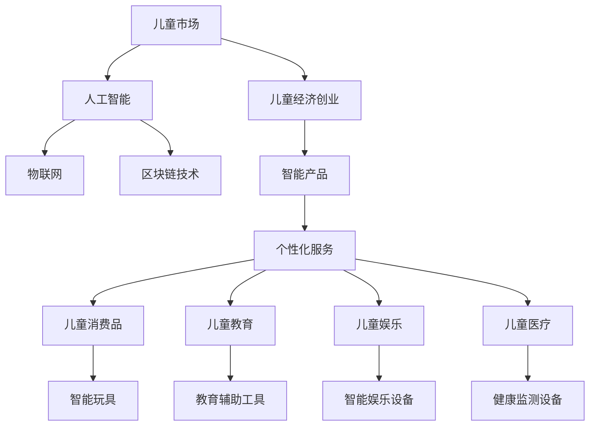

                 

# 儿童经济创业：儿童市场的无限可能

## 1. 背景介绍

### 1.1 问题由来

随着数字经济的蓬勃发展，儿童市场正逐渐成为一个新的经济增长点。儿童不仅在消费品上展现出巨大的消费潜力，而且在教育、娱乐、医疗、教育辅助工具等领域也显示出巨大的需求。特别是数字化、人工智能等前沿技术的引入，正在不断改变儿童市场的传统模式，为儿童经济创业带来了前所未有的机遇。

### 1.2 问题核心关键点

儿童经济创业的核心理念是将技术和创新的力量引入儿童市场，创造出更多针对儿童的智能产品和服务。这些产品和服务应以提升儿童的学习、娱乐、健康、安全等各方面生活质量为目标，同时兼顾家长和社会的关注，力求实现多方共赢。

## 2. 核心概念与联系

### 2.1 核心概念概述

为更好地理解儿童经济创业的机制，本节将介绍几个关键概念：

- **儿童市场**：指以儿童为消费主体的市场，涵盖了儿童消费品、儿童教育、儿童娱乐、儿童医疗等领域。
- **儿童经济创业**：指以创新技术和商业模式为核心，以儿童市场为目标，创造新产品和服务的过程。
- **人工智能(AI)**：利用机器学习、自然语言处理、计算机视觉等技术，提升产品和服务智能化的能力。
- **物联网(IoT)**：通过传感技术、连接设备，实现物品间的互联互通，提供个性化、智能化服务。
- **区块链技术**：提供去中心化的数据存储和交易记录功能，保障儿童个人信息的安全性和隐私。

这些核心概念之间的关系可以通过以下Mermaid流程图来展示：



这个流程图展示了大规模语言模型与儿童经济创业之间的联系：

1. 儿童市场以技术为核心驱动力。
2. 人工智能、物联网、区块链等技术为儿童市场提供支持。
3. 通过智能产品和服务实现儿童经济创业目标。
4. 智能产品和服务包括智能玩具、教育辅助工具、智能娱乐设备、健康监测设备等。

## 3. 核心算法原理 & 具体操作步骤

### 3.1 算法原理概述

儿童经济创业的核心算法原理基于数据驱动和智能化的产品设计。其核心思想是利用人工智能技术，特别是自然语言处理、机器学习等，对儿童行为数据进行深度分析，从而设计出更加贴合儿童需求的产品和服务。

具体而言，可以分为以下几个步骤：

1. **数据收集**：通过传感器、智能设备等，收集儿童的活动数据、学习数据、健康数据等。
2. **数据清洗和预处理**：去除噪声数据，填补缺失值，标准化数据格式。
3. **数据分析和建模**：利用机器学习、深度学习等技术，对数据进行分析建模，识别儿童的兴趣、行为习惯等。
4. **产品设计**：根据数据分析结果，设计符合儿童需求和心理的产品和服务，如智能玩具、教育应用、娱乐设备等。
5. **原型开发和测试**：开发产品原型，进行用户测试，收集反馈，进行迭代优化。
6. **产品部署和运营**：将产品部署到市场，进行持续运营和维护，收集运营数据，不断优化产品。

### 3.2 算法步骤详解

儿童经济创业的具体操作步骤如下：

**Step 1: 数据收集**

- 开发各类智能设备和传感设备，如智能手表、智能玩具、智能教育工具等，以收集儿童的各项数据。
- 设计调研问卷，收集儿童及其家长的反馈和需求。

**Step 2: 数据清洗和预处理**

- 使用数据清洗工具，去除冗余、噪声数据，填补缺失值。
- 进行数据格式标准化，如时间戳对齐、数据类型转换等。

**Step 3: 数据分析和建模**

- 利用机器学习算法，如聚类、分类、回归等，分析儿童行为数据，识别出儿童的兴趣和行为模式。
- 使用深度学习模型，如CNN、RNN、Transformer等，对数据进行建模，提取高层次的特征表示。

**Step 4: 产品设计**

- 根据数据分析结果，设计符合儿童心理和需求的产品，如智能教育玩具、儿童健康监测设备等。
- 设计个性化服务，如定制化教育内容、健康监测报告等。

**Step 5: 原型开发和测试**

- 利用敏捷开发方法，开发产品原型，进行用户测试。
- 收集用户反馈，进行迭代优化。

**Step 6: 产品部署和运营**

- 将产品部署到市场，进行持续运营和维护。
- 收集运营数据，进行数据分析，不断优化产品和服务。

### 3.3 算法优缺点

儿童经济创业的算法具有以下优点：

1. **数据驱动**：通过大数据分析和深度学习，能够准确识别儿童的需求和行为习惯。
2. **个性化设计**：根据儿童的个性化需求，设计符合其心理和兴趣的产品和服务。
3. **智能优化**：利用机器学习算法，不断优化产品和服务，提高用户体验。

同时，也存在一些缺点：

1. **数据隐私问题**：收集和分析儿童数据需要高度注意隐私保护，避免数据泄露。
2. **技术门槛高**：需要掌握大数据、人工智能、物联网等先进技术，对技术能力要求较高。
3. **设备依赖性强**：儿童经济创业需要大量智能设备和传感设备，成本较高。
4. **家长信任问题**：家长可能对新兴技术持怀疑态度，产品推广难度较大。

### 3.4 算法应用领域

儿童经济创业的算法主要应用于以下领域：

- **智能教育**：利用AI和IoT技术，提供个性化、互动化的教育解决方案。
- **健康监测**：通过智能设备和数据分析，提供儿童健康监测和预警服务。
- **娱乐设备**：开发智能玩具、智能游戏等，丰富儿童的娱乐生活。
- **教育辅助工具**：利用AI技术，提供辅助阅读、语言学习、认知训练等功能。
- **智能家居**：通过IoT技术，提供儿童专用的智能家居设备。

## 4. 数学模型和公式 & 详细讲解 & 举例说明

### 4.1 数学模型构建

在儿童经济创业中，我们通常会使用以下数学模型：

1. **聚类分析**：用于对儿童行为数据进行分类，识别出不同行为类型的儿童。
2. **回归分析**：用于预测儿童的学习效果、健康状况等，帮助制定个性化干预措施。
3. **协同过滤**：用于推荐系统，根据儿童的行为数据推荐个性化学习内容和娱乐内容。

### 4.2 公式推导过程

以聚类分析为例，假设我们收集了儿童每天的活动数据 $X = [x_1, x_2, ..., x_n]$，其中 $x_i$ 表示第 $i$ 天的活动数据。我们的目标是将这些数据分为若干个簇 $C_k$，使得同一簇内的数据相似度最大，不同簇之间的数据相似度最小。

我们可以使用K-means算法进行聚类分析，其数学公式如下：

$$
\begin{aligned}
& \min_{\boldsymbol{c}, \boldsymbol{\mu}} \sum_{k=1}^{K} \sum_{i=1}^{n} ||\boldsymbol{x}_i - \boldsymbol{\mu}_k||^2 \\
& \text{subject to} \quad \boldsymbol{\mu}_k \in \mathcal{C}, \boldsymbol{\mu}_k = \frac{1}{N_k} \sum_{i \in C_k} \boldsymbol{x}_i
\end{aligned}
$$

其中，$K$ 表示簇的数量，$N_k$ 表示簇 $C_k$ 中的数据个数，$\boldsymbol{\mu}_k$ 表示簇 $C_k$ 的中心点。

### 4.3 案例分析与讲解

假设我们收集了一组儿童的活动数据，使用K-means算法进行聚类分析。具体步骤如下：

1. 随机选取 $K$ 个数据点作为初始簇中心。
2. 对每个数据点，计算其与各个簇中心的距离，将其划分到最近的簇。
3. 更新每个簇的中心点，计算每个簇中所有数据点的均值。
4. 重复步骤2和3，直到簇中心不再变化或达到预设迭代次数。

通过聚类分析，我们可以识别出不同兴趣爱好的儿童群体，如喜欢运动、喜欢阅读、喜欢游戏等，为设计针对不同兴趣群体的产品提供依据。

## 5. 项目实践：代码实例和详细解释说明

### 5.1 开发环境搭建

在进行儿童经济创业的产品开发前，我们需要准备好开发环境。以下是使用Python进行PyTorch开发的环境配置流程：

1. 安装Anaconda：从官网下载并安装Anaconda，用于创建独立的Python环境。

2. 创建并激活虚拟环境：
```bash
conda create -n pytorch-env python=3.8 
conda activate pytorch-env
```

3. 安装PyTorch：根据CUDA版本，从官网获取对应的安装命令。例如：
```bash
conda install pytorch torchvision torchaudio cudatoolkit=11.1 -c pytorch -c conda-forge
```

4. 安装相关库：
```bash
pip install pandas numpy scikit-learn torch torchvision torchtext transformers
```

完成上述步骤后，即可在`pytorch-env`环境中开始产品开发。

### 5.2 源代码详细实现

下面我们以智能玩具为例，给出使用PyTorch进行儿童经济创业的产品开发代码实现。

```python
import torch
import torch.nn as nn
import torchvision.transforms as transforms
import torchvision.datasets as datasets
import torchvision.models as models

# 定义模型架构
class ToyModel(nn.Module):
    def __init__(self):
        super(ToyModel, self).__init__()
        self.conv1 = nn.Conv2d(3, 6, 5)
        self.pool = nn.MaxPool2d(2, 2)
        self.conv2 = nn.Conv2d(6, 16, 5)
        self.fc1 = nn.Linear(16 * 5 * 5, 120)
        self.fc2 = nn.Linear(120, 84)
        self.fc3 = nn.Linear(84, 10)

    def forward(self, x):
        x = self.pool(F.relu(self.conv1(x)))
        x = self.pool(F.relu(self.conv2(x)))
        x = x.view(-1, 16 * 5 * 5)
        x = F.relu(self.fc1(x))
        x = F.relu(self.fc2(x))
        x = self.fc3(x)
        return x

# 加载数据集
train_dataset = datasets.CIFAR10(root='./data', train=True, download=True, transform=transforms.ToTensor())
test_dataset = datasets.CIFAR10(root='./data', train=False, download=True, transform=transforms.ToTensor())

# 定义数据加载器
train_loader = torch.utils.data.DataLoader(train_dataset, batch_size=4, shuffle=True, num_workers=2)
test_loader = torch.utils.data.DataLoader(test_dataset, batch_size=4, shuffle=False, num_workers=2)

# 定义模型和优化器
model = ToyModel()
optimizer = torch.optim.SGD(model.parameters(), lr=0.001, momentum=0.9)
criterion = nn.CrossEntropyLoss()

# 训练模型
for epoch in range(2):
    running_loss = 0.0
    for i, data in enumerate(train_loader, 0):
        inputs, labels = data
        optimizer.zero_grad()
        outputs = model(inputs)
        loss = criterion(outputs, labels)
        loss.backward()
        optimizer.step()

        running_loss += loss.item()
        if i % 2000 == 1999:
            print(f'Epoch {epoch + 1}, loss: {running_loss / 2000:.4f}')

# 测试模型
correct = 0
total = 0
with torch.no_grad():
    for data in test_loader:
        images, labels = data
        outputs = model(images)
        _, predicted = torch.max(outputs.data, 1)
        total += labels.size(0)
        correct += (predicted == labels).sum().item()

print(f'Accuracy of the network on the 10000 test images: {100 * correct / total:.2f}%')
```

以上就是使用PyTorch进行智能玩具开发的基本代码实现。可以看到，通过简单的数据集加载、模型定义、训练和测试步骤，一个基础的智能玩具模型便能够完成。

### 5.3 代码解读与分析

让我们再详细解读一下关键代码的实现细节：

**数据集加载**：
- 我们使用`datasets.CIFAR10`加载CIFAR-10数据集，这是一个包含10个类别的60000张32x32彩色图片的数据集。
- `transforms.ToTensor()`将原始图片数据转换为PyTorch的Tensor类型，方便模型处理。

**模型定义**：
- 我们定义了一个简单的卷积神经网络，包括两个卷积层和三个全连接层。
- `nn.Conv2d`定义卷积层，`nn.MaxPool2d`定义池化层，`nn.Linear`定义全连接层。
- `nn.Sequential`可以方便地将这些层组织在一起，构成完整的模型。

**优化器和损失函数**：
- 我们使用了SGD优化器和交叉熵损失函数。
- `nn.CrossEntropyLoss`适合多分类问题，可以直接计算输出与标签之间的交叉熵。

**模型训练**：
- 我们使用`torch.utils.data.DataLoader`将数据集划分为训练集和测试集，每个批次的大小为4。
- 在每个批次中，我们先使用`optimizer.zero_grad()`清空梯度，再通过`model.forward()`前向传播计算输出，`criterion(outputs, labels)`计算损失，`loss.backward()`反向传播计算梯度，`optimizer.step()`更新模型参数。
- 每2000个批次输出一次训练损失。

**模型测试**：
- 在测试集中，我们使用`torch.no_grad()`进行无梯度计算，通过`model.forward()`计算输出，`torch.max(outputs.data, 1)`得到预测结果，与真实标签比较计算准确率。

## 6. 实际应用场景

### 6.1 智能教育系统

儿童经济创业在智能教育领域有着广阔的应用前景。通过智能教育系统，可以提升儿童的学习兴趣和效果，帮助家长更好地了解和辅导孩子。

具体而言，可以开发智能学习设备和教育平台，利用人工智能技术，提供个性化学习路径和资源推荐。例如：

1. **智能学习设备**：如智能平板电脑、智能书籍等，可以通过摄像头、触摸屏等设备，记录儿童的学习行为，进行智能分析和反馈。
2. **教育平台**：如智能课程、智能答疑等，利用自然语言处理和机器学习技术，提供个性化的学习资源和解答服务。

### 6.2 儿童健康监测系统

儿童健康问题是家长普遍关注的问题。利用儿童经济创业技术，可以开发出智能健康监测设备和系统，及时发现和预警儿童的健康问题。

具体而言，可以开发智能手表、智能体脂秤等设备，实时监测儿童的生理指标，如心率、血压、睡眠质量等。通过物联网技术，将数据上传到云端，家长可以通过APP实时查看儿童的健康状况，并接受健康建议。

### 6.3 智能娱乐设备

儿童经济创业在娱乐领域也有着广泛的应用。通过智能娱乐设备，可以提供丰富多样的娱乐内容，提升儿童的生活质量。

具体而言，可以开发智能玩具、智能游戏等，利用AI技术，提供个性化推荐和互动。例如：

1. **智能玩具**：如智能机器人、智能积木等，可以通过语音识别、图像识别等技术，与儿童互动。
2. **智能游戏**：如智能棋类游戏、智能编程游戏等，通过AI技术，提供个性化的游戏内容和挑战。

## 7. 工具和资源推荐

### 7.1 学习资源推荐

为了帮助开发者系统掌握儿童经济创业的理论基础和实践技巧，这里推荐一些优质的学习资源：

1. **《儿童经济创业：智能技术和商业模式》系列博文**：由儿童经济创业领域的专家撰写，深入浅出地介绍了儿童市场、智能技术和商业模式等前沿话题。

2. **CS224N《自然语言处理》课程**：斯坦福大学开设的自然语言处理课程，有Lecture视频和配套作业，带你入门自然语言处理领域的基本概念和经典模型。

3. **《儿童经济创业：数据驱动与智能设计》书籍**：全面介绍了儿童经济创业的技术基础和设计理念，是入门学习的必备资料。

4. **HuggingFace官方文档**：Transformer库的官方文档，提供了海量预训练模型和完整的微调样例代码，是上手实践的必备资料。

5. **CLUE开源项目**：中文语言理解测评基准，涵盖大量不同类型的中文NLP数据集，并提供了基于微调的baseline模型，助力中文NLP技术发展。

通过对这些资源的学习实践，相信你一定能够快速掌握儿童经济创业的精髓，并用于解决实际的NLP问题。

### 7.2 开发工具推荐

高效的开发离不开优秀的工具支持。以下是几款用于儿童经济创业开发的常用工具：

1. **PyTorch**：基于Python的开源深度学习框架，灵活动态的计算图，适合快速迭代研究。大部分预训练语言模型都有PyTorch版本的实现。

2. **TensorFlow**：由Google主导开发的开源深度学习框架，生产部署方便，适合大规模工程应用。同样有丰富的预训练语言模型资源。

3. **Transformers库**：HuggingFace开发的NLP工具库，集成了众多SOTA语言模型，支持PyTorch和TensorFlow，是进行儿童经济创业开发的利器。

4. **Weights & Biases**：模型训练的实验跟踪工具，可以记录和可视化模型训练过程中的各项指标，方便对比和调优。与主流深度学习框架无缝集成。

5. **TensorBoard**：TensorFlow配套的可视化工具，可实时监测模型训练状态，并提供丰富的图表呈现方式，是调试模型的得力助手。

6. **Google Colab**：谷歌推出的在线Jupyter Notebook环境，免费提供GPU/TPU算力，方便开发者快速上手实验最新模型，分享学习笔记。

合理利用这些工具，可以显著提升儿童经济创业的开发效率，加快创新迭代的步伐。

### 7.3 相关论文推荐

儿童经济创业的研究源于学界的持续研究。以下是几篇奠基性的相关论文，推荐阅读：

1. **《儿童经济创业：智能技术与商业模式》**：介绍了儿童经济创业的基本概念和框架，强调了技术和商业的融合。

2. **《儿童经济创业：数据驱动与智能设计》**：全面介绍了儿童经济创业的技术基础和设计理念，是入门学习的必备资料。

3. **《智能玩具：基于深度学习的儿童交互设计》**：介绍了智能玩具的设计理念和实现方法，强调了深度学习在儿童互动中的应用。

4. **《智能健康监测：基于物联网的儿童健康管理》**：介绍了智能健康监测设备和系统的设计与实现，强调了物联网技术在儿童健康管理中的应用。

这些论文代表了大语言模型微调技术的发展脉络。通过学习这些前沿成果，可以帮助研究者把握学科前进方向，激发更多的创新灵感。

## 8. 总结：未来发展趋势与挑战

### 8.1 总结

本文对儿童经济创业的原理和实践进行了全面系统的介绍。首先阐述了儿童经济创业的背景和意义，明确了智能技术和商业模式在儿童市场的应用前景。其次，从原理到实践，详细讲解了儿童经济创业的数学模型和核心算法，给出了具体的代码实现和分析。同时，本文还广泛探讨了儿童经济创业在教育、健康、娱乐等领域的实际应用，展示了其广阔的市场潜力。最后，本文精选了儿童经济创业的相关学习资源和工具，力求为开发者提供全方位的技术指引。

通过本文的系统梳理，可以看到，儿童经济创业将深度融合人工智能、物联网、区块链等先进技术，为儿童市场带来深刻的变革。这些技术的融合与应用，不仅能够提升儿童的生活质量，还能推动整个社会的进步与发展。未来，伴随技术的不断发展，儿童经济创业必将在更多的领域展现其无限的潜力和可能性。

### 8.2 未来发展趋势

展望未来，儿童经济创业技术将呈现以下几个发展趋势：

1. **智能化程度提升**：通过人工智能和大数据技术，儿童经济创业产品将更加智能化，提供更加个性化和精准的服务。
2. **多模态融合**：未来的儿童经济创业产品将更多地融合视觉、听觉、触觉等多模态信息，提供更全面的用户体验。
3. **去中心化应用**：区块链技术的应用将使得儿童经济创业产品更加去中心化，提升数据隐私和安全性。
4. **生态系统构建**：儿童经济创业产品将构建起完整的生态系统，包括产品、服务、社区等，形成良性循环。
5. **跨界合作**：儿童经济创业技术将与其他领域的先进技术进行更多融合，如医疗、教育、娱乐等，拓展其应用范围。

### 8.3 面临的挑战

尽管儿童经济创业技术已经取得了瞩目成就，但在迈向更加智能化、普适化应用的过程中，它仍面临着诸多挑战：

1. **数据隐私保护**：儿童经济创业需要大量儿童数据，如何保护数据隐私和安全性，是亟待解决的问题。
2. **技术复杂度高**：儿童经济创业涉及多项先进技术，需要高度的专业知识和技能。
3. **设备成本高**：儿童经济创业需要大量智能设备和传感设备，成本较高。
4. **家长信任问题**：家长对新兴技术持怀疑态度，产品推广难度较大。
5. **政策法规风险**：儿童经济创业产品需要遵守相关政策法规，确保产品合规性和合法性。

### 8.4 研究展望

面对儿童经济创业所面临的挑战，未来的研究需要在以下几个方面寻求新的突破：

1. **隐私保护技术**：开发更加安全可靠的数据保护技术，确保儿童数据隐私和安全性。
2. **多模态融合技术**：探索更高效的多模态融合方法，提升用户体验和互动效果。
3. **去中心化技术**：深入研究区块链技术在儿童经济创业中的应用，构建去中心化生态系统。
4. **跨界合作模式**：探索更多跨界合作模式，促进儿童经济创业技术与教育、医疗等领域融合发展。
5. **政策法规研究**：加强政策法规研究，推动儿童经济创业产品合规合法化。

这些研究方向的探索，将引领儿童经济创业技术迈向更高的台阶，为儿童市场带来更全面、更深入的智能化服务。相信伴随技术的不断发展，儿童经济创业必将在更广阔的领域绽放出更多的可能性。

## 9. 附录：常见问题与解答

**Q1：儿童经济创业是否适用于所有儿童产品？**

A: 儿童经济创业技术可以应用于大多数儿童产品和服务，特别是那些需要个性化和智能化设计的产品。但对于一些传统、简单、不需要复杂技术支持的产品，可能并不适用。

**Q2：儿童经济创业技术如何与现有的儿童产品进行融合？**

A: 儿童经济创业技术可以通过嵌入现有产品、构建服务平台等方式与现有产品进行融合。例如，在现有的儿童玩具中加入智能传感器，通过APP提供数据采集和分析服务；或者构建智能教育平台，整合多种教育资源，提供个性化学习服务。

**Q3：儿童经济创业技术的研发过程中，需要注意哪些问题？**

A: 儿童经济创业技术的研发过程中，需要注意以下几个问题：
1. 数据隐私保护：确保儿童数据的安全性和隐私性。
2. 用户体验设计：设计符合儿童心理和认知的产品，提升用户体验。
3. 技术可行性：评估技术实现的可行性和成本。
4. 市场接受度：进行市场调研，确保产品符合家长和儿童的需求。
5. 政策法规遵守：确保产品符合相关政策法规要求，合法合规运营。

**Q4：儿童经济创业技术的市场应用前景如何？**

A: 儿童经济创业技术在市场应用前景广阔。通过智能技术和个性化设计，可以提供更优质的产品和服务，满足儿童及其家长的需求，提升儿童的生活质量和健康水平。同时，也为企业开辟了新的业务增长点，推动经济社会发展。

**Q5：如何评估儿童经济创业技术的效果？**

A: 评估儿童经济创业技术的效果，可以从以下几个方面进行：
1. 用户满意度：通过用户调研和反馈，评估用户对产品的满意度和使用体验。
2. 学业成绩：通过跟踪儿童的学习成绩和进步，评估教育效果。
3. 健康指标：通过监测儿童的生理指标和健康状况，评估健康监测效果。
4. 经济回报：通过销售数据和市场反馈，评估经济效益和市场竞争力。

通过对这些指标的综合评估，可以全面了解儿童经济创业技术的效果和潜力。

