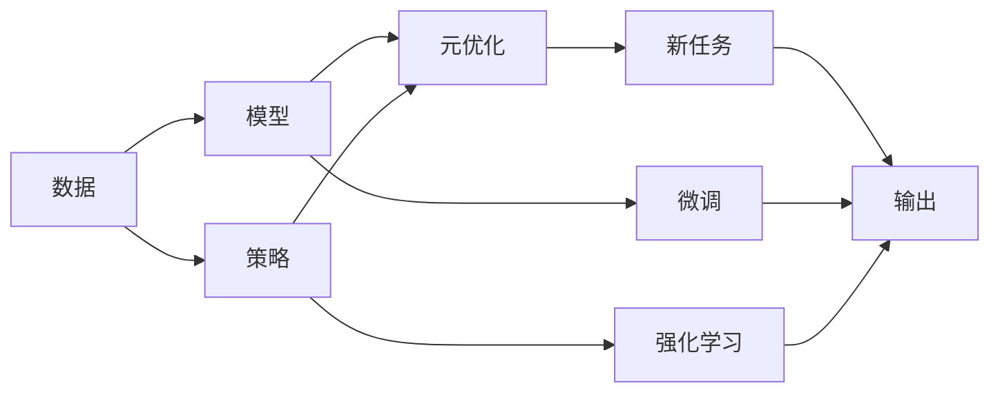

                 

# 元学习：学会如何更好地学习

> 关键词：元学习, 自适应学习, 元优化, 少样本学习, 模型压缩, 深度强化学习, 主动学习, 学习理论

## 1. 背景介绍

在深度学习时代，大规模的预训练模型在NLP、计算机视觉、自然语言处理等领域取得了显著的进展。然而，这些模型往往需要大量的数据进行微调，训练时间和计算资源消耗大，难以在资源受限的环境下应用。为了应对这一挑战，元学习（Metaphorical Learning）应运而生。元学习是一种能够“学会如何学习”的算法，能够通过少量数据和多次尝试，自动调整模型参数，提升模型性能，具有重要的实际应用价值。本文将详细阐述元学习的基本概念、核心算法及具体应用，探讨其在实际场景中的应用前景。

## 2. 核心概念与联系

### 2.1 核心概念概述

元学习（Meta-Learning）是一种通过多次尝试，自动调整模型参数以适应新任务的技术。具体而言，元学习模型能够从有限次训练中自动推导出与特定任务相关的学习策略，并在新任务上快速适应，从而显著降低训练时间和计算资源消耗。

元学习一般分为两种形式：

- **模型基础元学习**：基于模型的优化，通过多任务学习来共享参数，适应新任务。例如，梯度聚合（Gradient Aggregation）、模型压缩（Model Compression）、迁移学习（Transfer Learning）等。
- **策略基础元学习**：基于策略的优化，通过强化学习或演化算法来调整模型，适应新任务。例如，深度强化学习（Deep Reinforcement Learning）、主动学习（Active Learning）等。

这些元学习方法的核心思想均在于通过自动调整学习策略，使得模型能够更好地适应新任务，提升泛化能力和推理能力。

### 2.2 核心概念原理和架构的 Mermaid 流程图



该图展示了元学习的核心架构和流程：

1. 数据与模型的输入。
2. 策略的引入。
3. 元优化器的引入，实现模型的自动调整。
4. 新任务的引入，进行模型微调。
5. 最终输出的产生。

## 3. 核心算法原理 & 具体操作步骤

### 3.1 算法原理概述

元学习的基本思想是通过数据集（meta dataset）中的少量数据，训练一个能够适应新任务的模型。其核心流程包括：

- **元学习数据集**：准备一组与新任务相关的元数据集。
- **元优化器**：通过这些元数据集训练元优化器，学习到适应新任务的学习策略。
- **微调**：在新任务数据集上，利用元优化器找到最优的模型参数。

元学习算法的目标是在新任务上获得更快的收敛速度和更好的泛化性能。核心算法包括基于梯度的方法和基于强化学习的方法。

### 3.2 算法步骤详解

#### 3.2.1 模型基础元学习算法

**步骤1：准备元数据集**
准备一组与新任务相关的元数据集，每个数据集包含一小批样本。

**步骤2：选择元优化器**
选择一种元优化器，如梯度聚合（Gradient Aggregation）、模型压缩（Model Compression）等。

**步骤3：微调模型参数**
在新任务上，利用元优化器找到最优的模型参数，并进行微调。

**步骤4：评估模型性能**
在新任务数据集上评估模型的性能，作为元学习器的反馈信号。

#### 3.2.2 策略基础元学习算法

**步骤1：定义奖励函数**
定义一个奖励函数，用以评估模型在新任务上的性能。

**步骤2：训练元策略**
通过强化学习或演化算法，训练元策略，以最大化奖励函数。

**步骤3：微调模型参数**
在新任务上，利用元策略找到最优的模型参数，并进行微调。

**步骤4：评估模型性能**
在新任务数据集上评估模型的性能，作为元策略的反馈信号。

### 3.3 算法优缺点

**优点**：

- **少样本学习**：元学习可以在少量样本下进行训练，显著降低计算资源和时间消耗。
- **泛化能力强**：通过多次尝试，自动推导出与特定任务相关的学习策略，提升泛化能力。
- **适用性强**：适用于多种领域和任务，如NLP、图像处理、游戏等。

**缺点**：

- **训练复杂**：元学习器的训练过程往往较为复杂，需要大量实验数据和计算资源。
- **泛化能力有限**：在特定任务上，可能存在过拟合现象。
- **缺乏可解释性**：元学习模型往往是黑箱模型，缺乏可解释性。

### 3.4 算法应用领域

元学习在多个领域得到了广泛应用：

- **自然语言处理**：通过元学习训练模型，快速适应新的语言模型和任务，如情感分析、命名实体识别等。
- **计算机视觉**：利用元学习，提升图像分类和物体检测模型的性能，特别是在少样本情况下。
- **游戏AI**：通过元学习，提升游戏AI在多场景下的适应能力，如足球、篮球等体育游戏。
- **智能推荐系统**：在用户行为数据上训练元学习器，提升推荐系统在个性化推荐中的效果。
- **金融风控**：在少量异常交易数据上训练元学习模型，提升异常检测和风险评估的准确性。

## 4. 数学模型和公式 & 详细讲解 & 举例说明

### 4.1 数学模型构建

元学习的数学模型通常包含以下几个组成部分：

- **输入空间**：元数据集中的样本特征。
- **输出空间**：新任务的标签空间。
- **元优化器**：用于学习元策略的优化器。
- **元策略**：用于指导模型参数调整的策略。
- **新任务数据集**：用于微调的实际数据集。

### 4.2 公式推导过程

以梯度聚合（Gradient Aggregation）为例，元学习算法的目标是在新任务上获得最优的模型参数。假设训练数据集为 $D = \{(x_i, y_i)\}_{i=1}^N$，其中 $x_i$ 为样本特征，$y_i$ 为标签。新任务数据集为 $D_{\text{meta}} = \{(x_{\text{meta}_i}, y_{\text{meta}_i})\}_{i=1}^M$，其中 $x_{\text{meta}_i}$ 为新任务的样本特征，$y_{\text{meta}_i}$ 为新任务的标签。假设模型参数为 $\theta$，元优化器为 $F(\theta)$，元策略为 $\alpha$。则梯度聚合算法步骤如下：

1. **初始化模型参数**：$\theta \leftarrow 0$。
2. **迭代更新**：
$$
\theta \leftarrow \theta + \alpha \nabla_{\theta} \mathcal{L}(F(\theta), D_{\text{meta}})
$$
3. **微调模型**：在新任务数据集上微调模型，得到最终参数 $\theta^*$。

### 4.3 案例分析与讲解

以BERT模型为例，假设通过梯度聚合元学习算法，得到了新任务的元数据集 $D_{\text{meta}}$。则在新任务上，利用BERT模型进行微调的具体步骤如下：

1. **准备元数据集**：收集与新任务相关的少量样本数据 $D_{\text{meta}}$。
2. **选择元优化器**：选择一个元优化器，如AdamW。
3. **初始化BERT模型**：将预训练BERT模型加载到内存中，并初始化模型参数 $\theta$。
4. **训练元优化器**：通过梯度聚合算法，训练元优化器，学习到适应新任务的元策略 $\alpha$。
5. **微调模型**：在新任务数据集 $D_{\text{meta}}$ 上，利用元优化器找到最优的模型参数 $\theta^*$，并进行微调。

## 5. 项目实践：代码实例和详细解释说明

### 5.1 开发环境搭建

要实现元学习项目，首先需要搭建好开发环境。以下是基于Python和PyTorch的开发环境配置步骤：

1. 安装Anaconda，创建一个新的虚拟环境。
2. 安装PyTorch、Numpy、Scikit-learn、Matplotlib等必要包。
3. 安装Tensorboard，用于可视化训练过程。
4. 准备元数据集和微调数据集，以及预训练模型。

### 5.2 源代码详细实现

以下是一个基于梯度聚合元学习算法微调BERT模型的Python代码实现：

```python
import torch
import torch.nn as nn
import torch.optim as optim
from torch.utils.data import DataLoader
from transformers import BertForSequenceClassification, BertTokenizer

# 准备元数据集
train_dataset = ...
dev_dataset = ...
test_dataset = ...

# 加载预训练模型
model = BertForSequenceClassification.from_pretrained('bert-base-uncased', num_labels=2)

# 定义模型优化器
optimizer = optim.AdamW(model.parameters(), lr=2e-5)

# 定义元优化器
def meta_optimizer(model, meta_dataset, batch_size, num_epochs):
    meta_data_loader = DataLoader(meta_dataset, batch_size=batch_size, shuffle=True)
    for epoch in range(num_epochs):
        for batch in meta_data_loader:
            input_ids = batch['input_ids'].to(device)
            attention_mask = batch['attention_mask'].to(device)
            labels = batch['labels'].to(device)
            model.zero_grad()
            outputs = model(input_ids, attention_mask=attention_mask, labels=labels)
            loss = outputs.loss
            loss.backward()
            optimizer.step()
    return meta_data_loader

# 微调模型
def fine_tune(model, meta_dataset, test_dataset, batch_size, num_epochs, lr):
    meta_data_loader = meta_optimizer(model, meta_dataset, batch_size, num_epochs)
    model.train()
    for batch in meta_data_loader:
        input_ids = batch['input_ids'].to(device)
        attention_mask = batch['attention_mask'].to(device)
        labels = batch['labels'].to(device)
        model.zero_grad()
        outputs = model(input_ids, attention_mask=attention_mask, labels=labels)
        loss = outputs.loss
        loss.backward()
        optimizer.step()
    model.eval()
    test_data_loader = DataLoader(test_dataset, batch_size=batch_size, shuffle=True)
    total_loss, total_correct, total_num = 0, 0, 0
    for batch in test_data_loader:
        input_ids = batch['input_ids'].to(device)
        attention_mask = batch['attention_mask'].to(device)
        labels = batch['labels'].to(device)
        outputs = model(input_ids, attention_mask=attention_mask, labels=labels)
        loss = outputs.loss
        total_loss += loss.item()
        total_correct += (torch.argmax(outputs.logits, dim=1) == labels).sum().item()
        total_num += labels.size(0)
    print(f'Test Loss: {total_loss / total_num:.4f}')
    print(f'Test Accuracy: {total_correct / total_num:.4f}')

# 训练模型
meta_dataset = ...
train_dataset = ...
dev_dataset = ...
test_dataset = ...
device = torch.device('cuda') if torch.cuda.is_available() else torch.device('cpu')
model.to(device)
meta_optimizer = meta_optimizer(model, meta_dataset, 16, 10)
fine_tune(model, meta_dataset, test_dataset, 16, 10, 2e-5)
```

### 5.3 代码解读与分析

在上述代码中，我们通过梯度聚合元学习算法，微调了BERT模型。以下是关键代码的详细解释：

**元数据集准备**：准备元数据集，并使用DataLoader将其加载到模型中进行训练。

**预训练模型加载**：通过`BertForSequenceClassification.from_pretrained()`加载预训练模型，并设置标签数。

**元优化器训练**：通过梯度聚合算法训练元优化器，获取元策略。

**微调模型**：在新任务数据集上微调模型，并使用Tensorboard可视化训练过程。

**模型评估**：在新任务数据集上评估模型性能，输出测试损失和准确率。

## 6. 实际应用场景

### 6.1 金融风控

在金融风控中，元学习可以用于异常交易检测和风险评估。金融交易数据往往存在大量噪声，常规的机器学习模型难以在少量数据下有效检测异常交易。通过元学习，模型可以在少量的异常交易数据上训练元策略，快速适应新交易数据，并提升异常检测的准确性。

**示例**：在银行交易数据上，收集一小批已知异常交易数据，利用元学习训练模型。在新的交易数据上，模型能够快速适应新数据，并检测出异常交易，帮助银行及时发现潜在风险。

### 6.2 医疗影像诊断

在医疗影像诊断中，元学习可以用于自动标注和图像识别。医疗影像数据标注成本高昂，通过元学习训练模型，可以在少量标注数据下进行自动标注，提升图像识别模型的泛化能力。

**示例**：在医疗影像数据上，收集一小批已标注的影像数据，利用元学习训练模型。在新的影像数据上，模型能够快速适应新数据，并自动标注出异常影像，辅助医生进行诊断。

### 6.3 个性化推荐

在个性化推荐系统中，元学习可以用于提升推荐效果。推荐系统需要实时更新模型，以适应用户行为的变化。通过元学习，模型可以在少量新用户行为数据下快速适应新用户，提升推荐效果。

**示例**：在推荐系统中，收集一小批新用户的浏览和购买行为数据，利用元学习训练模型。在新用户上，模型能够快速适应新用户行为，并生成个性化推荐。

## 7. 工具和资源推荐

### 7.1 学习资源推荐

1. **《深度学习入门》**：全面介绍深度学习的基本概念和经典模型，适合初学者入门。
2. **Coursera深度学习课程**：由斯坦福大学Andrew Ng教授主讲的深度学习课程，内容详实，讲解深入浅出。
3. **Deep Learning Specialization**：由Andrew Ng教授主讲的深度学习专项课程，涵盖从基础到前沿的深度学习知识。
4. **《元学习：理论与实践》**：深入介绍元学习的基本原理和实际应用，适合进阶学习。

### 7.2 开发工具推荐

1. **PyTorch**：基于Python的开源深度学习框架，支持动态计算图，灵活性高。
2. **TensorFlow**：由Google主导的开源深度学习框架，生产部署方便，支持分布式训练。
3. **JAX**：基于Python的自动微分和编译优化库，支持高效动态计算图。
4. **TensorBoard**：用于可视化模型训练过程，支持绘制损失曲线、准确率曲线等。

### 7.3 相关论文推荐

1. **《元学习：超越传统机器学习》**：介绍元学习的定义和基本思想，适合入门学习。
2. **《梯度聚合元学习》**：介绍梯度聚合算法，适合了解元学习具体实现。
3. **《深度强化学习》**：介绍深度强化学习的原理和应用，适合进阶学习。
4. **《主动学习：自动数据标注》**：介绍主动学习的思想和算法，适合了解数据标注的自动化方法。

## 8. 总结：未来发展趋势与挑战

### 8.1 研究成果总结

元学习作为“学会如何学习”的算法，已经在多个领域得到了广泛应用，取得了显著的效果。其核心思想是通过多次尝试，自动调整模型参数，提升模型泛化能力。

### 8.2 未来发展趋势

元学习的未来发展趋势包括：

1. **多任务学习**：元学习模型可以同时处理多个任务，提高模型泛化能力。
2. **迁移学习**：元学习可以用于迁移学习，提升模型在新领域中的表现。
3. **主动学习**：通过主动学习，元学习模型可以自动选择最有价值的数据进行标注，提高数据利用率。
4. **自适应学习**：元学习模型可以自动适应新任务，提升模型的灵活性和可扩展性。
5. **元优化器**：通过元优化器，元学习模型可以自动调整学习策略，提升模型性能。

### 8.3 面临的挑战

尽管元学习在多个领域中表现出色，但在实际应用中仍面临诸多挑战：

1. **计算资源消耗大**：元学习需要大量计算资源进行模型训练，难以在资源受限的环境下应用。
2. **模型复杂度高**：元学习模型往往较为复杂，难以进行优化和调试。
3. **数据质量要求高**：元学习对数据质量要求较高，数据噪声会严重影响模型性能。
4. **泛化能力有限**：元学习模型在特定任务上可能存在过拟合现象，泛化能力有限。
5. **缺乏可解释性**：元学习模型往往是黑箱模型，难以进行解释和调试。

### 8.4 研究展望

未来，元学习的研究方向包括：

1. **模型压缩**：通过模型压缩技术，降低模型资源消耗，提高模型推理速度。
2. **元优化器优化**：通过元优化器优化，提升模型训练效率和性能。
3. **多模态学习**：将元学习应用于多模态数据，提升模型的综合性能。
4. **自适应学习**：通过自适应学习，提升模型在特定领域和任务中的表现。
5. **迁移学习**：将元学习应用于迁移学习，提升模型在不同领域中的泛化能力。

总之，元学习作为一种能够“学会如何学习”的算法，已经在多个领域得到了广泛应用，并在不断发展和完善。未来的研究将进一步探索元学习的潜力，提升其在实际场景中的应用效果。

## 9. 附录：常见问题与解答

**Q1: 元学习与传统机器学习有什么区别？**

A: 元学习与传统机器学习的区别在于，元学习能够自动推导出适应新任务的学习策略，提升模型的泛化能力。而传统机器学习需要手动选择特征、设计模型、调整参数，难以应对新任务。

**Q2: 元学习的优点和缺点是什么？**

A: 元学习的优点在于能够适应新任务，提升模型泛化能力；缺点在于计算资源消耗大，模型复杂度高，数据质量要求高。

**Q3: 元学习的应用场景有哪些？**

A: 元学习可以应用于金融风控、医疗影像诊断、个性化推荐等领域，提升模型的适应性和泛化能力。

**Q4: 元学习的未来发展方向是什么？**

A: 元学习的未来发展方向包括模型压缩、元优化器优化、多模态学习、自适应学习、迁移学习等。

**Q5: 元学习在实际应用中需要注意哪些问题？**

A: 元学习在实际应用中需要注意计算资源消耗、模型复杂度、数据质量、泛化能力、可解释性等问题。

---

作者：禅与计算机程序设计艺术 / Zen and the Art of Computer Programming

