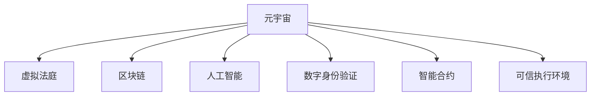

                 

# 元宇宙中的虚拟法庭：跨国纠纷解决的新平台

> 关键词：元宇宙,虚拟法庭,跨国纠纷解决,区块链,人工智能,数字身份验证,智能合约,可信执行环境

## 1. 背景介绍

### 1.1 问题由来

随着全球化的深入发展，跨国经济活动日益频繁，纠纷解决成为企业跨国经营过程中不可避免的问题。传统的纠纷解决方式，如诉讼、仲裁等，存在时间成本高、费用昂贵、效率低下等问题。与此同时，传统的线下处理方式在处理跨国纠纷时，也面临着语言障碍、司法体系差异、执行难等挑战。因此，利用现代信息技术，构建更为高效、便捷、低成本的纠纷解决平台，成为当前国际社会的共同需求。

### 1.2 问题核心关键点

元宇宙作为继Web2.0之后的互联网新阶段，凭借其沉浸式、互动性、去中心化等特点，为构建一种全新的跨国纠纷解决机制提供了可能。元宇宙法庭（Metaverse Courts）的概念由此诞生。元宇宙法庭通过在虚拟世界中建立基于区块链、人工智能、数字身份验证等技术的纠纷解决平台，旨在提供一种更为高效、便捷、透明的跨国纠纷解决新方式。

## 2. 核心概念与联系

### 2.1 核心概念概述

为了更好地理解元宇宙法庭的构建原理和工作机制，本节将介绍几个核心概念及其之间的联系：

- **元宇宙（Metaverse）**：一个由数字平台构建的虚拟世界，用户可以通过VR、AR、MR等设备沉浸式地体验和交互。
- **虚拟法庭（Metaverse Courts）**：基于元宇宙平台，通过区块链技术、人工智能算法和数字身份验证机制，构建的一种全新的跨国纠纷解决平台。
- **区块链技术（Blockchain）**：一种去中心化的分布式账本技术，具有不可篡改、透明、可追溯等特性。
- **人工智能（AI）**：通过机器学习、自然语言处理等技术，实现智能决策、智能调解等功能。
- **数字身份验证（Digital Identity Verification）**：通过区块链、生物特征识别等技术，验证用户数字身份的真实性，确保交易和纠纷处理的可信性。
- **智能合约（Smart Contracts）**：一种基于区块链技术的自动化合约，通过代码实现合约条款，自动执行和监督合约履行。
- **可信执行环境（Trusted Execution Environment, TEE）**：一种安全计算环境，可以隔离和保护代码和数据，确保计算的安全性。

这些核心概念之间的逻辑关系可以通过以下Mermaid流程图来展示：



这个流程图展示了元宇宙法庭构建的关键技术：

1. **元宇宙**：作为底层基础设施，提供沉浸式、去中心化的虚拟空间。
2. **区块链**：为虚拟法庭提供数据透明、不可篡改的交易记录。
3. **人工智能**：提供智能决策和调解功能，提升纠纷解决的效率和准确性。
4. **数字身份验证**：确保用户身份的真实性，保障虚拟法庭的安全性。
5. **智能合约**：实现自动化的合约执行和监督，降低纠纷解决的时间和成本。
6. **可信执行环境**：隔离和保护敏感数据和代码，确保虚拟法庭的计算安全。

这些技术相辅相成，共同构建了元宇宙法庭的高效、便捷、透明的纠纷解决机制。

## 3. 核心算法原理 & 具体操作步骤

### 3.1 算法原理概述

元宇宙法庭的构建，本质上是一种基于区块链和人工智能的智能合约系统。其核心算法原理如下：

1. **区块链技术**：确保数据透明、不可篡改，为纠纷处理提供可信的基础记录。
2. **人工智能算法**：通过自然语言处理（NLP）、机器学习等技术，实现智能调解、智能合约执行等功能。
3. **智能合约**：自动执行和监督合约条款，提升纠纷解决的效率和透明度。

### 3.2 算法步骤详解

元宇宙法庭的构建包括以下几个关键步骤：

**Step 1: 构建元宇宙平台**

元宇宙法庭首先需要在一个开放的元宇宙平台上构建，例如使用Unity、Unreal Engine等引擎开发的虚拟世界。平台需要具备高度的开放性、可扩展性和安全性，以便于后续的功能模块的接入和数据的安全存储。

**Step 2: 设计虚拟法庭架构**

设计虚拟法庭的基本架构，包括用户界面、交易记录、智能合约、可信执行环境等关键组件。用户界面需要简洁友好，易于用户操作。交易记录需要具备区块链的特性，不可篡改、透明。智能合约需要具备自动执行和监督的功能，确保合约条款的严格履行。可信执行环境用于隔离和保护敏感数据和代码，确保计算的安全性。

**Step 3: 集成区块链技术**

将区块链技术集成到虚拟法庭中，确保交易记录的不可篡改性和透明性。可以使用以太坊、Binance Smart Chain等公有区块链平台，或搭建私有区块链网络，根据实际需求选择合适的区块链方案。

**Step 4: 开发智能合约**

根据纠纷解决的需求，开发相应的智能合约，包括纠纷提交、调解、仲裁、执行等功能模块。智能合约可以采用Solidity、SCALAL等编程语言进行开发，确保合约的自动执行和监督。

**Step 5: 引入人工智能**

引入人工智能技术，开发自然语言处理（NLP）、机器学习等算法，实现智能调解、智能合约执行等功能。可以使用TensorFlow、PyTorch等深度学习框架，开发相关算法模型。

**Step 6: 实现数字身份验证**

开发数字身份验证模块，通过区块链和生物特征识别等技术，验证用户身份的真实性。可以采用Web3.0技术，实现去中心化的数字身份管理。

**Step 7: 部署可信执行环境**

部署可信执行环境，用于隔离和保护敏感数据和代码，确保虚拟法庭的计算安全。可信执行环境可以基于TEE技术，提供硬件隔离和加密保护。

**Step 8: 用户界面设计**

设计友好的用户界面，使用户能够轻松地提交纠纷、查看记录、选择调解或仲裁方案等。用户界面需要具备易用性、可扩展性和安全性，支持多语言界面。

**Step 9: 系统测试和部署**

对虚拟法庭系统进行全面测试，包括功能测试、性能测试、安全性测试等，确保系统的稳定性和安全性。测试通过后，将系统部署到元宇宙平台，供用户使用。

### 3.3 算法优缺点

元宇宙法庭的构建具有以下优点：

1. **高效便捷**：利用区块链和人工智能技术，大幅提升了纠纷解决的效率和便捷性。
2. **透明可信**：区块链技术保证了交易记录的透明性和不可篡改性，增强了系统的可信度。
3. **低成本**：无需传统诉讼或仲裁的高昂费用，降低了纠纷解决的成本。
4. **跨地域适用**：不受地理和法律限制，适用于跨国纠纷解决。

同时，元宇宙法庭也存在以下局限性：

1. **技术门槛高**：构建虚拟法庭需要较高的技术门槛，需要跨领域的知识和技术支持。
2. **法律合规问题**：需要考虑到不同司法体系的法律合规问题，确保系统在各地的合法性。
3. **技术依赖性**：依赖于区块链和人工智能等技术的稳定性和安全性，存在技术风险。

### 3.4 算法应用领域

元宇宙法庭的应用领域非常广泛，包括但不限于：

- **跨国商务纠纷**：适用于跨国企业之间的合同纠纷、贸易纠纷等。
- **知识产权纠纷**：适用于专利、版权、商标等知识产权相关纠纷。
- **劳动争议**：适用于跨国公司的员工与企业之间的劳动争议。
- **金融纠纷**：适用于跨国金融机构的合同纠纷、金融欺诈等。
- **房地产纠纷**：适用于跨国房地产交易中的合同纠纷、土地权属争议等。
- **医疗纠纷**：适用于跨国医疗机构中的医疗纠纷。

## 4. 数学模型和公式 & 详细讲解  
### 4.1 数学模型构建

元宇宙法庭的构建涉及多个数学模型的设计和应用。以下将以智能合约和智能调解为例，构建相应的数学模型。

**智能合约模型**：

假设智能合约的代码逻辑可以表示为 $f(x)$，其中 $x$ 表示输入参数，$f(x)$ 表示智能合约的输出结果。智能合约的功能包括纠纷提交、调解、仲裁和执行等，可以分别建模为不同的数学函数。

**智能调解模型**：

假设智能调解模型为神经网络模型，其输入为纠纷描述 $d$，输出为调解结果 $r$。智能调解模型的目标函数可以表示为：

$$
\min_{\theta} \sum_{i=1}^n \ell(d_i, r_i)
$$

其中 $d_i$ 表示第 $i$ 个纠纷描述，$r_i$ 表示第 $i$ 个纠纷的调解结果，$\ell(\cdot)$ 表示损失函数，$\theta$ 表示神经网络模型的参数。

### 4.2 公式推导过程

以智能合约的纠纷提交模块为例，其代码逻辑可以表示为：

$$
f(x) = 
\begin{cases}
1, & \text{如果纠纷描述符合合同条款} \\
0, & \text{否则}
\end{cases}
$$

其中 $x$ 表示纠纷描述，$f(x)$ 表示智能合约的输出结果。

对于智能调解模型，假设其使用多层感知器（MLP）模型，其结构可以表示为：

$$
r = h_W h_V h_U h_b(x)
$$

其中 $x$ 表示纠纷描述，$r$ 表示调解结果，$h_W$、$h_V$、$h_U$ 表示不同的神经网络层，$h_b$ 表示激活函数，$W$、$V$、$U$ 表示各个层的权重参数，$b$ 表示偏置参数。

对于智能合约的执行模块，可以使用智能合约平台提供的API接口进行编程实现，其执行逻辑可以表示为：

$$
r = f(x, \text{API}(\text{contract\_address}))
$$

其中 $x$ 表示纠纷描述，$r$ 表示执行结果，$\text{contract\_address}$ 表示智能合约的地址。

### 4.3 案例分析与讲解

假设某跨国公司A与公司B签订了一份贸易合同，约定如果B在规定时间内未发货，A有权终止合同并要求赔偿。双方在元宇宙法庭上提交了纠纷申请，经过智能调解模型的分析，调解结果为终止合同并赔偿损失。智能合约平台根据调解结果自动执行了相应的智能合约，公司A获得了赔偿。

## 5. 项目实践：代码实例和详细解释说明

### 5.1 开发环境搭建

在进行元宇宙法庭的开发前，需要先搭建相应的开发环境。以下是使用Python进行Web3.0开发的环境配置流程：

1. 安装Anaconda：从官网下载并安装Anaconda，用于创建独立的Python环境。

2. 创建并激活虚拟环境：
```bash
conda create -n web3-env python=3.8 
conda activate web3-env
```

3. 安装Web3.py：用于连接和交互以太坊等区块链平台。
```bash
pip install web3
```

4. 安装相关区块链平台API：
```bash
pip install pyethereum
```

5. 安装TensorFlow和PyTorch：用于构建和训练智能合约和智能调解模型。
```bash
pip install tensorflow==2.5
pip install torch==1.9
```

6. 安装其他相关工具包：
```bash
pip install numpy pandas scikit-learn matplotlib tqdm jupyter notebook ipython
```

完成上述步骤后，即可在`web3-env`环境中开始元宇宙法庭的开发。

### 5.2 源代码详细实现

下面我们以智能合约纠纷提交模块为例，给出使用Web3.py和TensorFlow进行元宇宙法庭开发的PyTorch代码实现。

首先，定义智能合约纠纷提交模块的函数：

```python
from web3 import Web3
import tensorflow as tf

def submit_fault_case(fault_description, contract_address):
    # 连接以太坊节点
    web3 = Web3(Web3.HTTPProvider('https://mainnet.infura.io/v3/{YOUR_INFURA_API_KEY}'))
    contract = web3.eth.contract(address=contract_address, abi=abi_json)
    
    # 提交纠纷信息
    input_data = [fault_description, contract.functions.submitFaultCase(fault_description).call()]
    tx_hash = contract.functions.submitFaultCase(fault_description).transact({'from': web3.eth.accounts[0], 'gasPrice': web3.eth.gasPrice, 'gas': 1000000})
    tx_receipt = web3.eth.waitForTransactionReceipt(tx_hash)
    
    return tx_receipt
```

然后，定义智能调解模型的训练函数：

```python
from tensorflow.keras.layers import Input, Dense, Dropout, Activation
from tensorflow.keras.models import Model
import tensorflow as tf

def build_smart_contrac_model():
    input_layer = Input(shape=(max_seq_length,))
    x = Dense(256, activation='relu')(input_layer)
    x = Dropout(0.5)(x)
    x = Dense(128, activation='relu')(x)
    x = Dropout(0.5)(x)
    output_layer = Dense(1, activation='sigmoid')(x)
    
    model = Model(inputs=input_layer, outputs=output_layer)
    model.compile(optimizer='adam', loss='binary_crossentropy', metrics=['accuracy'])
    return model
```

最后，启动训练流程并在元宇宙平台部署：

```python
# 假设max_seq_length为输入纠纷描述的最大长度
max_seq_length = 512

# 假设abi_json为智能合约的ABI接口定义
abi_json = '{"...

# 假设training_data为训练数据，test_data为测试数据
training_data = ...
test_data = ...

# 定义训练参数
epochs = 10
batch_size = 64

# 构建和训练模型
model = build_smart_contrac_model()
model.fit(training_data, epochs=epochs, batch_size=batch_size, validation_data=test_data)

# 部署模型
...
```

以上就是使用Web3.py和TensorFlow构建元宇宙法庭智能合约纠纷提交模块的完整代码实现。可以看到，通过Web3.py，我们可以方便地连接和交互以太坊等区块链平台，使用TensorFlow构建和训练智能合约和智能调解模型，从而实现元宇宙法庭的纠纷提交功能。

### 5.3 代码解读与分析

让我们再详细解读一下关键代码的实现细节：

**智能合约纠纷提交模块**：
- `submit_fault_case`函数：连接以太坊节点，提交纠纷信息到智能合约平台。
- `web3 = Web3(Web3.HTTPProvider('https://mainnet.infura.io/v3/{YOUR_INFURA_API_KEY}'))`：连接以太坊主网。
- `contract = web3.eth.contract(address=contract_address, abi=abi_json)`：通过ABI接口定义，创建智能合约对象。
- `input_data = [fault_description, contract.functions.submitFaultCase(fault_description).call()]`：构造输入数据，调用智能合约的submitFaultCase函数提交纠纷。
- `tx_hash = contract.functions.submitFaultCase(fault_description).transact({'from': web3.eth.accounts[0], 'gasPrice': web3.eth.gasPrice, 'gas': 1000000})`：执行智能合约的submitFaultCase函数，返回交易哈希。
- `tx_receipt = web3.eth.waitForTransactionReceipt(tx_hash)`：等待交易状态确认，返回交易接收确认信息。

**智能调解模型**：
- `build_smart_contrac_model`函数：构建智能调解模型，包含输入层、隐藏层、输出层等组件。
- `input_layer = Input(shape=(max_seq_length,))`：定义输入层，输入纠纷描述的最大长度为max_seq_length。
- `x = Dense(256, activation='relu')(input_layer)`：定义第一层隐藏层，256个神经元，ReLU激活函数。
- `x = Dropout(0.5)(x)`：加入Dropout层，防止过拟合。
- `x = Dense(128, activation='relu')(x)`：定义第二层隐藏层，128个神经元，ReLU激活函数。
- `x = Dropout(0.5)(x)`：加入Dropout层，防止过拟合。
- `output_layer = Dense(1, activation='sigmoid')(x)`：定义输出层，一个神经元，Sigmoid激活函数，输出调解结果。
- `model = Model(inputs=input_layer, outputs=output_layer)`：构建模型，输入层为输入层，输出层为输出层。
- `model.compile(optimizer='adam', loss='binary_crossentropy', metrics=['accuracy'])`：编译模型，使用Adam优化器，二元交叉熵损失函数，精度作为评价指标。

**训练流程**：
- `training_data = ...`：定义训练数据。
- `test_data = ...`：定义测试数据。
- `epochs = 10`：定义训练轮次。
- `batch_size = 64`：定义批次大小。
- `model = build_smart_contrac_model()`：构建模型。
- `model.fit(training_data, epochs=epochs, batch_size=batch_size, validation_data=test_data)`：训练模型，使用训练数据，指定训练轮次和批次大小，使用测试数据进行验证。

可以看到，通过Web3.py和TensorFlow，我们可以方便地构建元宇宙法庭的智能合约纠纷提交模块，同时使用TensorFlow训练智能调解模型。这些工具和框架的结合，大大降低了开发难度，提高了开发效率。

## 6. 实际应用场景

### 6.1 智能合同纠纷解决

元宇宙法庭可以应用于智能合同的纠纷解决。智能合同通常包含明确的合约条款，一旦发生纠纷，可以自动触发智能合约的执行，减少人力干预，提升解决效率。

例如，某跨国公司A与公司B签订了一份贸易合同，约定如果B在规定时间内未发货，A有权终止合同并要求赔偿。双方在元宇宙法庭上提交了纠纷申请，经过智能调解模型的分析，调解结果为终止合同并赔偿损失。智能合约平台根据调解结果自动执行了相应的智能合约，公司A获得了赔偿。

### 6.2 知识产权保护

元宇宙法庭可以应用于知识产权的保护。例如，某公司开发了一项创新技术，但该技术被另一家公司非法复制并销售。公司可以在元宇宙法庭上提交知识产权侵权申诉，智能合约平台自动执行，确保技术知识产权的保护。

### 6.3 跨境劳动争议调解

元宇宙法庭可以应用于跨境劳动争议的调解。例如，某跨国公司在中国的员工因工资、工作环境等问题提出劳动争议，可以通过元宇宙法庭提交申诉，智能调解模型自动分析纠纷，调解结果自动执行。

### 6.4 跨国金融纠纷仲裁

元宇宙法庭可以应用于跨国金融纠纷的仲裁。例如，某跨国公司与金融机构发生金融纠纷，可以提交纠纷申请，智能合约平台自动执行，确保金融纠纷的公正、透明、高效解决。

### 6.5 房地产纠纷处理

元宇宙法庭可以应用于房地产纠纷的处理。例如，某跨国公司在中国购买了一处房产，因合同纠纷提出申诉，可以通过元宇宙法庭提交纠纷申请，智能合约平台自动执行，确保房地产纠纷的公正、透明、高效解决。

### 6.6 医疗纠纷处理

元宇宙法庭可以应用于医疗纠纷的处理。例如，某跨国公司在外国接受了医疗服务，因医疗事故提出申诉，可以通过元宇宙法庭提交纠纷申请，智能合约平台自动执行，确保医疗纠纷的公正、透明、高效解决。

## 7. 工具和资源推荐

### 7.1 学习资源推荐

为了帮助开发者系统掌握元宇宙法庭的构建原理和实践技巧，这里推荐一些优质的学习资源：

1. 《Web3.0：构建去中心化应用》系列博文：由Web3.0技术专家撰写，深入浅出地介绍了Web3.0的基本概念和技术实现。
2. 《人工智能：原理与实践》课程：斯坦福大学开设的AI明星课程，涵盖了深度学习、自然语言处理等核心内容，配套作业和实践项目。
3. 《Python网络编程》书籍：系统介绍了网络编程的基本原理和实践技巧，包括Web3.0、区块链等技术。
4. 《Web3.0技术实战》书籍：通过实际案例，深入讲解了Web3.0的开发流程和工具使用。
5. 《区块链技术原理与应用》系列博文：全面介绍了区块链的基本原理、应用场景和技术实现。

通过对这些资源的学习实践，相信你一定能够快速掌握元宇宙法庭的构建原理和实践技巧，并用于解决实际的纠纷问题。

### 7.2 开发工具推荐

高效的开发离不开优秀的工具支持。以下是几款用于元宇宙法庭开发的常用工具：

1. Web3.py：连接和交互以太坊等区块链平台，提供了丰富的API接口和编程支持。
2. TensorFlow和PyTorch：构建和训练智能合约和智能调解模型，支持深度学习和自然语言处理。
3. Unity和Unreal Engine：构建元宇宙平台，提供了丰富的图形界面和开发工具。
4. Visual Studio Code：支持Web3.0开发和智能合约编程，提供了丰富的插件和工具支持。
5. Git和GitHub：版本控制和代码托管，方便团队协作和代码共享。

合理利用这些工具，可以显著提升元宇宙法庭的开发效率，加快创新迭代的步伐。

### 7.3 相关论文推荐

元宇宙法庭的构建涉及多个前沿技术，以下是几篇奠基性的相关论文，推荐阅读：

1. "Blockchain Technology and Smart Contracts"：介绍了区块链技术和智能合约的基本原理和应用场景。
2. "Artificial Intelligence and Machine Learning in Contract Law"：探讨了人工智能和机器学习在合同法中的应用，包括智能合约和智能调解等。
3. "Digital Identity Management in Blockchain Networks"：介绍了数字身份验证的基本原理和实现方法。
4. "Trustworthy Execution Environments for Secure Computation"：介绍了可信执行环境的基本原理和应用场景。
5. "Blockchain-Based Dispute Resolution Platforms"：介绍了基于区块链的纠纷解决平台的基本原理和实现方法。

这些论文代表了大规模语言模型微调技术的发展脉络。通过学习这些前沿成果，可以帮助研究者把握学科前进方向，激发更多的创新灵感。

## 8. 总结：未来发展趋势与挑战

### 8.1 总结

本文对元宇宙法庭的构建原理和实现方法进行了全面系统的介绍。首先阐述了元宇宙法庭的背景和意义，明确了其在高效率、低成本、跨地域适用等方面的优势。其次，从原理到实践，详细讲解了元宇宙法庭的数学模型和关键步骤，给出了元宇宙法庭的完整代码实例。同时，本文还广泛探讨了元宇宙法庭在智能合同纠纷解决、知识产权保护、劳动争议调解、金融纠纷仲裁等领域的实际应用场景，展示了元宇宙法庭的巨大潜力。此外，本文精选了元宇宙法庭的相关学习资源，力求为读者提供全方位的技术指引。

通过本文的系统梳理，可以看到，元宇宙法庭作为新兴的纠纷解决平台，有望通过区块链和人工智能技术，提升跨国纠纷解决的效率和透明度，降低纠纷解决的成本。未来，伴随技术的持续进步，元宇宙法庭必将在司法领域带来深远影响，推动司法科技的发展。

### 8.2 未来发展趋势

展望未来，元宇宙法庭的发展趋势如下：

1. **技术进步**：随着区块链、人工智能等技术的不断进步，元宇宙法庭的构建和应用将更加高效、便捷、透明。
2. **法律合规**：随着全球范围内的法律合规需求，元宇宙法庭将更加注重不同司法体系的法律合规性，确保系统的合法性。
3. **跨平台应用**：元宇宙法庭将支持多个元宇宙平台，提供跨平台的纠纷解决服务。
4. **多语言支持**：元宇宙法庭将支持多语言界面，方便全球用户的使用。
5. **数据隐私保护**：元宇宙法庭将更加注重用户数据的隐私保护，确保数据的安全性和匿名性。
6. **用户交互优化**：元宇宙法庭将通过AR、VR等技术，提供沉浸式、交互式的纠纷解决体验。

### 8.3 面临的挑战

尽管元宇宙法庭具有诸多优势，但在其发展和应用过程中，仍面临以下挑战：

1. **法律合规问题**：元宇宙法庭需要遵循不同司法体系的法律法规，确保系统在各地的合法性。
2. **技术门槛高**：元宇宙法庭的构建和应用需要较高的技术门槛，需要跨领域的知识和技术支持。
3. **隐私和安全问题**：元宇宙法庭需要确保用户数据的隐私和安全，防止数据泄露和滥用。
4. **技术瓶颈**：元宇宙法庭的构建和运行需要高性能的硬件设备，存在技术瓶颈。
5. **用户接受度**：元宇宙法庭需要提高用户的接受度和使用率，增强其应用效果。

### 8.4 研究展望

面对元宇宙法庭所面临的种种挑战，未来的研究需要在以下几个方面寻求新的突破：

1. **法律合规机制**：研究元宇宙法庭在不同司法体系下的法律合规机制，确保系统的合法性。
2. **用户接受机制**：研究元宇宙法庭的用户接受机制，提高用户的接受度和使用率。
3. **隐私保护技术**：研究用户数据的隐私保护技术，确保数据的安全性和匿名性。
4. **技术优化**：研究元宇宙法庭的技术优化方法，提高系统的性能和稳定性。
5. **跨平台应用**：研究元宇宙法庭的跨平台应用技术，提供多平台的纠纷解决服务。
6. **多语言支持**：研究元宇宙法庭的多语言支持技术，增强系统的可扩展性。

这些研究方向的探索，必将引领元宇宙法庭的发展方向，为构建高效、便捷、透明的纠纷解决机制提供新的思路和方法。面向未来，元宇宙法庭需要与司法科技、区块链、人工智能等技术进行更深入的融合，共同推动司法科技的发展，推动司法体系的现代化进程。

## 9. 附录：常见问题与解答

**Q1：元宇宙法庭是否适用于所有类型的纠纷解决？**

A: 元宇宙法庭适用于大多数类型的纠纷解决，特别是那些适合自动执行和监督的合同纠纷和知识产权纠纷。但对于一些复杂的纠纷类型，如医疗纠纷、劳动争议等，仍然需要人工介入进行调解。

**Q2：元宇宙法庭的安全性如何保障？**

A: 元宇宙法庭的安全性主要通过区块链技术、可信执行环境、智能合约等技术手段保障。区块链技术的不可篡改性和透明性保证了交易记录的安全性；可信执行环境提供了计算的安全性；智能合约的自动执行和监督确保了合约的公正性和透明性。

**Q3：元宇宙法庭的法律合规性如何保证？**

A: 元宇宙法庭需要遵循不同司法体系的法律合规性。开发过程中需要考虑各个司法体系的法律条款，确保系统在各地的合法性。同时，需要定期更新法律条款，确保系统的及时性。

**Q4：元宇宙法庭的跨平台应用如何实现？**

A: 元宇宙法庭可以通过跨平台的API接口，支持多个元宇宙平台的应用。开发过程中需要确保API接口的兼容性和开放性，支持多平台的用户接入和使用。

**Q5：元宇宙法庭的技术瓶颈如何突破？**

A: 元宇宙法庭的技术瓶颈可以通过高性能硬件设备、优化算法和数据结构等方法突破。同时，可以通过分布式计算和边缘计算技术，降低计算和存储成本，提高系统的可扩展性和稳定性。

**Q6：元宇宙法庭的隐私保护如何实现？**

A: 元宇宙法庭的隐私保护可以通过区块链的匿名性和加密技术、可信执行环境的安全计算技术等手段实现。需要确保用户数据的隐私和安全，防止数据泄露和滥用。

以上问题及其解答，可以帮助开发者更好地理解元宇宙法庭的构建原理和应用场景，解决实际开发中的疑难问题。通过本文的系统梳理，相信你一定能够快速掌握元宇宙法庭的构建原理和实践技巧，并用于解决实际的纠纷问题。

---

作者：禅与计算机程序设计艺术 / Zen and the Art of Computer Programming

