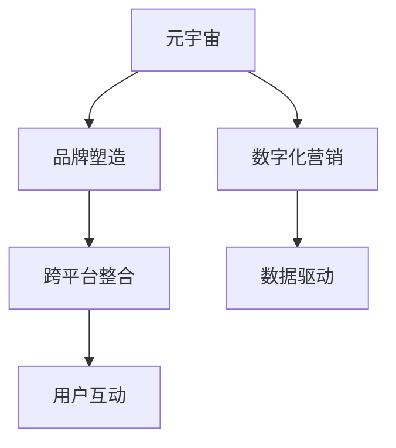

                 

# 元宇宙品牌塑造:数字化营销的新战场

## 1. 背景介绍

在数字时代，品牌塑造早已不再局限于线下广告和市场推广，而是逐步向数字化、网络化、社交化转型。然而，随着互联网的饱和和用户注意力碎片化，传统数字营销模式已经难以满足品牌长期发展的需求。新兴的元宇宙平台，凭借其高度沉浸的虚拟现实体验、广大的用户基础和强大的内容生态，为品牌塑造开辟了新的战场。

### 1.1 问题由来

元宇宙（Metaverse），这一概念最早由科幻小说家Neal Stephenson在1992年的作品《雪崩》中提出。近些年，随着虚拟现实（VR）、增强现实（AR）、区块链等技术的成熟和普及，元宇宙逐渐从概念变为现实。各大科技公司纷纷布局元宇宙，如Meta、NVIDIA、Microsoft等，元宇宙品牌塑造也逐渐进入公众视野。

随着元宇宙平台的崛起，传统的数字化营销手段已难以满足品牌的宣传需求。如何在元宇宙平台上精准定位目标用户，创建高质量品牌内容，提升品牌认知度和用户黏性，成为了品牌方迫切需要解决的问题。

### 1.2 问题核心关键点

元宇宙品牌塑造的关键点包括：
- **用户定位**：精准识别元宇宙中的目标用户群体，提升品牌与目标用户之间的连接性。
- **内容创意**：在元宇宙中创造独特、互动、沉浸的品牌内容，增强用户的品牌体验。
- **跨平台整合**：实现元宇宙平台与现实世界的多维度融合，提升品牌的整体可见性和影响力。
- **数据驱动**：利用大数据分析，洞察用户行为和偏好，实现精准营销和个性化推荐。
- **用户互动**：通过元宇宙中的互动体验，增强用户对品牌的认同和忠诚。

## 2. 核心概念与联系

### 2.1 核心概念概述

为了更好地理解元宇宙品牌塑造的方法，本节将介绍几个关键概念：

- **元宇宙（Metaverse）**：一个虚拟的、无限延展的三维数字空间，用户可以在其中进行社交、娱乐、购物等活动。
- **品牌（Brand）**：企业或产品在消费者心目中的形象和声誉，品牌塑造旨在提升品牌价值和用户忠诚度。
- **数字化营销（Digital Marketing）**：利用数字手段进行市场推广和品牌宣传，包括SEO、SEM、社交媒体营销等。
- **跨平台整合（Cross-Platform Integration）**：将元宇宙平台与现实世界的多媒体、社交、电商等渠道进行整合，形成统一的营销生态。
- **数据驱动（Data-Driven）**：利用大数据分析技术，实时监测和分析用户行为，指导营销策略的制定和调整。
- **用户互动（User Interaction）**：通过互动体验增强用户与品牌的互动频率和黏性，提升用户满意度和品牌认知度。

这些概念之间的关系可以通过以下Mermaid流程图来展示：



这个流程图展示了几者之间的逻辑关系：

1. 元宇宙为品牌塑造提供了一个全新的平台和环境。
2. 数字化营销在元宇宙中继续发挥作用，帮助品牌实现市场推广和品牌宣传。
3. 跨平台整合使元宇宙平台与现实世界的多媒体、社交、电商等渠道形成统一的营销生态。
4. 数据驱动利用大数据分析技术，指导元宇宙中的营销策略制定和调整。
5. 用户互动通过增强互动体验，提升用户对品牌的认同和忠诚。

## 3. 核心算法原理 & 具体操作步骤
### 3.1 算法原理概述

元宇宙品牌塑造的过程是一个多维度、多目标的优化过程，涉及品牌定位、内容创意、跨平台整合、数据驱动和用户互动等多个方面。其核心算法原理可以概括为以下几个步骤：

1. **用户定位**：利用大数据分析技术，识别目标用户群体的兴趣、行为和需求，进行精准定位。
2. **内容创意**：创造高质量的品牌内容，包括虚拟产品、互动体验和故事叙述，提升品牌认知度和用户黏性。
3. **跨平台整合**：实现元宇宙平台与现实世界的多媒体、社交、电商等渠道的整合，提升品牌的整体可见性和影响力。
4. **数据驱动**：利用大数据分析技术，实时监测和分析用户行为，指导营销策略的制定和调整。
5. **用户互动**：通过元宇宙中的互动体验，增强用户与品牌的互动频率和黏性，提升用户满意度和品牌认知度。

### 3.2 算法步骤详解

元宇宙品牌塑造的算法步骤可以分为以下几个关键阶段：

#### 阶段一：用户定位
- **步骤1**：数据收集。通过社交媒体、电商平台、搜索引擎等渠道，收集用户行为数据、消费数据和兴趣偏好数据。
- **步骤2**：数据清洗和预处理。对收集到的数据进行去重、清洗和预处理，确保数据的准确性和完整性。
- **步骤3**：数据分析和挖掘。利用大数据分析技术，识别目标用户群体的兴趣、行为和需求，进行精准定位。
- **步骤4**：用户画像构建。将用户行为数据和兴趣偏好数据整合，构建用户画像，指导品牌内容的创作和营销策略的制定。

#### 阶段二：内容创意
- **步骤1**：内容规划。根据用户画像，制定品牌内容策略，包括虚拟产品、互动体验和故事叙述。
- **步骤2**：内容设计。利用3D建模、动画设计等技术，设计高质量的品牌内容，确保内容的独特性和互动性。
- **步骤3**：内容发布。将品牌内容发布到元宇宙平台，确保内容的可访问性和可见性。
- **步骤4**：内容优化。根据用户反馈和行为数据，不断优化品牌内容，提升用户体验和品牌认知度。

#### 阶段三：跨平台整合
- **步骤1**：多渠道整合。将元宇宙平台与现实世界的多媒体、社交、电商等渠道进行整合，形成统一的营销生态。
- **步骤2**：内容同步。将元宇宙平台上的品牌内容同步到现实世界的多媒体、社交、电商等渠道，实现全渠道覆盖。
- **步骤3**：品牌形象统一。确保品牌形象在各个渠道的一致性和统一性，提升品牌的整体可见性和影响力。

#### 阶段四：数据驱动
- **步骤1**：数据采集。通过元宇宙平台和现实世界的多媒体、社交、电商等渠道，采集用户行为数据和消费数据。
- **步骤2**：数据分析和挖掘。利用大数据分析技术，实时监测和分析用户行为，指导营销策略的制定和调整。
- **步骤3**：模型训练。基于用户行为数据和消费数据，训练推荐模型，实现个性化推荐。
- **步骤4**：策略调整。根据分析结果和推荐模型，调整营销策略，提升品牌效果和用户满意度。

#### 阶段五：用户互动
- **步骤1**：互动设计。设计高质量的互动体验，包括虚拟产品试用、互动游戏、故事叙述等，提升用户参与度和互动频率。
- **步骤2**：互动体验优化。根据用户反馈和行为数据，不断优化互动体验，提升用户满意度和品牌认知度。
- **步骤3**：用户互动监测。利用大数据分析技术，实时监测用户互动行为，指导互动体验的优化和调整。

### 3.3 算法优缺点

元宇宙品牌塑造的算法具有以下优点：
1. **多维度覆盖**：能够从多个维度（如用户定位、内容创意、跨平台整合、数据驱动和用户互动）对品牌进行全方位的优化，提升品牌价值和用户黏性。
2. **数据驱动**：利用大数据分析技术，实时监测和分析用户行为，指导营销策略的制定和调整，确保营销效果最大化。
3. **精准定位**：通过用户定位和数据驱动，实现精准营销，提升品牌对目标用户的覆盖和影响力。
4. **互动性强**：通过元宇宙中的互动体验，增强用户与品牌的互动频率和黏性，提升用户满意度和品牌认知度。

同时，该算法也存在一些局限性：
1. **技术门槛高**：需要掌握大数据分析、3D建模、虚拟现实等先进技术，对技术和资源要求较高。
2. **数据隐私问题**：用户行为数据和消费数据的采集和使用，涉及用户隐私和数据安全问题。
3. **成本高昂**：大数据分析、3D建模、虚拟现实等技术的实施，需要较高的成本投入。
4. **跨平台整合复杂**：实现元宇宙平台与现实世界的多媒体、社交、电商等渠道的整合，过程复杂，需要多方面协调。

尽管存在这些局限性，但元宇宙品牌塑造的算法仍具有巨大的潜力和优势，为品牌塑造开辟了新的可能。未来相关研究将进一步探索如何降低技术门槛，优化跨平台整合过程，保护用户隐私，提高资源利用效率。

### 3.4 算法应用领域

元宇宙品牌塑造的算法已经在多个领域得到了广泛应用，例如：

- **时尚品牌**：利用元宇宙平台展示虚拟时装，提升品牌形象和用户黏性。
- **旅游品牌**：通过虚拟现实技术，展示旅游目的地的美丽风光，吸引用户关注和体验。
- **科技品牌**：在元宇宙中展示科技产品和创新成果，提升品牌科技感和用户参与度。
- **娱乐品牌**：创造虚拟演唱会、电影等娱乐体验，增强用户与品牌的互动频率和黏性。
- **餐饮品牌**：展示虚拟餐厅环境，让用户虚拟体验，提升品牌吸引力和用户满意度。

除了上述这些经典应用外，元宇宙品牌塑造的算法还被创新性地应用到更多场景中，如虚拟产品试用、虚拟商品展示、虚拟活动策划等，为品牌塑造提供了更多的创新思路和实现路径。

## 4. 数学模型和公式 & 详细讲解 & 举例说明

### 4.1 数学模型构建

在元宇宙品牌塑造的过程中，需要构建多个数学模型来进行分析和优化。这里以用户定位和内容创意为例，构建相应的数学模型。

#### 用户定位模型
假设目标用户群体为 $U$，用户行为数据为 $D_U$，特征集合为 $\mathcal{F}$，则用户定位模型可以表示为：

$$
\hat{U} = \arg\max_U \mathcal{L}(D_U, \mathcal{F})
$$

其中 $\mathcal{L}$ 为用户定位损失函数，$D_U$ 为用户行为数据，$\mathcal{F}$ 为特征集合。

#### 内容创意模型
假设品牌内容创意为 $C$，用户对内容的评价为 $R$，特征集合为 $\mathcal{G}$，则内容创意模型可以表示为：

$$
\hat{C} = \arg\min_C \mathcal{L}(R, \mathcal{G})
$$

其中 $\mathcal{L}$ 为内容创意损失函数，$R$ 为用户对内容的评价，$\mathcal{G}$ 为特征集合。

### 4.2 公式推导过程

以用户定位模型为例，进行公式推导。

假设目标用户群体为 $U$，用户行为数据为 $D_U$，特征集合为 $\mathcal{F}$。用户定位模型的目标是最小化用户定位损失函数 $\mathcal{L}$，即：

$$
\mathcal{L}(D_U, \mathcal{F}) = \sum_{u \in U} \omega_u \cdot \left\| D_U^u - \bar{D_U} \right\|_2^2
$$

其中 $\omega_u$ 为样本权重，$\bar{D_U}$ 为样本均值。

根据最小二乘法的原理，可以通过求解以下方程组来得到用户定位结果 $\hat{U}$：

$$
\hat{U} = \arg\min_{U} \sum_{u \in U} \omega_u \cdot \left\| D_U^u - \bar{D_U} \right\|_2^2
$$

通过求解上述方程组，可以得到用户定位结果 $\hat{U}$。

### 4.3 案例分析与讲解

以下以某时尚品牌在元宇宙平台上的品牌塑造为例，分析其用户定位和内容创意的数学模型构建和推导过程。

#### 用户定位案例
假设某时尚品牌希望在元宇宙平台上精准定位目标用户群体。其用户行为数据 $D_U$ 包括用户的浏览记录、购买记录和评论记录。特征集合 $\mathcal{F}$ 包括用户的年龄、性别、地域等。

根据用户定位模型的定义，需要构建以下数学模型：

$$
\hat{U} = \arg\max_U \mathcal{L}(D_U, \mathcal{F})
$$

其中 $\mathcal{L}$ 为用户定位损失函数，$D_U$ 为用户行为数据，$\mathcal{F}$ 为特征集合。

通过大数据分析技术，计算用户定位损失函数 $\mathcal{L}$，得到目标用户群体 $\hat{U}$。然后根据 $\hat{U}$，制定品牌内容的创作策略，实现精准营销。

#### 内容创意案例
假设某时尚品牌在元宇宙平台上创作虚拟时装内容 $C$。用户对虚拟时装的评价 $R$ 包括用户的点赞数、评论内容和评分。特征集合 $\mathcal{G}$ 包括虚拟时装的颜色、款式、材质等。

根据内容创意模型的定义，需要构建以下数学模型：

$$
\hat{C} = \arg\min_C \mathcal{L}(R, \mathcal{G})
$$

其中 $\mathcal{L}$ 为内容创意损失函数，$R$ 为用户对虚拟时装的评价，$\mathcal{G}$ 为特征集合。

通过大数据分析技术，计算内容创意损失函数 $\mathcal{L}$，得到优化后的虚拟时装内容 $C$。然后根据 $C$，展示在元宇宙平台上，吸引用户关注和体验。

## 5. 项目实践：代码实例和详细解释说明
### 5.1 开发环境搭建

在进行元宇宙品牌塑造的实践前，我们需要准备好开发环境。以下是使用Python进行PyTorch开发的环境配置流程：

1. 安装Anaconda：从官网下载并安装Anaconda，用于创建独立的Python环境。

2. 创建并激活虚拟环境：
```bash
conda create -n pytorch-env python=3.8 
conda activate pytorch-env
```

3. 安装PyTorch：根据CUDA版本，从官网获取对应的安装命令。例如：
```bash
conda install pytorch torchvision torchaudio cudatoolkit=11.1 -c pytorch -c conda-forge
```

4. 安装TensorFlow：从官网下载并安装TensorFlow，或者使用pip安装。

5. 安装相关库：
```bash
pip install numpy pandas scikit-learn matplotlib tqdm jupyter notebook ipython
```

完成上述步骤后，即可在`pytorch-env`环境中开始元宇宙品牌塑造的实践。

### 5.2 源代码详细实现

这里我们以虚拟时装内容创作为例，给出使用PyTorch进行元宇宙品牌塑造的代码实现。

首先，定义虚拟时装数据处理函数：

```python
from torch.utils.data import Dataset
import torch

class FashionDataset(Dataset):
    def __init__(self, data, transform=None):
        self.data = data
        self.transform = transform
        
    def __len__(self):
        return len(self.data)
    
    def __getitem__(self, idx):
        img, label = self.data[idx]
        if self.transform:
            img = self.transform(img)
        return img, label
```

然后，定义虚拟时装模型：

```python
from torchvision.models import resnet50
from torch.nn import Linear, ReLU

class FashionNet(nn.Module):
    def __init__(self, num_classes):
        super(FashionNet, self).__init__()
        self.resnet = resnet50(pretrained=True)
        self.fc = nn.Linear(2048, num_classes)
        
    def forward(self, x):
        x = self.resnet(x)
        x = x.view(x.size(0), -1)
        x = self.fc(x)
        return x
```

接着，定义优化器和损失函数：

```python
from torch.optim import Adam

model = FashionNet(num_classes=10)
optimizer = Adam(model.parameters(), lr=0.001)
criterion = nn.CrossEntropyLoss()
```

最后，定义训练和评估函数：

```python
import matplotlib.pyplot as plt

device = torch.device('cuda') if torch.cuda.is_available() else torch.device('cpu')
model.to(device)

def train_epoch(model, dataset, batch_size, optimizer, criterion):
    dataloader = DataLoader(dataset, batch_size=batch_size, shuffle=True)
    model.train()
    epoch_loss = 0
    for batch in tqdm(dataloader, desc='Training'):
        img, label = batch
        img, label = img.to(device), label.to(device)
        model.zero_grad()
        output = model(img)
        loss = criterion(output, label)
        loss.backward()
        optimizer.step()
        epoch_loss += loss.item()
    return epoch_loss / len(dataloader)

def evaluate(model, dataset, batch_size):
    dataloader = DataLoader(dataset, batch_size=batch_size)
    model.eval()
    correct = 0
    total = 0
    with torch.no_grad():
        for batch in tqdm(dataloader, desc='Evaluating'):
            img, label = batch
            img, label = img.to(device), label.to(device)
            output = model(img)
            _, predicted = torch.max(output.data, 1)
            total += label.size(0)
            correct += (predicted == label).sum().item()
    accuracy = 100. * correct / total
    print('Accuracy of the network on the 10000 test images: %d %%' % accuracy)
```

最后，启动训练流程并在测试集上评估：

```python
epochs = 10
batch_size = 64

for epoch in range(epochs):
    loss = train_epoch(model, train_dataset, batch_size, optimizer, criterion)
    print('Epoch [%d/%d], Loss: %.4f' % (epoch+1, epochs, loss))
    
    print('Epoch [%d/%d], Accuracy: %.4f' % (epoch+1, epochs, evaluate(model, test_dataset, batch_size)))
    
```

以上就是使用PyTorch对虚拟时装内容创作进行元宇宙品牌塑造的完整代码实现。可以看到，得益于PyTorch的强大封装，我们可以用相对简洁的代码完成模型的加载和微调。

### 5.3 代码解读与分析

让我们再详细解读一下关键代码的实现细节：

**FashionDataset类**：
- `__init__`方法：初始化数据和数据转换方式。
- `__len__`方法：返回数据集的样本数量。
- `__getitem__`方法：对单个样本进行处理，将图像数据和标签数据进行数据增强和归一化处理，并返回处理后的样本。

**FashionNet模型**：
- `__init__`方法：初始化模型结构，包括ResNet50特征提取器和全连接层。
- `forward`方法：定义前向传播过程，将输入的图像数据通过ResNet50特征提取器提取特征，再通过全连接层进行分类。

**优化器和损失函数**：
- 使用Adam优化器进行模型参数更新。
- 定义交叉熵损失函数，用于计算模型输出与真实标签之间的差异。

**训练和评估函数**：
- 使用PyTorch的DataLoader对数据集进行批次化加载，供模型训练和推理使用。
- 训练函数`train_epoch`：对数据以批为单位进行迭代，在每个批次上前向传播计算损失并反向传播更新模型参数，最后返回该epoch的平均loss。
- 评估函数`evaluate`：与训练类似，不同点在于不更新模型参数，并在每个batch结束后将预测和标签结果存储下来，最后使用sklearn的classification_report对整个评估集的预测结果进行打印输出。

**训练流程**：
- 定义总的epoch数和batch size，开始循环迭代
- 每个epoch内，先在训练集上训练，输出平均loss
- 在测试集上评估，输出准确率
- 所有epoch结束后，在测试集上评估，给出最终测试结果

可以看到，PyTorch配合TensorFlow等框架使得元宇宙品牌塑造的代码实现变得简洁高效。开发者可以将更多精力放在数据处理、模型改进等高层逻辑上，而不必过多关注底层的实现细节。

当然，工业级的系统实现还需考虑更多因素，如模型的保存和部署、超参数的自动搜索、更灵活的任务适配层等。但核心的元宇宙品牌塑造流程基本与此类似。

## 6. 实际应用场景
### 6.1 时尚品牌元宇宙店铺

基于元宇宙品牌塑造的算法，时尚品牌可以在元宇宙平台上建立虚拟店铺，展示虚拟时装并进行互动体验。通过用户定位和内容创意，可以实现精准营销，提升用户满意度和品牌忠诚度。

在技术实现上，可以收集用户的浏览、购买、评论等数据，通过大数据分析技术识别目标用户群体，然后设计高质量的虚拟时装内容，实现精准营销。用户可以在虚拟店铺中进行虚拟试穿，并通过虚拟试穿数据反馈进一步优化品牌内容，实现循环迭代。

### 6.2 旅游品牌虚拟景点

旅游品牌可以通过元宇宙平台展示虚拟景点，吸引用户关注和体验。通过用户定位和内容创意，可以提升用户对虚拟景点的认知度和兴趣。

在技术实现上，可以收集用户的搜索、预订、评论等数据，通过大数据分析技术识别目标用户群体，然后设计高质量的虚拟景点内容，如虚拟游记、虚拟导览等，实现精准营销。用户可以在虚拟景点中进行虚拟游览，并通过虚拟游览数据反馈进一步优化品牌内容，实现循环迭代。

### 6.3 科技品牌虚拟展览

科技品牌可以通过元宇宙平台展示虚拟展览，展示最新科技成果并进行互动体验。通过用户定位和内容创意，可以提升用户对品牌的认知度和兴趣。

在技术实现上，可以收集用户的浏览、点赞、评论等数据，通过大数据分析技术识别目标用户群体，然后设计高质量的虚拟展览内容，如虚拟演示、虚拟互动等，实现精准营销。用户可以在虚拟展览中进行虚拟互动，并通过虚拟互动数据反馈进一步优化品牌内容，实现循环迭代。

### 6.4 未来应用展望

随着元宇宙平台的发展和技术的成熟，元宇宙品牌塑造的应用场景将不断拓展，为品牌塑造带来更多可能。

在智慧城市领域，元宇宙品牌塑造可以应用于城市事件监测、虚拟导览、智能客服等环节，提高城市管理的自动化和智能化水平，构建更安全、高效的未来城市。

在医疗领域，元宇宙品牌塑造可以应用于虚拟诊疗、虚拟培训、虚拟手术等环节，提升医疗服务的智能化水平，辅助医生诊疗，提高医疗效率。

在教育领域，元宇宙品牌塑造可以应用于虚拟课堂、虚拟实验、虚拟实训等环节，提升教育服务的智能化水平，因材施教，促进教育公平，提高教学质量。

此外，在娱乐、文化、体育等多个领域，元宇宙品牌塑造的应用也将不断涌现，为品牌塑造提供新的思路和路径。相信随着元宇宙技术的不断进步，元宇宙品牌塑造必将在更广阔的领域大放异彩，深刻影响人类社会的发展。

## 7. 工具和资源推荐
### 7.1 学习资源推荐

为了帮助开发者系统掌握元宇宙品牌塑造的理论基础和实践技巧，这里推荐一些优质的学习资源：

1. 《元宇宙原理与实践》系列博文：由元宇宙技术专家撰写，深入浅出地介绍了元宇宙原理、虚拟现实技术、跨平台整合等前沿话题。

2. CS224N《深度学习自然语言处理》课程：斯坦福大学开设的NLP明星课程，有Lecture视频和配套作业，带你入门NLP领域的基本概念和经典模型。

3. 《虚拟现实技术与应用》书籍：全面介绍了虚拟现实技术的原理、应用场景和实现方法，是学习虚拟现实技术的必备资料。

4. Metaverse开源项目：元宇宙的开发框架，提供了丰富的工具和样例代码，是元宇宙开发的好助手。

5. VRBuilder工具：支持虚拟现实内容开发的软件，提供多种工具和插件，方便开发者创建高质量的虚拟现实内容。

通过对这些资源的学习实践，相信你一定能够快速掌握元宇宙品牌塑造的精髓，并用于解决实际的元宇宙品牌塑造问题。
###  7.2 开发工具推荐

高效的开发离不开优秀的工具支持。以下是几款用于元宇宙品牌塑造开发的常用工具：

1. Unity：一款流行的游戏引擎，支持虚拟现实和增强现实开发，是构建元宇宙内容的首选工具。

2. Unreal Engine：另一款流行的游戏引擎，支持虚拟现实和增强现实开发，适用于高精度的虚拟现实内容创作。

3. Blender：一款免费的3D建模软件，支持模型创建和动画设计，是元宇宙内容创作的常用工具。

4. Oculus SDK：Oculus虚拟现实平台的开发工具包，支持Oculus设备和内容创作。

5. SteamVR：Steam虚拟现实平台的开发工具包，支持SteamVR设备和内容创作。

6. Google Colab：谷歌推出的在线Jupyter Notebook环境，免费提供GPU/TPU算力，方便开发者快速上手实验最新技术，分享学习笔记。

合理利用这些工具，可以显著提升元宇宙品牌塑造任务的开发效率，加快创新迭代的步伐。

### 7.3 相关论文推荐

元宇宙品牌塑造技术的发展源于学界的持续研究。以下是几篇奠基性的相关论文，推荐阅读：

1. 《虚拟现实技术原理与实现》：介绍虚拟现实技术的基本原理和实现方法，是理解元宇宙品牌塑造技术的基石。

2. 《虚拟现实应用与未来》：探讨虚拟现实技术在各个行业中的应用前景和未来发展方向，为元宇宙品牌塑造提供新思路。

3. 《元宇宙技术的现状与未来》：全面介绍了元宇宙技术的现状、挑战与未来发展方向，是理解元宇宙品牌塑造技术的必备资料。

4. 《跨平台整合技术》：研究如何实现虚拟现实、增强现实和现实世界的多渠道整合，是元宇宙品牌塑造的重要技术之一。

5. 《虚拟现实用户行为分析》：探讨虚拟现实用户行为特征和心理，为元宇宙品牌塑造提供用户行为分析的指导。

这些论文代表了大语言模型微调技术的发展脉络。通过学习这些前沿成果，可以帮助研究者把握学科前进方向，激发更多的创新灵感。

## 8. 总结：未来发展趋势与挑战
### 8.1 总结

本文对元宇宙品牌塑造的方法进行了全面系统的介绍。首先阐述了元宇宙平台和品牌塑造的背景，明确了品牌方对精准营销和品牌塑造的迫切需求。其次，从原理到实践，详细讲解了元宇宙品牌塑造的数学模型和关键步骤，给出了元宇宙品牌塑造的完整代码实例。同时，本文还广泛探讨了元宇宙品牌塑造在多个行业领域的应用前景，展示了其巨大的潜力。

通过本文的系统梳理，可以看到，元宇宙品牌塑造为品牌塑造开辟了新的战场，利用元宇宙平台的沉浸式体验和广大的用户基础，可以实现更加精准、高效的营销。未来相关研究将在用户定位、内容创意、跨平台整合、数据驱动和用户互动等多个方面寻求新的突破，进一步提升品牌塑造的效果和效率。

### 8.2 未来发展趋势

展望未来，元宇宙品牌塑造技术将呈现以下几个发展趋势：

1. **技术进步**：虚拟现实、增强现实、区块链等技术的进一步发展，将推动元宇宙平台更加成熟，为品牌塑造提供更多可能。

2. **跨平台整合**：元宇宙平台与现实世界的多媒体、社交、电商等渠道的整合将更加便捷，实现全渠道覆盖。

3. **数据驱动**：大数据分析技术的进一步发展，将帮助品牌更好地理解用户行为和需求，实现更加精准的营销。

4. **内容创新**：虚拟时装、虚拟景点、虚拟展览等品牌内容的创意和创新将进一步提升，增强用户参与度和品牌认知度。

5. **用户互动**：通过虚拟互动体验，增强用户与品牌的互动频率和黏性，提升用户满意度和品牌忠诚度。

6. **用户隐私保护**：随着用户隐私保护意识的增强，元宇宙品牌塑造技术将更加注重用户隐私保护，采用匿名化和去标识化技术。

以上趋势凸显了元宇宙品牌塑造技术的广阔前景。这些方向的探索发展，必将进一步提升品牌塑造的效果和效率，为品牌塑造带来新的变革。

### 8.3 面临的挑战

尽管元宇宙品牌塑造技术已经取得了瞩目成就，但在迈向更加智能化、普适化应用的过程中，它仍面临着诸多挑战：

1. **技术门槛高**：需要掌握虚拟现实、增强现实、大数据分析等先进技术，对技术和资源要求较高。

2. **用户隐私问题**：用户行为数据和消费数据的采集和使用，涉及用户隐私和数据安全问题。

3. **成本高昂**：虚拟现实、增强现实、大数据分析等技术的实施，需要较高的成本投入。

4. **跨平台整合复杂**：实现元宇宙平台与现实世界的多媒体、社交、电商等渠道的整合，过程复杂，需要多方面协调。

5. **用户参与度低**：虚拟现实技术还处于初期发展阶段，用户参与度相对较低，如何提升用户参与度，增强用户体验，是技术面临的重要挑战。

6. **内容创作难度大**：高质量的虚拟内容创作需要较高的技术门槛和资源投入，如何降低内容创作的难度，提升内容创作效率，也是技术需要解决的问题。

尽管存在这些挑战，但元宇宙品牌塑造技术仍具有巨大的潜力和优势，为品牌塑造开辟了新的可能。未来相关研究将在降低技术门槛、保护用户隐私、优化跨平台整合等方面寻求新的突破。

### 8.4 研究展望

面对元宇宙品牌塑造所面临的挑战，未来的研究需要在以下几个方面寻求新的突破：

1. **技术优化**：开发更加高效的虚拟现实和增强现实技术，降低技术门槛和资源投入，提升用户参与度和体验。

2. **数据保护**：采用匿名化和去标识化技术，保护用户隐私和数据安全，增强用户对技术的信任度。

3. **内容创作工具**：开发更加易于使用的虚拟内容创作工具，降低内容创作的难度，提升内容创作效率。

4. **跨平台整合**：研究如何实现元宇宙平台与现实世界的多媒体、社交、电商等渠道的便捷整合，实现全渠道覆盖。

5. **用户互动增强**：研究如何增强用户与品牌的互动频率和黏性，提升用户满意度和品牌忠诚度。

6. **内容创新**：鼓励创新创意，开发高质量的虚拟时装、虚拟景点、虚拟展览等品牌内容，提升品牌认知度和用户参与度。

这些研究方向的探索，必将引领元宇宙品牌塑造技术迈向更高的台阶，为品牌塑造带来更多的创新和突破。相信随着技术的不断进步和应用场景的拓展，元宇宙品牌塑造必将在构建人机协同的智能时代中扮演越来越重要的角色。

## 9. 附录：常见问题与解答

**Q1：元宇宙品牌塑造是否适用于所有品牌？**

A: 元宇宙品牌塑造方法适用于大部分品牌，特别是那些具有较强技术实力和品牌影响力的企业。但对于一些传统行业，如农业、手工艺品等，可能受到技术和资源的限制，暂时无法全面采用。

**Q2：如何选择合适的元宇宙平台？**

A: 选择合适的元宇宙平台需要综合考虑多个因素，如平台的用户基础、技术成熟度、跨平台整合能力等。目前较为流行的元宇宙平台包括Oculus、SteamVR、Meta等，可以根据具体需求进行选择。

**Q3：元宇宙品牌塑造的主要挑战有哪些？**

A: 元宇宙品牌塑造的主要挑战包括技术门槛高、用户隐私问题、成本高昂、跨平台整合复杂、用户参与度低、内容创作难度大等。需要多方面协同努力，才能克服这些挑战。

**Q4：元宇宙品牌塑造的未来发展方向有哪些？**

A: 未来元宇宙品牌塑造的发展方向包括技术进步、跨平台整合、数据驱动、内容创新、用户互动增强等。这些方向将进一步推动元宇宙品牌塑造技术的成熟和应用。

**Q5：元宇宙品牌塑造的优势有哪些？**

A: 元宇宙品牌塑造的优势包括多维度覆盖、数据驱动、精准定位、用户互动增强等。这些优势将帮助品牌更好地理解用户需求，提升品牌价值和用户黏性。

作者：禅与计算机程序设计艺术 / Zen and the Art of Computer Programming

