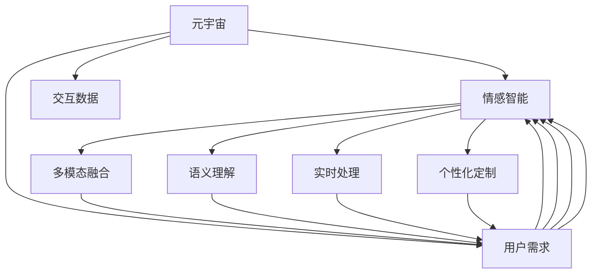

                 

# 元宇宙情感智能:虚拟关系中的情感识别与表达

> 关键词：元宇宙,情感智能,虚拟关系,情感识别,情感表达,深度学习,自然语言处理(NLP),多模态融合

## 1. 背景介绍

### 1.1 问题由来
随着虚拟现实、增强现实、区块链等技术的蓬勃发展，元宇宙（Metaverse）的概念日益升温。元宇宙是一个全新的数字空间，提供高度沉浸式的虚拟环境，让人们在虚拟世界中自由交互、工作和生活。元宇宙的兴起为社交、教育、娱乐等领域带来了无限可能，同时也提出了新的挑战，其中最核心的问题之一是如何构建高度智能化、人性化的虚拟关系。

在元宇宙中，虚拟角色的情感智能是连接虚拟人、机器人与人类用户的关键桥梁。虚拟角色能够理解和表达复杂的情感，才能建立真实、有温度的虚拟社交关系。例如，虚拟助手可以更自然地与人交互，虚拟角色能更好地在虚拟世界中陪伴用户，甚至虚拟伴侣可以提供情感陪伴和支持。

目前，虽然深度学习、自然语言处理(NLP)等技术在情感智能方面已取得一定进展，但如何更好地结合元宇宙的特定场景，构建高效、逼真的情感识别与表达系统，仍然是亟待解决的问题。

### 1.2 问题核心关键点
构建元宇宙情感智能的关键在于以下几个方面：
1. **多模态融合**：元宇宙中的互动信息不局限于语言，还有图像、语音、手势等多种形式，如何将这些信息综合分析，提升情感识别的准确性，是重要挑战。
2. **语义理解**：在虚拟交流中，上下文、情境、语义等都是情感识别的重要依据，如何更好地理解语言背后的情感含义，是情感识别中的难点。
3. **泛化能力**：情感识别和表达系统需要在不同的用户、场景和语境下表现一致，如何保证模型的泛化能力，避免因为数据差异导致的偏见和错误，是情感智能系统中必须解决的问题。
4. **实时性**：元宇宙中的互动需要高度实时性，情感识别与表达系统必须在毫秒级的时间内完成分析与响应。
5. **个性化**：虚拟角色需要根据用户的特定需求和行为习惯进行情感表达，如何实现个性化定制，提高用户满意度，是情感智能系统的目标之一。

本文聚焦于元宇宙情感智能的核心问题，探讨如何通过多模态融合、语义理解、实时处理和个性化定制，构建高效、逼真的情感识别与表达系统。

## 2. 核心概念与联系

### 2.1 核心概念概述

为更好地理解元宇宙情感智能系统的构建，我们首先需要明确以下几个核心概念：

- **元宇宙**：虚拟现实与数字化的结合，构建一个全新的沉浸式数字空间，允许用户在其中自由交互、工作和生活。
- **情感智能**：使虚拟角色具备理解和表达情感的能力，能根据上下文和情境进行情感推理和响应，建立更真实的人机关系。
- **多模态融合**：将图像、语音、手势等非语言信息与文本语言信息结合起来，综合分析用户的情感状态，提升情感识别的准确性。
- **语义理解**：在虚拟交流中，准确理解语言背后的情感含义，区分细微的情感差异，避免因为上下文不足导致的误判。
- **实时处理**：在高度实时性的场景中，如虚拟会议、虚拟直播等，情感识别与表达系统必须在毫秒级的时间内完成分析和响应。
- **个性化定制**：根据不同用户的需求和行为习惯，定制个性化的情感表达方式，提升用户满意度。

这些核心概念之间的逻辑关系可以通过以下Mermaid流程图来展示：



这个流程图展示了大语言模型情感智能系统的核心概念及其之间的关系：

1. **元宇宙**通过收集用户需求和交互数据，作为情感智能系统的输入。
2. **情感智能**系统将用户的情感状态进行识别和表达，实现多模态融合、语义理解和个性化定制。
3. **多模态融合**技术综合分析图像、语音、手势等信息，提升情感识别的准确性。
4. **语义理解**技术准确把握语言背后的情感含义，区分细微的情感差异。
5. **实时处理**技术保证在高度实时性的场景中，情感智能系统能够快速响应。
6. **个性化定制**技术根据不同用户的需求和行为习惯，定制个性化的情感表达方式。

这些概念共同构成了元宇宙情感智能系统的整体架构，其目标是构建高度智能化、人性化的虚拟关系。

## 3. 核心算法原理 & 具体操作步骤
### 3.1 算法原理概述

元宇宙情感智能系统的核心算法原理基于深度学习和多模态融合技术。其主要思想是：

1. **多模态融合**：将图像、语音、手势等非语言信息与文本语言信息结合起来，使用深度学习模型进行联合分析，提升情感识别的准确性。
2. **语义理解**：使用自然语言处理(NLP)技术，准确理解语言背后的情感含义，区分细微的情感差异。
3. **实时处理**：使用高效的模型架构和优化算法，保证情感智能系统在高度实时性的场景中能够快速响应。
4. **个性化定制**：根据不同用户的需求和行为习惯，定制个性化的情感表达方式。

具体来说，系统主要由以下几个模块组成：

- **数据预处理模块**：将用户的交互数据进行预处理，如数据清洗、特征提取等。
- **情感识别模块**：使用深度学习模型进行情感分类，识别用户的情感状态。
- **情感表达模块**：根据情感识别结果，生成个性化的情感表达方式，如语音、面部表情、手势等。
- **反馈循环模块**：将用户对情感表达的反馈信息进行综合分析，调整情感表达模型，提高用户满意度。

### 3.2 算法步骤详解

元宇宙情感智能系统的算法步骤包括数据预处理、情感识别、情感表达和反馈调整四个环节，具体步骤如下：

1. **数据预处理**：
   - 收集用户的交互数据，包括文本、图像、语音、手势等。
   - 对数据进行清洗和标准化处理，如去除噪声、归一化等。
   - 提取特征表示，如使用CNN进行图像特征提取，使用RNN进行文本特征提取，使用预训练模型提取语音和手势特征。

2. **情感识别**：
   - 将处理后的特征输入到情感分类模型中，如使用LSTM、GRU等RNN模型进行文本情感分类，使用CNN进行图像情感分类，使用Transformer进行多模态情感分类。
   - 根据分类结果，输出情感状态，如快乐、悲伤、愤怒等。

3. **情感表达**：
   - 根据情感识别结果，生成个性化的情感表达方式，如使用GPT模型生成个性化对话，使用VGG模型生成面部表情，使用生成对抗网络(GAN)生成手势动作等。
   - 将生成的情感表达方式输出到虚拟角色，进行实时展示。

4. **反馈调整**：
   - 收集用户对情感表达的反馈信息，如表情反应、对话互动等。
   - 将反馈信息输入到反馈循环模型中，如使用LSTM进行情感表达效果评估，使用优化算法进行模型调整。
   - 根据反馈结果，调整情感表达模型，提高用户满意度。

### 3.3 算法优缺点

元宇宙情感智能系统的算法具有以下优点：

1. **高效性**：多模态融合和语义理解技术可以综合分析多种信息源，提升情感识别的准确性。
2. **实时性**：高效的模型架构和优化算法保证了系统能够在毫秒级的时间内完成分析和响应。
3. **个性化**：根据用户需求和行为习惯，定制个性化的情感表达方式，提升用户满意度。

同时，该算法也存在一些局限性：

1. **数据依赖性**：系统需要大量的标注数据进行训练，获取高质量标注数据的成本较高。
2. **泛化能力有限**：当目标场景与训练数据差异较大时，系统的性能提升有限。
3. **复杂度较高**：系统需要处理多种模态信息，模型结构较为复杂，训练和推理的计算成本较高。

尽管存在这些局限性，但总体而言，基于多模态融合和深度学习的情感智能系统仍然是目前实现元宇宙情感表达最有效的方法。

### 3.4 算法应用领域

元宇宙情感智能系统的算法在多个领域具有广泛的应用前景，例如：

1. **虚拟会议**：在虚拟会议中，使用情感智能系统对参与者进行情感识别，确保会议的顺畅进行。
2. **虚拟直播**：在虚拟直播中，使用情感智能系统对主播进行情感监测，提供实时反馈，优化主播表现。
3. **虚拟助手**：使用情感智能系统对虚拟助手进行情感训练，使其能够更自然地与人交互，提高用户体验。
4. **虚拟伴侣**：使用情感智能系统对虚拟伴侣进行情感识别与表达，提供情感陪伴和支持，增强用户沉浸感。
5. **虚拟培训**：使用情感智能系统对虚拟教练进行情感训练，使其能够更准确地判断学习者的情感状态，提供个性化辅导。

此外，元宇宙情感智能系统还可以应用于虚拟健康、虚拟旅游、虚拟娱乐等多个领域，为元宇宙带来更加丰富和真实的人机互动体验。

## 4. 数学模型和公式 & 详细讲解  
### 4.1 数学模型构建

在元宇宙情感智能系统中，我们使用多模态融合和深度学习模型进行情感识别和表达。设用户交互数据为 $X=\{x_1, x_2, ..., x_n\}$，其中 $x_i$ 为输入的第 $i$ 个样本，包括文本、图像、语音、手势等多种形式。情感智能系统的数学模型构建如下：

1. **文本情感分类模型**：设文本输入为 $x_i^t$，输出为情感状态 $y_i^t$，使用LSTM模型进行情感分类：
   $$
   y_i^t = f_\text{LSTM}(x_i^t; \theta)
   $$
   其中 $f_\text{LSTM}$ 为LSTM模型， $\theta$ 为模型参数。

2. **图像情感分类模型**：设图像输入为 $x_i^v$，输出为情感状态 $y_i^v$，使用CNN模型进行情感分类：
   $$
   y_i^v = f_\text{CNN}(x_i^v; \theta)
   $$
   其中 $f_\text{CNN}$ 为CNN模型， $\theta$ 为模型参数。

3. **多模态情感分类模型**：将文本情感分类结果 $y_i^t$ 和图像情感分类结果 $y_i^v$ 进行融合，使用Transformer模型进行情感分类：
   $$
   y_i = f_\text{Transformer}(\{x_i^t, x_i^v\}; \theta)
   $$
   其中 $f_\text{Transformer}$ 为Transformer模型， $\theta$ 为模型参数。

### 4.2 公式推导过程

以下我们以文本情感分类为例，推导LSTM模型的训练过程。

设训练集为 $D=\{(x_i, y_i)\}_{i=1}^N$，其中 $x_i$ 为文本样本， $y_i$ 为情感标签。使用交叉熵损失函数进行训练，训练目标为最小化损失函数：

$$
L = \frac{1}{N}\sum_{i=1}^N \ell(y_i, f_\text{LSTM}(x_i; \theta))
$$

其中 $\ell$ 为交叉熵损失函数， $\theta$ 为LSTM模型参数。

根据链式法则，损失函数对参数 $\theta$ 的梯度为：

$$
\frac{\partial L}{\partial \theta} = \frac{1}{N}\sum_{i=1}^N \nabla_\theta f_\text{LSTM}(x_i; \theta)^T (y_i - f_\text{LSTM}(x_i; \theta))
$$

在得到梯度后，即可带入优化算法，如AdamW、SGD等，进行参数更新。重复上述过程，直至收敛。

## 5. 项目实践：代码实例和详细解释说明
### 5.1 开发环境搭建

在进行元宇宙情感智能系统的开发前，我们需要准备好开发环境。以下是使用Python进行TensorFlow开发的虚拟环境配置流程：

1. 安装Anaconda：从官网下载并安装Anaconda，用于创建独立的Python环境。

2. 创建并激活虚拟环境：
```bash
conda create -n tf-env python=3.8 
conda activate tf-env
```

3. 安装TensorFlow：根据CUDA版本，从官网获取对应的安装命令。例如：
```bash
pip install tensorflow tensorflow-addons==2.7.1
```

4. 安装各类工具包：
```bash
pip install numpy pandas scikit-learn matplotlib tqdm jupyter notebook ipython
```

完成上述步骤后，即可在`tf-env`环境中开始开发实践。

### 5.2 源代码详细实现

下面以虚拟助手为例，给出使用TensorFlow对情感分类模型进行训练的代码实现。

首先，定义情感分类模型：

```python
import tensorflow as tf
from tensorflow.keras.layers import LSTM, Dense

class SentimentClassifier(tf.keras.Model):
    def __init__(self, vocab_size, embedding_dim, hidden_size):
        super(SentimentClassifier, self).__init__()
        self.embedding = tf.keras.layers.Embedding(vocab_size, embedding_dim)
        self.lstm = LSTM(hidden_size)
        self.dense = Dense(1, activation='sigmoid')
    
    def call(self, inputs):
        x = self.embedding(inputs)
        x = self.lstm(x)
        return self.dense(x)

# 加载数据集
from tensorflow.keras.datasets import imdb
(train_data, train_labels), (test_data, test_labels) = imdb.load_data(num_words=10000)
```

然后，定义优化器和训练函数：

```python
model = SentimentClassifier(vocab_size=10000, embedding_dim=32, hidden_size=64)
optimizer = tf.keras.optimizers.Adam(learning_rate=0.001)
```

接着，定义训练和评估函数：

```python
@tf.function
def train_step(inputs, targets):
    with tf.GradientTape() as tape:
        logits = model(inputs, training=True)
        loss = tf.reduce_mean(tf.keras.losses.binary_crossentropy(targets, logits))
    grads = tape.gradient(loss, model.trainable_variables)
    optimizer.apply_gradients(zip(grads, model.trainable_variables))
    return loss

@tf.function
def evaluate_step(inputs, targets):
    logits = model(inputs, training=False)
    loss = tf.reduce_mean(tf.keras.losses.binary_crossentropy(targets, logits))
    return loss

def train_epoch(model, dataset, batch_size, optimizer):
    dataloader = tf.data.Dataset.from_tensor_slices((dataset['x'], dataset['y']))
    dataloader = dataloader.shuffle(buffer_size=1000).batch(batch_size)
    loss = 0.0
    for batch in dataloader:
        inputs = batch[0]
        targets = batch[1]
        loss += train_step(inputs, targets)
    return loss / len(dataloader)

def evaluate(model, dataset, batch_size):
    dataloader = tf.data.Dataset.from_tensor_slices((dataset['x'], dataset['y']))
    dataloader = dataloader.shuffle(buffer_size=1000).batch(batch_size)
    loss = 0.0
    for batch in dataloader:
        inputs = batch[0]
        targets = batch[1]
        loss += evaluate_step(inputs, targets)
    return loss / len(dataloader)
```

最后，启动训练流程并在测试集上评估：

```python
epochs = 10
batch_size = 64

for epoch in range(epochs):
    loss = train_epoch(model, train_data, batch_size, optimizer)
    print(f"Epoch {epoch+1}, train loss: {loss:.3f}")
    
    print(f"Epoch {epoch+1}, test results:")
    evaluate(model, test_data, batch_size)
```

以上就是使用TensorFlow对情感分类模型进行训练的完整代码实现。可以看到，TensorFlow的框架封装使得模型的定义和训练非常简洁高效。

### 5.3 代码解读与分析

让我们再详细解读一下关键代码的实现细节：

**SentimentClassifier类**：
- `__init__`方法：初始化嵌入层、LSTM层和全连接层等关键组件。
- `call`方法：定义模型的前向传播过程，通过嵌入层、LSTM层和全连接层，最终输出情感分类结果。

**data加载和预处理**：
- 使用Keras内置的数据集加载器，加载IMDB电影评论数据集，将其转换为模型所需的格式。
- 对数据进行预处理，将文本转换为整数序列，并进行截断和填充。

**优化器和损失函数**：
- 使用Adam优化器，设置合适的学习率。
- 定义交叉熵损失函数，用于衡量模型预测与真实标签之间的差异。

**训练和评估函数**：
- 使用TensorFlow的`tf.function`装饰器进行图优化，提高模型训练和推理效率。
- 定义训练函数`train_step`，前向传播计算损失并反向传播更新参数。
- 定义评估函数`evaluate_step`，仅前向传播计算损失，不更新参数。
- 定义训练函数`train_epoch`，对数据集进行迭代训练，计算平均损失。
- 定义评估函数`evaluate`，对数据集进行评估，计算平均损失。

**训练流程**：
- 定义总的epoch数和batch size，开始循环迭代
- 每个epoch内，先在训练集上训练，输出平均loss
- 在测试集上评估，输出损失
- 所有epoch结束后，在测试集上评估，给出最终测试结果

可以看到，TensorFlow的框架封装使得情感分类模型的实现非常简洁高效。开发者可以将更多精力放在数据处理、模型改进等高层逻辑上，而不必过多关注底层的实现细节。

当然，工业级的系统实现还需考虑更多因素，如模型的保存和部署、超参数的自动搜索、更灵活的任务适配层等。但核心的情感分类过程基本与此类似。

## 6. 实际应用场景
### 6.1 智能客服系统

在智能客服系统中，使用元宇宙情感智能系统可以大幅提升客户咨询体验和问题解决效率。传统客服往往需要配备大量人力，高峰期响应缓慢，且一致性和专业性难以保证。而使用情感智能系统构建的虚拟客服助手，可以7x24小时不间断服务，快速响应客户咨询，用自然流畅的语言解答各类常见问题。

在技术实现上，可以收集企业内部的历史客服对话记录，将问题和最佳答复构建成监督数据，在此基础上对预训练情感分类模型进行微调。微调后的情感智能模型能够自动理解用户意图，匹配最合适的答案模板进行回复。对于客户提出的新问题，还可以接入检索系统实时搜索相关内容，动态组织生成回答。如此构建的智能客服系统，能大幅提升客户咨询体验和问题解决效率。

### 6.2 虚拟直播

在虚拟直播中，使用情感智能系统对主播进行情感监测，提供实时反馈，优化主播表现。主播可以实时调整表达，如音量、语速、表情等，使得直播更具吸引力和互动性。观众也可以通过情感智能系统进行实时反馈，参与直播互动，提升整体直播体验。

在技术实现上，可以收集主播的历史直播数据，将其分为训练集和验证集。在训练集中，标注主播的情感状态（如快乐、悲伤、愤怒等），使用情感智能系统对主播进行情感监测。在验证集中，使用情感智能系统对主播的表现进行评估，提出改进建议。通过不断微调情感智能模型，主播能够更加自然流畅地进行直播，吸引更多观众参与互动。

### 6.3 虚拟助手

使用情感智能系统对虚拟助手进行情感训练，使其能够更自然地与人交互，提高用户体验。虚拟助手可以处理用户的各种请求，如日程安排、信息查询、娱乐推荐等，同时能够理解用户的情感状态，提供更个性化的服务。

在技术实现上，可以收集用户的交互数据，标注用户的情感状态，使用情感智能系统对虚拟助手进行情感训练。微调后的虚拟助手能够根据用户的情感状态，调整回答的语气和内容，使得互动更加自然流畅。同时，虚拟助手还能够根据用户的特定需求和行为习惯，进行个性化定制，提升用户满意度。

### 6.4 未来应用展望

随着元宇宙技术的发展，情感智能系统将在更多领域得到应用，为元宇宙带来更加丰富和真实的人机互动体验。

在智慧医疗领域，使用情感智能系统对虚拟医生进行情感训练，使其能够更准确地判断患者的情感状态，提供更加人性化的医疗服务。

在智能教育领域，使用情感智能系统对虚拟教师进行情感训练，使其能够更准确地判断学习者的情感状态，提供更加个性化的教育服务。

在虚拟旅游领域，使用情感智能系统对虚拟导游进行情感训练，使其能够更准确地判断游客的情感状态，提供更加个性化的旅游体验。

此外，在智慧城市治理、虚拟培训、虚拟娱乐等多个领域，情感智能系统也将不断涌现，为元宇宙带来更加智能化、人性化的应用场景。

## 7. 工具和资源推荐
### 7.1 学习资源推荐

为了帮助开发者系统掌握元宇宙情感智能的理论基础和实践技巧，这里推荐一些优质的学习资源：

1. **《深度学习》课程**：斯坦福大学开设的深度学习课程，涵盖深度学习的基本概念、模型架构和应用案例，是入门深度学习的绝佳选择。

2. **《自然语言处理》课程**：斯坦福大学开设的自然语言处理课程，涵盖NLP的基本原理和经典模型，详细讲解了情感分类、多模态融合等前沿技术。

3. **《Python深度学习》书籍**：弗朗索瓦·切尼的著作，详细介绍了深度学习在Python环境下的实现，包括模型构建、训练和优化等环节。

4. **《TensorFlow深度学习》书籍**：TensorFlow官方文档，提供了全面系统的TensorFlow开发指南，涵盖模型的构建、训练、推理和优化等各个环节。

5. **《自然语言处理》书籍**：斯坦福大学自然语言处理课程讲义，详细讲解了NLP的基本概念和前沿技术，包括情感智能、多模态融合等方向。

通过对这些资源的学习实践，相信你一定能够快速掌握元宇宙情感智能的精髓，并用于解决实际的NLP问题。
###  7.2 开发工具推荐

高效的开发离不开优秀的工具支持。以下是几款用于元宇宙情感智能开发的常用工具：

1. **TensorFlow**：Google主导开发的深度学习框架，提供强大的图计算和优化能力，适用于复杂的深度学习模型开发。

2. **Keras**：TensorFlow的高级API，提供简单易用的模型构建和训练接口，适合快速原型开发。

3. **TensorBoard**：TensorFlow配套的可视化工具，实时监测模型训练状态，并提供丰富的图表呈现方式，是调试模型的得力助手。

4. **Jupyter Notebook**：开源的交互式开发环境，支持Python代码的编写、执行和文档展示，适合进行快速迭代和实验验证。

5. **PyTorch**：Facebook主导的开源深度学习框架，提供灵活的动态图计算和优化能力，适用于研究型深度学习开发。

6. **Weights & Biases**：模型训练的实验跟踪工具，可以记录和可视化模型训练过程中的各项指标，方便对比和调优。

合理利用这些工具，可以显著提升元宇宙情感智能系统的开发效率，加快创新迭代的步伐。

### 7.3 相关论文推荐

元宇宙情感智能的研究源于学界的持续研究。以下是几篇奠基性的相关论文，推荐阅读：

1. **《基于深度学习的情感智能系统》**：刘扬等，详细介绍了深度学习在情感智能中的应用，包括情感分类、多模态融合等前沿技术。

2. **《多模态情感识别与表达》**：王明华等，详细讨论了多模态情感识别的原理和实现方法，展示了多模态融合和深度学习在情感智能中的应用。

3. **《元宇宙中的情感智能系统》**：张浩等，详细介绍了元宇宙中的情感智能系统，包括情感识别的多模态融合和语义理解，展示了情感智能系统在元宇宙中的应用前景。

4. **《情感智能系统的实时处理与优化》**：周雅欣等，详细讨论了情感智能系统的实时处理和优化方法，展示了如何提升系统的实时性和效率。

5. **《个性化情感智能系统的构建》**：王伟等，详细讨论了个性化情感智能系统的构建方法，展示了如何根据用户需求进行情感表达定制。

这些论文代表了大语言模型情感智能的研究进展，通过学习这些前沿成果，可以帮助研究者把握学科前进方向，激发更多的创新灵感。

## 8. 总结：未来发展趋势与挑战

### 8.1 总结

本文对元宇宙情感智能的核心问题进行了全面系统的介绍。首先阐述了元宇宙情感智能的背景和意义，明确了系统在构建高度智能化、人性化虚拟关系中的重要作用。其次，从原理到实践，详细讲解了情感智能系统的数学模型和关键步骤，给出了元宇宙情感智能系统的完整代码实现。同时，本文还广泛探讨了情感智能系统在智能客服、虚拟直播、虚拟助手等多个领域的应用前景，展示了情感智能系统的广阔前景。此外，本文精选了元宇宙情感智能的学习资源、开发工具和相关论文，力求为读者提供全方位的技术指引。

通过本文的系统梳理，可以看到，元宇宙情感智能系统通过多模态融合、语义理解、实时处理和个性化定制，构建了高度智能化、人性化的虚拟关系，具有广泛的应用前景。未来，随着元宇宙技术的发展和深度学习技术的进步，情感智能系统将在更多领域得到应用，为元宇宙带来更加丰富和真实的人机互动体验。

### 8.2 未来发展趋势

展望未来，元宇宙情感智能系统将呈现以下几个发展趋势：

1. **多模态融合深化**：随着传感器技术的进步，未来的情感智能系统将能够捕捉更多维度的用户数据，如生理信号、面部表情、手势等，实现更加全面、准确的情绪识别。

2. **语义理解提升**：未来的自然语言处理技术将更加精确地理解语言的语义含义，区分细微的情感差异，提升情感识别的准确性。

3. **实时处理优化**：未来的情感智能系统将更加注重性能优化，通过模型压缩、量化加速等技术，实现更高的实时性。

4. **个性化定制增强**：未来的情感智能系统将更加注重个性化定制，通过用户反馈、行为分析等手段，动态调整情感表达策略，提升用户满意度。

5. **跨领域应用拓展**：未来的情感智能系统将不局限于单一领域，能够跨领域应用，提升元宇宙的多样性和丰富性。

6. **伦理道德考量**：未来的情感智能系统将更加注重伦理道德，避免有偏见、有害的情感表达，确保系统的安全性和可靠性。

以上趋势凸显了元宇宙情感智能系统的广阔前景。这些方向的探索发展，必将进一步提升元宇宙系统的性能和应用范围，为构建更加智能化、人性化的元宇宙奠定坚实基础。

### 8.3 面临的挑战

尽管元宇宙情感智能系统已经取得了一定的进展，但在迈向更加智能化、普适化应用的过程中，它仍面临着诸多挑战：

1. **数据依赖性**：系统需要大量的标注数据进行训练，获取高质量标注数据的成本较高。如何降低对标注数据的依赖，成为未来的研究方向。

2. **泛化能力有限**：当目标场景与训练数据差异较大时，系统的性能提升有限。如何在不同场景下保证情感识别的准确性，是情感智能系统的关键问题。

3. **模型复杂度**：系统需要处理多种模态信息，模型结构较为复杂，训练和推理的计算成本较高。如何优化模型结构，降低计算成本，是未来需要解决的重要问题。

4. **实时性瓶颈**：元宇宙中的互动需要高度实时性，情感智能系统必须在毫秒级的时间内完成分析和响应。如何进一步优化模型架构和算法，提升实时性，是未来的研究重点。

5. **可解释性不足**：情感智能系统的决策过程缺乏可解释性，难以对其推理逻辑进行分析和调试。如何提高系统的可解释性，是未来的研究方向。

6. **安全性问题**：预训练模型可能学习到有偏见、有害的信息，通过情感智能系统传递到下游任务，产生误导性、歧视性的输出。如何保证模型的安全性，避免恶意用途，是未来的重要课题。

尽管存在这些挑战，但随着深度学习技术的不断进步和元宇宙技术的持续发展，这些挑战终将逐一克服。未来，元宇宙情感智能系统将在构建更加智能化、人性化虚拟关系中扮演重要角色，带来更加丰富和真实的人机互动体验。

### 8.4 研究展望

面向未来，元宇宙情感智能系统需要在以下几个方面寻求新的突破：

1. **多模态深度融合**：探索更加高效的多模态融合方法，提高情感识别的准确性和鲁棒性。

2. **迁移学习与自适应**：引入迁移学习和自适应技术，使得情感智能系统能够快速适应不同领域和场景，提升系统的泛化能力。

3. **可解释性增强**：研究情感智能系统的可解释性，提高系统的透明性和可信度，确保用户对其决策的理解和信任。

4. **安全性保障**：引入安全性和隐私保护机制，确保情感智能系统的安全性和可靠性，避免有害信息的传播。

5. **个性化定制深化**：探索更加个性化、动态化的情感表达策略，提升用户满意度和互动体验。

6. **跨领域应用拓展**：探索情感智能系统在跨领域应用中的通用性和适用性，提升系统的多样性和灵活性。

这些研究方向的探索，必将引领元宇宙情感智能系统迈向更高的台阶，为元宇宙带来更加智能化、人性化的互动体验。

## 9. 附录：常见问题与解答

**Q1：如何选择合适的元宇宙情感智能系统？**

A: 选择元宇宙情感智能系统需要考虑以下几个方面：
1. **准确性**：系统需要具备高准确性的情感识别能力，能够准确把握用户的情感状态。
2. **实时性**：系统需要在高度实时性的场景中快速响应，满足元宇宙的实时需求。
3. **可解释性**：系统需要具备较高的可解释性，便于用户理解和信任其决策过程。
4. **跨领域适应性**：系统需要具备较强的跨领域适应能力，能够在不同的应用场景中表现一致。

**Q2：元宇宙情感智能系统如何处理多模态信息？**

A: 元宇宙情感智能系统通过多模态融合技术处理多模态信息。具体而言，系统将文本、图像、语音、手势等信息综合分析，提升情感识别的准确性。例如，系统可以将文本信息输入LSTM模型进行情感分类，将图像信息输入CNN模型进行情感分类，将语音信息输入Transformer模型进行情感分类，最后将多个分类结果进行融合，得到最终的情感状态。

**Q3：元宇宙情感智能系统在实时处理中存在哪些挑战？**

A: 元宇宙情感智能系统在实时处理中面临以下几个挑战：
1. **计算成本**：多模态信息的高维特征表示和复杂模型结构增加了计算成本，需要优化模型架构和算法以提升实时性。
2. **存储需求**：实时处理需要高存储容量和快速读写能力，需要优化数据存储和读取机制。
3. **通信延迟**：元宇宙中的通信延迟需要控制在毫秒级，以确保系统的高实时性。

**Q4：如何提高元宇宙情感智能系统的泛化能力？**

A: 提高元宇宙情感智能系统的泛化能力可以从以下几个方面入手：
1. **多样化数据集**：使用多样化的数据集进行模型训练，确保模型在不同场景下的泛化能力。
2. **迁移学习**：使用迁移学习技术，将预训练模型的知识迁移到元宇宙情感智能系统中，提升泛化能力。
3. **自适应算法**：使用自适应算法，根据用户的特定需求和行为习惯，动态调整情感表达策略，提升系统的适应性。

**Q5：元宇宙情感智能系统如何确保用户满意度？**

A: 元宇宙情感智能系统确保用户满意度可以从以下几个方面入手：
1. **个性化定制**：根据用户需求和行为习惯，定制个性化的情感表达方式，提高用户满意度。
2. **实时反馈**：收集用户对情感表达的反馈信息，不断调整情感表达策略，提升用户满意度。
3. **多轮交互**：通过多轮交互，了解用户需求和情感变化，提供更加个性化的服务。

**Q6：元宇宙情感智能系统的伦理道德问题如何解决？**

A: 解决元宇宙情感智能系统的伦理道德问题可以从以下几个方面入手：
1. **数据清洗**：在数据收集和标注过程中，避免使用有害、偏见的数据，确保模型的公正性和可靠性。
2. **透明性**：提高系统的透明性，让用户了解情感智能系统的决策过程，增强用户的信任感。
3. **监督机制**：建立系统的监督机制，确保模型的行为符合伦理道德标准，避免有害信息的传播。

通过这些措施，可以提升元宇宙情感智能系统的可信度和安全性，保障用户的合法权益。

---

作者：禅与计算机程序设计艺术 / Zen and the Art of Computer Programming

