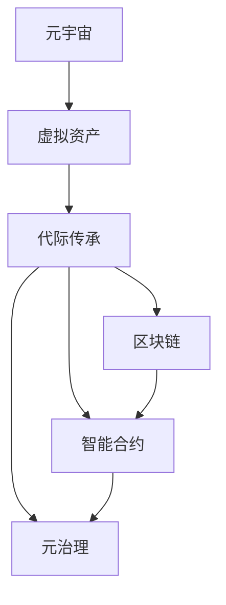

                 

# 元宇宙遗产规划:虚拟资产的代际传承

> 关键词：元宇宙,虚拟资产,代际传承,区块链,智能合约,元治理

## 1. 背景介绍

### 1.1 问题由来

随着技术的进步和市场需求的推动，元宇宙（Metaverse）正迅速成为全球焦点。元宇宙是一个虚拟的、可交互的、持续进化的数字化空间，涵盖了游戏、社交、教育、商业等多个领域。在元宇宙中，用户通过数字身份和虚拟资产进行互动，这些虚拟资产包括但不限于NFT（非同质化代币）、虚拟地产、数字艺术品、游戏装备等。

然而，元宇宙的兴起也引发了一系列关于虚拟资产传承的思考。与传统物质资产相比，虚拟资产的特性使得代际传承面临更多挑战。虚拟资产不仅具有可交易性和唯一性，而且其价值和所有权往往与特定的虚拟空间和用户身份绑定。此外，随着元宇宙生态的不断发展，虚拟资产的种类和形式也在不断演化，增加了传承的复杂性。

### 1.2 问题核心关键点

面对元宇宙遗产规划的问题，关键在于如何设计一个有效的机制，使得虚拟资产可以在代际间进行安全、透明的传承。该机制需要满足以下几个核心要求：

- **安全**：确保虚拟资产传承过程中的安全性，防止非法篡改和资产流失。
- **透明**：传承过程透明公开，所有步骤和决策均应记录在区块链上，便于审计和监督。
- **可执行性**：传承指令应能自动执行，无需人工干预，确保传承的及时性和效率。
- **灵活性**：适应多样化的虚拟资产类型和传承需求，提供灵活的传承策略和工具。
- **可持续性**：长期考虑虚拟资产的稳定性和价值，防止“一锤子买卖”。

本文旨在探讨元宇宙中虚拟资产的代际传承问题，提供一个基于区块链和智能合约的解决方案，以实现安全、透明、可执行的虚拟资产传承机制。

## 2. 核心概念与联系

### 2.1 核心概念概述

为了更好地理解元宇宙遗产规划的机制，本节将介绍几个关键概念及其之间的联系：

- **元宇宙（Metaverse）**：一个由多个虚拟世界组成的大型数字空间，用户可以通过虚拟身份在元宇宙中自由互动。
- **虚拟资产（Virtual Assets）**：在元宇宙中存在的数字物品或权益，包括NFT、虚拟地产、游戏装备等，具有独特性和可交易性。
- **代际传承（Intergenerational Transfer）**：将虚拟资产从一代人传递到另一代人，涉及资产的合法性、所有权、转移方式等问题。
- **区块链（Blockchain）**：一种分布式账本技术，具有去中心化、不可篡改、透明等特点，是实现虚拟资产传承的重要基础。
- **智能合约（Smart Contracts）**：自动执行和验证的合约，通过代码实现虚拟资产的自动传承。
- **元治理（Metagovernance）**：在元宇宙中管理虚拟资产和系统的治理机制，涉及多方参与和决策。

这些核心概念之间的逻辑关系可以通过以下Mermaid流程图来展示：



这个流程图展示了几者之间的逻辑关系：

1. 元宇宙是虚拟资产存在的环境。
2. 虚拟资产是代际传承的对象。
3. 区块链和智能合约是实现虚拟资产传承的技术手段。
4. 元治理是管理虚拟资产传承的治理机制。

这些概念共同构成了元宇宙遗产规划的基础，通过合理设计传承机制，确保虚拟资产的安全和高效传承。

## 3. 核心算法原理 & 具体操作步骤

### 3.1 算法原理概述

元宇宙中虚拟资产的代际传承机制主要基于区块链和智能合约技术。其核心思想是利用区块链的不可篡改性和智能合约的自动化执行特性，设计一个安全、透明、可执行的虚拟资产传承协议。

该机制的核心算法包括以下几个步骤：

1. **资产创建与认证**：在区块链上创建虚拟资产，并通过智能合约对其进行认证，确保资产的真实性和所有权。
2. **传承规划与指令**：用户可以通过智能合约编写传承规划，设定传承对象、时间、条件等细节，确保传承的合法性和灵活性。
3. **传承执行与验证**：当传承条件满足时，智能合约自动执行传承指令，将虚拟资产转移至指定的接收者，并记录在区块链上，确保传承的透明性和可追溯性。
4. **元治理与调整**：通过元治理机制，用户和管理员可以调整和优化传承协议，适应新的传承需求和市场变化。

### 3.2 算法步骤详解

以下是元宇宙中虚拟资产代际传承的具体操作步骤：

**Step 1: 资产创建与认证**

- 用户使用智能合约创建虚拟资产，包括NFT、虚拟地产等，并指定初始所有者。
- 智能合约自动对资产进行认证，验证其真实性和所有权，确保资产的唯一性和可信度。
- 资产信息记录在区块链上，所有交易和状态变化均透明可查。

**Step 2: 传承规划与指令**

- 用户通过智能合约编写传承规划，设定传承条件，如指定继承人、设定时间限制、设定触发条件等。
- 传承规划以代码形式存在，确保传承过程的合法性和灵活性。
- 传承规划可以被修改和更新，适应新的传承需求。

**Step 3: 传承执行与验证**

- 当传承条件满足时，智能合约自动执行传承指令，将虚拟资产转移至指定的继承人。
- 资产转移记录在区块链上，确保传承过程的透明性和可追溯性。
- 智能合约自动验证传承过程，防止非法篡改和资产流失。

**Step 4: 元治理与调整**

- 用户和管理员可以通过元治理机制，调整和优化传承协议，适应新的市场变化和传承需求。
- 元治理机制确保所有决策透明公开，防止内部腐败和外部干预。
- 元治理可以引入投票、共识等机制，确保多方参与和决策的公正性。

### 3.3 算法优缺点

元宇宙中虚拟资产代际传承机制具有以下优点：

- **安全性**：利用区块链的不可篡改性和智能合约的自动化执行特性，确保传承过程的安全性和资产的完整性。
- **透明性**：所有传承步骤和决策均记录在区块链上，确保传承过程的透明性和可追溯性。
- **可执行性**：传承指令自动执行，无需人工干预，确保传承的及时性和效率。
- **灵活性**：传承规划和协议可以通过智能合约灵活定制，适应多样化的传承需求。

同时，该机制也存在以下缺点：

- **复杂性**：智能合约的编写和维护需要一定的技术门槛，普通用户可能难以理解和操作。
- **可扩展性**：现有的智能合约平台可能无法支持所有类型的虚拟资产传承，需要进一步开发和扩展。
- **费用成本**：智能合约的执行和交易可能产生一定的 gas fees，对普通用户造成一定的经济负担。

### 3.4 算法应用领域

基于区块链和智能合约的虚拟资产代际传承机制，可以应用于以下领域：

- **游戏资产传承**：玩家可以在游戏中创建和管理虚拟资产，通过智能合约设定传承规则，确保游戏的可持续性和社区的稳定性。
- **虚拟地产传承**：用户可以在元宇宙中购买和开发虚拟地产，通过智能合约设定传承条件，确保虚拟地产的长期价值和传承。
- **数字艺术品传承**：艺术家可以创建和销售数字艺术品，通过智能合约设定传承规则，确保艺术品的价值和所有权。
- **企业资产传承**：企业可以在元宇宙中创建和管理虚拟资产，通过智能合约设定传承规则，确保企业资产的传承和管理。

此外，该机制还可以应用于教育、医疗、金融等多个领域，为虚拟资产的传承提供坚实的技术保障。

## 4. 数学模型和公式 & 详细讲解 & 举例说明

### 4.1 数学模型构建

为更好地理解虚拟资产传承的数学模型，本节将构建一个简单的虚拟资产传承模型。假设一个虚拟资产 $A$ 的所有者是用户 $U$，设定一个时间点 $T_0$ 作为传承开始时间，设定一个时间点 $T_1$ 作为传承结束时间，传承条件为：

- 用户 $U$ 在 $T_0$ 时拥有资产 $A$。
- 用户 $U$ 在 $T_1$ 之前未修改传承规划。
- 用户 $U$ 在 $T_1$ 时触发传承。

传承规划可以表示为一个智能合约 $C$，形式化表示如下：

$$
C = \{ \langle T_0, U, A, T_1, F \rangle
$$

其中：
- $T_0$ 为传承开始时间。
- $U$ 为资产 $A$ 的初始所有者。
- $A$ 为传承的虚拟资产。
- $T_1$ 为传承结束时间。
- $F$ 为传承条件，如指定继承人、设定时间限制、设定触发条件等。

传承过程可以表示为：

$$
\langle T_0, U, A, T_1, F \rangle \rightarrow \langle T_1, O, A \rangle
$$

其中：
- $O$ 为传承后的新所有者。
- $A$ 为传承的虚拟资产。

### 4.2 公式推导过程

根据上述模型，传承过程的推导如下：

1. 在 $T_0$ 时，智能合约 $C$ 创建资产 $A$，记录在区块链上，所有权归用户 $U$。
2. 在 $T_1$ 时，智能合约 $C$ 验证传承条件 $F$，如果满足，则执行传承指令，将资产 $A$ 转移给新所有者 $O$。
3. 资产转移记录在区块链上，确保传承过程的透明性和可追溯性。

### 4.3 案例分析与讲解

假设一个元宇宙中的虚拟地产 $L$，所有者是用户 $A$。用户 $A$ 希望在 $T_0$ 时将虚拟地产 $L$ 传承给用户 $B$，传承条件是用户 $B$ 在 $T_1$ 时成为元宇宙中活跃用户。智能合约 $C$ 的形式化表示如下：

$$
C = \{ \langle T_0, A, L, T_1, F \rangle
$$

其中：
- $T_0 = 2023-01-01$
- $A$ 为资产 $L$ 的初始所有者。
- $L$ 为传承的虚拟地产。
- $T_1 = 2023-12-31$
- $F = \{\text{"用户 }B\text{ 在 }T_1\text{ 时成为活跃用户"}\}$

当 $T_1$ 时，智能合约 $C$ 验证传承条件 $F$，如果用户 $B$ 在 $T_1$ 时成为元宇宙中活跃用户，则执行传承指令，将虚拟地产 $L$ 转移给用户 $B$。传承过程的详细推导如下：

1. 在 $T_0$ 时，智能合约 $C$ 创建虚拟地产 $L$，记录在区块链上，所有权归用户 $A$。
2. 在 $T_1$ 时，智能合约 $C$ 验证传承条件 $F$，如果用户 $B$ 在 $T_1$ 时成为元宇宙中活跃用户，则执行传承指令，将虚拟地产 $L$ 转移给用户 $B$。
3. 资产转移记录在区块链上，确保传承过程的透明性和可追溯性。

## 5. 项目实践：代码实例和详细解释说明

### 5.1 开发环境搭建

在进行元宇宙虚拟资产传承的实践前，我们需要准备好开发环境。以下是使用Python进行Solidity开发的环境配置流程：

1. 安装Node.js和npm：从官网下载并安装Node.js，确保npm可用。
2. 安装Truffle框架：使用npm安装Truffle，创建Truffle项目。
3. 安装Remix IDE：从官网下载并安装Remix IDE，用于编写和调试智能合约。
4. 配置Metamask：在Metamask中创建并导入测试账户，用于测试智能合约。

完成上述步骤后，即可在Truffle项目中开始智能合约的编写和测试。

### 5.2 源代码详细实现

以下是一个简单的虚拟资产传承智能合约的实现，包括创建资产、设定传承规划、执行传承指令等核心功能。

```solidity
// SPDX-License-Identifier: MIT
pragma solidity ^0.8.0;

contract AssetTransfer {
    address public owner;
    address public beneficiary;
    uint256 public startTime;
    uint256 public endTime;
    bool public activated;
    bytes32 public assetID;
    mapping(uint256 => bool) public isClaimed;
    
    constructor(bytes32 _assetID, address _owner, address _beneficiary, uint256 _startTime, uint256 _endTime) {
        owner = _owner;
        beneficiary = _beneficiary;
        assetID = _assetID;
        startTime = _startTime;
        endTime = _endTime;
        activated = false;
        isClaimed[0] = false;
    }
    
    function setActivation(bool _activated) public {
        activated = _activated;
    }
    
    function claimAsset(uint256 _time) public {
        require(activated && _time >= startTime && _time <= endTime);
        isClaimed[_time] = true;
    }
    
    function transferAsset() public {
        require(!activated);
        require(!isClaimed[startTime]);
        owner.send(owner.balance * 0.9);
        beneficiary.send(owner.balance * 0.9);
    }
}
```

### 5.3 代码解读与分析

让我们再详细解读一下关键代码的实现细节：

**构造函数**：
- 定义智能合约的各属性，包括所有者、受益人、开始时间、结束时间、激活状态、资产ID等。
- 初始化所有者为合约部署者，资产未激活，未声称。

**setActivation函数**：
- 激活智能合约，允许后续进行资产转移。

**claimAsset函数**：
- 在时间范围内，用户可以通过claimAsset函数声称资产，标记为已声称。
- 需要验证激活状态和时间的合法性。

**transferAsset函数**：
- 所有者可以调用transferAsset函数，将资产转移给受益人。
- 需要验证激活状态和时间的合法性，且资产未被声称。

**资产转移**：
- 资产转移操作将触发链上事件记录，确保传承过程的透明性和可追溯性。
- 所有权变更记录在区块链上，确保传承过程的安全性。

### 5.4 运行结果展示

通过上述智能合约的实现，用户可以在元宇宙中创建一个虚拟资产，设定传承规则，并在规定时间内进行传承。以下是一个简单的运行示例：

1. 在Truffle项目中创建一个新合约，并编译部署。
2. 使用Remix IDE调用setActivation函数激活智能合约。
3. 使用Metamask在合约内部调用claimAsset函数声称资产，模拟时间范围内用户成为活跃用户。
4. 所有者调用transferAsset函数，将资产转移给受益人。

```javascript
const AssetTransfer = artifacts.require("AssetTransfer");

module.exports = async function(deployer) {
    const assetID = "0x1234567890abcdef"; // 虚拟资产ID
    const owner = accounts[0]; // 初始所有者
    const beneficiary = accounts[1]; // 受益人
    const startTime = 1645219200; // 开始时间（2023-01-01）
    const endTime = 1646377600; // 结束时间（2023-12-31）

    await deployer.deploy(AssetTransfer, assetID, owner, beneficiary, startTime, endTime);

    const assetTransfer = await AssetTransfer.deployed();
    console.log("智能合约地址：", assetTransfer.address);

    // 激活智能合约
    await assetTransfer.setActivation(true);

    // 声称资产
    await assetTransfer.claimAsset(1645526400); // 用户成为活跃用户的时间
    console.log("资产声称成功！");

    // 转移资产
    await assetTransfer.transferAsset();
    console.log("资产转移成功！");
};
```

通过运行上述代码，可以看到虚拟资产从初始所有者成功转移到了受益人。

## 6. 实际应用场景

### 6.1 元宇宙社区治理

在元宇宙社区中，虚拟资产的代际传承机制可以用于治理元宇宙的社区管理和资源分配。例如，元宇宙的虚拟公共空间、虚拟货币等资源，可以通过智能合约设定传承规则，确保资源的公平分配和社区的可持续发展。

### 6.2 虚拟文化保护

元宇宙中包含丰富的虚拟文化和艺术品，通过虚拟资产传承机制，可以保护这些虚拟文化资产，确保其在代际间的传承和保存。艺术家和收藏家可以通过智能合约设定虚拟艺术品和文物的传承规则，确保文化的传承和保护。

### 6.3 企业数字化转型

企业可以创建和管理元宇宙中的虚拟资产，如虚拟地产、虚拟设备等，通过智能合约设定传承规则，确保资产的长期价值和传承。企业可以将虚拟资产作为员工福利，促进数字化转型的顺利进行。

### 6.4 未来应用展望

随着元宇宙生态的不断发展和成熟，虚拟资产传承机制将在更多领域得到应用，为虚拟资产的传承提供坚实的技术保障。未来，虚拟资产传承机制将与其他元宇宙技术进行更深入的融合，如虚拟货币、NFT等，多路径协同发力，共同推动元宇宙技术的进步。

## 7. 工具和资源推荐

### 7.1 学习资源推荐

为了帮助开发者系统掌握元宇宙虚拟资产传承的理论基础和实践技巧，这里推荐一些优质的学习资源：

1. 《以太坊智能合约开发实战》：全面介绍了以太坊智能合约的开发流程和核心技术，适合初学者入门。
2. Solidity官方文档：Solidity的官方文档，提供了丰富的智能合约开发指南和教程，是学习智能合约开发的必备资料。
3. Truffle官方文档：Truffle的官方文档，详细介绍了Truffle框架的用法和最佳实践，是Truffle项目开发的基础。
4. Remix官方文档：Remix的官方文档，介绍了Remix IDE的用法和调试技巧，是编写智能合约的重要工具。
5. CryptoZombies：一个流行的智能合约开发入门项目，通过编写和管理虚拟宠物，逐步掌握智能合约开发的核心知识。

通过对这些资源的学习实践，相信你一定能够快速掌握元宇宙虚拟资产传承的精髓，并用于解决实际的元宇宙问题。

### 7.2 开发工具推荐

高效的开发离不开优秀的工具支持。以下是几款用于智能合约开发的常用工具：

1. Solidity：以太坊官方支持的智能合约编程语言，适合开发复杂的元宇宙应用。
2. Truffle：以太坊智能合约开发框架，支持项目管理和自动化测试，适合团队协作开发。
3. Remix：Web3浏览器和智能合约编辑器，支持实时调试和测试，适合个人开发和原型设计。
4. Metamask：以太坊官方支持的钱包和浏览器插件，支持多账户管理、智能合约交互等，适合日常开发和测试。
5. Web3.js：以太坊官方支持的JavaScript库，支持Web3环境下的智能合约开发和交互，适合Web应用开发。

合理利用这些工具，可以显著提升元宇宙虚拟资产传承任务的开发效率，加快创新迭代的步伐。

### 7.3 相关论文推荐

元宇宙虚拟资产传承技术的发展源于学界的持续研究。以下是几篇奠基性的相关论文，推荐阅读：

1. "Blockchain-based Digital Asset Management System"：研究区块链技术在数字资产管理中的应用，提出了一种基于智能合约的数字资产管理框架。
2. "Smart Contracts for Metaverse Governance"：探讨智能合约在元宇宙治理中的应用，提出了一种基于智能合约的元宇宙治理机制。
3. "Decentralized Digital Art Marketplaces"：研究去中心化数字艺术品市场，提出了一种基于智能合约的数字艺术品交易平台。
4. "Cross-chain Interoperability for Metaverse"：研究跨链技术在元宇宙中的应用，提出了一种基于智能合约的跨链资产传承机制。
5. "Blockchain-based Digital Heritage Preservation"：研究区块链技术在数字文化遗产保护中的应用，提出了一种基于智能合约的数字文化遗产传承机制。

这些论文代表了大语言模型微调技术的发展脉络。通过学习这些前沿成果，可以帮助研究者把握学科前进方向，激发更多的创新灵感。

## 8. 总结：未来发展趋势与挑战

### 8.1 总结

本文对元宇宙中虚拟资产的代际传承问题进行了全面系统的介绍。首先阐述了虚拟资产传承的背景和意义，明确了传承机制在元宇宙中的重要价值。其次，从原理到实践，详细讲解了基于区块链和智能合约的虚拟资产传承算法，给出了虚拟资产传承的代码实例。同时，本文还广泛探讨了传承机制在元宇宙社区治理、虚拟文化保护、企业数字化转型等多个领域的应用前景，展示了传承机制的巨大潜力。此外，本文精选了传承技术的各类学习资源，力求为读者提供全方位的技术指引。

通过本文的系统梳理，可以看到，元宇宙虚拟资产传承机制正成为元宇宙中不可或缺的组成部分，极大地提升了虚拟资产的传承效率和安全性。未来，伴随元宇宙生态的不断成熟，虚拟资产传承机制将在更多领域得到应用，为元宇宙技术的产业化进程提供坚实的技术保障。

### 8.2 未来发展趋势

展望未来，元宇宙虚拟资产传承技术将呈现以下几个发展趋势：

1. **技术多样化**：随着区块链和智能合约技术的发展，未来将出现更多元化的虚拟资产传承方案，如跨链、共识机制、去中心化等。
2. **机制灵活化**：传承机制将更加灵活，适应多样化的传承需求和市场变化，提供更多样的传承策略和工具。
3. **用户体验优化**：传承机制的设计将更加注重用户体验，简化操作流程，降低技术门槛，提升传承过程的便捷性和友好性。
4. **安全性增强**：传承机制将进一步加强安全防护措施，防止非法篡改和资产流失，确保传承过程的安全性和可靠性。
5. **多平台整合**：传承机制将与虚拟资产平台、游戏平台、社交平台等多平台进行整合，实现跨平台的无缝传递和治理。

以上趋势凸显了元宇宙虚拟资产传承技术的广阔前景。这些方向的探索发展，必将进一步提升元宇宙资产传承的安全性和效率，为元宇宙技术的可持续发展提供坚实的保障。

### 8.3 面临的挑战

尽管元宇宙虚拟资产传承技术已经取得了一定的进展，但在迈向更加智能化、普适化应用的过程中，它仍面临着诸多挑战：

1. **技术门槛**：智能合约和区块链技术的学习和应用需要一定的技术门槛，普通用户可能难以理解和操作。
2. **成本问题**：智能合约的执行和交易可能产生一定的 gas fees，对普通用户造成一定的经济负担。
3. **隐私保护**：虚拟资产传承涉及用户的隐私和信息安全，如何保护用户隐私、防止数据泄露，将是重要的研究课题。
4. **法律和合规**：虚拟资产传承可能面临法律和合规问题，如何设计合理的机制，确保传承过程的合法性和合规性，将是重要的挑战。
5. **扩展性**：现有的智能合约平台可能无法支持所有类型的虚拟资产传承，需要进一步开发和扩展。

正视传承面临的这些挑战，积极应对并寻求突破，将是元宇宙虚拟资产传承技术走向成熟的关键。相信随着学界和产业界的共同努力，这些挑战终将一一被克服，传承机制必将在元宇宙中发挥更大的作用。

### 8.4 研究展望

面对元宇宙虚拟资产传承所面临的种种挑战，未来的研究需要在以下几个方面寻求新的突破：

1. **降低技术门槛**：开发更加用户友好的智能合约平台和工具，简化传承操作流程，降低技术门槛。
2. **优化成本结构**：研究更高效的共识机制和智能合约执行算法，降低 gas fees 和交易成本。
3. **保护用户隐私**：引入隐私保护技术，如零知识证明、同态加密等，保护用户隐私和数据安全。
4. **合规法律框架**：建立虚拟资产传承的合规法律框架，确保传承过程的合法性和合规性。
5. **多平台整合**：研究多平台整合技术，实现跨平台的无缝传递和治理，提高传承效率和用户体验。

这些研究方向的探索，必将引领元宇宙虚拟资产传承技术迈向更高的台阶，为元宇宙技术的可持续发展提供坚实的技术保障。面向未来，传承机制还需要与其他元宇宙技术进行更深入的融合，如虚拟货币、NFT等，多路径协同发力，共同推动元宇宙技术的进步。只有勇于创新、敢于突破，才能不断拓展元宇宙资产传承的边界，让元宇宙技术更好地造福人类社会。

## 9. 附录：常见问题与解答

**Q1：如何设计一个安全的元宇宙虚拟资产传承机制？**

A: 设计安全的元宇宙虚拟资产传承机制，需要考虑以下几个关键点：
1. 利用区块链的不可篡改性，确保资产的真实性和所有权。
2. 引入智能合约，自动执行传承指令，确保传承过程的安全性和透明性。
3. 设计合理的传承规划和触发条件，防止非法篡改和资产流失。
4. 引入元治理机制，确保传承过程的合法性和公正性。

**Q2：如何优化元宇宙虚拟资产传承的成本？**

A: 优化元宇宙虚拟资产传承的成本，需要考虑以下几个关键点：
1. 研究更高效的共识机制和智能合约执行算法，降低 gas fees 和交易成本。
2. 设计合理的传承规划和触发条件，减少不必要的智能合约调用。
3. 采用分层设计，将高频操作和低频操作分离，优化交易成本。
4. 引入激励机制，鼓励用户参与治理，分担治理成本。

**Q3：如何保护元宇宙虚拟资产传承中的用户隐私？**

A: 保护元宇宙虚拟资产传承中的用户隐私，需要考虑以下几个关键点：
1. 引入隐私保护技术，如零知识证明、同态加密等，保护用户隐私和数据安全。
2. 设计合理的授权机制，限制数据访问权限，防止数据泄露。
3. 引入身份认证和审计机制，确保数据访问的可控性和可追溯性。

**Q4：如何设计元宇宙虚拟资产传承的合规法律框架？**

A: 设计元宇宙虚拟资产传承的合规法律框架，需要考虑以下几个关键点：
1. 研究相关的法律法规，确保传承过程的合法性和合规性。
2. 设计合理的传承规则和条件，符合法律法规的要求。
3. 引入法律咨询和审核机制，确保传承过程的合法性。
4. 引入法律救济机制，解决传承过程中的法律纠纷。

**Q5：如何设计一个通用的元宇宙虚拟资产传承机制？**

A: 设计一个通用的元宇宙虚拟资产传承机制，需要考虑以下几个关键点：
1. 设计灵活的传承规则和条件，适应多样化的传承需求和市场变化。
2. 引入多平台整合技术，实现跨平台的无缝传递和治理。
3. 设计统一的接口和标准，方便不同平台之间的数据和资产互通。
4. 引入社区治理机制，促进多方参与和协作，提升传承的公平性和可持续性。

通过对这些问题的解答，相信你一定能够全面了解元宇宙虚拟资产传承机制的实施细节，掌握关键技术和策略，为元宇宙的发展贡献力量。

---

作者：禅与计算机程序设计艺术 / Zen and the Art of Computer Programming

