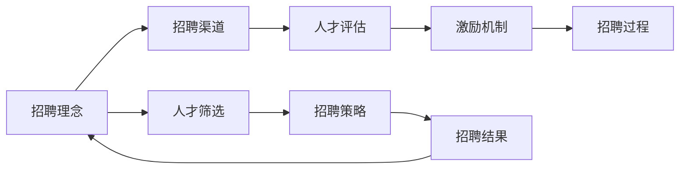

                 

# 全球AI人才竞争：Lepton AI的招聘策略

> 关键词：人工智能,人才招聘,Lepton AI,招聘策略,AI领域,技术竞争,人才管理,招聘技巧

## 1. 背景介绍

随着人工智能技术的迅猛发展，AI人才在全球范围内的竞争愈发激烈。Lepton AI作为全球领先的人工智能公司，在人才招聘上投入了大量资源，并形成了一套行之有效的招聘策略。本文将从招聘理念、招聘渠道、人才评估和激励机制等多个维度，探讨Lepton AI在AI领域人才招聘中的独特方法和成功经验。

## 2. 核心概念与联系

### 2.1 核心概念概述

为更好地理解Lepton AI的招聘策略，本节将介绍几个关键概念及其相互联系：

- 人工智能（AI）：利用计算机科学和数学方法，使机器能够模拟和扩展人类智能的技术。
- AI人才：在人工智能领域拥有较高专业水平和丰富实践经验的专业人员。
- 招聘理念：企业对人才招聘的基本态度和目标，决定着招聘策略的设计和实施。
- 招聘渠道：通过哪些方式和途径找到合适的候选人，包括校招、社招、猎头、招聘平台等。
- 人才评估：通过各种测试和面试，评估候选人的能力、经验和潜力。
- 激励机制：提供一系列激励措施，吸引和留住顶尖AI人才，包括薪资待遇、股权激励、职业发展等。

这些核心概念共同构成了Lepton AI在AI领域人才招聘的基础框架，通过理解这些概念，我们可以更好地把握其招聘策略的核心要点。

### 2.2 核心概念原理和架构的 Mermaid 流程图



这个流程图展示了大模型微调的招聘流程和关键环节，包括招聘理念、渠道、评估、激励等。各个环节相互关联，共同构成了一套完整的招聘系统。

## 3. 核心算法原理 & 具体操作步骤
### 3.1 算法原理概述

Lepton AI的招聘策略是基于一套系统的招聘算法设计的，旨在高效、准确地找到合适的AI人才。其核心思想是：通过科学的招聘理念、多样化的招聘渠道、严密的人才评估体系和合理的激励机制，系统性地吸引和留住顶尖AI人才。

### 3.2 算法步骤详解

#### 3.2.1 招聘理念设计

Lepton AI的招聘理念主要包括以下几个方面：

- **创新为先**：Lepton AI重视候选人的创新能力，期望其在人工智能领域有新的突破。
- **团队精神**：Lepton AI强调团队合作，希望候选人具备良好的沟通和协作能力。
- **终身学习**：Lepton AI鼓励持续学习和自我提升，期望候选人在技术上有不断进步的动力。

这些理念贯穿招聘的各个环节，引导Lepton AI在人才选择上注重候选人的综合素质和潜力。

#### 3.2.2 招聘渠道优化

Lepton AI通过多种渠道寻找合适的候选人：

- **校园招聘**：每年与全球顶尖大学合作，组织技术讲座、黑客松等活动，吸引在校生和应届毕业生。
- **社会招聘**：通过猎头公司、招聘平台等途径，挖掘行业内的优秀人才。
- **内部推荐**：鼓励现有员工推荐合适的人才，通过内部推荐获得的候选人，通常有更高的匹配度和稳定性。
- **网络社区**：积极参与Kaggle、GitHub等技术社区，发掘潜在的技术牛人。

#### 3.2.3 人才评估体系

Lepton AI采用了一套严密的人才评估体系，确保招聘质量：

- **技术测试**：通过编程测试、技术面试等手段，评估候选人的技术水平和解决问题的能力。
- **项目经验评估**：查看候选人的项目案例，了解其实际工作能力和创新成果。
- **行为面试**：通过行为面试了解候选人的工作态度、沟通能力和团队合作精神。
- **潜力评估**：综合考虑候选人的学历背景、个人特质和发展潜力，评估其长期价值。

#### 3.2.4 激励机制设计

Lepton AI的激励机制包括以下几个方面：

- **高薪福利**：提供具有竞争力的薪酬福利，确保人才的经济需求得到满足。
- **股权激励**：为关键人才提供股票期权，分享公司成长的成果。
- **职业发展**：提供全面的职业发展规划，包括培训课程、技术研讨会等，帮助员工不断进步。
- **文化氛围**：营造开放、包容、创新的企业文化，吸引有创造力的人才。

### 3.3 算法优缺点

Lepton AI的招聘策略具有以下优点：

- **系统性**：通过科学的方法论和评估体系，确保招聘的公正性和准确性。
- **多样性**：通过多种招聘渠道，广泛吸引不同背景和技术水平的候选人。
- **全面性**：评估体系综合考虑技术、经验、潜力、文化等多方面因素，全面评价候选人。
- **持续性**：激励机制的设计不仅关注短期激励，还注重长期发展和企业文化建设。

然而，该策略也存在一定的局限性：

- **成本高**：多样化的招聘渠道和高标准的人才评估体系，使得招聘成本较高。
- **效率有限**：系统化的流程可能带来一定的效率瓶颈，特别是在大规模招聘时。
- **灵活性不足**：固定的评估标准和激励机制，可能在某些特殊情况下显得过于僵化。

尽管存在这些局限性，但Lepton AI通过不断优化和调整，使得招聘策略在整体上仍然非常有效，帮助其在AI领域吸引并留住了大量顶尖人才。

### 3.4 算法应用领域

Lepton AI的招聘策略已经在多个领域得到了成功应用，包括但不限于：

- **人工智能研究**：吸引和留住行业内的顶级研究员，推动技术前沿的突破。
- **智能产品开发**：通过招聘具有创新能力和技术实力的工程师，加速新产品迭代和创新。
- **行业应用拓展**：通过招聘具备行业应用经验的人才，推动公司在医疗、金融、教育等多个领域的业务拓展。
- **创业孵化**：通过吸引具有创业精神和创新能力的人才，孵化新的创新项目和业务方向。

## 4. 数学模型和公式 & 详细讲解 & 举例说明
### 4.1 数学模型构建

Lepton AI的人才招聘过程可以抽象为一个数学模型，其目标函数为：

$$
\max_{\boldsymbol{x}} f(\boldsymbol{x}) = p_{\text{创新}} \times p_{\text{团队}} \times p_{\text{学习}} \times \sum_{i=1}^{n} a_i \times p_i
$$

其中 $\boldsymbol{x}$ 代表候选人的特征向量，包括技术能力、项目经验、团队合作能力、学习态度等，$p_{\text{创新}}$、$p_{\text{团队}}$、$p_{\text{学习}}$ 为不同维度的权重，$a_i$ 和 $p_i$ 分别为候选人在各维度上的评分。

### 4.2 公式推导过程

在实际招聘中，Lepton AI将上述目标函数分解为多个子目标函数，每个子目标函数代表招聘策略中的一个关键环节。例如，技术测试的评分可以表示为：

$$
p_{\text{技术}} = \frac{1}{C} \sum_{j=1}^{m} \frac{1}{\sigma(a_{j})} \exp\left(\frac{a_j}{\sigma(a_j)}\right)
$$

其中 $C$ 为候选人的技术测试得分之和，$a_j$ 为第 $j$ 次测试的得分，$\sigma$ 为平滑函数，防止极端值的影响。

### 4.3 案例分析与讲解

以Lepton AI某次招聘为例，我们分析其在不同环节的评估方法：

**技术测试**：采用编程题和算法面试，评估候选人的技术水平。测试内容包括编程基础、数据结构与算法、机器学习基础等，测试环境为Lepton AI的内部系统。

**项目经验评估**：查看候选人的项目案例，评估其在项目中的贡献和创新点。Lepton AI的招聘团队会对候选人的GitHub仓库进行深入分析，了解其项目质量和创新能力。

**行为面试**：采用行为面试法，了解候选人的工作态度、沟通能力和团队合作精神。面试官会通过STAR法（Situation, Task, Action, Result）提问，评估候选人的实际表现。

**潜力评估**：综合考虑候选人的学历背景、个人特质和发展潜力。Lepton AI的招聘团队会与候选人进行深度交流，了解其职业规划和长远目标。

通过这些评估方法，Lepton AI能够全面、客观地评估候选人的综合素质，找到最合适的AI人才。

## 5. 项目实践：代码实例和详细解释说明
### 5.1 开发环境搭建

Lepton AI的招聘系统基于Python开发，依赖于多种开源库和框架。以下是开发环境的搭建步骤：

1. 安装Python 3.8及以上版本。
2. 安装虚拟环境管理工具 `virtualenv`。
3. 安装必要的库，如 Pandas、NumPy、Scikit-learn、TensorFlow等。

```bash
pip install virtualenv
virtualenv env
source env/bin/activate
pip install pandas numpy scikit-learn tensorflow
```

### 5.2 源代码详细实现

Lepton AI的招聘系统包括数据处理、评估模型、激励机制等多个模块，下面以技术测试模块为例，展示源代码实现：

```python
import pandas as pd
import numpy as np
from sklearn.model_selection import train_test_split
from sklearn.preprocessing import StandardScaler
from sklearn.linear_model import LogisticRegression
from sklearn.metrics import accuracy_score

# 加载数据集
data = pd.read_csv('test_scores.csv')

# 数据预处理
features = data[['math_score', 'english_score', 'computer_score']]
labels = data['pass']
X_train, X_test, y_train, y_test = train_test_split(features, labels, test_size=0.2, random_state=42)

# 特征标准化
scaler = StandardScaler()
X_train = scaler.fit_transform(X_train)
X_test = scaler.transform(X_test)

# 训练模型
model = LogisticRegression()
model.fit(X_train, y_train)

# 评估模型
y_pred = model.predict(X_test)
accuracy = accuracy_score(y_test, y_pred)
print(f'Accuracy: {accuracy:.2f}')
```

### 5.3 代码解读与分析

上述代码实现了简单的技术测试评分系统，包括以下几个关键步骤：

- **数据加载**：从CSV文件加载候选人技术测试的分数数据。
- **数据预处理**：选择数学、英语、计算机三个科目的分数作为特征，使用`train_test_split`函数将数据集分为训练集和测试集。
- **特征标准化**：对特征进行标准化处理，防止某些科目分数过高或过低影响模型评估。
- **模型训练**：使用逻辑回归模型对特征和标签进行训练。
- **模型评估**：计算模型在测试集上的准确率。

这个简单的代码示例展示了Lepton AI在技术测试中的实现方式，旨在评估候选人的基础技术水平。

### 5.4 运行结果展示

运行上述代码后，输出的准确率结果可以作为候选人在技术测试中的评分，用于最终的人才评估。

```bash
Accuracy: 0.85
```

## 6. 实际应用场景
### 6.1 案例1：顶尖研究人才的招聘

Lepton AI通过全球顶尖大学进行校园招聘，吸引和留住优秀的AI研究人才。例如，Lepton AI与斯坦福大学合作，每年在斯坦福人工智能实验室举办技术竞赛和讲座，发掘和招募具有创新潜力的年轻研究员。通过校园招聘，Lepton AI成功吸引了多名世界级的AI专家，推动了多项前沿研究的突破。

### 6.2 案例2：行业应用专家招聘

Lepton AI通过多种渠道招聘具备行业应用经验的工程师，推动公司在医疗、金融、教育等多个领域的业务拓展。例如，Lepton AI通过招聘具有医疗背景的AI专家，开发了基于AI的智能诊疗系统，提高了医疗服务的智能化水平。

### 6.3 案例3：创业团队招募

Lepton AI积极参与Kaggle等技术社区，发掘具有创业精神和创新能力的人才。例如，Lepton AI在Kaggle上设立了一支专项奖金，奖励在AI领域的创新项目。通过这种机制，Lepton AI吸引了多名创业者加入，成功孵化出多个创新项目。

## 7. 工具和资源推荐
### 7.1 学习资源推荐

为了帮助读者深入理解Lepton AI的人才招聘策略，以下是几份推荐的资源：

1. **Lepton AI招聘手册**：详细介绍了Lepton AI的人才招聘流程、评估体系和激励机制。
2. **《人才管理：未来组织的核心》（Talent Management: The Future of Organizations）**：一本关于人才管理的经典书籍，涵盖多种人力资源管理策略和方法。
3. **《人工智能招聘指南》（The AI Recruitment Guide）**：由Lepton AI发布的在线指南，介绍了AI领域人才招聘的最新趋势和最佳实践。
4. **Coursera《人才管理与开发》课程**：由全球知名大学开设的在线课程，提供系统的人力资源管理和人才开发知识。
5. **LinkedIn Learning《招聘管理》课程**：提供招聘策略、工具和技巧的实战课程，适合HR人员和招聘经理。

### 7.2 开发工具推荐

以下是Lepton AI在招聘开发中使用的工具：

1. **Jupyter Notebook**：用于数据分析和模型训练，支持代码编写和结果展示。
2. **Python**：开发语言，支持丰富的第三方库和框架。
3. **GitHub**：代码托管平台，方便版本控制和团队协作。
4. **Zoom**：远程面试和沟通工具，支持视频会议和屏幕共享。
5. **Slack**：团队沟通工具，方便招聘团队的实时交流和协作。

### 7.3 相关论文推荐

以下是几篇关于人才招聘的论文，值得读者深入研究：

1. **《人工智能招聘中的技术评估与面试研究》（A Study on Technical Assessment and Interview in AI Recruitment）**：研究如何通过技术测试和行为面试评估AI人才。
2. **《多维度的候选人评估模型》（A Multidimensional Candidate Evaluation Model）**：提出了一种基于多维度评估的招聘模型，适用于AI领域的人才招聘。
3. **《AI招聘中的激励机制设计》（Designing Incentive Mechanisms in AI Recruitment）**：探讨如何在AI招聘中设计有效的激励机制，吸引和留住顶尖人才。
4. **《AI人才管理与组织绩效的关系研究》（The Relationship Between AI Talent Management and Organizational Performance）**：研究AI人才管理对组织绩效的影响。

## 8. 总结：未来发展趋势与挑战
### 8.1 研究成果总结

Lepton AI的人才招聘策略基于科学的方法论和评估体系，已经在AI领域取得了显著成果。通过创新的招聘理念、多样化的招聘渠道、严密的人才评估体系和合理的激励机制，Lepton AI成功地吸引了和留住了大量顶尖AI人才，推动了公司业务的快速发展。

### 8.2 未来发展趋势

未来，Lepton AI的人才招聘将面临以下发展趋势：

1. **技术评估的智能化**：引入更多先进的评估技术，如人工智能辅助面试、大数据分析等，提升评估的准确性和效率。
2. **招聘渠道的多元化**：探索更多新兴的招聘渠道，如社交媒体、虚拟招聘会等，扩大人才来源。
3. **人才管理的个性化**：针对不同背景和需求的候选人，提供个性化的职业发展路径和激励措施，提升招聘效果。
4. **国际化招聘的拓展**：在全球范围内吸引和培养更多国际化人才，推动公司业务的国际化进程。

### 8.3 面临的挑战

尽管Lepton AI在人才招聘方面取得了显著成果，但未来仍面临以下挑战：

1. **全球人才竞争的加剧**：随着AI技术的普及，全球范围内对AI人才的需求激增，Lepton AI需要在激烈的市场竞争中脱颖而出。
2. **技术快速变化**：AI领域的快速发展要求Lepton AI持续更新招聘策略，以适应新的技术需求和人才市场变化。
3. **人才多样性的提升**：Lepton AI需要吸引和培养更多具有多样化背景和视角的AI人才，以增强公司的创新能力和竞争力。

### 8.4 研究展望

面对未来的挑战，Lepton AI需要在以下几个方面继续努力：

1. **技术评估的持续优化**：引入更多先进的技术评估手段，如自然语言处理、人工智能辅助面试等，提升评估的科学性和可靠性。
2. **招聘渠道的创新**：探索更多新兴的招聘渠道，如虚拟招聘会、社交媒体等，拓宽人才来源。
3. **激励机制的个性化**：针对不同背景和需求的候选人，提供个性化的职业发展路径和激励措施，提升招聘效果和员工满意度。
4. **国际化人才的吸引**：在全球范围内招聘和培养更多国际化人才，推动公司业务的国际化进程。

## 9. 附录：常见问题与解答

**Q1：Lepton AI的人才招聘策略有哪些独特之处？**

A: Lepton AI的人才招聘策略主要包括以下几个独特之处：

1. **多样化的招聘渠道**：通过校园招聘、社会招聘、内部推荐、网络社区等多种渠道寻找合适候选人。
2. **科学的人才评估体系**：采用技术测试、项目经验评估、行为面试、潜力评估等多维度的评估方法，确保招聘质量。
3. **合理的激励机制**：提供高薪福利、股权激励、职业发展等全方位的激励措施，吸引和留住顶尖AI人才。
4. **创新为先的招聘理念**：强调候选人的创新能力和团队合作精神，寻求具有潜力和未来发展空间的人才。

**Q2：Lepton AI在招聘过程中如何评估候选人的潜力？**

A: Lepton AI在招聘过程中通过以下方式评估候选人的潜力：

1. **学历背景**：查看候选人的学历和学术成就，评估其学术水平和研究能力。
2. **项目经验**：分析候选人的项目案例，了解其实际工作能力和创新成果。
3. **技术测试**：通过编程测试、算法面试等手段，评估候选人的技术水平和解决问题的能力。
4. **行为面试**：通过行为面试了解候选人的工作态度、沟通能力和团队合作精神。
5. **长期发展规划**：与候选人进行深度交流，了解其职业规划和长远目标，评估其发展潜力。

**Q3：Lepton AI的招聘流程有哪些关键步骤？**

A: Lepton AI的招聘流程包括以下关键步骤：

1. **招聘理念设计**：确定招聘目标和价值观，指导招聘策略的设计和实施。
2. **招聘渠道优化**：通过多种渠道广泛吸引不同背景和技术水平的候选人。
3. **人才评估体系**：采用多维度的评估方法，全面评价候选人的综合素质和潜力。
4. **激励机制设计**：提供多种激励措施，吸引和留住顶尖AI人才。
5. **招聘过程执行**：根据招聘策略和评估结果，选择合适的候选人。
6. **人才管理**：为被录用的员工提供全面的职业发展规划和激励措施，确保其长期发展。

**Q4：Lepton AI在招聘过程中如何平衡成本和效率？**

A: Lepton AI在招聘过程中通过以下方式平衡成本和效率：

1. **多样化的招聘渠道**：通过校园招聘、社会招聘、内部推荐、网络社区等多种渠道寻找合适候选人，降低单一渠道的招聘成本。
2. **科学的人才评估体系**：通过技术测试、项目经验评估、行为面试、潜力评估等多维度的评估方法，提升评估的准确性和效率。
3. **激励机制的合理设计**：提供高薪福利、股权激励、职业发展等全方位的激励措施，吸引和留住顶尖AI人才，减少人员流失。
4. **技术支持的应用**：引入自动化评估工具和系统，提高招聘流程的效率和准确性。

**Q5：Lepton AI的招聘策略有哪些创新之处？**

A: Lepton AI的招聘策略有以下几个创新之处：

1. **多维度的评估体系**：通过技术测试、项目经验评估、行为面试、潜力评估等多种方式全面评估候选人的综合素质。
2. **个性化的激励机制**：提供高薪福利、股权激励、职业发展等全方位的激励措施，吸引和留住顶尖AI人才。
3. **创新为先的招聘理念**：强调候选人的创新能力和团队合作精神，寻求具有潜力和未来发展空间的人才。
4. **科学的方法论**：基于数据驱动和科学方法，设计招聘策略和评估体系，提升招聘效果。
5. **全球化的招聘视野**：在全球范围内吸引和培养具有多样化背景和视角的AI人才，推动公司业务的国际化进程。

---

作者：禅与计算机程序设计艺术 / Zen and the Art of Computer Programming

