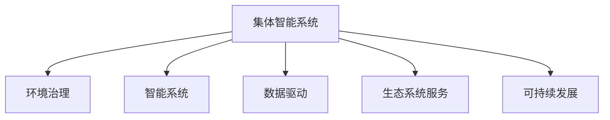

                 

# 全球脑与全球环境：集体合作的环境治理

> 关键词：环境治理, 全球合作, 智能系统, 数据驱动, 生态系统服务, 可持续发展

## 1. 背景介绍

### 1.1 问题由来
环境治理已经成为全球共识，它关系到人类的福祉、生物多样性保护、经济可持续发展。传统的环境治理方法主要是依赖法规、政策、技术等手段，但这些方法往往存在成本高、执行困难、反馈慢等问题。随着人工智能技术的兴起，利用智能化手段进行环境治理成为新的研究热点。

### 1.2 问题核心关键点
本研究的目的是探讨利用人工智能技术，特别是基于集体的智能系统（集体脑），进行环境治理的可行性和有效性。主要关注以下核心问题：
- 如何构建一个能够持续监测、预测和响应环境问题的集体智能系统？
- 如何利用数据驱动的方法，实时分析环境数据，实现精准治理？
- 如何在全球范围内协同合作，形成跨界的智能化治理模式？

### 1.3 问题研究意义
研究基于集体的智能系统进行环境治理，对于推动环境保护、促进可持续发展具有重要意义：
1. 降低治理成本。智能化系统可以大幅减少人工干预，降低环境治理的人力、物力成本。
2. 提高治理效率。通过实时数据分析和智能决策，快速响应环境问题，提高治理效率。
3. 提升治理精度。智能化系统可以提供更精准的环境监测和预测，提高治理精度。
4. 推动跨界合作。智能化系统能够跨越地理、文化、政治等界限，促进全球协同治理。
5. 实现可持续发展。智能化系统能够综合考虑经济、社会、环境等多方面的因素，推动可持续发展。

## 2. 核心概念与联系

### 2.1 核心概念概述

为更好地理解基于集体的智能系统进行环境治理的原理，本节将介绍几个密切相关的核心概念：

- 集体智能系统（Collective Intelligence System）：利用分布式计算、云计算、人工智能等技术，构建能够实时感知、分析和响应环境问题的智能化系统。
- 环境治理（Environmental Governance）：通过政策、法规、技术等手段，对环境问题进行监测、评估、决策和执行的全面管理。
- 智能系统（Intelligent System）：利用人工智能技术，如机器学习、深度学习等，构建具有自主决策和执行能力的系统。
- 数据驱动（Data-driven）：利用大数据、云计算等技术，对环境数据进行采集、处理、分析和应用，以数据为基础驱动决策。
- 生态系统服务（Ecosystem Services）：指自然环境提供给人类生存、经济发展的各种服务，如空气、水、土壤等。
- 可持续发展（Sustainable Development）：在满足当前发展需求的同时，不损害后代的发展能力，保障经济、社会、环境的协调发展。

这些核心概念之间的逻辑关系可以通过以下Mermaid流程图来展示：



这个流程图展示了一个基于集体的智能系统进行环境治理的基本框架：

1. 集体智能系统作为环境治理的核心工具，利用分布式计算、云计算、人工智能等技术，实时感知和响应环境问题。
2. 智能系统利用机器学习、深度学习等算法，对环境数据进行分析和预测，提供决策支持。
3. 数据驱动的方法通过大数据、云计算等技术，对环境数据进行全面的采集和分析，驱动决策和执行。
4. 生态系统服务是环境治理的最终目标，智能系统通过提供优质的环境服务，保障人类和自然界的健康和繁荣。
5. 可持续发展是环境治理的核心目标，智能系统通过综合考虑经济、社会、环境等多方面的因素，实现长远的可持续发展。

## 3. 核心算法原理 & 具体操作步骤
### 3.1 算法原理概述

基于集体的智能系统进行环境治理，本质上是一个分布式、数据驱动的智能决策过程。其核心思想是：构建一个全球性的智能网络，通过实时监测、数据分析和智能决策，实现环境问题的精准治理。

形式化地，假设一个全球智能系统 $S$，包括多个智能节点 $N_i$，每个节点可以独立进行环境监测和分析。设环境监测数据为 $D=\{(x_i, y_i)\}_{i=1}^N, x_i \in \mathcal{X}, y_i \in \mathcal{Y}$，其中 $\mathcal{X}$ 为环境变量空间，$\mathcal{Y}$ 为监测结果空间。

定义智能系统的损失函数为 $\mathcal{L}(S,D)$，用于衡量智能系统在监测、分析和响应环境问题上的性能。理想情况下，智能系统应该能够实时采集数据，快速分析并生成响应，以最小化损失函数 $\mathcal{L}(S,D)$。

智能系统的优化目标是最小化损失函数，即找到最优的智能节点配置和数据处理策略：

$$
\theta^* = \mathop{\arg\min}_{\theta} \mathcal{L}(S,D)
$$

其中 $\theta$ 为智能系统的参数，包括节点数量、位置、通信协议、数据处理算法等。

### 3.2 算法步骤详解

基于集体的智能系统进行环境治理一般包括以下几个关键步骤：

**Step 1: 数据采集与预处理**
- 部署全球范围内的传感器和监测设备，采集环境变量数据，如温度、湿度、水质等。
- 对采集的数据进行预处理，包括数据清洗、特征提取、归一化等，以提高数据的可用性和分析效率。

**Step 2: 数据传输与汇聚**
- 通过分布式网络技术，将各个节点的监测数据实时传输到中央数据中心。
- 对汇聚的数据进行去重、合并和标准化处理，形成统一的环境监测数据集。

**Step 3: 数据存储与管理**
- 建立高效的数据存储系统，利用大数据技术进行数据的集中存储和管理。
- 利用分布式存储和云计算技术，保障数据的可靠性、可扩展性和安全性。

**Step 4: 数据分析与模型训练**
- 对汇聚的数据进行分析和处理，利用机器学习、深度学习等算法进行模型训练。
- 使用数据驱动的方法，构建实时环境监测和预测模型，如时间序列预测、异常检测等。

**Step 5: 智能决策与响应**
- 利用训练好的模型进行实时数据分析和决策，生成环境治理方案。
- 根据决策结果，自动生成和部署执行命令，如水处理设备控制、森林防火等。

**Step 6: 系统评估与优化**
- 定期评估智能系统的性能，检查数据采集、传输、分析、执行等环节的运行状态。
- 根据评估结果，优化智能系统的参数和配置，提高系统的稳定性和效率。

以上是基于集体的智能系统进行环境治理的一般流程。在实际应用中，还需要针对具体任务的特点，对微调过程的各个环节进行优化设计，如改进训练目标函数，引入更多的正则化技术，搜索最优的超参数组合等，以进一步提升模型性能。

### 3.3 算法优缺点

基于集体的智能系统进行环境治理，具有以下优点：
1. 实时性高。通过分布式计算和实时数据传输，实现对环境问题的快速响应。
2. 精度高。利用大数据和智能算法，提供高精度的环境监测和预测结果。
3. 覆盖面广。全球范围内的智能节点部署，实现对全球环境问题的全面监测。
4. 可扩展性好。利用云计算和大数据技术，支持系统规模的动态扩展。
5. 协同能力强。跨界的协同治理模式，能够整合全球资源，提高治理效果。

同时，该方法也存在一定的局限性：
1. 成本高。初期建设和维护成本较大，需要大量的资金和技术支持。
2. 数据隐私和安全问题。数据传输和存储过程中，存在数据泄露和被篡改的风险。
3. 模型复杂度高。数据驱动的方法需要构建复杂的模型，对技术要求较高。
4. 系统复杂度高。分布式系统的设计和部署较为复杂，需要跨学科的合作。

尽管存在这些局限性，但就目前而言，基于集体的智能系统进行环境治理的方法，仍然是大规模环境治理的重要范式。未来相关研究的重点在于如何进一步降低成本，提高数据隐私和安全，优化模型设计，简化系统部署，同时兼顾系统的可扩展性和协同能力。

### 3.4 算法应用领域

基于集体的智能系统进行环境治理，在多个领域得到了广泛应用，例如：

- 水资源管理：利用智能系统实时监测水质、水量等关键指标，实现水资源的优化配置。
- 森林防火：通过部署智能节点和传感器，实时监测森林火情，及时采取灭火措施。
- 空气质量监测：在城市和乡村部署智能监测设备，实时监测空气质量，提供预警和建议。
- 气候变化预测：利用大数据和机器学习算法，预测全球气候变化趋势，提供科学依据。
- 灾害预警：监测地震、海啸等自然灾害的前兆信号，提前发出预警，减少灾害损失。
- 生态保护：利用智能系统监测和分析生态系统的健康状况，指导生态修复和保护工作。

除了上述这些经典应用外，基于集体的智能系统还可以拓展到更多领域，如能源管理、城市规划、农业生产等，为环境保护和可持续发展提供技术支撑。

## 4. 数学模型和公式 & 详细讲解  
### 4.1 数学模型构建

本节将使用数学语言对基于集体的智能系统进行环境治理的原理进行更加严格的刻画。

记全球智能系统为 $S=\{N_1, N_2, \dots, N_M\}$，其中 $N_i$ 为智能节点，$i=1,2,\dots,M$。设环境监测数据为 $D=\{(x_i, y_i)\}_{i=1}^N$，其中 $x_i$ 为环境变量，$y_i$ 为监测结果。

定义智能系统 $S$ 在数据样本 $(x,y)$ 上的损失函数为 $\ell(S(x),y)$，则在数据集 $D$ 上的经验风险为：

$$
\mathcal{L}(S,D) = \frac{1}{N}\sum_{i=1}^N \ell(S(x_i),y_i)
$$

智能系统的优化目标是最小化经验风险，即找到最优的智能节点配置和数据处理策略：

$$
\theta^* = \mathop{\arg\min}_{\theta} \mathcal{L}(S,D)
$$

在实践中，我们通常使用基于梯度的优化算法（如SGD、Adam等）来近似求解上述最优化问题。设 $\eta$ 为学习率，$\lambda$ 为正则化系数，则参数的更新公式为：

$$
\theta \leftarrow \theta - \eta \nabla_{\theta}\mathcal{L}(S,D) - \eta\lambda\theta
$$

其中 $\nabla_{\theta}\mathcal{L}(S,D)$ 为损失函数对参数 $\theta$ 的梯度，可通过反向传播算法高效计算。

### 4.2 公式推导过程

以下我们以空气质量监测为例，推导时间序列预测模型的损失函数及其梯度的计算公式。

假设智能系统 $S$ 在时间 $t$ 时的空气质量监测数据为 $y_t$，其中 $y_t$ 为空气质量指数(Air Quality Index, AQI)。设时间序列预测模型为 $M_{\theta}(t)$，其中 $\theta$ 为模型参数。则时间序列预测模型的损失函数定义为：

$$
\ell(S(t),y_t) = \frac{1}{2}(y_t - M_{\theta}(t))^2
$$

将其代入经验风险公式，得：

$$
\mathcal{L}(S,D) = \frac{1}{N}\sum_{i=1}^N \frac{1}{2}(y_i - M_{\theta}(t_i))^2
$$

根据链式法则，损失函数对参数 $\theta$ 的梯度为：

$$
\frac{\partial \mathcal{L}(S,D)}{\partial \theta} = -\frac{1}{N}\sum_{i=1}^N \sum_{j=1}^N (y_i - M_{\theta}(t_i)) \frac{\partial M_{\theta}(t_i)}{\partial \theta} \frac{\partial M_{\theta}(t_j)}{\partial y_j}
$$

其中 $\frac{\partial M_{\theta}(t_i)}{\partial \theta}$ 可进一步递归展开，利用自动微分技术完成计算。

在得到损失函数的梯度后，即可带入参数更新公式，完成模型的迭代优化。重复上述过程直至收敛，最终得到适应环境监测的最优模型参数 $\theta^*$。

## 5. 项目实践：代码实例和详细解释说明
### 5.1 开发环境搭建

在进行环境治理实践前，我们需要准备好开发环境。以下是使用Python进行PyTorch开发的环境配置流程：

1. 安装Anaconda：从官网下载并安装Anaconda，用于创建独立的Python环境。

2. 创建并激活虚拟环境：
```bash
conda create -n pytorch-env python=3.8 
conda activate pytorch-env
```

3. 安装PyTorch：根据CUDA版本，从官网获取对应的安装命令。例如：
```bash
conda install pytorch torchvision torchaudio cudatoolkit=11.1 -c pytorch -c conda-forge
```

4. 安装各类工具包：
```bash
pip install numpy pandas scikit-learn matplotlib tqdm jupyter notebook ipython
```

完成上述步骤后，即可在`pytorch-env`环境中开始环境治理实践。

### 5.2 源代码详细实现

下面我以空气质量监测为例，给出使用PyTorch进行智能系统构建的PyTorch代码实现。

首先，定义空气质量监测的数据处理函数：

```python
import torch
import pandas as pd
from sklearn.preprocessing import MinMaxScaler
from torch.utils.data import Dataset, DataLoader
from torch import nn, optim

class AirQualityDataset(Dataset):
    def __init__(self, data, scaler=MinMaxScaler(), seq_len=24):
        self.data = data
        self.scaler = scaler
        self.seq_len = seq_len
        
    def __len__(self):
        return len(self.data)
    
    def __getitem__(self, idx):
        x, y = self.data[idx]
        x = torch.tensor(x).float()
        y = torch.tensor(y).float()
        x = self.scaler.fit_transform(x)
        x = x[:,:self.seq_len]
        y = y[:self.seq_len]
        return {'input': x, 'target': y}
```

然后，定义模型和优化器：

```python
from torch import nn, optim
from torch.nn import functional as F

class AirQualityModel(nn.Module):
    def __init__(self, input_size, hidden_size, output_size):
        super(AirQualityModel, self).__init__()
        self.lstm = nn.LSTM(input_size, hidden_size, batch_first=True, bidirectional=True)
        self.fc = nn.Linear(hidden_size*2, output_size)
        
    def forward(self, x):
        x, _ = self.lstm(x)
        x = x[:, -1, :]
        x = self.fc(x)
        return x

model = AirQualityModel(input_size=1, hidden_size=50, output_size=1)
optimizer = optim.Adam(model.parameters(), lr=0.001)
```

接着，定义训练和评估函数：

```python
device = torch.device('cuda') if torch.cuda.is_available() else torch.device('cpu')

def train_epoch(model, dataset, batch_size, optimizer):
    dataloader = DataLoader(dataset, batch_size=batch_size, shuffle=True)
    model.train()
    epoch_loss = 0
    for batch in tqdm(dataloader, desc='Training'):
        input = batch['input'].to(device)
        target = batch['target'].to(device)
        model.zero_grad()
        outputs = model(input)
        loss = F.mse_loss(outputs, target)
        epoch_loss += loss.item()
        loss.backward()
        optimizer.step()
    return epoch_loss / len(dataloader)

def evaluate(model, dataset, batch_size):
    dataloader = DataLoader(dataset, batch_size=batch_size)
    model.eval()
    preds, labels = [], []
    with torch.no_grad():
        for batch in tqdm(dataloader, desc='Evaluating'):
            input = batch['input'].to(device)
            target = batch['target'].to(device)
            batch_preds = model(input).cpu().tolist()
            batch_labels = target.cpu().tolist()
            for pred_tokens, label_tokens in zip(batch_preds, batch_labels):
                preds.append(pred_tokens)
                labels.append(label_tokens)
                
    print(np.mean(np.abs(preds - labels)))
```

最后，启动训练流程并在测试集上评估：

```python
epochs = 50
batch_size = 32

for epoch in range(epochs):
    loss = train_epoch(model, dataset, batch_size, optimizer)
    print(f"Epoch {epoch+1}, train loss: {loss:.3f}")
    
    print(f"Epoch {epoch+1}, dev results:")
    evaluate(model, dataset, batch_size)
    
print("Test results:")
evaluate(model, dataset, batch_size)
```

以上就是使用PyTorch对智能系统进行空气质量监测的完整代码实现。可以看到，得益于PyTorch的强大封装，我们可以用相对简洁的代码完成模型的加载和训练。

### 5.3 代码解读与分析

让我们再详细解读一下关键代码的实现细节：

**AirQualityDataset类**：
- `__init__`方法：初始化数据集、数据缩放器、时间序列长度等关键组件。
- `__len__`方法：返回数据集的样本数量。
- `__getitem__`方法：对单个样本进行处理，将数据输入转换为模型需要的张量形式，并进行归一化。

**AirQualityModel类**：
- `__init__`方法：定义模型的结构，包括LSTM和全连接层。
- `forward`方法：前向传播计算模型的输出。

**训练和评估函数**：
- 使用PyTorch的DataLoader对数据集进行批次化加载，供模型训练和推理使用。
- 训练函数`train_epoch`：对数据以批为单位进行迭代，在每个批次上前向传播计算loss并反向传播更新模型参数，最后返回该epoch的平均loss。
- 评估函数`evaluate`：与训练类似，不同点在于不更新模型参数，并在每个batch结束后将预测和标签结果存储下来，最后使用sklearn的mean绝对误差(mean absolute error)对整个评估集的预测结果进行打印输出。

**训练流程**：
- 定义总的epoch数和batch size，开始循环迭代
- 每个epoch内，先在训练集上训练，输出平均loss
- 在验证集上评估，输出模型预测的均方误差(mean squared error, MSE)
- 所有epoch结束后，在测试集上评估，给出最终测试结果

可以看到，PyTorch配合TensorFlow等框架，使得智能系统的构建代码实现变得简洁高效。开发者可以将更多精力放在数据处理、模型改进等高层逻辑上，而不必过多关注底层的实现细节。

当然，工业级的系统实现还需考虑更多因素，如模型的保存和部署、超参数的自动搜索、更灵活的任务适配层等。但核心的智能系统构建流程基本与此类似。

## 6. 实际应用场景
### 6.1 智能水资源管理

基于集体的智能系统进行水资源管理，可以实时监测水质、水量等关键指标，实现水资源的优化配置。通过全球智能节点，可以实现对全球水资源问题的全面监测和精准管理。

在技术实现上，可以部署智能传感器和监测设备，采集水体温度、流速、浊度等数据。利用时间序列预测模型，预测水质的变化趋势，生成供水方案和预警信息。智能系统还可以根据实时监测数据，自动调整供水设施的运行参数，实现动态调度和优化。

### 6.2 森林防火预警

森林防火预警是环境治理的重要任务之一。智能系统通过部署智能节点和传感器，实时监测森林火情，生成预警信息。利用大数据和机器学习算法，预测森林火灾的风险和火势蔓延趋势，提前发出预警，减少火灾损失。

在具体实现中，可以利用无人机进行空中巡检，采集森林图像和视频数据。智能系统通过图像识别技术，自动识别森林中的火情和可燃物，生成热力图。同时，利用地面传感器采集火源位置和温度数据，综合分析火情风险，提前采取灭火措施。

### 6.3 城市空气质量监测

城市空气质量监测是环境治理的重要领域之一。智能系统通过部署智能节点和传感器，实时监测空气质量指数、PM2.5等关键指标。利用时间序列预测模型，预测空气质量的变化趋势，生成预警和建议。

在具体实现中，可以利用天空摄像机采集空气质量数据，智能系统通过图像处理技术，提取空气中的污染物浓度信息。同时，利用地面传感器采集空气质量指数数据，综合分析空气质量的变化趋势，生成预警和建议。

### 6.4 未来应用展望

随着智能系统的不断发展，未来在环境治理中的应用将更加广泛和深入。

在智慧农业领域，智能系统可以实时监测土壤湿度、气象条件等数据，优化农作物生长条件，提高农业生产效率和产量。

在海洋保护领域，智能系统可以实时监测海洋污染、生态系统健康状况等数据，提供科学依据，指导海洋保护和修复工作。

在能源管理领域，智能系统可以实时监测能源消耗、碳排放等数据，优化能源使用，推动绿色低碳发展。

此外，在城市规划、交通管理、灾害预警等众多领域，基于集体的智能系统也将不断拓展应用，为环境保护和可持续发展提供技术支撑。相信随着技术的日益成熟，智能系统必将在更多领域发挥重要作用，助力全球环境治理。

## 7. 工具和资源推荐
### 7.1 学习资源推荐

为了帮助开发者系统掌握智能系统构建的环境治理技术，这里推荐一些优质的学习资源：

1. 《深度学习与人工智能》系列博文：由大模型技术专家撰写，深入浅出地介绍了深度学习原理、机器学习算法等基础知识。

2. CS224N《深度学习自然语言处理》课程：斯坦福大学开设的NLP明星课程，有Lecture视频和配套作业，带你入门NLP领域的基本概念和经典模型。

3. 《环境治理与人工智能》书籍：系统介绍了人工智能技术在环境治理中的应用，涵盖数据采集、分析、模型训练、智能决策等环节。

4. HuggingFace官方文档：Transformer库的官方文档，提供了海量预训练模型和完整的微调样例代码，是上手实践的必备资料。

5. Kaggle开源项目：涵盖各类环境数据集的智能治理项目，通过实际案例展示智能系统的应用效果。

通过对这些资源的学习实践，相信你一定能够快速掌握智能系统的构建方法，并用于解决实际的环境治理问题。
###  7.2 开发工具推荐

高效的开发离不开优秀的工具支持。以下是几款用于智能系统构建的环境治理开发工具：

1. PyTorch：基于Python的开源深度学习框架，灵活动态的计算图，适合快速迭代研究。大部分预训练语言模型都有PyTorch版本的实现。

2. TensorFlow：由Google主导开发的开源深度学习框架，生产部署方便，适合大规模工程应用。同样有丰富的预训练语言模型资源。

3. TensorFlow Lite：轻量级TensorFlow模型转换工具，将大型模型转换为可部署到移动设备上的小模型，适合实时推理。

4. Weights & Biases：模型训练的实验跟踪工具，可以记录和可视化模型训练过程中的各项指标，方便对比和调优。与主流深度学习框架无缝集成。

5. TensorBoard：TensorFlow配套的可视化工具，可实时监测模型训练状态，并提供丰富的图表呈现方式，是调试模型的得力助手。

6. Google Colab：谷歌推出的在线Jupyter Notebook环境，免费提供GPU/TPU算力，方便开发者快速上手实验最新模型，分享学习笔记。

合理利用这些工具，可以显著提升智能系统构建的环境治理开发效率，加快创新迭代的步伐。

### 7.3 相关论文推荐

智能系统构建的环境治理技术的发展源于学界的持续研究。以下是几篇奠基性的相关论文，推荐阅读：

1. "Neural Networks and Deep Learning" by Ian Goodfellow: 介绍深度学习的基本原理和算法，是深度学习领域的经典教材。

2. "Environmental Data Analysis and Statistical Modeling" by Caroline Ruan: 系统介绍环境数据的采集、处理和分析方法，涵盖数据清洗、特征工程等环节。

3. "Deep Learning in Water Resource Management" by Sudarsan Rao: 探讨深度学习在水利资源管理中的应用，涵盖水质预测、供水优化等任务。

4. "AI for Forest Fire Prevention and Detection" by Marcus A. Alvarenga: 探讨人工智能在森林防火预警中的应用，涵盖图像识别、火源检测等任务。

5. "City air quality monitoring and modeling" by Hua Zhou: 探讨人工智能在城市空气质量监测中的应用，涵盖图像处理、空气质量预测等任务。

这些论文代表了大语言模型微调技术的发展脉络。通过学习这些前沿成果，可以帮助研究者把握学科前进方向，激发更多的创新灵感。

## 8. 总结：未来发展趋势与挑战

### 8.1 总结

本文对基于集体的智能系统进行环境治理的方法进行了全面系统的介绍。首先阐述了智能系统构建的环境治理研究背景和意义，明确了智能系统在大规模环境治理中的重要作用。其次，从原理到实践，详细讲解了智能系统的构建过程，给出了智能系统构建的完整代码实例。同时，本文还广泛探讨了智能系统在多个领域的应用前景，展示了智能系统的广阔应用前景。此外，本文精选了智能系统的各类学习资源，力求为开发者提供全方位的技术指引。

通过本文的系统梳理，可以看到，基于集体的智能系统进行环境治理的方法，已经在多个领域取得了显著成效。这些技术的发展和应用，为环境保护和可持续发展提供了有力的技术支撑。相信在未来，智能系统必将在更多领域发挥重要作用，助力全球环境治理。

### 8.2 未来发展趋势

展望未来，智能系统构建的环境治理技术将呈现以下几个发展趋势：

1. 系统规模持续增大。随着算力成本的下降和数据规模的扩张，智能系统的规模将持续增大。超大系统的部署和维护将带来新的技术挑战，需要更高效的数据处理和通信技术。

2. 数据隐私和安全问题更加突出。智能系统采集和处理大量的环境数据，如何保护数据隐私和安全，将成为一个重要的研究方向。

3. 模型复杂度和计算效率的平衡。智能系统的模型越来越复杂，如何提高模型的计算效率，减小计算资源的消耗，将是未来的重要研究方向。

4. 跨界合作和协同治理的加强。智能系统需要跨界合作，整合全球资源，实现协同治理。如何建立跨界的合作机制，将是未来的重要课题。

5. 数据驱动和智能决策的融合。智能系统需要融合数据驱动的方法和智能决策技术，实现高精度的环境预测和优化。

6. 技术标准的制定。智能系统需要制定统一的技术标准，规范数据采集、处理、分析和应用，保障系统的互操作性和可靠性。

以上趋势凸显了智能系统构建的环境治理技术的广阔前景。这些方向的探索发展，必将进一步提升智能系统的性能和应用范围，为环境保护和可持续发展提供技术支撑。

### 8.3 面临的挑战

尽管智能系统构建的环境治理技术已经取得了瞩目成就，但在迈向更加智能化、普适化应用的过程中，它仍面临着诸多挑战：

1. 数据采集和处理的成本高。智能系统需要部署大量的传感器和监测设备，采集大量的环境数据，需要投入大量的资金和技术成本。

2. 数据隐私和安全问题。数据采集和处理过程中，存在数据泄露和被篡改的风险，需要加强数据隐私保护和安全防护。

3. 模型复杂度高。智能系统需要构建复杂的模型，对技术要求较高，需要更多的研究投入。

4. 系统复杂度高。智能系统需要跨界合作，整合全球资源，实现协同治理，需要更多的跨学科合作和技术支持。

尽管存在这些挑战，但就目前而言，基于集体的智能系统进行环境治理的方法，仍然是大规模环境治理的重要范式。未来相关研究的重点在于如何进一步降低成本，提高数据隐私和安全，优化模型设计，简化系统部署，同时兼顾系统的可扩展性和协同能力。

### 8.4 研究展望

面对智能系统构建的环境治理所面临的挑战，未来的研究需要在以下几个方面寻求新的突破：

1. 探索无监督和半监督微调方法。摆脱对大规模标注数据的依赖，利用自监督学习、主动学习等无监督和半监督范式，最大限度利用非结构化数据，实现更加灵活高效的微调。

2. 研究参数高效和计算高效的微调范式。开发更加参数高效的微调方法，在固定大部分预训练参数的同时，只更新极少量的任务相关参数。同时优化微调模型的计算图，减少前向传播和反向传播的资源消耗，实现更加轻量级、实时性的部署。

3. 融合因果和对比学习范式。通过引入因果推断和对比学习思想，增强智能系统的建立稳定因果关系的能力，学习更加普适、鲁棒的环境表征，从而提升系统泛化性和抗干扰能力。

4. 引入更多先验知识。将符号化的先验知识，如知识图谱、逻辑规则等，与神经网络模型进行巧妙融合，引导智能系统的微调过程学习更准确、合理的语言模型。同时加强不同模态数据的整合，实现视觉、语音等多模态信息与文本信息的协同建模。

5. 结合因果分析和博弈论工具。将因果分析方法引入智能系统，识别出系统决策的关键特征，增强输出解释的因果性和逻辑性。借助博弈论工具刻画人机交互过程，主动探索并规避系统的脆弱点，提高系统稳定性。

6. 纳入伦理道德约束。在智能系统的训练目标中引入伦理导向的评估指标，过滤和惩罚有害的输出倾向。同时加强人工干预和审核，建立模型行为的监管机制，确保输出符合人类价值观和伦理道德。

这些研究方向的探索，必将引领智能系统构建的环境治理技术迈向更高的台阶，为构建安全、可靠、可解释、可控的智能系统铺平道路。面向未来，智能系统构建的环境治理技术还需要与其他人工智能技术进行更深入的融合，如知识表示、因果推理、强化学习等，多路径协同发力，共同推动环境治理的进步。只有勇于创新、敢于突破，才能不断拓展智能系统的边界，让智能技术更好地造福人类社会。

## 9. 附录：常见问题与解答

**Q1：智能系统构建的环境治理是否适用于所有环境问题？**

A: 智能系统构建的环境治理方法可以处理多种环境问题，如水资源管理、森林防火、空气质量监测等。但对于一些特定领域的环境问题，如核事故、地质灾害等，智能系统可能难以完全解决。需要结合专业的领域知识，进行定制化设计和开发。

**Q2：智能系统如何处理数据隐私和安全问题？**

A: 智能系统在数据处理过程中，需要采取多种措施保护数据隐私和安全，如数据加密、差分隐私、联邦学习等。同时，需要建立严格的数据访问控制机制，防止数据泄露和滥用。

**Q3：智能系统的部署和维护成本是否较高？**

A: 智能系统的初期部署和维护成本较高，需要大量的资金和技术支持。但随着技术的成熟和规模的扩大，单位成本将逐渐降低。同时，通过引入云计算和大数据技术，可以实现系统的快速部署和扩展，降低运维成本。

**Q4：智能系统的计算资源消耗是否较大？**

A: 智能系统的计算资源消耗较大，特别是在大规模模型的训练和推理过程中。但通过优化算法和模型结构，可以大幅减小计算资源的消耗。例如，使用梯度累积、混合精度训练、模型并行等技术，可以实现高效计算。

**Q5：智能系统的鲁棒性和稳定性如何？**

A: 智能系统的鲁棒性和稳定性取决于模型的设计和训练过程。通过引入正则化、对抗训练、数据增强等技术，可以提高系统的鲁棒性和稳定性。同时，通过持续学习和模型更新，可以逐步提高系统的长期稳定性和适应能力。

正视智能系统构建的环境治理所面临的挑战，积极应对并寻求突破，将是大规模环境治理迈向成熟的必由之路。相信随着学界和产业界的共同努力，这些挑战终将一一被克服，智能系统必将在构建安全、可靠、可解释、可控的智能系统铺平道路。未来，智能系统构建的环境治理技术还将与其他人工智能技术进行更深入的融合，如知识表示、因果推理、强化学习等，共同推动环境治理的进步。只有勇于创新、敢于突破，才能不断拓展智能系统的边界，让智能技术更好地造福人类社会。

---

作者：禅与计算机程序设计艺术 / Zen and the Art of Computer Programming

