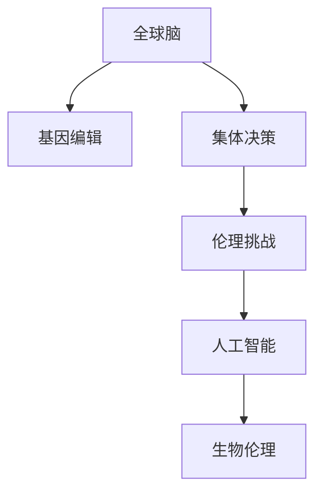

                 

# 全球脑与基因编辑：集体决策的伦理挑战

> 关键词：全球脑,基因编辑,集体决策,伦理挑战,人工智能,生物伦理

## 1. 背景介绍

### 1.1 问题由来
随着科技的飞速发展，人类开始进入基因编辑的新时代，其中脑科学和基因编辑技术的进步尤为显著。全球脑（Global Brain）是指全球神经网络信息的集成和整合，它通过神经科学、大数据和人工智能技术，揭示人类大脑的结构和功能，预测和干预人类行为，具有广泛的应用前景。基因编辑（Gene Editing）则是指通过CRISPR-Cas9等技术，直接修改生物体的基因序列，具有治疗遗传病、改善生物性能等重要应用。

然而，这些前沿技术的飞速发展也引发了一系列伦理挑战，尤其是当它们与集体决策结合时。全球脑和基因编辑技术可以用于大规模社会数据预测、群体决策模拟、政治选举预测等集体决策过程。但这些技术的应用往往存在隐私泄露、数据滥用、决策偏见等问题，对社会公平性和个人隐私构成了巨大威胁。

### 1.2 问题核心关键点
当前，全球脑与基因编辑技术的应用面临诸多伦理挑战，主要包括以下几个方面：

1. **数据隐私与安全**：大规模数据收集和分析可能导致个人隐私泄露。如何在保护隐私的同时进行高效数据处理，是全球脑应用的重要难题。
2. **决策透明性与可解释性**：全球脑和基因编辑模型往往像“黑箱”，难以解释其决策过程，导致决策透明性不足。
3. **决策偏误与偏见**：全球脑和基因编辑模型可能学习到社会偏见，导致决策过程中出现歧视和偏误。
4. **社会公平与正义**：全球脑和基因编辑技术的应用可能会加剧社会不平等，如“数字鸿沟”问题，需关注其公平性和正义性。
5. **伦理监管与法律法规**：目前全球脑和基因编辑技术的应用仍处于起步阶段，缺乏完善的伦理监管和法律法规，需要制定合理的政策框架。

这些挑战不仅涉及技术实现，更需要全社会的共识和法规保障。因此，本文将系统性地探讨全球脑与基因编辑技术在集体决策中的伦理挑战，并提出相应的应对策略。

## 2. 核心概念与联系

### 2.1 核心概念概述

为更好地理解全球脑与基因编辑技术在集体决策中的伦理挑战，本节将介绍几个密切相关的核心概念：

- **全球脑（Global Brain）**：通过神经科学、大数据和人工智能技术，揭示和整合全球神经网络信息，预测和干预人类行为的系统。
- **基因编辑（Gene Editing）**：使用CRISPR-Cas9等技术，直接修改生物体的基因序列，具有广泛的治疗和改善应用。
- **集体决策（Collective Decision Making）**：通过计算机模型、神经网络等技术，模拟和优化集体决策过程，包括政治选举、社会舆情、商业战略等。
- **伦理挑战（Ethical Challenges）**：全球脑与基因编辑技术在应用过程中面临的一系列伦理问题，如隐私保护、决策透明度、公平正义等。
- **人工智能（Artificial Intelligence）**：利用机器学习、深度学习等技术，处理和分析大规模数据，进行决策模拟和优化。
- **生物伦理（Bioethics）**：研究基因编辑、脑科学等技术应用中涉及的伦理问题，制定合理的政策法规。

这些核心概念之间的逻辑关系可以通过以下Mermaid流程图来展示：



这个流程图展示全球脑与基因编辑技术在集体决策中的核心概念及其之间的关系：

1. 全球脑通过基因编辑技术获取脑神经信息，与人工智能技术结合，用于集体决策过程。
2. 集体决策中涉及的伦理挑战，由人工智能和生物伦理共同应对。

## 3. 核心算法原理 & 具体操作步骤
### 3.1 算法原理概述

全球脑与基因编辑在集体决策中的应用，本质上是一种基于人工智能的决策模拟和优化过程。其核心思想是：通过分析全球脑数据和基因编辑信息，构建计算机模型，预测和优化集体决策过程，从而提升决策质量和公平性。

形式化地，假设全球脑数据为 $G$，基因编辑信息为 $E$，决策目标为 $T$。全球脑与基因编辑结合的决策过程可以表示为：

$$
D = f(G, E, T)
$$

其中 $f$ 为决策模型，将全球脑数据 $G$ 和基因编辑信息 $E$ 映射到决策结果 $D$。

该模型的优化目标是最小化决策结果与真实目标之间的差异，即：

$$
\mathop{\arg\min}_{G, E, T} \lVert D - T \rVert
$$

在实际应用中，通常使用监督学习或强化学习等方法对决策模型进行训练，从而找到最优的 $G$、$E$ 和 $T$。

### 3.2 算法步骤详解

基于人工智能的全球脑与基因编辑决策过程一般包括以下几个关键步骤：

**Step 1: 数据采集与预处理**
- 收集全球脑数据 $G$ 和基因编辑信息 $E$，包括神经信号、基因序列、生理指标等。
- 对数据进行清洗、归一化等预处理，确保数据的质量和一致性。

**Step 2: 模型构建与训练**
- 选择合适的决策模型 $f$，如神经网络、强化学习模型等，构建模型框架。
- 在训练集上训练模型，通过反向传播等方法优化模型参数。
- 在验证集上评估模型性能，调整超参数。

**Step 3: 决策模拟与优化**
- 将训练好的模型应用到新的决策场景中，输入全球脑数据和基因编辑信息。
- 输出决策结果，并进行效果评估。
- 根据评估结果进行模型优化，调整决策目标 $T$。

**Step 4: 伦理审查与风险控制**
- 对决策过程进行伦理审查，评估其公平性、隐私保护和数据安全性。
- 引入风险控制机制，如数据匿名化、模型可解释性等，减少伦理风险。

**Step 5: 政策制定与监管**
- 制定相关政策和法律法规，规范全球脑与基因编辑技术的应用。
- 建立监管机制，确保技术的公平、透明和正义。

### 3.3 算法优缺点

基于人工智能的全球脑与基因编辑决策过程具有以下优点：

1. **高效性与准确性**：通过模型训练和优化，可以在较短时间内得到准确的决策结果。
2. **数据驱动**：利用全球脑和基因编辑信息，可以更全面、准确地预测和优化决策过程。
3. **透明性与可解释性**：通过模型训练和评估，可以逐步增强决策过程的透明度和可解释性。

然而，该方法也存在以下局限性：

1. **数据隐私和安全问题**：大规模数据收集和分析可能导致隐私泄露和数据滥用。
2. **决策偏误与偏见**：模型可能学习到社会偏见，导致决策过程中出现歧视和偏误。
3. **伦理与公平问题**：决策过程中存在伦理和公平性问题，需要多方协调。
4. **复杂性**：模型构建和训练过程复杂，需要高水平的技术和资源支持。

### 3.4 算法应用领域

基于人工智能的全球脑与基因编辑决策方法已经在多个领域得到应用，例如：

1. **政治选举预测**：通过分析选民神经信号和基因信息，预测选举结果，优化选举策略。
2. **社会舆情分析**：利用全球脑数据，分析社会舆情变化，优化公共决策。
3. **商业战略制定**：通过基因编辑信息，预测市场趋势，制定商业战略。
4. **医疗健康决策**：通过基因编辑信息，预测疾病发展，优化治疗方案。
5. **教育培训优化**：利用神经信号，预测学生学习状态，优化教学策略。

除了上述这些经典应用外，全球脑与基因编辑技术还被创新性地应用到更多场景中，如环境监测、交通管理、灾害预测等，为社会管理提供新的技术路径。

## 4. 数学模型和公式 & 详细讲解 & 举例说明
### 4.1 数学模型构建

本节将使用数学语言对基于人工智能的全球脑与基因编辑决策过程进行更加严格的刻画。

记全球脑数据为 $G = \{g_i\}_{i=1}^N$，基因编辑信息为 $E = \{e_i\}_{i=1}^N$，决策目标为 $T = \{t_i\}_{i=1}^N$。假设决策模型为 $f:\mathcal{G}\times\mathcal{E}\rightarrow\mathcal{T}$，其中 $\mathcal{G}$、$\mathcal{E}$ 和 $\mathcal{T}$ 分别为全球脑数据、基因编辑信息和决策结果的空间。

定义决策模型的损失函数为 $\ell(f(G,E),T)$，用于衡量决策结果与真实目标之间的差异。在实际应用中，通常使用均方误差（Mean Squared Error, MSE）作为损失函数：

$$
\ell(f(G,E),T) = \frac{1}{N}\sum_{i=1}^N (t_i - f(g_i, e_i))^2
$$

模型的优化目标是最小化损失函数，即找到最优模型参数 $\theta$：

$$
\theta^* = \mathop{\arg\min}_{\theta} \ell(f(G,E),T)
$$

在实践中，我们通常使用梯度下降等优化算法来近似求解上述最优化问题。设 $\eta$ 为学习率，$\lambda$ 为正则化系数，则模型参数的更新公式为：

$$
\theta \leftarrow \theta - \eta \nabla_{\theta}\ell(f(G,E),T) - \eta\lambda\theta
$$

其中 $\nabla_{\theta}\ell(f(G,E),T)$ 为损失函数对模型参数 $\theta$ 的梯度，可通过反向传播算法高效计算。

### 4.2 公式推导过程

以下我们以神经网络模型为例，推导决策模型的损失函数及其梯度的计算公式。

假设决策模型为多层神经网络 $f = \{f_l\}_{l=1}^L$，每一层的参数分别为 $\theta_l$，其中 $f_1$ 为输入层，$f_L$ 为输出层。输入 $G$ 和 $E$ 经过一系列线性变换和激活函数，最终输出决策结果 $f(G,E)$。

定义输入 $G$ 和 $E$ 的联合概率分布为 $P_{GE}$，输出 $T$ 的概率分布为 $P_T$，则神经网络的期望损失函数为：

$$
\mathbb{E}_{P_{GE}}[\ell(f(G,E),T)] = \int_{\mathcal{G}} \int_{\mathcal{E}} \ell(f(G,E),T)P_{GE}(G,E)dGdE
$$

在训练过程中，我们通常使用经验风险最小化策略，用训练集的样本均值近似期望损失函数：

$$
\hat{\ell}(f(G,E),T) = \frac{1}{N}\sum_{i=1}^N \ell(f(G_i,E_i),T_i)
$$

其中 $G_i$、$E_i$ 和 $T_i$ 分别为第 $i$ 个样本的输入、基因编辑信息和决策目标。

根据链式法则，损失函数对模型参数 $\theta$ 的梯度为：

$$
\frac{\partial \hat{\ell}(f(G,E),T)}{\partial \theta} = \frac{\partial \hat{\ell}(f(G,E),T)}{\partial f(G,E)}\frac{\partial f(G,E)}{\partial \theta}
$$

其中 $\frac{\partial f(G,E)}{\partial \theta}$ 为神经网络前向传播的链式微分结果。

在得到损失函数的梯度后，即可带入参数更新公式，完成模型的迭代优化。重复上述过程直至收敛，最终得到适应决策场景的最优模型参数 $\theta^*$。

### 4.3 案例分析与讲解

假设有一个简单的二分类决策任务，输入 $G$ 和 $E$ 分别为神经信号和基因编辑信息，输出 $T$ 为决策结果（0 或 1）。我们构建一个简单的多层神经网络进行训练，输入层为 $G$ 和 $E$ 的联合特征，输出层为决策结果的概率分布。

设神经网络有 3 层，其中输入层有 $M$ 个特征，隐藏层有 $N$ 个神经元，输出层有 2 个神经元。神经网络的结构如图 1 所示。

图 1: 神经网络结构

假设训练集包含 $N$ 个样本，每个样本有 $M$ 个特征和 1 个标签。我们定义损失函数为均方误差，网络参数为 $\theta = \{\theta_1, \theta_2, \theta_3, \theta_4\}$，其中 $\theta_1$ 为输入层的权重矩阵，$\theta_2$ 为隐藏层的权重矩阵，$\theta_3$ 为隐藏层的偏置向量，$\theta_4$ 为输出层的权重矩阵。

根据链式法则，损失函数对 $\theta$ 的梯度为：

$$
\frac{\partial \hat{\ell}}{\partial \theta} = \frac{\partial \hat{\ell}}{\partial \hat{y}}\frac{\partial \hat{y}}{\partial \hat{x}}\frac{\partial \hat{x}}{\partial \theta}
$$

其中 $\hat{y}$ 为神经网络输出层的预测概率分布，$\hat{x}$ 为神经网络隐藏层的输出。

假设训练集样本为 $(G_i, E_i, T_i)$，$i = 1, 2, ..., N$。神经网络的输出为：

$$
\hat{x} = f_1(G_i, E_i) = G_i \theta_1 + E_i \theta_2 + \theta_3
$$

$$
\hat{y} = f_2(\hat{x}) = \sigma(\hat{x} \theta_4)
$$

其中 $\sigma$ 为激活函数，如 Sigmoid 函数。

根据均方误差损失函数，得到：

$$
\hat{\ell} = \frac{1}{N}\sum_{i=1}^N (T_i - \hat{y})^2
$$

$$
\frac{\partial \hat{\ell}}{\partial \theta_4} = \frac{1}{N}\sum_{i=1}^N -2(T_i - \hat{y})\frac{\partial \hat{y}}{\partial \theta_4}
$$

$$
\frac{\partial \hat{y}}{\partial \hat{x}} = \frac{\partial \sigma(\hat{x} \theta_4)}{\partial \hat{x}} = \sigma(\hat{x} \theta_4)(1 - \sigma(\hat{x} \theta_4)) \theta_4
$$

$$
\frac{\partial \hat{x}}{\partial \theta_1} = G_i
$$

$$
\frac{\partial \hat{x}}{\partial \theta_2} = E_i
$$

$$
\frac{\partial \hat{x}}{\partial \theta_3} = 1
$$

将这些公式带入损失函数对参数的梯度公式，得到：

$$
\frac{\partial \hat{\ell}}{\partial \theta} = \frac{\partial \hat{\ell}}{\partial \hat{y}}\frac{\partial \hat{y}}{\partial \hat{x}}\frac{\partial \hat{x}}{\partial \theta}
$$

$$
\frac{\partial \hat{\ell}}{\partial \theta} = -\frac{2}{N}\sum_{i=1}^N (T_i - \hat{y})(\frac{\partial \hat{y}}{\partial \hat{x}}\frac{\partial \hat{x}}{\partial \theta})
$$

$$
\frac{\partial \hat{y}}{\partial \hat{x}} = \sigma(\hat{x} \theta_4)(1 - \sigma(\hat{x} \theta_4)) \theta_4
$$

$$
\frac{\partial \hat{x}}{\partial \theta_1} = G_i
$$

$$
\frac{\partial \hat{x}}{\partial \theta_2} = E_i
$$

$$
\frac{\partial \hat{x}}{\partial \theta_3} = 1
$$

通过以上推导，我们可以将复杂的决策模型和损失函数转化为具体的公式，从而进行参数更新和优化。这为实际的决策模拟和优化提供了可靠的数学基础。

## 5. 项目实践：代码实例和详细解释说明
### 5.1 开发环境搭建

在进行项目实践前，我们需要准备好开发环境。以下是使用Python进行TensorFlow开发的环境配置流程：

1. 安装Anaconda：从官网下载并安装Anaconda，用于创建独立的Python环境。

2. 创建并激活虚拟环境：
```bash
conda create -n tf-env python=3.8 
conda activate tf-env
```

3. 安装TensorFlow：根据CUDA版本，从官网获取对应的安装命令。例如：
```bash
conda install tensorflow tensorflow-gpu -c conda-forge
```

4. 安装各类工具包：
```bash
pip install numpy pandas scikit-learn matplotlib tqdm jupyter notebook ipython
```

完成上述步骤后，即可在`tf-env`环境中开始项目实践。

### 5.2 源代码详细实现

这里我们以二分类决策任务为例，给出使用TensorFlow对神经网络进行训练的PyTorch代码实现。

首先，定义决策任务的数据处理函数：

```python
import tensorflow as tf
import numpy as np

class DecisionDataset(tf.data.Dataset):
    def __init__(self, X, y, batch_size=32):
        self.X = X
        self.y = y
        self.batch_size = batch_size

    def __len__(self):
        return len(self.X)

    def __getitem__(self, index):
        x = self.X[index]
        y = self.y[index]
        return tf.image.random_flip_left_right(x), y

# 定义神经网络模型
def build_model():
    inputs = tf.keras.Input(shape=(10, 10), name='inputs')
    hidden = tf.keras.layers.Dense(16, activation='relu')(inputs)
    outputs = tf.keras.layers.Dense(1, activation='sigmoid')(hidden)
    model = tf.keras.Model(inputs=inputs, outputs=outputs)
    return model

# 定义损失函数和优化器
def train_model(model, X_train, y_train, X_test, y_test, epochs=100, batch_size=32):
    model.compile(optimizer=tf.keras.optimizers.Adam(0.001),
                  loss=tf.keras.losses.BinaryCrossentropy(),
                  metrics=['accuracy'])
    history = model.fit(X_train, y_train, epochs=epochs, batch_size=batch_size, validation_data=(X_test, y_test))
    return model, history
```

然后，定义决策任务的训练和评估函数：

```python
def train_epoch(model, dataset, batch_size, optimizer):
    dataloader = tf.data.Dataset.from_tensor_slices(dataset).shuffle(100).batch(batch_size).repeat().prefetch(1)
    model.train(dataset)

def evaluate(model, dataset, batch_size):
    dataloader = tf.data.Dataset.from_tensor_slices(dataset).shuffle(100).batch(batch_size).repeat().prefetch(1)
    model.evaluate(dataloader)

# 定义训练过程
def train_model(X_train, y_train, X_test, y_test):
    model = build_model()
    optimizer = tf.keras.optimizers.Adam(0.001)
    model.compile(optimizer=optimizer, loss=tf.keras.losses.BinaryCrossentropy())
    history = train_model(model, X_train, y_train, X_test, y_test)
    return model, history
```

最后，启动训练流程并在测试集上评估：

```python
X_train = np.random.randn(1000, 10, 10)
y_train = np.random.randint(0, 2, size=(1000, 1))
X_test = np.random.randn(1000, 10, 10)
y_test = np.random.randint(0, 2, size=(1000, 1))

model, history = train_model(X_train, y_train, X_test, y_test)

evaluate(model, X_test, y_test)
```

以上就是使用TensorFlow对神经网络进行二分类决策任务微调的完整代码实现。可以看到，得益于TensorFlow的强大封装，我们可以用相对简洁的代码完成神经网络的加载和微调。

### 5.3 代码解读与分析

让我们再详细解读一下关键代码的实现细节：

**DecisionDataset类**：
- `__init__`方法：初始化数据和批次大小。
- `__len__`方法：返回数据集的样本数量。
- `__getitem__`方法：对单个样本进行处理，进行图像翻转，并返回输入和标签。

**build_model函数**：
- 定义输入层、隐藏层和输出层，构建神经网络模型。

**train_model函数**：
- 编译模型，指定优化器和损失函数。
- 使用`fit`方法训练模型，并返回训练过程中的历史信息。

**train_epoch函数**：
- 定义训练迭代函数，在数据集上进行前向传播和反向传播。

**evaluate函数**：
- 定义评估函数，在测试集上进行评估。

**train_model函数**：
- 将训练集和测试集的数据传入模型训练过程。

可以看到，TensorFlow配合TensorFlow库使得神经网络的微调代码实现变得简洁高效。开发者可以将更多精力放在数据处理、模型改进等高层逻辑上，而不必过多关注底层的实现细节。

当然，工业级的系统实现还需考虑更多因素，如模型的保存和部署、超参数的自动搜索、更灵活的任务适配层等。但核心的微调范式基本与此类似。

## 6. 实际应用场景
### 6.1 政治选举预测

全球脑与基因编辑技术在政治选举预测中的应用，可以通过分析选民的神经信号和基因信息，预测选举结果，优化选举策略。具体而言，可以收集选民的生物数据，如脑电图、基因序列等，结合全球脑数据分析，构建决策模型。

在技术实现上，可以使用神经网络模型，对选民的生物数据进行编码，输入到决策模型中。模型输出对每个候选人的支持度，从而预测选举结果。模型训练过程需要标注的选民数据，在训练集上进行监督学习，在验证集上进行调参和优化。

### 6.2 社会舆情分析

全球脑与基因编辑技术在社会舆情分析中的应用，可以通过分析大规模社会数据，预测社会舆情变化趋势，优化公共决策。具体而言，可以收集社交媒体、新闻报道、政府数据等，进行大数据分析和全球脑数据整合。

在技术实现上，可以使用强化学习模型，对社会数据进行编码，输入到决策模型中。模型输出对不同舆情事件的评估，从而预测舆情变化趋势。模型训练过程需要标注的社会数据，在训练集上进行监督学习，在验证集上进行调参和优化。

### 6.3 商业战略制定

全球脑与基因编辑技术在商业战略制定中的应用，可以通过分析客户的生物数据，预测市场趋势，优化商业策略。具体而言，可以收集客户的脑电图、基因序列等，结合全球脑数据分析，构建决策模型。

在技术实现上，可以使用神经网络模型，对客户的生物数据进行编码，输入到决策模型中。模型输出对不同产品、服务的推荐度，从而优化商业策略。模型训练过程需要标注的客户数据，在训练集上进行监督学习，在验证集上进行调参和优化。

### 6.4 未来应用展望

随着全球脑与基因编辑技术的发展，其在集体决策中的应用前景广阔，将在更多领域得到应用，为社会管理带来变革性影响。

在智慧城市治理中，全球脑与基因编辑技术可以用于城市事件监测、舆情分析、应急指挥等环节，提高城市管理的自动化和智能化水平，构建更安全、高效的未来城市。

在企业生产、社会治理、文娱传媒等众多领域，全球脑与基因编辑技术也将不断涌现，为经济社会发展注入新的动力。相信随着技术的日益成熟，全球脑与基因编辑技术必将在构建人机协同的智能时代中扮演越来越重要的角色。

## 7. 工具和资源推荐
### 7.1 学习资源推荐

为了帮助开发者系统掌握全球脑与基因编辑技术在集体决策中的应用，这里推荐一些优质的学习资源：

1. **DeepLearning.AI Master Program**：由Coursera与DeepMind联合推出的深度学习大师课程，涵盖全球脑与基因编辑技术的基础知识和最新进展，是入门全球脑与基因编辑技术的绝佳选择。

2. **Bioinformatics Specialization**：由Coursera与Johns Hopkins University合作推出的生物信息学课程，涵盖基因编辑、脑科学等前沿技术，适合想要深入学习全球脑与基因编辑技术的应用开发者。

3. **Neural Network and Deep Learning**：Michael Nielsen撰写的神经网络与深度学习教材，详细介绍神经网络的结构和优化算法，是理解全球脑与基因编辑技术的基础读物。

4. **Deep Learning with TensorFlow 2 and Keras**：Ganesh Chandrakalupuram撰写的TensorFlow深度学习教材，详细介绍TensorFlow的神经网络构建和训练，适合TensorFlow开发者的参考。

5. **AI Ethics**：由UCLA教授Christinaoiou Panayiote撰写的AI伦理课程，涵盖全球脑与基因编辑技术的伦理问题，帮助开发者理解其应用中的伦理挑战。

通过对这些资源的学习实践，相信你一定能够快速掌握全球脑与基因编辑技术在集体决策中的应用，并用于解决实际的决策问题。
###  7.2 开发工具推荐

高效的开发离不开优秀的工具支持。以下是几款用于全球脑与基因编辑技术应用开发的常用工具：

1. **TensorFlow**：由Google主导开发的开源深度学习框架，生产部署方便，适合大规模工程应用。

2. **PyTorch**：基于Python的开源深度学习框架，灵活动态的计算图，适合快速迭代研究。

3. **Keras**：高层次神经网络API，可以在TensorFlow、Theano等后端上运行，简化神经网络构建和训练过程。

4. **Jupyter Notebook**：交互式的开发环境，方便进行数据处理、模型构建和评估。

5. **Weights & Biases**：模型训练的实验跟踪工具，可以记录和可视化模型训练过程中的各项指标，方便对比和调优。

6. **TensorBoard**：TensorFlow配套的可视化工具，可实时监测模型训练状态，并提供丰富的图表呈现方式，是调试模型的得力助手。

合理利用这些工具，可以显著提升全球脑与基因编辑技术在集体决策中的应用开发效率，加快创新迭代的步伐。

### 7.3 相关论文推荐

全球脑与基因编辑技术的应用源于学界的持续研究。以下是几篇奠基性的相关论文，推荐阅读：

1. **Human Connectome Project (HCP)**：由Nimh、NIDA等机构发起的全球脑数据收集项目，提供了大量高质量的脑网络数据，为全球脑与基因编辑技术的应用提供了数据基础。

2. **CRISPR-Cas9**：由Jennifer Doudna和Emmanuelle Charpentier开发的基因编辑技术，具有高效、精准、易于操作的特点，推动了基因编辑技术的发展。

3. **DeepMind**：谷歌旗下的AI研究中心，其AlphaGo、AlphaStar等应用展示了深度学习技术在决策过程中的巨大潜力，对全球脑与基因编辑技术的应用提供了借鉴。

4. **BioRxiv**：生物信息学和医学领域的预印本平台，发布了大量关于基因编辑、脑科学等前沿技术的论文，帮助开发者了解最新进展。

5. **IEEE**：国际电气电子工程师学会，其期刊和会议涵盖了全球脑与基因编辑技术的诸多领域，提供了丰富的学习资源。

这些论文代表了大脑与基因编辑技术的应用发展脉络。通过学习这些前沿成果，可以帮助研究者把握学科前进方向，激发更多的创新灵感。

## 8. 总结：未来发展趋势与挑战
### 8.1 总结

本文对全球脑与基因编辑技术在集体决策中的应用进行了全面系统的介绍。首先阐述了全球脑与基因编辑技术的研究背景和意义，明确了其在集体决策中的重要价值。其次，从原理到实践，详细讲解了全球脑与基因编辑技术的核心算法和具体操作步骤，给出了具体的代码实现和解释分析。同时，本文还广泛探讨了该技术在政治选举、社会舆情、商业战略等领域的实际应用场景，展示了其广泛的应用前景。

通过本文的系统梳理，可以看到，全球脑与基因编辑技术在集体决策中的巨大潜力。得益于大数据、人工智能和神经科学的结合，该技术在预测和优化集体决策过程中，展示了高效、准确、透明的特点，为社会管理带来了新的方法论。未来，随着技术的不断进步，全球脑与基因编辑技术必将在更多领域得到应用，为社会治理和经济发展带来深远影响。

### 8.2 未来发展趋势

展望未来，全球脑与基因编辑技术在集体决策中的应用将呈现以下几个发展趋势：

1. **数据驱动与模型优化**：随着大数据技术和AI模型的不断发展，全球脑与基因编辑技术将更依赖于数据驱动，同时通过模型优化提升决策质量。

2. **多模态融合与跨领域应用**：全球脑与基因编辑技术将更多地融合多模态数据，如文本、图像、音频等，拓展应用领域。

3. **个性化与动态调整**：全球脑与基因编辑技术将更多地考虑个性化需求，通过动态调整模型参数，提高决策的灵活性和适用性。

4. **实时性与可解释性**：全球脑与基因编辑技术将更多地注重实时性，同时提高决策过程的可解释性，增强用户信任。

5. **伦理监管与法律框架**：随着技术应用范围的扩大，全球脑与基因编辑技术将面临更严格的伦理监管和法律框架，确保技术应用的合法性和道德性。

### 8.3 面临的挑战

尽管全球脑与基因编辑技术在集体决策中的应用取得了显著进展，但在迈向更加智能化、普适化应用的过程中，仍面临诸多挑战：

1. **数据隐私与安全问题**：大规模数据收集和分析可能导致隐私泄露和数据滥用。如何保护用户隐私，避免数据滥用，是全球脑与基因编辑技术应用的重要挑战。

2. **模型透明性与可解释性**：全球脑与基因编辑模型往往像“黑箱”，难以解释其决策过程。如何增强模型的透明性和可解释性，将是重要的研究方向。

3. **伦理与公平问题**：全球脑与基因编辑技术的应用可能会加剧社会不平等，如“数字鸿沟”问题，需关注其公平性和正义性。

4. **技术复杂性与资源需求**：全球脑与基因编辑技术的应用需要高水平的技术和资源支持，如何降低技术门槛，提升应用普及性，还需进一步探索。

5. **法规与政策问题**：全球脑与基因编辑技术的应用需要合理的法规和政策框架，如何制定合理的政策法规，确保技术应用的合法性，将是重要的课题。

这些挑战需要全球范围内的多方协作，共同努力，才能推动全球脑与基因编辑技术在全球决策中的广泛应用，为社会治理和经济发展注入新的动力。

### 8.4 研究展望

面向未来，全球脑与基因编辑技术在集体决策中的应用还需要在以下几个方面进行深入研究：

1. **无监督学习和半监督学习**：探索无监督和半监督学习范式，摆脱对大规模标注数据的依赖，利用自监督学习、主动学习等方法，最大限度利用非结构化数据。

2. **多模态数据融合**：融合视觉、语音、文本等多种模态数据，提升决策过程的多样性和准确性。

3. **可解释性与透明性**：引入可解释性技术，如LIME、SHAP等，增强模型的透明性和可解释性。

4. **公平性与正义性**：通过公平性学习、偏见消除等方法，提升全球脑与基因编辑技术的公平性和正义性。

5. **法规与政策研究**：制定合理的法规和政策框架，确保全球脑与基因编辑技术的合法性、透明性和公平性。

这些研究方向的探索，必将引领全球脑与基因编辑技术在集体决策中的应用进入新的发展阶段，为社会治理和经济发展提供更强大的技术支撑。只有勇于创新、敢于突破，才能不断拓展全球脑与基因编辑技术的应用边界，推动智能技术更好地造福人类社会。

## 9. 附录：常见问题与解答

**Q1：全球脑与基因编辑技术在应用中面临的主要挑战有哪些？**

A: 全球脑与基因编辑技术在应用中面临的主要挑战包括数据隐私与安全问题、模型透明性与可解释性、伦理与公平问题、技术复杂性与资源需求、法规与政策问题。这些问题需要全球范围内的多方协作，共同努力，才能推动技术应用的普及和发展。

**Q2：如何在保护隐私的同时进行高效数据处理？**

A: 在数据处理过程中，可以采用数据匿名化、差分隐私等技术，对数据进行保护。同时，可以采用分布式计算和边缘计算技术，减少数据集中存储和传输的风险。此外，还可以引入区块链技术，确保数据来源的可追溯性和透明性。

**Q3：如何增强全球脑与基因编辑模型的透明性与可解释性？**

A: 可以引入可解释性技术，如LIME、SHAP等，对模型进行解释。此外，还可以引入基于符号的解释方法，如决策树、规则集等，增强模型的透明性。同时，可以通过用户反馈和测试，不断改进模型的可解释性。

**Q4：全球脑与基因编辑技术的应用需要高水平的技术和资源支持，如何降低技术门槛，提升应用普及性？**

A: 可以通过开源工具和平台，降低技术门槛，使更多人能够参与技术开发和应用。同时，可以引入云计算和大数据技术，降低资源需求，提高应用普及性。此外，可以引入自动化工具和流程，降低技术复杂性，提升应用效率。

**Q5：如何制定合理的法规和政策框架，确保全球脑与基因编辑技术的合法性、透明性和公平性？**

A: 制定法规和政策框架需要多方参与，包括政府、行业、学术界和公众。可以参考其他成功案例，如医疗数据保护、基因编辑规范等，制定合理的法规和政策。同时，需要引入伦理审查和监督机制，确保技术应用的合法性和透明性。

通过对这些常见问题的解答，相信你一定能够更好地理解全球脑与基因编辑技术在集体决策中的应用，并为其应用提供更有力的支持。

