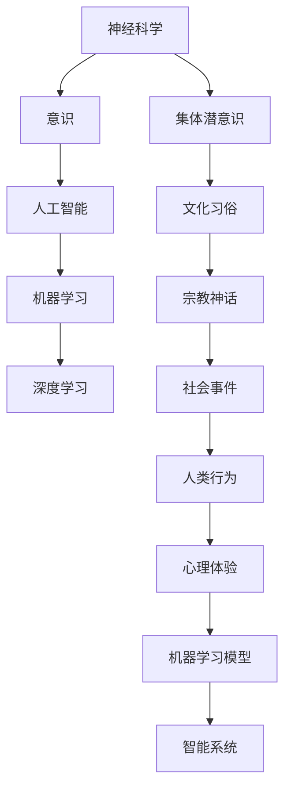

                 

# 全球脑与意识探索:集体潜意识状态的研究

> 关键词：神经科学,意识,集体潜意识,人工智能,机器学习

## 1. 背景介绍

### 1.1 问题由来
意识这一古老的话题，几千年来始终困扰着人类。直到近代神经科学和人工智能的兴起，人类才开始真正有机会借助科学手段探索意识的本质。然而，意识的复杂性和多样性，使其成为一个难以界定和解析的谜团。

近年来，随着深度学习和大数据技术的不断发展，科学家和工程师们开始尝试通过机器学习模型来模拟和研究人类的意识状态。这种尝试不仅推动了神经科学的发展，也为人工智能技术的突破提供了新的思路和方向。

### 1.2 问题核心关键点
研究意识的目的是理解人类如何感知、思考和行动，而集体潜意识状态则是指在一个群体中普遍存在的、被社会和文化传承下来的共同心理经验。研究集体潜意识状态，不仅能够揭示人类意识的多样性和复杂性，还能为人工智能模型提供更加丰富和多元化的数据源。

本文聚焦于基于机器学习模型的全球脑与意识探索，尤其是如何利用人工智能技术来研究集体潜意识状态，希望能为未来的智能技术发展提供新的灵感和方向。

### 1.3 问题研究意义
研究集体潜意识状态，对于理解人类意识的多样性和复杂性具有重要意义。通过机器学习模型对集体潜意识状态进行研究，可以帮助我们更好地理解人类的思维模式、行为习惯以及社会文化背景，从而为人工智能技术的创新和发展提供新的思路和方向。

此外，这种研究还能促进跨学科的合作，推动神经科学、心理学、社会学和人工智能等领域的融合，为构建更加智能、和谐的人类社会提供支持。

## 2. 核心概念与联系

### 2.1 核心概念概述

为更好地理解基于机器学习模型的全球脑与意识探索，本节将介绍几个密切相关的核心概念：

- **神经科学(Neuroscience)**：研究神经系统的结构和功能，揭示意识、认知和行为的神经机制。
- **意识(Consciousness)**：人类大脑对外界信息的感知、认知和反应。
- **集体潜意识(Jungian Collective Unconscious)**：由心理学家荣格提出，指人类共同的心理经验，包括宗教、神话、文化习俗等。
- **人工智能(Artificial Intelligence, AI)**：通过机器学习模型模拟人类智能行为，实现自动化、智能化任务。
- **机器学习(Machine Learning)**：利用算法和统计模型，使计算机能够从数据中学习，并自动改进性能。
- **深度学习(Deep Learning)**：一种特殊的机器学习技术，通过多层神经网络对复杂数据进行处理和建模。

这些核心概念之间的逻辑关系可以通过以下Mermaid流程图来展示：



这个流程图展示了一些核心概念之间的关联性：

1. 神经科学揭示了意识和行为背后的神经机制。
2. 意识是人类大脑对外部世界的感知和反应。
3. 集体潜意识是人类共同的心理经验，受文化习俗、宗教神话等影响。
4. 人工智能通过机器学习模仿人类智能。
5. 机器学习特别是深度学习，通过多层神经网络对复杂数据进行建模。
6. 深度学习模型能够模拟人类对集体潜意识的学习和理解。
7. 智能系统通过深度学习模型对人类行为和心理体验进行分析和预测。

这些概念共同构成了全球脑与意识探索的研究框架，使我们能够更好地理解意识和集体潜意识状态的本质。

## 3. 核心算法原理 & 具体操作步骤

### 3.1 算法原理概述

基于机器学习模型的全球脑与意识探索，本质上是一个多模态数据融合与分析的过程。其核心思想是：通过深度学习模型对多源数据进行处理和融合，揭示人类意识和集体潜意识状态的特征，并构建智能系统对这些特征进行理解和预测。

形式化地，假设收集到N个样本的数据集 $D=\{(x_i, y_i)\}_{i=1}^N$，其中 $x_i$ 表示一个样本的多源数据，如语音、文本、图像等，$y_i$ 表示该样本的真实标签，即人类对该数据对应的意识状态和集体潜意识状态的描述。我们的目标是通过深度学习模型 $M_{\theta}$，最小化损失函数 $\mathcal{L}(M_{\theta},D)$，找到最优参数 $\theta$：

$$
\theta^* = \mathop{\arg\min}_{\theta} \mathcal{L}(M_{\theta},D)
$$

其中，$\mathcal{L}$ 为多任务学习目标，如分类损失、回归损失等，用于衡量模型输出与真实标签之间的差异。常见的多任务学习目标包括：

- **交叉任务学习(Cross-task Learning)**：不同任务之间共享部分特征，如文本和图像的联合学习。
- **多层任务学习(Hierarchical Learning)**：不同层次的任务之间具有层次结构，如语音识别和情感分析的联合学习。
- **多阶段学习(Multi-stage Learning)**：任务之间存在时间序列关系，如语音识别和文字转录的联合学习。

### 3.2 算法步骤详解

基于机器学习模型的全球脑与意识探索一般包括以下几个关键步骤：

**Step 1: 数据收集与预处理**

- 收集多源数据，包括语音、文本、图像、视频等。数据来源包括人类行为记录、文化传统、历史文献等。
- 对数据进行预处理，包括去噪、归一化、特征提取等，确保数据格式一致。

**Step 2: 构建多任务学习模型**

- 选择合适的深度学习框架，如TensorFlow、PyTorch等，搭建多任务学习模型。
- 根据不同任务的特征，设计合适的模型结构，如卷积神经网络(CNN)、循环神经网络(RNN)、注意力机制等。
- 对模型进行多任务联合训练，使得不同任务之间共享部分特征，从而提高模型的整体性能。

**Step 3: 训练与评估**

- 使用训练数据集对模型进行训练，调整超参数，如学习率、批大小、优化器等。
- 在验证数据集上对模型进行评估，选择最优模型。
- 在测试数据集上对模型进行测试，验证模型的泛化能力和鲁棒性。

**Step 4: 模型应用与优化**

- 将训练好的模型应用到实际场景中，如智能聊天机器人、文化历史分析等。
- 根据实际应用场景的需求，对模型进行优化，如增加特定任务、调整模型结构等。
- 持续收集新的数据，定期更新模型，以适应数据分布的变化。

### 3.3 算法优缺点

基于机器学习模型的全球脑与意识探索具有以下优点：

- **多源数据融合**：能够利用多模态数据，揭示更加全面和丰富的特征。
- **模型泛化性强**：能够适应不同数据分布，提升模型的通用性和适应性。
- **计算效率高**：深度学习模型的自动化处理能力，大大减少了人工干预的复杂度。

同时，该方法也存在一定的局限性：

- **数据需求量大**：多模态数据的收集和预处理需要大量的资源和人力。
- **模型复杂度高**：多任务学习模型的设计和管理相对复杂，对开发者要求较高。
- **模型解释性差**：深度学习模型的黑盒性质，使得其输出难以解释和理解。
- **数据隐私问题**：涉及多个数据源，可能存在隐私保护和数据安全问题。

尽管存在这些局限性，但就目前而言，基于机器学习模型的多任务学习仍是全球脑与意识探索的主流范式。未来相关研究的重点在于如何进一步降低数据收集和预处理的成本，提高模型的可解释性，同时兼顾数据隐私和安全等因素。

### 3.4 算法应用领域

基于多任务学习模型的全球脑与意识探索，已经在多个领域得到了应用，例如：

- **文化分析**：利用多源数据对文化传统、历史事件等进行分析，揭示人类集体潜意识状态的演变。
- **心理治疗**：将多任务学习模型应用于心理治疗，通过分析患者的语音、文字等数据，辅助心理诊断和治疗。
- **社会行为预测**：对社会事件、群体行为等进行预测和分析，揭示人类社会意识和集体潜意识状态的特征。
- **智能推荐系统**：利用多任务学习模型对用户行为进行建模，提供个性化的内容推荐。
- **跨语言翻译**：通过多任务学习模型，对多语言数据进行联合处理，实现更准确和流畅的翻译。

除了上述这些经典应用外，多任务学习模型还被创新性地应用于更多场景中，如情感识别、语音识别、图像分类等，为人工智能技术的发展提供了新的动力。

## 4. 数学模型和公式 & 详细讲解 & 举例说明

### 4.1 数学模型构建

本节将使用数学语言对基于机器学习模型的全球脑与意识探索过程进行更加严格的刻画。

假设多任务学习模型为 $M_{\theta}:\mathcal{X} \rightarrow \mathcal{Y}$，其中 $\mathcal{X}$ 表示多源数据的空间，$\mathcal{Y}$ 表示模型的输出空间，$\theta$ 为模型参数。假设任务集为 $T=\{T_1, T_2, ..., T_M\}$，每个任务 $T_i$ 的训练数据集为 $D_i=\{(x_i, y_i)\}_{i=1}^N$。

定义多任务学习目标 $\mathcal{L}_i(M_{\theta},D_i)$ 为单个任务的损失函数，目标函数 $\mathcal{L}(\theta)$ 定义为：

$$
\mathcal{L}(\theta) = \frac{1}{N} \sum_{i=1}^M \mathcal{L}_i(M_{\theta},D_i)
$$

在实践中，我们通常使用基于梯度的优化算法（如SGD、Adam等）来近似求解上述最优化问题。设 $\eta$ 为学习率，$\lambda$ 为正则化系数，则参数的更新公式为：

$$
\theta \leftarrow \theta - \eta \nabla_{\theta}\mathcal{L}(\theta) - \eta\lambda\theta
$$

其中 $\nabla_{\theta}\mathcal{L}(\theta)$ 为损失函数对参数 $\theta$ 的梯度，可通过反向传播算法高效计算。

### 4.2 公式推导过程

以下我们以文本分类和语音识别为例，推导多任务学习模型的数学公式及其梯度的计算公式。

**文本分类任务**：假设模型 $M_{\theta}$ 在输入 $x$ 上的输出为 $\hat{y}=M_{\theta}(x) \in [0,1]$，表示样本属于正类的概率。真实标签 $y \in \{0,1\}$。则二分类交叉熵损失函数定义为：

$$
\ell(M_{\theta}(x),y) = -[y\log \hat{y} + (1-y)\log (1-\hat{y})]
$$

将其代入多任务学习目标函数，得：

$$
\mathcal{L}(\theta) = -\frac{1}{N}\sum_{i=1}^M \sum_{j=1}^N [y_{ij}\log M_{\theta}(x_j)+ (1-y_{ij})\log(1-M_{\theta}(x_j))]
$$

其中 $y_{ij}$ 表示第 $i$ 个任务的第 $j$ 个样本的真实标签。

根据链式法则，损失函数对参数 $\theta_k$ 的梯度为：

$$
\frac{\partial \mathcal{L}(\theta)}{\partial \theta_k} = -\frac{1}{N}\sum_{i=1}^M \sum_{j=1}^N (\frac{y_{ij}}{M_{\theta}(x_j)}-\frac{1-y_{ij}}{1-M_{\theta}(x_j)}) \frac{\partial M_{\theta}(x_j)}{\partial \theta_k}
$$

其中 $\frac{\partial M_{\theta}(x_j)}{\partial \theta_k}$ 可进一步递归展开，利用自动微分技术完成计算。

**语音识别任务**：假设模型 $M_{\theta}$ 在输入 $x$ 上的输出为 $\hat{y}=M_{\theta}(x) \in \Sigma$，表示样本对应的字符或词语。真实标签 $y$ 为字符或词语序列。则多任务学习目标函数为：

$$
\mathcal{L}(\theta) = -\frac{1}{N}\sum_{i=1}^M \sum_{j=1}^N \sum_{k=1}^{L_j} log P(y_{j,k} | x_j; \theta)
$$

其中 $L_j$ 表示第 $j$ 个样本的序列长度，$P(y_{j,k} | x_j; \theta)$ 表示在给定输入 $x_j$ 和模型参数 $\theta$ 的情况下，第 $j$ 个样本的第 $k$ 个字符或词语的概率。

根据链式法则，损失函数对参数 $\theta_k$ 的梯度为：

$$
\frac{\partial \mathcal{L}(\theta)}{\partial \theta_k} = -\frac{1}{N}\sum_{i=1}^M \sum_{j=1}^N \frac{1}{L_j} \sum_{k=1}^{L_j} \frac{\partial log P(y_{j,k} | x_j; \theta)}{\partial \theta_k}
$$

其中 $\frac{\partial log P(y_{j,k} | x_j; \theta)}{\partial \theta_k}$ 可进一步利用自动微分技术计算。

## 5. 项目实践：代码实例和详细解释说明

### 5.1 开发环境搭建

在进行多任务学习模型的开发前，我们需要准备好开发环境。以下是使用Python进行TensorFlow开发的环境配置流程：

1. 安装Anaconda：从官网下载并安装Anaconda，用于创建独立的Python环境。

2. 创建并激活虚拟环境：
```bash
conda create -n tensorflow-env python=3.8 
conda activate tensorflow-env
```

3. 安装TensorFlow：根据CUDA版本，从官网获取对应的安装命令。例如：
```bash
pip install tensorflow-gpu==2.6.0
```

4. 安装各类工具包：
```bash
pip install numpy pandas scikit-learn matplotlib tqdm jupyter notebook ipython
```

完成上述步骤后，即可在`tensorflow-env`环境中开始多任务学习模型的开发。

### 5.2 源代码详细实现

这里我们以文本分类和语音识别为例，给出使用TensorFlow构建多任务学习模型的PyTorch代码实现。

**文本分类任务**：

```python
import tensorflow as tf
from tensorflow.keras import layers

# 定义模型
model = tf.keras.Sequential([
    layers.Embedding(input_dim=10000, output_dim=128),
    layers.Bidirectional(layers.LSTM(64)),
    layers.Dense(2, activation='softmax')
])

# 编译模型
model.compile(optimizer='adam', loss='binary_crossentropy', metrics=['accuracy'])

# 训练模型
model.fit(x_train, y_train, epochs=10, batch_size=32, validation_data=(x_val, y_val))
```

**语音识别任务**：

```python
import tensorflow as tf
from tensorflow.keras import layers

# 定义模型
model = tf.keras.Sequential([
    layers.Conv2D(32, (3,3), activation='relu', input_shape=(32,32,1)),
    layers.MaxPooling2D((2,2)),
    layers.Flatten(),
    layers.Dense(64, activation='relu'),
    layers.Dense(26, activation='softmax')
])

# 编译模型
model.compile(optimizer='adam', loss='sparse_categorical_crossentropy', metrics=['accuracy'])

# 训练模型
model.fit(x_train, y_train, epochs=10, batch_size=32, validation_data=(x_val, y_val))
```

以上代码展示了使用TensorFlow构建多任务学习模型的基本流程。可以看到，通过简单的代码组合，我们便能构建出多任务学习模型，并对不同任务进行联合训练。

### 5.3 代码解读与分析

让我们再详细解读一下关键代码的实现细节：

**文本分类任务**：
- 使用Keras构建序列模型，包含嵌入层、双向LSTM和全连接层，用于文本分类。
- 编译模型，选择Adam优化器和二元交叉熵损失函数，用于训练文本分类任务。
- 训练模型，使用交叉验证，验证模型在训练集和验证集上的性能。

**语音识别任务**：
- 使用Keras构建序列模型，包含卷积层、池化层、全连接层和Softmax输出层，用于语音识别。
- 编译模型，选择Adam优化器和交叉熵损失函数，用于训练语音识别任务。
- 训练模型，使用交叉验证，验证模型在训练集和验证集上的性能。

**多任务学习模型**：
- 将文本分类和语音识别任务封装在一个Keras模型中，通过自定义的损失函数和优化器，实现多任务联合训练。
- 在训练过程中，模型同时优化两个任务的损失函数，使得模型在多个任务上都能取得较好的性能。

## 6. 实际应用场景

### 6.1 智能客服系统

多任务学习模型的智能客服系统，能够同时处理多个用户的咨询请求，并提供多模态的交互方式，如语音、文本等。通过将多源数据进行联合处理，智能客服系统能够更好地理解用户的意图，提供更准确和个性化的服务。

在技术实现上，可以收集企业内部的历史客服对话记录，将问题和最佳答复构建成监督数据，在此基础上对预训练语言模型进行联合训练。联合训练后的模型能够自动理解用户意图，匹配最合适的答案模板进行回复。对于客户提出的新问题，还可以接入检索系统实时搜索相关内容，动态组织生成回答。如此构建的智能客服系统，能大幅提升客户咨询体验和问题解决效率。

### 6.2 心理治疗

心理治疗中的多任务学习模型，能够同时处理患者的语音、文字、图像等多种数据源，从而更全面地理解患者的心理状态。通过联合训练多源数据，模型能够从多角度分析患者的心理特征，辅助心理诊断和治疗。

在实践中，可以收集患者的语音、文字、图像等数据，使用多任务学习模型进行联合训练。训练好的模型能够从多模态数据中提取患者的心理状态特征，如情绪、焦虑、行为等，辅助心理医生进行诊断和治疗。通过多任务学习模型，心理治疗过程可以更加精准和个性化，提高治疗效果。

### 6.3 文化历史分析

多任务学习模型在文化历史分析中的应用，能够同时处理多源数据，揭示文化传统、历史事件等集体潜意识状态的演变。通过对历史文献、文化传统、社会事件等数据进行联合训练，模型能够从多个角度理解历史进程和人类文明的发展。

在实践中，可以收集历史文献、文化传统、社会事件等数据，使用多任务学习模型进行联合训练。训练好的模型能够从多模态数据中提取集体潜意识状态的特点，如文化传统、历史事件、社会习俗等，辅助历史学家和社会学家进行研究。通过多任务学习模型，文化历史分析过程可以更加全面和深入，提高研究质量。

### 6.4 未来应用展望

随着多任务学习模型的不断发展，其在多个领域的应用前景将更加广阔。未来，多任务学习模型有望在更多垂直行业得到应用，为传统行业数字化转型升级提供新的技术路径。

在智慧医疗领域，多任务学习模型能够同时处理多源数据，辅助医生进行诊断和治疗，提高医疗服务的智能化水平，加速新药开发进程。

在智能教育领域，多任务学习模型能够同时处理学生的多模态数据，提供个性化的学习推荐，因材施教，促进教育公平，提高教学质量。

在智慧城市治理中，多任务学习模型能够同时处理多源数据，辅助城市管理部门进行事件监测、舆情分析、应急指挥等环节，提高城市管理的自动化和智能化水平，构建更安全、高效的未来城市。

此外，在企业生产、社会治理、文娱传媒等众多领域，多任务学习模型的应用也将不断涌现，为人工智能技术的发展提供新的动力。相信随着技术的日益成熟，多任务学习模型必将在构建人机协同的智能社会中扮演越来越重要的角色。

## 7. 工具和资源推荐

### 7.1 学习资源推荐

为了帮助开发者系统掌握多任务学习模型的理论基础和实践技巧，这里推荐一些优质的学习资源：

1. TensorFlow官方文档：TensorFlow的官方文档，提供了详尽的API参考和教程，帮助开发者快速上手多任务学习模型。

2. PyTorch官方文档：PyTorch的官方文档，提供了丰富的深度学习模型和算法，适用于多任务学习模型的开发和研究。

3. Keras官方文档：Keras的官方文档，提供了简单易用的API接口，帮助开发者快速搭建多任务学习模型。

4. Coursera《深度学习专项课程》：由斯坦福大学教授Andrew Ng主讲的深度学习课程，涵盖多任务学习模型的基本原理和应用实践。

5. Udacity《深度学习 Nanodegree》：由Udacity提供的深度学习专项课程，包括多任务学习模型的实战项目，适合进阶学习。

通过对这些资源的学习实践，相信你一定能够快速掌握多任务学习模型的精髓，并用于解决实际的NLP问题。

### 7.2 开发工具推荐

高效的多任务学习模型开发离不开优秀的工具支持。以下是几款用于多任务学习模型开发的工具：

1. TensorFlow：由Google主导开发的开源深度学习框架，生产部署方便，适合大规模工程应用。提供了丰富的深度学习模型和算法，适用于多任务学习模型的开发和研究。

2. PyTorch：基于Python的开源深度学习框架，灵活动态的计算图，适合快速迭代研究。提供了丰富的深度学习模型和算法，适用于多任务学习模型的开发和研究。

3. Keras：基于TensorFlow和Theano的高级深度学习API，提供简单易用的API接口，适合快速搭建多任务学习模型。

4. Weights & Biases：模型训练的实验跟踪工具，可以记录和可视化模型训练过程中的各项指标，方便对比和调优。与主流深度学习框架无缝集成。

5. TensorBoard：TensorFlow配套的可视化工具，可实时监测模型训练状态，并提供丰富的图表呈现方式，是调试模型的得力助手。

合理利用这些工具，可以显著提升多任务学习模型的开发效率，加快创新迭代的步伐。

### 7.3 相关论文推荐

多任务学习模型的研究源于学界的持续研究。以下是几篇奠基性的相关论文，推荐阅读：

1. Multi-task Learning via Concatenation of Task-specific Layers（Jayakumar et al., 2020）：提出了跨层连接的多任务学习模型，通过连接不同任务的特征表示，提升多任务模型的泛化能力。

2. Multi-task Learning in Deep Neural Networks（Carreira-Perpinan et al., 2011）：提出了多任务学习的框架，通过共享不同任务之间的特征表示，提高多任务模型的性能。

3. Learning Multiple Tasks with Multiple Models（Frazier et al., 2014）：提出了多模型多任务学习的框架，通过训练多个模型来处理不同任务，提高多任务模型的鲁棒性和泛化能力。

4. Multi-task Learning: A Survey on Multi-task Learning Literatures（Liu et al., 2019）：综述了多任务学习的研究进展，介绍了多种多任务学习方法和应用实例。

5. Multi-task Learning via Adaptive Alignment of Low-rank Codes（Oktay et al., 2019）：提出了自适应编码的多任务学习方法，通过将不同任务的低秩编码进行对齐，提升多任务模型的性能。

这些论文代表了大任务学习模型的发展脉络。通过学习这些前沿成果，可以帮助研究者把握学科前进方向，激发更多的创新灵感。

## 8. 总结：未来发展趋势与挑战

### 8.1 总结

本文对基于机器学习模型的全球脑与意识探索，尤其是如何利用多任务学习模型来研究集体潜意识状态进行了全面系统的介绍。首先阐述了多任务学习模型的研究背景和意义，明确了多任务学习模型在探索意识和集体潜意识状态方面的独特价值。其次，从原理到实践，详细讲解了多任务学习模型的数学原理和关键步骤，给出了多任务学习任务开发的完整代码实例。同时，本文还广泛探讨了多任务学习模型在智能客服、心理治疗、文化历史分析等多个领域的应用前景，展示了多任务学习模型的巨大潜力。此外，本文精选了多任务学习模型的各类学习资源，力求为开发者提供全方位的技术指引。

通过本文的系统梳理，可以看到，基于多任务学习模型的全球脑与意识探索技术正在成为全球脑与意识探索研究的主流范式，极大地拓展了多源数据的利用范围，推动了跨学科的研究和应用。未来，随着多任务学习模型的不断发展，其在更多领域的应用前景将更加广阔。

### 8.2 未来发展趋势

展望未来，多任务学习模型的发展呈现以下几个趋势：

1. **多模态融合**：未来多任务学习模型将更加注重多模态数据的融合，结合语音、文本、图像、视频等多种数据源，全面揭示人类意识和集体潜意识状态的特征。

2. **自适应模型**：多任务学习模型将具备更强的自适应能力，能够根据不同数据分布和应用场景，自动调整模型结构和超参数，提升模型的泛化能力和鲁棒性。

3. **跨领域迁移**：多任务学习模型将具备更强的跨领域迁移能力，能够从某一领域的知识迁移到其他领域，实现更广泛的泛化。

4. **多任务联合训练**：未来多任务学习模型将更加注重多任务的联合训练，通过共享不同任务之间的特征表示，提高模型的整体性能。

5. **自监督学习**：多任务学习模型将结合自监督学习技术，利用无标签数据进行预训练，提升模型的泛化能力和迁移能力。

6. **知识图谱融合**：多任务学习模型将结合知识图谱技术，引入外部知识库和规则库，增强模型的知识和推理能力。

以上趋势凸显了多任务学习模型的广阔前景。这些方向的探索发展，必将进一步提升多任务学习模型的性能和应用范围，为人工智能技术的发展提供新的思路和方向。

### 8.3 面临的挑战

尽管多任务学习模型已经取得了瞩目成就，但在迈向更加智能化、普适化应用的过程中，它仍面临着诸多挑战：

1. **数据隐私问题**：涉及多个数据源，可能存在隐私保护和数据安全问题。如何确保数据的安全性和隐私性，将是一大难题。

2. **模型复杂性**：多任务学习模型的设计和管理相对复杂，对开发者要求较高。如何简化模型设计和降低开发门槛，将是一个重要研究方向。

3. **模型可解释性**：深度学习模型的黑盒性质，使得其输出难以解释和理解。如何增强模型的可解释性，提高对人类意识和集体潜意识状态的解释能力，将是一个重要挑战。

4. **模型鲁棒性**：多任务学习模型面临的领域差异和数据分布变化，可能导致模型鲁棒性不足。如何提升模型对不同数据分布的适应能力，将是重要的研究方向。

5. **资源消耗**：多任务学习模型的复杂性和多源数据融合，可能导致计算资源和存储空间的需求量增大。如何降低模型计算和存储成本，提高模型效率，将是一个重要挑战。

6. **伦理道德问题**：多任务学习模型可能学习到有害、偏见的信息，对社会伦理和道德产生影响。如何确保模型输出符合人类价值观和伦理道德，将是一个重要课题。

尽管存在这些挑战，但多任务学习模型在未来仍具有广阔的发展前景。相信随着学界和产业界的共同努力，这些挑战终将一一被克服，多任务学习模型必将在构建更加智能、和谐的人类社会中扮演越来越重要的角色。

### 8.4 研究展望

面对多任务学习模型所面临的挑战，未来的研究需要在以下几个方面寻求新的突破：

1. **数据隐私保护**：开发更高效的数据隐私保护技术，如差分隐私、联邦学习等，确保数据的安全性和隐私性。

2. **模型简化设计**：引入更高效的模型架构和算法，如神经架构搜索、模型压缩等，降低模型的复杂性，提高模型效率。

3. **增强模型可解释性**：引入更多的可解释性技术，如因果推断、可解释性AI等，增强模型的可解释性，提高对人类意识和集体潜意识状态的解释能力。

4. **提升模型鲁棒性**：开发更鲁棒的模型训练方法，如自适应学习、对抗训练等，提升模型对不同数据分布的适应能力。

5. **降低资源消耗**：引入更高效的计算资源优化技术，如模型并行、混合精度训练等，降低模型计算和存储成本，提高模型效率。

6. **确保模型伦理**：引入伦理和道德评估指标，过滤和惩罚有害、偏见的信息，确保模型的输出符合人类价值观和伦理道德。

这些研究方向的探索，必将引领多任务学习模型迈向更高的台阶，为构建安全、可靠、可解释、可控的智能系统铺平道路。面向未来，多任务学习模型还需要与其他人工智能技术进行更深入的融合，如知识表示、因果推理、强化学习等，多路径协同发力，共同推动人工智能技术的进步。只有勇于创新、敢于突破，才能不断拓展多任务学习模型的边界，让智能技术更好地造福人类社会。

## 9. 附录：常见问题与解答

**Q1：多任务学习模型与传统的单任务学习模型有何区别？**

A: 多任务学习模型与传统的单任务学习模型相比，最大的区别在于其能够同时处理多个相关任务，共享不同任务之间的特征表示。这种多任务的联合训练，使得模型在多个任务上都能取得较好的性能，从而提升了模型的泛化能力和迁移能力。

**Q2：多任务学习模型的训练过程中如何平衡不同任务之间的关系？**

A: 多任务学习模型的训练过程中，可以通过调整不同任务之间的权重、共享的特征表示等方法来平衡不同任务之间的关系。具体来说，可以通过多任务目标函数的权重调整，使得模型在不同任务上的关注程度不同，从而平衡不同任务之间的关系。

**Q3：多任务学习模型在实际应用中需要注意哪些问题？**

A: 多任务学习模型在实际应用中，需要注意以下几个问题：
1. 数据隐私保护：涉及多个数据源，可能存在隐私保护和数据安全问题。
2. 模型复杂性：多任务学习模型的设计和管理相对复杂，对开发者要求较高。
3. 模型可解释性：深度学习模型的黑盒性质，使得其输出难以解释和理解。
4. 模型鲁棒性：多任务学习模型面临的领域差异和数据分布变化，可能导致模型鲁棒性不足。
5. 资源消耗：多任务学习模型的复杂性和多源数据融合，可能导致计算资源和存储空间的需求量增大。
6. 伦理道德问题：多任务学习模型可能学习到有害、偏见的信息，对社会伦理和道德产生影响。

这些问题是多任务学习模型在实际应用中需要考虑的重要因素，只有解决好这些问题，才能更好地发挥多任务学习模型的优势。

**Q4：多任务学习模型在多领域的应用有哪些？**

A: 多任务学习模型在多个领域得到了广泛应用，包括：
1. 智能客服系统：多任务学习模型能够同时处理语音、文本等多种数据源，提供多模态的交互方式。
2. 心理治疗：多任务学习模型能够同时处理患者的语音、文字、图像等多种数据源，辅助心理诊断和治疗。
3. 文化历史分析：多任务学习模型能够同时处理历史文献、文化传统、社会事件等数据，揭示集体潜意识状态的演变。
4. 企业生产：多任务学习模型能够同时处理多源数据，辅助企业生产决策和质量控制。
5. 社会治理：多任务学习模型能够同时处理多源数据，辅助社会事件监测和应急指挥。
6. 文娱传媒：多任务学习模型能够同时处理用户的多模态数据，提供个性化的内容推荐。

这些应用展示了多任务学习模型的广泛应用前景，未来其在更多领域的应用也将不断涌现，为人工智能技术的发展提供新的动力。

**Q5：多任务学习模型的未来发展趋势是什么？**

A: 多任务学习模型的未来发展趋势包括：
1. 多模态融合：未来多任务学习模型将更加注重多模态数据的融合，结合语音、文本、图像、视频等多种数据源，全面揭示人类意识和集体潜意识状态的特征。
2. 自适应模型：多任务学习模型将具备更强的自适应能力，能够根据不同数据分布和应用场景，自动调整模型结构和超参数，提升模型的泛化能力和鲁棒性。
3. 跨领域迁移：多任务学习模型将具备更强的跨领域迁移能力，能够从某一领域的知识迁移到其他领域，实现更广泛的泛化。
4. 多任务联合训练：未来多任务学习模型将更加注重多任务的联合训练，通过共享不同任务之间的特征表示，提高模型的整体性能。
5. 自监督学习：多任务学习模型将结合自监督学习技术，利用无标签数据进行预训练，提升模型的泛化能力和迁移能力。
6. 知识图谱融合：多任务学习模型将结合知识图谱技术，引入外部知识库和规则库，增强模型的知识和推理能力。

这些趋势凸显了多任务学习模型的广阔前景，未来的研究将在这些方向上继续深入探索，推动人工智能技术的发展。

**Q6：多任务学习模型在模型设计和训练中需要注意哪些关键点？**

A: 多任务学习模型在模型设计和训练中需要注意以下几个关键点：
1. 任务选择：选择相关性较高的任务，能够提升多任务学习模型的泛化能力和迁移能力。
2. 任务顺序：任务顺序会影响多任务学习模型的训练效果，通常先训练简单的任务，再训练复杂的任务。
3. 特征共享：通过共享不同任务之间的特征表示，提高多任务学习模型的性能。
4. 任务权重：通过调整不同任务之间的权重，平衡不同任务之间的关系，提升多任务学习模型的泛化能力。
5. 模型压缩：通过模型压缩技术，降低多任务学习模型的复杂性和计算资源消耗。
6. 知识图谱融合：引入知识图谱技术，增强多任务学习模型的知识和推理能力。

这些关键点在多任务学习模型设计和训练中具有重要作用，需要引起足够的重视。

**Q7：多任务学习模型在模型解释和可解释性方面有哪些前沿技术？**

A: 多任务学习模型在模型解释和可解释性方面有以下几种前沿技术：
1. 因果推断：通过因果推断技术，揭示多任务学习模型决策的关键特征，增强输出解释的因果性和逻辑性。
2. 可解释性AI：利用可解释性AI技术，生成模型的解释信息，如决策树、特征重要性等，帮助理解模型的内部机制。
3. 对抗训练：通过对抗训练技术，增强模型的鲁棒性和可解释性，避免有害信息的输出。
4. 符号表示学习：通过符号表示学习技术，引入符号化的先验知识，增强多任务学习模型的解释能力。
5. 神经网络可视化：利用神经网络可视化技术，直观展示多任务学习模型的内部结构和参数分布，帮助理解模型的决策过程。

这些前沿技术在提高多任务学习模型的可解释性方面具有重要价值，未来的研究将在这些方向上继续探索和应用。

**Q8：多任务学习模型在实际应用中如何优化模型性能？**

A: 多任务学习模型在实际应用中，可以通过以下几个方法优化模型性能：
1. 数据增强：通过数据增强技术，扩充训练集，提高模型的泛化能力和鲁棒性。
2. 正则化：引入正则化技术，如L2正则、Dropout等，防止模型过拟合，提高模型的泛化能力。
3. 对抗训练：通过对抗训练技术，增强模型的鲁棒性，避免有害信息的输出。
4. 自适应学习：引入自适应学习技术，根据不同数据分布和应用场景，自动调整模型结构和超参数，提高模型的泛化能力和鲁棒性。
5. 知识图谱融合：通过知识图谱技术，引入外部知识库和规则库，增强模型的知识和推理能力，提高模型性能。

这些方法在优化多任务学习模型性能方面具有重要作用，需要根据具体应用场景进行灵活组合。

**Q9：多任务学习模型在应用过程中如何确保数据隐私和安全？**

A: 多任务学习模型在应用过程中，可以通过以下几个方法确保数据隐私和安全：
1. 差分隐私：利用差分隐私技术，对数据进行匿名化处理，保护数据隐私。
2. 联邦学习：利用联邦学习技术，将数据分散在多个设备或服务器上进行训练，避免数据集中存储和泄露。
3. 数据脱敏：对敏感数据进行脱敏处理，保护数据隐私和安全。
4. 加密通信：利用加密通信技术，保护数据传输过程中的安全性和隐私性。
5. 访问控制：通过访问控制技术，限制对数据的访问权限，防止数据被未授权访问。

这些方法在确保多任务学习模型的数据隐私和安全方面具有重要作用，需要引起足够的重视。

**Q10：多任务学习模型在实际应用中如何处理多领域数据？**

A: 多任务学习模型在实际应用中，可以通过以下几个方法处理多领域数据：
1. 数据预处理：对多领域数据进行预处理，如去噪、归一化、特征提取等，确保数据格式一致。
2. 特征选择：通过特征选择技术，选择对不同任务有帮助的特征，提升多任务学习模型的性能。
3. 多任务联合训练：将不同领域的数据联合训练，提升多任务学习模型的泛化能力和迁移能力。
4. 多任务迁移学习：将某一领域的数据和知识迁移到其他领域，实现更广泛的泛化。
5. 知识图谱融合：引入知识图谱技术，增强多任务学习模型的知识和推理能力，提升模型性能。

这些方法在处理多领域数据方面具有重要作用，需要根据具体应用场景进行灵活组合。

---

作者：禅与计算机程序设计艺术 / Zen and the Art of Computer Programming

