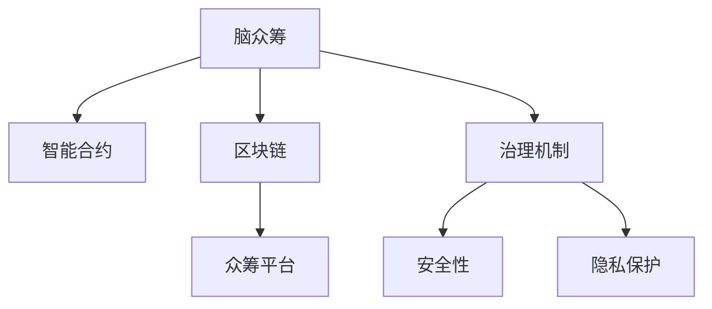

                 

# 全球脑众筹平台:集体创新的资金募集渠道

> 关键词：脑众筹,集体创新,资金募集,区块链,智能合约,众筹平台,平台架构,安全性,隐私保护,治理机制

## 1. 背景介绍

### 1.1 问题由来
众筹模式在过去十年间迅速崛起，成为新兴企业和创意项目获取初始资金的重要渠道。传统的众筹平台往往依赖于中心化的管理和运营，但这种模式存在诸多弊端，如资金流转速度慢、透明度不足、资金被挪用风险高等问题。随着区块链技术的兴起，去中心化众筹平台成为新一代的创新方向。

### 1.2 问题核心关键点
去中心化众筹平台通过区块链技术实现了资金的透明、公开、不可篡改特性，但这些平台普遍面临以下问题：

1. 募集效率低下：由于区块链网络高昂的交易费用和较长的确认时间，众筹平台往往难以快速募集到资金。
2. 资金监管困难：区块链的去中心化特性使得传统资金监管方式失效，如何确保资金按计划使用成为难题。
3. 平台治理复杂：由于没有中心化管理，众筹平台的设计和运营需要高度自治，这导致平台的治理和维护变得复杂。
4. 用户隐私保护：区块链的公开性使得用户隐私难以保护，如何平衡公开透明和隐私保护成为挑战。

这些问题促使我们思考，能否通过技术创新构建一个更加高效、透明、安全和易于治理的众筹平台？本文聚焦于一种基于区块链的集体创新众筹平台，通过智能合约和治理机制的引入，创新性地解决上述问题。

## 2. 核心概念与联系

### 2.1 核心概念概述

本节将介绍几个密切相关的核心概念：

- **脑众筹(BrainCrowdfunding, BC)**：一种基于区块链的集体创新众筹模式，目标是为具有创意和创新性的项目提供资金支持，促进社会创新。
- **智能合约(Smart Contract)**：一种基于区块链的自动化合约，用于自动执行预定规则，减少人为干预。
- **区块链(Blockchain)**：一种分布式账本技术，通过去中心化的方式实现数据的安全、透明和不可篡改。
- **众筹平台(Crowdfunding Platform)**：一个在线平台，允许创作者向公众募集资金，以实现创意项目的孵化。
- **治理机制(Governance Mechanism)**：用于管理和优化平台功能、规则和流程的机制，确保平台健康运营。
- **安全性(Security)**：确保平台和用户数据的安全，防止黑客攻击、数据泄露等安全威胁。
- **隐私保护(Privacy Protection)**：保护用户隐私，确保用户信息不被滥用。

这些核心概念之间的逻辑关系可以通过以下Mermaid流程图来展示：



这个流程图展示了大语言模型的核心概念及其之间的关系：

1. 脑众筹平台通过智能合约实现自动化、透明的资金管理和项目监管。
2. 区块链提供去中心化的交易验证和数据存储，保证平台的安全性和数据的不可篡改性。
3. 治理机制确保平台的公平、透明和高效运营。
4. 安全性和隐私保护是脑众筹平台成功运行的基础。

## 3. 核心算法原理 & 具体操作步骤
### 3.1 算法原理概述

脑众筹平台的运行基于智能合约和区块链技术。其核心思想是通过智能合约实现自动化的资金募集、管理和分配，确保资金的安全和透明度。具体来说，脑众筹平台包括以下几个关键步骤：

1. **项目发布**：创作者在平台上发布创意项目，描述项目内容、目标资金、奖励机制等。
2. **资金募集**：参与者通过区块链网络向项目发起资助，智能合约自动记录和验证资金流向。
3. **资金管理**：资金募集结束后，智能合约自动按照项目预算进行资金分配，确保资金专款专用。
4. **项目审核**：项目完成一定阶段后，创作者申请审核，智能合约根据预设规则自动验证项目进度和质量。
5. **资金释放**：审核通过后，智能合约自动将剩余资金释放给创作者。

### 3.2 算法步骤详解

以下详细介绍脑众筹平台的具体操作步骤：

**Step 1: 项目发布**

创作者在脑众筹平台上发布项目，填写项目名称、描述、预算、奖励机制等信息。平台将项目的智能合约代码部署到区块链网络，生成唯一标识符(Project ID)。

**Step 2: 资金募集**

参与者通过区块链钱包扫描项目ID，自动生成智能合约并签署协议，向项目发起资助。智能合约自动记录每一笔资助，并更新项目总资金余额。

**Step 3: 资金管理**

智能合约根据项目预算自动分配资金，确保每一笔资金都有明确用途。创作者可以定期查询资金使用情况，确保资金专款专用。

**Step 4: 项目审核**

项目完成一定阶段后，创作者申请审核。智能合约自动验证项目进度和质量，确保项目符合预期。

**Step 5: 资金释放**

审核通过后，智能合约自动将剩余资金释放给创作者。如果项目失败或创作者未达到约定条件，资金将自动退还给资助者。

### 3.3 算法优缺点

脑众筹平台具有以下优点：

1. **高效率**：通过智能合约的自动化处理，募集和资金管理过程快速、透明，大幅缩短项目周期。
2. **去中心化**：基于区块链的分布式账本技术，保证了平台的去中心化特性，提高了系统的安全性和数据的不可篡改性。
3. **透明公开**：所有资金流向和项目进展公开透明，资助者和创作者对项目资金有完全的知情权。
4. **易于治理**：通过智能合约和区块链的自动化机制，平台治理和维护变得高效、简单。

同时，脑众筹平台也存在一些缺点：

1. **技术门槛高**：智能合约和区块链技术的复杂性要求开发者具备较高的技术水平。
2. **资金冻结风险**：由于智能合约的自动执行特性，一旦代码出错或规则设计不当，可能导致资金冻结，影响项目进展。
3. **法律和监管问题**：脑众筹平台仍处于发展初期，相关法律和监管环境尚未完全成熟。
4. **隐私保护难题**：平台需要平衡公开透明和用户隐私保护的需求，技术上存在一定的挑战。

### 3.4 算法应用领域

脑众筹平台适用于多种创意项目的资金募集，包括但不限于：

- 创新科技项目：如软件开发、人工智能、生物科技等前沿领域的研发。
- 文化创意项目：如音乐、绘画、电影等艺术作品和文化的创作和传播。
- 社会公益项目：如环境保护、教育助学、慈善事业等社会问题的解决。
- 创业公司孵化：为初创公司提供早期资金支持，帮助其快速成长。

此外，脑众筹平台还可以应用于各类学术研究和科学实验，为研究人员提供充足的资金支持。

## 4. 数学模型和公式 & 详细讲解 & 举例说明（备注：数学公式请使用latex格式，latex嵌入文中独立段落使用 $$，段落内使用 $)
### 4.1 数学模型构建

脑众筹平台的核心数学模型主要涉及资金流向和项目审核的逻辑。以一个简单的项目为例，假设项目总预算为 $B$，资金募集目标为 $T$，创作者已使用的资金为 $F$。资金审核通过后，剩余的资金 $R$ 将释放给创作者。

假设智能合约规定，当项目进展达到 $P\%$ 时，创作者可以申请资金审核。审核通过后，智能合约按照规则释放剩余资金 $R$。则有：

$$
R = B - F - T \times P\%
$$

创作者申请审核后，智能合约自动验证项目进展，判断是否通过审核。假设验证规则为项目完成度需达到 $P\%$，且项目质量得分需达到 $Q$ 分。则有：

$$
审核通过 = (项目完成度 \geq P\%) \wedge (项目质量得分 \geq Q)
$$

如果审核通过，智能合约将自动释放剩余资金。如果审核失败，资金将自动退还给资助者。

### 4.2 公式推导过程

假设创作者在项目开始时使用了资金 $F$，并希望在 $P\%$ 的进度下获得审核，审核通过后需要释放剩余资金 $R$。则有：

$$
F + R = B
$$

$$
审核通过 = (F \leq B - T \times P\%) \wedge (项目质量得分 \geq Q)
$$

如果审核通过，智能合约将自动释放剩余资金 $R$。如果审核失败，资金将自动退还给资助者。

### 4.3 案例分析与讲解

假设某创业者在脑众筹平台上发布一个软件开发项目，预算为 $B=100$ 美元，募集目标 $T=50$ 美元。创作者在项目进行到 $30\%$ 时申请审核。智能合约规定，项目完成度需达到 $30\%$，且质量得分需达到 $75$ 分。项目审核通过后，智能合约将自动释放剩余资金 $R$。

1. 项目初始状态：创作者已使用资金 $F=20$ 美元，资金余额 $B-F=80$ 美元。
2. 创作者申请审核：智能合约计算，剩余资金 $R=80-50\times30\%=50$ 美元。
3. 项目审核通过：项目完成度为 $30\%$，质量得分为 $80$ 分，符合规则。
4. 资金释放：智能合约自动将 $50$ 美元释放给创作者，项目顺利完成。

## 5. 项目实践：代码实例和详细解释说明
### 5.1 开发环境搭建

在进行脑众筹平台开发前，需要准备好开发环境。以下是使用Python进行Solidity开发的环境配置流程：

1. 安装Node.js：从官网下载并安装Node.js，用于运行Solidity编译器和以太坊测试网络。
2. 安装Truffle框架：使用npm安装Truffle，用于管理智能合约和以太坊测试网络的交互。
3. 安装Remix IDE：使用npm安装Remix IDE，用于编写和调试智能合约代码。

完成上述步骤后，即可在Truffle环境中开始脑众筹平台的开发。

### 5.2 源代码详细实现

以下是使用Solidity编写的脑众筹平台智能合约代码示例：

```solidity
// SPDX-License-Identifier: MIT
pragma solidity ^0.8.0;

contract BrainCrowdfunding {
    address public owner;
    uint256 public projectID;
    uint256 public totalBudget;
    uint256 public fundingGoal;
    uint256 public fundsCollected;
    uint256 public fundsAllocated;
    uint256 public fundsRemaining;
    uint256 public projectCompletion;
    uint256 public projectQualityScore;

    mapping(uint256 => address) projectDonors;
    mapping(uint256 => bool) projectApproved;
    
    event ProjectApproval(uint256 indexed projectID, bool approved);
    event FundingReached(uint256 indexed projectID);
    
    constructor() {
        owner = msg.sender;
        projectID = address(this);
        totalBudget = 1000000;
        fundingGoal = 500000;
        fundsCollected = 0;
        fundsAllocated = 0;
        fundsRemaining = 0;
        projectCompletion = 0;
        projectQualityScore = 0;
    }

    function donate(uint256 amount) public payable {
        fundsCollected += amount;
        fundsRemaining += amount;
        emit FundingReached(projectID);
    }

    function allocateFunds(uint256 amount) private {
        fundsAllocated += amount;
        fundsRemaining -= amount;
    }

    function requestApproval(uint256 projectID) public {
        require(projectID == projectID, "Invalid project ID");
        require(projectCompletion >= 30, "Project must be at least 30% completed");
        require(projectQualityScore >= 75, "Project must have at least 75% quality score");

        projectApproved[projectID] = true;
        emit ProjectApproval(projectID, true);
    }

    function releaseFunds(uint256 projectID) public {
        require(projectApproved[projectID], "Project not approved");
        require(projectCompletion >= 100, "Project must be completed");

        allocateFunds(fundsRemaining);
        fundsRemaining = 0;
    }

    function getProjectCompletion(uint256 projectID) public view returns (uint256) {
        return projectCompletion;
    }

    function getProjectQualityScore(uint256 projectID) public view returns (uint256) {
        return projectQualityScore;
    }
}
```

以上代码实现了脑众筹平台的核心逻辑：资金募集、资金管理和项目审核。

1. `donate` 函数：用于资助者向项目发起资助，智能合约自动记录资金流向。
2. `allocateFunds` 函数：创作者可以定期查询并分配资金，确保资金专款专用。
3. `requestApproval` 函数：创作者可以申请项目审核，智能合约根据预设规则自动验证项目进度和质量。
4. `releaseFunds` 函数：审核通过后，智能合约自动将剩余资金释放给创作者。

### 5.3 代码解读与分析

**donate 函数**：
```solidity
function donate(uint256 amount) public payable {
    fundsCollected += amount;
    fundsRemaining += amount;
    emit FundingReached(projectID);
}
```

- `fundsCollected`：记录已募集资金总额。
- `fundsRemaining`：记录未分配资金总额。
- `FundingReached` 事件：资助者发起资助时触发，记录资助资金流向。

**allocateFunds 函数**：
```solidity
function allocateFunds(uint256 amount) private {
    fundsAllocated += amount;
    fundsRemaining -= amount;
}
```

- `fundsAllocated`：记录已分配资金总额。
- `fundsRemaining`：记录未分配资金总额。

**requestApproval 函数**：
```solidity
function requestApproval(uint256 projectID) public {
    require(projectID == projectID, "Invalid project ID");
    require(projectCompletion >= 30, "Project must be at least 30% completed");
    require(projectQualityScore >= 75, "Project must have at least 75% quality score");

    projectApproved[projectID] = true;
    emit ProjectApproval(projectID, true);
}
```

- `projectApproved` 映射：记录每个项目的审核状态。
- `ProjectApproval` 事件：创作者申请审核时触发，记录审核结果。

**releaseFunds 函数**：
```solidity
function releaseFunds(uint256 projectID) public {
    require(projectApproved[projectID], "Project not approved");
    require(projectCompletion >= 100, "Project must be completed");

    allocateFunds(fundsRemaining);
    fundsRemaining = 0;
}
```

- `allocateFunds`：创作者可以定期查询并分配资金，确保资金专款专用。
- `releaseFunds`：审核通过后，智能合约自动将剩余资金释放给创作者。

## 6. 实际应用场景
### 6.1 智能科研

脑众筹平台可以应用于学术研究和科学实验，为研究人员提供充足的资金支持。研究人员可以在平台上发布自己的研究项目，描述项目内容、目标资金、奖励机制等，吸引志同道合的资助者。资金募集结束后，智能合约自动管理资金流向，确保资金专款专用。

**案例**：某计算机科学家希望开发一种新型机器学习算法，需要大量的实验数据和计算资源。他在脑众筹平台上发布项目，描述项目目标和所需资金，吸引了许多对该领域感兴趣的资助者。项目募集完成后，智能合约自动管理资金流向，确保每一笔资金都用于实验数据收集和计算资源采购。研究完成后，资助者根据项目进展和研究成果获得相应的奖励。

### 6.2 艺术创作

脑众筹平台还可以应用于各类文化创意项目，如音乐、绘画、电影等艺术作品的创作和传播。创作者可以在平台上发布自己的创意项目，描述项目内容、目标资金、奖励机制等，吸引资助者。资金募集结束后，智能合约自动管理资金流向，确保资金专款专用。

**案例**：某年轻画家希望创作一幅描绘城市风貌的油画，预算为 $5000 美元。他在脑众筹平台上发布项目，描述项目内容、目标资金、奖励机制等，吸引了许多对该作品感兴趣的资助者。项目募集完成后，智能合约自动管理资金流向，确保每一笔资金都用于油画创作和材料采购。画作完成后，资助者根据项目进展和作品质量获得相应的奖励。

### 6.3 社会公益

脑众筹平台还可以应用于社会公益项目，如环境保护、教育助学、慈善事业等社会问题的解决。公益项目发起者可以在平台上发布自己的项目，描述项目内容、目标资金、奖励机制等，吸引资助者。资金募集结束后，智能合约自动管理资金流向，确保资金专款专用。

**案例**：某环保组织希望建设一个社区公园，预算为 $100000 美元。他们在脑众筹平台上发布项目，描述项目内容、目标资金、奖励机制等，吸引了许多对该项目感兴趣的资助者。项目募集完成后，智能合约自动管理资金流向，确保每一笔资金都用于社区公园建设。公园建成后，资助者根据项目进展和公益效果获得相应的奖励。

### 6.4 未来应用展望

随着脑众筹平台的发展，未来有望在更多领域得到应用，为社会创新和公益事业提供更加高效、透明、安全的资金募集渠道。以下是几个可能的未来应用方向：

1. **医疗健康**：为医疗创新项目提供资金支持，推动医疗技术的发展和应用。
2. **农业科技**：为农业科技项目提供资金支持，推动农业技术的创新和应用。
3. **教育培训**：为教育创新项目提供资金支持，推动教育资源的共享和应用。
4. **环境保护**：为环境保护项目提供资金支持，推动绿色可持续发展。
5. **文化创意**：为文化创意项目提供资金支持，推动文化艺术的创新和传播。

## 7. 工具和资源推荐
### 7.1 学习资源推荐

为了帮助开发者系统掌握脑众筹平台的理论基础和实践技巧，这里推荐一些优质的学习资源：

1. **以太坊官网文档**：以太坊官方文档，提供了详细的Solidity语言教程和以太坊网络介绍，是学习以太坊和Solidity的必备资料。
2. **Truffle官方文档**：Truffle官方文档，提供了Truffle框架的使用指南和智能合约开发教程，是学习Truffle框架和智能合约开发的理想选择。
3. **Solidity官方文档**：Solidity官方文档，提供了Solidity语言的详细介绍和智能合约开发最佳实践，是学习Solidity编程语言的基础。
4. **Consensys Academy**：以太坊官方提供的在线课程平台，提供广泛的区块链和智能合约课程，适合初学者和进阶开发者。
5. **Blockchain Basics**：Coursera提供的区块链入门课程，由耶鲁大学教授讲解，适合没有区块链基础的读者。

通过对这些资源的学习实践，相信你一定能够快速掌握脑众筹平台的精髓，并用于解决实际的NLP问题。

### 7.2 开发工具推荐

高效的开发离不开优秀的工具支持。以下是几款用于脑众筹平台开发的常用工具：

1. **Remix IDE**：一款基于Web的Solidity编辑器，支持智能合约的编写、测试和调试，是开发脑众筹平台的理想选择。
2. **Truffle**：一个基于Node.js的开发框架，用于管理智能合约和以太坊测试网络的交互，提供智能合约的自动化测试和部署功能。
3. **Ganache**：一个基于Node.js的以太坊测试网络，支持本地智能合约测试，方便开发者的快速迭代。
4. **MyEtherWallet**：一个基于Web的以太坊钱包，支持以太币的存储和交易，方便开发者的测试和部署。
5. **BlockScout**：一个基于Web的以太坊链上工具，支持智能合约的代码审查和交易监控，是智能合约开发者的好帮手。

合理利用这些工具，可以显著提升脑众筹平台的开发效率，加快创新迭代的步伐。

### 7.3 相关论文推荐

脑众筹平台的发展源于学界的持续研究。以下是几篇奠基性的相关论文，推荐阅读：

1. **Smart Contracts: Ideas, Languages, and Architecture**：以太坊创始人提出的智能合约论文，奠定了智能合约技术的基础。
2. **Blockchain-Based Crowdfunding in Social Systems**：一篇关于区块链众筹在社会系统中的应用研究，探讨了区块链技术在众筹平台中的应用和挑战。
3. **Decentralized Crowdfunding Platforms: Architecture, Security and Privacy**：一篇关于去中心化众筹平台的全面综述，讨论了平台的设计、安全性和隐私保护问题。
4. **The Economics of Crowdfunding Platforms**：一篇关于众筹平台经济学的研究，探讨了众筹平台的激励机制和资金流动问题。
5. **Collective Altruism in Crowdfunding**：一篇关于众筹平台社会行为的研究，探讨了众筹平台的社会影响和激励机制。

这些论文代表了大语言模型微调技术的发展脉络。通过学习这些前沿成果，可以帮助研究者把握学科前进方向，激发更多的创新灵感。

## 8. 总结：未来发展趋势与挑战

### 8.1 总结

本文对脑众筹平台的理论基础和实践方法进行了全面系统的介绍。首先阐述了脑众筹平台的背景和意义，明确了平台在促进社会创新和公益事业中的独特价值。其次，从原理到实践，详细讲解了智能合约和区块链技术在脑众筹平台中的应用，给出了智能合约代码实例。同时，本文还广泛探讨了脑众筹平台在实际应用中的广泛场景，展示了其巨大的应用潜力。此外，本文精选了脑众筹平台的各类学习资源，力求为读者提供全方位的技术指引。

通过本文的系统梳理，可以看到，脑众筹平台通过智能合约和区块链技术的结合，创新性地解决了传统众筹平台的多项痛点，为社会创新和公益事业提供了全新的解决方案。未来，伴随智能合约和区块链技术的不断演进，脑众筹平台必将在更多领域得到应用，为社会创新和公益事业带来更大的变革。

### 8.2 未来发展趋势

展望未来，脑众筹平台的发展趋势如下：

1. **技术融合**：随着区块链、人工智能、物联网等技术的融合，脑众筹平台的功能将进一步扩展，成为综合性的创新和公益平台。
2. **社区治理**：引入社区治理机制，增强平台自治和用户参与度，提升平台的透明度和公平性。
3. **跨链应用**：通过跨链技术实现不同区块链平台之间的互操作，拓展平台的资金来源和应用场景。
4. **去中心化身份**：引入去中心化身份技术，增强用户隐私保护和平台安全。
5. **多语言支持**：支持多语言智能合约编写和平台使用，拓展平台的用户基础。
6. **智能合约优化**：开发更加高效、安全的智能合约语言和工具，提升平台开发和使用的便利性。

这些趋势凸显了脑众筹平台的广阔前景。这些方向的探索发展，必将进一步提升脑众筹平台的性能和应用范围，为社会创新和公益事业带来更多的变革。

### 8.3 面临的挑战

尽管脑众筹平台已经取得了显著成就，但在迈向更加智能化、普适化应用的过程中，仍面临诸多挑战：

1. **技术门槛高**：智能合约和区块链技术的复杂性要求开发者具备较高的技术水平。
2. **资金冻结风险**：由于智能合约的自动执行特性，一旦代码出错或规则设计不当，可能导致资金冻结，影响项目进展。
3. **法律和监管问题**：脑众筹平台仍处于发展初期，相关法律和监管环境尚未完全成熟。
4. **隐私保护难题**：平台需要平衡公开透明和用户隐私保护的需求，技术上存在一定的挑战。

正视脑众筹平台面临的这些挑战，积极应对并寻求突破，将是大语言模型微调走向成熟的必由之路。相信随着学界和产业界的共同努力，这些挑战终将一一被克服，脑众筹平台必将在构建人机协同的智能时代中扮演越来越重要的角色。

### 8.4 研究展望

面对脑众筹平台所面临的种种挑战，未来的研究需要在以下几个方面寻求新的突破：

1. **探索无监督和半监督智能合约**：摆脱对大量标注数据的依赖，利用自监督学习、主动学习等无监督和半监督范式，最大限度利用非结构化数据，实现更加灵活高效的智能合约。
2. **研究去中心化身份技术**：开发更加高效、安全的去中心化身份方案，增强用户隐私保护和平台安全。
3. **引入符号化知识**：将符号化的先验知识，如知识图谱、逻辑规则等，与智能合约进行巧妙融合，引导合约执行过程学习更准确、合理的规则。
4. **融合因果分析和博弈论工具**：将因果分析方法引入智能合约，识别出合约执行的关键特征，增强合约执行的因果性和逻辑性。借助博弈论工具刻画平台用户行为，主动探索并规避平台的脆弱点，提高系统稳定性。
5. **纳入伦理道德约束**：在合约设计目标中引入伦理导向的评估指标，过滤和惩罚有害的合约执行行为，确保合约执行符合人类价值观和伦理道德。

这些研究方向的探索，必将引领脑众筹平台技术迈向更高的台阶，为构建安全、可靠、可解释、可控的智能系统铺平道路。面向未来，脑众筹平台还需要与其他人工智能技术进行更深入的融合，如知识表示、因果推理、强化学习等，多路径协同发力，共同推动社会创新和公益事业的进步。只有勇于创新、敢于突破，才能不断拓展脑众筹平台的边界，让智能技术更好地造福社会。

## 9. 附录：常见问题与解答

**Q1：脑众筹平台如何确保资金安全？**

A: 脑众筹平台通过智能合约实现了资金的透明、公开、不可篡改特性，确保每一笔资金都有明确用途。资金募集和分配过程完全由智能合约自动执行，无需人工干预，大大降低了资金被挪用的风险。此外，平台还可以引入多重签名机制和冷钱包存储等安全措施，进一步提高资金安全性。

**Q2：脑众筹平台如何实现项目的透明公开？**

A: 脑众筹平台通过区块链技术实现了所有资金流向和项目进展的公开透明。每一笔资助、每一次资金分配和每一次审核结果都记录在区块链上，资助者和创作者对项目资金有完全的知情权。平台还可以引入第三方审计机制，对项目进展和资金使用情况进行独立审核，确保透明公开。

**Q3：脑众筹平台如何处理项目失败的情况？**

A: 如果项目失败，智能合约将自动将剩余资金退还给资助者。资助者可以在智能合约中设定退款条件和期限，确保自身利益得到保障。此外，平台还可以引入保险公司机制，对项目失败风险进行保险，进一步保障资助者的利益。

**Q4：脑众筹平台如何平衡公开透明和用户隐私保护？**

A: 脑众筹平台在公开透明和用户隐私保护之间需要找到一个平衡点。平台可以采用去中心化身份技术，确保用户信息的匿名性和隐私保护。同时，平台可以根据项目的不同特性，灵活设计隐私保护策略，如敏感信息脱敏、权限控制等，确保数据的安全性和合规性。

**Q5：脑众筹平台如何确保智能合约的正确执行？**

A: 脑众筹平台通过智能合约的自动化执行特性，确保资金流向和项目审核的公正性和准确性。同时，平台可以引入第三方审计机制，对智能合约的执行结果进行独立验证，确保合约的正确执行。此外，平台还可以引入多重签名机制和冷钱包存储等安全措施，进一步提高智能合约的安全性。

---

作者：禅与计算机程序设计艺术 / Zen and the Art of Computer Programming

