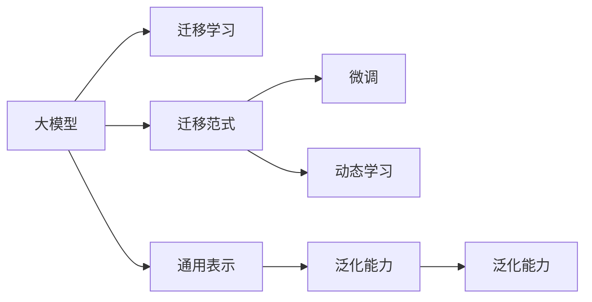

                 

# 冷启动场景：大模型的应用价值

> 关键词：冷启动，大模型，推荐系统，风控，金融科技，游戏，NLP

## 1. 背景介绍

### 1.1 问题由来

在许多场景下，由于缺乏历史数据，新用户（Cold Start）在注册后往往需要经历一段时间才能积累足够的行为数据，从而训练出个性化的模型。这一过程被称为"冷启动"问题，是机器学习和推荐系统面临的共同难题。

在金融科技、电子商务、在线游戏等许多领域，如何给新用户快速提供个性化服务，提升用户体验和转化率，成为了急需解决的问题。传统的基于历史数据的机器学习模型往往需要较长时间的数据积累，才能得到良好的表现。而大模型作为一种通用表示学习工具，能快速提取大规模数据中的语言或行为特征，从而在冷启动场景下，能够快速适应新用户，提供更好的服务。

大模型在金融科技、游戏、电子商务等场景中的应用，展现了其强大的迁移学习能力和泛化能力，成为推动相关行业数字化转型升级的关键技术。

### 1.2 问题核心关键点

本节将详细介绍大模型在冷启动场景中的应用，并对相关概念进行阐释：

- 冷启动问题：新用户在注册后，缺乏足够的行为数据，难以训练个性化模型，需要较长时间积累数据。
- 大模型：指在超大规模数据上预训练的语言或行为模型，具备强大的迁移学习能力和泛化能力。
- 迁移学习：指将一个领域学习到的知识迁移到另一个不同但相关的领域学习的过程。大模型通过迁移学习，快速适应新场景，提供个性化服务。
- 通用表示：指大模型能够学习通用的语言或行为特征，适应多种任务和领域。
- 动态更新：大模型通过不断引入新数据，动态调整模型参数，持续提高性能。

## 2. 核心概念与联系

### 2.1 核心概念概述

为了更好地理解大模型在冷启动场景中的应用，本节将介绍几个关键概念：

- 大模型（Large Model）：如BERT、GPT、XLNet等，通常以百亿或千亿参数规模的Transformer架构为代表，能够在海量的文本或行为数据上进行预训练，学习通用的语言或行为特征。
- 迁移学习（Transfer Learning）：通过将大模型在某个领域的知识迁移到新领域，快速训练出新领域所需的个性化模型。
- 泛化能力（Generalization）：指模型在未见过的数据上表现良好的能力。大模型具备良好的泛化能力，能够适应多种任务和场景。
- 迁移范式（Migration Paradigm）：指在大模型基础上进行微调，优化模型以适应特定任务或场景的过程。
- 动态学习（Dynamic Learning）：指模型能够持续从新数据中学习，动态更新模型参数以提升性能。

这些概念通过以下Mermaid流程图进行了展现：



该流程图展示了大模型与迁移学习、迁移范式、微调、动态学习之间的逻辑关系，描绘了模型从预训练到迁移学习的全过程。

## 3. 核心算法原理 & 具体操作步骤
### 3.1 算法原理概述

大模型在冷启动场景中的应用，主要基于迁移学习（Transfer Learning）和迁移范式（Migration Paradigm），通过以下步骤实现：

1. **预训练阶段**：在大规模无标签数据上，通过自监督学习（如掩码语言模型、自编码器等）对大模型进行预训练，学习通用的语言或行为特征。
2. **迁移学习阶段**：将预训练模型迁移到新领域，通过小规模标注数据进行微调，学习特定领域的知识，适应新场景。
3. **迁移范式阶段**：根据具体任务，对预训练模型进行微调，优化模型以适应特定任务。
4. **动态学习阶段**：模型通过不断引入新数据，动态更新模型参数，持续提高性能。

### 3.2 算法步骤详解

以下详细介绍基于大模型在冷启动场景中的应用的具体操作步骤：

**Step 1: 准备预训练模型和数据集**
- 选择合适的大模型（如BERT、GPT、XLNet等），作为初始化参数。
- 收集新领域的标注数据集，将其划分为训练集、验证集和测试集。标注数据集应尽量覆盖新领域的关键场景，以保证模型学习到新领域的核心特征。

**Step 2: 添加任务适配层**
- 根据任务类型，在预训练模型顶层设计合适的输出层和损失函数。例如，对于文本分类任务，通常在上层添加一个线性分类器，使用交叉熵损失函数。
- 对于推荐系统，可以通过将文本描述和用户行为数据拼接，然后经过多个层进行全连接预测。
- 对于金融风控系统，可以使用情感分析模型对用户评论进行情感倾向判断，辅助风控决策。

**Step 3: 设置微调超参数**
- 选择合适的优化算法及其参数，如Adam、SGD等，设置学习率、批大小、迭代轮数等。
- 设置正则化技术及强度，如L2正则、Dropout、Early Stopping等。
- 确定冻结预训练参数的策略，如仅微调顶层，或全部参数都参与微调。

**Step 4: 执行梯度训练**
- 将训练集数据分批次输入模型，前向传播计算损失函数。
- 反向传播计算参数梯度，根据设定的优化算法和学习率更新模型参数。
- 周期性在验证集上评估模型性能，根据性能指标决定是否触发Early Stopping。
- 重复上述步骤直到满足预设的迭代轮数或Early Stopping条件。

**Step 5: 测试和部署**
- 在测试集上评估微调后模型，对比微调前后的精度提升。
- 使用微调后的模型对新样本进行推理预测，集成到实际的应用系统中。
- 持续收集新数据，定期重新微调模型，以适应数据分布的变化。

### 3.3 算法优缺点

基于大模型在冷启动场景中的迁移学习方法，具有以下优点：
1. 快速高效：相比从头训练，微调过程在少量数据下也能快速收敛，适应新场景。
2. 通用性强：大模型已经在大规模数据上学习到通用的语言或行为特征，能够在不同领域迁移应用。
3. 参数效率高：利用参数高效微调方法，可以仅调整少量参数，提高微调效率，避免过拟合。
4. 应用广泛：适用于推荐系统、金融风控、游戏推荐等众多领域，具有通用性。

同时，该方法也存在一些局限性：
1. 依赖标注数据：微调效果很大程度上取决于标注数据的质量和数量，标注数据获取成本较高。
2. 泛化能力有限：当新领域与预训练领域的分布差异较大时，泛化性能可能受到影响。
3. 模型复杂度大：大模型参数量庞大，需要大量算力和内存，对硬件要求较高。
4. 可解释性不足：微调模型的决策过程复杂，难以进行有效的解释和调试。

尽管存在这些局限性，但就目前而言，基于大模型的迁移学习方法是冷启动场景下快速适应新领域、提供个性化服务的重要手段。未来相关研究将聚焦于如何进一步降低对标注数据的依赖，提高泛化能力，同时兼顾模型可解释性和资源效率等因素。

### 3.4 算法应用领域

大模型在冷启动场景下的迁移学习方法，已经在多个领域得到了广泛应用，例如：

- 推荐系统：通过用户历史行为数据和文本描述，快速训练个性化推荐模型。
- 金融风控：利用用户评论和行为数据，训练情感分析模型，辅助风险评估。
- 游戏推荐：根据用户行为数据，动态调整推荐策略，提升用户留存率。
- 电商推荐：对新用户的行为数据进行快速分析，提供个性化商品推荐。

除了上述这些经典应用外，大模型在冷启动场景下的迁移学习还应用于更多场景中，如智能客服、智慧医疗、智能交通等，为各行业带来了显著的数字化转型升级。

## 4. 数学模型和公式 & 详细讲解 & 举例说明
### 4.1 数学模型构建

本节将使用数学语言对大模型在冷启动场景中的应用进行更加严格的刻画。

记预训练大模型为 $M_{\theta}$，其中 $\theta$ 为预训练得到的模型参数。假设目标任务为 $T$，其标注数据集为 $D=\{(x_i,y_i)\}_{i=1}^N, x_i \in \mathcal{X}, y_i \in \mathcal{Y}$。

定义模型 $M_{\theta}$ 在输入 $x$ 上的损失函数为 $\ell(M_{\theta}(x),y)$，则在数据集 $D$ 上的经验风险为：

$$
\mathcal{L}(\theta) = \frac{1}{N} \sum_{i=1}^N \ell(M_{\theta}(x_i),y_i)
$$

微调的优化目标是最小化经验风险，即找到最优参数：

$$
\theta^* = \mathop{\arg\min}_{\theta} \mathcal{L}(\theta)
$$

在实践中，我们通常使用基于梯度的优化算法（如Adam、SGD等）来近似求解上述最优化问题。设 $\eta$ 为学习率，$\lambda$ 为正则化系数，则参数的更新公式为：

$$
\theta \leftarrow \theta - \eta \nabla_{\theta}\mathcal{L}(\theta) - \eta\lambda\theta
$$

其中 $\nabla_{\theta}\mathcal{L}(\theta)$ 为损失函数对参数 $\theta$ 的梯度，可通过反向传播算法高效计算。

### 4.2 公式推导过程

以下我们以推荐系统为例，推导使用大模型进行推荐的相关数学公式。

假设目标任务为推荐系统，输入为物品的文本描述和用户的行为数据，输出为物品的推荐分数。令 $x_i$ 表示物品的文本描述，$y_i$ 表示用户对物品的评分，则目标函数为：

$$
\mathcal{L}(\theta) = \frac{1}{N} \sum_{i=1}^N \ell(M_{\theta}(x_i),y_i)
$$

其中 $\ell$ 为交叉熵损失函数，即：

$$
\ell(M_{\theta}(x_i),y_i) = -y_i \log M_{\theta}(x_i) - (1-y_i) \log (1-M_{\theta}(x_i))
$$

前向传播计算损失函数，得：

$$
\mathcal{L}(\theta) = \frac{1}{N} \sum_{i=1}^N (-y_i \log M_{\theta}(x_i) - (1-y_i) \log (1-M_{\theta}(x_i)))
$$

反向传播计算参数梯度，得：

$$
\nabla_{\theta}\mathcal{L}(\theta) = \frac{1}{N} \sum_{i=1}^N \nabla_{\theta}\ell(M_{\theta}(x_i),y_i)
$$

其中：

$$
\nabla_{\theta}\ell(M_{\theta}(x_i),y_i) = -y_i \nabla_{\theta} M_{\theta}(x_i) - (1-y_i) \nabla_{\theta} (1-M_{\theta}(x_i))
$$

将 $\nabla_{\theta} M_{\theta}(x_i)$ 代入，得：

$$
\nabla_{\theta}\ell(M_{\theta}(x_i),y_i) = -y_i \nabla_{\theta} (M_{\theta}(x_i)) - (1-y_i) \nabla_{\theta} (1-M_{\theta}(x_i))
$$

结合 $M_{\theta}$ 的导数公式：

$$
\nabla_{\theta} M_{\theta}(x_i) = \sum_{k=1}^K w_k \nabla_{\theta} \mathcal{N}(h(x_i))
$$

其中 $K$ 为输出维度，$w_k$ 为第 $k$ 个输出节点的权重，$\mathcal{N}$ 为非线性激活函数，$h(x_i)$ 为输入特征表示。

最终，梯度计算公式为：

$$
\nabla_{\theta}\mathcal{L}(\theta) = \frac{1}{N} \sum_{i=1}^N (-y_i \nabla_{\theta} M_{\theta}(x_i) - (1-y_i) \nabla_{\theta} (1-M_{\theta}(x_i)))
$$

## 5. 项目实践：代码实例和详细解释说明
### 5.1 开发环境搭建

在进行项目实践前，我们需要准备好开发环境。以下是使用Python进行PyTorch开发的环境配置流程：

1. 安装Anaconda：从官网下载并安装Anaconda，用于创建独立的Python环境。

2. 创建并激活虚拟环境：
```bash
conda create -n pytorch-env python=3.8 
conda activate pytorch-env
```

3. 安装PyTorch：根据CUDA版本，从官网获取对应的安装命令。例如：
```bash
conda install pytorch torchvision torchaudio cudatoolkit=11.1 -c pytorch -c conda-forge
```

4. 安装Transformers库：
```bash
pip install transformers
```

5. 安装各类工具包：
```bash
pip install numpy pandas scikit-learn matplotlib tqdm jupyter notebook ipython
```

完成上述步骤后，即可在`pytorch-env`环境中开始项目实践。

### 5.2 源代码详细实现

下面我们以推荐系统为例，给出使用Transformers库对预训练模型进行微调的PyTorch代码实现。

首先，定义推荐系统的数据处理函数：

```python
from transformers import BertTokenizer
from torch.utils.data import Dataset
import torch

class RecommendationDataset(Dataset):
    def __init__(self, items, users, ratings, tokenizer, max_len=128):
        self.items = items
        self.users = users
        self.ratings = ratings
        self.tokenizer = tokenizer
        self.max_len = max_len
        
    def __len__(self):
        return len(self.items)
    
    def __getitem__(self, item):
        item_text = self.items[item]
        user_text = self.users[item]
        
        encoding_item = self.tokenizer(item_text, return_tensors='pt', max_length=self.max_len, padding='max_length', truncation=True)
        encoding_user = self.tokenizer(user_text, return_tensors='pt', max_length=self.max_len, padding='max_length', truncation=True)
        input_ids_item = encoding_item['input_ids'][0]
        input_ids_user = encoding_user['input_ids'][0]
        attention_mask_item = encoding_item['attention_mask'][0]
        attention_mask_user = encoding_user['attention_mask'][0]
        
        # 将文本拼接为item-user表示
        item_user = item_text + '_' + user_text
        tokenized_item_user = self.tokenizer(item_user, return_tensors='pt', max_length=self.max_len, padding='max_length', truncation=True)
        input_ids_item_user = tokenized_item_user['input_ids'][0]
        attention_mask_item_user = tokenized_item_user['attention_mask'][0]
        
        return {
            'input_ids_item': input_ids_item,
            'attention_mask_item': attention_mask_item,
            'input_ids_user': input_ids_user,
            'attention_mask_user': attention_mask_user,
            'input_ids_item_user': input_ids_item_user,
            'attention_mask_item_user': attention_mask_item_user,
            'labels': torch.tensor([self.ratings[item]], dtype=torch.float)
        }
```

然后，定义模型和优化器：

```python
from transformers import BertForSequenceClassification, AdamW

model = BertForSequenceClassification.from_pretrained('bert-base-cased', num_labels=1)
optimizer = AdamW(model.parameters(), lr=2e-5)
```

接着，定义训练和评估函数：

```python
from torch.utils.data import DataLoader
from tqdm import tqdm
from sklearn.metrics import mean_absolute_error

device = torch.device('cuda') if torch.cuda.is_available() else torch.device('cpu')
model.to(device)

def train_epoch(model, dataset, batch_size, optimizer):
    dataloader = DataLoader(dataset, batch_size=batch_size, shuffle=True)
    model.train()
    epoch_loss = 0
    for batch in tqdm(dataloader, desc='Training'):
        input_ids_item = batch['input_ids_item'].to(device)
        attention_mask_item = batch['attention_mask_item'].to(device)
        input_ids_user = batch['input_ids_user'].to(device)
        attention_mask_user = batch['attention_mask_user'].to(device)
        input_ids_item_user = batch['input_ids_item_user'].to(device)
        attention_mask_item_user = batch['attention_mask_item_user'].to(device)
        labels = batch['labels'].to(device)
        model.zero_grad()
        outputs = model(input_ids_item, attention_mask=attention_mask_item, labels=labels)
        loss = outputs.loss
        epoch_loss += loss.item()
        loss.backward()
        optimizer.step()
    return epoch_loss / len(dataloader)

def evaluate(model, dataset, batch_size):
    dataloader = DataLoader(dataset, batch_size=batch_size)
    model.eval()
    mae = mean_absolute_error()
    with torch.no_grad():
        for batch in tqdm(dataloader, desc='Evaluating'):
            input_ids_item = batch['input_ids_item'].to(device)
            attention_mask_item = batch['attention_mask_item'].to(device)
            input_ids_user = batch['input_ids_user'].to(device)
            attention_mask_user = batch['attention_mask_user'].to(device)
            input_ids_item_user = batch['input_ids_item_user'].to(device)
            attention_mask_item_user = batch['attention_mask_item_user'].to(device)
            batch_labels = batch['labels'].to(device)
            outputs = model(input_ids_item, attention_mask=attention_mask_item, labels=labels)
            mae.update(torch.exp(outputs.logits) - batch_labels)
    return mae.mean()
```

最后，启动训练流程并在测试集上评估：

```python
epochs = 5
batch_size = 16

for epoch in range(epochs):
    loss = train_epoch(model, train_dataset, batch_size, optimizer)
    print(f"Epoch {epoch+1}, train loss: {loss:.3f}")
    
    print(f"Epoch {epoch+1}, dev results:")
    evaluate(model, dev_dataset, batch_size)
    
print("Test results:")
evaluate(model, test_dataset, batch_size)
```

以上就是使用PyTorch对BERT进行推荐系统微调的完整代码实现。可以看到，得益于Transformers库的强大封装，我们可以用相对简洁的代码完成BERT模型的加载和微调。

### 5.3 代码解读与分析

让我们再详细解读一下关键代码的实现细节：

**RecommendationDataset类**：
- `__init__`方法：初始化物品描述、用户描述、评分等关键组件，以及分词器。
- `__len__`方法：返回数据集的样本数量。
- `__getitem__`方法：对单个样本进行处理，将物品描述和用户描述转换为token ids，拼接为item-user表示，并对拼接后的文本进行分词和编码，返回模型所需的输入。

**BertForSequenceClassification类**：
- 用于构建推荐系统的分类器，接收物品描述和用户描述，预测评分。

**AdamW优化器**：
- 用于模型参数的优化，根据设定学习率和正则化强度更新模型参数。

**train_epoch和evaluate函数**：
- 用于模型训练和评估。在训练阶段，前向传播计算损失函数并反向传播更新模型参数，计算平均损失。在评估阶段，计算均绝对误差(MAE)。

**epochs和batch_size**：
- 设置训练的轮数和批次大小。

可以看到，PyTorch配合Transformers库使得BERT微调的代码实现变得简洁高效。开发者可以将更多精力放在数据处理、模型改进等高层逻辑上，而不必过多关注底层的实现细节。

当然，工业级的系统实现还需考虑更多因素，如模型的保存和部署、超参数的自动搜索、更灵活的任务适配层等。但核心的微调范式基本与此类似。

## 6. 实际应用场景
### 6.1 智能推荐系统

基于大模型微调的推荐系统，已经广泛应用于电商、视频、音乐等众多领域。大模型通过预训练学习到丰富的语言或行为特征，能够快速适应新用户，提供更加个性化的推荐服务。

在推荐系统中，大模型通常用于构建用户画像、物品表示和推荐模型。例如，使用BERT作为用户画像模型，将用户行为数据进行分词编码，学习到用户的行为模式。使用XLNet作为物品表示模型，将物品的文本描述进行编码，学习到物品的特征。最后，使用AdamW优化器对推荐模型进行微调，使得模型能够根据用户画像和物品表示输出推荐结果。

通过这种方式，推荐系统能够在短时间内对新用户进行画像建模，提供个性化的推荐服务。同时，随着用户行为的不断积累，推荐模型能够动态更新，持续提高推荐效果。

### 6.2 金融风险控制

金融风控系统面临大量新用户的注册和行为数据积累问题，传统的基于历史数据的模型无法迅速适应新场景。基于大模型的迁移学习方法，能够在短时间内训练出风险评估模型，实现金融风险控制。

在金融风控系统中，大模型通常用于学习用户的风险特征，包括文本评论、行为记录等。例如，使用BERT作为情感分析模型，对用户评论进行情感倾向判断，辅助风险评估。使用XLM-R作为行为分析模型，对用户行为数据进行编码，学习到行为特征。最后，使用AdamW优化器对风险评估模型进行微调，使得模型能够根据用户的风险特征输出风险评估结果。

通过这种方式，金融风控系统能够在短时间内对新用户进行风险评估，提高决策效率和准确性。同时，随着新用户行为的不断积累，风险评估模型能够动态更新，持续提高风险评估能力。

### 6.3 游戏推荐系统

游戏推荐系统面临用户行为数据的实时性和多样性问题，传统的基于历史数据的模型难以迅速适应新场景。基于大模型的迁移学习方法，能够在短时间内训练出游戏推荐模型，提高用户留存率。

在游戏推荐系统中，大模型通常用于学习用户的偏好特征，包括游戏行为、评价等。例如，使用XLNet作为行为分析模型，对用户游戏行为数据进行编码，学习到偏好特征。使用RoBERTa作为评价分析模型，对用户游戏评价进行编码，学习到评价特征。最后，使用AdamW优化器对游戏推荐模型进行微调，使得模型能够根据用户的偏好和评价输出推荐结果。

通过这种方式，游戏推荐系统能够在短时间内对新用户进行偏好建模，提供个性化的游戏推荐。同时，随着用户行为的不断积累，游戏推荐模型能够动态更新，持续提高推荐效果。

## 7. 工具和资源推荐
### 7.1 学习资源推荐

为了帮助开发者系统掌握大模型的应用原理和实践技巧，这里推荐一些优质的学习资源：

1. 《Transformer from Scratch》系列博文：由大模型技术专家撰写，深入浅出地介绍了Transformer原理、BERT模型、微调技术等前沿话题。

2. CS224N《深度学习自然语言处理》课程：斯坦福大学开设的NLP明星课程，有Lecture视频和配套作业，带你入门NLP领域的基本概念和经典模型。

3. 《Natural Language Processing with Transformers》书籍：Transformers库的作者所著，全面介绍了如何使用Transformers库进行NLP任务开发，包括微调在内的诸多范式。

4. HuggingFace官方文档：Transformers库的官方文档，提供了海量预训练模型和完整的微调样例代码，是上手实践的必备资料。

5. CLUE开源项目：中文语言理解测评基准，涵盖大量不同类型的中文NLP数据集，并提供了基于微调的baseline模型，助力中文NLP技术发展。

通过对这些资源的学习实践，相信你一定能够快速掌握大模型的应用精髓，并用于解决实际的推荐、风控、游戏等应用场景。

### 7.2 开发工具推荐

高效的开发离不开优秀的工具支持。以下是几款用于大模型微调开发的常用工具：

1. PyTorch：基于Python的开源深度学习框架，灵活动态的计算图，适合快速迭代研究。大部分预训练语言模型都有PyTorch版本的实现。

2. TensorFlow：由Google主导开发的开源深度学习框架，生产部署方便，适合大规模工程应用。同样有丰富的预训练语言模型资源。

3. Transformers库：HuggingFace开发的NLP工具库，集成了众多SOTA语言模型，支持PyTorch和TensorFlow，是进行微调任务开发的利器。

4. Weights & Biases：模型训练的实验跟踪工具，可以记录和可视化模型训练过程中的各项指标，方便对比和调优。与主流深度学习框架无缝集成。

5. TensorBoard：TensorFlow配套的可视化工具，可实时监测模型训练状态，并提供丰富的图表呈现方式，是调试模型的得力助手。

6. Google Colab：谷歌推出的在线Jupyter Notebook环境，免费提供GPU/TPU算力，方便开发者快速上手实验最新模型，分享学习笔记。

合理利用这些工具，可以显著提升大模型微调的开发效率，加快创新迭代的步伐。

### 7.3 相关论文推荐

大模型和微调技术的发展源于学界的持续研究。以下是几篇奠基性的相关论文，推荐阅读：

1. Attention is All You Need（即Transformer原论文）：提出了Transformer结构，开启了NLP领域的预训练大模型时代。

2. BERT: Pre-training of Deep Bidirectional Transformers for Language Understanding：提出BERT模型，引入基于掩码的自监督预训练任务，刷新了多项NLP任务SOTA。

3. Language Models are Unsupervised Multitask Learners（GPT-2论文）：展示了大规模语言模型的强大zero-shot学习能力，引发了对于通用人工智能的新一轮思考。

4. Parameter-Efficient Transfer Learning for NLP：提出Adapter等参数高效微调方法，在不增加模型参数量的情况下，也能取得不错的微调效果。

5. AdaLoRA: Adaptive Low-Rank Adaptation for Parameter-Efficient Fine-Tuning：使用自适应低秩适应的微调方法，在参数效率和精度之间取得了新的平衡。

6. Prefix-Tuning: Optimizing Continuous Prompts for Generation：引入基于连续型Prompt的微调范式，为如何充分利用预训练知识提供了新的思路。

这些论文代表了大模型微调技术的发展脉络。通过学习这些前沿成果，可以帮助研究者把握学科前进方向，激发更多的创新灵感。

## 8. 总结：未来发展趋势与挑战
### 8.1 总结

本文对大模型在冷启动场景中的应用进行了全面系统的介绍。首先阐述了大模型和迁移学习的应用背景和意义，明确了其在快速适应新场景、提供个性化服务方面的独特价值。其次，从原理到实践，详细讲解了大模型在推荐系统、金融风控、游戏推荐等领域的迁移学习过程，给出了完整的代码实例和分析。

通过本文的系统梳理，可以看到，大模型在冷启动场景下通过迁移学习，能够快速适应新领域，提供个性化服务，展现出强大的语言或行为特征学习能力。未来，伴随预训练语言模型和微调方法的持续演进，相信基于大模型的迁移学习技术将在更多领域得到应用，为各行各业带来变革性影响。

### 8.2 未来发展趋势

展望未来，大模型在冷启动场景中的应用将呈现以下几个发展趋势：

1. 模型规模持续增大。随着算力成本的下降和数据规模的扩张，预训练语言模型的参数量还将持续增长。超大规模语言模型蕴含的丰富语言知识，有望支撑更加复杂多变的推荐系统、金融风控系统、游戏推荐系统等。

2. 微调方法日趋多样。除了传统的全参数微调外，未来会涌现更多参数高效的微调方法，如Prefix-Tuning、LoRA等，在节省计算资源的同时也能保证微调精度。

3. 持续学习成为常态。随着数据分布的不断变化，微调模型也需要持续学习新知识以保持性能。如何在不遗忘原有知识的同时，高效吸收新样本信息，将成为重要的研究课题。

4. 标注样本需求降低。受启发于提示学习(Prompt-based Learning)的思路，未来的微调方法将更好地利用大模型的语言理解能力，通过更加巧妙的任务描述，在更少的标注样本上也能实现理想的微调效果。

5. 多模态微调崛起。当前的微调主要聚焦于纯文本数据，未来会进一步拓展到图像、视频、语音等多模态数据微调。多模态信息的融合，将显著提升语言模型对现实世界的理解和建模能力。

6. 模型通用性增强。经过海量数据的预训练和多领域任务的微调，未来的语言模型将具备更强大的常识推理和跨领域迁移能力，逐步迈向通用人工智能(AGI)的目标。

以上趋势凸显了大模型在冷启动场景下的应用前景。这些方向的探索发展，必将进一步提升NLP系统的性能和应用范围，为人类认知智能的进化带来深远影响。

### 8.3 面临的挑战

尽管大模型在冷启动场景中的应用已经取得了显著成效，但在迈向更加智能化、普适化应用的过程中，它仍面临着诸多挑战：

1. 标注成本瓶颈。虽然微调大大降低了标注数据的需求，但对于长尾应用场景，难以获得充足的高质量标注数据，成为制约微调性能的瓶颈。如何进一步降低微调对标注样本的依赖，将是一大难题。

2. 模型鲁棒性不足。当前微调模型面对域外数据时，泛化性能往往大打折扣。对于测试样本的微小扰动，微调模型的预测也容易发生波动。如何提高微调模型的鲁棒性，避免灾难性遗忘，还需要更多理论和实践的积累。

3. 推理效率有待提高。大规模语言模型虽然精度高，但在实际部署时往往面临推理速度慢、内存占用大等效率问题。如何在保证性能的同时，简化模型结构，提升推理速度，优化资源占用，将是重要的优化方向。

4. 可解释性亟需加强。当前微调模型更像是"黑盒"系统，难以解释其内部工作机制和决策逻辑。对于医疗、金融等高风险应用，算法的可解释性和可审计性尤为重要。如何赋予微调模型更强的可解释性，将是亟待攻克的难题。

5. 安全性有待保障。预训练语言模型难免会学习到有偏见、有害的信息，通过微调传递到下游任务，产生误导性、歧视性的输出，给实际应用带来安全隐患。如何从数据和算法层面消除模型偏见，避免恶意用途，确保输出的安全性，也将是重要的研究课题。

6. 知识整合能力不足。现有的微调模型往往局限于任务内数据，难以灵活吸收和运用更广泛的先验知识。如何让微调过程更好地与外部知识库、规则库等专家知识结合，形成更加全面、准确的信息整合能力，还有很大的想象空间。

正视微调面临的这些挑战，积极应对并寻求突破，将是大模型在冷启动场景下走向成熟的必由之路。相信随着学界和产业界的共同努力，这些挑战终将一一被克服，大模型在冷启动场景下的应用必将在更多领域得到应用，为各行各业带来变革性影响。

### 8.4 研究展望

面向未来，大模型在冷启动场景下的应用研究还需要在以下几个方面寻求新的突破：

1. 探索无监督和半监督微调方法。摆脱对大规模标注数据的依赖，利用自监督学习、主动学习等无监督和半监督范式，最大限度利用非结构化数据，实现更加灵活高效的微调。

2. 研究参数高效和计算高效的微调范式。开发更加参数高效的微调方法，在固定大部分预训练参数的同时，只更新极少量的任务相关参数。同时优化微调模型的计算图，减少前向传播和反向传播的资源消耗，实现更加轻量级、实时性的部署。

3. 融合因果和对比学习范式。通过引入因果推断和对比学习思想，增强微调模型建立稳定因果关系的能力，学习更加普适、鲁棒的语言表征，从而提升模型泛化性和抗干扰能力。

4. 引入更多先验知识。将符号化的先验知识，如知识图谱、逻辑规则等，与神经网络模型进行巧妙融合，引导微调过程学习更准确、合理的语言模型。同时加强不同模态数据的整合，实现视觉、语音等多模态信息与文本信息的协同建模。

5. 结合因果分析和博弈论工具。将因果分析方法引入微调模型，识别出模型决策的关键特征，增强输出解释的因果性和逻辑性。借助博弈论工具刻画人机交互过程，主动探索并规避模型的脆弱点，提高系统稳定性。

6. 纳入伦理道德约束。在模型训练目标中引入伦理导向的评估指标，过滤和惩罚有偏见、有害的输出倾向。同时加强人工干预和审核，建立模型行为的监管机制，确保输出符合人类价值观和伦理道德。

这些研究方向的探索，必将引领大模型在冷启动场景下的迁移学习技术迈向更高的台阶，为构建安全、可靠、可解释、可控的智能系统铺平道路。面向未来，大模型在冷启动场景下的迁移学习技术还需要与其他人工智能技术进行更深入的融合，如知识表示、因果推理、强化学习等，多路径协同发力，共同推动自然语言理解和智能交互系统的进步。只有勇于创新、敢于突破，才能不断拓展语言模型的边界，让智能技术更好地造福人类社会。

## 9. 附录：常见问题与解答
**Q1：大模型在冷启动场景中如何利用无监督或半监督学习？**

A: 无监督和半监督学习可以用于预训练阶段，通过自监督学习任务训练预训练大模型，学习通用的语言或行为特征。常见的自监督任务包括掩码语言模型、自编码器等。例如，使用BERT进行无监督预训练，利用掩码语言模型学习大量文本数据中的语言特征。在微调阶段，通过有监督学习任务进一步细化模型，适应新领域的特定需求。

**Q2：微调大模型时，如何选择学习率？**

A: 微调学习率通常要比预训练时小1-2个数量级，以避免破坏预训练权重。一般建议从1e-5开始调参，逐步减小学习率，直至收敛。也可以使用warmup策略，在开始阶段使用较小的学习率，再逐渐过渡到预设值。需要注意的是，不同的优化器(如AdamW、Adafactor等)以及不同的学习率调度策略，可能需要设置不同的学习率阈值。

**Q3：微调大模型时，如何缓解过拟合问题？**

A: 过拟合是微调面临的主要挑战，尤其是在标注数据不足的情况下。常见的缓解策略包括：
1. 数据增强：通过回译、近义替换等方式扩充训练集
2. 正则化：使用L2正则、Dropout、Early Stopping等避免过拟合
3. 对抗训练：引入对抗样本，提高模型鲁棒性
4. 参数高效微调：只调整少量参数(如Adapter、Prefix等)，减小过拟合风险
5. 多模型集成：训练多个微调模型，取平均输出，抑制过拟合

这些策略往往需要根据具体任务和数据特点进行灵活组合。只有在数据、模型、训练、推理等各环节进行全面优化，才能最大限度地发挥大模型的迁移学习能力。

**Q4：微调大模型时，如何选择冻结预训练参数的策略？**

A: 冻结预训练参数的策略通常取决于微调任务的具体需求。如果微调任务与预训练任务的分布差异较大，可以考虑只微调顶层，固定底层参数。如果微调任务与预训练任务相似，可以考虑部分冻结预训练参数，仅微调顶层。根据任务复杂度和数据量，选择合适的方式进行微调。

**Q5：微调大模型时，如何选择优化器及其参数？**

A: 优化器及其参数的选择对模型性能影响较大。AdamW是最常用的优化器之一，通常设置学习率为1e-5，beta1和beta2的默认值为0.9和0.999，epochs的默认值为5。其他常用的优化器还包括SGD、Adafactor等，需要根据具体任务进行调参。同时，正则化强度和批大小也是影响微调效果的重要因素。

通过本文的系统梳理，可以看到，基于大模型的迁移学习方法在冷启动场景下具有巨大的应用潜力，能够快速适应新领域，提供个性化服务，展现出强大的语言或行为特征学习能力。未来，伴随预训练语言模型和微调方法的持续演进，相信基于大模型的迁移学习技术将在更多领域得到应用，为各行各业带来变革性影响。

