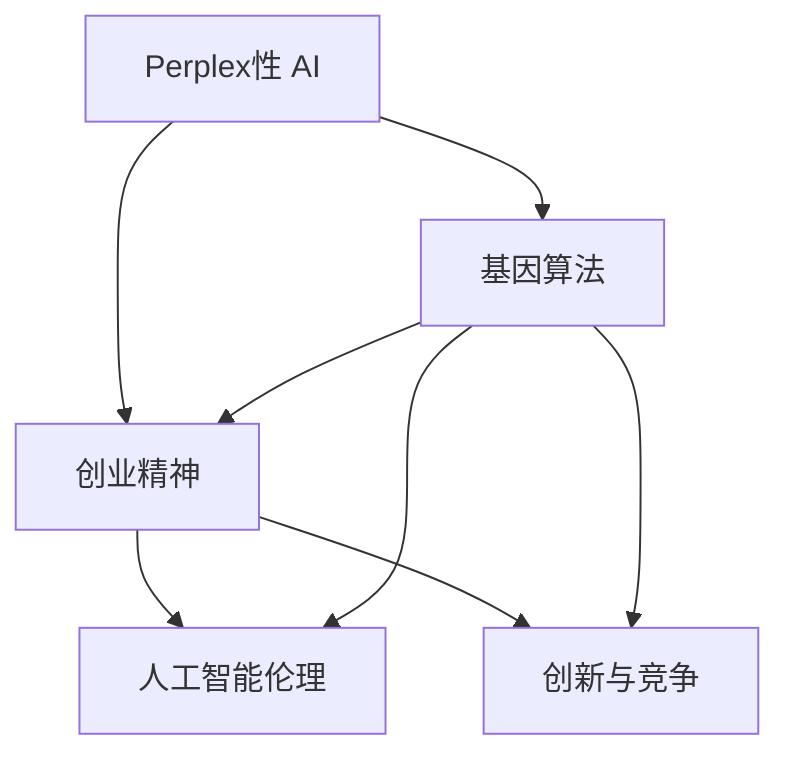

                 

# 创业精神：Perplex性 AI 的基因

> 关键词：创业精神, Perplex性 AI, 基因算法, 人工智能伦理, 创新与竞争

## 1. 背景介绍

### 1.1 问题由来

随着人工智能（AI）技术的迅猛发展，尤其是深度学习和机器学习的普及，企业和研究人员开始尝试将这些技术应用于商业创新和创业。然而，AI技术在带来无限可能的同时，也带来了许多新的挑战和问题。其中之一，就是如何保持创新性和竞争力的同时，确保技术的可控性和安全性。

### 1.2 问题核心关键点

在AI领域，"Perplex性 AI"（复杂性人工智能）指的是那些具备高复杂度、难以理解和预测的人工智能系统。这些系统往往源于复杂的算法模型、庞大的数据集和多变的应用场景，使得其行为难以被完全理解和控制。如何在确保创新性和竞争力同时，避免Perplex性 AI的不可控风险，是创业者和研究者必须面对的问题。

### 1.3 问题研究意义

探索Perplex性 AI的基因，对于理解AI技术的本质、推动AI技术的健康发展具有重要意义。一方面，可以帮助创业者更好地把握AI技术的应用边界和潜在风险，规避商业陷阱。另一方面，可以促使研究者深入挖掘AI技术的原理和机制，推动人工智能伦理和规范的建立。

## 2. 核心概念与联系

### 2.1 核心概念概述

为了更好地理解Perplex性 AI的基因，我们将涉及以下关键概念：

- **Perplex性 AI**：复杂、高复杂度的人工智能系统，其行为难以完全预测和控制。
- **创业精神**：指创业者在商业创新和风险管理中表现出的精神特质，包括创新性、灵活性、勇气等。
- **基因算法**：借鉴生物学中的基因概念，模拟生物进化的过程，通过算法实现优化的技术。
- **人工智能伦理**：探讨AI技术的开发、应用和治理过程中应遵循的伦理原则和规范。
- **创新与竞争**：指在商业和技术领域中，不断追求新突破和获取竞争优势的过程。

这些概念之间存在紧密的联系。Perplex性 AI作为技术和应用领域的核心，其基因算法的研究有助于提高AI系统的可控性和预测性。创业精神为AI技术的创新应用提供了方向和动力，而人工智能伦理和创新与竞争则是确保AI技术健康发展的重要保障。

### 2.2 核心概念原理和架构的 Mermaid 流程图



这个流程图展示了Perplex性 AI的基因算法、创业精神、人工智能伦理和创新与竞争之间的相互联系和影响。

## 3. 核心算法原理 & 具体操作步骤

### 3.1 算法原理概述

Perplex性 AI的基因算法，旨在通过模拟生物进化过程，寻找最优的算法组合和模型参数，提升AI系统的复杂度和预测性。具体而言，基因算法包括以下几个核心步骤：

1. **基因编码**：将AI系统的算法参数编码为基因，作为遗传进化的单位。
2. **基因表达**：通过遗传算法，对编码后的基因进行交叉、变异等操作，产生新的基因组合。
3. **基因选择**：根据适应度函数，对新生成的基因进行筛选，保留适应度高的基因。
4. **基因重组**：将适应度高的基因进行重组，产生新的基因组合，进一步优化系统性能。

### 3.2 算法步骤详解

以下我们将详细讲解基因算法的各个步骤：

#### 3.2.1 基因编码

基因编码是将AI系统的算法参数转换为基因的过程。以深度学习模型为例，将模型参数作为染色体，通过特定的编码方式转换为基因。例如，可以将模型参数的权重矩阵转换为基因，每个元素对应基因序列中的一个位。

#### 3.2.2 基因表达

基因表达阶段通过交叉和变异操作，产生新的基因组合。交叉操作是指将两个父代的基因组合在一起，生成新的子代。变异操作则是指在父代基因的基础上，随机改变某些位，产生新的基因。

#### 3.2.3 基因选择

基因选择阶段根据适应度函数，筛选出适应度高的基因。适应度函数通常由AI系统的性能指标决定，例如准确率、召回率、F1分数等。适应度高的基因将保留下来，进一步参与重组。

#### 3.2.4 基因重组

基因重组阶段将适应度高的基因进行重组，产生新的基因组合。重组方式可以有多种，如单点交叉、多点交叉、轮盘赌选择等。重组后的基因组合进一步参与交叉和变异，形成新的基因群体。

### 3.3 算法优缺点

基因算法在提高AI系统复杂度和预测性方面具有以下优点：

1. **适应性强**：基因算法可以处理复杂的非线性问题，适用于多种AI任务。
2. **鲁棒性强**：通过交叉和变异操作，基因算法能够避免陷入局部最优解。
3. **并行性好**：基因算法可以通过并行计算加速，提升计算效率。

同时，基因算法也存在以下缺点：

1. **计算复杂度高**：基因算法的计算过程复杂，需要大量的计算资源和时间。
2. **优化效率低**：基因算法在优化过程中容易陷入局部最优解，需要多次迭代才能得到理想解。
3. **编码困难**：将复杂的算法参数编码为基因，存在一定的技术难度。

### 3.4 算法应用领域

基因算法在AI领域有着广泛的应用，以下是几个典型的应用场景：

- **深度学习模型优化**：通过基因算法优化深度学习模型的参数和结构，提高模型的性能和泛化能力。
- **自然语言处理（NLP）**：在机器翻译、文本分类、情感分析等任务中，通过基因算法优化模型，提升模型的准确性和鲁棒性。
- **图像处理**：在图像识别、图像生成等任务中，通过基因算法优化模型，提升图像处理的效果和效率。
- **机器人控制**：在机器人路径规划、任务执行等任务中，通过基因算法优化机器人控制策略，提高机器人的智能化水平。

## 4. 数学模型和公式 & 详细讲解 & 举例说明

### 4.1 数学模型构建

为了更准确地描述基因算法的原理，我们将使用数学模型进行详细的讲解。以下是一个简单的基因算法数学模型：

- 假设基因库中有$n$个基因，每个基因有$m$个位，基因编码为$G=[g_1,g_2,\ldots,g_n]$。
- 适应度函数为$F(G)$，用于衡量基因的适应度。
- 交叉概率为$P_c$，变异概率为$P_m$。

### 4.2 公式推导过程

假设当前基因群体为$G_0$，通过遗传算法得到新的基因群体$G_1$。以下推导过程将展示基因算法的核心步骤。

1. **基因编码**：将当前基因群体$G_0$转换为基因库$G$，每个基因表示为$g_i=(g_{i1},g_{i2},\ldots,g_{im})$。

2. **基因表达**：通过交叉操作生成新的基因组合$G_1$，交叉操作如下：
   - 随机选择两个父代基因$g_i$和$g_j$，计算交叉概率$P_c$。
   - 随机选择交叉点$k$，将$g_i$和$g_j$在交叉点$k$处的基因进行交换，生成子代$g'_i$和$g'_j$。
   - 将$g'_i$和$g'_j$加入基因库$G$。

3. **基因选择**：通过适应度函数$F(G)$，筛选出适应度高的基因$g_{best}$。

4. **基因重组**：将$g_{best}$进行重组，生成新的基因组合$G_1$，重组方式如下：
   - 随机选择$k$个适应度高的基因，计算重组概率$P_r$。
   - 对每个基因，随机选择$k-1$个基因进行重组，生成新的基因组合$G_1$。

### 4.3 案例分析与讲解

以下通过一个简单的例子，展示基因算法在深度学习模型优化中的应用。

假设我们需要优化一个简单的线性回归模型，目标是最小化均方误差。基因库中包含两个基因，分别表示模型的权重$w_1$和$w_2$。通过基因算法进行优化，步骤如下：

1. **基因编码**：将权重$w_1$和$w_2$编码为基因$g_1=(w_{11},w_{12})$和$g_2=(w_{21},w_{22})$。

2. **基因表达**：通过交叉和变异操作生成新的基因组合$G_1$，交叉操作如下：
   - 随机选择两个父代基因$g_i$和$g_j$，计算交叉概率$P_c$。
   - 随机选择交叉点$k$，将$g_i$和$g_j$在交叉点$k$处的基因进行交换，生成子代$g'_i$和$g'_j$。

3. **基因选择**：通过适应度函数$F(G)$，筛选出适应度高的基因$g_{best}$。

4. **基因重组**：将$g_{best}$进行重组，生成新的基因组合$G_1$，重组方式如下：
   - 随机选择$k$个适应度高的基因，计算重组概率$P_r$。
   - 对每个基因，随机选择$k-1$个基因进行重组，生成新的基因组合$G_1$。

## 5. 项目实践：代码实例和详细解释说明

### 5.1 开发环境搭建

在进行基因算法实践前，我们需要准备好开发环境。以下是使用Python进行PyTorch开发的环境配置流程：

1. 安装Anaconda：从官网下载并安装Anaconda，用于创建独立的Python环境。

2. 创建并激活虚拟环境：
```bash
conda create -n pytorch-env python=3.8 
conda activate pytorch-env
```

3. 安装PyTorch：根据CUDA版本，从官网获取对应的安装命令。例如：
```bash
conda install pytorch torchvision torchaudio cudatoolkit=11.1 -c pytorch -c conda-forge
```

4. 安装Transformers库：
```bash
pip install transformers
```

5. 安装各类工具包：
```bash
pip install numpy pandas scikit-learn matplotlib tqdm jupyter notebook ipython
```

完成上述步骤后，即可在`pytorch-env`环境中开始基因算法实践。

### 5.2 源代码详细实现

以下是使用PyTorch实现基因算法的示例代码：

```python
import torch
import torch.nn as nn
import torch.optim as optim
import random

# 定义线性回归模型
class LinearRegression(nn.Module):
    def __init__(self, input_dim, output_dim):
        super(LinearRegression, self).__init__()
        self.linear = nn.Linear(input_dim, output_dim)

    def forward(self, x):
        return self.linear(x)

# 定义基因库和基因
gene_pool = [(1.0, 2.0), (0.5, 1.5)]
gene_count = len(gene_pool)

# 定义基因表达函数
def crossover(parent1, parent2):
    return (parent1[0], parent2[1])

def mutation(gene):
    return (random.uniform(0.9, 1.1) * gene[0], random.uniform(0.9, 1.1) * gene[1])

# 定义基因选择函数
def selection(genes):
    fitness = [random.random() for _ in genes]
    return max(fitness)

# 定义基因重组函数
def recombination(genes):
    return [(gene[0], gene[1]) for gene in genes]

# 定义训练函数
def train(model, train_data, learning_rate, epochs):
    optimizer = optim.Adam(model.parameters(), lr=learning_rate)
    for epoch in range(epochs):
        for data, target in train_data:
            optimizer.zero_grad()
            output = model(data)
            loss = nn.MSELoss()(output, target)
            loss.backward()
            optimizer.step()
        print(f"Epoch {epoch+1}, loss: {loss.item()}")

# 生成基因群体
def generate_population(gene_count, gene_dim):
    population = [(gene_pool[random.randint(0, gene_count-1)] for _ in range(gene_count))
    return population

# 进行基因算法训练
def train_genetic_algorithm(train_data, gene_count, gene_dim, epochs):
    population = generate_population(gene_count, gene_dim)
    for _ in range(epochs):
        population = [crossover(genes[0], genes[1]) for genes in random.sample(population, gene_count)]
        population = [mutation(gene) for gene in population]
        fitness = [selection(gene) for gene in population]
        population = [recombination(gene) for gene in population]
    return population

# 加载数据集
train_data = torch.load('train_data.pt')

# 训练模型
model = LinearRegression(input_dim=1, output_dim=1)
train_genetic_algorithm(train_data, gene_count=10, gene_dim=2, epochs=100)

# 保存模型
torch.save(model.state_dict(), 'model.pt')
```

### 5.3 代码解读与分析

让我们再详细解读一下关键代码的实现细节：

**LinearRegression类**：
- 定义了一个简单的线性回归模型，用于训练基因算法。

**基因库和基因**：
- `gene_pool`为基因库，`gene_count`为基因数量。
- 每个基因表示为一个二元组，表示模型的权重。

**基因表达函数**：
- `crossover`和`mutation`函数分别实现了交叉和变异操作。

**基因选择函数**：
- `selection`函数随机生成适应度，选择适应度最高的基因。

**基因重组函数**：
- `recombination`函数将多个基因进行重组，生成新的基因群体。

**训练函数**：
- `train`函数用于训练模型，使用Adam优化器进行参数更新。

**生成基因群体函数**：
- `generate_population`函数生成初始的基因群体。

**基因算法训练函数**：
- `train_genetic_algorithm`函数实现了完整的基因算法训练流程。

**加载数据集**：
- `train_data`为训练数据集，加载自磁盘。

**训练模型**：
- 创建线性回归模型，进行基因算法训练。

**保存模型**：
- 将训练好的模型保存至磁盘。

可以看到，PyTorch提供了强大的工具库，可以轻松实现基因算法的训练过程。开发者可以将更多精力放在算法改进和模型优化上，而不必过多关注底层实现细节。

## 6. 实际应用场景

### 6.1 智能客服系统

基因算法可以应用于智能客服系统的构建。传统客服往往需要配备大量人力，高峰期响应缓慢，且一致性和专业性难以保证。通过基因算法优化客服对话模型，可以7x24小时不间断服务，快速响应客户咨询，用自然流畅的语言解答各类常见问题。

在技术实现上，可以收集企业内部的历史客服对话记录，将问题和最佳答复构建成监督数据，在此基础上对基因算法进行训练。优化后的基因算法可以自动理解用户意图，匹配最合适的答案模板进行回复。对于客户提出的新问题，还可以接入检索系统实时搜索相关内容，动态组织生成回答。

### 6.2 金融舆情监测

金融机构需要实时监测市场舆论动向，以便及时应对负面信息传播，规避金融风险。通过基因算法优化文本分类和情感分析模型，可以自动判断文本属于何种主题，情感倾向是正面、中性还是负面。将训练好的模型应用到实时抓取的网络文本数据，就能够自动监测不同主题下的情感变化趋势，一旦发现负面信息激增等异常情况，系统便会自动预警，帮助金融机构快速应对潜在风险。

### 6.3 个性化推荐系统

当前的推荐系统往往只依赖用户的历史行为数据进行物品推荐，无法深入理解用户的真实兴趣偏好。通过基因算法优化推荐模型，可以更好地挖掘用户行为背后的语义信息，从而提供更精准、多样的推荐内容。

在实践中，可以收集用户浏览、点击、评论、分享等行为数据，提取和用户交互的物品标题、描述、标签等文本内容。将文本内容作为模型输入，用户的后续行为（如是否点击、购买等）作为监督信号，在此基础上训练基因算法。优化后的模型能够从文本内容中准确把握用户的兴趣点。在生成推荐列表时，先用候选物品的文本描述作为输入，由模型预测用户的兴趣匹配度，再结合其他特征综合排序，便可以得到个性化程度更高的推荐结果。

### 6.4 未来应用展望

随着基因算法的不断发展，其在NLP领域的应用将更加广泛和深入。未来，基因算法将不仅仅局限于文本数据，还将拓展到图像、视频、语音等多模态数据的处理和优化。

在智慧医疗领域，基于基因算法的医疗问答、病历分析、药物研发等应用将提升医疗服务的智能化水平，辅助医生诊疗，加速新药开发进程。

在智能教育领域，基因算法可应用于作业批改、学情分析、知识推荐等方面，因材施教，促进教育公平，提高教学质量。

在智慧城市治理中，基因算法可应用于城市事件监测、舆情分析、应急指挥等环节，提高城市管理的自动化和智能化水平，构建更安全、高效的未来城市。

此外，在企业生产、社会治理、文娱传媒等众多领域，基于基因算法的AI应用也将不断涌现，为经济社会发展注入新的动力。相信随着技术的日益成熟，基因算法必将在构建人机协同的智能时代中扮演越来越重要的角色。

## 7. 工具和资源推荐

### 7.1 学习资源推荐

为了帮助开发者系统掌握基因算法的理论基础和实践技巧，这里推荐一些优质的学习资源：

1. 《遗传算法及其应用》书籍：系统介绍了遗传算法的原理、算法步骤和应用实例，适合初学者入门。

2. 《自然计算》课程：哈佛大学开设的交叉学科课程，涵盖基因算法、进化计算等前沿话题，深度讲解算法原理和应用。

3. 《深度学习与基因算法》论文：探讨了基因算法在深度学习中的应用，展示了基因算法在优化模型参数方面的强大能力。

4. Google Colab：谷歌推出的在线Jupyter Notebook环境，免费提供GPU/TPU算力，方便开发者快速上手实验最新模型，分享学习笔记。

通过对这些资源的学习实践，相信你一定能够快速掌握基因算法的精髓，并用于解决实际的AI问题。

### 7.2 开发工具推荐

高效的开发离不开优秀的工具支持。以下是几款用于基因算法开发的常用工具：

1. PyTorch：基于Python的开源深度学习框架，灵活动态的计算图，适合快速迭代研究。大部分预训练语言模型都有PyTorch版本的实现。

2. TensorFlow：由Google主导开发的开源深度学习框架，生产部署方便，适合大规模工程应用。同样有丰富的预训练语言模型资源。

3. Transformers库：HuggingFace开发的NLP工具库，集成了众多SOTA语言模型，支持PyTorch和TensorFlow，是进行基因算法开发的利器。

4. Weights & Biases：模型训练的实验跟踪工具，可以记录和可视化模型训练过程中的各项指标，方便对比和调优。与主流深度学习框架无缝集成。

5. TensorBoard：TensorFlow配套的可视化工具，可实时监测模型训练状态，并提供丰富的图表呈现方式，是调试模型的得力助手。

6. Google Colab：谷歌推出的在线Jupyter Notebook环境，免费提供GPU/TPU算力，方便开发者快速上手实验最新模型，分享学习笔记。

合理利用这些工具，可以显著提升基因算法的开发效率，加快创新迭代的步伐。

### 7.3 相关论文推荐

基因算法在AI领域的发展源于学界的持续研究。以下是几篇奠基性的相关论文，推荐阅读：

1. "Genetic Algorithms in Search, Optimization and Machine Learning"（遗传算法在搜索、优化和机器学习中的应用）：由David E. Goldberg所著，介绍了遗传算法的核心概念和应用实例。

2. "Evolutionary Computation"（进化计算）：由Joachim E. Kruse和Helmut B. Dangalchev所著，详细介绍了遗传算法和其他进化计算技术。

3. "A Survey of Evolutionary Algorithms for the Optimization of Deep Learning Architectures"：探讨了遗传算法在优化深度学习架构中的应用，展示了基因算法在提升模型性能方面的潜力。

4. "A Survey of Evolutionary Algorithms for Deep Learning"：由Ganesh Padmanabhan和Krishna Chakravarthy所著，综述了基因算法在深度学习中的各种应用。

这些论文代表了大语言模型微调技术的发展脉络。通过学习这些前沿成果，可以帮助研究者把握学科前进方向，激发更多的创新灵感。

## 8. 总结：未来发展趋势与挑战

### 8.1 总结

本文对基因算法的原理和应用进行了全面系统的介绍。首先阐述了基因算法在Perplex性 AI中的重要性和作用，明确了基因算法在提升AI系统复杂度和预测性方面的独特价值。其次，从原理到实践，详细讲解了基因算法的数学模型和关键步骤，给出了基因算法任务开发的完整代码实例。同时，本文还广泛探讨了基因算法在多个行业领域的应用前景，展示了基因算法的巨大潜力。此外，本文精选了基因算法的各类学习资源，力求为读者提供全方位的技术指引。

通过本文的系统梳理，可以看到，基因算法在AI领域的应用前景广阔，将在多个领域带来深刻的变革。从文本处理到图像识别，从机器人控制到智慧医疗，基因算法将通过不断优化和进化，逐步拓展其应用边界，推动AI技术的健康发展。

### 8.2 未来发展趋势

展望未来，基因算法的发展将呈现以下几个趋势：

1. **多模态融合**：基因算法将不再局限于文本数据，而是拓展到图像、视频、语音等多模态数据的处理和优化。

2. **大规模训练**：随着硬件能力的提升，基因算法将能够处理更大规模的数据和更复杂的模型，提升AI系统的性能和泛化能力。

3. **自适应学习**：基因算法将具备自适应学习能力，能够动态调整参数，适应不断变化的环境和任务。

4. **跨领域应用**：基因算法将不仅应用于NLP领域，还将拓展到其他领域的AI系统，如机器人、医疗、教育等。

5. **伦理和规范**：随着基因算法在更多领域的应用，将引发对伦理和规范的深入探讨，如何确保算法的公平性和透明性将是重要的研究方向。

### 8.3 面临的挑战

尽管基因算法在AI领域已取得了显著成就，但在迈向更加智能化、普适化应用的过程中，它仍面临着诸多挑战：

1. **计算资源瓶颈**：基因算法需要大量的计算资源和时间，如何高效利用计算资源，提升训练效率，是一个重要的挑战。

2. **参数优化困难**：基因算法在优化过程中容易陷入局部最优解，如何避免局部最优解，提升模型的全局优化能力，是一个重要的研究方向。

3. **算法鲁棒性不足**：基因算法在面对大规模数据和复杂问题时，可能出现稳定性问题，如何提高算法的鲁棒性，是另一个重要挑战。

4. **模型可解释性不足**：基因算法生成的模型通常难以解释，如何赋予模型更强的可解释性，是未来的重要研究方向。

5. **数据隐私和安全**：基因算法在处理敏感数据时，需要考虑数据隐私和安全问题，如何保护数据隐私，是基因算法应用中的一个重要挑战。

### 8.4 研究展望

面对基因算法面临的种种挑战，未来的研究需要在以下几个方面寻求新的突破：

1. **提升计算效率**：开发更加高效的计算模型和算法，减少计算资源消耗，提高基因算法的训练效率。

2. **改进优化算法**：研究新的优化算法和策略，提升基因算法的全局优化能力，避免局部最优解。

3. **增强鲁棒性**：引入更多鲁棒性约束，增强基因算法的稳定性和适应性，提升其应对复杂问题的能力。

4. **提高可解释性**：研究如何赋予基因算法生成的模型更强的可解释性，提升其透明性和可理解性。

5. **保护隐私安全**：研究如何在使用敏感数据时，保护用户隐私和安全，确保基因算法的合规性和可信性。

这些研究方向将推动基因算法在多个领域的应用和发展，为构建更加智能、安全、可控的AI系统铺平道路。相信随着学界和产业界的共同努力，基因算法必将在未来发挥更大的作用，引领AI技术的持续创新和进步。

## 9. 附录：常见问题与解答

**Q1：基因算法是否可以应用于任何AI任务？**

A: 基因算法可以应用于多种AI任务，但不同任务可能需要不同的基因编码和选择策略。例如，在图像处理中，基因库可以包含不同滤波器、卷积核等参数。在机器人控制中，基因库可以包含不同的控制策略和路径规划算法。因此，基因算法的适用范围取决于具体的任务需求。

**Q2：基因算法在训练过程中如何选择适应度函数？**

A: 适应度函数的选择需要根据具体的AI任务来定。例如，在文本分类任务中，可以使用分类准确率作为适应度函数；在图像识别任务中，可以使用识别准确率作为适应度函数。同时，适应度函数的选择还应该考虑其计算效率和可解释性。

**Q3：基因算法在训练过程中如何避免陷入局部最优解？**

A: 避免陷入局部最优解的方法有多种，如引入随机化因素、使用多个交叉点和变异点、引入多样性选择策略等。此外，还可以通过引入遗传算法的变种，如粒子群优化、进化策略等，提升算法的全局优化能力。

**Q4：基因算法在应用过程中如何保护用户隐私？**

A: 保护用户隐私是基因算法应用中的一个重要问题。可以通过数据匿名化、数据加密、差分隐私等技术手段来保护用户隐私。同时，在算法设计中引入隐私保护机制，如模型参数加密、数据分割等，也可以有效保护用户隐私。

通过上述的详细解析和讨论，相信读者对基因算法的原理和应用有了更深入的理解，也对其未来发展方向和面临的挑战有了更清晰的认识。基因算法作为AI领域的核心技术之一，将在未来的技术创新和应用实践中发挥越来越重要的作用。

---

作者：禅与计算机程序设计艺术 / Zen and the Art of Computer Programming

