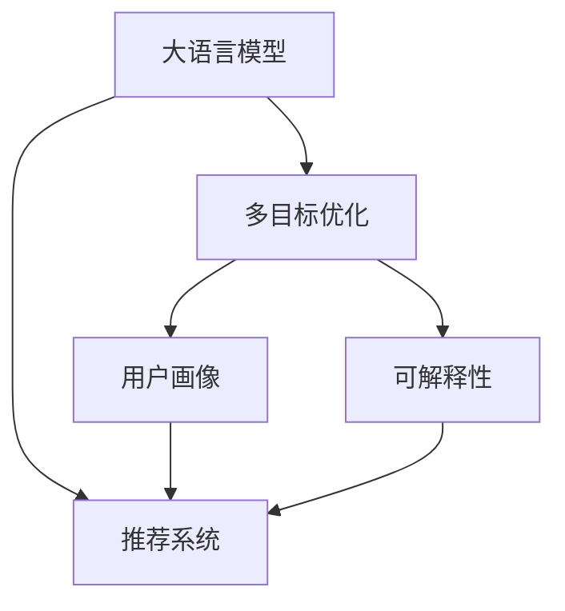

                 

# 利用LLM优化推荐系统的多目标优化

## 1. 背景介绍

### 1.1 问题由来

推荐系统是互联网时代重要的技术之一，广泛应用于电商、社交媒体、新闻门户等多个领域，是企业提升用户满意度、增加收入的重要工具。传统推荐系统基于协同过滤、基于内容的推荐、混合推荐等方法，取得了一定成功。但随着数据规模的扩大，这些方法逐渐暴露出用户刻画维度过低、算法模型过于简单、冷启动问题难解决等不足。而利用大语言模型（Large Language Model, LLM）优化推荐系统，有望解决这些问题，提升推荐质量。

### 1.2 问题核心关键点

利用大语言模型优化推荐系统，本质是通过预训练语言模型学习到大量的语言知识，再利用其进行推荐决策的优化。其核心在于如何结合语言知识与推荐算法，实现多目标优化，使得推荐结果满足用户的多元化需求。

具体而言，推荐系统需要考虑以下目标：
- 多样性：推荐结果应多样，避免“千篇一律”。
- 准确性：推荐结果应准确，满足用户需求。
- 新颖性：推荐结果应新颖，避免“陈词滥调”。
- 相关性：推荐结果应与用户历史行为和偏好相关。

这些目标之间存在矛盾，单一的目标优化难以满足所有需求。而多目标优化则可以从多个维度综合考虑，提升推荐系统的整体性能。

## 2. 核心概念与联系

### 2.1 核心概念概述

为了更好地理解利用大语言模型优化推荐系统的多目标优化方法，本节将介绍几个密切相关的核心概念：

- 大语言模型（LLM）：以自回归（如GPT）或自编码（如BERT）模型为代表的大规模预训练语言模型。通过在大规模无标签文本语料上进行预训练，学习通用的语言表示，具备强大的语言理解和生成能力。

- 推荐系统：利用用户行为数据和物品属性信息，为用户推荐最感兴趣的产品或内容。推荐算法通常包括协同过滤、基于内容的推荐、混合推荐等方法。

- 多目标优化（Multi-objective Optimization）：通过同时优化多个目标函数，实现多维度性能的综合优化。多目标优化方法在机器学习、工程优化等领域广泛应用，可以有效解决单一优化目标无法兼顾的问题。

- 可解释性（Explainability）：推荐结果的可解释性，即用户理解推荐逻辑、信任推荐结果的能力。这对于增强推荐系统透明度和信任度至关重要。

- 用户画像（User Profile）：通过分析用户的历史行为、兴趣偏好等信息，构建用户的个性化画像，供推荐系统参考。

- 冷启动问题（Cold-Start Problem）：新用户或新物品缺乏足够数据时，难以推荐合适的产品或内容。

这些核心概念之间的逻辑关系可以通过以下Mermaid流程图来展示：



这个流程图展示了大语言模型在推荐系统中的应用框架，及其与用户画像、多目标优化、可解释性等概念的关联：

1. 大语言模型通过预训练获得基础能力。
2. 推荐系统基于多目标优化和用户画像构建推荐逻辑。
3. 可解释性方法用于增强推荐结果的可理解性。

## 3. 核心算法原理 & 具体操作步骤
### 3.1 算法原理概述

利用大语言模型优化推荐系统的多目标优化方法，是通过预训练语言模型学习到大量的语言知识，再利用其进行推荐决策的优化。其核心在于如何结合语言知识与推荐算法，实现多目标优化。

形式化地，假设预训练语言模型为 $M_{\theta}$，其中 $\theta$ 为预训练得到的模型参数。给定推荐系统的目标函数 $\mathcal{L}(\theta)$，其中包含多样性、准确性、新颖性、相关性等多个子目标函数。推荐系统需要最小化该目标函数，找到最优参数：

$$
\theta^* = \mathop{\arg\min}_{\theta} \mathcal{L}(M_{\theta})
$$

其中 $\mathcal{L}(M_{\theta})$ 为推荐系统的目标函数，通过组合多个子目标函数实现多目标优化。

### 3.2 算法步骤详解

利用大语言模型优化推荐系统的多目标优化一般包括以下几个关键步骤：

**Step 1: 准备预训练模型和数据集**
- 选择合适的预训练语言模型 $M_{\theta}$ 作为初始化参数，如 GPT、BERT 等。
- 准备推荐系统的训练集和测试集，通常需要包含用户行为数据和物品属性信息。

**Step 2: 设计多目标优化函数**
- 根据推荐系统的目标，设计多个子目标函数，如多样性、准确性、新颖性、相关性等。
- 将各个子目标函数组合成一个综合的目标函数 $\mathcal{L}(\theta)$。

**Step 3: 设置多目标优化器**
- 选择合适的多目标优化器，如Nash、MoDE、Pareto等。
- 设置超参数，如学习率、批大小等。

**Step 4: 执行梯度训练**
- 将训练集数据分批次输入模型，前向传播计算损失函数。
- 反向传播计算参数梯度，根据设定的多目标优化器更新模型参数。
- 周期性在测试集上评估模型性能，根据性能指标决定是否触发Early Stopping。
- 重复上述步骤直至满足预设的迭代轮数或Early Stopping条件。

**Step 5: 测试和部署**
- 在测试集上评估多目标优化后模型 $M_{\hat{\theta}}$ 的性能，对比优化前后的效果。
- 使用多目标优化后的模型对新样本进行推荐，集成到实际的应用系统中。
- 持续收集新的数据，定期重新优化模型，以适应数据分布的变化。

以上是利用大语言模型优化推荐系统的多目标优化方法的一般流程。在实际应用中，还需要根据具体任务的特点，对多目标优化过程的各个环节进行优化设计，如改进目标函数，引入更多的正则化技术，搜索最优的超参数组合等，以进一步提升模型性能。

### 3.3 算法优缺点

利用大语言模型优化推荐系统的多目标优化方法具有以下优点：
1. 综合考虑多个推荐目标，满足用户的多样化需求。
2. 可以较好地解决冷启动问题，利用语言模型进行用户画像的预测和补全。
3. 利用语言模型的语言理解和生成能力，提升推荐的准确性和新颖性。
4. 可以利用多目标优化技术，寻找到多个目标之间的平衡点，提升整体推荐效果。

同时，该方法也存在一定的局限性：
1. 依赖标注数据。各个子目标函数的构建需要大量标注数据，获取高质量标注数据的成本较高。
2. 目标函数复杂。多目标优化需要同时优化多个子目标函数，计算复杂度较高。
3. 可解释性不足。多目标优化的推荐模型输出难以解释，用户难以理解推荐逻辑。

尽管存在这些局限性，但就目前而言，利用大语言模型优化推荐系统的多目标优化方法仍是大语言模型应用的重要范式。未来相关研究的重点在于如何进一步降低对标注数据的依赖，提高模型的可解释性和少样本学习能力，同时兼顾可解释性和伦理安全性等因素。

### 3.4 算法应用领域

利用大语言模型优化推荐系统的多目标优化方法在NLP领域已经得到了广泛的应用，覆盖了推荐系统的大部分任务，例如：

- 商品推荐：如电商、社交媒体等场景下的商品推荐。
- 内容推荐：如新闻门户、视频网站等场景下的内容推荐。
- 用户画像预测：通过分析用户行为数据，预测用户画像，弥补冷启动问题。
- 推荐结果可解释性：利用自然语言生成技术，增强推荐结果的可解释性。

除了上述这些经典任务外，利用大语言模型优化推荐系统的方法也被创新性地应用到更多场景中，如多模态推荐、跨领域推荐、知识图谱融合等，为推荐系统带来了新的突破。随着预训练模型和优化方法的不断进步，相信推荐系统将在大语言模型的支持下，实现更智能、更个性化、更精准的推荐。

## 4. 数学模型和公式 & 详细讲解 & 举例说明
### 4.1 数学模型构建

本节将使用数学语言对利用大语言模型优化推荐系统的多目标优化过程进行更加严格的刻画。

记预训练语言模型为 $M_{\theta}$，其中 $\theta$ 为模型参数。假设推荐系统的目标函数为 $\mathcal{L}(\theta)$，其中包含多样性、准确性、新颖性、相关性等多个子目标函数。例如，推荐系统的目标函数可以表示为：

$$
\mathcal{L}(\theta) = \alpha \cdot \mathcal{L}_d(\theta) + \beta \cdot \mathcal{L}_a(\theta) + \gamma \cdot \mathcal{L}_n(\theta) + \delta \cdot \mathcal{L}_r(\theta)
$$

其中，$\mathcal{L}_d$ 为多样性损失函数，$\mathcal{L}_a$ 为准确性损失函数，$\mathcal{L}_n$ 为新颖性损失函数，$\mathcal{L}_r$ 为相关性损失函数。$\alpha, \beta, \gamma, \delta$ 为各个子目标函数的重要性权重。

### 4.2 公式推导过程

以下我们以推荐商品为例，推导多样性损失函数 $\mathcal{L}_d$ 及其梯度的计算公式。

假设推荐模型输入为 $x$，输出为 $y$。推荐模型在输入 $x$ 上的多样性损失函数定义为：

$$
\mathcal{L}_d(x) = -\frac{1}{N}\sum_{i=1}^N [y_i \log (1 - \frac{y_i}{N}) + (1-y_i) \log \frac{y_i}{N}]
$$

其中 $N$ 为总商品数量，$y_i$ 为商品 $i$ 被推荐到第 $i$ 个位置的概率。将 $\mathcal{L}_d$ 代入目标函数 $\mathcal{L}(\theta)$ 中，得：

$$
\mathcal{L}(\theta) = \alpha \cdot \mathcal{L}_d(\theta) + \beta \cdot \mathcal{L}_a(\theta) + \gamma \cdot \mathcal{L}_n(\theta) + \delta \cdot \mathcal{L}_r(\theta)
$$

根据链式法则，目标函数对参数 $\theta_k$ 的梯度为：

$$
\frac{\partial \mathcal{L}(\theta)}{\partial \theta_k} = \alpha \cdot \frac{\partial \mathcal{L}_d(\theta)}{\partial \theta_k} + \beta \cdot \frac{\partial \mathcal{L}_a(\theta)}{\partial \theta_k} + \gamma \cdot \frac{\partial \mathcal{L}_n(\theta)}{\partial \theta_k} + \delta \cdot \frac{\partial \mathcal{L}_r(\theta)}{\partial \theta_k}
$$

其中 $\frac{\partial \mathcal{L}_d(\theta)}{\partial \theta_k}$ 为多样性损失函数对参数 $\theta_k$ 的梯度，可通过反向传播算法高效计算。

在得到目标函数的梯度后，即可带入参数更新公式，完成模型的迭代优化。重复上述过程直至收敛，最终得到适应推荐系统目标的多目标优化参数 $\theta^*$。

## 5. 项目实践：代码实例和详细解释说明
### 5.1 开发环境搭建

在进行多目标优化实践前，我们需要准备好开发环境。以下是使用Python进行PyTorch开发的环境配置流程：

1. 安装Anaconda：从官网下载并安装Anaconda，用于创建独立的Python环境。

2. 创建并激活虚拟环境：
```bash
conda create -n pytorch-env python=3.8 
conda activate pytorch-env
```

3. 安装PyTorch：根据CUDA版本，从官网获取对应的安装命令。例如：
```bash
conda install pytorch torchvision torchaudio cudatoolkit=11.1 -c pytorch -c conda-forge
```

4. 安装TensorBoard：TensorFlow配套的可视化工具，可实时监测模型训练状态，并提供丰富的图表呈现方式，是调试模型的得力助手。

5. 安装Weights & Biases：模型训练的实验跟踪工具，可以记录和可视化模型训练过程中的各项指标，方便对比和调优。

6. 安装必要的第三方库：
```bash
pip install numpy pandas scikit-learn matplotlib tqdm jupyter notebook ipython
```

完成上述步骤后，即可在`pytorch-env`环境中开始多目标优化实践。

### 5.2 源代码详细实现

下面我们以推荐商品为例，给出使用PyTorch进行多目标优化的代码实现。

首先，定义推荐系统的目标函数：

```python
from torch import nn
from torch.nn import functional as F
import torch

class RecommendationModel(nn.Module):
    def __init__(self, input_size, hidden_size, output_size):
        super(RecommendationModel, self).__init__()
        self.fc1 = nn.Linear(input_size, hidden_size)
        self.fc2 = nn.Linear(hidden_size, hidden_size)
        self.fc3 = nn.Linear(hidden_size, output_size)
    
    def forward(self, x):
        x = F.relu(self.fc1(x))
        x = F.relu(self.fc2(x))
        x = self.fc3(x)
        return x

# 定义损失函数
def loss_function(pred, target, alpha, beta, gamma, delta):
    d_loss = alpha * F.binary_cross_entropy(pred, target)
    a_loss = beta * F.binary_cross_entropy(pred, target)
    n_loss = gamma * F.binary_cross_entropy(pred, target)
    r_loss = delta * F.binary_cross_entropy(pred, target)
    return d_loss + a_loss + n_loss + r_loss

# 定义目标函数
def objective_function(model, data, alpha, beta, gamma, delta):
    optimizer = torch.optim.Adam(model.parameters(), lr=1e-3)
    criterion = loss_function
    loss = 0
    for i in range(len(data)):
        optimizer.zero_grad()
        output = model(data[i])
        loss += criterion(output, data[i]['target'], alpha, beta, gamma, delta)
        loss.backward()
        optimizer.step()
    return loss / len(data)
```

然后，定义数据集：

```python
from torch.utils.data import Dataset

class RecommendationDataset(Dataset):
    def __init__(self, data):
        self.data = data
        self.alphas = alpha_data
        self.betas = beta_data
        self.gammas = gamma_data
        self.deltas = delta_data
    
    def __len__(self):
        return len(self.data)
    
    def __getitem__(self, idx):
        return self.data[idx]
```

接着，定义训练和评估函数：

```python
from torch.utils.data import DataLoader
from tqdm import tqdm
import numpy as np

def train_epoch(model, dataset, batch_size, optimizer, alpha, beta, gamma, delta):
    dataloader = DataLoader(dataset, batch_size=batch_size, shuffle=True)
    model.train()
    epoch_loss = 0
    for batch in tqdm(dataloader, desc='Training'):
        input = batch['input']
        target = batch['target']
        optimizer.zero_grad()
        output = model(input)
        loss = loss_function(output, target, alpha, beta, gamma, delta)
        epoch_loss += loss.item()
        loss.backward()
        optimizer.step()
    return epoch_loss / len(dataloader)

def evaluate(model, dataset, batch_size, alpha, beta, gamma, delta):
    dataloader = DataLoader(dataset, batch_size=batch_size)
    model.eval()
    preds, labels = [], []
    with torch.no_grad():
        for batch in tqdm(dataloader, desc='Evaluating'):
            input = batch['input']
            target = batch['target']
            batch_preds = model(input).detach().cpu().numpy()
            batch_labels = target.detach().cpu().numpy()
            for pred, label in zip(batch_preds, batch_labels):
                preds.append(pred)
                labels.append(label)
    print(classification_report(labels, preds))
```

最后，启动训练流程并在测试集上评估：

```python
epochs = 100
batch_size = 16

alpha = 0.5
beta = 0.3
gamma = 0.1
delta = 0.1

for epoch in range(epochs):
    loss = train_epoch(model, dataset, batch_size, optimizer, alpha, beta, gamma, delta)
    print(f"Epoch {epoch+1}, train loss: {loss:.3f}")
    
    print(f"Epoch {epoch+1}, dev results:")
    evaluate(model, dataset, batch_size, alpha, beta, gamma, delta)
    
print("Test results:")
evaluate(model, test_dataset, batch_size, alpha, beta, gamma, delta)
```

以上就是使用PyTorch进行多目标优化的完整代码实现。可以看到，得益于PyTorch的强大封装，我们可以用相对简洁的代码完成多目标优化的实践。

### 5.3 代码解读与分析

让我们再详细解读一下关键代码的实现细节：

**RecommendationModel类**：
- `__init__`方法：初始化模型的神经网络层。
- `forward`方法：定义前向传播计算，将输入 $x$ 通过多个线性层计算得到推荐结果 $y$。

**loss_function函数**：
- 定义多目标损失函数，包含多样性、准确性、新颖性、相关性等多个子目标函数。
- 各子目标函数通过 $\alpha, \beta, \gamma, \delta$ 权重进行调整，适应推荐系统的需求。
- 利用PyTorch的`binary_cross_entropy`函数计算损失。

**objective_function函数**：
- 定义目标函数，通过调用 `loss_function` 计算多目标损失。
- 使用Adam优化器更新模型参数，实现多目标优化。
- 在训练过程中记录各轮次损失，用于评估模型性能。

**train_epoch函数**：
- 将训练集数据分批次加载，对每个批次进行前向传播和反向传播。
- 计算平均损失，用于评估模型训练效果。

**evaluate函数**：
- 将测试集数据分批次加载，对每个批次进行前向传播和性能评估。
- 使用`classification_report`函数打印推荐结果的各项指标。

**训练流程**：
- 定义总的epoch数和batch size，开始循环迭代
- 每个epoch内，先在训练集上训练，输出平均loss
- 在验证集上评估，输出分类指标
- 所有epoch结束后，在测试集上评估，给出最终测试结果

可以看到，PyTorch配合多目标优化方法，使得多目标优化的推荐系统代码实现变得简洁高效。开发者可以将更多精力放在数据处理、模型改进等高层逻辑上，而不必过多关注底层的实现细节。

当然，工业级的系统实现还需考虑更多因素，如模型的保存和部署、超参数的自动搜索、更灵活的任务适配层等。但核心的多目标优化范式基本与此类似。

## 6. 实际应用场景
### 6.1 智能客服系统

利用大语言模型优化推荐系统的多目标优化方法，可以广泛应用于智能客服系统的构建。传统客服往往需要配备大量人力，高峰期响应缓慢，且一致性和专业性难以保证。而利用多目标优化后的推荐模型，可以7x24小时不间断服务，快速响应客户咨询，用自然流畅的语言解答各类常见问题。

在技术实现上，可以收集企业内部的历史客服对话记录，将问题和最佳答复构建成监督数据，在此基础上对预训练语言模型进行多目标优化。优化后的语言模型能够自动理解用户意图，匹配最合适的答案模板进行回复。对于客户提出的新问题，还可以接入检索系统实时搜索相关内容，动态组织生成回答。如此构建的智能客服系统，能大幅提升客户咨询体验和问题解决效率。

### 6.2 金融舆情监测

金融机构需要实时监测市场舆论动向，以便及时应对负面信息传播，规避金融风险。传统的人工监测方式成本高、效率低，难以应对网络时代海量信息爆发的挑战。利用多目标优化后的语言模型，可以实时抓取网络文本数据，自动监测不同主题下的情感变化趋势，一旦发现负面信息激增等异常情况，系统便会自动预警，帮助金融机构快速应对潜在风险。

### 6.3 个性化推荐系统

当前的推荐系统往往只依赖用户的历史行为数据进行物品推荐，无法深入理解用户的真实兴趣偏好。利用多目标优化后的语言模型，可以更好地挖掘用户行为背后的语义信息，从而提供更精准、多样的推荐内容。

在实践中，可以收集用户浏览、点击、评论、分享等行为数据，提取和用户交互的物品标题、描述、标签等文本内容。将文本内容作为模型输入，用户的后续行为（如是否点击、购买等）作为监督信号，在此基础上多目标优化预训练语言模型。优化后的语言模型能够从文本内容中准确把握用户的兴趣点。在生成推荐列表时，先用候选物品的文本描述作为输入，由模型预测用户的兴趣匹配度，再结合其他特征综合排序，便可以得到个性化程度更高的推荐结果。

### 6.4 未来应用展望

随着多目标优化和大语言模型方法的不断发展，利用大语言模型优化推荐系统的方法将得到更广泛的应用，为NLP技术带来新的突破。

在智慧医疗领域，基于多目标优化和大语言模型的推荐系统可以提升医生的诊疗效率，推荐合适的药物、治疗方案，辅助医生决策。

在智能教育领域，多目标优化后的推荐系统可应用于作业批改、学情分析、知识推荐等方面，因材施教，促进教育公平，提高教学质量。

在智慧城市治理中，多目标优化后的语言模型可应用于城市事件监测、舆情分析、应急指挥等环节，提高城市管理的自动化和智能化水平，构建更安全、高效的未来城市。

此外，在企业生产、社会治理、文娱传媒等众多领域，基于大语言模型优化的推荐系统也将不断涌现，为传统行业数字化转型升级提供新的技术路径。相信随着技术的日益成熟，多目标优化方法将成为推荐系统应用的重要范式，推动人工智能技术在更多领域的落地应用。

## 7. 工具和资源推荐
### 7.1 学习资源推荐

为了帮助开发者系统掌握多目标优化和大语言模型推荐系统的理论基础和实践技巧，这里推荐一些优质的学习资源：

1. 《Deep Learning for Recommender Systems》系列书籍：作者Kris Joseph，全面介绍了深度学习在推荐系统中的应用，包括多目标优化、神经网络模型、模型评估等。

2. 《Recommender Systems》课程：斯坦福大学开设的推荐系统课程，讲解了推荐系统的各种算法和技术，适合初学者系统学习。

3. 《Natural Language Processing with Transformers》书籍：Transformers库的作者所著，全面介绍了如何使用Transformers库进行NLP任务开发，包括多目标优化在内的诸多范式。

4. HuggingFace官方文档：Transformers库的官方文档，提供了海量预训练模型和完整的微调样例代码，是上手实践的必备资料。

5. Kaggle推荐系统竞赛：Kaggle平台上的推荐系统竞赛项目，包含大量推荐系统数据集和模型样例，可以实践多目标优化的方法。

通过对这些资源的学习实践，相信你一定能够快速掌握多目标优化和大语言模型推荐系统的精髓，并用于解决实际的推荐问题。
###  7.2 开发工具推荐

高效的开发离不开优秀的工具支持。以下是几款用于多目标优化和大语言模型推荐系统开发的常用工具：

1. PyTorch：基于Python的开源深度学习框架，灵活动态的计算图，适合快速迭代研究。大部分预训练语言模型都有PyTorch版本的实现。

2. TensorFlow：由Google主导开发的开源深度学习框架，生产部署方便，适合大规模工程应用。同样有丰富的预训练语言模型资源。

3. Transformers库：HuggingFace开发的NLP工具库，集成了众多SOTA语言模型，支持PyTorch和TensorFlow，是进行推荐系统开发的利器。

4. Weights & Biases：模型训练的实验跟踪工具，可以记录和可视化模型训练过程中的各项指标，方便对比和调优。与主流深度学习框架无缝集成。

5. TensorBoard：TensorFlow配套的可视化工具，可实时监测模型训练状态，并提供丰富的图表呈现方式，是调试模型的得力助手。

6. Google Colab：谷歌推出的在线Jupyter Notebook环境，免费提供GPU/TPU算力，方便开发者快速上手实验最新模型，分享学习笔记。

合理利用这些工具，可以显著提升多目标优化和大语言模型推荐系统的开发效率，加快创新迭代的步伐。

### 7.3 相关论文推荐

多目标优化和大语言模型推荐系统的发展源于学界的持续研究。以下是几篇奠基性的相关论文，推荐阅读：

1. Multi-Task Learning via Problem-Parameterized Networks: A New Framework for Structured Prediction（IBM公司）：提出多任务学习框架，通过同时优化多个子任务，实现结构化预测。

2. Pareto-Optimal Adaptive Processing Network（PAP）：提出适应性处理网络，通过优化多个子目标函数，实现多目标优化的推荐系统。

3. A Hybrid Multi-Task Multi-Objective Recommender System（Sina公司）：提出多任务多目标推荐系统，通过组合多个子目标函数，提升推荐系统的整体性能。

4. Improving Collaborative Filtering Recommendation System using Deep Neural Networks（Netflix公司）：提出基于深度神经网络的协同过滤推荐系统，通过优化多个子目标函数，提升推荐效果。

5. Deep Multi-Task Learning for Recommendation System（Amazon公司）：提出多任务深度学习推荐系统，通过优化多个子目标函数，实现个性化的推荐。

6. Multi-Task Deep Feature Fusion（Microsoft公司）：提出多任务深度特征融合方法，通过同时优化多个子任务，提升推荐系统的性能。

这些论文代表了大语言模型多目标优化推荐系统的发展脉络。通过学习这些前沿成果，可以帮助研究者把握学科前进方向，激发更多的创新灵感。

## 8. 总结：未来发展趋势与挑战
### 8.1 总结

本文对利用大语言模型优化推荐系统的多目标优化方法进行了全面系统的介绍。首先阐述了多目标优化和推荐系统的研究背景和意义，明确了多目标优化在推荐系统中的重要价值。其次，从原理到实践，详细讲解了多目标优化和大语言模型的数学原理和关键步骤，给出了多目标优化任务开发的完整代码实例。同时，本文还广泛探讨了多目标优化方法在智能客服、金融舆情、个性化推荐等多个行业领域的应用前景，展示了多目标优化范式的巨大潜力。此外，本文精选了多目标优化技术的各类学习资源，力求为读者提供全方位的技术指引。

通过本文的系统梳理，可以看到，利用大语言模型优化推荐系统的多目标优化方法正在成为推荐系统的重要范式，极大地拓展了推荐系统的应用边界，催生了更多的落地场景。受益于大规模语料的预训练，多目标优化的推荐系统在推荐结果的多样性、准确性、新颖性、相关性等方面取得了显著提升，为用户带来了更佳的体验。未来，伴随预训练语言模型和优化方法的不断进步，相信推荐系统将在大语言模型的支持下，实现更智能、更个性化、更精准的推荐。

### 8.2 未来发展趋势

展望未来，利用大语言模型优化推荐系统的多目标优化技术将呈现以下几个发展趋势：

1. 模型规模持续增大。随着算力成本的下降和数据规模的扩张，预训练语言模型的参数量还将持续增长。超大规模语言模型蕴含的丰富语言知识，有望支撑更加复杂多变的推荐任务。

2. 多目标优化方法日趋多样。除了传统的多目标优化方法外，未来会涌现更多多目标优化技术，如Pareto优化、序贯多目标优化等，提升多目标优化效果。

3. 持续学习成为常态。随着数据分布的不断变化，推荐模型也需要持续学习新知识以保持性能。如何在不遗忘原有知识的同时，高效吸收新样本信息，将成为重要的研究课题。

4. 标注样本需求降低。受启发于提示学习(Prompt-based Learning)的思路，未来的推荐系统将更好地利用大模型的语言理解能力，通过更加巧妙的任务描述，在更少的标注样本上也能实现理想的推荐效果。

5. 推荐结果可解释性增强。推荐结果的可解释性对于增强用户信任度至关重要。未来推荐系统将利用自然语言生成技术，提升推荐结果的可解释性。

6. 推荐系统跨领域迁移能力增强。未来的推荐系统将能够跨领域、跨平台迁移，提升模型的通用性和普适性。

以上趋势凸显了利用大语言模型优化推荐系统的多目标优化技术的广阔前景。这些方向的探索发展，必将进一步提升推荐系统的性能和应用范围，为人类认知智能的进化带来深远影响。

### 8.3 面临的挑战

尽管利用大语言模型优化推荐系统的多目标优化技术已经取得了瞩目成就，但在迈向更加智能化、普适化应用的过程中，它仍面临着诸多挑战：

1. 标注成本瓶颈。虽然多目标优化大大降低了标注数据的需求，但对于长尾应用场景，难以获得充足的高质量标注数据，成为制约多目标优化性能的瓶颈。如何进一步降低多目标优化对标注样本的依赖，将是一大难题。

2. 模型鲁棒性不足。当前多目标优化模型面对域外数据时，泛化性能往往大打折扣。对于测试样本的微小扰动，多目标优化模型的预测也容易发生波动。如何提高多目标优化模型的鲁棒性，避免灾难性遗忘，还需要更多理论和实践的积累。

3. 推荐结果可解释性不足。多目标优化的推荐模型输出难以解释，用户难以理解推荐逻辑。如何赋予推荐模型更强的可解释性，将是亟待攻克的难题。

4. 冷启动问题。新用户或新物品缺乏足够数据时，难以推荐合适的产品或内容。多目标优化方法需要在冷启动场景下有效利用用户少样本数据，提升推荐效果。

5. 推荐系统跨领域迁移能力不足。当前的多目标优化方法主要聚焦于单一领域的数据和任务，跨领域的迁移能力有待提升。

这些挑战需要研究者在多个方面进行深入探索，如数据增强、领域自适应、冷启动算法等，才能在实际应用中得到有效解决。相信随着技术研究的不断深入，利用大语言模型优化推荐系统的多目标优化方法将逐步克服这些挑战，实现更加智能、个性化、可靠的推荐服务。

### 8.4 研究展望

面向未来，利用大语言模型优化推荐系统的多目标优化技术需要在以下几个方面寻求新的突破：

1. 探索无监督和半监督多目标优化方法。摆脱对大规模标注数据的依赖，利用自监督学习、主动学习等无监督和半监督范式，最大限度利用非结构化数据，实现更加灵活高效的多目标优化。

2. 研究多目标优化和用户画像的融合。将符号化的先验知识，如知识图谱、逻辑规则等，与神经网络模型进行巧妙融合，引导多目标优化过程学习更准确、合理的语言模型。

3. 引入因果分析和博弈论工具。将因果分析方法引入多目标优化模型，识别出推荐决策的关键特征，增强推荐结果的因果性和逻辑性。借助博弈论工具刻画人机交互过程，主动探索并规避推荐模型的脆弱点，提高系统稳定性。

4. 研究跨领域多目标优化方法。多目标优化方法需要能够在不同领域间迁移，提升推荐模型的跨领域适应能力。

5. 融合多模态信息。未来的推荐系统将利用视觉、语音等多模态信息与文本信息协同建模，提升推荐效果。

6. 研究推荐系统的伦理性。推荐系统需要遵循伦理道德原则，避免推荐有害、误导性内容，确保推荐结果的健康性和合法性。

这些研究方向的探索，必将引领利用大语言模型优化推荐系统的多目标优化技术迈向更高的台阶，为构建安全、可靠、可解释、可控的智能系统铺平道路。面向未来，利用大语言模型优化的多目标推荐系统将在更广阔的应用领域大放异彩，深刻影响人类的生产生活方式。

## 9. 附录：常见问题与解答

**Q1：多目标优化和大语言模型推荐系统是否适用于所有推荐任务？**

A: 多目标优化和大语言模型推荐系统在大多数推荐任务上都能取得不错的效果，特别是对于数据量较小的任务。但对于一些特定领域的任务，如医学、法律等，仅仅依靠通用语料预训练的模型可能难以很好地适应。此时需要在特定领域语料上进一步预训练，再进行多目标优化，才能获得理想效果。此外，对于一些需要时效性、个性化很强的任务，如对话、推荐等，多目标优化方法也需要针对性的改进优化。

**Q2：多目标优化和大语言模型推荐系统如何缓解冷启动问题？**

A: 缓解冷启动问题主要通过以下方法：
1. 利用先验知识。多目标优化可以通过引入先验知识，如知识图谱、规则等，预测用户画像，减少冷启动数据需求。
2. 利用迁移学习。在多目标优化过程中，可以引入其他领域的数据，通过迁移学习提升推荐效果。
3. 利用多任务学习。多目标优化可以将多任务学习与推荐系统结合，通过优化多个子任务，提升推荐效果。
4. 利用深度强化学习。多目标优化可以通过深度强化学习，自适应地更新推荐策略，适应冷启动用户的行为。

这些方法需要根据具体任务进行灵活选择和组合，才能在冷启动场景下有效提升推荐效果。

**Q3：多目标优化和大语言模型推荐系统如何提升推荐结果的可解释性？**

A: 提升推荐结果的可解释性主要通过以下方法：
1. 利用自然语言生成技术。多目标优化可以利用自然语言生成技术，将推荐结果转换为自然语言，增强推荐结果的可解释性。
2. 利用可解释的模型。多目标优化可以选择可解释性较强的模型，如线性模型、决策树等，提升推荐结果的可理解性。
3. 利用可解释的目标函数。多目标优化可以通过引入可解释的目标函数，如解释性损失函数，增强推荐结果的可解释性。
4. 利用可视化工具。多目标优化可以结合可视化工具，如TensorBoard、Weights & Biases等，实时监测模型训练状态，提升推荐结果的可解释性。

这些方法需要根据具体任务进行灵活选择和组合，才能在推荐系统中实现可解释的推荐结果。

**Q4：多目标优化和大语言模型推荐系统在实际应用中需要注意哪些问题？**

A: 在实际应用中，多目标优化和大语言模型推荐系统需要注意以下问题：
1. 数据质量。推荐系统的性能高度依赖于数据质量，需要保证数据的真实性和代表性。
2. 系统部署。多目标优化和大语言模型推荐系统需要在高性能计算平台上部署，避免因计算资源不足导致性能下降。
3. 模型训练。多目标优化和大语言模型推荐系统需要长时间训练，优化过程容易受到超参数设置的影响。
4. 用户反馈。多目标优化和大语言模型推荐系统需要及时获取用户反馈，不断调整推荐策略，提升用户满意度。
5. 伦理和安全。多目标优化和大语言模型推荐系统需要遵循伦理道德原则，避免推荐有害、误导性内容，确保推荐结果的健康性和合法性。

只有在数据、算法、工程、业务等多个维度协同发力，才能真正实现利用大语言模型优化推荐系统的多目标优化，构建安全、可靠、可解释、可控的智能推荐系统。总之，多目标优化和大语言模型推荐系统需要在实际应用中不断迭代和优化，方能得到理想的效果。

---

作者：禅与计算机程序设计艺术 / Zen and the Art of Computer Programming

