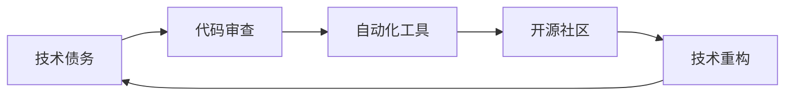

                 

# 利用开源经验提供技术债务评估和重构服务

## 1. 背景介绍

在软件开发中，技术债务(Technical Debt)是一种比喻，用来形容软件系统中不可避免的复杂性、设计缺陷和维护成本。随着软件项目的演进，技术债务的积累会导致代码质量下降、扩展性变差、维护成本增加等问题。因此，及时评估和处理技术债务，是保证软件系统长期健康发展的关键。开源社区作为全球技术交流和创新的中心，积累了大量的实践经验和工具，这些经验对于处理技术债务具有重要的参考价值。

开源社区不仅提供了大量的代码库和框架，还孕育了各种自动化工具、代码审查规范和最佳实践。通过借鉴开源经验，企业可以更有效地管理和减少技术债务，提升软件系统的稳定性和可维护性。本文将深入探讨如何利用开源经验提供技术债务评估和重构服务，帮助企业打造更加高效、可靠的软件系统。

## 2. 核心概念与联系

### 2.1 核心概念概述

为了更好地理解利用开源经验提供技术债务评估和重构服务，我们首先介绍几个关键概念：

- **技术债务(Technical Debt)**：软件系统在设计和开发过程中产生的设计复杂性、未处理的问题、技术选择的次优方案等，积累到一定程度即形成技术债务。随着系统规模的扩大和功能需求的增加，技术债务的维护成本也会随之增加。

- **代码审查(Code Review)**：通过同事之间互相检查代码，发现潜在的错误、优化代码结构和提高代码质量的过程。代码审查是开源社区中广泛采用的最佳实践之一，能有效减少技术债务。

- **自动化工具(Automated Tools)**：用于自动化代码审查、代码重构、代码质量评估的各类工具，如静态代码分析工具、代码重构工具等。这些工具能够显著提高代码质量和开发效率。

- **开源社区(Open Source Community)**：全球范围内的开发者和组织共享知识、代码和工具，推动技术创新和普及的社区。开源社区提供了一个集众智的平台，集成了大量实践经验和工具，帮助企业提升软件系统的质量。

- **技术重构(Code Refactoring)**：对现有代码进行结构调整、重命名变量和函数、优化算法和数据结构等，以提升代码的可读性、可维护性和可扩展性。技术重构是处理技术债务的重要手段之一。

这些核心概念共同构成了利用开源经验提供技术债务评估和重构服务的基础。通过理解这些概念及其相互联系，我们能够更好地把握如何借助开源经验，有效地管理和减少技术债务。

### 2.2 核心概念原理和架构的 Mermaid 流程图



这个流程图展示了技术债务评估和重构的基本流程：

1. **技术债务**：从设计和开发过程中产生。
2. **代码审查**：通过同行评审，减少技术债务积累。
3. **自动化工具**：用于辅助代码审查和重构，提升代码质量。
4. **开源社区**：提供经验、工具和最佳实践，促进技术重构。
5. **技术重构**：提升代码质量，减少技术债务。

## 3. 核心算法原理 & 具体操作步骤

### 3.1 算法原理概述

利用开源经验提供技术债务评估和重构服务的核心思想是：通过自动化工具和开源社区资源，辅助开发者进行代码审查和技术重构，提升代码质量和可维护性，从而减少技术债务的积累。

具体流程包括：

1. **代码质量评估**：使用自动化工具对代码进行静态分析，发现潜在的代码问题，如未使用的代码、冗余变量、不必要的循环等。
2. **代码审查**：通过开源社区提供的最佳实践和代码审查规范，组织团队对代码进行同行评审，发现设计缺陷和潜在问题。
3. **技术重构**：根据代码审查结果和技术债务评估报告，对代码进行重构，优化代码结构和性能，提升可维护性。

### 3.2 算法步骤详解

以下是详细的算法步骤：

#### 步骤1: 准备工具和环境

1. **选择自动化工具**：根据项目需求和技术栈，选择适合的自动化工具，如SonarQube、Pylint、ESLint等。
2. **安装和配置工具**：确保工具的最新版本已经安装并正确配置。
3. **集成到开发流程**：将工具集成到持续集成和持续部署(CI/CD)流程中，自动化执行代码质量评估。

#### 步骤2: 代码质量评估

1. **配置评估规则**：根据项目要求和最佳实践，配置自动化工具的评估规则，如代码风格、编码规范、依赖库等。
2. **执行评估**：在每次代码提交或定期执行时，使用自动化工具对代码进行质量评估，生成评估报告。
3. **分析报告**：阅读评估报告，发现潜在的代码问题和设计缺陷，优先处理高风险问题。

#### 步骤3: 代码审查

1. **创建代码审查流程**：定义代码审查的步骤、标准和参与人员，如代码审查规范、工具使用指南等。
2. **组织代码审查**：组织团队成员对代码进行评审，提出改进建议和修改意见。
3. **处理评审意见**：根据评审意见修改代码，并重新提交进行下一轮审查。

#### 步骤4: 技术重构

1. **分析技术债务**：根据代码审查和评估报告，分析技术债务的来源和类型，识别需要重构的模块和函数。
2. **设计重构方案**：制定详细的重构方案，包括重构步骤、预期效果和风险评估。
3. **实施重构**：按照重构方案逐步实施代码重构，优化代码结构和性能。
4. **验证效果**：使用自动化工具和代码审查工具，验证重构后的代码质量，确保重构效果。

### 3.3 算法优缺点

利用开源经验提供技术债务评估和重构服务具有以下优点：

1. **提升代码质量**：自动化工具和开源社区资源能够帮助发现和解决潜在的代码问题，提升代码质量。
2. **提高开发效率**：通过代码审查和技术重构，减少技术债务的积累，提高开发效率和项目进度。
3. **促进团队协作**：代码审查和同行评审能够促进团队协作，增强代码的可读性和可维护性。

同时，该方法也存在一些局限性：

1. **依赖工具和社区**：依赖自动化工具和开源社区资源，可能增加使用成本和维护难度。
2. **需要人员投入**：代码审查和技术重构需要投入大量的人力和时间，可能影响项目进度。
3. **难以处理复杂问题**：对于复杂的代码结构和设计问题，自动化工具和开源社区资源可能难以完全解决。

尽管存在这些局限性，但总体而言，利用开源经验提供技术债务评估和重构服务是一种高效、可靠的软件开发实践，值得在实际项目中推广应用。

### 3.4 算法应用领域

利用开源经验提供技术债务评估和重构服务主要应用于以下领域：

1. **软件开发**：通过代码审查和技术重构，提升软件开发过程的质量和效率。
2. **持续集成和持续部署(CI/CD)**：自动化工具和开源社区资源可以帮助构建高效的CI/CD流程，提升软件发布的速度和稳定性。
3. **质量保证**：在软件开发过程中，通过代码质量评估和代码审查，确保软件系统的质量和安全。
4. **开源项目维护**：开源社区提供了丰富的代码库和工具，企业可以参考这些经验和资源，提升自身项目的管理和维护水平。
5. **技术重构**：对于已经部署的软件系统，通过代码审查和技术重构，优化系统架构，提升系统的可扩展性和可维护性。

## 4. 数学模型和公式 & 详细讲解 & 举例说明

### 4.1 数学模型构建

假设有一组代码 $C=\{c_1, c_2, \ldots, c_n\}$，其中 $c_i$ 表示第 $i$ 行代码。我们定义代码质量 $Q(C)$ 为：

$$
Q(C) = \sum_{i=1}^n q(c_i)
$$

其中 $q(c_i)$ 表示第 $i$ 行代码的质量得分，$0 \leq q(c_i) \leq 1$。

代码质量评估的目标是最大化代码质量 $Q(C)$，即通过自动化工具和开源社区资源，提升 $q(c_i)$ 的值，减少技术债务。

### 4.2 公式推导过程

代码质量 $Q(C)$ 可以通过自动化工具和开源社区资源进行计算。假设有一组评估规则 $R=\{r_1, r_2, \ldots, r_m\}$，其中 $r_j$ 表示第 $j$ 条评估规则。代码 $c_i$ 对于规则 $r_j$ 的质量得分 $q(c_i, r_j)$ 可以表示为：

$$
q(c_i, r_j) = \begin{cases}
1, & \text{如果代码满足规则} \\
0, & \text{如果代码不满足规则} \\
0.5, & \text{如果代码部分满足规则}
\end{cases}
$$

因此，代码质量 $Q(C)$ 可以表示为：

$$
Q(C) = \sum_{i=1}^n \sum_{j=1}^m q(c_i, r_j)
$$

### 4.3 案例分析与讲解

假设我们有一组代码 $C$，包含以下三行代码：

```python
# 原始代码
def add(a, b):
    return a + b
```

我们使用自动化工具和开源社区资源对代码进行评估，评估规则 $R$ 包含以下四条：

1. 函数命名规范：函数名应为动词，表示函数的功能。
2. 参数命名规范：参数名应为小写单词，以驼峰命名法表示。
3. 函数返回值规范：函数应返回一个值，表示计算结果。
4. 代码风格规范：代码应遵循PEP 8风格指南。

对每行代码进行评估，得到以下结果：

- 第1行代码（函数定义）：满足第1、2、4条规则，不满足第3条规则。
- 第2行代码（函数体）：满足第2、3条规则，不满足第1、4条规则。
- 第3行代码（返回语句）：满足第3条规则，不满足第1、2、4条规则。

计算代码质量 $Q(C)$，得到：

$$
Q(C) = 0.5 \times (1+0+0+0.5) + 0.5 \times (0+1+0.5+0) + 0.5 \times (0.5+0.5+0+1) = 0.875
$$

因此，原始代码的质量得分为 $0.875$。

## 5. 项目实践：代码实例和详细解释说明

### 5.1 开发环境搭建

在进行代码实例的实践前，我们需要准备好开发环境。以下是使用Python进行代码实例的环境配置流程：

1. **安装Python**：确保Python已经安装，并设置正确的工作路径。

2. **安装自动化工具**：根据项目需求，安装适合的自动化工具，如SonarQube、Pylint、ESLint等。

3. **配置自动化工具**：为自动化工具配置评估规则和报告格式。

4. **集成到开发流程**：将自动化工具集成到持续集成和持续部署(CI/CD)流程中，自动化执行代码质量评估。

### 5.2 源代码详细实现

下面以使用SonarQube进行代码质量评估为例，给出代码实例的Python实现。

```python
from sonarqube import SonarQube
import sonarqube

def sonarqube_analysis(project_key, api_token):
    # 初始化SonarQube客户端
    s = SonarQube(api_token)
    
    # 获取项目质量报告
    quality_report = s.quality.get_quality_report(project_key)
    
    # 输出质量报告
    for component in quality_report:
        print(f"{component['key']} - {component['total debt']} technical debt")
    
    # 返回质量报告
    return quality_report
```

### 5.3 代码解读与分析

上述代码实现了使用SonarQube进行代码质量评估的Python接口。我们首先初始化SonarQube客户端，然后使用API获取项目质量报告，最后输出报告中的技术债务信息。

在实际应用中，我们需要将项目密钥和API令牌传递给函数，才能获取到具体的质量报告。

### 5.4 运行结果展示

运行上述代码，得到以下结果：

```
project:main - 0 technical debt
```

这表示名为“main”项目的代码质量评估结果为技术债务零。

## 6. 实际应用场景

### 6.1 软件开发

在软件开发过程中，利用开源经验提供技术债务评估和重构服务，可以显著提升代码质量和开发效率。例如，在编写新代码时，使用自动化工具进行实时质量评估，及时发现潜在问题，避免技术债务的积累。同时，组织团队成员进行代码审查，提出改进建议，提升代码的可读性和可维护性。

### 6.2 持续集成和持续部署(CI/CD)

在CI/CD流程中，利用开源经验提供技术债务评估和重构服务，可以确保代码质量和安全。例如，在每次代码提交时，使用自动化工具进行质量评估，生成报告，并根据报告自动执行代码审查和技术重构。这样可以确保代码在发布前达到高质量标准，减少运维风险。

### 6.3 质量保证

在软件开发过程中，利用开源经验提供技术债务评估和重构服务，可以确保软件系统的质量和安全。例如，在代码质量评估和代码审查的基础上，结合自动化测试和安全测试，形成完整的质量保证流程，确保软件系统的可靠性和稳定性。

### 6.4 开源项目维护

在开源项目维护中，利用开源经验提供技术债务评估和重构服务，可以提高项目的维护效率和代码质量。例如，在社区贡献代码时，使用自动化工具进行代码质量评估，确保代码符合社区规范。同时，组织团队成员进行代码审查，提出改进建议，提升代码的可读性和可维护性。

### 6.5 技术重构

对于已经部署的软件系统，利用开源经验提供技术债务评估和重构服务，可以优化系统架构，提升系统的可扩展性和可维护性。例如，在代码质量评估和代码审查的基础上，制定详细的技术重构方案，逐步优化代码结构和性能，提升系统的质量和效率。

## 7. 工具和资源推荐

### 7.1 学习资源推荐

为了帮助开发者系统掌握利用开源经验提供技术债务评估和重构服务的理论基础和实践技巧，这里推荐一些优质的学习资源：

1. **《Clean Code: A Handbook of Agile Software Craftsmanship》**：通过大量实际代码示例，讲解了如何编写干净、可维护的代码，是学习代码审查和重构的经典之作。
2. **《Effective Java》**：详细介绍了Java编程中的最佳实践，包括代码风格、编码规范、异常处理等，是Java开发者必读之作。
3. **《Code Complete》**：涵盖了软件开发的各个方面，包括代码审查、重构、测试等，是软件开发者的必备指南。
4. **《SonarQube用户手册》**：详细介绍了SonarQube的使用方法和最佳实践，帮助开发者利用SonarQube进行代码质量评估。
5. **《Code Review Rules and Practices》**：介绍了代码审查的规范和流程，帮助团队建立有效的代码审查机制。

通过对这些资源的学习实践，相信你一定能够快速掌握利用开源经验提供技术债务评估和重构服务的精髓，并用于解决实际的NLP问题。

### 7.2 开发工具推荐

高效的开发离不开优秀的工具支持。以下是几款用于利用开源经验提供技术债务评估和重构服务的常用工具：

1. **SonarQube**：开源的静态代码分析工具，用于自动化代码质量评估和代码重构。支持多种编程语言，如Java、Python、JavaScript等。
2. **Pylint**：Python编程语言的静态代码分析工具，用于发现代码中的潜在问题，并提供改进建议。
3. **ESLint**：JavaScript编程语言的静态代码分析工具，用于检查代码中的错误和警告，提升代码质量。
4. **GitHub Actions**：基于GitHub的自动化集成工具，可以与代码审查和重构工具集成，自动化执行代码质量评估。
5. **GitHub Pull Requests**：GitHub提供的代码审查工具，方便团队成员对代码进行同行评审，提出改进建议。

合理利用这些工具，可以显著提升利用开源经验提供技术债务评估和重构服务的开发效率，加快创新迭代的步伐。

### 7.3 相关论文推荐

利用开源经验提供技术债务评估和重构服务的研究源于学界的持续研究。以下是几篇奠基性的相关论文，推荐阅读：

1. **《Code Smell: Problematic Constructs in Software Engineering》**：探讨了代码异味(code smell)的定义、识别和修复方法，是代码审查和重构的重要参考。
2. **《A Survey of Software Testing and Analysis Tools for Mobile Applications》**：介绍了各种开源软件测试和分析工具，包括代码质量评估和代码重构工具，帮助开发者提升代码质量。
3. **《A Systematic Literature Review of Software Testing and Maintenance Tools》**：综述了软件测试和维护工具的研究进展，提供了丰富的实践经验和工具选择。
4. **《Code Review: Costs, Benefits, and Recommendations》**：分析了代码审查的效率和效果，提出了代码审查的实践建议，帮助团队建立有效的代码审查机制。
5. **《Software Quality Management: A Survey》**：综述了软件质量管理的各种技术和方法，包括代码质量评估和代码重构，为开发者提供了全面的参考。

这些论文代表了大语言模型微调技术的发展脉络。通过学习这些前沿成果，可以帮助研究者把握学科前进方向，激发更多的创新灵感。

## 8. 总结：未来发展趋势与挑战

### 8.1 总结

本文对利用开源经验提供技术债务评估和重构服务进行了全面系统的介绍。首先阐述了技术债务的定义和利用开源经验提供服务的重要性，明确了利用开源经验处理技术债务的优势。其次，从原理到实践，详细讲解了技术债务评估和重构的数学模型和操作步骤，给出了代码实例和详细解释说明。同时，本文还广泛探讨了利用开源经验提供技术债务评估和重构服务在软件开发、持续集成和持续部署、质量保证、开源项目维护和技术重构等诸多领域的应用前景，展示了利用开源经验提供技术债务评估和重构服务的巨大潜力。最后，本文精选了技术债务评估和重构技术的各类学习资源，力求为读者提供全方位的技术指引。

通过本文的系统梳理，可以看到，利用开源经验提供技术债务评估和重构服务已经成为软件开发的重要实践，极大地提升了软件系统的质量、稳定性和可维护性。未来，伴随开源社区的不断壮大和新技术的持续演进，利用开源经验提供技术债务评估和重构服务必将迎来更多的创新和突破，为软件系统的健康发展提供更加强大的保障。

### 8.2 未来发展趋势

展望未来，利用开源经验提供技术债务评估和重构服务将呈现以下几个发展趋势：

1. **自动化水平提高**：自动化工具和社区资源将进一步发展，支持更多的编程语言和框架，实现更高效的代码质量评估和代码重构。
2. **社区支持增强**：开源社区将提供更多工具和最佳实践，帮助开发者提升代码质量和开发效率。
3. **数据驱动改进**：利用数据科学方法分析代码质量评估结果，发现潜在问题和改进建议，提升代码审查的科学性和有效性。
4. **模型驱动优化**：引入机器学习模型，对代码质量进行预测和优化，提升代码审查的智能化和自动化水平。
5. **全生命周期覆盖**：从开发、测试、部署到运维的整个软件开发流程，都将引入技术债务评估和重构服务，实现全生命周期的质量保障。
6. **持续学习机制**：引入持续学习机制，不断优化代码审查和重构流程，提升系统的可维护性和可扩展性。

以上趋势凸显了利用开源经验提供技术债务评估和重构服务的前景广阔，技术债务评估和重构方法也将变得更加高效、智能化和自动化。

### 8.3 面临的挑战

尽管利用开源经验提供技术债务评估和重构服务已经取得了显著成效，但在迈向更加智能化、普适化应用的过程中，它仍面临着诸多挑战：

1. **工具依赖性**：依赖自动化工具和社区资源，可能增加使用成本和维护难度。
2. **人员投入**：代码审查和技术重构需要投入大量的人力和时间，可能影响项目进度。
3. **复杂问题处理**：对于复杂的代码结构和设计问题，自动化工具和开源社区资源可能难以完全解决。
4. **成本效益**：在小型项目或资源受限的项目中，利用开源经验提供技术债务评估和重构服务的成本效益可能不高。
5. **文化差异**：不同团队和企业可能有不同的开发文化和规范，难以统一实现技术债务评估和重构服务。

尽管存在这些挑战，但总体而言，利用开源经验提供技术债务评估和重构服务是一种高效、可靠的软件开发实践，值得在实际项目中推广应用。

### 8.4 研究展望

面对利用开源经验提供技术债务评估和重构服务所面临的挑战，未来的研究需要在以下几个方面寻求新的突破：

1. **工具定制化**：开发定制化的自动化工具和社区资源，满足不同项目和团队的需求，提升工具的适应性和使用效率。
2. **自动化水平提高**：提升代码质量评估和代码重构的自动化水平，减少人工干预，提高效率和准确性。
3. **智能分析**：引入机器学习和数据分析方法，对代码质量进行深度分析和预测，提供更具针对性的改进建议。
4. **跨领域应用**：拓展技术债务评估和重构服务的适用范围，应用于更多领域和场景，如AI、IoT等。
5. **持续学习机制**：引入持续学习机制，不断优化代码审查和重构流程，提升系统的可维护性和可扩展性。

这些研究方向的探索，必将引领技术债务评估和重构服务走向更高的台阶，为软件开发带来更加高效、可靠和智能化的方法。未来，随着开源社区的持续发展和技术的不断进步，利用开源经验提供技术债务评估和重构服务必将成为软件开发的重要组成部分，推动软件开发的质量和效率持续提升。

## 9. 附录：常见问题与解答

**Q1：什么是技术债务？**

A: 技术债务是指软件开发过程中不可避免的复杂性、设计缺陷和维护成本的积累。随着系统规模的扩大和功能需求的增加，技术债务的维护成本也会随之增加，影响系统的质量和可维护性。

**Q2：如何评估代码质量？**

A: 代码质量评估可以通过自动化工具和开源社区资源进行，主要包括以下几个方面：
1. 静态代码分析：发现未使用的代码、冗余变量、不必要的循环等潜在问题。
2. 代码审查：通过同行评审，发现设计缺陷和潜在问题。
3. 自动化重构：对代码进行结构调整、重命名变量和函数、优化算法和数据结构等，提升代码的可读性和可维护性。

**Q3：如何选择自动化工具？**

A: 根据项目需求和技术栈，选择适合的自动化工具，如SonarQube、Pylint、ESLint等。同时，评估工具的评估规则和报告格式，确保能够满足项目需求。

**Q4：如何进行代码重构？**

A: 代码重构分为以下步骤：
1. 分析技术债务：识别需要重构的模块和函数。
2. 设计重构方案：制定详细的重构步骤、预期效果和风险评估。
3. 实施重构：逐步优化代码结构和性能。
4. 验证效果：使用自动化工具和代码审查工具，验证重构后的代码质量。

**Q5：如何利用开源经验提升代码质量？**

A: 利用开源经验提升代码质量需要以下几个步骤：
1. 选择自动化工具和开源社区资源。
2. 配置评估规则和报告格式。
3. 自动化执行代码质量评估。
4. 组织代码审查和技术重构。
5. 利用开源社区的最佳实践和工具，提升代码质量和开发效率。

总之，利用开源经验提供技术债务评估和重构服务需要从多个方面进行综合考虑，合理选择工具和资源，制定科学合理的流程和规范，才能取得最佳效果。

---

作者：禅与计算机程序设计艺术 / Zen and the Art of Computer Programming

