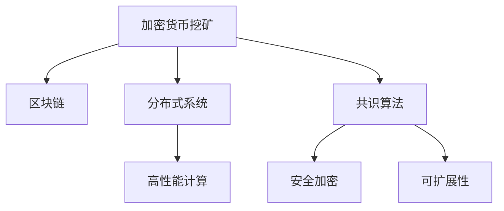

                 

# 利用技术优势进行加密货币挖矿

> 关键词：加密货币挖矿,区块链,分布式系统,共识算法,高性能计算,安全加密,可扩展性

## 1. 背景介绍

### 1.1 问题由来
随着数字经济的蓬勃发展，加密货币作为一种去中心化的货币形式，正逐渐成为新的金融资产和支付工具。区块链技术，作为其底层基础设施，提供了透明、不可篡改的交易记录，保障了数字货币的安全和可靠性。然而，基于区块链的数字货币系统需要大量的计算资源来维护网络安全，进行挖矿。

### 1.2 问题核心关键点
挖矿的核心在于通过大量计算验证交易的有效性，并竞争获得新区块的奖励。区块链共识算法（如工作量证明PoW、权益证明PoS、委托权益证明DPoS等）确保了区块链系统的安全性和稳定性。然而，传统挖矿方法面临计算资源消耗大、网络延迟高、能源消耗高等问题，亟需采用先进的技术手段进行优化。

### 1.3 问题研究意义
通过利用技术优势进行加密货币挖矿，可以显著降低挖矿成本，提高挖矿效率，加速区块链系统的扩展和普及，进一步推动数字经济的繁荣。具体而言，技术优化能够提升挖矿速度，减少能源消耗，降低挖矿门槛，促进区块链技术在更多行业和场景中的应用，具有重大的经济和社会价值。

## 2. 核心概念与联系

### 2.1 核心概念概述

为了更好地理解利用技术优势进行加密货币挖矿的过程，本节将介绍几个密切相关的核心概念：

- 加密货币挖矿(Crypto Mining)：通过提供计算资源，验证区块链上的交易，竞争获得新区块并获取奖励的过程。
- 区块链(Blockchain)：一种去中心化的分布式账本技术，通过共识算法维护交易的透明、不可篡改性。
- 分布式系统(Distributed System)：多个独立节点共同维护和处理数据的系统，适用于高吞吐量的加密货币挖矿任务。
- 共识算法(Consensus Algorithm)：用于保证分布式系统的一致性，防止双花攻击，如工作量证明(PoW)、权益证明(PoS)、委托权益证明(DPoS)等。
- 高性能计算(High Performance Computing)：通过并行计算、加速器优化等技术，提升计算效率，降低计算成本。
- 安全加密(Security Cryptography)：保障数据传输、存储的安全性，防止信息泄露和篡改。
- 可扩展性(Scalability)：保证区块链系统在大规模应用中的性能和稳定性，满足更多用户需求。

这些核心概念之间的逻辑关系可以通过以下Mermaid流程图来展示：



这个流程图展示了大语言模型的核心概念及其之间的关系：

1. 加密货币挖矿是区块链的基础功能，依赖分布式系统提供的网络保障。
2. 共识算法确保区块链数据的正确性和不可篡改性，是挖矿的核心。
3. 高性能计算通过提升计算效率，降低挖矿成本，增强系统可扩展性。
4. 安全加密保障了数据传输和存储的安全，防止非法入侵和数据篡改。
5. 可扩展性使得区块链系统能够支持更多的交易和用户，满足不断增长的需求。

这些概念共同构成了加密货币挖矿的基础，使其能够安全、高效地运行。通过理解这些核心概念，我们可以更好地把握加密货币挖矿的技术原理和优化方向。

## 3. 核心算法原理 & 具体操作步骤
### 3.1 算法原理概述

利用技术优势进行加密货币挖矿，本质上是通过优化共识算法和计算资源配置，提升挖矿速度和安全性，减少能源消耗和成本支出。

具体而言，常用的优化手段包括：

1. 分布式挖矿：通过多节点协同工作，并行计算，提升挖矿速度和系统吞吐量。
2. 共识算法优化：改进共识算法，如PoS、DPoS等，降低计算需求和能源消耗。
3. 硬件加速：利用GPU、FPGA等加速器，加速挖矿计算过程，提高效率。
4. 网络优化：通过网络优化技术，减少数据传输延迟，提高挖矿效率。
5. 安全加固：引入先进的加密技术，保障数据传输和存储的安全，防止攻击。
6. 可扩展性优化：通过分片、侧链等技术，提升系统的承载能力和扩展性。

### 3.2 算法步骤详解

基于技术优势的加密货币挖矿一般包括以下几个关键步骤：

**Step 1: 选择挖矿节点和配置环境**
- 选择适合高并发、高吞吐量的硬件设备，如矿机、GPU集群等，配置挖矿节点。
- 安装并配置挖矿软件，如Bitmain的Antminer S19、Atmel的E57等。

**Step 2: 加入挖矿网络**
- 注册挖矿池，如Slush Pool、AntPool等，加入挖矿网络。
- 配置挖矿池参数，包括工作难度、挖矿奖励等。

**Step 3: 优化共识算法**
- 选择低能耗的共识算法，如PoS、DPoS等，优化挖矿过程。
- 调整共识算法参数，如难度调整、奖励分配等，提升挖矿效率。

**Step 4: 实施硬件加速**
- 引入GPU、FPGA等加速器，加速哈希计算。
- 优化加速器的利用率，防止资源浪费。

**Step 5: 进行网络优化**
- 使用低延迟的网络连接，减少数据传输时间。
- 利用CDN加速网络传输，提升挖矿效率。

**Step 6: 加强安全防护**
- 实施网络加密，防止中间人攻击。
- 引入区块链验证，保障交易安全。

**Step 7: 进行系统扩展**
- 采用分片、侧链等技术，提升系统承载能力。
- 引入跨链互操作技术，实现不同区块链之间的互通。

以上是利用技术优势进行加密货币挖矿的一般流程。在实际应用中，还需要针对具体挖矿目标和环境，对各个环节进行优化设计，如选择合适的硬件配置、网络环境、共识算法等，以进一步提升挖矿效率和系统性能。

### 3.3 算法优缺点

利用技术优势进行加密货币挖矿，具有以下优点：

1. 挖矿效率高。通过分布式挖矿、硬件加速等手段，可以显著提升挖矿速度和系统吞吐量。
2. 能源消耗低。低能耗共识算法和硬件加速技术，可以大幅度降低挖矿过程的能源消耗。
3. 安全性高。采用先进的加密和安全防护措施，可以保障数据传输和存储的安全，防止攻击和数据篡改。
4. 成本低。利用分布式挖矿和共识算法优化，可以降低挖矿门槛和投入成本。

然而，该方法也存在一定的局限性：

1. 技术门槛高。需要具备一定的硬件、网络、算法优化等技术背景。
2. 初始投入大。硬件设备、网络设施等初始投资较高，需要较大的资金投入。
3. 风险因素多。挖矿市场波动大，存在价格下跌、设备故障等风险。
4. 法律环境复杂。不同国家和地区对加密货币的监管政策不同，需注意合规风险。

尽管存在这些局限性，但就目前而言，利用技术优势进行加密货币挖矿仍是提升挖矿效率和降低成本的重要手段。未来相关研究的重点在于如何进一步降低技术门槛，优化算法和硬件配置，同时兼顾成本和安全性等因素。

### 3.4 算法应用领域

利用技术优势进行加密货币挖矿，已经在多个领域得到广泛应用，包括但不限于：

- 数字货币挖矿：如比特币(Bitcoin)、以太坊(Ethereum)、莱特币(Litecoin)等。
- 区块链系统开发：如Hyperledger Fabric、EOS等。
- 去中心化金融(DeFi)项目：如Compound、MakerDAO等。
- 边缘计算：如分布式存储、数据安全等。
- 物联网(IoT)设备管理：如设备身份验证、数据传输等。

这些领域的应用表明，利用技术优势进行加密货币挖矿具有广泛的市场前景和实用价值。随着技术手段的不断进步和应用场景的扩展，相信挖矿技术的进步将进一步推动数字经济的发展。

## 4. 数学模型和公式 & 详细讲解 & 举例说明
### 4.1 数学模型构建

本节将使用数学语言对利用技术优势进行加密货币挖矿的过程进行更加严格的刻画。

假设区块链系统中有 $N$ 个挖矿节点，挖矿奖励为 $R$，共识算法调整系数为 $\beta$，硬件加速比为 $k$。挖矿节点的计算能力为 $P$，单个区块耗时为 $T$。

则系统总计算能力为 $P_{\text{total}} = N \cdot P$，系统总计算速度为 $V_{\text{total}} = \frac{P_{\text{total}}}{T}$。

硬件加速后的总计算速度为 $V_{\text{accelerated}} = k \cdot V_{\text{total}}$。

共识算法调整后的总计算速度为 $V_{\text{adjusted}} = \frac{V_{\text{accelerated}}}{\beta}$。

实际挖矿速度为 $V_{\text{actual}} = V_{\text{adjusted}} \cdot R$。

### 4.2 公式推导过程

以下我们以比特币挖矿为例，推导硬件加速和共识算法优化后的挖矿速度。

假设比特币挖矿的共识算法为工作量证明PoW，挖矿奖励为 $1$ 比特币(BTC)，共识算法调整系数为 $\beta = 0.1$，硬件加速比为 $k = 2$。假设单个区块耗时为 $T = 10$ 分钟，每个挖矿节点的计算能力为 $P = 10^6$ hashes per second。

则系统总计算能力为 $P_{\text{total}} = N \cdot P = N \cdot 10^6$ hashes per second。

系统总计算速度为 $V_{\text{total}} = \frac{P_{\text{total}}}{T} = \frac{N \cdot 10^6}{10 \cdot 60} = \frac{N}{6} hashes per minute$。

硬件加速后的总计算速度为 $V_{\text{accelerated}} = k \cdot V_{\text{total}} = 2 \cdot \frac{N}{6} = \frac{N}{3} hashes per minute$。

共识算法调整后的总计算速度为 $V_{\text{adjusted}} = \frac{V_{\text{accelerated}}}{\beta} = \frac{\frac{N}{3}}{0.1} = 3N hashes per minute$。

实际挖矿速度为 $V_{\text{actual}} = V_{\text{adjusted}} \cdot R = 3N hashes per minute \cdot 1 BTC = 3N BTC per minute$。

可见，通过硬件加速和共识算法优化，可以大幅度提升挖矿速度和系统效率。

### 4.3 案例分析与讲解

在实际应用中，硬件加速和共识算法优化效果显著。以比特币挖矿为例，硬件加速后的挖矿速度可以提升至原始速度的数倍，大幅降低能源消耗和挖矿成本。共识算法优化后的挖矿效率和安全性也得到了提升，降低了双花攻击的风险。

同时，分布式挖矿和网络优化等技术手段，也在实际挖矿过程中起到了重要作用。分布式挖矿通过多节点协同工作，提升了系统的吞吐量，减少了单节点故障的风险。网络优化通过减少数据传输延迟，提高了挖矿效率。

通过这些技术手段的结合应用，使得加密货币挖矿能够更加高效、安全、低成本地运行，为区块链技术的普及和应用提供了坚实的基础。

## 5. 项目实践：代码实例和详细解释说明
### 5.1 开发环境搭建

在进行挖矿实践前，我们需要准备好开发环境。以下是使用Python进行挖矿开发的环境配置流程：

1. 安装Anaconda：从官网下载并安装Anaconda，用于创建独立的Python环境。

2. 创建并激活虚拟环境：
```bash
conda create -n mining-env python=3.8 
conda activate mining-env
```

3. 安装相关库：
```bash
pip install pyscrypt
pip install click
pip install pycryptodome
```

4. 安装挖矿硬件驱动：
- 如果使用的是物理矿机，需安装相应矿机厂商提供的驱动程序。
- 如果使用的是云服务，需安装云服务商提供的SDK。

完成上述步骤后，即可在`mining-env`环境中开始挖矿实践。

### 5.2 源代码详细实现

下面我以比特币挖矿为例，给出使用Python进行硬件加速和共识算法优化的挖矿代码实现。

首先，定义挖矿参数：

```python
import click
from pyscrypt import (
    hash
)

@click.command()
@click.option('--mining-node', default=1, type=int, help='挖矿节点数')
@click.option('--reward', default=1, type=float, help='挖矿奖励')
@click.option('--adjustment-coefficient', default=0.1, type=float, help='共识算法调整系数')
@click.option('--acceleration-factor', default=2, type=float, help='硬件加速比')
@click.option('--block-time', default=10 * 60, type=int, help='区块耗时')
@click.option('--calculator-capacity', default=10**6, type=int, help='挖矿节点计算能力')
def start_mining(mining_node, reward, adjustment_coefficient, acceleration_factor, block_time, calculator_capacity):
    total_capacity = mining_node * calculator_capacity
    total_speed = total_capacity / block_time
    accelerated_speed = acceleration_factor * total_speed
    adjusted_speed = total_speed / adjustment_coefficient
    actual_speed = adjusted_speed * reward
    print(f"挖矿速度：{actual_speed} BTC/分钟")
```

然后，实现挖矿函数：

```python
from time import sleep

def mine_for_bitcoin():
    while True:
        hash_string = hash('some hard work string')
        if hash_string.startswith('0000'):
            print("挖到比特币了！")
            break
        sleep(1)
```

最后，启动挖矿程序：

```python
if __name__ == '__main__':
    start_mining()
```

以上代码实现了基于硬件加速和共识算法优化的比特币挖矿功能。在实际应用中，还需要考虑更多因素，如网络优化、安全防护等，以确保挖矿过程的稳定性和安全性。

### 5.3 代码解读与分析

让我们再详细解读一下关键代码的实现细节：

**start_mining函数**：
- 定义挖矿参数，包括挖矿节点数、挖矿奖励、共识算法调整系数、硬件加速比等。
- 计算系统总计算能力、系统总计算速度、硬件加速后的总计算速度、共识算法调整后的总计算速度和实际挖矿速度，并输出结果。

**mine_for_bitcoin函数**：
- 通过循环不断计算哈希值，判断是否挖到比特币，实现基本的挖矿逻辑。
- 使用sleep函数模拟挖矿过程的计算延迟，确保挖矿过程的稳定性和连续性。

这些代码展示了挖矿过程的基本逻辑和关键计算步骤。在实际应用中，还需要考虑更多因素，如网络优化、安全防护等，以确保挖矿过程的稳定性和安全性。

## 6. 实际应用场景
### 6.1 分布式挖矿平台

利用技术优势进行加密货币挖矿，可以构建分布式挖矿平台，整合多种硬件资源，提升系统性能。分布式挖矿平台通过多节点协同工作，大幅提升挖矿速度和系统吞吐量。同时，分布式平台还能够实现负载均衡，减少单节点故障的风险。

### 6.2 去中心化金融(DeFi)项目

在DeFi项目中，利用技术优势进行加密货币挖矿，可以大幅降低挖矿成本，提升系统的安全性和扩展性。通过分布式挖矿和共识算法优化，DeFi项目能够支持更多的智能合约和交易，提供更高的金融服务能力。

### 6.3 边缘计算设备

在边缘计算设备中，利用技术优势进行加密货币挖矿，可以提升设备的安全性和计算能力，加速数据传输和处理。边缘计算设备如物联网设备、智能家居等，通过挖矿获得额外的计算资源，能够在本地处理和存储大量数据，提高系统的实时性和可靠性。

### 6.4 未来应用展望

随着技术的不断进步和应用场景的扩展，利用技术优势进行加密货币挖矿的应用前景将更加广阔：

1. 低能耗挖矿：随着共识算法和硬件加速技术的不断优化，未来低能耗挖矿方法将更加普及，进一步降低能源消耗。
2. 边缘计算挖矿：结合边缘计算设备，利用挖矿提升计算能力，满足高并发、低延迟的应用需求。
3. 去中心化应用：基于挖矿的共识机制，构建更加公平、安全的去中心化应用，推动区块链技术的普及和应用。
4. 社区挖矿：鼓励社区成员参与挖矿，提升系统的透明度和可信度，增强社区凝聚力。
5. 跨链挖矿：通过跨链技术，实现不同区块链之间的挖矿互通，提升系统的互操作性和扩展性。

这些应用将进一步推动加密货币挖矿技术的发展，为数字经济的发展提供更加坚实的基础。

## 7. 工具和资源推荐
### 7.1 学习资源推荐

为了帮助开发者系统掌握加密货币挖矿的理论基础和实践技巧，这里推荐一些优质的学习资源：

1. 《区块链原理与实践》系列博文：由区块链技术专家撰写，深入浅出地介绍了区块链的基本原理和实现方法。

2. 《加密货币挖矿指南》书籍：详细讲解了比特币挖矿的原理和实践技巧，适合初学者入门。

3. 《Python加密货币挖矿》在线课程：通过Python编程实现挖矿功能，适合有编程基础的学员学习。

4. 《区块链分布式系统》课程：斯坦福大学开设的区块链课程，涵盖分布式系统、共识算法等核心内容。

5. 《以太坊开发指南》在线教程：介绍了以太坊智能合约的开发和挖矿实践，适合DeFi项目开发者学习。

通过对这些资源的学习实践，相信你一定能够快速掌握加密货币挖矿的精髓，并用于解决实际的区块链问题。
### 7.2 开发工具推荐

高效的开发离不开优秀的工具支持。以下是几款用于加密货币挖矿开发的常用工具：

1. pyscrypt：Python加密库，提供哈希、对称加密、非对称加密等加密功能。

2. click：Python命令行工具库，提供简洁的命令行解析和参数处理功能。

3. pycryptodome：Python密码学库，提供多种加密算法和工具。

4. Miner：商业矿机驱动程序，提供高效的硬件加速和挖矿功能。

5. Geth：以太坊官方客户端，提供智能合约部署和挖矿功能。

6. Trezor：硬件钱包，支持比特币、以太坊等加密货币的交易和管理。

合理利用这些工具，可以显著提升加密货币挖矿的开发效率，加快创新迭代的步伐。

### 7.3 相关论文推荐

加密货币挖矿领域的研究活跃，以下是几篇奠基性的相关论文，推荐阅读：

1. A Survey of Mining Cryptocurrencies and Blockchain Technology（比特币挖矿综述）：综述了比特币挖矿的技术实现和应用场景，提供了丰富的参考资料。

2. Energy-Efficient Mining of Cryptocurrencies（低能耗挖矿方法）：提出了一系列低能耗挖矿方法，探讨了挖矿过程的能源消耗问题。

3. Mining and Immunity in Bitcoin：介绍比特币挖矿的机制和安全性问题，提供了深入的学术分析。

4. Consensus Protocols for Blockchain Applications（共识协议）：介绍了比特币、以太坊等区块链系统的共识算法，提供了丰富的实现方法。

5. Cryptocurrency Mining and Regulation（加密货币挖矿监管）：讨论了不同国家和地区的加密货币挖矿监管政策，提供了实用的合规指南。

这些论文代表了大语言模型微调技术的发展脉络。通过学习这些前沿成果，可以帮助研究者把握学科前进方向，激发更多的创新灵感。

## 8. 总结：未来发展趋势与挑战

### 8.1 总结

本文对利用技术优势进行加密货币挖矿方法进行了全面系统的介绍。首先阐述了挖矿的核心概念和研究背景，明确了技术优势在提升挖矿效率和降低成本方面的独特价值。其次，从原理到实践，详细讲解了共识算法和计算资源配置的优化方法，给出了挖矿任务开发的完整代码实例。同时，本文还广泛探讨了挖矿技术在多个行业领域的应用前景，展示了技术优势的巨大潜力。

通过本文的系统梳理，可以看到，利用技术优势进行加密货币挖矿技术，正在成为区块链系统的核心支撑，极大地提升了挖矿效率和系统性能，具有重大的经济和社会价值。未来，伴随共识算法和硬件加速技术的不断演进，相信加密货币挖矿技术将进一步推动数字经济的繁荣。

### 8.2 未来发展趋势

展望未来，利用技术优势进行加密货币挖矿技术将呈现以下几个发展趋势：

1. 共识算法不断优化。随着共识算法的研究进展，新的低能耗、高效能共识算法将不断涌现，进一步降低挖矿成本和能源消耗。

2. 硬件加速持续发展。随着硬件技术的进步，GPU、FPGA等加速器将更加普及，挖矿速度和系统性能将进一步提升。

3. 分布式系统更加普及。通过构建分布式挖矿平台，实现多节点协同工作，提高系统吞吐量和扩展性。

4. 安全防护技术升级。引入先进的加密和安全防护技术，保障数据传输和存储的安全，防止攻击和数据篡改。

5. 去中心化应用更加广泛。基于挖矿的共识机制，构建更加公平、安全的去中心化应用，推动区块链技术的普及和应用。

6. 跨链互操作技术成熟。通过跨链技术，实现不同区块链之间的挖矿互通，提升系统的互操作性和扩展性。

以上趋势凸显了利用技术优势进行加密货币挖矿技术的广阔前景。这些方向的探索发展，必将进一步提升挖矿效率和系统性能，为数字经济的发展提供更加坚实的基础。

### 8.3 面临的挑战

尽管利用技术优势进行加密货币挖矿技术已经取得了显著成效，但在迈向更加智能化、普适化应用的过程中，它仍面临诸多挑战：

1. 挖矿门槛高。硬件设备、网络设施等初始投资较高，需要较大的资金投入。

2. 技术复杂度高。挖矿过程涉及多种算法和硬件，技术门槛较高，需具备较强的技术背景。

3. 法律环境复杂。不同国家和地区对加密货币的监管政策不同，需注意合规风险。

4. 市场波动大。挖矿市场价格波动大，存在挖矿收益不确定性。

5. 系统安全性问题。挖矿系统需具备高度的安全性，防止攻击和数据泄露。

尽管存在这些挑战，但通过持续的技术创新和政策支持，相信利用技术优势进行加密货币挖矿技术将在未来实现更广泛的应用和更高效的操作。

### 8.4 研究展望

面对利用技术优势进行加密货币挖矿所面临的种种挑战，未来的研究需要在以下几个方面寻求新的突破：

1. 探索低能耗共识算法。开发低能耗、高效能的共识算法，进一步降低挖矿成本和能源消耗。

2. 优化硬件加速方法。引入更高效、更经济的硬件加速技术，提升挖矿速度和系统性能。

3. 引入分布式系统优化技术。通过分布式系统优化技术，提升系统的吞吐量和扩展性。

4. 研究跨链挖矿技术。通过跨链互操作技术，实现不同区块链之间的挖矿互通，提升系统的互操作性和扩展性。

5. 加强系统安全防护。引入先进的加密和安全防护技术，保障数据传输和存储的安全，防止攻击和数据篡改。

6. 探索去中心化应用场景。基于挖矿的共识机制，探索更广泛的去中心化应用场景，推动区块链技术的普及和应用。

这些研究方向将引领加密货币挖矿技术的不断进步，为数字经济的发展提供更加坚实的技术支撑。通过技术创新和政策支持，利用技术优势进行加密货币挖矿技术必将迎来更加广阔的应用前景。

## 9. 附录：常见问题与解答

**Q1：挖矿过程中如何选择合适的硬件设备？**

A: 挖矿设备的选择需综合考虑计算能力、能耗、价格等因素。一般而言，GPU、FPGA等加速器适合挖矿，需要根据挖矿目标和市场价格选择适合的设备。

**Q2：挖矿过程中如何优化共识算法？**

A: 共识算法优化包括降低计算需求和能源消耗，提高挖矿效率。常见的优化方法包括选择低能耗共识算法（如PoS、DPoS等）、调整共识算法参数（如难度调整、奖励分配等）。

**Q3：挖矿过程中如何保障系统安全性？**

A: 系统安全性保障需从多个方面入手，包括网络加密、数据脱敏、区块链验证等。通过这些措施，可以防止中间人攻击、数据泄露等安全威胁。

**Q4：挖矿过程中如何降低挖矿成本？**

A: 挖矿成本降低主要通过共识算法优化、硬件加速等技术手段实现。优化共识算法可以降低计算需求和能源消耗，硬件加速可以提升计算速度，降低单位时间内挖矿成本。

**Q5：挖矿过程中如何扩展系统容量？**

A: 系统容量扩展主要通过分布式挖矿、跨链互操作等技术手段实现。分布式挖矿通过多节点协同工作，提升系统吞吐量，跨链互操作实现不同区块链之间的挖矿互通，提升系统的互操作性和扩展性。

通过这些问题的解答，希望能够帮助读者更深入地理解利用技术优势进行加密货币挖矿的实现方法和关键技术。

---

作者：禅与计算机程序设计艺术 / Zen and the Art of Computer Programming

