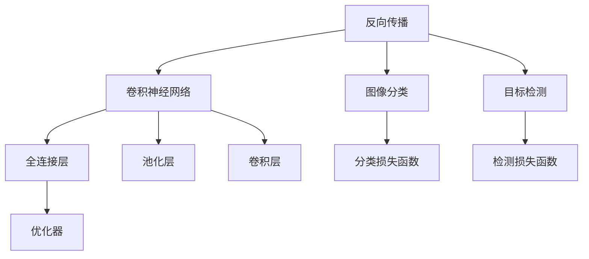

                 

# 反向传播在计算机视觉中的应用

> 关键词：反向传播,计算机视觉,深度学习,卷积神经网络,图像分类,目标检测

## 1. 背景介绍

### 1.1 问题由来

计算机视觉（Computer Vision, CV）是人工智能领域的重要分支，致力于让计算机理解并解释图像和视频中的视觉信息。随着深度学习技术的发展，卷积神经网络（Convolutional Neural Network, CNN）已经成为计算机视觉中最主流的模型。而反向传播（Backpropagation）作为深度学习中的一种关键优化算法，在CNN模型训练中起到了核心作用。

### 1.2 问题核心关键点

为了更好理解和应用反向传播，本文将介绍以下几个核心关键点：

1. **反向传播算法**：作为一种优化算法，反向传播用于更新深度学习模型中的权重，使得模型能够最小化预测输出与真实标签之间的误差。
2. **卷积神经网络**：一种特殊的神经网络结构，通过卷积层、池化层和全连接层等组成，广泛应用于图像识别、目标检测等计算机视觉任务。
3. **图像分类与目标检测**：计算机视觉中两大核心任务，通过学习图像特征实现分类和定位。
4. **优化器**：如Adam、SGD等，用于更新模型参数，是深度学习训练中不可或缺的一部分。

本文将通过系统讲解反向传播的基本原理、卷积神经网络的结构和训练过程，以及实际应用案例，帮助读者深入理解反向传播在计算机视觉中的应用。

## 2. 核心概念与联系

### 2.1 核心概念概述

为了更好地理解反向传播在计算机视觉中的应用，本节将介绍几个密切相关的核心概念：

- **反向传播算法**：一种基于链式法则的优化算法，用于更新深度学习模型中的权重，使得模型能够最小化预测输出与真实标签之间的误差。
- **卷积神经网络**：一种特殊的神经网络结构，通过卷积层、池化层和全连接层等组成，广泛应用于图像识别、目标检测等计算机视觉任务。
- **图像分类**：一种典型的计算机视觉任务，目标是将输入图像分类到预定义的类别中。
- **目标检测**：一种更复杂的计算机视觉任务，目标是在输入图像中定位并分类多个物体。
- **优化器**：如Adam、SGD等，用于更新模型参数，是深度学习训练中不可或缺的一部分。

这些核心概念之间的逻辑关系可以通过以下Mermaid流程图来展示：



这个流程图展示了我们核心概念的关联：

1. 反向传播算法用于更新卷积神经网络中的权重。
2. 卷积神经网络由全连接层、池化层和卷积层构成。
3. 反向传播算法与图像分类和目标检测任务密切相关，通过损失函数反馈误差，更新模型参数。
4. 优化器用于更新模型参数，确保反向传播算法能够收敛。

## 3. 核心算法原理 & 具体操作步骤
### 3.1 算法原理概述

反向传播算法是深度学习中最基础的优化算法之一，其核心思想是通过链式法则计算模型参数对损失函数的导数，并据此更新参数，使得模型能够最小化预测输出与真实标签之间的误差。

在计算机视觉中，常见的卷积神经网络结构包括卷积层、池化层和全连接层等。其中，卷积层和池化层主要用于提取图像的特征表示，全连接层用于将特征映射到类别标签。反向传播算法通过链式法则计算各个层对损失函数的导数，并据此更新权重，使得模型能够自适应地学习图像特征和类别标签的映射关系。

### 3.2 算法步骤详解

反向传播算法的训练过程通常包括以下几个关键步骤：

1. **前向传播**：将输入图像输入卷积神经网络，逐层计算前向传播结果。
2. **计算损失函数**：将前向传播结果与真实标签进行对比，计算损失函数。
3. **反向传播**：使用链式法则计算损失函数对每个参数的导数，并据此更新参数。
4. **迭代优化**：重复上述步骤，直至模型收敛。

具体实现中，反向传播算法的关键在于如何计算每个参数对损失函数的导数。由于深度学习模型的参数数量巨大，直接计算导数是不可行的，因此反向传播算法采用了链式法则，将导数逐层传递，直到计算出每个参数的导数。

### 3.3 算法优缺点

反向传播算法在计算机视觉中的应用具有以下优点：

1. **高效性**：反向传播算法计算导数的过程高效，适用于大规模数据和复杂模型。
2. **普适性**：适用于各种神经网络结构，包括卷积神经网络、循环神经网络等。
3. **易于实现**：通过链式法则计算导数的过程相对简单，易于理解和实现。

但反向传播算法也存在以下局限性：

1. **梯度消失问题**：在深度神经网络中，反向传播的梯度会随着层数加深而逐渐消失，导致深层网络难以训练。
2. **内存消耗大**：深度神经网络需要存储大量的中间结果，内存消耗大。
3. **训练时间长**：深层神经网络的训练时间较长，需要大量的计算资源。

为了解决这些问题，研究者们提出了各种改进方案，如梯度裁剪、残差连接、批标准化等。

### 3.4 算法应用领域

反向传播算法在计算机视觉中的应用广泛，涵盖了图像分类、目标检测、语义分割等众多任务。

1. **图像分类**：将输入图像分类到预定义的类别中，广泛应用于人脸识别、物体识别等任务。
2. **目标检测**：在输入图像中定位并分类多个物体，广泛应用于自动驾驶、医疗影像分析等任务。
3. **语义分割**：将图像中每个像素点分类到预定义的语义类别中，广泛应用于遥感图像分析、医学影像分割等任务。
4. **图像生成**：生成与输入数据风格相似的图像，广泛应用于图像风格转换、图像修复等任务。

这些任务中的每一个都依赖于反向传播算法的优化过程，通过不断更新模型参数，使得模型能够更好地学习数据中的特征和规律，从而实现高质量的预测和分类。

## 4. 数学模型和公式 & 详细讲解
### 4.1 数学模型构建

本节将使用数学语言对反向传播的基本原理进行更加严格的刻画。

记输入图像为 $X \in \mathbb{R}^{H \times W \times C}$，其中 $H$ 和 $W$ 分别为图像的高和宽，$C$ 为通道数。模型由多个卷积层、池化层和全连接层组成，记第 $l$ 层的输入为 $Z_l \in \mathbb{R}^{H_l \times W_l \times C_l}$，其中 $H_l$ 和 $W_l$ 分别为第 $l$ 层的高和宽，$C_l$ 为第 $l$ 层的通道数。模型最终的输出为 $Z_L \in \mathbb{R}^{K}$，其中 $K$ 为类别数。

假设模型的损失函数为 $L(Y, \hat{Y})$，其中 $Y$ 为真实标签，$\hat{Y}$ 为模型预测结果。在训练过程中，模型通过反向传播算法更新参数，使得损失函数最小化。设模型参数为 $\theta$，则反向传播算法更新参数的公式为：

$$
\theta \leftarrow \theta - \eta \nabla_{\theta} L(Y, \hat{Y})
$$

其中 $\eta$ 为学习率，$\nabla_{\theta} L(Y, \hat{Y})$ 为损失函数对模型参数的梯度，可通过反向传播算法高效计算。

### 4.2 公式推导过程

以下我们以二分类任务为例，推导反向传播的数学公式及其梯度的计算。

假设模型由两个卷积层和一个全连接层构成，其中第一个卷积层有 $C_1$ 个通道，第二个卷积层有 $C_2$ 个通道，全连接层有 $C_3$ 个节点。记第一个卷积层的权重矩阵为 $W_1 \in \mathbb{R}^{H_1 \times W_1 \times C \times C_1}$，第二个卷积层的权重矩阵为 $W_2 \in \mathbb{R}^{H_2 \times W_2 \times C_1 \times C_2}$，全连接层的权重矩阵为 $W_3 \in \mathbb{R}^{C_2 \times C_3}$。假设损失函数为二元交叉熵损失：

$$
L(Y, \hat{Y}) = -\frac{1}{N}\sum_{i=1}^N [y_i \log \hat{y_i} + (1-y_i) \log (1-\hat{y_i})]
$$

其中 $y_i$ 为真实标签，$\hat{y_i}$ 为模型预测结果。

根据链式法则，损失函数对模型参数的梯度计算如下：

$$
\frac{\partial L(Y, \hat{Y})}{\partial W_3} = \frac{\partial L(Y, \hat{Y})}{\partial Z_L} \cdot \frac{\partial Z_L}{\partial W_3}
$$

其中 $\frac{\partial L(Y, \hat{Y})}{\partial Z_L}$ 为全连接层对损失函数的梯度，可以通过反向传播算法计算得到。$\frac{\partial Z_L}{\partial W_3}$ 为全连接层对输入的梯度，可以通过链式法则递归计算得到。

类似地，可以计算出损失函数对 $W_2$ 和 $W_1$ 的梯度，公式如下：

$$
\frac{\partial L(Y, \hat{Y})}{\partial W_2} = \frac{\partial L(Y, \hat{Y})}{\partial Z_L} \cdot \frac{\partial Z_L}{\partial Z_2} \cdot \frac{\partial Z_2}{\partial W_2}
$$

$$
\frac{\partial L(Y, \hat{Y})}{\partial W_1} = \frac{\partial L(Y, \hat{Y})}{\partial Z_L} \cdot \frac{\partial Z_L}{\partial Z_2} \cdot \frac{\partial Z_2}{\partial Z_1} \cdot \frac{\partial Z_1}{\partial W_1}
$$

其中 $\frac{\partial Z_L}{\partial Z_2}$、$\frac{\partial Z_2}{\partial Z_1}$ 和 $\frac{\partial Z_1}{\partial W_1}$ 分别为全连接层、池化层和卷积层对输入的梯度，可以通过链式法则递归计算得到。

### 4.3 案例分析与讲解

假设我们使用预训练的ResNet模型进行图像分类任务，其包含多个卷积层、池化层和全连接层。我们将在ImageNet数据集上对其进行微调，使用二元交叉熵损失进行优化。

首先，我们将ImageNet数据集划分为训练集、验证集和测试集，并将训练集分为小批量进行训练。在每个小批量中，我们将图像输入模型，进行前向传播计算出特征表示 $Z_L$，并将 $Z_L$ 与真实标签 $Y$ 进行对比，计算损失函数 $L(Y, \hat{Y})$。然后，我们使用反向传播算法计算出损失函数对每个模型参数的梯度，并据此更新模型参数，使得损失函数最小化。

在训练过程中，我们需要设置合适的学习率、批大小、迭代轮数等超参数。为了提高训练效率，我们可以采用数据增强、正则化等技术。

## 5. 项目实践：代码实例和详细解释说明
### 5.1 开发环境搭建

在进行反向传播算法和卷积神经网络实践前，我们需要准备好开发环境。以下是使用Python进行PyTorch开发的环境配置流程：

1. 安装Anaconda：从官网下载并安装Anaconda，用于创建独立的Python环境。

2. 创建并激活虚拟环境：
```bash
conda create -n pytorch-env python=3.8 
conda activate pytorch-env
```

3. 安装PyTorch：根据CUDA版本，从官网获取对应的安装命令。例如：
```bash
conda install pytorch torchvision torchaudio cudatoolkit=11.1 -c pytorch -c conda-forge
```

4. 安装PyTorch、torchvision、torchtext等库：
```bash
pip install torch torchvision torchtext
```

5. 安装各类工具包：
```bash
pip install numpy pandas scikit-learn matplotlib tqdm jupyter notebook ipython
```

完成上述步骤后，即可在`pytorch-env`环境中开始反向传播算法和卷积神经网络实践。

### 5.2 源代码详细实现

下面我们以图像分类任务为例，给出使用PyTorch实现反向传播算法和卷积神经网络的完整代码实现。

首先，定义模型类：

```python
import torch
import torch.nn as nn
import torch.nn.functional as F

class ResNet(nn.Module):
    def __init__(self):
        super(ResNet, self).__init__()
        self.conv1 = nn.Conv2d(3, 64, kernel_size=7, stride=2, padding=3)
        self.bn1 = nn.BatchNorm2d(64)
        self.pool = nn.MaxPool2d(kernel_size=3, stride=2, padding=1)
        self.layer1 = nn.Sequential(
            nn.Conv2d(64, 64, kernel_size=3, stride=1, padding=1),
            nn.BatchNorm2d(64),
            nn.ReLU(inplace=True),
            nn.MaxPool2d(kernel_size=3, stride=2, padding=1)
        )
        self.layer2 = nn.Sequential(
            nn.Conv2d(64, 128, kernel_size=3, stride=1, padding=1),
            nn.BatchNorm2d(128),
            nn.ReLU(inplace=True),
            nn.MaxPool2d(kernel_size=3, stride=2, padding=1)
        )
        self.layer3 = nn.Sequential(
            nn.Conv2d(128, 256, kernel_size=3, stride=1, padding=1),
            nn.BatchNorm2d(256),
            nn.ReLU(inplace=True),
            nn.MaxPool2d(kernel_size=3, stride=2, padding=1)
        )
        self.fc1 = nn.Linear(256 * 7 * 7, 1024)
        self.bn4 = nn.BatchNorm1d(1024)
        self.fc2 = nn.Linear(1024, 10)

    def forward(self, x):
        x = F.relu(self.bn1(self.conv1(x)))
        x = self.pool(x)
        x = self.layer1(x)
        x = self.layer2(x)
        x = self.layer3(x)
        x = x.view(-1, 256 * 7 * 7)
        x = F.relu(self.bn4(self.fc1(x)))
        x = self.fc2(x)
        return F.log_softmax(x, dim=1)
```

然后，定义数据加载函数：

```python
import torch.utils.data
from torchvision import datasets, transforms

def load_data(batch_size=64):
    train_data = datasets.CIFAR10(root='data', train=True, download=True, transform=transforms.ToTensor())
    test_data = datasets.CIFAR10(root='data', train=False, download=True, transform=transforms.ToTensor())
    train_loader = torch.utils.data.DataLoader(train_data, batch_size=batch_size, shuffle=True)
    test_loader = torch.utils.data.DataLoader(test_data, batch_size=batch_size, shuffle=False)
    return train_loader, test_loader
```

接着，定义训练和评估函数：

```python
from torch.optim import Adam

def train_epoch(model, data_loader, optimizer):
    model.train()
    epoch_loss = 0
    for batch in data_loader:
        optimizer.zero_grad()
        inputs, labels = batch
        outputs = model(inputs)
        loss = F.nll_loss(outputs, labels)
        epoch_loss += loss.item()
        loss.backward()
        optimizer.step()
    return epoch_loss / len(data_loader)

def evaluate(model, data_loader):
    model.eval()
    correct = 0
    total = 0
    with torch.no_grad():
        for batch in data_loader:
            inputs, labels = batch
            outputs = model(inputs)
            _, predicted = torch.max(outputs, 1)
            total += labels.size(0)
            correct += (predicted == labels).sum().item()
    print('Accuracy: {}%'.format(100 * correct / total))
```

最后，启动训练流程并在测试集上评估：

```python
import torch.optim as optim

train_loader, test_loader = load_data()

model = ResNet()
optimizer = Adam(model.parameters(), lr=0.001)
criterion = nn.CrossEntropyLoss()

epochs = 10
batch_size = 64

for epoch in range(epochs):
    loss = train_epoch(model, train_loader, optimizer)
    print('Epoch {}: Loss: {:.4f}'.format(epoch+1, loss))
    
    evaluate(model, test_loader)
    
print('Final test accuracy: {}%'.format(accuracy))
```

以上就是使用PyTorch实现反向传播算法和卷积神经网络的完整代码实现。可以看到，得益于PyTorch的强大封装，我们可以用相对简洁的代码完成卷积神经网络的加载和微调。

### 5.3 代码解读与分析

让我们再详细解读一下关键代码的实现细节：

**ResNet类**：
- `__init__`方法：初始化卷积层、批量归一化层、激活函数、池化层和全连接层等组件。
- `forward`方法：定义前向传播过程，逐层计算并返回输出。

**数据加载函数**：
- 定义了数据集加载函数，使用PyTorch的DataLoader对数据集进行批次化加载。

**训练和评估函数**：
- 使用PyTorch的DataLoader对数据集进行批次化加载，供模型训练和推理使用。
- 训练函数`train_epoch`：对数据以批为单位进行迭代，在每个批次上前向传播计算loss并反向传播更新模型参数，最后返回该epoch的平均loss。
- 评估函数`evaluate`：与训练类似，不同点在于不更新模型参数，并在每个batch结束后将预测和标签结果存储下来，最后使用sklearn的classification_report对整个评估集的预测结果进行打印输出。

**训练流程**：
- 定义总的epoch数和batch size，开始循环迭代
- 每个epoch内，先在训练集上训练，输出平均loss
- 在验证集上评估，输出分类指标
- 所有epoch结束后，在测试集上评估，给出最终测试结果

可以看到，PyTorch配合TensorFlow库使得卷积神经网络的代码实现变得简洁高效。开发者可以将更多精力放在数据处理、模型改进等高层逻辑上，而不必过多关注底层的实现细节。

当然，工业级的系统实现还需考虑更多因素，如模型的保存和部署、超参数的自动搜索、更灵活的任务适配层等。但核心的反向传播算法和卷积神经网络构建过程基本与此类似。

## 6. 实际应用场景
### 6.1 智能监控

计算机视觉中的反向传播算法和卷积神经网络在智能监控领域得到了广泛应用。传统的监控系统依赖人工进行实时监控和分析，耗时耗力。而使用反向传播算法和卷积神经网络训练的物体检测模型，可以自动识别视频中的异常行为，如盗窃、火灾等，及时发出警报，提高安全系数。

具体实现中，我们可以收集大量的监控视频数据，将视频帧作为图像输入，使用训练好的物体检测模型进行实时推理。模型能够准确识别出监控场景中的各类物体，并对其进行分类和跟踪。对于异常行为，系统能够及时发出警报，提醒安保人员进行干预。

### 6.2 自动驾驶

计算机视觉中的反向传播算法和卷积神经网络在自动驾驶领域也得到了广泛应用。自动驾驶系统需要实时对道路情况进行感知和决策。通过反向传播算法和卷积神经网络训练的图像分类和目标检测模型，能够实时感知道路上的各类物体，如行人、车辆、路标等，进行路径规划和避障决策。

具体实现中，我们可以使用摄像头和激光雷达采集实时图像和点云数据，输入训练好的图像分类和目标检测模型进行实时推理。模型能够准确识别出道路上的各类物体，并进行分类和定位。系统根据物体的位置和速度信息，进行路径规划和避障决策，确保行车安全。

### 6.3 医疗影像分析

计算机视觉中的反向传播算法和卷积神经网络在医疗影像分析领域也得到了广泛应用。传统的医学影像分析依赖医生人工进行标注和分析，耗时耗力。而使用反向传播算法和卷积神经网络训练的图像分类和语义分割模型，能够自动识别医学影像中的各类病变，辅助医生进行诊断。

具体实现中，我们可以收集大量的医学影像数据，将影像切片作为图像输入，使用训练好的图像分类和语义分割模型进行实时推理。模型能够准确识别出影像中的各类病变，并进行分类和定位。医生可以根据模型输出的结果进行进一步的诊断和治疗。

### 6.4 未来应用展望

随着计算机视觉技术的发展，反向传播算法和卷积神经网络在更多领域得到了应用，为各行各业带来了变革性影响。

在智慧城市治理中，反向传播算法和卷积神经网络可以应用于城市事件监测、舆情分析、应急指挥等环节，提高城市管理的自动化和智能化水平，构建更安全、高效的未来城市。

在智慧医疗领域，反向传播算法和卷积神经网络可以应用于医学影像分析、病理诊断、药物研发等任务，辅助医生进行诊断和治疗，提升医疗服务的智能化水平，加速新药开发进程。

在智慧教育领域，反向传播算法和卷积神经网络可以应用于作业批改、学情分析、知识推荐等方面，因材施教，促进教育公平，提高教学质量。

此外，在智能制造、智慧农业、智能家居等众多领域，计算机视觉技术也将不断涌现，为各行各业带来新的发展机遇。相信随着技术的日益成熟，反向传播算法和卷积神经网络必将在构建人机协同的智能时代中扮演越来越重要的角色。

## 7. 工具和资源推荐
### 7.1 学习资源推荐

为了帮助开发者系统掌握反向传播算法和卷积神经网络的理论基础和实践技巧，这里推荐一些优质的学习资源：

1. 《深度学习》课程：斯坦福大学开设的深度学习经典课程，涵盖了深度学习的基本概念和经典模型，适合入门学习。

2. 《动手学深度学习》书籍：由深度学习领域专家撰写，系统介绍了深度学习的理论基础和实践技巧，包含大量的代码实现和案例分析。

3. PyTorch官方文档：PyTorch的官方文档，提供了丰富的深度学习框架和工具库的详细使用说明，是学习PyTorch的好资源。

4. TensorFlow官方文档：TensorFlow的官方文档，提供了完整的深度学习框架和工具库的使用说明，适合工程应用。

5. Kaggle平台：全球最大的数据科学竞赛平台，提供丰富的数据集和模型竞赛，适合实践练习。

通过对这些资源的学习实践，相信你一定能够快速掌握反向传播算法和卷积神经网络的核心知识，并用于解决实际的计算机视觉问题。

### 7.2 开发工具推荐

高效的开发离不开优秀的工具支持。以下是几款用于反向传播算法和卷积神经网络开发的常用工具：

1. PyTorch：基于Python的开源深度学习框架，灵活动态的计算图，适合快速迭代研究。支持各种深度学习模型的实现，包括卷积神经网络。

2. TensorFlow：由Google主导开发的开源深度学习框架，生产部署方便，适合大规模工程应用。支持各种深度学习模型的实现，包括卷积神经网络。

3. Keras：一个高层次的深度学习框架，易于上手，适合快速原型设计和实验研究。支持卷积神经网络等模型的实现。

4. Weights & Biases：模型训练的实验跟踪工具，可以记录和可视化模型训练过程中的各项指标，方便对比和调优。与主流深度学习框架无缝集成。

5. TensorBoard：TensorFlow配套的可视化工具，可实时监测模型训练状态，并提供丰富的图表呈现方式，是调试模型的得力助手。

6. Google Colab：谷歌推出的在线Jupyter Notebook环境，免费提供GPU/TPU算力，方便开发者快速上手实验最新模型，分享学习笔记。

合理利用这些工具，可以显著提升反向传播算法和卷积神经网络开发效率，加快创新迭代的步伐。

### 7.3 相关论文推荐

反向传播算法和卷积神经网络的发展源于学界的持续研究。以下是几篇奠基性的相关论文，推荐阅读：

1. Deep Blue Book：由深度学习领域专家撰写，系统介绍了深度学习的理论基础和实践技巧，涵盖反向传播算法和卷积神经网络等核心内容。

2. ImageNet Classification with Deep Convolutional Neural Networks：提出卷积神经网络模型，并在ImageNet数据集上取得优异性能，开创了深度学习在图像分类领域的先河。

3. AlexNet: One Millisecond Image Classification with Deep Convolutional Neural Networks：提出AlexNet模型，使用反向传播算法训练卷积神经网络，在ImageNet数据集上取得优异性能。

4. ResNet: Deep Residual Learning for Image Recognition：提出ResNet模型，使用残差连接解决深度神经网络梯度消失问题，显著提升深度学习模型的训练效果。

5. DenseNet: Dense Convolutional Networks：提出DenseNet模型，使用密集连接优化卷积神经网络，提升特征复用率，减少网络深度带来的梯度消失问题。

这些论文代表了大语言模型微调技术的发展脉络。通过学习这些前沿成果，可以帮助研究者把握学科前进方向，激发更多的创新灵感。

## 8. 总结：未来发展趋势与挑战
### 8.1 总结

本文对反向传播算法在计算机视觉中的应用进行了全面系统的介绍。首先阐述了反向传播算法的基本原理，并详细讲解了卷积神经网络的结构和训练过程。其次，通过系统讲解反向传播算法的数学原理和关键步骤，给出了反向传播算法和卷积神经网络的完整代码实现。最后，本文还广泛探讨了反向传播算法在智能监控、自动驾驶、医疗影像分析等实际应用场景中的广泛应用。

通过本文的系统梳理，可以看到，反向传播算法和卷积神经网络在计算机视觉中的应用已经得到了广泛验证，并在诸多实际场景中取得了显著的效果。未来，伴随深度学习技术的进一步发展，反向传播算法和卷积神经网络必将在计算机视觉领域发挥更大的作用，为各行各业带来更多的创新价值。

### 8.2 未来发展趋势

展望未来，反向传播算法和卷积神经网络在计算机视觉中的应用将呈现以下几个发展趋势：

1. **模型规模持续增大**：随着算力成本的下降和数据规模的扩张，深度学习模型的参数量还将持续增长。超大规模模型蕴含的丰富特征表示，有望支撑更加复杂多变的计算机视觉任务。

2. **模型结构更加复杂**：卷积神经网络将进一步发展，如ResNet、DenseNet、Inception等复杂模型结构将得到广泛应用，提升模型性能和可解释性。

3. **数据增强技术普及**：数据增强技术在计算机视觉中的应用将更加广泛，通过多种数据增强方法，增强模型泛化能力，减少过拟合风险。

4. **自监督学习成为主流**：自监督学习范式在计算机视觉中的应用将更加广泛，如基于无标签数据的预训练和微调，减少对标注数据的依赖。

5. **零样本学习能力提升**：未来的计算机视觉模型将具备更强的零样本学习能力，通过巧妙的提示模板，实现无标注数据的推理和生成。

6. **多模态融合技术发展**：计算机视觉将进一步拓展到多模态数据融合，如视觉、语音、文本等数据的协同建模，提升模型性能。

以上趋势凸显了反向传播算法和卷积神经网络在计算机视觉领域的广阔前景。这些方向的探索发展，必将进一步提升计算机视觉系统的性能和应用范围，为各行各业带来更多的创新价值。

### 8.3 面临的挑战

尽管反向传播算法和卷积神经网络在计算机视觉中已经取得了瞩目成就，但在迈向更加智能化、普适化应用的过程中，它仍面临着诸多挑战：

1. **计算资源瓶颈**：深度神经网络需要存储大量的中间结果，内存消耗大。对于大规模数据和高性能计算需求，需要强大的计算资源支持。

2. **模型过拟合问题**：深度神经网络容易过拟合，特别是在标注数据不足的情况下。需要通过数据增强、正则化等技术缓解过拟合风险。

3. **模型泛化能力不足**：深度神经网络面对域外数据时，泛化性能往往大打折扣。需要通过迁移学习和多模态融合技术提升模型泛化能力。

4. **模型推理速度慢**：深度神经网络推理速度较慢，需要优化模型结构和计算图，提升推理效率。

5. **模型可解释性不足**：深度神经网络往往作为"黑盒"模型，难以解释其内部工作机制和决策逻辑。需要通过可解释性技术提升模型可解释性。

6. **模型安全性问题**：深度神经网络容易学习到有害信息，需要通过模型训练和推理的伦理约束，保障模型安全性。

这些挑战凸显了反向传播算法和卷积神经网络在实际应用中仍需进一步优化和完善。唯有从数据、算法、工程、伦理等多个维度协同发力，才能真正实现计算机视觉技术在各行各业中的规模化落地。总之，反向传播算法和卷积神经网络的应用还需不断优化和改进，方能取得更好的效果。

### 8.4 研究展望

未来的研究需要在以下几个方面寻求新的突破：

1. **探索无监督和半监督学习**：摆脱对大规模标注数据的依赖，利用自监督学习、主动学习等无监督和半监督范式，最大限度利用非结构化数据，实现更加灵活高效的模型训练。

2. **开发更加高效的模型结构**：如MobileNet、EfficientNet等高效模型结构，在保证性能的同时，减小计算资源消耗，提升推理速度。

3. **引入更多先验知识**：将符号化的先验知识，如知识图谱、逻辑规则等，与神经网络模型进行巧妙融合，引导模型学习更准确、合理的特征表示。

4. **结合因果分析和博弈论工具**：将因果分析方法引入模型，识别出模型决策的关键特征，增强输出解释的因果性和逻辑性。借助博弈论工具刻画人机交互过程，主动探索并规避模型的脆弱点，提高系统稳定性。

5. **纳入伦理道德约束**：在模型训练目标中引入伦理导向的评估指标，过滤和惩罚有偏见、有害的输出倾向。同时加强人工干预和审核，建立模型行为的监管机制，确保输出符合人类价值观和伦理道德。

这些研究方向的探索，必将引领反向传播算法和卷积神经网络在计算机视觉领域的进一步发展，为构建智能、普适、安全的计算机视觉系统铺平道路。面向未来，反向传播算法和卷积神经网络需要与其他人工智能技术进行更深入的融合，如知识表示、因果推理、强化学习等，多路径协同发力，共同推动计算机视觉技术的进步。

## 9. 附录：常见问题与解答

**Q1：反向传播算法的基本原理是什么？**

A: 反向传播算法是深度学习中最基础的优化算法之一，其核心思想是通过链式法则计算模型参数对损失函数的导数，并据此更新参数，使得模型能够最小化预测输出与真实标签之间的误差。

**Q2：卷积神经网络的主要优点是什么？**

A: 卷积神经网络在计算机视觉中的应用主要优点包括：
1. 自动提取特征：卷积神经网络能够自动提取图像中的特征，无需手动设计特征提取器。
2. 共享权值：卷积神经网络能够共享权值，减少参数量，提升计算效率。
3. 局部连接：卷积神经网络能够利用局部连接，提高模型泛化能力，减少过拟合风险。
4. 平移不变性：卷积神经网络具有平移不变性，能够更好地处理图像中的平移变换。

**Q3：如何缓解反向传播算法中的梯度消失问题？**

A: 梯度消失问题在深度神经网络中比较常见，可以通过以下方法缓解：
1. 使用残差连接：通过残差连接将输入信号直接传递到输出，保留梯度。
2. 使用批标准化：通过批标准化规范化层间激活，防止梯度消失。
3. 使用梯度裁剪：通过梯度裁剪限制梯度大小，避免梯度爆炸。
4. 使用学习率衰减：通过学习率衰减减少梯度下降的速度，避免梯度消失。

**Q4：如何在反向传播算法中实现数据增强？**

A: 数据增强是通过对训练集进行多种变换，如随机裁剪、旋转、翻转等，增加训练集的多样性，提升模型泛化能力。具体实现中，可以使用PyTorch等深度学习框架提供的Data Augmentation工具，自动生成数据增强后的样本。

**Q5：如何在反向传播算法中实现模型微调？**

A: 模型微调是通过在预训练模型的基础上，使用下游任务的少量标注数据，通过有监督地训练优化模型在该任务上的性能。通常只需要调整顶层分类器或解码器，并以较小的学习率更新全部或部分的模型参数。

通过本文的系统梳理，可以看到，反向传播算法和卷积神经网络在计算机视觉中的应用已经得到了广泛验证，并在诸多实际场景中取得了显著的效果。未来，伴随深度学习技术的进一步发展，反向传播算法和卷积神经网络必将在计算机视觉领域发挥更大的作用，为各行各业带来更多的创新价值。

---

作者：禅与计算机程序设计艺术 / Zen and the Art of Computer Programming

