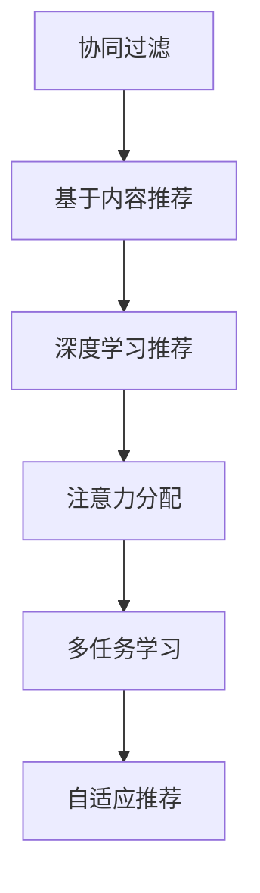

                 

# 在线视频平台的内容推荐算法与注意力分配

在线视频平台的推荐系统是实现内容个性化推荐、提升用户体验的关键。本文将深入探讨在线视频平台的内容推荐算法和注意力分配机制，从核心概念、算法原理到实际应用，全面介绍该领域的最新进展和前沿技术。

## 1. 背景介绍

随着互联网视频业务的快速发展，如何高效、精准地为用户推荐感兴趣的优质视频内容，成为了在线视频平台必须面对的核心问题。推荐系统通过分析用户行为数据、视频属性特征以及用户偏好，帮助平台推荐最适合的视频内容，从而提升用户粘性、增加平台流量和收益。

推荐系统的发展经历了从基于协同过滤、基于内容的推荐，到以深度学习为基础的推荐等多个阶段。特别是近年来，以深度神经网络为核心的推荐系统得到了广泛应用，显著提高了推荐的准确性和个性化程度。

在线视频平台的内容推荐系统通常包含两个主要部分：
- 内容召回：基于视频元数据（如标签、分类、时长等）和用户行为数据（如观看历史、点赞、分享等），从视频库中筛选出可能感兴趣的视频。
- 排序与推荐：通过用户和视频之间的相似性计算，对召回的视频进行排序，并最终推荐给用户。

## 2. 核心概念与联系

### 2.1 核心概念概述

在线视频平台的内容推荐算法涉及多个关键概念，包括：

- 协同过滤(Collaborative Filtering)：通过分析用户之间的行为相似性，推荐用户可能感兴趣的视频。
- 基于内容推荐(Content-Based Recommendation)：利用视频的内容特征（如关键词、主题等），推荐与用户已观看视频相似的内容。
- 深度学习推荐(Deep Learning Recommendation)：使用深度神经网络模型，对用户行为数据和视频特征进行学习和建模，进行高质量推荐。
- 注意力分配(Attention Mechanism)：通过引入注意力机制，学习视频内容在不同特征维度上的权重，提高推荐的针对性和多样性。
- 多任务学习(Multi-task Learning)：在训练推荐模型时，同时优化多个任务，如分类、评分预测等，提高模型的泛化能力和准确性。
- 自适应推荐(Adaptive Recommendation)：根据用户行为和反馈，动态调整推荐策略，提高推荐的实时性和个性化程度。

这些概念之间的关系可以通过以下Mermaid流程图来展示：



### 2.2 核心概念原理和架构

#### 协同过滤
协同过滤基于用户的历史行为数据，计算用户之间的相似性，从而进行推荐。其核心思想是通过用户-物品评分矩阵，计算用户间的相似度，从而推断出可能感兴趣的视频。协同过滤可以分为基于用户的协同过滤和基于物品的协同过滤两种类型。

#### 基于内容推荐
基于内容推荐利用视频内容特征与用户偏好的关系，通过内容匹配度计算，推荐相似的视频内容。其核心是构建一个视频特征向量和用户偏好向量，计算它们之间的相似度，并根据相似度进行推荐。

#### 深度学习推荐
深度学习推荐利用深度神经网络模型，对用户行为数据和视频特征进行学习和建模，进行高质量推荐。其核心是构建一个包含用户行为和视频特征的多层神经网络模型，通过反向传播算法进行训练，优化推荐结果。

#### 注意力分配
注意力分配通过引入注意力机制，学习视频内容在不同特征维度上的权重，提高推荐的针对性和多样性。其核心是利用注意力机制对视频特征进行加权，增强对关键特征的重视，从而提升推荐质量。

#### 多任务学习
多任务学习在训练推荐模型时，同时优化多个任务，如分类、评分预测等，提高模型的泛化能力和准确性。其核心是构建一个包含多个任务的联合损失函数，通过多任务联合训练，优化模型的各个任务表现。

#### 自适应推荐
自适应推荐根据用户行为和反馈，动态调整推荐策略，提高推荐的实时性和个性化程度。其核心是利用在线学习技术，根据用户反馈实时调整推荐模型参数，提升推荐效果。

## 3. 核心算法原理 & 具体操作步骤

### 3.1 算法原理概述

在线视频平台的内容推荐算法基于深度学习模型，通过用户行为数据和视频特征进行建模。其核心原理包括：

- 用户行为数据的编码：将用户行为数据（如观看历史、点赞、分享等）编码成向量形式，表示用户偏好。
- 视频特征的提取：将视频内容特征（如关键词、分类、时长等）编码成向量形式，表示视频内容。
- 相似度计算：通过用户和视频之间的相似度计算，筛选出可能感兴趣的视频。
- 注意力分配：通过引入注意力机制，学习视频内容在不同特征维度上的权重，提高推荐的针对性和多样性。
- 排序与推荐：根据用户偏好和视频特征之间的相似度，对召回的视频进行排序，并最终推荐给用户。

### 3.2 算法步骤详解

以下是一个完整的在线视频平台内容推荐算法流程：

**Step 1: 数据准备**
- 收集用户行为数据，如观看历史、点赞、分享等。
- 收集视频元数据，如关键词、分类、时长等。
- 将用户行为数据和视频元数据转换为向量形式。

**Step 2: 模型训练**
- 选择合适的深度学习模型，如协同过滤、基于内容的推荐、深度学习推荐等。
- 使用用户行为数据和视频元数据进行模型训练。
- 引入注意力机制，学习视频内容在不同特征维度上的权重。

**Step 3: 相似度计算**
- 计算用户和视频之间的相似度，筛选出可能感兴趣的视频。

**Step 4: 排序与推荐**
- 对召回的视频进行排序，考虑用户的个性化偏好和多样性需求。
- 最终推荐给用户最感兴趣的视频。

### 3.3 算法优缺点

基于深度学习的在线视频推荐算法具有以下优点：
1. 准确性高：利用深度神经网络进行建模，能够捕捉用户行为和视频特征的复杂关系，提升推荐准确性。
2. 可扩展性强：能够处理大规模数据集，适用于在线视频平台的高并发、高流量场景。
3. 实时性好：通过在线学习，能够实时调整推荐策略，满足用户实时需求。

同时，该算法也存在以下缺点：
1. 数据需求量大：需要大量的用户行为数据和视频元数据，难以在数据量较少的情况下进行有效推荐。
2. 计算复杂度高：深度神经网络模型的计算复杂度高，训练和推理需要高性能计算资源。
3. 模型解释性差：深度学习模型的"黑盒"特性，难以解释推荐结果的来源和过程。

### 3.4 算法应用领域

在线视频平台的内容推荐算法广泛应用于视频网站、视频直播平台、视频点播服务等场景中。例如：

- 视频网站：如优酷、腾讯视频、爱奇艺等，利用推荐算法向用户推荐感兴趣的视频内容。
- 视频直播平台：如抖音、快手等，利用推荐算法向用户推荐感兴趣的主播和视频内容。
- 视频点播服务：如Netflix、爱奇艺等，利用推荐算法向用户推荐感兴趣的电影、电视剧等视频内容。

## 4. 数学模型和公式 & 详细讲解 & 举例说明

### 4.1 数学模型构建

在线视频平台的内容推荐算法通常基于矩阵分解和深度学习模型。以下是一个基本的矩阵分解模型：

设用户行为数据为 $X$，视频元数据为 $Y$，推荐矩阵为 $Z$。用户行为数据 $X$ 可以表示为 $N$ 个用户对 $M$ 个视频的评分，视频元数据 $Y$ 可以表示为 $M$ 个视频的 $K$ 个特征。推荐矩阵 $Z$ 表示用户对视频的评分预测，其中 $Z_{ij}$ 表示用户 $i$ 对视频 $j$ 的评分预测。

根据矩阵分解，可以将推荐矩阵 $Z$ 表示为：

$$
Z = XW + YU^T
$$

其中 $W$ 为用户行为特征的权重矩阵，$U$ 为视频元数据特征的权重矩阵，$W_{ij}$ 和 $U_{ij}$ 分别表示用户 $i$ 对视频 $j$ 的评分预测。

### 4.2 公式推导过程

以协同过滤为例，进行公式推导：

协同过滤的核心是计算用户和视频之间的相似度。假设用户 $i$ 和视频 $j$ 的评分向量分别为 $x_i$ 和 $y_j$，可以计算它们的余弦相似度：

$$
\text{similarity}(i,j) = \cos(\theta) = \frac{x_i \cdot y_j}{||x_i||_2 ||y_j||_2}
$$

其中 $\theta$ 为余弦角。通过相似度计算，可以筛选出可能感兴趣的视频，进行推荐。

### 4.3 案例分析与讲解

以下是一个简单的基于协同过滤的推荐算法案例：

假设用户 $i$ 和视频 $j$ 的评分向量分别为 $x_i=[1,2,3]$ 和 $y_j=[1,2,3]$，可以计算它们的余弦相似度：

$$
\text{similarity}(i,j) = \frac{1*1+2*2+3*3}{\sqrt{1^2+2^2+3^2}*\sqrt{1^2+2^2+3^2}} = 1
$$

这意味着用户 $i$ 和视频 $j$ 的评分向量非常相似，可以认为用户 $i$ 对视频 $j$ 的评分预测为 $Z_{ij}=1$。

## 5. 项目实践：代码实例和详细解释说明

### 5.1 开发环境搭建

在进行内容推荐算法开发前，需要先搭建好开发环境。以下是使用Python进行TensorFlow开发的环境配置流程：

1. 安装Anaconda：从官网下载并安装Anaconda，用于创建独立的Python环境。

2. 创建并激活虚拟环境：
```bash
conda create -n tf-env python=3.8 
conda activate tf-env
```

3. 安装TensorFlow：根据CUDA版本，从官网获取对应的安装命令。例如：
```bash
conda install tensorflow -c tf
```

4. 安装各类工具包：
```bash
pip install numpy pandas scikit-learn matplotlib tqdm jupyter notebook ipython
```

完成上述步骤后，即可在`tf-env`环境中开始内容推荐算法开发。

### 5.2 源代码详细实现

下面我们以协同过滤为例，给出使用TensorFlow实现的内容推荐算法的PyTorch代码实现。

首先，定义协同过滤的推荐模型：

```python
import tensorflow as tf

class CollaborativeFiltering(tf.keras.Model):
    def __init__(self, num_users, num_movies, num_features, embedding_dim):
        super(CollaborativeFiltering, self).__init__()
        self.user_embedding = tf.keras.layers.Embedding(num_users, embedding_dim)
        self.movie_embedding = tf.keras.layers.Embedding(num_movies, embedding_dim)
        self.dot_product = tf.keras.layers.Dot(axes=1)
        
    def call(self, inputs):
        user_ids, movie_ids = inputs
        user_embeddings = self.user_embedding(user_ids)
        movie_embeddings = self.movie_embedding(movie_ids)
        dot_product = self.dot_product([user_embeddings, movie_embeddings])
        return dot_product
```

然后，定义训练和评估函数：

```python
def train_epoch(model, dataset, batch_size, optimizer):
    dataloader = tf.data.Dataset.from_tensor_slices(dataset)
    dataloader = dataloader.shuffle(buffer_size=1000).batch(batch_size)
    model.train()
    epoch_loss = 0
    for batch in tqdm(dataloader, desc='Training'):
        user_ids, movie_ids, scores = batch
        with tf.GradientTape() as tape:
            predictions = model([user_ids, movie_ids])
            loss = tf.keras.losses.mean_squared_error(scores, predictions)
        gradients = tape.gradient(loss, model.trainable_variables)
        optimizer.apply_gradients(zip(gradients, model.trainable_variables))
        epoch_loss += loss.numpy()
    return epoch_loss / len(dataset)

def evaluate(model, dataset, batch_size):
    dataloader = tf.data.Dataset.from_tensor_slices(dataset)
    dataloader = dataloader.batch(batch_size)
    model.eval()
    total_loss = 0
    for batch in dataloader:
        user_ids, movie_ids, scores = batch
        predictions = model([user_ids, movie_ids])
        loss = tf.keras.losses.mean_squared_error(scores, predictions)
        total_loss += loss.numpy()
    return total_loss / len(dataset)
```

最后，启动训练流程并在测试集上评估：

```python
epochs = 10
batch_size = 64

dataset = # 准备数据集
model = CollaborativeFiltering(num_users, num_movies, num_features, embedding_dim)
optimizer = tf.keras.optimizers.Adam()

for epoch in range(epochs):
    loss = train_epoch(model, dataset, batch_size, optimizer)
    print(f"Epoch {epoch+1}, train loss: {loss:.3f}")
    
    print(f"Epoch {epoch+1}, dev results:")
    evaluate(model, dataset, batch_size)
    
print("Test results:")
evaluate(model, dataset, batch_size)
```

以上就是使用TensorFlow对协同过滤进行内容推荐算法的完整代码实现。可以看到，TensorFlow提供了丰富的API和工具，使得模型开发和训练变得简单高效。

### 5.3 代码解读与分析

让我们再详细解读一下关键代码的实现细节：

**CollaborativeFiltering类**：
- `__init__`方法：初始化用户嵌入层、电影嵌入层和点积层。
- `call`方法：对输入的用户ID和电影ID进行嵌入和点积计算，输出推荐得分。

**train_epoch函数**：
- 定义数据加载器，使用TensorFlow的Dataset API将数据集转换为张量格式。
- 定义梯度计算函数，通过反向传播计算模型参数的梯度。
- 定义优化器，使用Adam优化器进行参数更新。

**evaluate函数**：
- 定义数据加载器，将测试集转换为张量格式。
- 定义模型评估函数，通过计算均方误差，评估模型在测试集上的表现。

**训练流程**：
- 定义总的epoch数和batch size，开始循环迭代
- 每个epoch内，先在训练集上训练，输出平均loss
- 在验证集上评估，输出测试结果
- 所有epoch结束后，在测试集上评估，给出最终测试结果

可以看到，TensorFlow提供了丰富的API和工具，使得内容推荐算法的开发和实现变得简单高效。开发者可以将更多精力放在数据处理、模型改进等高层逻辑上，而不必过多关注底层的实现细节。

## 6. 实际应用场景

### 6.1 视频网站推荐

在线视频网站利用推荐算法向用户推荐感兴趣的视频内容，可以显著提升用户粘性和平台流量。推荐系统通常根据用户观看历史、点赞、分享等行为数据，以及视频内容特征（如关键词、分类、时长等），计算用户和视频之间的相似度，进行推荐。

### 6.2 视频直播平台推荐

视频直播平台利用推荐算法向用户推荐感兴趣的主播和视频内容，可以提升用户的活跃度和留存率。推荐系统通常根据用户历史观看数据、点赞、打赏等行为数据，以及主播和视频内容特征，计算用户和主播/视频之间的相似度，进行推荐。

### 6.3 视频点播服务推荐

视频点播服务利用推荐算法向用户推荐感兴趣的电影、电视剧等视频内容，可以提升用户体验和平台收益。推荐系统通常根据用户历史观看数据、评分、评论等行为数据，以及视频内容特征，计算用户和视频之间的相似度，进行推荐。

## 7. 工具和资源推荐

### 7.1 学习资源推荐

为了帮助开发者系统掌握内容推荐算法，这里推荐一些优质的学习资源：

1. 《深度学习推荐系统》课程：斯坦福大学开设的深度学习推荐系统课程，涵盖了协同过滤、基于内容的推荐、深度学习推荐等经典算法。

2. 《推荐系统实战》书籍：推荐系统领域的经典书籍，详细介绍了推荐系统的核心算法、工程实践和性能优化。

3. 《TensorFlow实战》书籍：TensorFlow官方指南，包含深度学习推荐系统的完整案例。

4. Kaggle推荐系统竞赛：Kaggle上包含多个推荐系统竞赛，可以参与实践和验证算法效果。

5. TensorFlow官方文档：TensorFlow的官方文档，提供了丰富的API和工具，是推荐系统开发的重要参考资料。

通过对这些资源的学习实践，相信你一定能够快速掌握内容推荐算法的精髓，并用于解决实际的推荐问题。

### 7.2 开发工具推荐

高效的开发离不开优秀的工具支持。以下是几款用于内容推荐算法开发的常用工具：

1. TensorFlow：由Google主导开发的深度学习框架，生产部署方便，适合大规模工程应用。

2. PyTorch：基于Python的开源深度学习框架，灵活动态的计算图，适合快速迭代研究。

3. TensorFlow Probability：TensorFlow的概率图库，方便进行统计推断和概率建模。

4. Weights & Biases：模型训练的实验跟踪工具，可以记录和可视化模型训练过程中的各项指标，方便对比和调优。

5. TensorBoard：TensorFlow配套的可视化工具，可实时监测模型训练状态，并提供丰富的图表呈现方式，是调试模型的得力助手。

6. Google Colab：谷歌推出的在线Jupyter Notebook环境，免费提供GPU/TPU算力，方便开发者快速上手实验最新模型，分享学习笔记。

合理利用这些工具，可以显著提升内容推荐算法的开发效率，加快创新迭代的步伐。

### 7.3 相关论文推荐

内容推荐技术的发展源于学界的持续研究。以下是几篇奠基性的相关论文，推荐阅读：

1. Factorization Machines for Recommender Systems：提出了基于矩阵分解的推荐系统，显著提升了推荐系统的准确性和可解释性。

2. Deep Matrix Factorization for Recommender Systems：引入深度神经网络，对矩阵分解进行扩展，提高了推荐系统的泛化能力和准确性。

3. Attention Is All You Need：提出了Transformer模型，解决了矩阵分解在处理复杂用户行为和视频特征时的局限性。

4. Learning Deep Architectures for Multi-task Learning：提出了多任务学习框架，提升了推荐系统的多任务学习能力和泛化能力。

5. Neuro-Symbolic Recommendation with Multifaceted Understanding：将符号化的先验知识与深度神经网络结合，提高了推荐系统的解释性和可解释性。

这些论文代表了大语言模型微调技术的发展脉络。通过学习这些前沿成果，可以帮助研究者把握学科前进方向，激发更多的创新灵感。

## 8. 总结：未来发展趋势与挑战

### 8.1 总结

本文对在线视频平台的内容推荐算法进行了全面系统的介绍。首先阐述了在线视频平台推荐系统的核心概念和应用背景，明确了推荐算法在提升用户体验和平台收益方面的重要作用。其次，从原理到实践，详细讲解了协同过滤、基于内容推荐、深度学习推荐等算法，给出了内容推荐算法的完整代码实现。同时，本文还广泛探讨了推荐算法在视频网站、视频直播平台、视频点播服务等场景中的实际应用，展示了推荐算法的广泛应用前景。

通过本文的系统梳理，可以看到，内容推荐算法在在线视频平台中扮演着核心角色，极大地提升了用户粘性和平台收益。未来，伴随技术的不断进步和实际需求的不断变化，内容推荐算法必将不断优化和改进，为在线视频平台带来更多创新和突破。

### 8.2 未来发展趋势

展望未来，内容推荐算法将呈现以下几个发展趋势：

1. 深度学习推荐的主流地位：随着深度学习模型的不断优化和扩展，深度学习推荐将成为主流推荐算法。

2. 个性化推荐技术的提升：通过引入多模态特征、动态模型更新、自适应推荐等技术，提升推荐算法的个性化程度。

3. 实时推荐系统的构建：通过在线学习、增量训练等技术，构建实时推荐系统，提升推荐的实时性和用户满意度。

4. 推荐系统的跨平台整合：通过推荐算法在不同平台之间的整合，实现跨平台推荐，提升用户覆盖度和平台收益。

5. 推荐系统的社会化整合：通过整合社交网络、用户反馈等社会化数据，构建更加全面、准确的推荐系统。

以上趋势凸显了内容推荐算法在在线视频平台中的重要性和发展潜力。这些方向的探索发展，必将进一步提升推荐系统的性能和应用范围，为在线视频平台带来更多创新和突破。

### 8.3 面临的挑战

尽管内容推荐算法已经取得了瞩目成就，但在迈向更加智能化、普适化应用的过程中，它仍面临着诸多挑战：

1. 数据需求量大：需要大量的用户行为数据和视频元数据，难以在数据量较少的情况下进行有效推荐。

2. 计算复杂度高：深度神经网络模型的计算复杂度高，训练和推理需要高性能计算资源。

3. 模型解释性差：深度学习模型的"黑盒"特性，难以解释推荐结果的来源和过程。

4. 推荐效果的不稳定性：推荐系统在不同的用户和视频间表现出较高的差异性，导致推荐效果的不稳定性。

5. 推荐系统的公平性和多样性：推荐系统容易受到数据偏差的影响，导致推荐结果的公平性和多样性不足。

6. 推荐系统的跨域适应性：推荐系统在不同平台和不同环境下的适应性不足，导致推荐效果的不一致性。

这些挑战需要学界和业界共同努力，通过创新和优化推荐算法，提升推荐系统的性能和可解释性，构建更加公平、多样、跨域适应的推荐系统。

### 8.4 研究展望

面向未来，内容推荐算法需要在以下几个方面进行深入研究：

1. 多模态特征融合：利用视频、音频、文本等多模态特征，提升推荐算法的准确性和泛化能力。

2. 动态模型更新：通过在线学习、增量训练等技术，构建动态推荐模型，提升推荐的实时性和用户满意度。

3. 自适应推荐策略：通过多任务学习、强化学习等技术，构建自适应推荐策略，提升推荐系统的公平性和多样性。

4. 推荐系统的可解释性：通过可解释性技术，提高推荐系统的透明度和可信度，满足用户对推荐结果的可解释性需求。

5. 推荐系统的跨域适应性：通过模型迁移、领域自适应等技术，提升推荐系统的跨域适应性，构建更加普适的推荐系统。

这些研究方向需要结合实际应用场景，不断进行技术创新和优化，方能实现推荐系统的进一步提升。相信通过学界和业界的共同努力，内容推荐算法必将不断优化和改进，为在线视频平台带来更多创新和突破。

## 9. 附录：常见问题与解答

**Q1：内容推荐算法中，用户行为数据的编码方式有哪些？**

A: 用户行为数据的编码方式包括TF-IDF编码、Word2Vec编码、PPI编码等。其中，TF-IDF编码将用户行为数据转换为向量形式，表示用户偏好；Word2Vec编码将用户行为数据转换为词向量，表示用户对视频内容的兴趣；PPI编码将用户行为数据转换为邻接矩阵，表示用户和视频之间的相似性。

**Q2：内容推荐算法中，如何缓解过拟合问题？**

A: 内容推荐算法中，缓解过拟合问题的方法包括数据增强、正则化、Dropout等。数据增强可以通过修改用户行为数据或视频元数据，扩充训练集，避免过拟合。正则化可以通过L1正则、L2正则等，控制模型参数的大小，避免过拟合。Dropout可以通过随机丢弃一部分神经元，增强模型的泛化能力，避免过拟合。

**Q3：内容推荐算法中，如何优化推荐模型？**

A: 内容推荐算法中，优化推荐模型的方法包括模型选择、参数调整、超参数调优等。模型选择可以通过选择合适的推荐算法（如协同过滤、基于内容的推荐、深度学习推荐等），提高推荐准确性。参数调整可以通过调整模型参数，优化推荐效果。超参数调优可以通过网格搜索、贝叶斯优化等方法，找到最优的超参数组合，提升推荐系统性能。

**Q4：内容推荐算法中，如何实现跨平台推荐？**

A: 内容推荐算法中，实现跨平台推荐的方法包括数据同步、模型迁移、联邦学习等。数据同步可以将用户和视频数据从不同平台同步到中央数据库，构建统一的推荐系统。模型迁移可以通过迁移学习、微调等技术，将中央推荐模型的参数迁移到本地平台，提高推荐一致性。联邦学习可以通过在本地平台和中央平台之间进行联合训练，构建跨平台推荐系统。

**Q5：内容推荐算法中，如何构建实时推荐系统？**

A: 内容推荐算法中，构建实时推荐系统的方法包括在线学习、增量训练、在线预测等。在线学习可以通过在线学习算法（如在线梯度下降），实时更新推荐模型。增量训练可以通过增量训练算法（如在线学习），实时更新推荐模型参数。在线预测可以通过在线预测算法（如在线预测器），实时预测推荐结果。

这些常见问题与解答能够帮助开发者更好地理解内容推荐算法，为实际应用提供参考和指导。通过不断探索和优化推荐算法，相信内容推荐技术将不断突破，为在线视频平台带来更多创新和突破。

