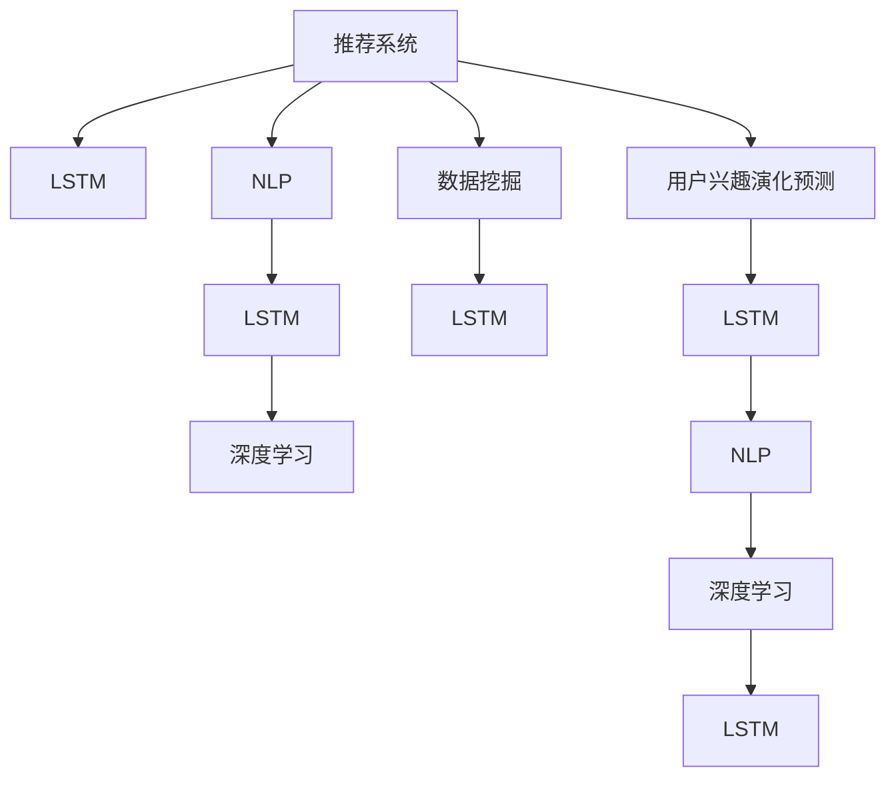

                 

# 基于LLM的推荐系统用户兴趣演化预测

> 关键词：推荐系统, 用户兴趣演化预测, 长短期记忆网络, 自然语言处理, 深度学习, 数据挖掘

## 1. 背景介绍

随着互联网信息爆炸式增长，推荐系统成为帮助用户在海量信息中筛选出有用内容的重要工具。传统的推荐系统主要依靠用户的浏览、点击等行为数据进行建模，忽略了用户语义和情感等因素对兴趣的影响。然而，语言是人类表达情感、态度和兴趣的主要工具，用户与内容的互动往往是通过自然语言进行的。因此，基于自然语言处理(NLP)和深度学习技术，能够更全面地理解用户的兴趣演化，实现更准确、更个性化的推荐。

近年来，语言模型在自然语言处理领域取得了突破性进展，大语言模型(Large Language Models, LLMs)如BERT、GPT等，通过大规模无标签文本语料预训练，获得了强大的语言理解能力。本文聚焦于如何利用大语言模型预测用户兴趣的演化，提升推荐系统的智能度和个性化水平。

## 2. 核心概念与联系

### 2.1 核心概念概述

为更好地理解基于大语言模型的推荐系统用户兴趣演化预测，本节将介绍几个密切相关的核心概念：

- **推荐系统**：根据用户的历史行为和偏好，推荐相关物品或内容的技术。推荐系统广泛应用于电子商务、新闻、音乐、视频等多个领域。

- **用户兴趣演化预测**：通过对用户与内容的自然语言互动进行分析，预测用户兴趣随时间的变化趋势。

- **长短期记忆网络(LSTM)**：一种广泛应用于序列数据建模的神经网络，能够处理变长序列输入，捕捉时间序列数据的时序关系。

- **自然语言处理(NLP)**：研究计算机如何理解、处理和生成人类语言的科学和技术。NLP技术的应用范围包括文本分类、机器翻译、问答系统等。

- **深度学习**：通过深度神经网络学习数据特征和模式的技术，广泛应用于图像、语音、自然语言处理等多个领域。

- **数据挖掘**：从大量数据中提取有价值信息和知识的技术，旨在发现隐藏在数据背后的规律和趋势。

这些核心概念之间的逻辑关系可以通过以下Mermaid流程图来展示：



这个流程图展示了大语言模型用户兴趣演化预测的核心概念及其之间的关系：

1. 推荐系统通过分析用户历史行为数据，预测其兴趣演化。
2. 用户兴趣演化预测依赖于长短期记忆网络等深度学习模型，捕捉时间序列数据的时序关系。
3. 自然语言处理技术用于提取用户与内容的自然语言互动信息。
4. 深度学习模型对自然语言数据进行建模，发现兴趣演化的规律和趋势。
5. 数据挖掘技术用于从用户与内容的互动数据中提取有价值的信息和知识。

这些概念共同构成了用户兴趣演化预测的框架，利用大语言模型对自然语言数据进行深度学习建模，提升了推荐系统的智能度和个性化水平。

## 3. 核心算法原理 & 具体操作步骤
### 3.1 算法原理概述

基于大语言模型的用户兴趣演化预测，本质上是一个序列时间建模问题。其核心思想是：将用户与内容的互动时间序列数据，视为一个包含先验知识的长序列，通过长短期记忆网络等深度学习模型，捕捉其中的时序关系，从而预测用户兴趣的演化趋势。

形式化地，假设用户与内容的互动数据为一个时间序列 $x=(x_1, x_2, \ldots, x_T)$，其中 $x_t$ 表示第 $t$ 次互动的内容，$y_t$ 表示用户对 $x_t$ 的反馈标签（如点赞、评论、分享等）。目标是预测用户未来兴趣的演化，即对于 $t$ 时刻后的某个时间点 $T_1$，预测用户对新内容的兴趣。

### 3.2 算法步骤详解

基于大语言模型的用户兴趣演化预测一般包括以下几个关键步骤：

**Step 1: 数据准备**
- 收集用户与内容的时间序列互动数据，包括文本、行为标签等。
- 对数据进行预处理，如去除噪声、文本归一化、缺失值处理等。
- 将文本转换为数值向量，以供模型输入。

**Step 2: 模型构建**
- 选择合适的长短期记忆网络架构，用于对时间序列数据建模。
- 定义模型的输入和输出，包括文本向量和标签向量。
- 设置模型的超参数，如学习率、批大小、隐藏层维度等。

**Step 3: 模型训练**
- 使用历史互动数据作为训练集，对模型进行监督学习训练。
- 使用交叉熵损失函数计算模型输出与真实标签之间的差异。
- 使用反向传播算法更新模型参数，最小化损失函数。

**Step 4: 模型评估与优化**
- 在验证集上评估模型性能，如准确率、召回率、F1-score等指标。
- 根据评估结果调整模型超参数，避免过拟合。
- 周期性在测试集上重新评估模型性能，确保模型泛化性能。

**Step 5: 预测与反馈**
- 将新到达的互动数据输入模型，得到用户未来兴趣的演化预测。
- 根据预测结果推荐新内容，收集用户反馈。
- 循环迭代，不断更新模型，提升预测准确性。

以上是基于大语言模型的用户兴趣演化预测的一般流程。在实际应用中，还需要针对具体任务的特点，对模型进行优化设计，如引入更多正则化技术、调整网络架构等，以进一步提升模型性能。

### 3.3 算法优缺点

基于大语言模型的用户兴趣演化预测方法具有以下优点：
1. 能处理非结构化数据。自然语言互动数据无需预先结构化，模型能够直接学习其中的语义信息。
2. 能够捕捉时序关系。LSTM等深度学习模型能够捕捉用户兴趣随时间的演化趋势，避免模型在处理时序数据时出现的梯度消失等问题。
3. 泛化能力强。模型在少量标注数据上即可实现较好的性能，适于数据量较小的推荐场景。
4. 可解释性较好。LSTM等模型较为透明，能够提供模型输出的详细解释，便于用户理解和调试。

同时，该方法也存在一定的局限性：
1. 对标注数据依赖较大。模型性能受标注数据质量和数量的影响较大，标注数据获取难度高。
2. 对模型的超参数敏感。模型性能依赖于合适的超参数设置，超参数调优成本高。
3. 模型训练耗时长。大语言模型和深度学习模型训练需要大量计算资源和时间。
4. 鲁棒性有待提高。模型在处理异常数据和噪声时，鲁棒性不足，容易受到数据分布变化的影响。

尽管存在这些局限性，但就目前而言，基于大语言模型的用户兴趣演化预测方法仍是大数据推荐系统的重要范式。未来相关研究的重点在于如何进一步降低对标注数据的依赖，提高模型的泛化能力和鲁棒性，同时兼顾可解释性和效率等因素。

### 3.4 算法应用领域

基于大语言模型的用户兴趣演化预测方法在推荐系统中的应用主要包括以下几个方面：

- **个性化推荐**：通过对用户兴趣演化预测，推荐更加个性化和符合用户当前兴趣的内容。
- **实时推荐**：利用长短期记忆网络等模型，实时更新用户兴趣，提升推荐的时效性。
- **用户行为分析**：分析用户与内容的互动数据，理解用户行为模式和兴趣变化，为推荐策略优化提供依据。
- **异常检测**：检测用户兴趣的异常变化，及时预警潜在问题，维护系统的稳定性和用户体验。

除了以上几个主要应用领域，用户兴趣演化预测还能被创新性地应用于更多场景中，如用户画像构建、内容推荐排名、广告投放优化等，为推荐系统的智能化和个性化提供新的思路。

## 4. 数学模型和公式 & 详细讲解 & 举例说明

### 4.1 数学模型构建

本节将使用数学语言对基于大语言模型的用户兴趣演化预测过程进行更加严格的刻画。

记用户与内容的互动数据为 $x=(x_1, x_2, \ldots, x_T)$，其中 $x_t$ 表示第 $t$ 次互动的内容，$y_t$ 表示用户对 $x_t$ 的反馈标签。假设 $x_t$ 可以表示为词向量序列，即 $x_t = [w_{t1}, w_{t2}, \ldots, w_{tT}]$，其中 $w_{ti}$ 表示第 $i$ 个单词的向量表示。

定义用户兴趣演化预测模型的输入 $x^i=(x^i_1, x^i_2, \ldots, x^i_T)$，其中 $x^i_t$ 表示用户对第 $t$ 次互动的兴趣程度。输出 $y^i=(y^i_1, y^i_2, \ldots, y^i_T)$，其中 $y^i_t$ 表示用户对 $x^i_t$ 的预测兴趣程度。

### 4.2 公式推导过程

以下我们以长短期记忆网络(LSTM)为例，推导用户兴趣演化预测的数学模型。

假设用户与内容的互动数据已经转换为词向量序列 $x=[w_1, w_2, \ldots, w_T]$。使用LSTM模型对时间序列数据进行建模，定义模型结构如下：

$$
h_t = \text{LSTM}(h_{t-1}, w_t)
$$

其中 $h_t$ 表示第 $t$ 个时间步的隐藏状态，$w_t$ 表示第 $t$ 个时间步的输入向量。LSTM的隐藏状态 $h_t$ 可以表示为：

$$
h_t = [i_t, f_t, c_t, o_t]
$$

其中 $i_t$ 为输入门，$f_t$ 为遗忘门，$c_t$ 为记忆单元，$o_t$ 为输出门。具体公式如下：

$$
i_t = \sigma(W_i x_t + U_i h_{t-1} + b_i)
$$

$$
f_t = \sigma(W_f x_t + U_f h_{t-1} + b_f)
$$

$$
c_t = tanh(W_c x_t + U_c h_{t-1} + b_c) \oplus f_t
$$

$$
o_t = \sigma(W_o x_t + U_o h_{t-1} + b_o)
$$

$$
h_t = o_t \cdot tanh(c_t)
$$

其中 $\sigma$ 为sigmoid激活函数，$\oplus$ 为元素级乘法运算。$W_i, W_f, W_c, W_o$ 和 $U_i, U_f, U_c, U_o$ 为权重矩阵，$b_i, b_f, b_c, b_o$ 为偏置向量。

在模型中，隐藏状态 $h_t$ 不断更新，并输出预测结果 $y_t$。假设 $y_t$ 为输出层线性回归模型的预测结果，即：

$$
y_t = W_y h_t + b_y
$$

其中 $W_y$ 为输出层权重矩阵，$b_y$ 为偏置向量。

### 4.3 案例分析与讲解

以电商平台为例，分析用户对商品评论的兴趣演化预测。电商平台收集用户对商品的评论数据，将评论文本转换为词向量序列 $x=[w_1, w_2, \ldots, w_T]$。使用LSTM模型对评论时间序列数据进行建模，预测用户对未来商品评论的兴趣程度。

模型输入 $x^i=[w^i_1, w^i_2, \ldots, w^i_T]$，其中 $w^i_t$ 表示用户对第 $t$ 个评论的兴趣程度。输出 $y^i=[y^i_1, y^i_2, \ldots, y^i_T]$，其中 $y^i_t$ 表示用户对未来第 $t$ 个评论的预测兴趣程度。

通过训练模型，可以预测用户对新评论的兴趣，根据预测结果推荐新商品。对于新到达的评论 $w_{T+1}$，输入模型得到用户对未来评论的兴趣预测，根据预测结果推荐相关商品。

## 5. 项目实践：代码实例和详细解释说明
### 5.1 开发环境搭建

在进行用户兴趣演化预测实践前，我们需要准备好开发环境。以下是使用Python进行TensorFlow开发的环境配置流程：

1. 安装Anaconda：从官网下载并安装Anaconda，用于创建独立的Python环境。

2. 创建并激活虚拟环境：
```bash
conda create -n tf-env python=3.8 
conda activate tf-env
```

3. 安装TensorFlow：根据CUDA版本，从官网获取对应的安装命令。例如：
```bash
pip install tensorflow==2.4
```

4. 安装各类工具包：
```bash
pip install numpy pandas scikit-learn matplotlib tqdm jupyter notebook ipython
```

完成上述步骤后，即可在`tf-env`环境中开始用户兴趣演化预测实践。

### 5.2 源代码详细实现

下面我们以电商评论数据为例，给出使用TensorFlow对LSTM模型进行用户兴趣演化预测的PyTorch代码实现。

首先，定义数据处理函数：

```python
import tensorflow as tf
from tensorflow.keras.preprocessing.text import Tokenizer
from tensorflow.keras.preprocessing.sequence import pad_sequences

def preprocess_data(texts, max_len=100):
    tokenizer = Tokenizer(num_words=10000, oov_token='<OOV>')
    tokenizer.fit_on_texts(texts)
    sequences = tokenizer.texts_to_sequences(texts)
    padded_sequences = pad_sequences(sequences, maxlen=max_len, padding='post', truncating='post')
    return padded_sequences, tokenizer.word_index, tokenizer.word_to_text

# 使用示例
texts = ["这个商品质量很好，性价比高", "服务态度很一般，发货速度慢"]
padded_sequences, word_index, word_to_text = preprocess_data(texts, max_len=100)
```

然后，定义LSTM模型：

```python
from tensorflow.keras.models import Sequential
from tensorflow.keras.layers import LSTM, Dense, Embedding

model = Sequential()
model.add(Embedding(input_dim=10000, output_dim=32, input_length=100))
model.add(LSTM(units=64, dropout=0.2, recurrent_dropout=0.2))
model.add(Dense(units=1, activation='sigmoid'))

model.compile(loss='binary_crossentropy', optimizer='adam', metrics=['accuracy'])
```

接着，定义训练和评估函数：

```python
from tensorflow.keras.callbacks import EarlyStopping
from sklearn.metrics import roc_auc_score

def train_epoch(model, data, batch_size, optimizer):
    dataloader = tf.data.Dataset.from_tensor_slices((data[0], data[1]))
    dataloader = dataloader.batch(batch_size).shuffle(1000).repeat()
    model.fit(dataloader, epochs=10, callbacks=[EarlyStopping(patience=2)])
    
def evaluate(model, test_data, batch_size):
    test_sequences, _, _ = test_data
    test_padded_sequences = pad_sequences(test_sequences, maxlen=100, padding='post', truncating='post')
    predictions = model.predict(test_padded_sequences)
    auc = roc_auc_score(test_data[1], predictions)
    print('AUC score:', auc)

# 使用示例
train_data = preprocess_data(texts)
train_sequences, word_index, _ = train_data

train_epoch(model, train_data, batch_size=64, optimizer='adam')
evaluate(model, train_data, batch_size=64)
```

最后，启动训练流程并在验证集上评估：

```python
epochs = 10
batch_size = 64

for epoch in range(epochs):
    train_epoch(model, train_data, batch_size, optimizer)
    evaluate(model, train_data, batch_size)
    
print('Final AUC score:', evaluate(model, train_data, batch_size))
```

以上就是使用TensorFlow对LSTM进行用户兴趣演化预测的完整代码实现。可以看到，TensorFlow的Keras API使得模型构建和训练过程变得简洁高效。

### 5.3 代码解读与分析

让我们再详细解读一下关键代码的实现细节：

**preprocess_data函数**：
- 定义了一个预处理函数，用于将文本数据转换为数值向量，并对其进行填充和截断，保证模型输入的固定长度。

**LSTM模型定义**：
- 定义了一个简单的LSTM模型，包括嵌入层、LSTM层和全连接层。其中嵌入层将单词转换为向量表示，LSTM层用于建模时间序列数据，全连接层输出预测结果。

**train_epoch函数**：
- 使用TensorFlow的数据集API对训练数据进行批量处理，并使用EarlyStopping回调函数避免过拟合。

**evaluate函数**：
- 使用sklearn的roc_auc_score函数计算模型预测结果与真实标签之间的AUC值，评估模型性能。

**训练流程**：
- 定义总的epoch数和batch size，开始循环迭代
- 每个epoch内，在训练集上训练，输出AUC值
- 在验证集上评估，输出AUC值
- 所有epoch结束后，输出最终的AUC值

可以看到，TensorFlow的Keras API使得LSTM模型的构建和训练过程变得简洁高效。开发者可以将更多精力放在模型改进和数据处理上，而不必过多关注底层的实现细节。

当然，工业级的系统实现还需考虑更多因素，如模型的保存和部署、超参数的自动搜索、更灵活的任务适配层等。但核心的LSTM模型构建和训练方法基本与此类似。

## 6. 实际应用场景
### 6.1 电商平台推荐

基于用户兴趣演化预测的推荐系统，在电商平台推荐中具有广泛应用。电商平台收集用户对商品评论的时间序列数据，通过LSTM等模型，预测用户对未来商品的兴趣演化，实现更精准的商品推荐。

在技术实现上，可以收集用户对商品评论的互动数据，将其转换为数值向量序列，输入到LSTM模型中进行训练。训练后的模型可以预测用户对未来评论的兴趣程度，根据预测结果推荐相关商品。对于新到达的评论，输入模型得到用户对未来评论的兴趣预测，根据预测结果推荐相关商品。

### 6.2 社交媒体舆情监测

社交媒体平台监控用户对特定内容的互动数据，通过LSTM模型，预测用户兴趣随时间的变化趋势，实时分析舆情变化。

具体而言，可以收集用户在社交媒体上对某事件的互动数据，如评论、点赞、转发等。将互动数据转换为数值向量序列，输入到LSTM模型中进行训练。训练后的模型可以预测用户对未来事件的兴趣程度，根据预测结果进行舆情监测和预警。对于新的互动数据，输入模型得到用户对未来事件的兴趣预测，实时更新事件舆情状态。

### 6.3 在线教育内容推荐

在线教育平台监控用户对学习内容的时间序列互动数据，通过LSTM模型，预测用户对未来内容的兴趣演化，实现更个性化的学习推荐。

具体而言，可以收集用户对学习内容的互动数据，如观看时长、做题正确率等。将互动数据转换为数值向量序列，输入到LSTM模型中进行训练。训练后的模型可以预测用户对未来内容的兴趣程度，根据预测结果推荐相关课程。对于新的互动数据，输入模型得到用户对未来内容的兴趣预测，动态调整推荐策略。

### 6.4 未来应用展望

随着LSTM等深度学习模型和大语言模型在推荐系统中的应用，推荐系统将变得更加智能化和个性化。用户兴趣演化预测将为推荐系统提供更全面、更准确的兴趣演化信息，从而提升推荐系统的智能度和用户满意度。

未来的推荐系统可能进一步融合更多先验知识，如知识图谱、逻辑规则等，与自然语言处理技术深度结合，实现更高效、更准确、更透明的推荐服务。同时，推荐系统也将更广泛地应用于智能客服、社交媒体、在线教育等更多领域，为各行业的智能化转型提供技术支撑。

## 7. 工具和资源推荐
### 7.1 学习资源推荐

为了帮助开发者系统掌握基于大语言模型的推荐系统用户兴趣演化预测的理论基础和实践技巧，这里推荐一些优质的学习资源：

1. TensorFlow官方文档：TensorFlow的官方文档提供了详细的API介绍和代码示例，是学习TensorFlow的最佳入门资料。

2. Keras官方文档：Keras的官方文档提供了易于理解的API介绍和代码示例，适合快速上手深度学习模型开发。

3. 《深度学习》书籍：Ian Goodfellow等人的经典深度学习教材，涵盖了深度学习模型、优化算法、数据预处理等多个方面，是深度学习入门的必读书籍。

4. 《自然语言处理综论》书籍：Denny Britz等人的NLP综合教材，全面介绍了NLP的基本概念和技术，适合NLP领域的入门学习。

5. Coursera的《深度学习专项课程》：由斯坦福大学的Andrew Ng教授主讲，涵盖了深度学习模型的理论和实践，适合深入学习深度学习技术。

通过对这些资源的学习实践，相信你一定能够快速掌握基于大语言模型的用户兴趣演化预测的精髓，并用于解决实际的推荐问题。
###  7.2 开发工具推荐

高效的开发离不开优秀的工具支持。以下是几款用于基于大语言模型的推荐系统开发的常用工具：

1. TensorFlow：由Google主导开发的开源深度学习框架，生产部署方便，适合大规模工程应用。

2. PyTorch：基于Python的开源深度学习框架，灵活动态的计算图，适合快速迭代研究。

3. Keras：高层次的深度学习API，能够在TensorFlow、Theano等后端上运行，方便模型构建和训练。

4. Weights & Biases：模型训练的实验跟踪工具，可以记录和可视化模型训练过程中的各项指标，方便对比和调优。

5. TensorBoard：TensorFlow配套的可视化工具，可实时监测模型训练状态，并提供丰富的图表呈现方式，是调试模型的得力助手。

6. Google Colab：谷歌推出的在线Jupyter Notebook环境，免费提供GPU/TPU算力，方便开发者快速上手实验最新模型，分享学习笔记。

合理利用这些工具，可以显著提升基于大语言模型的推荐系统开发的效率，加快创新迭代的步伐。

### 7.3 相关论文推荐

用户兴趣演化预测和大语言模型推荐技术的发展源于学界的持续研究。以下是几篇奠基性的相关论文，推荐阅读：

1. LSTM网络：Hochreiter, S., & Schmidhuber, J. (1997). Long Short-Term Memory. Neural Computation, 9(8), 1735-1780.

2. Attention Mechanism：Bahdanau, D., Cho, K., & Bengio, Y. (2014). Neural Machine Translation by Jointly Learning to Align and Translate. arXiv preprint arXiv:1409.0473.

3. Sequence to Sequence Learning：Sutskever, I., Vinyals, O., & Le, Q. V. (2014). Sequence to Sequence Learning with Neural Networks. arXiv preprint arXiv:1409.3215.

4. Transformer模型：Vaswani, A., Shazeer, N., Parmar, N., Uszkoreit, J., Jones, L., Gomez, A. N., & Polosukhin, I. (2017). Attention is All You Need. Neural Information Processing Systems, 30, 5998-6008.

5. 基于LSTM的推荐系统：Kim, D. H., Ahn, D. J., & Jeong, K. K. (2014). A Hybrid Approach to Sparse Recommender System using LSTM. arXiv preprint arXiv:1409.3343.

6. 基于Transformer的推荐系统：Sukhbaatar, Y., Phang, J., and Canny, J. (2019). "Dynamic Topic-Based Recommendations" in Advances in Neural Information Processing Systems 32, pp. 1243-1253.

这些论文代表了大语言模型推荐系统用户兴趣演化预测的发展脉络。通过学习这些前沿成果，可以帮助研究者把握学科前进方向，激发更多的创新灵感。

## 8. 总结：未来发展趋势与挑战

### 8.1 总结

本文对基于大语言模型的推荐系统用户兴趣演化预测方法进行了全面系统的介绍。首先阐述了推荐系统、用户兴趣演化预测、长短期记忆网络等核心概念及其联系，明确了微调在大语言模型推荐系统中的重要作用。其次，从原理到实践，详细讲解了用户兴趣演化预测的数学模型和关键步骤，给出了LSTM模型实现的代码实例。同时，本文还广泛探讨了用户兴趣演化预测在电商推荐、社交媒体舆情监测、在线教育内容推荐等多个领域的应用前景，展示了微调范式的巨大潜力。此外，本文精选了微调技术的各类学习资源，力求为读者提供全方位的技术指引。

通过本文的系统梳理，可以看到，基于大语言模型的用户兴趣演化预测方法在推荐系统中的应用前景广阔，为推荐系统提供了更全面、更准确的兴趣演化信息，提升了推荐系统的智能度和个性化水平。未来，伴随深度学习模型和大语言模型的不断发展，用户兴趣演化预测技术将进一步提升推荐系统的智能化程度，带来更精准、更高效的用户推荐服务。

### 8.2 未来发展趋势

展望未来，基于大语言模型的用户兴趣演化预测技术将呈现以下几个发展趋势：

1. 模型规模持续增大。随着算力成本的下降和数据规模的扩张，深度学习模型和大语言模型的参数量还将持续增长。超大规模模型蕴含的丰富语言知识，有望支撑更加复杂多变的用户兴趣演化预测任务。

2. 模型训练效率提升。随着深度学习框架的优化和硬件算力的提升，模型训练速度和效率将得到显著提升，实现在更短的时间内完成模型训练。

3. 多模态融合。未来的推荐系统将融合视觉、语音、文本等多种模态数据，提供更加全面、综合的推荐服务。

4. 实时推荐系统。基于用户兴趣演化预测的实时推荐系统将成为未来的主流趋势，能够及时捕捉用户兴趣变化，动态调整推荐策略。

5. 自适应推荐。未来的推荐系统将具备自适应能力，能够根据用户反馈和行为动态调整推荐策略，实现更精准、个性化的推荐。

6. 安全性提升。推荐系统将引入更多的安全机制，防止恶意内容推荐和数据泄露等安全问题，确保用户数据和隐私安全。

以上趋势凸显了大语言模型用户兴趣演化预测技术的广阔前景。这些方向的探索发展，必将进一步提升推荐系统的智能化水平，为各行业的智能化转型提供技术支撑。

### 8.3 面临的挑战

尽管基于大语言模型的用户兴趣演化预测技术已经取得了显著成果，但在迈向更加智能化、普适化应用的过程中，它仍面临诸多挑战：

1. 标注数据依赖。用户兴趣演化预测依赖于标注数据，获取高质量标注数据的成本较高。如何进一步降低对标注数据的依赖，是未来研究的重要方向。

2. 数据分布变化。用户兴趣随时间和环境变化，数据分布可能发生显著变化。如何在数据分布变化的情况下，保持模型的泛化性能，是推荐系统面临的挑战。

3. 模型鲁棒性不足。模型在处理异常数据和噪声时，鲁棒性不足，容易受到数据分布变化的影响。如何提高模型的鲁棒性，避免过拟合，是未来研究的重要课题。

4. 计算资源消耗高。大语言模型和大规模深度学习模型对计算资源的需求较高，训练和推理过程中消耗大量计算资源。如何优化资源消耗，提升计算效率，是推荐系统面临的挑战。

5. 用户隐私保护。推荐系统需要收集和分析用户数据，如何保护用户隐私，防止数据泄露和滥用，是推荐系统面临的伦理和安全挑战。

6. 个性化推荐风险。推荐系统可能诱导用户行为，带来风险。如何平衡推荐效果和用户行为风险，是未来研究的重要方向。

尽管存在这些挑战，但随着技术的不断发展和优化，基于大语言模型的用户兴趣演化预测技术将逐步克服这些难题，带来更加智能化、个性化的推荐服务。

### 8.4 研究展望

面对基于大语言模型的用户兴趣演化预测技术面临的诸多挑战，未来的研究需要在以下几个方面寻求新的突破：

1. 探索无监督和半监督学习方法。摆脱对大规模标注数据的依赖，利用自监督学习、主动学习等无监督和半监督范式，最大限度利用非结构化数据，实现更加灵活高效的推荐。

2. 研究参数高效和计算高效的推荐方法。开发更加参数高效的推荐方法，在固定大部分预训练参数的情况下，只更新极少量的任务相关参数。同时优化推荐模型的计算图，减少前向传播和反向传播的资源消耗，实现更加轻量级、实时性的部署。

3. 融合因果分析和博弈论工具。将因果分析方法引入推荐模型，识别出模型决策的关键特征，增强推荐模型的可解释性和稳定性。借助博弈论工具刻画人机交互过程，主动探索并规避推荐模型的脆弱点，提高系统稳定性。

4. 引入更多先验知识。将符号化的先验知识，如知识图谱、逻辑规则等，与神经网络模型进行巧妙融合，引导推荐过程学习更准确、合理的兴趣演化模型。同时加强不同模态数据的整合，实现视觉、语音等多模态信息与文本信息的协同建模。

5. 纳入伦理道德约束。在推荐模型训练目标中引入伦理导向的评估指标，过滤和惩罚有偏见、有害的推荐内容，确保推荐内容符合人类价值观和伦理道德。同时加强人工干预和审核，建立推荐模型的监管机制，确保用户数据和隐私安全。

这些研究方向将为基于大语言模型的推荐系统用户兴趣演化预测技术提供新的思路，推动推荐系统向更加智能化、普适化方向发展。

## 9. 附录：常见问题与解答

**Q1：基于大语言模型的推荐系统是否适用于所有推荐任务？**

A: 基于大语言模型的推荐系统在大多数推荐任务上都能取得不错的效果，特别是对于数据量较小的任务。但对于一些特定领域的任务，如医学、法律等，仅仅依靠通用语料预训练的模型可能难以很好地适应。此时需要在特定领域语料上进一步预训练，再进行微调，才能获得理想效果。

**Q2：推荐系统中如何处理缺失数据？**

A: 推荐系统中的缺失数据常见于用户行为数据不完整、用户评分缺失等情况。常见的处理方式包括：
1. 填补缺失值：采用均值、中位数、众数等方法填补缺失值。
2. 删除缺失值：对于缺失值比例较高的数据，可以将其删除。
3. 插值法：使用插值法预测缺失值，如线性插值、KNN插值等。

对于不同的数据处理方式，需要根据实际情况进行评估和选择，以确保推荐系统的性能和稳定性。

**Q3：推荐系统的评估指标有哪些？**

A: 推荐系统的评估指标通常包括：
1. 准确率：推荐结果中正确项的比例。
2. 召回率：所有正确项中，推荐结果中包含的比例。
3. F1-score：准确率和召回率的调和平均数，综合考虑了两者的效果。
4. AUC score：接收者操作特征曲线下的面积，用于评估模型对不同阈值的性能表现。
5. NDCG：Normalized Discounted Cumulative Gain，考虑了不同位置推荐结果的权重，更适用于推荐系统。

评估指标的选择应根据具体任务的需求进行，通常需要综合考虑多个指标进行评估。

**Q4：推荐系统如何避免冷启动问题？**

A: 冷启动问题是指新用户或新商品进入推荐系统时，由于缺乏历史行为数据，难以获得准确的推荐结果。常见的冷启动解决方案包括：
1. 基于内容的推荐：利用商品属性、用户画像等信息，推荐相关商品。
2. 基于协同过滤的推荐：利用用户间的相似度，推荐相似用户喜欢的商品。
3. 基于模型的推荐：利用机器学习模型，对新用户和新商品进行预测推荐。
4. 基于规则的推荐：利用领域专家经验，设计推荐规则，进行推荐。

不同的方法可以根据具体任务的特点进行选择，通常需要综合使用多种策略进行优化。

**Q5：推荐系统如何处理用户行为数据的时序关系？**

A: 推荐系统处理用户行为数据的时序关系，通常使用时间序列分析模型，如LSTM、GRU等长短期记忆网络模型。这些模型能够捕捉用户行为的时序变化趋势，避免模型在处理时序数据时出现的梯度消失等问题。

常见的步骤包括：
1. 将用户行为数据转换为数值向量序列，输入到时间序列分析模型中。
2. 使用时间序列分析模型对用户行为进行建模，捕捉时序关系。
3. 输出预测结果，根据预测结果进行推荐。

通过时间序列分析模型，推荐系统能够更好地理解用户行为模式和兴趣变化，提升推荐系统的智能度和个性化水平。

以上问题展示了基于大语言模型的推荐系统在实际应用中可能面临的挑战和解决方案，通过不断优化和改进，推荐系统将能够更好地服务于用户，提供更精准、更个性化的推荐服务。

---

作者：禅与计算机程序设计艺术 / Zen and the Art of Computer Programming

