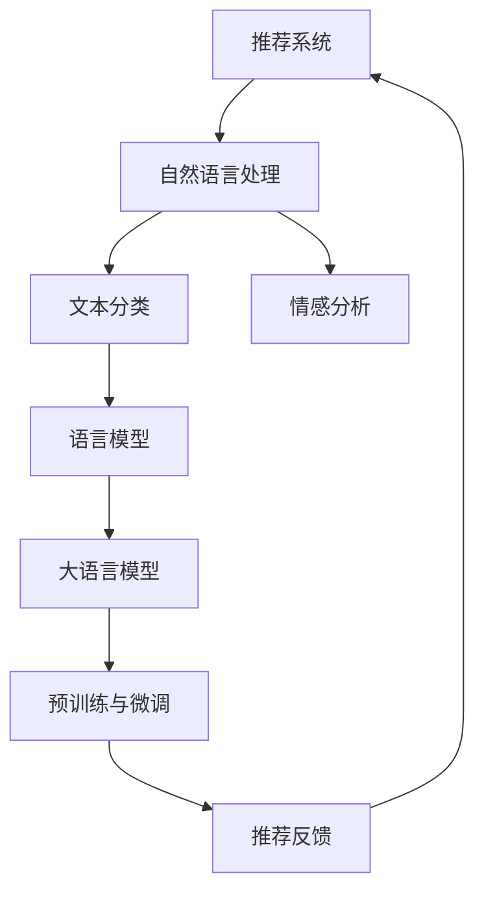

                 

# 基于LLM的推荐系统用户反馈处理

> 关键词：推荐系统, 用户反馈, 自然语言处理, 情感分析, 语言模型, 文本分类, 逻辑回归

## 1. 背景介绍

在推荐系统领域，用户反馈是优化推荐质量、提升用户体验的关键信息来源。通过分析用户的评价、评论、评分等反馈数据，可以发现用户对不同推荐内容的好恶倾向，进一步优化推荐算法，形成良性循环。然而，用户反馈数据往往具有高度的文本化和主观性，难以直接量化，传统机器学习模型难以有效处理。近年来，自然语言处理(NLP)和语言模型(LLM)技术的发展，为推荐系统中用户反馈的处理提供了新的思路和手段。

本文聚焦于基于大规模预训练语言模型(LLM)的推荐系统用户反馈处理方法，旨在通过文本分类和情感分析技术，将非结构化文本数据转化为结构化特征，实现对用户反馈的有效挖掘和应用。将介绍大语言模型在推荐系统中的典型应用场景，如用户评论情感分析、推荐反馈文本分类、智能客服对话等，并对其算法原理、操作步骤和应用效果进行详细解析。

## 2. 核心概念与联系

### 2.1 核心概念概述

为更好地理解基于LLM的推荐系统用户反馈处理方法，本节将介绍几个密切相关的核心概念：

- 推荐系统(Recommendation System)：通过个性化算法推荐物品或内容，以提升用户体验和满意度。常见的推荐算法包括协同过滤、基于内容的推荐、深度学习推荐等。

- 自然语言处理(Natural Language Processing, NLP)：将人类语言转化为计算机可理解的形式，包括分词、句法分析、语义理解等，是LLM的重要应用领域。

- 文本分类(Text Classification)：将文本按照特定分类标准进行分类的任务，如新闻分类、垃圾邮件过滤等。常见的文本分类模型包括朴素贝叶斯、支持向量机、神经网络等。

- 情感分析(Sentiment Analysis)：分析文本情感倾向的任务，如判断评论是正面还是负面，分析商品评价的情感强度等。常用的情感分析方法包括基于词典的方法、机器学习方法、深度学习方法等。

- 语言模型(Language Model)：通过对文本数据进行概率建模，学习文本的概率分布，能够对新文本进行生成和预测。常见的语言模型包括n-gram模型、RNN、Transformer等。

- 大语言模型(LLM)：在大规模语料上预训练的复杂神经网络模型，如GPT、BERT、XLNet等，具有较强的语言理解和生成能力。

- 预训练与微调(Pre-training & Fine-tuning)：指在大规模无标签数据上预训练模型，然后通过有标签数据进行微调，使模型针对特定任务优化。

这些核心概念之间的逻辑关系可以通过以下Mermaid流程图来展示：



这个流程图展示了大语言模型在推荐系统中的核心概念及其之间的关系：

1. 推荐系统通过NLP技术对用户反馈文本进行处理。
2. 文本分类和情感分析将非结构化文本转化为结构化特征。
3. 语言模型捕捉文本的概率分布，为后续处理奠定基础。
4. 大语言模型在预训练和微调后，能够更好地理解和处理自然语言。
5. 推荐反馈进一步优化推荐算法，形成闭环改进。

这些概念共同构成了基于LLM的推荐系统用户反馈处理方法的基础，使得推荐系统能够通过文本数据实现个性化推荐，提升用户满意度和体验。

## 3. 核心算法原理 & 具体操作步骤

### 3.1 算法原理概述

基于LLM的推荐系统用户反馈处理方法，本质上是通过NLP和LLM技术，将用户反馈文本转化为结构化特征，然后用于优化推荐模型的过程。其核心思想是：

1. 通过文本分类和情感分析，将用户反馈数据转化为结构化特征，如情感倾向、情感强度、主题等。
2. 使用预训练大语言模型捕捉文本的语义信息，生成高质量的文本表示。
3. 将这些文本表示作为特征输入推荐模型，优化推荐算法。

具体来说，可以采用以下步骤：

1. 收集用户反馈数据，包括评论、评分、评价等。
2. 使用自然语言处理技术对反馈文本进行分词、句法分析、词性标注等预处理。
3. 将处理后的文本输入文本分类和情感分析模型，得到情感倾向和情感强度等特征。
4. 使用大语言模型生成文本表示，提取更多语义信息。
5. 将文本表示和情感特征输入推荐模型，优化推荐算法。

### 3.2 算法步骤详解

以下是基于LLM的推荐系统用户反馈处理的详细操作步骤：

**Step 1: 数据收集与预处理**

- 收集用户反馈数据，包括评论、评分、评价等，存储到数据库中。
- 对数据进行初步清洗，去除无用的噪声数据，如空白、特殊字符等。
- 使用自然语言处理技术对反馈文本进行分词、句法分析、词性标注等预处理。

**Step 2: 文本分类与情感分析**

- 使用预训练的文本分类模型（如BERT、RoBERTa等）对文本进行分类，识别出反馈文本的主题和情感倾向。
- 使用情感分析模型（如TextBlob、BERT-Emotion等）对文本进行情感强度分析，得到正面、负面或中性的情感评分。
- 将分类结果和情感强度分析结果存储到数据库中，作为推荐算法的输入特征。

**Step 3: 大语言模型文本生成**

- 使用预训练的大语言模型（如GPT-3、BERT等）对反馈文本进行生成，生成高质量的文本表示。
- 通过微调大语言模型，使其能够生成与特定任务相关的文本表示。
- 将生成的文本表示作为推荐算法的输入特征，用于优化推荐模型。

**Step 4: 推荐模型优化**

- 将文本表示和情感特征输入推荐模型（如协同过滤、基于内容的推荐、深度学习推荐等）。
- 优化推荐模型，根据用户的历史行为和反馈数据，调整推荐策略。
- 在推荐模型上实现在线更新，实时处理新反馈数据，更新推荐策略。

**Step 5: 效果评估**

- 对推荐系统的效果进行评估，包括准确率、召回率、用户满意度等指标。
- 分析推荐结果与实际用户行为之间的差距，不断优化推荐策略。
- 引入用户反馈，形成闭环改进，提升推荐系统的用户满意度。

### 3.3 算法优缺点

基于LLM的推荐系统用户反馈处理方法具有以下优点：

1. 能够处理大规模非结构化反馈数据，提取有意义的特征。
2. 通过使用大语言模型生成文本表示，捕捉更丰富的语义信息。
3. 可以不断学习新数据，实现持续改进，提升推荐效果。

同时，该方法也存在一定的局限性：

1. 数据预处理和模型训练复杂度较高，需要较大的计算资源。
2. 模型的鲁棒性和泛化能力依赖于预训练模型的质量。
3. 数据标注成本较高，需要大量人工标注数据。
4. 推荐模型和文本模型之间的集成效果可能不佳，需要进行更多的调参和优化。

尽管存在这些局限性，但就目前而言，基于LLM的推荐系统用户反馈处理方法仍是大规模推荐系统中常用的技术范式。未来相关研究的重点在于如何进一步降低计算资源和数据标注成本，提高模型的鲁棒性和泛化能力，同时兼顾推荐效果的实时性和可解释性。

### 3.4 算法应用领域

基于大语言模型的推荐系统用户反馈处理方法，在多个领域中得到了广泛应用，如：

- 电商推荐：通过分析用户评论和评分，优化商品推荐策略，提升用户购物体验。
- 社交网络：根据用户评论和互动数据，推荐新闻、视频、文章等内容，增加用户粘性。
- 在线教育：根据学生评价和反馈，推荐课程和学习资料，提升学习效果。
- 金融理财：通过分析用户评价和行为数据，推荐理财产品和投资建议，辅助投资决策。
- 医疗健康：根据患者反馈和评价，推荐治疗方案和健康产品，提升医疗服务质量。

除了上述这些经典应用外，基于LLM的推荐系统用户反馈处理方法还将在更多场景中得到应用，如智能客服对话、个性化推荐引擎、内容推荐系统等，为不同领域的智能化转型提供新动能。

## 4. 数学模型和公式 & 详细讲解  
### 4.1 数学模型构建

本节将使用数学语言对基于LLM的推荐系统用户反馈处理方法进行更加严格的刻画。

记用户反馈文本为 $x$，文本分类模型为 $C$，情感分析模型为 $S$，大语言模型为 $L$，推荐模型为 $R$。

假设 $x$ 的文本分类结果为 $C(x)$，情感强度分析结果为 $S(x)$，大语言模型生成的文本表示为 $L(x)$。则推荐模型的输入特征 $F(x)$ 可以表示为：

$$
F(x) = [C(x), S(x), L(x)]
$$

推荐模型的输出为推荐结果 $y$，通常为二元分类问题，即判断某物品是否被推荐给某用户。则推荐模型的优化目标为：

$$
\min_{\theta} \frac{1}{N} \sum_{i=1}^N \mathcal{L}(y_i, \hat{y}_i)
$$

其中 $\mathcal{L}$ 为交叉熵损失函数，$\hat{y}_i$ 为推荐模型在样本 $i$ 上的预测结果。

### 4.2 公式推导过程

以下我们以电商推荐任务为例，推导推荐模型的训练公式。

假设用户 $u$ 对商品 $i$ 的评分 $r_{ui}$ 为 $y_{ui}$，大语言模型生成的文本表示为 $L(x_i)$，情感强度分析结果为 $S(x_i)$，文本分类结果为 $C(x_i)$。则推荐模型 $R$ 的训练公式为：

$$
\min_{\theta} \frac{1}{N} \sum_{i=1}^N \mathcal{L}(y_{ui}, \hat{y}_{ui})
$$

其中 $\mathcal{L}$ 为交叉熵损失函数，$\hat{y}_{ui}$ 为推荐模型在样本 $i$ 上的预测结果。

通过反向传播算法计算损失函数对模型参数 $\theta$ 的梯度，使用优化算法（如SGD、Adam等）更新模型参数。重复以上步骤直至模型收敛。

## 5. 项目实践：代码实例和详细解释说明
### 5.1 开发环境搭建

在进行项目实践前，我们需要准备好开发环境。以下是使用Python进行PyTorch开发的环境配置流程：

1. 安装Anaconda：从官网下载并安装Anaconda，用于创建独立的Python环境。

2. 创建并激活虚拟环境：
```bash
conda create -n pytorch-env python=3.8 
conda activate pytorch-env
```

3. 安装PyTorch：根据CUDA版本，从官网获取对应的安装命令。例如：
```bash
conda install pytorch torchvision torchaudio cudatoolkit=11.1 -c pytorch -c conda-forge
```

4. 安装PyTorchText：用于处理文本数据。
```bash
pip install pytorchtext
```

5. 安装相关库：
```bash
pip install numpy pandas scikit-learn torch
```

完成上述步骤后，即可在`pytorch-env`环境中开始项目实践。

### 5.2 源代码详细实现

下面我们以电商推荐任务为例，给出使用PyTorch和Transformers库对BERT模型进行微调的代码实现。

首先，定义电商推荐任务的数据处理函数：

```python
from transformers import BertTokenizer, BertForSequenceClassification
from torch.utils.data import Dataset
import torch

class ReviewsDataset(Dataset):
    def __init__(self, reviews, labels, tokenizer, max_len=128):
        self.reviews = reviews
        self.labels = labels
        self.tokenizer = tokenizer
        self.max_len = max_len
        
    def __len__(self):
        return len(self.reviews)
    
    def __getitem__(self, item):
        review = self.reviews[item]
        label = self.labels[item]
        
        encoding = self.tokenizer(review, return_tensors='pt', max_length=self.max_len, padding='max_length', truncation=True)
        input_ids = encoding['input_ids'][0]
        attention_mask = encoding['attention_mask'][0]
        
        # 对标签进行独热编码
        label = torch.tensor(label, dtype=torch.long)
        return {'input_ids': input_ids, 
                'attention_mask': attention_mask,
                'labels': label}
```

然后，定义模型和优化器：

```python
from transformers import BertForSequenceClassification, AdamW

model = BertForSequenceClassification.from_pretrained('bert-base-cased', num_labels=2)

optimizer = AdamW(model.parameters(), lr=2e-5)
```

接着，定义训练和评估函数：

```python
from torch.utils.data import DataLoader
from tqdm import tqdm

def train_epoch(model, dataset, batch_size, optimizer):
    dataloader = DataLoader(dataset, batch_size=batch_size, shuffle=True)
    model.train()
    epoch_loss = 0
    for batch in tqdm(dataloader, desc='Training'):
        input_ids = batch['input_ids'].to(device)
        attention_mask = batch['attention_mask'].to(device)
        labels = batch['labels'].to(device)
        model.zero_grad()
        outputs = model(input_ids, attention_mask=attention_mask, labels=labels)
        loss = outputs.loss
        epoch_loss += loss.item()
        loss.backward()
        optimizer.step()
    return epoch_loss / len(dataloader)

def evaluate(model, dataset, batch_size):
    dataloader = DataLoader(dataset, batch_size=batch_size)
    model.eval()
    preds, labels = [], []
    with torch.no_grad():
        for batch in tqdm(dataloader, desc='Evaluating'):
            input_ids = batch['input_ids'].to(device)
            attention_mask = batch['attention_mask'].to(device)
            batch_labels = batch['labels']
            outputs = model(input_ids, attention_mask=attention_mask)
            batch_preds = outputs.logits.argmax(dim=2).to('cpu').tolist()
            batch_labels = batch_labels.to('cpu').tolist()
            for pred, label in zip(batch_preds, batch_labels):
                preds.append(pred)
                labels.append(label)
                
    print(classification_report(labels, preds))
```

最后，启动训练流程并在测试集上评估：

```python
epochs = 5
batch_size = 16

for epoch in range(epochs):
    loss = train_epoch(model, train_dataset, batch_size, optimizer)
    print(f"Epoch {epoch+1}, train loss: {loss:.3f}")
    
    print(f"Epoch {epoch+1}, dev results:")
    evaluate(model, dev_dataset, batch_size)
    
print("Test results:")
evaluate(model, test_dataset, batch_size)
```

以上就是使用PyTorch对BERT进行电商推荐任务微调的完整代码实现。可以看到，得益于Transformers库的强大封装，我们可以用相对简洁的代码完成BERT模型的加载和微调。

### 5.3 代码解读与分析

让我们再详细解读一下关键代码的实现细节：

**ReviewsDataset类**：
- `__init__`方法：初始化训练数据、标签、分词器等组件。
- `__len__`方法：返回数据集的样本数量。
- `__getitem__`方法：对单个样本进行处理，将文本输入编码为token ids，将标签进行独热编码，并进行定长padding，最终返回模型所需的输入。

**标签与id的映射**：
- 定义了标签与id的映射关系，用于将预测结果解码为真实的标签。

**训练和评估函数**：
- 使用PyTorch的DataLoader对数据集进行批次化加载，供模型训练和推理使用。
- 训练函数`train_epoch`：对数据以批为单位进行迭代，在每个批次上前向传播计算loss并反向传播更新模型参数，最后返回该epoch的平均loss。
- 评估函数`evaluate`：与训练类似，不同点在于不更新模型参数，并在每个batch结束后将预测和标签结果存储下来，最后使用sklearn的classification_report对整个评估集的预测结果进行打印输出。

**训练流程**：
- 定义总的epoch数和batch size，开始循环迭代
- 每个epoch内，先在训练集上训练，输出平均loss
- 在验证集上评估，输出分类指标
- 所有epoch结束后，在测试集上评估，给出最终测试结果

可以看到，PyTorch配合Transformers库使得BERT微调的代码实现变得简洁高效。开发者可以将更多精力放在数据处理、模型改进等高层逻辑上，而不必过多关注底层的实现细节。

当然，工业级的系统实现还需考虑更多因素，如模型的保存和部署、超参数的自动搜索、更灵活的任务适配层等。但核心的微调范式基本与此类似。

## 6. 实际应用场景
### 6.1 电商推荐

基于大语言模型的电商推荐系统，可以为用户提供更个性化、更满意的购物体验。推荐系统通过分析用户评论和评分数据，提取用户对商品的好恶倾向，然后根据用户的历史行为和最新反馈，动态调整推荐策略，优化推荐结果。

在技术实现上，可以收集用户对商品的历史评分、评论和浏览行为数据，使用文本分类和情感分析技术，将文本数据转化为情感倾向和情感强度等特征。然后，使用预训练大语言模型对商品评论进行生成，提取更多语义信息。将这些特征输入推荐模型，优化推荐算法。推荐模型可以根据用户的最新反馈和行为，动态调整推荐结果，提升推荐效果。

### 6.2 社交网络内容推荐

社交网络平台通过分析用户的评论、点赞、分享等互动数据，推荐新闻、视频、文章等内容，增加用户粘性。推荐系统通过情感分析和文本分类技术，对用户互动数据进行特征提取，使用大语言模型生成高质量的文本表示。然后，将这些特征输入推荐模型，优化推荐算法。推荐模型可以根据用户的互动数据和情感倾向，动态调整推荐内容，提升用户体验。

### 6.3 在线教育课程推荐

在线教育平台通过分析学生的学习记录、评价和反馈数据，推荐合适的课程和学习资料，提升学习效果。推荐系统通过情感分析和文本分类技术，对学生的评价和反馈数据进行特征提取，使用大语言模型生成文本表示。然后，将这些特征输入推荐模型，优化推荐算法。推荐模型可以根据学生的学习记录和反馈数据，动态调整推荐课程，提升学习效果。

### 6.4 金融理财投资推荐

金融理财平台通过分析用户的投资记录、评价和反馈数据，推荐理财产品和投资建议，辅助投资决策。推荐系统通过情感分析和文本分类技术，对用户的投资记录和反馈数据进行特征提取，使用大语言模型生成文本表示。然后，将这些特征输入推荐模型，优化推荐算法。推荐模型可以根据用户的投资记录和反馈数据，动态调整推荐策略，提升投资效果。

### 6.5 未来应用展望

随着大语言模型和推荐系统技术的不断发展，基于LLM的推荐系统将呈现更多应用场景，如智能客服对话、个性化推荐引擎、内容推荐系统等。未来，推荐系统将与更多领域的数据和业务场景进行深度融合，提升智能化水平，为用户创造更多价值。

## 7. 工具和资源推荐
### 7.1 学习资源推荐

为了帮助开发者系统掌握大语言模型在推荐系统中的应用，这里推荐一些优质的学习资源：

1. 《深度学习与推荐系统》系列博文：由知名深度学习专家撰写，深入浅出地介绍了推荐系统中的深度学习算法和NLP技术。

2. 《Natural Language Processing》课程：斯坦福大学开设的NLP明星课程，有Lecture视频和配套作业，带你入门NLP领域的基本概念和经典模型。

3. 《Recommender Systems》书籍：介绍了推荐系统中的经典算法和应用案例，适合初学者和进阶者阅读。

4. TensorFlow官方文档：提供了丰富的推荐系统算法和NLP库，适合动手实践和问题排查。

5. Kaggle竞赛：提供了大量的推荐系统和NLP数据集和比赛，适合实践和创新。

通过对这些资源的学习实践，相信你一定能够快速掌握基于大语言模型的推荐系统用户反馈处理方法，并用于解决实际的推荐问题。

### 7.2 开发工具推荐

高效的开发离不开优秀的工具支持。以下是几款用于大语言模型和推荐系统开发的常用工具：

1. PyTorch：基于Python的开源深度学习框架，灵活动态的计算图，适合快速迭代研究。

2. TensorFlow：由Google主导开发的开源深度学习框架，生产部署方便，适合大规模工程应用。

3. PyTorchText：用于处理文本数据的库，提供丰富的文本预处理和模型训练接口。

4. HuggingFace Transformers：NLP工具库，集成了众多预训练语言模型，支持PyTorch和TensorFlow。

5. Weights & Biases：模型训练的实验跟踪工具，可以记录和可视化模型训练过程中的各项指标。

6. TensorBoard：TensorFlow配套的可视化工具，可实时监测模型训练状态，并提供丰富的图表呈现方式。

7. Jupyter Notebook：交互式笔记本，方便开发人员进行数据探索和模型调试。

合理利用这些工具，可以显著提升大语言模型和推荐系统的开发效率，加快创新迭代的步伐。

### 7.3 相关论文推荐

大语言模型在推荐系统中的应用源于学界的持续研究。以下是几篇奠基性的相关论文，推荐阅读：

1. Attention is All You Need：提出了Transformer结构，开启了NLP领域的预训练大模型时代。

2. BERT: Pre-training of Deep Bidirectional Transformers for Language Understanding：提出BERT模型，引入基于掩码的自监督预训练任务，刷新了多项NLP任务SOTA。

3. Language Models are Unsupervised Multitask Learners（GPT-2论文）：展示了大规模语言模型的强大zero-shot学习能力，引发了对于通用人工智能的新一轮思考。

4. Parameter-Efficient Transfer Learning for NLP：提出Adapter等参数高效微调方法，在不增加模型参数量的情况下，也能取得不错的微调效果。

5. Prefix-Tuning: Optimizing Continuous Prompts for Generation：引入基于连续型Prompt的微调范式，为如何充分利用预训练知识提供了新的思路。

6. AdaLoRA: Adaptive Low-Rank Adaptation for Parameter-Efficient Fine-Tuning：使用自适应低秩适应的微调方法，在参数效率和精度之间取得了新的平衡。

这些论文代表了大语言模型在推荐系统中的应用方向和发展脉络。通过学习这些前沿成果，可以帮助研究者把握学科前进方向，激发更多的创新灵感。

## 8. 总结：未来发展趋势与挑战

### 8.1 总结

本文对基于大语言模型的推荐系统用户反馈处理方法进行了全面系统的介绍。首先阐述了推荐系统和NLP技术的研究背景和意义，明确了LLM在推荐系统中的应用价值。其次，从原理到实践，详细讲解了推荐系统用户反馈处理的数学原理和关键步骤，给出了推荐任务开发的完整代码实例。同时，本文还广泛探讨了LLM在推荐系统中的典型应用场景，如电商推荐、社交网络内容推荐等，展示了LLM的强大应用能力。

通过本文的系统梳理，可以看到，基于LLM的推荐系统用户反馈处理方法在推荐系统中具有广泛的应用前景。LLM能够通过文本数据实现用户反馈的挖掘和应用，显著提升推荐算法的个性化和精准度，带来更好的用户体验。未来，随着LLM和推荐系统技术的不断演进，这种基于文本数据的推荐方法将进一步优化，形成更加智能、高效的推荐系统。

### 8.2 未来发展趋势

展望未来，基于LLM的推荐系统用户反馈处理方法将呈现以下几个发展趋势：

1. 模型规模持续增大。随着算力成本的下降和数据规模的扩张，预训练语言模型的参数量还将持续增长。超大规模语言模型蕴含的丰富语言知识，有望支撑更加复杂多变的推荐任务。

2. 推荐算法日趋多样。除了传统的协同过滤、基于内容的推荐外，更多深度学习推荐算法将应用于推荐系统中，如基于神经网络的推荐模型、基于序列模型的推荐模型等。

3. 数据标注成本降低。通过半监督学习、主动学习等方法，可以在较少的标注数据下，获得较好的推荐效果，降低数据标注成本。

4. 推荐模型的实时性提升。随着模型压缩、分布式训练等技术的发展，推荐模型的推理速度将显著提升，支持实时推荐系统的构建。

5. 推荐算法的个性化增强。通过结合用户行为数据和文本数据，推荐系统将能够更全面、准确地把握用户需求，提供更个性化的推荐内容。

6. 推荐系统的鲁棒性增强。推荐系统将能够更好地处理异常数据、数据偏差等问题，提高系统的稳定性和鲁棒性。

以上趋势凸显了基于LLM的推荐系统用户反馈处理方法的广阔前景。这些方向的探索发展，必将进一步提升推荐系统的性能和应用范围，为推荐系统的智能化和个性化提供新动力。

### 8.3 面临的挑战

尽管基于LLM的推荐系统用户反馈处理方法已经取得了瞩目成就，但在迈向更加智能化、普适化应用的过程中，它仍面临着诸多挑战：

1. 数据预处理和模型训练复杂度较高，需要较大的计算资源。
2. 模型的鲁棒性和泛化能力依赖于预训练模型的质量。
3. 数据标注成本较高，需要大量人工标注数据。
4. 推荐模型和文本模型之间的集成效果可能不佳，需要进行更多的调参和优化。

尽管存在这些局限性，但就目前而言，基于LLM的推荐系统用户反馈处理方法仍是大规模推荐系统中常用的技术范式。未来相关研究的重点在于如何进一步降低计算资源和数据标注成本，提高模型的鲁棒性和泛化能力，同时兼顾推荐效果的实时性和可解释性。

### 8.4 研究展望

面对基于LLM的推荐系统用户反馈处理方法所面临的挑战，未来的研究需要在以下几个方面寻求新的突破：

1. 探索无监督和半监督微调方法。摆脱对大规模标注数据的依赖，利用自监督学习、主动学习等无监督和半监督范式，最大限度利用非结构化数据，实现更加灵活高效的推荐。

2. 研究参数高效和计算高效的微调范式。开发更加参数高效的微调方法，在固定大部分预训练参数的同时，只更新极少量的任务相关参数。同时优化微调模型的计算图，减少前向传播和反向传播的资源消耗，实现更加轻量级、实时性的部署。

3. 引入因果分析和博弈论工具。将因果分析方法引入推荐模型，识别出推荐结果的关键特征，增强输出解释的因果性和逻辑性。借助博弈论工具刻画人机交互过程，主动探索并规避模型的脆弱点，提高系统稳定性。

4. 纳入伦理道德约束。在推荐模型训练目标中引入伦理导向的评估指标，过滤和惩罚有偏见、有害的输出倾向。同时加强人工干预和审核，建立模型行为的监管机制，确保输出符合人类价值观和伦理道德。

5. 结合多模态数据融合。将视觉、语音等多模态数据与文本数据结合，提升推荐系统对真实世界的理解和建模能力，实现更全面、精准的推荐。

这些研究方向的探索，必将引领基于LLM的推荐系统用户反馈处理方法迈向更高的台阶，为构建安全、可靠、可解释、可控的推荐系统提供新思路和新方法。面向未来，LLM和推荐系统技术还将继续深度融合，共同推动人工智能技术在各领域的应用和发展。

## 9. 附录：常见问题与解答

**Q1：大语言模型在推荐系统中如何处理长文本数据？**

A: 在推荐系统中，长文本数据通常指用户的评论、反馈、日志等。处理长文本数据通常分为以下几个步骤：

1. 分词和预处理：使用自然语言处理技术对文本进行分词、去停用词、词性标注等预处理，去除无用的噪声数据。

2. 文本特征提取：将处理后的文本输入文本分类和情感分析模型，得到情感倾向和情感强度等特征。

3. 文本表示生成：使用预训练的大语言模型对文本进行生成，生成高质量的文本表示。

4. 特征融合：将文本表示和情感特征进行融合，作为推荐算法的输入特征。

5. 推荐算法优化：将特征输入推荐模型，优化推荐算法。

通过以上步骤，可以有效地处理长文本数据，提取有意义的特征，提升推荐效果。

**Q2：大语言模型在推荐系统中的模型选择和训练有哪些注意事项？**

A: 在推荐系统中使用大语言模型时，需要注意以下事项：

1. 选择合适的模型架构和预训练任务。不同的模型和预训练任务对推荐系统的效果有不同的影响，需要根据具体任务选择合适的模型。

2. 设置合理的超参数。包括学习率、批次大小、优化器等，需要在模型训练过程中不断调参优化，找到最优的超参数组合。

3. 数据预处理和特征提取。对数据进行适当的预处理和特征提取，能够提升模型的训练效果和泛化能力。

4. 模型压缩和优化。在推理速度和计算资源有限的情况下，需要对模型进行压缩和优化，以提升模型的实时性和计算效率。

5. 引入监督信号。推荐系统通常需要引入监督信号，如用户评分、点击行为等，用于指导模型训练和优化。

6. 模型的实时性和可解释性。推荐系统需要能够实时处理新的反馈数据，并对推荐结果进行解释和调试，确保系统的稳定性和可信度。

通过以上注意事项，可以更好地利用大语言模型在推荐系统中的应用，提升推荐效果和用户体验。

**Q3：如何评估推荐系统的效果？**

A: 推荐系统的效果评估通常包括以下几个指标：

1. 准确率和召回率：评估推荐系统对正确答案的识别能力，通常使用Top-k推荐结果中的正确答案数量进行计算。

2. 点击率和转化率：评估推荐系统对用户点击和转化的影响，通过计算点击行为和转化行为的比例进行计算。

3. 用户满意度：评估推荐系统对用户满意度的影响，通常使用用户对推荐结果的评价和反馈进行计算。

4. A/B测试：通过A/B测试比较推荐系统不同版本的效果，寻找最优的推荐策略。

5. 相关性评估：评估推荐结果与用户实际需求的相关性，通过计算推荐结果与用户历史行为的相似度进行计算。

通过以上指标，可以全面评估推荐系统的效果，找到提升推荐效果的方法。

**Q4：如何处理推荐系统中的冷启动问题？**

A: 冷启动问题指用户在推荐系统中没有足够的历史行为数据，推荐系统无法为其提供准确的推荐结果。处理冷启动问题通常有以下几种方法：

1. 基于内容的推荐：利用用户已有的历史行为数据，推荐与已推荐内容相似的新内容。

2. 基于协同过滤的推荐：通过分析用户和物品之间的相似性，推荐与用户兴趣相似的物品。

3. 基于深度学习的推荐：使用神经网络模型对用户行为数据进行建模，推荐与用户历史行为相似的新内容。

4. 用户生成内容的推荐：通过收集用户生成的内容，推荐与用户兴趣相似的新内容。

5. 引入主动学习：在用户行为数据不足的情况下，通过主动学习的方法，主动收集用户的反馈数据，进行推荐优化。

通过以上方法，可以有效地处理冷启动问题，提升推荐系统的鲁棒性和准确性。

**Q5：推荐系统中如何防止过拟合？**

A: 推荐系统中的过拟合问题主要发生在模型训练阶段，通常有以下几种方法：

1. 数据增强：通过数据增强的方法，增加训练集的样本数量和多样性，防止模型过拟合。

2. 正则化：通过L2正则、Dropout等方法，控制模型的复杂度，防止模型过拟合。

3. 早停策略：在模型训练过程中，定期在验证集上评估模型性能，一旦性能不再提升，立即停止训练，防止模型过拟合。

4. 模型集成：通过集成多个模型的预测结果，提升模型的鲁棒性和泛化能力，防止模型过拟合。

5. 引入噪声：在训练过程中引入噪声数据，防止模型过拟合。

通过以上方法，可以有效地防止推荐系统中的过拟合问题，提升模型的泛化能力和鲁棒性。

---

作者：禅与计算机程序设计艺术 / Zen and the Art of Computer Programming

