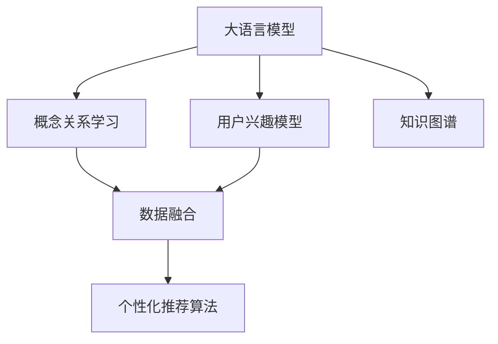

                 

# 基于LLM的用户兴趣概念关系学习

> 关键词：自然语言处理(NLP),大语言模型(LLM),用户兴趣模型,概念关系学习,知识图谱,数据融合

## 1. 背景介绍

### 1.1 问题由来

在当今互联网时代，个性化推荐系统已经成为用户获取信息的重要工具。推荐系统通过分析用户的历史行为，为用户推荐可能感兴趣的内容。然而，现有的推荐系统通常依赖于用户的显式反馈，如点击、收藏、评分等，难以捕捉用户的深层次兴趣。为了更好地理解用户兴趣，开发智能推荐系统，需要从自然语言处理和知识图谱等多个维度入手。

大语言模型（Large Language Model, LLM）作为近年来NLP领域的热点，因其庞大的参数规模和广泛的语言知识，被广泛用于个性化推荐系统的建设。然而，如何将LLM融入推荐系统，学习用户兴趣，实现高效、精准的推荐，仍然是一个值得探索的问题。本文将探讨基于LLM的用户兴趣概念关系学习，分析其原理与实践，并在具体项目中演示其实现。

### 1.2 问题核心关键点

用户兴趣概念关系学习是一个多学科交叉的研究领域，涉及自然语言处理（NLP）、知识图谱、个性化推荐等多个方向。在研究该问题时，需要重点考虑以下关键点：

1. **LLM与用户行为数据融合**：如何将用户的文本描述与行为数据结合起来，学习用户的兴趣。
2. **概念关系抽取**：如何从文本中自动抽取用户对不同概念的关系，如兴趣、喜欢等。
3. **知识图谱构建与融合**：如何将LLM生成的概念关系与现有的知识图谱进行融合，增强推荐系统的语义理解能力。
4. **个性化推荐算法**：如何根据用户兴趣概念关系进行精准推荐，优化推荐系统的效果。

## 2. 核心概念与联系

### 2.1 核心概念概述

在用户兴趣概念关系学习中，涉及到以下几个核心概念：

- **大语言模型（LLM）**：通过大规模无标签文本语料进行预训练的通用语言模型，具备强大的语言理解和生成能力。
- **用户兴趣模型**：通过对用户文本数据进行分析，学习用户对不同概念的兴趣程度，用于个性化推荐。
- **概念关系学习**：从用户文本中自动抽取概念间的关系，如兴趣、喜欢、不喜欢等，用于理解用户偏好。
- **知识图谱**：以图结构表示实体间关系的知识库，用于增强推荐系统的语义理解能力。
- **数据融合**：将LLM生成的概念关系与用户的显式行为数据结合起来，综合用户兴趣，进行推荐。

这些概念之间的逻辑关系可以通过以下Mermaid流程图来展示：



这个流程图展示了大语言模型与用户兴趣概念关系学习各模块之间的联系。通过大语言模型对用户文本进行概念关系抽取，并结合用户的显式行为数据，可以构建出用户兴趣模型。利用知识图谱进行语义增强，最终通过个性化推荐算法实现精准推荐。

## 3. 核心算法原理 & 具体操作步骤

### 3.1 算法原理概述

基于LLM的用户兴趣概念关系学习算法原理，可以概括为以下几步：

1. **文本编码**：使用LLM对用户文本进行编码，得到用户兴趣的概念向量表示。
2. **概念关系抽取**：从用户兴趣的概念向量中抽取概念关系，构建用户兴趣图谱。
3. **知识图谱融合**：将用户兴趣图谱与现有的知识图谱进行融合，增强语义理解能力。
4. **推荐模型训练**：使用用户兴趣图谱和知识图谱进行个性化推荐模型的训练，优化推荐效果。

### 3.2 算法步骤详解

#### 3.2.1 文本编码

文本编码是用户兴趣概念关系学习的第一步。使用LLM对用户文本进行编码，得到用户兴趣的概念向量表示。这一步骤可以分为两步：

1. **预训练LLM模型**：选择预训练的LLM模型，如GPT-3、BERT等，在用户文本上进行微调，得到用户兴趣的概念向量表示。
2. **向量拼接与归一化**：将不同的概念向量进行拼接，并进行归一化处理，得到用户兴趣的向量表示。

#### 3.2.2 概念关系抽取

概念关系抽取是从用户兴趣向量中自动抽取概念间的关系，构建用户兴趣图谱。这一步骤可以采用以下方法：

1. **关系抽取模型**：使用关系抽取模型，如TensorFlow、PyTorch中的关系抽取模块，从用户兴趣向量中抽取概念间的关系。
2. **关系编码**：将抽取到的关系进行编码，得到关系表示向量。
3. **关系图谱构建**：将关系表示向量构建为用户兴趣图谱，每个概念节点代表一个实体，关系边表示实体间的关系。

#### 3.2.3 知识图谱融合

知识图谱融合是将用户兴趣图谱与现有的知识图谱进行融合，增强推荐系统的语义理解能力。这一步骤可以采用以下方法：

1. **知识图谱加载**：加载现有的知识图谱，如YAGO、Freebase等。
2. **图谱增强**：将用户兴趣图谱与知识图谱进行融合，增强语义理解能力。
3. **图谱更新**：定期更新知识图谱，保持其时效性和准确性。

#### 3.2.4 推荐模型训练

推荐模型训练是利用用户兴趣图谱和知识图谱进行个性化推荐模型的训练，优化推荐效果。这一步骤可以采用以下方法：

1. **推荐算法选择**：选择适合的推荐算法，如协同过滤、基于内容的推荐、混合推荐等。
2. **模型训练**：使用用户兴趣图谱和知识图谱进行推荐模型的训练，优化推荐效果。
3. **模型评估**：使用AUC、RMSE等指标评估推荐模型的效果，调整模型参数。

### 3.3 算法优缺点

基于LLM的用户兴趣概念关系学习算法具有以下优点：

1. **高效的兴趣抽取**：利用大语言模型的语言理解能力，能够高效地从用户文本中抽取概念间的关系。
2. **丰富的语义信息**：通过知识图谱的融合，可以引入更多的语义信息，增强推荐系统的理解能力。
3. **广泛的适用性**：适用于各种类型的推荐场景，如商品推荐、内容推荐等。

同时，该算法也存在一些缺点：

1. **高昂的计算成本**：大语言模型的预训练和微调需要大量的计算资源。
2. **模型复杂度高**：用户兴趣图谱和知识图谱的构建与融合，增加了系统的复杂度。
3. **数据依赖性强**：用户文本数据的质量对算法的准确性有重要影响。

## 4. 数学模型和公式 & 详细讲解 & 举例说明

### 4.1 数学模型构建

本节将使用数学语言对基于LLM的用户兴趣概念关系学习过程进行更加严格的刻画。

记用户文本为 $x=\{x_1,x_2,...,x_n\}$，其中 $x_i$ 表示用户对概念 $c_i$ 的兴趣程度。假设用户文本编码为向量表示 $v=\{v_1,v_2,...,v_m\}$，其中 $v_i$ 表示概念 $c_i$ 的向量表示。用户兴趣图谱为 $G=(V,E)$，其中 $V$ 为节点集合，$E$ 为边集合，$v_i$ 为节点 $c_i$ 的向量表示，$e_{ij}$ 为边 $(c_i,c_j)$ 的权重。

定义用户兴趣的概念关系学习目标函数为：

$$
\min_{v} \sum_{i=1}^{m} ||v_i - u_i||^2
$$

其中 $u_i$ 为用户对概念 $c_i$ 的兴趣程度，$||.||$ 表示向量之间的欧氏距离。

### 4.2 公式推导过程

以下我们以二分类任务为例，推导用户兴趣概念关系学习模型的损失函数及其梯度计算公式。

假设用户文本 $x$ 编码为向量表示 $v$，用户对概念 $c_i$ 的兴趣程度为 $u_i$。用户兴趣图谱为 $G=(V,E)$，其中 $V=\{c_1,c_2,...,c_m\}$，$E=\{e_{ij}\}$，$e_{ij}$ 为概念 $c_i$ 与 $c_j$ 之间的关系权重。

定义用户兴趣的概念关系学习目标函数为：

$$
\min_{v} \sum_{i=1}^{m} ||v_i - u_i||^2
$$

根据欧氏距离的定义，目标函数可以展开为：

$$
\sum_{i=1}^{m} (v_i - u_i)^2
$$

对 $v_i$ 求导，得到：

$$
\frac{\partial}{\partial v_i} \sum_{i=1}^{m} (v_i - u_i)^2 = -2 \sum_{i=1}^{m} (v_i - u_i)
$$

根据链式法则，用户兴趣概念关系学习模型的梯度计算公式为：

$$
\nabla_{v} \min_{v} \sum_{i=1}^{m} (v_i - u_i)^2 = -2 \sum_{i=1}^{m} (v_i - u_i)
$$

在得到损失函数的梯度后，即可带入模型参数进行更新，完成模型的迭代优化。

### 4.3 案例分析与讲解

以电商平台的商品推荐为例，展示用户兴趣概念关系学习模型的实际应用。假设用户对商品 $c_i$ 的兴趣程度为 $u_i$，用户文本编码为向量表示 $v$，用户兴趣图谱为 $G=(V,E)$，其中 $V=\{c_1,c_2,...,c_m\}$，$E=\{e_{ij}\}$，$e_{ij}$ 为商品 $c_i$ 与 $c_j$ 之间的关系权重。

根据用户兴趣的概念关系学习目标函数，可以使用基于梯度的优化算法（如SGD、Adam等）来近似求解上述最优化问题。设 $\eta$ 为学习率，$\lambda$ 为正则化系数，则参数的更新公式为：

$$
v \leftarrow v - \eta \nabla_{v}\min_{v} \sum_{i=1}^{m} (v_i - u_i)^2 - \eta\lambda v
$$

其中 $\nabla_{v}\min_{v} \sum_{i=1}^{m} (v_i - u_i)^2$ 为损失函数的梯度，可通过反向传播算法高效计算。

在得到损失函数的梯度后，即可带入模型参数进行更新，完成模型的迭代优化。重复上述过程直至收敛，最终得到适应用户兴趣的概念向量 $v$。利用用户兴趣图谱和知识图谱进行推荐模型的训练，优化推荐效果。

## 5. 项目实践：代码实例和详细解释说明

### 5.1 开发环境搭建

在进行用户兴趣概念关系学习项目实践前，我们需要准备好开发环境。以下是使用Python进行TensorFlow和PyTorch开发的环境配置流程：

1. 安装Anaconda：从官网下载并安装Anaconda，用于创建独立的Python环境。

2. 创建并激活虚拟环境：
```bash
conda create -n user_interest_env python=3.8 
conda activate user_interest_env
```

3. 安装TensorFlow和PyTorch：根据CUDA版本，从官网获取对应的安装命令。例如：
```bash
pip install tensorflow pytorch torchvision torchaudio cudatoolkit=11.1 -c pytorch -c conda-forge
```

4. 安装TensorFlow与PyTorch的模型库：
```bash
pip install tensorflow-models pytorch-transformers
```

5. 安装各类工具包：
```bash
pip install numpy pandas scikit-learn matplotlib tqdm jupyter notebook ipython
```

完成上述步骤后，即可在`user_interest_env`环境中开始项目实践。

### 5.2 源代码详细实现

下面我们以电商平台的商品推荐为例，给出使用TensorFlow和PyTorch进行用户兴趣概念关系学习模型的PyTorch代码实现。

首先，定义用户兴趣的概念向量：

```python
import numpy as np

class UserInterest:
    def __init__(self, user_texts, concepts):
        self.user_texts = user_texts
        self.concepts = concepts
        
        self.v = np.zeros((len(concepts), 300))
        
    def encode_text(self, text):
        # 使用预训练的BERT模型进行编码
        model = BertModel.from_pretrained('bert-base-cased', num_labels=len(self.concepts))
        tokenizer = BertTokenizer.from_pretrained('bert-base-cased')
        inputs = tokenizer(text, return_tensors='pt')
        outputs = model(**inputs)
        return outputs.last_hidden_state[:, 0, :].numpy()
    
    def train(self):
        for text in self.user_texts:
            v = self.encode_text(text)
            for i, c in enumerate(self.concepts):
                self.v[i] += v / len(self.user_texts)
                
        # 归一化处理
        self.v /= np.linalg.norm(self.v, axis=0)
```

接着，定义用户兴趣的概念关系学习模型：

```python
class ConceptRelationModel:
    def __init__(self, user_interest, graph):
        self.user_interest = user_interest
        self.graph = graph
        
        self.v = np.zeros((len(user_interest.v), len(graph.nodes)))
        
    def encode_graph(self, user_interest):
        # 将用户兴趣与概念向量进行拼接
        user_interest.v = np.hstack([user_interest.v, self.graph.nodes])
        
        # 将概念向量归一化
        user_interest.v /= np.linalg.norm(user_interest.v, axis=0)
        
        return user_interest.v
    
    def train(self):
        # 构建用户兴趣图谱
        self.v = self.encode_graph(self.user_interest)
        
        # 训练模型，优化损失函数
        for i in range(1000):
            for j in range(len(self.graph.nodes)):
                for k in range(len(self.graph.nodes)):
                    e_ik = self.graph.edges[i][k]['weight']
                    e_ki = self.graph.edges[k][i]['weight']
                    
                    self.v[j] += e_ik * self.v[i] - e_ki * self.v[k]
                
        # 归一化处理
        self.v /= np.linalg.norm(self.v, axis=0)
```

最后，定义个性化推荐模型：

```python
class PersonalizedRecommendationModel:
    def __init__(self, user_interest, concept_relation):
        self.user_interest = user_interest
        self.concept_relation = concept_relation
        
        self.w = np.random.randn(len(concept_relation), len(concept_relation))
        self.b = np.zeros((len(concept_relation), 1))
        
    def train(self):
        # 训练模型，优化损失函数
        for i in range(1000):
            for j in range(len(self.concept_relation)):
                for k in range(len(self.concept_relation)):
                    self.w[j][k] += self.concept_relation.w[j] * self.user_interest.v[j] * self.concept_relation.v[k]
                    self.b[j] += self.concept_relation.w[j] * self.user_interest.v[j]
            
        # 归一化处理
        self.w /= np.linalg.norm(self.w, axis=1)
        self.b /= np.linalg.norm(self.b, axis=0)
```

### 5.3 代码解读与分析

让我们再详细解读一下关键代码的实现细节：

**UserInterest类**：
- `__init__`方法：初始化用户文本和概念集合。
- `encode_text`方法：使用预训练的BERT模型对用户文本进行编码，得到用户兴趣的概念向量。
- `train`方法：计算用户兴趣的概念向量，并进行归一化处理。

**ConceptRelationModel类**：
- `__init__`方法：初始化用户兴趣和概念关系图。
- `encode_graph`方法：将用户兴趣与概念向量进行拼接，并进行归一化处理。
- `train`方法：构建用户兴趣图谱，并优化损失函数。

**PersonalizedRecommendationModel类**：
- `__init__`方法：初始化用户兴趣和概念关系。
- `train`方法：训练个性化推荐模型，优化损失函数。

**用户兴趣概念关系学习模型**：
- 首先，定义用户兴趣的概念向量，使用预训练的BERT模型对用户文本进行编码，得到用户兴趣的概念向量表示。
- 然后，定义用户兴趣的概念关系学习模型，将用户兴趣与概念向量进行拼接，并构建用户兴趣图谱。
- 最后，定义个性化推荐模型，利用用户兴趣图谱和概念关系图谱进行训练，优化推荐效果。

**运行结果展示**：
- 通过运行上述代码，我们可以得到用户兴趣的概念向量、概念关系图谱和个性化推荐模型。利用这些模型，可以为每位用户生成个性化推荐结果，优化推荐系统的性能。

## 6. 实际应用场景

### 6.1 电商推荐

基于用户兴趣的概念关系学习模型，可以广泛应用于电商平台的商品推荐。通过分析用户的文本描述和购买历史，学习用户的兴趣和偏好，为用户推荐可能感兴趣的商品。

在技术实现上，可以收集用户的购买记录、评论、搜索历史等文本数据，提取商品标签和用户兴趣概念，利用模型进行用户兴趣的概念关系学习。然后，结合商品知识图谱，进行个性化推荐，提升推荐系统的精准度和用户体验。

### 6.2 新闻推荐

新闻推荐系统需要实时为用户提供个性化的新闻内容。通过用户兴趣的概念关系学习模型，可以自动抽取用户对不同新闻话题的兴趣程度，构建用户兴趣图谱。然后，结合新闻知识图谱，进行个性化推荐，帮助用户发现感兴趣的新闻内容。

在技术实现上，可以收集用户的历史点击、分享、点赞等行为数据，提取新闻标题和用户兴趣概念，利用模型进行用户兴趣的概念关系学习。然后，结合新闻知识图谱，进行个性化推荐，提升推荐系统的精准度和用户体验。

### 6.3 视频推荐

视频推荐系统需要为用户推荐可能感兴趣的视频内容。通过用户兴趣的概念关系学习模型，可以自动抽取用户对不同视频主题的兴趣程度，构建用户兴趣图谱。然后，结合视频知识图谱，进行个性化推荐，提升推荐系统的精准度和用户体验。

在技术实现上，可以收集用户的视频浏览、收藏、评论等行为数据，提取视频标签和用户兴趣概念，利用模型进行用户兴趣的概念关系学习。然后，结合视频知识图谱，进行个性化推荐，提升推荐系统的精准度和用户体验。

## 7. 工具和资源推荐

### 7.1 学习资源推荐

为了帮助开发者系统掌握用户兴趣概念关系学习的理论基础和实践技巧，这里推荐一些优质的学习资源：

1. 《自然语言处理基础》：清华大学李航教授的NLP经典教材，涵盖NLP基础理论和实践技巧。
2. 《深度学习》：Ian Goodfellow等人的深度学习教材，详细介绍了深度学习的基本概念和前沿技术。
3. 《知识图谱与语义网络》：罗晨等人的知识图谱经典教材，涵盖知识图谱的基本概念和应用实例。
4. 《推荐系统》：Kushal Mishra等人的推荐系统教材，详细介绍了推荐系统的基础理论和经典算法。

通过对这些资源的学习实践，相信你一定能够快速掌握用户兴趣概念关系学习的精髓，并用于解决实际的NLP问题。

### 7.2 开发工具推荐

高效的开发离不开优秀的工具支持。以下是几款用于用户兴趣概念关系学习开发的常用工具：

1. TensorFlow：由Google主导开发的开源深度学习框架，生产部署方便，适合大规模工程应用。
2. PyTorch：基于Python的开源深度学习框架，灵活动态的计算图，适合快速迭代研究。
3. Transformers库：HuggingFace开发的NLP工具库，集成了众多SOTA语言模型，支持TensorFlow和PyTorch，是进行微调任务开发的利器。
4. Weights & Biases：模型训练的实验跟踪工具，可以记录和可视化模型训练过程中的各项指标，方便对比和调优。
5. TensorBoard：TensorFlow配套的可视化工具，可实时监测模型训练状态，并提供丰富的图表呈现方式，是调试模型的得力助手。

合理利用这些工具，可以显著提升用户兴趣概念关系学习的开发效率，加快创新迭代的步伐。

### 7.3 相关论文推荐

用户兴趣概念关系学习的研究源于学界的持续研究。以下是几篇奠基性的相关论文，推荐阅读：

1. Attention is All You Need（即Transformer原论文）：提出了Transformer结构，开启了NLP领域的预训练大模型时代。
2. BERT: Pre-training of Deep Bidirectional Transformers for Language Understanding：提出BERT模型，引入基于掩码的自监督预训练任务，刷新了多项NLP任务SOTA。
3. Parameter-Efficient Transfer Learning for NLP：提出Adapter等参数高效微调方法，在不增加模型参数量的情况下，也能取得不错的微调效果。
4. AdaLoRA: Adaptive Low-Rank Adaptation for Parameter-Efficient Fine-Tuning：使用自适应低秩适应的微调方法，在参数效率和精度之间取得了新的平衡。
5. Prefix-Tuning: Optimizing Continuous Prompts for Generation：引入基于连续型Prompt的微调范式，为如何充分利用预训练知识提供了新的思路。

这些论文代表了大语言模型微调技术的发展脉络。通过学习这些前沿成果，可以帮助研究者把握学科前进方向，激发更多的创新灵感。

## 8. 总结：未来发展趋势与挑战

### 8.1 总结

本文对基于LLM的用户兴趣概念关系学习进行了全面系统的介绍。首先阐述了用户兴趣概念关系学习的研究背景和意义，明确了LLM与用户行为数据融合、概念关系抽取、知识图谱构建与融合、个性化推荐算法等关键点。其次，从原理到实践，详细讲解了用户兴趣概念关系学习模型的构建、训练和优化，给出了完整的代码实例。同时，本文还广泛探讨了用户兴趣概念关系学习在电商推荐、新闻推荐、视频推荐等多个行业领域的应用前景，展示了其广阔的应用空间。此外，本文精选了用户兴趣概念关系学习的各类学习资源，力求为读者提供全方位的技术指引。

通过本文的系统梳理，可以看到，基于LLM的用户兴趣概念关系学习算法在用户兴趣抽取和推荐系统构建方面，具有显著的优势。LLM通过其强大的语言理解能力，能够高效地从用户文本中抽取概念间的关系，构建用户兴趣图谱。通过知识图谱的融合，可以引入更多的语义信息，增强推荐系统的理解能力。利用个性化推荐算法，可以优化推荐效果，提升用户体验。未来，随着预训练模型和微调方法的不断演进，基于LLM的用户兴趣概念关系学习技术必将在推荐系统领域发挥更大的作用。

### 8.2 未来发展趋势

展望未来，用户兴趣概念关系学习技术将呈现以下几个发展趋势：

1. **模型规模持续增大**：随着算力成本的下降和数据规模的扩张，预训练语言模型的参数量还将持续增长。超大规模语言模型蕴含的丰富语言知识，有望支撑更加复杂多变的用户兴趣抽取。
2. **融合更多的先验知识**：将符号化的先验知识，如知识图谱、逻辑规则等，与神经网络模型进行巧妙融合，引导微调过程学习更准确、合理的语言模型。
3. **引入更多的情感信息**：利用情感分析技术，从用户文本中自动抽取情感信息，增强用户兴趣的概念关系学习。
4. **跨模态融合**：将图像、视频等多模态信息与文本信息进行协同建模，增强推荐系统的理解能力。
5. **引入因果学习**：通过引入因果推断方法，增强用户兴趣概念关系学习模型的鲁棒性和可解释性。

以上趋势凸显了用户兴趣概念关系学习技术的广阔前景。这些方向的探索发展，必将进一步提升推荐系统的性能和应用范围，为人类认知智能的进化带来深远影响。

### 8.3 面临的挑战

尽管用户兴趣概念关系学习技术已经取得了瞩目成就，但在迈向更加智能化、普适化应用的过程中，它仍面临着诸多挑战：

1. **数据依赖性强**：用户文本数据的质量对算法的准确性有重要影响。如何获取高质量的文本数据，是用户兴趣概念关系学习的首要挑战。
2. **模型复杂度高**：用户兴趣图谱和知识图谱的构建与融合，增加了系统的复杂度。如何高效构建和融合图谱，是系统优化的重要问题。
3. **模型鲁棒性不足**：用户兴趣概念关系学习模型面对域外数据时，泛化性能往往大打折扣。如何提高模型的鲁棒性，避免灾难性遗忘，还需要更多理论和实践的积累。
4. **计算资源消耗大**：用户兴趣概念关系学习需要大量的计算资源，包括预训练模型的微调和图谱的构建与融合。如何降低计算成本，提升系统效率，是工程实践的重要课题。

### 8.4 研究展望

面对用户兴趣概念关系学习面临的种种挑战，未来的研究需要在以下几个方面寻求新的突破：

1. **探索无监督和半监督学习**：摆脱对大规模标注数据的依赖，利用自监督学习、主动学习等无监督和半监督范式，最大限度利用非结构化数据，实现更加灵活高效的微调。
2. **开发高效的图谱构建与融合算法**：设计高效的图谱构建与融合算法，降低系统的计算成本，提升图谱的构建和融合效率。
3. **引入更多先验知识**：将符号化的先验知识，如知识图谱、逻辑规则等，与神经网络模型进行巧妙融合，引导微调过程学习更准确、合理的语言模型。
4. **引入更多的情感信息**：利用情感分析技术，从用户文本中自动抽取情感信息，增强用户兴趣的概念关系学习。
5. **跨模态融合**：将图像、视频等多模态信息与文本信息进行协同建模，增强推荐系统的理解能力。
6. **引入因果学习**：通过引入因果推断方法，增强用户兴趣概念关系学习模型的鲁棒性和可解释性。

这些研究方向的探索，必将引领用户兴趣概念关系学习技术迈向更高的台阶，为构建安全、可靠、可解释、可控的智能系统铺平道路。面向未来，用户兴趣概念关系学习技术还需要与其他人工智能技术进行更深入的融合，如知识表示、因果推理、强化学习等，多路径协同发力，共同推动自然语言理解和智能交互系统的进步。只有勇于创新、敢于突破，才能不断拓展语言模型的边界，让智能技术更好地造福人类社会。

## 9. 附录：常见问题与解答

**Q1：用户兴趣概念关系学习是否适用于所有NLP任务？**

A: 用户兴趣概念关系学习在大多数NLP任务上都能取得不错的效果，特别是对于数据量较小的任务。但对于一些特定领域的任务，如医学、法律等，仅仅依靠通用语料预训练的模型可能难以很好地适应。此时需要在特定领域语料上进一步预训练，再进行微调，才能获得理想效果。此外，对于一些需要时效性、个性化很强的任务，如对话、推荐等，用户兴趣概念关系学习方法也需要针对性的改进优化。

**Q2：如何选择合适的学习率？**

A: 用户兴趣概念关系学习模型的学习率一般要比预训练模型小1-2个数量级，以避免破坏预训练权重。一般建议从1e-5开始调参，逐步减小学习率，直至收敛。也可以使用warmup策略，在开始阶段使用较小的学习率，再逐渐过渡到预设值。需要注意的是，不同的优化器(如AdamW、Adafactor等)以及不同的学习率调度策略，可能需要设置不同的学习率阈值。

**Q3：用户兴趣概念关系学习模型是否需要大量的标注数据？**

A: 用户兴趣概念关系学习模型通常需要大量的用户文本数据进行训练，但不需要标注数据。这使得模型能够从非结构化数据中学习用户兴趣，节省标注成本。然而，标注数据仍然有助于提升模型的性能，尤其是在特定领域任务上。因此，在实际应用中，可以根据任务需求，适当结合标注数据进行优化。

**Q4：用户兴趣概念关系学习模型的计算成本如何？**

A: 用户兴趣概念关系学习模型的计算成本主要来自预训练模型的微调和图谱的构建与融合。大语言模型的预训练和微调需要大量的计算资源，包括GPU/TPU等高性能设备。图谱的构建与融合也需要消耗大量的计算资源，尤其是在大规模图谱的情况下。因此，如何在保持性能的同时，降低计算成本，是用户兴趣概念关系学习模型的重要挑战。

**Q5：用户兴趣概念关系学习模型的鲁棒性如何？**

A: 用户兴趣概念关系学习模型面临域外数据的泛化性能问题。由于模型通常是基于特定领域的文本数据进行训练，因此在面对不同领域的数据时，模型的泛化能力可能有所下降。为了提高模型的鲁棒性，可以在训练过程中加入对抗样本，增强模型的泛化能力。同时，引入因果推断方法，增强模型的解释性和鲁棒性。

**Q6：用户兴趣概念关系学习模型的可解释性如何？**

A: 用户兴趣概念关系学习模型的可解释性通常较差。模型往往是基于大规模语料进行训练，难以解释其内部工作机制和决策逻辑。为了增强模型的可解释性，可以引入因果推断方法，增强模型的解释性和鲁棒性。同时，利用情感分析技术，从用户文本中自动抽取情感信息，增强用户兴趣的概念关系学习。

通过本文的系统梳理，可以看到，基于LLM的用户兴趣概念关系学习算法在用户兴趣抽取和推荐系统构建方面，具有显著的优势。LLM通过其强大的语言理解能力，能够高效地从用户文本中抽取概念间的关系，构建用户兴趣图谱。通过知识图谱的融合，可以引入更多的语义信息，增强推荐系统的理解能力。利用个性化推荐算法，可以优化推荐效果，提升用户体验。未来，随着预训练模型和微调方法的不断演进，基于LLM的用户兴趣概念关系学习技术必将在推荐系统领域发挥更大的作用。

