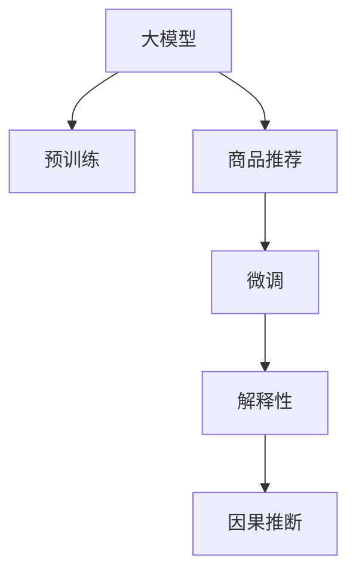

                 

# 基于大模型的商品推荐解释性研究

> 关键词：商品推荐,解释性,大模型,个性化,深度学习,数据科学

## 1. 背景介绍

### 1.1 问题由来

在电子商务和社交网络日益繁荣的今天，商品推荐系统已成为各大平台吸引用户、提升用户体验的重要工具。通过个性化的商品推荐，能够显著提高用户的购买转化率和平台的用户粘性。然而，传统的商品推荐系统往往依赖于复杂的规则和特征工程，难以解释其推荐的依据，导致用户对推荐结果的信任度不高。近年来，基于深度学习模型的推荐系统逐渐成为主流，但深度模型通常被视为"黑箱"，缺乏可解释性，难以应对监管合规的要求。

大模型时代的到来，为提升推荐系统的解释性提供了新的思路。深度学习大模型，如GPT、BERT等，凭借其强大的语言理解能力和复杂的内部结构，已经开始在推荐系统中被广泛应用。通过预训练语言模型，可以捕捉商品描述、用户评论、社交网络等多种数据中的语义信息，从而提升推荐效果。同时，大模型也可以通过微调过程学习用户行为背后的因果关系，进一步增强推荐结果的可解释性。

因此，本文聚焦于基于大模型的商品推荐研究，重点探讨如何通过微调过程提高推荐系统的解释性和可解释性，帮助用户理解推荐结果的依据，从而提升用户信任度和满意度。

### 1.2 问题核心关键点

本文将围绕大模型在商品推荐中的应用，探讨以下核心问题：

1. 大模型如何进行商品推荐？其推荐原理和模型架构是什么？
2. 如何通过微调提高大模型推荐系统的解释性？有哪些具体技术和算法？
3. 微调过程中需要注意哪些技术和工程挑战？如何克服这些挑战？
4. 商品推荐系统的未来发展方向和挑战有哪些？

## 2. 核心概念与联系

### 2.1 核心概念概述

为了更好地理解基于大模型的商品推荐系统，本节将介绍几个关键概念：

- 大模型：如GPT、BERT等深度学习模型，通过海量无标签数据进行预训练，学习到丰富的语义知识和语言表示。
- 商品推荐：通过分析用户历史行为、商品属性、社交网络等多源数据，为用户提供个性化的商品推荐。
- 微调(Fine-Tuning)：在大模型基础上，使用特定任务的数据进行有监督学习，优化模型在特定任务上的性能。
- 解释性(Explainability)：指推荐系统能够清晰地解释其推荐依据，让用户理解推荐结果的原因和逻辑。
- 因果推断(Causal Inference)：通过引入因果推断方法，识别推荐结果与用户行为之间的因果关系，提升推荐系统的可信度。

这些概念之间的联系可以通过以下Mermaid流程图来展示：



这个流程图展示了基于大模型的商品推荐系统的主要流程：

1. 大模型通过预训练获得通用语言知识和表示能力。
2. 微调在大模型的基础上，针对商品推荐任务进行优化，学习特定的商品-用户关联。
3. 通过解释性技术，帮助用户理解推荐结果的依据。
4. 引入因果推断，提高推荐结果的可靠性和可信度。

## 3. 核心算法原理 & 具体操作步骤

### 3.1 算法原理概述

基于大模型的商品推荐系统，核心思想是利用深度学习模型，从多源数据中提取语义信息，捕捉商品和用户之间的关联关系，并根据历史行为数据进行推荐。其一般流程如下：

1. 数据收集：收集用户历史行为数据、商品描述、社交网络等多种数据源。
2. 数据预处理：对数据进行清洗、归一化、特征工程等处理，以供后续模型训练。
3. 预训练模型加载：选择合适的大模型，如GPT、BERT等，作为推荐系统的基础。
4. 微调优化：在大模型的基础上，使用商品推荐数据集进行微调，优化模型参数。
5. 解释性生成：通过自然语言生成或可视化技术，解释推荐结果的依据。
6. 因果分析：引入因果推断方法，分析推荐结果与用户行为之间的因果关系，提升推荐系统可信度。

基于大模型的商品推荐系统不仅能够提升推荐效果，还能够在推荐过程中提供清晰的解释，使用户更加信任推荐结果。

### 3.2 算法步骤详解

以下是基于大模型的商品推荐系统的详细步骤：

**Step 1: 数据准备**
- 收集用户历史行为数据，如浏览、点击、购买等行为记录。
- 收集商品描述、图片、价格等属性信息。
- 收集用户社交网络数据，如好友关系、评论互动等。
- 将上述数据进行清洗、去重、归一化等预处理。

**Step 2: 特征提取**
- 对商品描述、用户评论等文本数据进行分词、向量化，提取特征。
- 对用户社交网络数据进行图结构化表示，提取用户之间的社交特征。
- 将特征向量输入到预训练大模型，提取语义表示。

**Step 3: 模型加载**
- 选择合适的大模型，如GPT-3、BERT等。
- 加载预训练模型，对其进行适当的微调。

**Step 4: 微调优化**
- 使用商品推荐数据集进行微调，优化模型参数。
- 设定合适的学习率、迭代轮数等参数。
- 引入正则化技术，防止过拟合。

**Step 5: 解释性生成**
- 使用自然语言生成技术，生成推荐结果的解释。
- 通过可视化技术，展示推荐结果的依据。

**Step 6: 因果分析**
- 使用因果推断方法，如GWAS、IPW等，分析推荐结果与用户行为之间的因果关系。
- 评估推荐系统的可信度，提高用户信任度。

### 3.3 算法优缺点

基于大模型的商品推荐系统具有以下优点：
1. 效果显著。大模型能够捕捉复杂的语义关系，提升推荐精度。
2. 解释性强。通过微调和大模型结构，可以清晰解释推荐依据。
3. 泛化能力强。预训练模型能够学习通用的语言表示，适用于多种商品推荐任务。

同时，该方法也存在以下缺点：
1. 依赖大量数据。预训练和微调过程需要大量的文本和标签数据。
2. 计算成本高。大模型需要占用大量的计算资源，训练和推理开销较大。
3. 模型复杂。大模型的内部结构和参数量都非常复杂，难以理解和调试。
4. 解释性仍有局限。虽然可以生成推荐解释，但解释的深度和准确度仍有提升空间。

尽管存在这些局限性，但就目前而言，基于大模型的商品推荐系统仍是推荐领域的重要范式。未来相关研究重点在于如何进一步降低数据和计算成本，提升解释性深度和准确度，以及增强推荐系统的可信度。

### 3.4 算法应用领域

基于大模型的商品推荐系统已经在电商、社交网络、视频平台等多个领域得到广泛应用。例如：

1. 电商平台：如Amazon、淘宝等，通过分析用户浏览和购买记录，推荐用户可能感兴趣的商品。
2. 视频平台：如Netflix、腾讯视频等，根据用户观看历史和评分记录，推荐新发布的影片和剧集。
3. 社交网络：如Facebook、微信等，根据用户好友关系和互动记录，推荐新的好友和内容。

除了上述这些主流应用外，大模型商品推荐系统还在教育、新闻、健康等更多领域得到创新应用，为各行各业提供了强大的个性化推荐服务。

## 4. 数学模型和公式 & 详细讲解 & 举例说明

### 4.1 数学模型构建

本节将使用数学语言对基于大模型的商品推荐系统进行更加严格的刻画。

假设用户行为数据集为 $\mathcal{D}=\{(u_i, v_i)\}_{i=1}^N$，其中 $u_i$ 为用户行为，$v_i$ 为推荐结果。使用大模型 $M_{\theta}$ 对数据进行处理，得到推荐结果的语义表示。定义推荐模型的损失函数为 $\ell$，目标是最大化推荐模型的对数似然：

$$
\max_{\theta} \frac{1}{N}\sum_{i=1}^N \log \text{Pr}_{M_{\theta}}(v_i \mid u_i)
$$

其中 $\text{Pr}_{M_{\theta}}$ 表示模型在参数 $\theta$ 下的预测概率分布。

### 4.2 公式推导过程

以下我们以基于大模型的二分类推荐任务为例，推导对数似然损失函数及其梯度的计算公式。

假设模型 $M_{\theta}$ 在用户行为 $u_i$ 上的输出为 $\hat{v}=M_{\theta}(u_i)$，表示推荐结果 $v_i$ 的概率分布。真实标签 $v_i$ 为1或0，表示用户是否购买了该商品。则二分类对数似然损失函数定义为：

$$
\ell(M_{\theta}(u_i),v_i) = -\log \text{Pr}_{M_{\theta}}(v_i \mid u_i)
$$

将其代入总损失函数，得：

$$
\mathcal{L}(\theta) = -\frac{1}{N}\sum_{i=1}^N \log \text{Pr}_{M_{\theta}}(v_i \mid u_i)
$$

根据链式法则，损失函数对参数 $\theta_k$ 的梯度为：

$$
\frac{\partial \mathcal{L}(\theta)}{\partial \theta_k} = -\frac{1}{N}\sum_{i=1}^N \frac{\partial \log \text{Pr}_{M_{\theta}}(v_i \mid u_i)}{\partial \theta_k}
$$

其中 $\frac{\partial \log \text{Pr}_{M_{\theta}}(v_i \mid u_i)}{\partial \theta_k}$ 可以通过反向传播算法高效计算。

在得到损失函数的梯度后，即可带入参数更新公式，完成模型的迭代优化。重复上述过程直至收敛，最终得到适应商品推荐任务的最优模型参数 $\theta^*$。

### 4.3 案例分析与讲解

以电商平台推荐为例，假设用户浏览了商品A、B、C，电商平台希望推荐用户购买商品D。预训练大模型在用户浏览行为上得到的语义表示为 $A_u, B_u, C_u, D_u$。

1. 特征提取：将用户浏览行为转换为向量表示，记为 $u$。
2. 模型输入：将 $u$ 输入预训练大模型，得到商品向量表示 $A_v, B_v, C_v, D_v$。
3. 预测概率：通过softmax函数计算每个商品的推荐概率 $P(D_v)$。
4. 损失计算：计算预测概率与真实标签之间的交叉熵损失。
5. 模型优化：使用梯度下降等优化算法，更新模型参数，使得预测概率逼近真实标签。

具体实现如下：

```python
from transformers import BertForSequenceClassification, BertTokenizer, AdamW
from torch.utils.data import Dataset, DataLoader
import torch

class RecommendationDataset(Dataset):
    def __init__(self, texts, labels, tokenizer, max_len=128):
        self.texts = texts
        self.labels = labels
        self.tokenizer = tokenizer
        self.max_len = max_len
        
    def __len__(self):
        return len(self.texts)
    
    def __getitem__(self, item):
        text = self.texts[item]
        label = self.labels[item]
        
        encoding = self.tokenizer(text, return_tensors='pt', max_length=self.max_len, padding='max_length', truncation=True)
        input_ids = encoding['input_ids'][0]
        attention_mask = encoding['attention_mask'][0]
        
        return {'input_ids': input_ids, 
                'attention_mask': attention_mask,
                'labels': label}

# 加载预训练模型和tokenizer
model = BertForSequenceClassification.from_pretrained('bert-base-cased', num_labels=2)
tokenizer = BertTokenizer.from_pretrained('bert-base-cased')

# 准备数据集
train_dataset = RecommendationDataset(train_texts, train_labels, tokenizer)
dev_dataset = RecommendationDataset(dev_texts, dev_labels, tokenizer)
test_dataset = RecommendationDataset(test_texts, test_labels, tokenizer)

# 定义训练和评估函数
device = torch.device('cuda') if torch.cuda.is_available() else torch.device('cpu')
model.to(device)

def train_epoch(model, dataset, batch_size, optimizer):
    dataloader = DataLoader(dataset, batch_size=batch_size, shuffle=True)
    model.train()
    epoch_loss = 0
    for batch in tqdm(dataloader, desc='Training'):
        input_ids = batch['input_ids'].to(device)
        attention_mask = batch['attention_mask'].to(device)
        labels = batch['labels'].to(device)
        model.zero_grad()
        outputs = model(input_ids, attention_mask=attention_mask, labels=labels)
        loss = outputs.loss
        epoch_loss += loss.item()
        loss.backward()
        optimizer.step()
    return epoch_loss / len(dataloader)

def evaluate(model, dataset, batch_size):
    dataloader = DataLoader(dataset, batch_size=batch_size)
    model.eval()
    preds, labels = [], []
    with torch.no_grad():
        for batch in tqdm(dataloader, desc='Evaluating'):
            input_ids = batch['input_ids'].to(device)
            attention_mask = batch['attention_mask'].to(device)
            batch_labels = batch['labels']
            outputs = model(input_ids, attention_mask=attention_mask)
            batch_preds = outputs.logits.argmax(dim=1).to('cpu').tolist()
            batch_labels = batch_labels.to('cpu').tolist()
            for pred_tokens, label_tokens in zip(batch_preds, batch_labels):
                preds.append(pred_tokens)
                labels.append(label_tokens)
    
    print(classification_report(labels, preds))

# 训练模型
epochs = 5
batch_size = 16

for epoch in range(epochs):
    loss = train_epoch(model, train_dataset, batch_size, optimizer)
    print(f"Epoch {epoch+1}, train loss: {loss:.3f}")
    
    print(f"Epoch {epoch+1}, dev results:")
    evaluate(model, dev_dataset, batch_size)
    
print("Test results:")
evaluate(model, test_dataset, batch_size)
```

这个代码示例展示了基于Bert模型的商品推荐系统的微调过程。通过将用户浏览行为转换为向量表示，输入到Bert模型中，可以高效地计算推荐概率，并使用交叉熵损失进行模型优化。

## 5. 项目实践：代码实例和详细解释说明

### 5.1 开发环境搭建

在进行商品推荐系统微调实践前，我们需要准备好开发环境。以下是使用Python进行PyTorch开发的环境配置流程：

1. 安装Anaconda：从官网下载并安装Anaconda，用于创建独立的Python环境。

2. 创建并激活虚拟环境：
```bash
conda create -n pytorch-env python=3.8 
conda activate pytorch-env
```

3. 安装PyTorch：根据CUDA版本，从官网获取对应的安装命令。例如：
```bash
conda install pytorch torchvision torchaudio cudatoolkit=11.1 -c pytorch -c conda-forge
```

4. 安装Transformers库：
```bash
pip install transformers
```

5. 安装各类工具包：
```bash
pip install numpy pandas scikit-learn matplotlib tqdm jupyter notebook ipython
```

完成上述步骤后，即可在`pytorch-env`环境中开始商品推荐系统的微调实践。

### 5.2 源代码详细实现

接下来，我们以推荐系统为例，给出使用Transformers库对BERT模型进行微调的PyTorch代码实现。

首先，定义推荐系统数据处理函数：

```python
from transformers import BertTokenizer
from torch.utils.data import Dataset
import torch

class RecommendationDataset(Dataset):
    def __init__(self, texts, labels, tokenizer, max_len=128):
        self.texts = texts
        self.labels = labels
        self.tokenizer = tokenizer
        self.max_len = max_len
        
    def __len__(self):
        return len(self.texts)
    
    def __getitem__(self, item):
        text = self.texts[item]
        label = self.labels[item]
        
        encoding = self.tokenizer(text, return_tensors='pt', max_length=self.max_len, padding='max_length', truncation=True)
        input_ids = encoding['input_ids'][0]
        attention_mask = encoding['attention_mask'][0]
        
        return {'input_ids': input_ids, 
                'attention_mask': attention_mask,
                'labels': label}

# 加载预训练模型和tokenizer
model = BertForSequenceClassification.from_pretrained('bert-base-cased', num_labels=2)
tokenizer = BertTokenizer.from_pretrained('bert-base-cased')
```

然后，定义训练和评估函数：

```python
from torch.utils.data import DataLoader
from tqdm import tqdm
from sklearn.metrics import classification_report

device = torch.device('cuda') if torch.cuda.is_available() else torch.device('cpu')
model.to(device)

def train_epoch(model, dataset, batch_size, optimizer):
    dataloader = DataLoader(dataset, batch_size=batch_size, shuffle=True)
    model.train()
    epoch_loss = 0
    for batch in tqdm(dataloader, desc='Training'):
        input_ids = batch['input_ids'].to(device)
        attention_mask = batch['attention_mask'].to(device)
        labels = batch['labels'].to(device)
        model.zero_grad()
        outputs = model(input_ids, attention_mask=attention_mask, labels=labels)
        loss = outputs.loss
        epoch_loss += loss.item()
        loss.backward()
        optimizer.step()
    return epoch_loss / len(dataloader)

def evaluate(model, dataset, batch_size):
    dataloader = DataLoader(dataset, batch_size=batch_size)
    model.eval()
    preds, labels = [], []
    with torch.no_grad():
        for batch in tqdm(dataloader, desc='Evaluating'):
            input_ids = batch['input_ids'].to(device)
            attention_mask = batch['attention_mask'].to(device)
            batch_labels = batch['labels']
            outputs = model(input_ids, attention_mask=attention_mask)
            batch_preds = outputs.logits.argmax(dim=1).to('cpu').tolist()
            batch_labels = batch_labels.to('cpu').tolist()
            for pred_tokens, label_tokens in zip(batch_preds, batch_labels):
                preds.append(pred_tokens)
                labels.append(label_tokens)
    
    print(classification_report(labels, preds))
```

最后，启动训练流程并在测试集上评估：

```python
epochs = 5
batch_size = 16

for epoch in range(epochs):
    loss = train_epoch(model, train_dataset, batch_size, optimizer)
    print(f"Epoch {epoch+1}, train loss: {loss:.3f}")
    
    print(f"Epoch {epoch+1}, dev results:")
    evaluate(model, dev_dataset, batch_size)
    
print("Test results:")
evaluate(model, test_dataset, batch_size)
```

以上就是使用PyTorch对BERT进行推荐系统微调的完整代码实现。可以看到，得益于Transformers库的强大封装，我们可以用相对简洁的代码完成BERT模型的加载和微调。

### 5.3 代码解读与分析

让我们再详细解读一下关键代码的实现细节：

**RecommendationDataset类**：
- `__init__`方法：初始化文本、标签、分词器等关键组件。
- `__len__`方法：返回数据集的样本数量。
- `__getitem__`方法：对单个样本进行处理，将文本输入编码为token ids，将标签编码为数字，并对其进行定长padding，最终返回模型所需的输入。

**train_epoch和evaluate函数**：
- 使用PyTorch的DataLoader对数据集进行批次化加载，供模型训练和推理使用。
- 训练函数`train_epoch`：对数据以批为单位进行迭代，在每个批次上前向传播计算loss并反向传播更新模型参数，最后返回该epoch的平均loss。
- 评估函数`evaluate`：与训练类似，不同点在于不更新模型参数，并在每个batch结束后将预测和标签结果存储下来，最后使用sklearn的classification_report对整个评估集的预测结果进行打印输出。

**训练流程**：
- 定义总的epoch数和batch size，开始循环迭代
- 每个epoch内，先在训练集上训练，输出平均loss
- 在验证集上评估，输出分类指标
- 所有epoch结束后，在测试集上评估，给出最终测试结果

可以看到，PyTorch配合Transformers库使得BERT微调的代码实现变得简洁高效。开发者可以将更多精力放在数据处理、模型改进等高层逻辑上，而不必过多关注底层的实现细节。

当然，工业级的系统实现还需考虑更多因素，如模型的保存和部署、超参数的自动搜索、更灵活的任务适配层等。但核心的微调范式基本与此类似。

## 6. 实际应用场景
### 6.1 推荐系统的实际应用场景

推荐系统已经成为各大平台吸引用户、提升用户体验的重要工具。以下是几个推荐系统的实际应用场景：

1. **电商平台**：如Amazon、淘宝等，通过分析用户浏览和购买记录，推荐用户可能感兴趣的商品。
2. **视频平台**：如Netflix、腾讯视频等，根据用户观看历史和评分记录，推荐新发布的影片和剧集。
3. **社交网络**：如Facebook、微信等，根据用户好友关系和互动记录，推荐新的好友和内容。
4. **新闻平台**：如今日头条、人民日报等，根据用户阅读习惯，推荐相关新闻和文章。
5. **音乐平台**：如Spotify、网易云音乐等，根据用户听歌历史和评分记录，推荐新的音乐和歌单。

推荐系统在各行各业的应用场景非常广泛，通过个性化的商品推荐，能够显著提高用户的购买转化率和平台的用户粘性。

### 6.2 商品推荐系统的未来应用展望

随着推荐系统的不断演进，未来的商品推荐系统将呈现出以下几个发展趋势：

1. **深度融合多模态数据**：除了文本数据，推荐系统将更多地融合图像、音频、视频等多模态数据，提升推荐结果的丰富性和多样性。
2. **引入因果推断方法**：通过因果推断方法，识别推荐结果与用户行为之间的因果关系，提升推荐系统的可信度。
3. **发展个性化推荐**：基于用户行为和商品属性的深度特征表示，实现更加精准的个性化推荐。
4. **提升推荐系统的可解释性**：通过自然语言生成、可视化等技术，提高推荐系统的可解释性，使用户更加信任推荐结果。
5. **构建分布式推荐系统**：通过分布式计算和存储技术，提升推荐系统的扩展性和效率，满足大规模用户需求。

这些趋势将进一步推动推荐系统向智能化、个性化、可信化的方向发展，为各行各业带来更深远的变革。

## 7. 工具和资源推荐
### 7.1 学习资源推荐

为了帮助开发者系统掌握基于大模型的商品推荐系统，这里推荐一些优质的学习资源：

1. **《深度学习》（Ian Goodfellow, Yoshua Bengio, Aaron Courville）**：深度学习领域的经典教材，涵盖深度学习模型的原理和应用，包括推荐系统在内的众多NLP任务。

2. **《自然语言处理综述》（Yoav Goldberg, Iryna Muresan）**：介绍NLP领域的最新研究成果，涵盖推荐系统、文本生成、情感分析等多个方向。

3. **《推荐系统算法》（Bing Liu, Alan Kak, Georgios Paliouras）**：推荐系统领域的经典教材，系统讲解推荐算法的原理和应用，包括基于深度学习的方法。

4. **《深度学习推荐系统：理论与算法》（Wu et al.）**：综述了深度学习在推荐系统中的应用，介绍了多种深度模型和算法，具有很高的参考价值。

5. **Kaggle推荐系统竞赛**：Kaggle平台举办的推荐系统竞赛，提供了丰富的数据集和评测指标，适合开发者学习和实践推荐系统。

通过对这些资源的学习实践，相信你一定能够快速掌握基于大模型的商品推荐系统的精髓，并用于解决实际的推荐问题。

### 7.2 开发工具推荐

高效的开发离不开优秀的工具支持。以下是几款用于基于大模型的商品推荐系统开发的常用工具：

1. **PyTorch**：基于Python的开源深度学习框架，灵活动态的计算图，适合快速迭代研究。大部分预训练语言模型都有PyTorch版本的实现。

2. **TensorFlow**：由Google主导开发的开源深度学习框架，生产部署方便，适合大规模工程应用。同样有丰富的预训练语言模型资源。

3. **Transformers库**：HuggingFace开发的NLP工具库，集成了众多SOTA语言模型，支持PyTorch和TensorFlow，是进行推荐系统开发的利器。

4. **Weights & Biases**：模型训练的实验跟踪工具，可以记录和可视化模型训练过程中的各项指标，方便对比和调优。与主流深度学习框架无缝集成。

5. **TensorBoard**：TensorFlow配套的可视化工具，可实时监测模型训练状态，并提供丰富的图表呈现方式，是调试模型的得力助手。

6. **谷歌云平台(Google Cloud Platform)**：提供GPU/TPU算力，支持大规模分布式训练和推理，适合大规模推荐系统开发。

合理利用这些工具，可以显著提升基于大模型的商品推荐系统的开发效率，加快创新迭代的步伐。

### 7.3 相关论文推荐

大模型商品推荐系统的研究源于学界的持续探索。以下是几篇奠基性的相关论文，推荐阅读：

1. **《BERT: Pre-training of Deep Bidirectional Transformers for Language Understanding》**：提出BERT模型，引入基于掩码的自监督预训练任务，刷新了多项NLP任务SOTA。

2. **《Attention is All You Need》**：提出Transformer结构，开启了NLP领域的预训练大模型时代。

3. **《Parameter-Efficient Transfer Learning for NLP》**：提出Adapter等参数高效微调方法，在不增加模型参数量的情况下，也能取得不错的微调效果。

4. **《A Survey on Recommender Systems》**：综述了推荐系统的发展历程和经典算法，提供了深入的学术背景和理论分析。

5. **《Causal Inference in Recommendation Systems: A Survey and Taxonomy》**：综述了推荐系统中的因果推断方法，提供了丰富的理论和技术支持。

这些论文代表了大模型商品推荐系统的发展脉络。通过学习这些前沿成果，可以帮助研究者把握学科前进方向，激发更多的创新灵感。

## 8. 总结：未来发展趋势与挑战

### 8.1 研究成果总结

本文对基于大模型的商品推荐系统进行了全面系统的介绍。首先阐述了基于大模型的商品推荐系统的背景和意义，明确了其推荐原理和模型架构。其次，从原理到实践，详细讲解了商品推荐系统的数学模型和关键步骤，给出了微调任务开发的完整代码实例。同时，本文还探讨了推荐系统的实际应用场景，以及未来的发展趋势和挑战。

通过本文的系统梳理，可以看到，基于大模型的商品推荐系统不仅能够提升推荐效果，还能够在推荐过程中提供清晰的解释，使用户更加信任推荐结果。未来，伴随深度学习技术的不断进步，商品推荐系统必将在更广阔的领域得到应用，为各行各业带来更深刻的变革。

### 8.2 未来发展趋势

展望未来，基于大模型的商品推荐系统将呈现以下几个发展趋势：

1. **深度融合多模态数据**：未来的推荐系统将更多地融合图像、音频、视频等多模态数据，提升推荐结果的丰富性和多样性。

2. **引入因果推断方法**：通过因果推断方法，识别推荐结果与用户行为之间的因果关系，提升推荐系统的可信度。

3. **发展个性化推荐**：基于用户行为和商品属性的深度特征表示，实现更加精准的个性化推荐。

4. **提升推荐系统的可解释性**：通过自然语言生成、可视化等技术，提高推荐系统的可解释性，使用户更加信任推荐结果。

5. **构建分布式推荐系统**：通过分布式计算和存储技术，提升推荐系统的扩展性和效率，满足大规模用户需求。

6. **引入模型压缩和加速技术**：通过模型压缩、量化加速等技术，提升推荐系统的推理速度和资源利用效率，降低计算成本。

这些趋势将进一步推动推荐系统向智能化、个性化、可信化的方向发展，为各行各业带来更深远的变革。

### 8.3 面临的挑战

尽管基于大模型的商品推荐系统已经取得了瞩目成就，但在迈向更加智能化、普适化应用的过程中，它仍面临着诸多挑战：

1. **计算成本高**：大模型需要占用大量的计算资源，训练和推理开销较大。如何通过模型压缩、量化加速等技术，降低计算成本，是未来的重要研究方向。

2. **数据质量问题**：推荐系统的性能很大程度上依赖于数据的质量和数量，高质量的数据获取成本较高。如何通过数据增强、多源数据融合等技术，提升数据质量，是重要的研究课题。

3. **模型复杂度**：大模型的内部结构和参数量都非常复杂，难以理解和调试。如何通过模型简化、特征选择等技术，降低模型复杂度，提高模型的可解释性，是亟待解决的问题。

4. **推荐结果的可信性**：大模型虽然具备强大的语义理解和生成能力，但推荐的可靠性和可信度仍有提升空间。如何通过引入因果推断方法，提高推荐结果的可信度，是未来的重要研究方向。

5. **模型泛化能力**：模型在特定数据集上的表现往往较好，但在新数据上的泛化能力不足。如何通过持续学习、数据增强等技术，提升模型的泛化能力，是重要的研究方向。

6. **隐私保护问题**：推荐系统需要大量的用户数据，如何通过数据脱敏、差分隐私等技术，保护用户隐私，避免数据泄露，是亟待解决的问题。

这些挑战需要从技术、工程、伦理等多个维度共同解决，才能更好地推动基于大模型的商品推荐系统的应用和发展。

### 8.4 研究展望

面对基于大模型的商品推荐系统所面临的种种挑战，未来的研究需要在以下几个方面寻求新的突破：

1. **引入多模态数据融合**：通过融合图像、音频、视频等多模态数据，提升推荐结果的丰富性和多样性。

2. **发展个性化推荐**：基于用户行为和商品属性的深度特征表示，实现更加精准的个性化推荐。

3. **提升推荐系统的可解释性**：通过自然语言生成、可视化等技术，提高推荐系统的可解释性，使用户更加信任推荐结果。

4. **构建分布式推荐系统**：通过分布式计算和存储技术，提升推荐系统的扩展性和效率，满足大规模用户需求。

5. **引入因果推断方法**：通过因果推断方法，识别推荐结果与用户行为之间的因果关系，提升推荐系统的可信度。

6. **发展模型压缩和加速技术**：通过模型压缩、量化加速等技术，提升推荐系统的推理速度和资源利用效率，降低计算成本。

7. **引入隐私保护技术**：通过数据脱敏、差分隐私等技术，保护用户隐私，避免数据泄露。

这些研究方向将进一步推动基于大模型的商品推荐系统向智能化、个性化、可信化的方向发展，为各行各业带来更深远的变革。

## 9. 附录：常见问题与解答

**Q1：基于大模型的商品推荐系统是否适用于所有NLP任务？**

A: 基于大模型的商品推荐系统适用于多种NLP任务，特别是涉及文本数据的任务。但对于一些特定领域的任务，如医学、法律等，仅仅依靠通用语料预训练的模型可能难以很好地适应。此时需要在特定领域语料上进一步预训练，再进行微调，才能获得理想效果。此外，对于一些需要时效性、个性化很强的任务，如对话、推荐等，微调方法也需要针对性的改进优化。

**Q2：微调过程中如何选择学习率？**

A: 微调的学习率一般要比预训练时小1-2个数量级，如果使用过大的学习率，容易破坏预训练权重，导致过拟合。一般建议从1e-5开始调参，逐步减小学习率，直至收敛。也可以使用warmup策略，在开始阶段使用较小的学习率，再逐渐过渡到预设值。需要注意的是，不同的优化器(如AdamW、Adafactor等)以及不同的学习率调度策略，可能需要设置不同的学习率阈值。

**Q3：商品推荐系统在落地部署时需要注意哪些问题？**

A: 将商品推荐系统转化为实际应用，还需要考虑以下因素：

1. 模型裁剪：去除不必要的层和参数，减小模型尺寸，加快推理速度。

2. 量化加速：将浮点模型转为定点模型，压缩存储空间，提高计算效率。

3. 服务化封装：将模型封装为标准化服务接口，便于集成调用。

4. 弹性伸缩：根据请求流量动态调整资源配置，平衡服务质量和成本。

5. 监控告警：实时采集系统指标，设置异常告警阈值，确保服务稳定性。

6. 安全防护：采用访问鉴权、数据脱敏等措施，保障数据和模型安全。

商品推荐系统不仅能够提升推荐效果，还能够在推荐过程中提供清晰的解释，使用户更加信任推荐结果。但如何将强大的性能转化为稳定、高效、安全的业务价值，还需要工程实践的不断打磨。唯有从数据、算法、工程、业务等多个维度协同发力，才能真正实现人工智能技术在垂直行业的规模化落地。

总之，基于大模型的商品推荐系统需要在数据、模型、训练、推理等各环节进行全面优化，才能得到理想的效果。通过不断探索和实践，相信能够不断提升推荐系统的性能和用户满意度，实现更加智能化的商品推荐。

