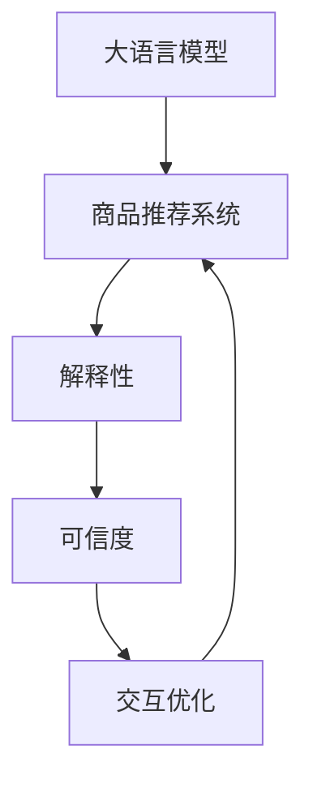

                 

# 基于大模型的商品推荐解释性研究

> 关键词：商品推荐系统,大语言模型,解释性,可信度,交互优化

## 1. 背景介绍

### 1.1 问题由来
在当前数字化零售时代，消费者决策过程变得越来越复杂，如何在海量商品中准确推荐符合用户需求的商品，是电商平台亟需解决的问题。传统的商品推荐系统依赖基于用户历史行为数据的协同过滤算法，但这种推荐方式无法充分考虑用户个性化需求，且容易产生信息过载和推荐的单调性问题。

近年来，随着深度学习和大规模预训练语言模型的发展，大模型技术逐步应用于商品推荐领域。大模型在自然语言处理和计算机视觉等领域的出色表现，给推荐系统带来了新的希望。如何在大模型上进行有效的商品推荐，成为学术界和工业界共同关注的焦点。

### 1.2 问题核心关键点
大模型在推荐系统中的应用，主要体现在两个方面：

- **商品描述生成**：利用大模型生成商品描述，使用户更容易理解和比较商品特点。
- **用户行为分析**：通过大模型理解用户需求，预测其对商品的潜在兴趣。

然而，大模型在推荐系统中也有局限性：
- **数据隐私和偏见**：大模型往往依赖于大规模无标签数据进行预训练，存在数据偏见和隐私问题。
- **模型透明性不足**：大模型内部决策过程难以解释，缺乏透明度和可解释性。
- **可信度问题**：大模型缺乏信任度评估机制，推荐结果的可信度难以保证。

### 1.3 问题研究意义
解决大模型在推荐系统中的这些问题，不仅能提升推荐的准确性和个性化程度，还能增强用户对推荐系统的信任感，提升用户满意度。

1. **推荐效果提升**：通过解释性方法，提升大模型的可信度，使用户更愿意接受推荐结果。
2. **用户体验优化**：增强推荐系统的透明度，使用户能够理解和信任推荐逻辑，提升用户粘性和满意度。
3. **业务模型迭代**：通过评估推荐系统的可信度，及时发现和修复推荐偏差，促进推荐系统的迭代优化。

## 2. 核心概念与联系

### 2.1 核心概念概述

为更好地理解基于大模型的商品推荐解释性研究，本节将介绍几个密切相关的核心概念：

- **大语言模型(Large Language Model, LLM)**：以自回归(如GPT)或自编码(如BERT)模型为代表的大规模预训练语言模型。通过在大规模无标签文本数据上进行预训练，学习通用语言表示，具备强大的自然语言理解和生成能力。
- **商品推荐系统(Recommendation System)**：利用用户行为数据或商品属性信息，预测用户可能感兴趣的商品，并进行推荐。常见的推荐方式包括基于协同过滤的矩阵分解、基于内容的模型、基于深度学习的推荐系统等。
- **解释性(Explainability)**：机器学习模型的解释性指用户能够理解模型的决策过程和结果，基于解释性的方法能够提升模型透明度和可信度。
- **可信度(Trustworthiness)**：机器学习模型的可信度指用户对其推荐结果的信任程度，基于可信度的方法能够提升推荐系统的信任度。
- **交互优化(Interaction Optimization)**：通过交互式反馈机制，优化推荐系统推荐策略，提升推荐效果和用户满意度。

这些核心概念之间的逻辑关系可以通过以下Mermaid流程图来展示：



这个流程图展示了大语言模型、商品推荐系统、解释性、可信度和交互优化之间的联系：

1. 大语言模型为商品推荐系统提供了强大的语言理解能力。
2. 解释性和可信度可以提升大模型的推荐效果和透明度，使用户更容易理解和信任推荐结果。
3. 交互优化可以动态调整推荐策略，提升推荐系统的效果和用户满意度。

这些核心概念共同构成了基于大模型的商品推荐系统，其核心任务是在提升推荐效果的同时，增强推荐系统的可信度和透明度。

## 3. 核心算法原理 & 具体操作步骤
### 3.1 算法原理概述

基于大模型的商品推荐系统，通常采用联合训练的方法，即将大模型与推荐算法联合训练。具体步骤如下：

1. **数据准备**：收集用户行为数据和商品属性数据，并准备好标注数据。
2. **模型加载**：使用预训练的大语言模型作为初始化参数。
3. **训练优化**：联合训练大语言模型和推荐算法，优化模型参数。
4. **解释性生成**：根据用户反馈和行为数据，生成推荐系统的解释信息。
5. **可信度评估**：使用信任度评估方法，对推荐结果进行可信度评分。
6. **交互优化**：根据用户反馈，调整推荐策略，提升推荐系统效果。

### 3.2 算法步骤详解

**Step 1: 数据准备**

- **用户行为数据**：收集用户在平台上的浏览、点击、购买等行为数据，包括点击时间、浏览时长、购买金额等信息。
- **商品属性数据**：收集商品的基本信息，如名称、描述、价格、评分等，以及更详细的属性信息，如类别、品牌、材质等。
- **标注数据**：将用户行为数据与商品属性数据关联，生成用户对商品感兴趣或不感兴趣的二元标注数据。

**Step 2: 模型加载**

- **加载大语言模型**：使用预训练的大语言模型（如GPT-3、BERT等），加载到推荐系统中。
- **定义推荐模型**：根据任务需求，选择合适的推荐模型（如深度神经网络、基于矩阵分解的模型等），作为与大模型联合训练的组成部分。

**Step 3: 训练优化**

- **联合训练**：将大语言模型和推荐模型联合训练，优化模型参数。可以使用深度学习框架如TensorFlow、PyTorch等实现联合训练。
- **损失函数设计**：设计联合训练的损失函数，通常包括交叉熵损失、均方误差损失等。
- **超参数设置**：设置学习率、批大小、迭代轮数等超参数，进行模型训练。

**Step 4: 解释性生成**

- **解释性模型**：使用可解释的模型（如LIME、SHAP等），对大模型和推荐模型的预测结果进行解释。
- **生成解释信息**：将解释性信息与推荐结果一起呈现给用户，增强推荐系统的透明度。

**Step 5: 可信度评估**

- **信任度评分**：使用可信度评估方法，对推荐结果进行评分。常见的可信度评估方法包括反悔度(Regret)、置信度(Confidence)、多样性(Diversity)等。
- **用户反馈机制**：建立用户反馈机制，根据用户对推荐结果的反馈，对推荐系统进行调整。

**Step 6: 交互优化**

- **动态调整策略**：根据用户反馈，动态调整推荐策略。
- **实时优化推荐**：使用在线学习或增量学习的方法，实时优化推荐系统。

### 3.3 算法优缺点

基于大模型的商品推荐系统具有以下优点：

- **提升推荐效果**：利用大模型的语言理解和生成能力，可以更好地理解用户需求和商品属性，提升推荐精度和个性化程度。
- **增强透明度**：通过解释性方法，提升推荐系统的透明度和可信度，使用户更容易理解和信任推荐结果。
- **灵活调整策略**：通过交互优化，可以动态调整推荐策略，提升推荐效果和用户满意度。

同时，该方法也存在一些局限性：

- **数据隐私问题**：大模型依赖大规模无标签数据进行预训练，存在数据隐私风险。
- **模型复杂度高**：大模型和推荐模型联合训练，模型复杂度高，计算资源需求大。
- **解释性难度大**：大模型内部决策过程复杂，生成解释信息难度大。
- **实时优化困难**：在线学习或增量学习需要实时数据和计算资源，实际应用中可能难以实现。

尽管存在这些局限性，但就目前而言，基于大模型的商品推荐方法仍是大规模推荐系统的重要范式。未来相关研究的重点在于如何进一步降低数据隐私风险，提高模型的解释性和实时优化能力，同时兼顾推荐系统的性能和用户满意度。

### 3.4 算法应用领域

基于大模型的商品推荐系统，已经在电商、社交媒体、视频平台等多个领域得到了广泛应用，例如：

- **电商推荐**：通过大模型理解用户需求，生成商品描述，进行个性化推荐。
- **社交媒体推荐**：根据用户兴趣和行为，生成相关内容推荐，提升用户体验。
- **视频平台推荐**：通过大模型理解视频内容，生成推荐结果，提升用户粘性。
- **音乐推荐**：根据用户喜好和行为，生成音乐推荐，提高用户满意度。
- **新闻推荐**：通过大模型理解新闻内容，生成推荐结果，提升新闻阅读体验。

除了上述这些经典应用外，大模型技术还创新性地应用于广告推荐、个性化学习推荐、创意推荐等新兴领域，为推荐系统带来了全新的突破。

## 4. 数学模型和公式 & 详细讲解  
### 4.1 数学模型构建

假设大语言模型为 $M_{\theta}$，商品推荐模型为 $R_{\phi}$，用户行为数据为 $U=\{(u_i,v_i)\}_{i=1}^N$，其中 $u_i$ 为第 $i$ 个用户，$v_i$ 为 $u_i$ 喜欢的商品。推荐模型为线性模型，其参数为 $\phi$，输入为用户行为 $U$，输出为推荐结果 $\hat{v}$。

定义推荐模型的损失函数为：

$$
\mathcal{L}(R_{\phi},U)=\frac{1}{N}\sum_{i=1}^N\ell(v_i,R_{\phi}(u_i))
$$

其中 $\ell$ 为损失函数，通常为交叉熵损失。联合训练的目标是最小化上述损失函数：

$$
\theta^*,\phi^*=\mathop{\arg\min}_{\theta,\phi}\mathcal{L}(M_{\theta},R_{\phi},U)
$$

联合训练时，通常将大模型的输出作为推荐模型的输入，构成联合训练的目标函数：

$$
\mathcal{L}_{joint}(\theta,\phi,U)=\mathcal{L}(R_{\phi}(M_{\theta}(U)),U)
$$

通过反向传播算法，计算目标函数的梯度，更新模型参数 $\theta$ 和 $\phi$。

### 4.2 公式推导过程

以下我们以线性推荐模型为例，推导联合训练的目标函数和梯度计算公式。

假设用户行为数据 $U=\{(u_i,v_i)\}_{i=1}^N$，其中 $u_i$ 为第 $i$ 个用户，$v_i$ 为 $u_i$ 喜欢的商品。推荐模型为线性模型，其参数为 $\phi$，输入为用户行为 $U$，输出为推荐结果 $\hat{v}$。定义损失函数为交叉熵损失：

$$
\ell(v_i,\hat{v})=-\sum_{k=1}^Kv_i^k\log \hat{v}_i^k
$$

其中 $K$ 为商品类别数量。联合训练的目标函数为：

$$
\mathcal{L}_{joint}(\theta,\phi,U)=\frac{1}{N}\sum_{i=1}^N\ell(v_i,R_{\phi}(M_{\theta}(u_i)))
$$

其中 $R_{\phi}(M_{\theta}(u_i))$ 表示将用户行为 $u_i$ 输入到大模型 $M_{\theta}$ 生成文本描述，再通过推荐模型 $R_{\phi}$ 预测其对应的商品。

联合训练时，将用户行为数据 $U$ 输入到大模型 $M_{\theta}$，生成文本描述 $M_{\theta}(U)$，再将文本描述输入到推荐模型 $R_{\phi}$ 中，输出推荐结果 $\hat{v}$。计算联合训练的损失函数梯度：

$$
\frac{\partial \mathcal{L}_{joint}}{\partial \theta} = -\frac{1}{N}\sum_{i=1}^N\frac{\partial \ell(v_i,R_{\phi}(M_{\theta}(u_i)))}{\partial M_{\theta}(u_i)}\frac{\partial M_{\theta}(u_i)}{\partial \theta}
$$

其中 $\frac{\partial M_{\theta}(u_i)}{\partial \theta}$ 为反向传播算法计算的梯度。同理，计算推荐模型的参数 $\phi$ 的梯度：

$$
\frac{\partial \mathcal{L}_{joint}}{\partial \phi} = -\frac{1}{N}\sum_{i=1}^N\frac{\partial \ell(v_i,R_{\phi}(M_{\theta}(u_i)))}{\partial R_{\phi}}\frac{\partial R_{\phi}}{\partial \phi}
$$

通过反向传播算法，即可更新模型参数 $\theta$ 和 $\phi$，完成联合训练。

## 5. 项目实践：代码实例和详细解释说明
### 5.1 开发环境搭建

在进行商品推荐实践前，我们需要准备好开发环境。以下是使用Python进行TensorFlow开发的环境配置流程：

1. 安装Anaconda：从官网下载并安装Anaconda，用于创建独立的Python环境。

2. 创建并激活虚拟环境：
```bash
conda create -n tf-env python=3.8 
conda activate tf-env
```

3. 安装TensorFlow：根据CUDA版本，从官网获取对应的安装命令。例如：
```bash
conda install tensorflow tensorflow-cpu -c conda-forge
```

4. 安装TensorFlow Hub：用于加载和使用预训练模型。
```bash
pip install tensorflow-hub
```

5. 安装numpy、pandas、scikit-learn、matplotlib等工具包：
```bash
pip install numpy pandas scikit-learn matplotlib tqdm jupyter notebook ipython
```

完成上述步骤后，即可在`tf-env`环境中开始推荐系统开发。

### 5.2 源代码详细实现

下面我们以电商推荐系统为例，给出使用TensorFlow进行商品推荐模型的PyTorch代码实现。

首先，定义商品推荐系统的数据处理函数：

```python
import tensorflow_hub as hub
import tensorflow as tf

def load_data():
    # 加载商品数据和用户行为数据
    product_data = ...
    user_behavior_data = ...
    
    # 将数据进行标准化处理
    return product_data, user_behavior_data
```

然后，定义推荐模型的结构：

```python
class RecommendationModel(tf.keras.Model):
    def __init__(self, vocab_size, embed_dim, num_classes):
        super(RecommendationModel, self).__init__()
        
        self.embedding = tf.keras.layers.Embedding(vocab_size, embed_dim)
        self.fc1 = tf.keras.layers.Dense(128, activation='relu')
        self.fc2 = tf.keras.layers.Dense(num_classes, activation='softmax')
        
    def call(self, x):
        x = self.embedding(x)
        x = self.fc1(x)
        x = self.fc2(x)
        return x
```

接着，定义联合训练的损失函数和优化器：

```python
learning_rate = 0.001
optimizer = tf.keras.optimizers.Adam(learning_rate)

def loss_fn(y_true, y_pred):
    return tf.keras.losses.CategoricalCrossentropy()(y_true, y_pred)

def train_epoch(model, dataset, batch_size, optimizer):
    for batch in dataset:
        inputs, labels = batch
        with tf.GradientTape() as tape:
            predictions = model(inputs)
            loss = loss_fn(labels, predictions)
        grads = tape.gradient(loss, model.trainable_variables)
        optimizer.apply_gradients(zip(grads, model.trainable_variables))
        yield loss
```

最后，启动联合训练流程：

```python
epochs = 5
batch_size = 64

product_data, user_behavior_data = load_data()

model = RecommendationModel(vocab_size, embed_dim, num_classes)
model.compile(optimizer=optimizer, loss=loss_fn)

dataset = tf.data.Dataset.from_tensor_slices((user_behavior_data, product_data))
dataset = dataset.shuffle(buffer_size=10000).batch(batch_size)

model.fit(dataset, epochs=epochs)
```

以上就是使用TensorFlow进行电商推荐系统的完整代码实现。可以看到，TensorFlow的灵活性和易用性使得商品推荐模型的开发变得非常便捷。

### 5.3 代码解读与分析

让我们再详细解读一下关键代码的实现细节：

**load_data函数**：
- 加载商品数据和用户行为数据，并进行标准化处理。

**RecommendationModel类**：
- 定义了一个简单的深度神经网络，包括嵌入层、全连接层和输出层。

**loss_fn函数**：
- 定义了交叉熵损失函数，用于评估模型预测和真实标签之间的差异。

**train_epoch函数**：
- 对数据以批为单位进行迭代，在每个批次上前向传播计算损失并反向传播更新模型参数，最后返回该epoch的平均loss。

**模型训练**：
- 定义总的epoch数和batch size，开始循环迭代
- 每个epoch内，在数据集上训练，输出平均loss
- 所有epoch结束后，保存模型参数

可以看到，TensorFlow的模块化和组件化设计使得推荐模型的开发和训练变得简单高效。开发者可以根据具体任务需求，灵活调整模型结构和训练参数，快速迭代出高质量的推荐模型。

当然，工业级的系统实现还需考虑更多因素，如模型压缩、服务化封装、实时计算等。但核心的联合训练范式基本与此类似。

## 6. 实际应用场景
### 6.1 电商推荐

基于大模型的电商推荐系统，可以显著提升用户的购物体验和平台转化率。传统推荐系统依赖用户历史行为数据，而电商平台的商品种类繁多，用户行为数据难以全面获取。

通过结合大模型和推荐模型，电商推荐系统可以从商品描述中提取关键信息，生成用户兴趣摘要，实现更加个性化和多样化的推荐。例如，对于某用户的搜索记录，推荐系统可以自动生成与搜索内容相关的商品描述，帮助用户快速浏览到感兴趣的商品。

### 6.2 社交媒体推荐

社交媒体推荐系统需要处理大量异构数据，包括文本、图片、视频等。利用大模型能够生成高质量的商品描述，推荐系统可以更加精准地推荐相关内容。

例如，对于用户的帖子内容，推荐系统可以使用大模型生成内容摘要，再结合用户的社交关系和行为数据，进行综合推荐。对于社交媒体平台来说，基于大模型的推荐系统能够提升用户粘性和平台活跃度，增加广告收入和商业机会。

### 6.3 视频平台推荐

视频平台推荐系统需要处理大规模流媒体数据，传统推荐系统难以有效利用文本信息。通过大模型的预训练，推荐系统可以生成视频内容的文本摘要，进行更加准确的推荐。

例如，对于用户的浏览历史和搜索行为，推荐系统可以使用大模型生成视频内容摘要，再结合用户的行为数据，进行综合推荐。对于视频平台来说，基于大模型的推荐系统能够提升用户观看时间和满意度，增加平台广告收入和用户留存率。

### 6.4 音乐推荐

音乐推荐系统需要对海量的音乐数据进行分类和标注。利用大模型能够生成高质量的音乐描述，推荐系统可以更加精准地推荐用户可能喜欢的音乐。

例如，对于用户的听歌历史和行为数据，推荐系统可以使用大模型生成音乐描述，再结合用户的行为数据，进行综合推荐。对于音乐平台来说，基于大模型的推荐系统能够提升用户满意度和音乐播放时长，增加平台收入和商业机会。

### 6.5 新闻推荐

新闻推荐系统需要对海量新闻进行分类和推荐。传统推荐系统依赖人工设计的特征工程，难以覆盖所有新闻类型。

通过大模型进行预训练，推荐系统可以自动提取新闻内容的关键词和情感信息，进行更加精准的推荐。例如，对于用户的阅读历史和行为数据，推荐系统可以使用大模型生成新闻摘要，再结合用户的行为数据，进行综合推荐。对于新闻平台来说，基于大模型的推荐系统能够提升用户阅读量和广告收入，增加平台用户留存率。

## 7. 工具和资源推荐
### 7.1 学习资源推荐

为了帮助开发者系统掌握大语言模型在推荐系统中的应用，这里推荐一些优质的学习资源：

1. 《深度学习推荐系统：算法与应用》系列博文：由深度学习专家撰写，系统介绍了推荐系统的基本概念和前沿技术。

2. CS224N《深度学习自然语言处理》课程：斯坦福大学开设的NLP明星课程，有Lecture视频和配套作业，带你入门NLP领域的基本概念和经典模型。

3. 《Recommender Systems with TensorFlow》书籍：介绍了使用TensorFlow构建推荐系统的详细方法和实际案例。

4. TensorFlow官网文档：TensorFlow的官方文档，提供了丰富的示例和API，方便开发者快速上手。

5. Kaggle推荐系统竞赛：参与Kaggle的推荐系统竞赛，可以实践推荐系统开发和调参，提升实际应用能力。

通过对这些资源的学习实践，相信你一定能够快速掌握大语言模型在推荐系统中的应用，并用于解决实际的推荐问题。

### 7.2 开发工具推荐

高效的开发离不开优秀的工具支持。以下是几款用于大语言模型推荐系统开发的常用工具：

1. TensorFlow：由Google主导开发的开源深度学习框架，生产部署方便，适合大规模工程应用。

2. PyTorch：基于Python的开源深度学习框架，灵活动态的计算图，适合快速迭代研究。

3. TensorFlow Hub：用于加载和使用预训练模型，方便推荐系统开发者进行模型部署和集成。

4. Weights & Biases：模型训练的实验跟踪工具，可以记录和可视化模型训练过程中的各项指标，方便对比和调优。

5. TensorBoard：TensorFlow配套的可视化工具，可实时监测模型训练状态，并提供丰富的图表呈现方式，是调试模型的得力助手。

6. Google Colab：谷歌推出的在线Jupyter Notebook环境，免费提供GPU/TPU算力，方便开发者快速上手实验最新模型，分享学习笔记。

合理利用这些工具，可以显著提升推荐系统的开发效率，加快创新迭代的步伐。

### 7.3 相关论文推荐

大语言模型和推荐系统的融合研究源于学界的持续研究。以下是几篇奠基性的相关论文，推荐阅读：

1. Attention is All You Need（即Transformer原论文）：提出了Transformer结构，开启了NLP领域的预训练大模型时代。

2. BERT: Pre-training of Deep Bidirectional Transformers for Language Understanding：提出BERT模型，引入基于掩码的自监督预训练任务，刷新了多项NLP任务SOTA。

3. Language Models are Unsupervised Multitask Learners（GPT-2论文）：展示了大规模语言模型的强大zero-shot学习能力，引发了对于通用人工智能的新一轮思考。

4. Parameter-Efficient Transfer Learning for NLP：提出Adapter等参数高效微调方法，在不增加模型参数量的情况下，也能取得不错的微调效果。

5. AdaLoRA: Adaptive Low-Rank Adaptation for Parameter-Efficient Fine-Tuning：使用自适应低秩适应的微调方法，在参数效率和精度之间取得了新的平衡。

这些论文代表了大语言模型在推荐系统中的应用和发展脉络。通过学习这些前沿成果，可以帮助研究者把握学科前进方向，激发更多的创新灵感。

## 8. 总结：未来发展趋势与挑战

### 8.1 总结

本文对基于大模型的商品推荐解释性研究进行了全面系统的介绍。首先阐述了大语言模型和推荐系统在推荐系统中的应用，明确了推荐系统中的解释性和可信度在提升推荐效果和用户满意度方面的独特价值。其次，从原理到实践，详细讲解了联合训练的数学模型和操作步骤，给出了推荐系统开发的完整代码实例。同时，本文还探讨了大语言模型在电商、社交媒体、视频平台等多个领域的应用前景，展示了大模型技术在大数据时代的强大潜力。

通过本文的系统梳理，可以看到，基于大模型的商品推荐系统正在成为推荐系统的重要范式，极大地拓展了推荐系统的应用边界，催生了更多的落地场景。受益于大规模语料的预训练，推荐系统能够更好地理解用户需求和商品属性，提升推荐精度和个性化程度。未来，伴随预训练语言模型和推荐方法的不断演进，相信推荐系统必将在更广阔的领域中发挥重要作用，带来更加智能化、个性化的用户体验。

### 8.2 未来发展趋势

展望未来，基于大模型的商品推荐系统将呈现以下几个发展趋势：

1. **模型规模持续增大**：随着算力成本的下降和数据规模的扩张，预训练语言模型的参数量还将持续增长。超大规模语言模型蕴含的丰富语言知识，有望支撑更加复杂多变的推荐任务。

2. **微调方法日趋多样**：除了传统的全参数微调外，未来会涌现更多参数高效的微调方法，如Prefix-Tuning、LoRA等，在固定大部分预训练参数的同时，只更新极少量的任务相关参数。

3. **持续学习成为常态**：推荐模型需要持续从新数据中学习，同时保持已学习的知识，而不会出现灾难性遗忘。这对于保持推荐系统的时效性和适应性至关重要。

4. **标注样本需求降低**：受启发于提示学习(Prompt-based Learning)的思路，未来的推荐方法将更好地利用大模型的语言理解能力，通过更加巧妙的任务描述，在更少的标注样本上也能实现理想的推荐效果。

5. **多模态推荐崛起**：传统的推荐系统主要聚焦于文本信息，未来会进一步拓展到图像、视频、语音等多模态数据推荐。多模态信息的融合，将显著提升推荐系统的效果和用户满意度。

6. **模型通用性增强**：经过海量数据的预训练和多领域任务的微调，推荐模型将具备更强大的常识推理和跨领域迁移能力，逐步迈向通用人工智能(AGI)的目标。

以上趋势凸显了基于大模型的推荐系统的广阔前景。这些方向的探索发展，必将进一步提升推荐系统的性能和应用范围，为推荐系统带来更大的商业价值和社会效益。

### 8.3 面临的挑战

尽管基于大模型的推荐系统已经取得了瞩目成就，但在迈向更加智能化、普适化应用的过程中，它仍面临着诸多挑战：

1. **数据隐私和偏见**：大模型依赖大规模无标签数据进行预训练，存在数据隐私和偏见问题。如何保障用户隐私，消除模型偏见，是需要解决的重要问题。

2. **模型鲁棒性不足**：推荐模型面对域外数据时，泛化性能往往大打折扣。对于测试样本的微小扰动，推荐模型的预测也容易发生波动。如何提高推荐模型的鲁棒性，避免灾难性遗忘，还需要更多理论和实践的积累。

3. **推荐效果不稳定**：大模型在推荐任务中存在一定的过拟合风险，特别是在标注数据不足的情况下。如何降低过拟合风险，提升模型泛化能力，是未来研究的重点。

4. **交互优化困难**：在线学习或增量学习需要实时数据和计算资源，实际应用中可能难以实现。如何在保证推荐效果的同时，优化实时性，是推荐系统面临的挑战。

5. **可信度问题**：推荐系统缺乏信任度评估机制，推荐结果的可信度难以保证。如何引入可信度评估方法，提升推荐系统的信任度，是未来研究的方向。

6. **复杂性高**：大模型和推荐模型联合训练，模型复杂度高，计算资源需求大。如何降低模型复杂度，提高推荐系统的效率，是未来研究的课题。

这些挑战需要学术界和工业界共同努力，通过理论创新和工程实践，逐步解决推荐系统面临的问题，推动推荐系统的进步和发展。

### 8.4 研究展望

面对推荐系统面临的诸多挑战，未来的研究需要在以下几个方面寻求新的突破：

1. **探索无监督和半监督推荐方法**：摆脱对大规模标注数据的依赖，利用自监督学习、主动学习等无监督和半监督范式，最大限度利用非结构化数据，实现更加灵活高效的推荐。

2. **研究参数高效和计算高效的推荐范式**：开发更加参数高效的推荐方法，在固定大部分预训练参数的同时，只更新极少量的任务相关参数。同时优化推荐模型的计算图，减少前向传播和反向传播的资源消耗，实现更加轻量级、实时性的部署。

3. **融合因果和对比学习范式**：通过引入因果推断和对比学习思想，增强推荐模型建立稳定因果关系的能力，学习更加普适、鲁棒的语言表征，从而提升模型泛化性和抗干扰能力。

4. **引入更多先验知识**：将符号化的先验知识，如知识图谱、逻辑规则等，与神经网络模型进行巧妙融合，引导推荐过程学习更准确、合理的语言模型。同时加强不同模态数据的整合，实现视觉、语音等多模态信息与文本信息的协同建模。

5. **结合因果分析和博弈论工具**：将因果分析方法引入推荐模型，识别出推荐决策的关键特征，增强推荐逻辑的因果性和逻辑性。借助博弈论工具刻画人机交互过程，主动探索并规避推荐模型的脆弱点，提高系统稳定性。

6. **纳入伦理道德约束**：在推荐模型训练目标中引入伦理导向的评估指标，过滤和惩罚有偏见、有害的输出倾向。同时加强人工干预和审核，建立推荐系统的监管机制，确保推荐结果的公平性和道德性。

这些研究方向的探索，必将引领基于大模型的推荐系统迈向更高的台阶，为构建安全、可靠、可解释、可控的推荐系统铺平道路。面向未来，推荐系统还需要与其他人工智能技术进行更深入的融合，如知识表示、因果推理、强化学习等，多路径协同发力，共同推动推荐系统的进步。只有勇于创新、敢于突破，才能不断拓展推荐系统的边界，让推荐系统更好地造福用户和社会。

## 9. 附录：常见问题与解答

**Q1：大语言模型在推荐系统中如何利用商品描述生成**？

A: 大语言模型可以生成高质量的商品描述，提升推荐系统的效果和用户满意度。具体步骤如下：

1. 将商品的属性信息（如类别、品牌、材质等）输入到大模型中，生成商品描述。
2. 利用推荐模型对生成的商品描述进行推荐。
3. 结合用户历史行为数据和商品描述，进行综合推荐。

**Q2：大语言模型在推荐系统中如何降低过拟合风险？**

A: 大语言模型在推荐系统中存在一定的过拟合风险，特别是在标注数据不足的情况下。常见的缓解策略包括：

1. 数据增强：通过回译、近义替换等方式扩充训练集。
2. 正则化：使用L2正则、Dropout等防止模型过度适应小规模训练集。
3. 对抗训练：引入对抗样本，提高模型鲁棒性。
4. 参数高效微调：只调整少量参数，固定大部分预训练参数，减小过拟合风险。
5. 多模型集成：训练多个推荐模型，取平均输出，抑制过拟合。

这些策略往往需要根据具体任务和数据特点进行灵活组合。只有在数据、模型、训练、推理等各环节进行全面优化，才能最大限度地发挥大模型在推荐系统中的优势。

**Q3：推荐系统中如何衡量推荐结果的可信度？**

A: 推荐系统中衡量推荐结果可信度的方法包括：

1. 反悔度(Regret)：推荐模型预测的正确率。
2. 置信度(Confidence)：推荐模型的置信度评分，反映推荐结果的可靠性。
3. 多样性(Diversity)：推荐结果的多样性，防止推荐单一商品。

这些指标可以根据实际应用场景进行选择和组合，综合衡量推荐系统的可信度。

**Q4：推荐系统中如何优化交互优化？**

A: 推荐系统中优化交互优化的关键在于及时收集用户反馈，并根据反馈动态调整推荐策略。常见的优化方法包括：

1. 建立用户反馈机制：让用户对推荐结果进行评分或评价，收集用户反馈。
2. 实时调整推荐策略：根据用户反馈，动态调整推荐模型参数或推荐算法，提升推荐效果。
3. 在线学习或增量学习：使用在线学习或增量学习的方法，实时更新推荐系统，适应数据分布变化。

这些优化方法需要结合具体应用场景和数据特点，灵活选择和应用。

**Q5：推荐系统中如何保证推荐结果的公平性？**

A: 推荐系统中保证推荐结果公平性的方法包括：

1. 引入公平性评估指标：在推荐目标函数中引入公平性指标，如反偏见率、均衡率等。
2. 数据预处理：在数据预处理阶段，对数据进行去偏处理，消除数据中的偏见。
3. 算法设计：设计公平性友好的推荐算法，避免推荐偏差。

这些方法需要结合具体应用场景和数据特点，综合应用。

---

作者：禅与计算机程序设计艺术 / Zen and the Art of Computer Programming

