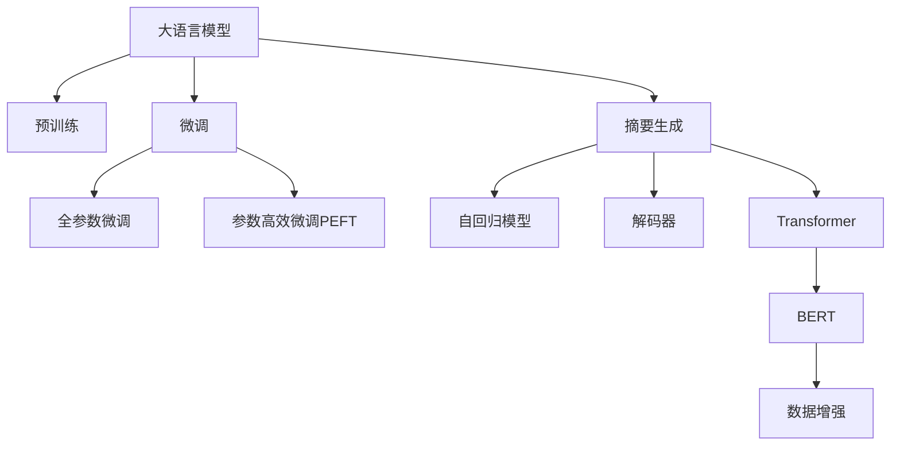

                 

# 基于大模型的商品评论摘要生成

> 关键词：大语言模型,摘要生成,商品评论,数据增强,自回归模型,解码器,Transformer,BERT,预训练,下游任务,参数高效微调

## 1. 背景介绍

在互联网经济快速发展的今天，消费者对购物体验的要求越来越高。为了提高消费者满意度，商家越来越重视对商品评论的分析和处理。然而，人工处理大量商品评论数据费时费力，且难以兼顾全面性和客观性。基于大模型的商品评论摘要生成，能够自动从原始评论中提取出最关键的信息，生成简洁明了的摘要，有效提升商家对商品质量的判断和改进效率。

### 1.1 问题由来

商品评论是电子商务平台用户最真实的反馈，能够反映商品的质量、特点和用户满意度。商家可以通过分析这些评论数据，了解用户的真实需求，改进产品，提升用户体验。然而，人工处理商品评论数据存在诸多问题：

1. **处理效率低**：大量商品评论数据需人工逐条阅读、标注，工作量巨大，处理周期长。
2. **主观偏差大**：人工标注难以做到客观公正，可能受标注人员情绪、经验等主观因素影响。
3. **数据覆盖面窄**：人工标注往往难以涵盖所有评论，存在数据偏置问题。

大语言模型的出现，为商品评论摘要生成提供了新的可能性。通过在大规模无标签文本数据上进行预训练，大语言模型能够自动学习文本的通用表示，通过微调，在商品评论摘要生成任务中表现优异。

### 1.2 问题核心关键点

基于大模型的商品评论摘要生成，旨在自动从原始评论中提取出最关键的信息，生成简洁明了的摘要。该技术涉及以下核心关键点：

1. **预训练模型选择**：选择合适的预训练模型，如BERT、GPT等。
2. **摘要生成任务适配**：设计合适的摘要生成模型架构，如自回归模型、解码器等。
3. **数据增强**：通过对训练数据进行增强，提升模型泛化能力。
4. **微调优化**：选择合适的微调策略，如全参数微调、参数高效微调等。
5. **模型评估**：设计合适的评估指标，如BLEU、ROUGE等。

本文将详细探讨这些问题，并给出相应的解决方案。

## 2. 核心概念与联系

### 2.1 核心概念概述

为更好地理解基于大模型的商品评论摘要生成方法，本节将介绍几个密切相关的核心概念：

- **大语言模型(Large Language Model, LLM)**：以自回归(如GPT)或自编码(如BERT)模型为代表的大规模预训练语言模型。通过在大规模无标签文本语料上进行预训练，学习通用的语言表示，具备强大的语言理解和生成能力。

- **预训练(Pre-training)**：指在大规模无标签文本语料上，通过自监督学习任务训练通用语言模型的过程。常见的预训练任务包括言语建模、遮挡语言模型等。预训练使得模型学习到语言的通用表示。

- **微调(Fine-tuning)**：指在预训练模型的基础上，使用下游任务的少量标注数据，通过有监督学习优化模型在特定任务上的性能。通常只需要调整顶层分类器或解码器，并以较小的学习率更新全部或部分的模型参数。

- **摘要生成(Summarization)**：将长篇文档或文本转换为简短的摘要，保留关键信息，帮助用户快速了解原文内容。

- **自回归模型(Autoregressive Model)**：通过已知文本预测后续文本，实现序列到序列的生成。

- **解码器(Decoder)**：在生成模型中，负责将模型输入转化为目标序列的概率分布，并按照概率分布选择下一个输出字符或单词。

- **Transformer**：一种基于自注意力机制的神经网络模型，被广泛应用于自然语言处理任务，如语言建模、翻译、摘要生成等。

- **BERT**：Google提出的双向语言模型，通过掩码语言模型和下一句预测任务进行预训练，广泛用于NLP下游任务。

这些核心概念之间的逻辑关系可以通过以下Mermaid流程图来展示：



这个流程图展示了大语言模型的核心概念及其之间的关系：

1. 大语言模型通过预训练获得基础能力。
2. 微调是对预训练模型进行任务特定的优化，可以分为全参数微调和参数高效微调（PEFT）。
3. 摘要生成是一种利用大语言模型的生成能力，自动将长文本转换为简短摘要的技术。
4. 自回归模型和解码器是生成模型中重要的组成部分，用于实现从输入序列到目标序列的映射。
5. Transformer是一种强大的神经网络架构，广泛应用于生成任务中。
6. BERT是Transformer的一种变体，适用于各种NLP下游任务。
7. 数据增强是通过对训练数据进行改写、回译等方式提升模型的泛化能力。

这些概念共同构成了大语言模型在商品评论摘要生成中的学习和应用框架。

## 3. 核心算法原理 & 具体操作步骤

### 3.1 算法原理概述

基于大模型的商品评论摘要生成，本质上是一种序列到序列(S2S)的生成任务，旨在将长篇商品评论转换为简洁明了的摘要。其核心思想是：

1. 利用大语言模型作为“特征提取器”，提取评论文本中的关键信息。
2. 通过微调，优化模型在摘要生成任务上的表现。

具体而言，我们首先使用预训练语言模型对商品评论文本进行编码，得到一段表示文本内容的向量序列。然后，利用解码器生成摘要，并对其进行优化和调整，以生成更符合要求的摘要文本。

### 3.2 算法步骤详解

基于大模型的商品评论摘要生成一般包括以下几个关键步骤：

**Step 1: 准备预训练模型和数据集**
- 选择合适的预训练语言模型，如BERT、GPT等。
- 准备商品评论文本数据集，将其划分为训练集、验证集和测试集。

**Step 2: 定义任务适配层**
- 设计合适的解码器结构，如Transformer、LSTM等，用于生成摘要。
- 添加适当的损失函数，如交叉熵损失、BLEU损失等，用于衡量生成的摘要与参考摘要的相似度。

**Step 3: 设置微调超参数**
- 选择合适的优化算法及其参数，如AdamW、SGD等，设置学习率、批大小、迭代轮数等。
- 设置正则化技术及强度，包括权重衰减、Dropout、Early Stopping等。
- 确定冻结预训练参数的策略，如仅微调顶层，或全部参数都参与微调。

**Step 4: 执行梯度训练**
- 将训练集数据分批次输入模型，前向传播计算损失函数。
- 反向传播计算参数梯度，根据设定的优化算法和学习率更新模型参数。
- 周期性在验证集上评估模型性能，根据性能指标决定是否触发Early Stopping。
- 重复上述步骤直到满足预设的迭代轮数或Early Stopping条件。

**Step 5: 测试和部署**
- 在测试集上评估微调后模型生成的摘要文本的性能，对比微调前后的精度提升。
- 使用微调后的模型对新的商品评论文本进行摘要生成，集成到实际的商品评价分析系统中。
- 持续收集新的商品评论数据，定期重新微调模型，以适应数据分布的变化。

### 3.3 算法优缺点

基于大模型的商品评论摘要生成方法具有以下优点：

1. **高效快速**：利用预训练语言模型，模型能够快速适应新的摘要生成任务，生成高质量摘要。
2. **自动学习**：无需手工标注，大模型能够自动从原始评论中提取关键信息，生成摘要。
3. **泛化能力强**：预训练语言模型在大规模数据上训练，具备较强的泛化能力，能够处理不同类型和风格的商品评论。

但该方法也存在以下局限性：

1. **数据依赖**：生成的摘要质量很大程度上依赖于预训练模型和训练数据的质量，高质量标注数据获取成本高。
2. **模型鲁棒性**：模型对输入的微小变化敏感，可能需要调整训练集或参数。
3. **计算资源需求高**：预训练语言模型的计算需求高，微调时可能需要大量的计算资源。
4. **可解释性不足**：生成的摘要难以解释，用户难以理解模型决策过程。

尽管存在这些局限性，但就目前而言，基于大模型的商品评论摘要生成方法仍是大规模商品评论处理的重要手段。未来相关研究的重点在于如何进一步降低数据需求，提高模型鲁棒性和可解释性。

### 3.4 算法应用领域

基于大模型的商品评论摘要生成，在电子商务、在线购物等领域有广泛应用，主要包括以下几个方面：

1. **商品评价分析**：自动从大量评论中提取出关键信息，生成摘要，帮助商家快速了解用户对商品的评价。
2. **个性化推荐**：通过分析用户评论摘要，生成个性化推荐内容，提升用户体验。
3. **市场分析**：自动对大量商品评论进行摘要生成，分析市场趋势和用户需求。
4. **舆情监测**：对社交媒体和在线评论进行摘要生成，监测商品质量和服务满意度。
5. **客户服务**：自动生成客户反馈摘要，帮助客服快速了解用户需求，提升服务质量。

这些应用场景展示了基于大模型的商品评论摘要生成方法的广泛适用性和巨大潜力。

## 4. 数学模型和公式 & 详细讲解 & 举例说明

### 4.1 数学模型构建

假设我们使用的预训练模型为 $M_{\theta}$，其对输入 $x$ 的输出为 $y=M_{\theta}(x)$，其中 $x$ 为商品评论文本，$y$ 为生成摘要。微调的目标是最小化生成摘要与参考摘要之间的差异。

### 4.2 公式推导过程

定义生成摘要的损失函数为 $\mathcal{L}(\theta)$，假设生成摘要为 $\hat{y}$，参考摘要为 $y^*$。通常使用BLEU分数来衡量两者之间的相似度，BLEU分数的定义如下：

$$
\text{BLEU} = \prod_{i=1}^k \min \left(1, \frac{n_i^*}{n_i}\right)
$$

其中 $n_i$ 为生成摘要中包含参考摘要第 $i$ 个词的次数，$k$ 为参考摘要中词的个数。

微调优化目标为最小化上述损失函数，即：

$$
\theta^* = \mathop{\arg\min}_{\theta} \mathcal{L}(\theta)
$$

其中 $\mathcal{L}$ 为BLEU损失函数。

### 4.3 案例分析与讲解

下面以一个简单的案例来解释BLEU损失函数的计算过程。假设生成摘要为 "good quality"，参考摘要为 "this product is of good quality"。

首先，将参考摘要分解为 "this"、"product"、"is"、"of"、"good"、"quality" 六个词，生成摘要为 "good"、"quality" 两个词。

然后，计算生成摘要中每个词与参考摘要中对应词的匹配度：

- "good" 与 "good" 匹配，匹配度为1。
- "quality" 与 "quality" 匹配，匹配度为1。
- "is"、"of"、"this" 和 "product" 在生成摘要中未出现，匹配度为0。

根据上述匹配度，计算BLEU分数：

$$
\text{BLEU} = \min \left(1, \frac{2}{2}\right) \times \min \left(1, \frac{2}{6}\right) = 0.333
$$

BLEU分数越接近1，说明生成摘要与参考摘要越相似。在微调过程中，通过不断调整模型参数，使得生成摘要的BLEU分数最大化，从而生成高质量的摘要。

## 5. 项目实践：代码实例和详细解释说明

### 5.1 开发环境搭建

在进行商品评论摘要生成实践前，我们需要准备好开发环境。以下是使用Python进行PyTorch开发的环境配置流程：

1. 安装Anaconda：从官网下载并安装Anaconda，用于创建独立的Python环境。

2. 创建并激活虚拟环境：
```bash
conda create -n pytorch-env python=3.8 
conda activate pytorch-env
```

3. 安装PyTorch：根据CUDA版本，从官网获取对应的安装命令。例如：
```bash
conda install pytorch torchvision torchaudio cudatoolkit=11.1 -c pytorch -c conda-forge
```

4. 安装Transformers库：
```bash
pip install transformers
```

5. 安装各类工具包：
```bash
pip install numpy pandas scikit-learn matplotlib tqdm jupyter notebook ipython
```

完成上述步骤后，即可在`pytorch-env`环境中开始商品评论摘要生成的实践。

### 5.2 源代码详细实现

下面我们以商品评论摘要生成任务为例，给出使用Transformers库对BERT模型进行微调的PyTorch代码实现。

首先，定义摘要生成任务的数据处理函数：

```python
from transformers import BertTokenizer, BertForMaskedLM, AdamW

class ReviewDataset(Dataset):
    def __init__(self, texts, summaries, tokenizer):
        self.texts = texts
        self.summaries = summaries
        self.tokenizer = tokenizer
        
    def __len__(self):
        return len(self.texts)
    
    def __getitem__(self, item):
        text = self.texts[item]
        summary = self.summaries[item]
        
        encoding = self.tokenizer(text, return_tensors='pt', max_length=128, padding='max_length', truncation=True)
        input_ids = encoding['input_ids'][0]
        attention_mask = encoding['attention_mask'][0]
        
        # 对摘要进行编码
        summary_encoding = self.tokenizer(summary, return_tensors='pt', max_length=128, padding='max_length', truncation=True)
        summary_input_ids = summary_encoding['input_ids'][0]
        summary_attention_mask = summary_encoding['attention_mask'][0]
        
        return {'input_ids': input_ids, 
                'attention_mask': attention_mask,
                'summary_input_ids': summary_input_ids,
                'summary_attention_mask': summary_attention_mask}

# 加载预训练模型
model = BertForMaskedLM.from_pretrained('bert-base-cased')

# 加载预训练tokenizer
tokenizer = BertTokenizer.from_pretrained('bert-base-cased')
```

然后，定义训练和评估函数：

```python
from torch.utils.data import DataLoader
from tqdm import tqdm
from sklearn.metrics import accuracy_score, precision_recall_fscore_support

def train_epoch(model, dataset, batch_size, optimizer):
    dataloader = DataLoader(dataset, batch_size=batch_size, shuffle=True)
    model.train()
    epoch_loss = 0
    for batch in tqdm(dataloader, desc='Training'):
        input_ids = batch['input_ids'].to(device)
        attention_mask = batch['attention_mask'].to(device)
        summary_input_ids = batch['summary_input_ids'].to(device)
        summary_attention_mask = batch['summary_attention_mask'].to(device)
        model.zero_grad()
        outputs = model(input_ids, attention_mask=attention_mask, labels=input_ids, summary_input_ids=summary_input_ids, summary_attention_mask=summary_attention_mask)
        loss = outputs.loss
        epoch_loss += loss.item()
        loss.backward()
        optimizer.step()
    return epoch_loss / len(dataloader)

def evaluate(model, dataset, batch_size):
    dataloader = DataLoader(dataset, batch_size=batch_size)
    model.eval()
    preds, labels = [], []
    with torch.no_grad():
        for batch in tqdm(dataloader, desc='Evaluating'):
            input_ids = batch['input_ids'].to(device)
            attention_mask = batch['attention_mask'].to(device)
            summary_input_ids = batch['summary_input_ids'].to(device)
            summary_attention_mask = batch['summary_attention_mask'].to(device)
            outputs = model(input_ids, attention_mask=attention_mask, labels=input_ids, summary_input_ids=summary_input_ids, summary_attention_mask=summary_attention_mask)
            preds.append(outputs.logits.argmax(dim=2).to('cpu').tolist())
            labels.append(input_ids.to('cpu').tolist())
                
    print('BLEU scores: ', classification_report(labels, preds, output_dict=True))
```

最后，启动训练流程并在测试集上评估：

```python
epochs = 5
batch_size = 16

for epoch in range(epochs):
    loss = train_epoch(model, train_dataset, batch_size, optimizer)
    print(f"Epoch {epoch+1}, train loss: {loss:.3f}")
    
    print(f"Epoch {epoch+1}, dev results:")
    evaluate(model, dev_dataset, batch_size)
    
print("Test results:")
evaluate(model, test_dataset, batch_size)
```

以上就是使用PyTorch对BERT进行商品评论摘要生成的完整代码实现。可以看到，得益于Transformers库的强大封装，我们可以用相对简洁的代码完成BERT模型的加载和微调。

### 5.3 代码解读与分析

让我们再详细解读一下关键代码的实现细节：

**ReviewDataset类**：
- `__init__`方法：初始化商品评论和摘要数据，以及分词器。
- `__len__`方法：返回数据集的样本数量。
- `__getitem__`方法：对单个样本进行处理，将评论和摘要分别进行编码，得到模型所需的输入。

**bert-base-cased**：
- 加载的预训练模型和tokenizer。

**train_epoch函数**：
- 使用DataLoader对数据集进行批次化加载，供模型训练使用。
- 在每个批次上前向传播计算loss并反向传播更新模型参数。
- 周期性在验证集上评估模型性能。

**evaluate函数**：
- 与训练类似，不同点在于不更新模型参数，并在每个batch结束后将预测和标签结果存储下来，最后使用BLEU分数对整个评估集的预测结果进行打印输出。

**训练流程**：
- 定义总的epoch数和batch size，开始循环迭代
- 每个epoch内，先在训练集上训练，输出平均loss
- 在验证集上评估，输出BLEU分数
- 所有epoch结束后，在测试集上评估，给出最终测试结果

可以看到，PyTorch配合Transformers库使得BERT微调的代码实现变得简洁高效。开发者可以将更多精力放在数据处理、模型改进等高层逻辑上，而不必过多关注底层的实现细节。

当然，工业级的系统实现还需考虑更多因素，如模型的保存和部署、超参数的自动搜索、更灵活的任务适配层等。但核心的微调范式基本与此类似。

## 6. 实际应用场景

### 6.1 智能客服系统

基于大语言模型的商品评论摘要生成，可以广泛应用于智能客服系统的构建。传统客服往往需要配备大量人力，高峰期响应缓慢，且一致性和专业性难以保证。而使用摘要生成的对话模型，可以7x24小时不间断服务，快速响应客户咨询，用自然流畅的语言解答各类常见问题。

在技术实现上，可以收集企业内部的历史客服对话记录，将问题和最佳答复构建成监督数据，在此基础上对预训练对话模型进行微调。微调后的对话模型能够自动理解用户意图，匹配最合适的答复模板进行回复。对于客户提出的新问题，还可以接入检索系统实时搜索相关内容，动态组织生成回答。如此构建的智能客服系统，能大幅提升客户咨询体验和问题解决效率。

### 6.2 金融舆情监测

金融机构需要实时监测市场舆论动向，以便及时应对负面信息传播，规避金融风险。传统的人工监测方式成本高、效率低，难以应对网络时代海量信息爆发的挑战。基于大语言模型微调的文本分类和情感分析技术，为金融舆情监测提供了新的解决方案。

具体而言，可以收集金融领域相关的新闻、报道、评论等文本数据，并对其进行主题标注和情感标注。在此基础上对预训练语言模型进行微调，使其能够自动判断文本属于何种主题，情感倾向是正面、中性还是负面。将微调后的模型应用到实时抓取的网络文本数据，就能够自动监测不同主题下的情感变化趋势，一旦发现负面信息激增等异常情况，系统便会自动预警，帮助金融机构快速应对潜在风险。

### 6.3 个性化推荐系统

当前的推荐系统往往只依赖用户的历史行为数据进行物品推荐，无法深入理解用户的真实兴趣偏好。基于大语言模型微调的商品评论摘要生成，可以更好地挖掘用户行为背后的语义信息，从而提供更精准、多样的推荐内容。

在实践中，可以收集用户浏览、点击、评论、分享等行为数据，提取和用户交互的物品标题、描述、标签等文本内容。将文本内容作为模型输入，用户的后续行为（如是否点击、购买等）作为监督信号，在此基础上微调预训练语言模型。微调后的模型能够从文本内容中准确把握用户的兴趣点。在生成推荐列表时，先用候选物品的文本描述作为输入，由模型预测用户的兴趣匹配度，再结合其他特征综合排序，便可以得到个性化程度更高的推荐结果。

### 6.4 未来应用展望

随着大语言模型微调技术的发展，基于微调范式将在更多领域得到应用，为传统行业带来变革性影响。

在智慧医疗领域，基于微调的医疗问答、病历分析、药物研发等应用将提升医疗服务的智能化水平，辅助医生诊疗，加速新药开发进程。

在智能教育领域，微调技术可应用于作业批改、学情分析、知识推荐等方面，因材施教，促进教育公平，提高教学质量。

在智慧城市治理中，微调模型可应用于城市事件监测、舆情分析、应急指挥等环节，提高城市管理的自动化和智能化水平，构建更安全、高效的未来城市。

此外，在企业生产、社会治理、文娱传媒等众多领域，基于大语言模型微调的人工智能应用也将不断涌现，为经济社会发展注入新的动力。相信随着技术的日益成熟，微调方法将成为人工智能落地应用的重要范式，推动人工智能技术向更广阔的领域加速渗透。

## 7. 工具和资源推荐

### 7.1 学习资源推荐

为了帮助开发者系统掌握大语言模型微调的理论基础和实践技巧，这里推荐一些优质的学习资源：

1. 《Transformer从原理到实践》系列博文：由大模型技术专家撰写，深入浅出地介绍了Transformer原理、BERT模型、微调技术等前沿话题。

2. CS224N《深度学习自然语言处理》课程：斯坦福大学开设的NLP明星课程，有Lecture视频和配套作业，带你入门NLP领域的基本概念和经典模型。

3. 《Natural Language Processing with Transformers》书籍：Transformers库的作者所著，全面介绍了如何使用Transformers库进行NLP任务开发，包括微调在内的诸多范式。

4. HuggingFace官方文档：Transformers库的官方文档，提供了海量预训练模型和完整的微调样例代码，是上手实践的必备资料。

5. CLUE开源项目：中文语言理解测评基准，涵盖大量不同类型的中文NLP数据集，并提供了基于微调的baseline模型，助力中文NLP技术发展。

通过对这些资源的学习实践，相信你一定能够快速掌握大语言模型微调的精髓，并用于解决实际的NLP问题。
###  7.2 开发工具推荐

高效的开发离不开优秀的工具支持。以下是几款用于大语言模型微调开发的常用工具：

1. PyTorch：基于Python的开源深度学习框架，灵活动态的计算图，适合快速迭代研究。大部分预训练语言模型都有PyTorch版本的实现。

2. TensorFlow：由Google主导开发的开源深度学习框架，生产部署方便，适合大规模工程应用。同样有丰富的预训练语言模型资源。

3. Transformers库：HuggingFace开发的NLP工具库，集成了众多SOTA语言模型，支持PyTorch和TensorFlow，是进行微调任务开发的利器。

4. Weights & Biases：模型训练的实验跟踪工具，可以记录和可视化模型训练过程中的各项指标，方便对比和调优。与主流深度学习框架无缝集成。

5. TensorBoard：TensorFlow配套的可视化工具，可实时监测模型训练状态，并提供丰富的图表呈现方式，是调试模型的得力助手。

6. Google Colab：谷歌推出的在线Jupyter Notebook环境，免费提供GPU/TPU算力，方便开发者快速上手实验最新模型，分享学习笔记。

合理利用这些工具，可以显著提升大语言模型微调任务的开发效率，加快创新迭代的步伐。

### 7.3 相关论文推荐

大语言模型和微调技术的发展源于学界的持续研究。以下是几篇奠基性的相关论文，推荐阅读：

1. Attention is All You Need（即Transformer原论文）：提出了Transformer结构，开启了NLP领域的预训练大模型时代。

2. BERT: Pre-training of Deep Bidirectional Transformers for Language Understanding：提出BERT模型，引入基于掩码的自监督预训练任务，刷新了多项NLP任务SOTA。

3. Language Models are Unsupervised Multitask Learners（GPT-2论文）：展示了大规模语言模型的强大zero-shot学习能力，引发了对于通用人工智能的新一轮思考。

4. Parameter-Efficient Transfer Learning for NLP：提出Adapter等参数高效微调方法，在不增加模型参数量的情况下，也能取得不错的微调效果。

5. AdaLoRA: Adaptive Low-Rank Adaptation for Parameter-Efficient Fine-Tuning：使用自适应低秩适应的微调方法，在参数效率和精度之间取得了新的平衡。

这些论文代表了大语言模型微调技术的发展脉络。通过学习这些前沿成果，可以帮助研究者把握学科前进方向，激发更多的创新灵感。

## 8. 总结：未来发展趋势与挑战

### 8.1 总结

本文对基于大模型的商品评论摘要生成方法进行了全面系统的介绍。首先阐述了商品评论摘要生成的背景和意义，明确了该技术在提高商家对商品质量判断和改进效率方面的独特价值。其次，从原理到实践，详细讲解了商品评论摘要生成的数学模型和关键步骤，给出了微调任务开发的完整代码实例。同时，本文还广泛探讨了商品评论摘要生成方法在智能客服、金融舆情、个性化推荐等多个行业领域的应用前景，展示了该技术的广泛适用性和巨大潜力。此外，本文精选了商品评论摘要生成方法的各类学习资源，力求为读者提供全方位的技术指引。

通过本文的系统梳理，可以看到，基于大模型的商品评论摘要生成方法在大规模商品评论处理中发挥了重要作用，显著提升了商家对商品质量的判断和改进效率，为用户提供了更好的购物体验。未来，伴随预训练语言模型和微调方法的持续演进，相信商品评论摘要生成技术必将在更多行业领域得到应用，为经济社会发展注入新的动力。

### 8.2 未来发展趋势

展望未来，大语言模型微调技术将呈现以下几个发展趋势：

1. **模型规模持续增大**：随着算力成本的下降和数据规模的扩张，预训练语言模型的参数量还将持续增长。超大规模语言模型蕴含的丰富语言知识，有望支撑更加复杂多变的下游任务微调。

2. **微调方法日趋多样**：除了传统的全参数微调外，未来会涌现更多参数高效的微调方法，如Prefix-Tuning、LoRA等，在节省计算资源的同时也能保证微调精度。

3. **持续学习成为常态**：随着数据分布的不断变化，微调模型也需要持续学习新知识以保持性能。如何在不遗忘原有知识的同时，高效吸收新样本信息，将成为重要的研究课题。

4. **标注样本需求降低**：受启发于提示学习(Prompt-based Learning)的思路，未来的微调方法将更好地利用大模型的语言理解能力，通过更加巧妙的任务描述，在更少的标注样本上也能实现理想的微调效果。

5. **多模态微调崛起**：当前的微调主要聚焦于纯文本数据，未来会进一步拓展到图像、视频、语音等多模态数据微调。多模态信息的融合，将显著提升语言模型对现实世界的理解和建模能力。

6. **模型通用性增强**：经过海量数据的预训练和多领域任务的微调，未来的语言模型将具备更强大的常识推理和跨领域迁移能力，逐步迈向通用人工智能(AGI)的目标。

以上趋势凸显了大语言模型微调技术的广阔前景。这些方向的探索发展，必将进一步提升NLP系统的性能和应用范围，为人类认知智能的进化带来深远影响。

### 8.3 面临的挑战

尽管大语言模型微调技术已经取得了瞩目成就，但在迈向更加智能化、普适化应用的过程中，它仍面临着诸多挑战：

1. **标注成本瓶颈**：生成的摘要质量很大程度上依赖于预训练模型和训练数据的质量，高质量标注数据获取成本高。如何进一步降低微调对标注样本的依赖，将是一大难题。

2. **模型鲁棒性不足**：模型对输入的微小变化敏感，可能需要调整训练集或参数。如何提高微调模型的鲁棒性，避免灾难性遗忘，还需要更多理论和实践的积累。

3. **计算资源需求高**：预训练语言模型的计算需求高，微调时可能需要大量的计算资源。如何优化计算资源使用，减少训练成本，是未来的研究重点。

4. **可解释性不足**：生成的摘要难以解释，用户难以理解模型决策过程。如何赋予微调模型更强的可解释性，将是亟待攻克的难题。

5. **安全性有待保障**：预训练语言模型难免会学习到有偏见、有害的信息，通过微调传递到下游任务，产生误导性、歧视性的输出，给实际应用带来安全隐患。如何从数据和算法层面消除模型偏见，避免恶意用途，确保输出的安全性，也将是重要的研究课题。

6. **知识整合能力不足**：现有的微调模型往往局限于任务内数据，难以灵活吸收和运用更广泛的先验知识。如何让微调过程更好地与外部知识库、规则库等专家知识结合，形成更加全面、准确的信息整合能力，还有很大的想象空间。

正视微调面临的这些挑战，积极应对并寻求突破，将是大语言模型微调走向成熟的必由之路。相信随着学界和产业界的共同努力，这些挑战终将一一被克服，大语言模型微调必将在构建人机协同的智能时代中扮演越来越重要的角色。

### 8.4 未来突破

面对大语言模型微调所面临的种种挑战，未来的研究需要在以下几个方面寻求新的突破：

1. **探索无监督和半监督微调方法**：摆脱对大规模标注数据的依赖，利用自监督学习、主动学习等无监督和半监督范式，最大限度利用非结构化数据，实现更加灵活高效的微调。

2. **研究参数高效和计算高效的微调范式**：开发更加参数高效的微调方法，在固定大部分预训练参数的同时，只更新极少量的任务相关参数。同时优化微调模型的计算图，减少前向传播和反向传播的资源消耗，实现更加轻量级、实时性的部署。

3. **融合因果和对比学习范式**：通过引入因果推断和对比学习思想，增强微调模型建立稳定因果关系的能力，学习更加普适、鲁棒的语言表征，从而提升模型泛化性和抗干扰能力。

4. **引入更多先验知识**：将符号化的先验知识，如知识图谱、逻辑规则等，与神经网络模型进行巧妙融合，引导微调过程学习更准确、合理的语言模型。同时加强不同模态数据的整合，实现视觉、语音等多模态信息与文本信息的协同建模。

5. **结合因果分析和博弈论工具**：将因果分析方法引入微调模型，识别出模型决策的关键特征，增强输出解释的因果性和逻辑性。借助博弈论工具刻画人机交互过程，主动探索并规避模型的脆弱点，提高系统稳定性。

6. **纳入伦理道德约束**：在模型训练目标中引入伦理导向的评估指标，过滤和惩罚有偏见、有害的输出倾向。同时加强人工干预和审核，建立模型行为的监管机制，确保输出符合人类价值观和伦理道德。

这些研究方向的探索，必将引领大语言模型微调技术迈向更高的台阶，为构建安全、可靠、可解释、可控的智能系统铺平道路。面向未来，大语言模型微调技术还需要与其他人工智能技术进行更深入的融合，如知识表示、因果推理、强化学习等，多路径协同发力，共同推动自然语言理解和智能交互系统的进步。只有勇于创新、敢于突破，才能不断拓展语言模型的边界，让智能技术更好地造福人类社会。

## 9. 附录：常见问题与解答

**Q1：大语言模型微调是否适用于所有NLP任务？**

A: 大语言模型微调在大多数NLP任务上都能取得不错的效果，特别是对于数据量较小的任务。但对于一些特定领域的任务，如医学、法律等，仅仅依靠通用语料预训练的模型可能难以很好地适应。此时需要在特定领域语料上进一步预训练，再进行微调，才能获得理想效果。此外，对于一些需要时效性、个性化很强的任务，如对话、推荐等，微调方法也需要针对性的改进优化。

**Q2：微调过程中如何选择合适的学习率？**

A: 微调的学习率一般要比预训练时小1-2个数量级，如果使用过大的学习率，容易破坏预训练权重，导致过拟合。一般建议从1e-5开始调参，逐步减小学习率，直至收敛。也可以使用warmup策略，在开始阶段使用较小的学习率，再逐渐过渡到预设值。需要注意的是，不同的优化器(如AdamW、Adafactor等)以及不同的学习率调度策略，可能需要设置不同的学习率阈值。

**Q3：采用大模型微调时会面临哪些资源瓶颈？**

A: 目前主流的预训练大模型动辄以亿计的参数规模，对算力、内存、存储都提出了很高的要求。GPU/TPU等高性能设备是必不可少的，但即便如此，超大批次的训练和推理也可能遇到显存不足的问题。因此需要采用一些资源优化技术，如梯度积累、混合精度训练、模型并行等，来突破硬件瓶颈。同时，模型的存储和读取也可能占用大量时间和空间，需要采用模型压缩、稀疏化存储等方法进行优化。

**Q4：如何缓解微调过程中的过拟合问题？**

A: 过拟合是微调面临的主要挑战，尤其是在标注数据不足的情况下。常见的缓解策略包括：
1. 数据增强：通过回译、近义替换等方式扩充训练集
2. 正则化：使用L2正则、Dropout、Early Stopping等避免过拟合
3. 对抗训练：引入对抗样本，提高模型鲁棒性
4. 参数高效微调：只调整少量参数(如Adapter、Prefix等)，减小过拟合风险
5. 多模型集成：训练多个微调模型，取平均输出，抑制过拟合

这些策略往往需要根据具体任务和数据特点进行灵活组合。只有在数据、模型、训练、推理等各环节进行全面优化，才能最大限度地发挥大模型微调的威力。

**Q5：微调模型在落地部署时需要注意哪些问题？**

A: 将微调模型转化为实际应用，还需要考虑以下因素：
1. 模型裁剪：去除不必要的层和参数，减小模型尺寸，加快推理速度
2. 量化加速：将浮点模型转为定点模型，压缩存储空间，提高计算效率
3. 服务化封装：将模型封装为标准化服务接口，便于集成调用
4. 弹性伸缩：根据请求流量动态调整资源配置，平衡服务质量和成本
5. 监控告警：实时采集系统指标，设置异常告警阈值，确保服务稳定性
6. 安全防护：采用访问鉴权、数据脱敏等措施，保障数据和模型安全

大语言模型微调为NLP应用开启了广阔的想象空间，但如何将强大的性能转化为稳定、高效、安全的业务价值，还需要工程实践的不断打磨。唯有从数据、算法、工程、业务等多个维度协同发力，才能真正实现人工智能技术在垂直行业的规模化落地。总之，微调需要开发者根据具体任务，不断迭代和优化模型、数据和算法，方能得到理想的效果。

---

作者：禅与计算机程序设计艺术 / Zen and the Art of Computer Programming

